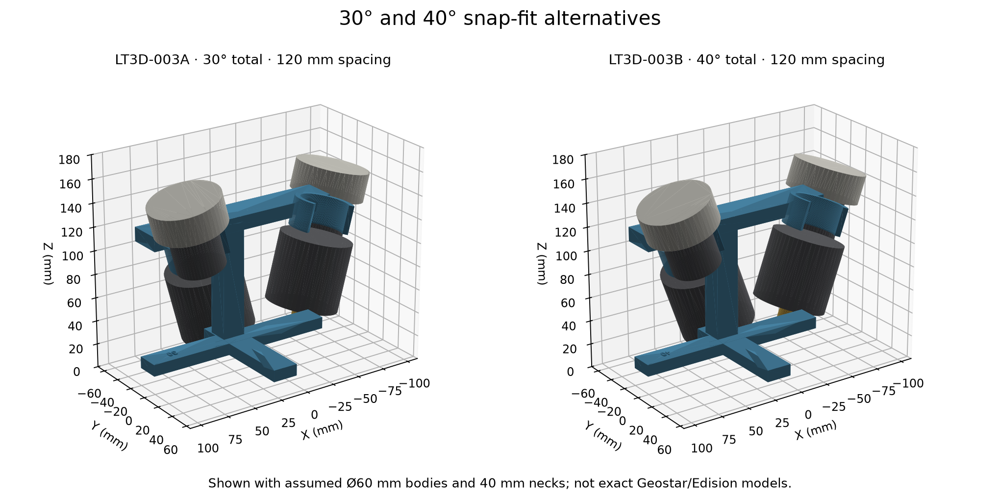
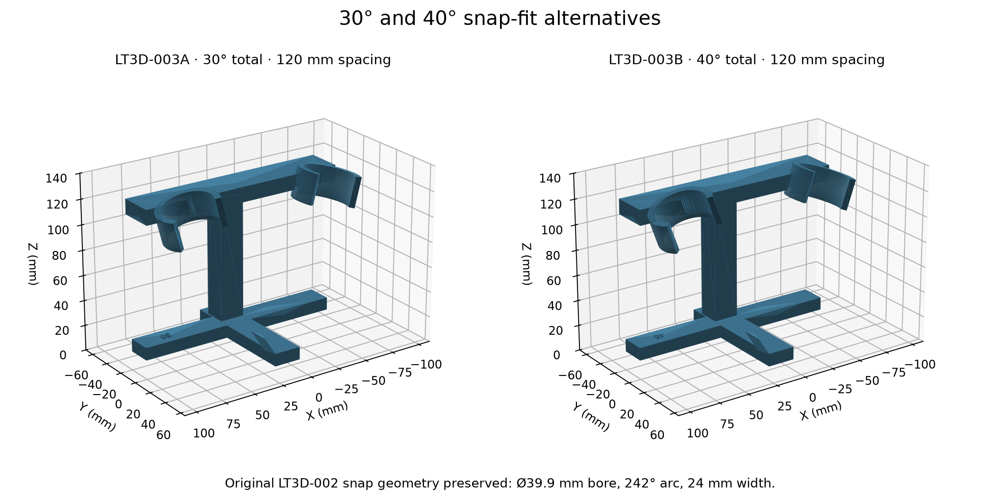

# LT3D-003 — 30° and 40° dual-LNBF snap stands

Two printable **prototypes**, preserving the working LT3D-002 neck fit and
opening. Body fit remains conditional: exact Geostar/Edision part numbers and
body dimensions were not supplied, and matching consumer STEP files could not
be obtained. The assemblies show explicitly assumed clearance bodies.

| Part | Printable mount | Editable solid | Included angle |
|---|---|---|---:|
| LT3D-003A | [30° STL](LT3D-003A-30deg-snap-stand.stl) | [30° STEP](LT3D-003A-30deg-snap-stand.step) | 30° (±15°) |
| LT3D-003B | [40° STL](LT3D-003B-40deg-snap-stand.stl) | [40° STEP](LT3D-003B-40deg-snap-stand.step) | 40° (±20°) |
| LT3D-003C | [Fit coupon STL](LT3D-003C-snap-fit-test.stl) | Generated from the same clip function | 10 mm coupon width |

Use the **mount-only STL** for printing. The assemblies contain placeholder
LNBs and must not be printed as a complete assembly:
[30° assembly](LT3D-003A-ASSUMED-wide60-assembly.step),
[40° assembly](LT3D-003B-ASSUMED-wide60-assembly.step).



## Fit preserved

- Bore **39.9 mm diameter / 19.95 mm radius**, for the working nominal 40 mm neck.
- Wall thickness **4.5 mm**, clip axial width **24 mm**.
- C-clip sweep **242°**, with the same 118° opening toward local +Y.
- Same **160 angular stations**, including the original polygonal inner surface.
- No keys, pads, roll teeth, set screws or reinforcement added to the clip arms.

The tests compare every unplaced clip boundary vertex against the original
LT3D-002 generator, and compare solid volume. Thus this preserves the actual
polygonal contact surface, not just a rounded specification. Printed fit still
depends on material, orientation and printer settings. The 40 mm rigid model
intentionally intersects the 39.9 mm bore by 0.05 mm radially; this is retained
fit interference, not a failed body clearance check. Snap deformation is not
simulated.

## Geometry changes

Both versions use **120 mm neck-axis spacing** and **115 mm ring-center height**.
Using one spacing isolates included angle when comparing these two prototypes.
It does not preserve the old 80 mm baseline for comparisons with DS11.

The support moves rearward: a 20 × 18 mm stem centered at Y = −46 mm,
a bridge extending from Y = −50 to −21.5 mm, and a 12 mm bridge height. The
bridge stays behind the neck bore. The crossed foot has a 166 × 20 × 10 mm
cross arm and a 22 × 100 × 10 mm fore/aft arm; its front reaches Y = +35 mm.
The base has an embossed **30** or **40** mark. There is still no roll index or
positive roll lock.

| Variant | Mount envelope X × Y × Z | CAD solid volume |
|---|---|---:|
| 30° | 173.4 × 100.0 × 132.9 mm | 163.4 cm³ |
| 40° | 174.2 × 100.0 × 134.6 mm | 163.4 cm³ |

Solid volume is not a slicer material estimate. With a level base, nominal
neck-axis elevations are 75° and 70°, respectively; the printed part does not
measure RF boresight, RF phase centers, cable mapping or actual installation pose.



## STEP references and clearance scenarios

Two actual Norsat STEP files were downloaded, inspected and rejected as mounting
references because they are flange-mount devices with no 40 mm neck. They also
fail full OCCT validity. See [source URLs, hashes and limitations](references/SOURCES.md).
No manufacturer model is presented as the user's hardware.

The two locally generated envelope STEP files use a common frame: neck midpoint
at the origin, feed toward +Z, and millimetres. These are design assumptions:

| Feature | Compact scenario | Wider scenario |
|---|---|---|
| Neck | Ø40 mm, Z = −18 to +18 mm | Same |
| Feed head | Ø60 mm, Z = +18 to +42 mm | Same |
| Lower body | Ø50 mm, Z = −65 to −18 mm | Ø60 mm, Z = −75 to −18 mm |
| Connector allowance | Ø12 mm, Z = −85 to −65 mm | Ø12 mm, Z = −95 to −75 mm |

Rotationally symmetric cylinders cover these stipulated envelopes for any roll,
but do not establish the shape of the actual LNBs. They do not cover side-facing
connectors, wider shoulders, a shorter clear neck, weather boots, or cable bend
radius. Bare connector clearance is not a cable-routing guarantee.

| CAD minimum distance | 30° | 40° |
|---|---:|---:|
| Compact LNB to LNB | 38.06 mm | 28.55 mm |
| Wider LNB to LNB | 23.22 mm | 12.32 mm |
| Wider non-neck parts to mount | 5.79 mm | 3.57 mm |
| Wider connector bottom above print bed | 21.68 mm | 23.68 mm |
| Wider connector to mount | 23.78 mm | 20.84 mm |

These are 3D boundary distances from the solid model, not the earlier
single-cross-section approximation. Both scenarios have zero body/head/connector
intersection with the stand and zero LNB-to-LNB intersection. Only the deliberate
neck interference remains. Tests also sample a +Y insertion path for non-neck
parts; this is not a continuous swept-volume or elastic snap analysis.

## Print and use

Print the crossed foot flat on the bed, keeping the same material and neck-fit
settings that worked before. Supports are needed beneath the elevated bridge
and clips. The original design recommends PETG or ASA, 0.2 mm layers, four
perimeters and 25% infill; use the prior successful settings as the starting
point. The unchanged coupon is available if the printer/material has changed.

These are geometry-checked prototypes, not strength-, wind-, or stability-rated
hardware. Before committing to a full print, compare the actual lower body and
neck shoulder positions with the table above, including the installed connector
and cable. The 40° design has the tighter shoulder clearance.

Any installation change requires new capture pose metadata; do not relabel old
DS11 recordings or reuse their baseline/tilt authority for this mount. No radio
configuration or pose authority is changed by these CAD files.

## Regeneration and checks

```sh
cd 3d_prints/LT3D-003-angled-dual-lnbf-snap-stand
uv run --no-project --with cadquery==2.8.0 --with numpy --with trimesh --with matplotlib python generate.py
uv run --no-project --with cadquery==2.8.0 --with numpy --with trimesh --with pytest python -m pytest test_design.py -q
```

[generate.py](generate.py) generates the mount STLs, solid STEPs, two envelope
STEPs, coloured assembly STEPs, figures and [verification.json](verification.json).
Tests cover unchanged clip vertices, actual axis separation, common spacing,
single-solid geometry, flat bases, surrogate clearances, sampled insertion,
watertight exported STLs, STEP round trips and the explicitly rejected downloads.
Original LT3D-001 and LT3D-002 files are preserved. A material geometry change
after this prototype is adopted should receive a new revision/part identifier.

Validation on 2026-09-30: **14 tests passed in 17.14 seconds**. Both exported
mount STLs are watertight, positive-volume single bodies. The two downloaded
Norsat references remain explicitly rejected; their invalid topology is not
hidden by the passing prototype tests.
