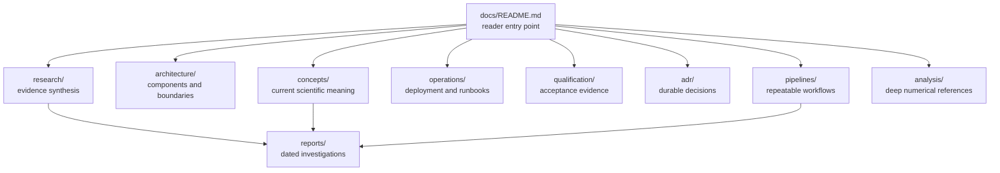

# LEO Tracker documentation

## Motivation

LEO Tracker combines RF acquisition, immutable recording storage, numerical
analysis, scientific controls, operations, and a browser. A reader should be
able to enter the documentation from the question they have instead of first
learning the repository's history.

## Problem

The repository contains detailed design notes, qualification receipts, and
dated investigations, but they serve different purposes. A dated report may be
excellent evidence without describing the current production path. A plan may
explain why a component exists without proving that it is deployed. A figure
may show a real signal while still being candidate-only. Reading those sources
without a map makes it easy to confuse implementation, evidence, and intent.

## Solution

This directory is the stable documentation entrance. It separates current
concepts, architecture, repeatable pipelines, operations, qualification,
decisions, and historical evidence. The canonical scientific claim is
deliberately narrow: the recordings contain strong, repeatable evidence for the
published Qin edge-pilot structure and coherent receiver-relative CFO
trajectories; they do not yet support payload decoding, absolute range, or
secure satellite identity.

## Method

The pages below were synthesized from the current source tree, public
contracts, tests, 45 versioned Markdown report assets, their recorded-data
figures and machine-readable results, the protected corpus inventory, and the
two primary signal-structure papers cited by the implementation. Every
canonical page starts with the same four sections—Motivation, Problem,
Solution, Method—so it remains understandable when read alone.

## Start here

| Reader question | Canonical page |
|---|---|
| What do we currently know about the transmissions? | [Starlink downlink and known-pilot evidence](concepts/starlink-transmissions.md) |
| How is the software divided and where does data flow? | [System architecture](architecture/system-overview.md) |
| How is a normal recording processed? | [Standard analysis pipeline](pipelines/standard-analysis.md) |
| How should a scientific question be investigated? | [Research analysis pipeline](pipelines/research-analysis.md) |
| Which reports support each conclusion? | [Research evidence ledger](research/evidence-ledger.md) |
| How should another page be written? | [Documentation standard](contributing/documentation.md) |
| How is production operated? | [Operator runbook](operations/runbook.md) |
| How is a release qualified? | [Release qualification](operations/release-qualification.md) |

## Documentation map

The arrow into `reports/` means “supported by,” not “superseded by.” Reports
remain immutable evidence. Canonical pages state the current synthesis and link
back to the exact report and figure that support it.

## Truth hierarchy

When sources disagree, use this order:

1. **Immutable persisted contracts and source bindings** define what a
   published product means.
2. **Current code and component-owned tests** define what the deployed
   implementation does.
3. **Reviewed qualification receipts and golden fixtures** establish bounded
   behavior for an exact release and input.
4. **Canonical pages in `docs/`** synthesize the current understanding.
5. **Dated reports** preserve the evidence and interpretation available at one
   point in time.
6. **Plans and proposals** describe intended work, not necessarily current
   behavior.

If code and a canonical page disagree, the page is stale. Fix the page in the
same change that establishes the new behavior. Do not alter a golden fixture or
historical report merely to make the narrative agree.

## Scientific claim ladder

The project uses the following vocabulary consistently:

| Level | Meaning | Current status |
|---|---|---|
| Recorded energy | RF energy exists in the selected band | Established for many captures |
| Known-pilot response | Exact Qin pilot beats a matched rolled-pilot control | Established in reviewed windows and scans |
| QAM quality | The 300 × 8 published 4QAM pilot matrix demodulates with useful accuracy | Established, candidate-only |
| CFO trajectory | Independently acquired pilot candidates form reproducible frequency-time structure | Established, with alias and selection caveats |
| Local phase/rate lock | Frame-local pilot phase and CFO pass coverage, control, prediction, and agreement gates | Established intermittently |
| Starlink-format candidate | Evidence is consistent with the published universal Starlink edge pilot | Supported wording |
| Starlink spacecraft identity | A specific emitter is associated securely with a catalogued satellite | Not established |
| Payload decoding | User/header payload bits are recovered | Not implemented or claimed |
| Navigation observable | Absolute phase, code phase, pseudorange, range, or position is qualified | Not established |

“Complete” in a numerical result means the bounded computation completed. It
does not promote the scientific claim to a higher row.

## One real-data view of the current system

*Recorded-data figure: one deployed Standard result for
`cap-20260821T190912-ffd441556880`, `stream-0/RX1`. It shows 17 qualified local
pilot-Doppler windows among 170 evaluated windows. The local rates are
receiver-relative and candidate-only; see the [piecewise pilot-Doppler
report](../reports/2026_08_23_piecewise_pilot_doppler_rate.md).*

This figure illustrates the documentation policy: show accepted and rejected
evidence together, identify the recording and transformation, and state the
limit of the claim next to the image.

## Existing detailed references

The new hierarchy does not discard the repository's detailed material:

- `analysis/` contains numerical deep dives, contracts, and integration plans.
- `operations/` contains deploy, acquisition, retention, soak, and recovery
  procedures.
- `qualification/` contains exact evidence and acceptance receipts.
- `adr/` contains decisions that should not be rediscovered in prose.
- `standard-pipeline-handoffs/` preserves implementation handoff records.
- [`../reports/`](../reports/) contains dated research and operational reports;
  use the [evidence ledger](research/evidence-ledger.md) to find the current
  disposition of each group.
- [`../corpus/`](../corpus/) contains protected-corpus manifests and immutable
  scientific goldens. Raw IQ is intentionally not embedded in documentation.

## Maintenance rule

A change that affects a public product, detector meaning, pipeline stage,
scientific gate, CLI workflow, or operator action must update its canonical
page. New pages follow the [documentation standard](contributing/documentation.md).
New scientific figures should be generated by a versioned report tool from
digest-bound evidence, not edited by hand.
