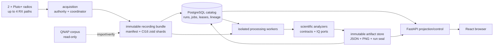
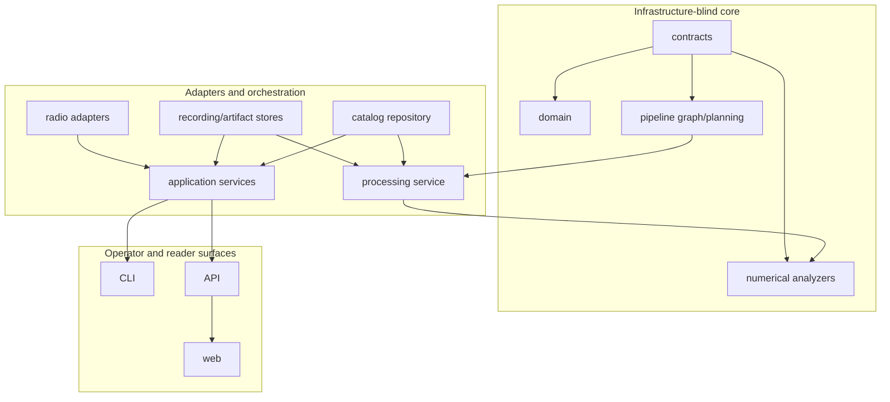
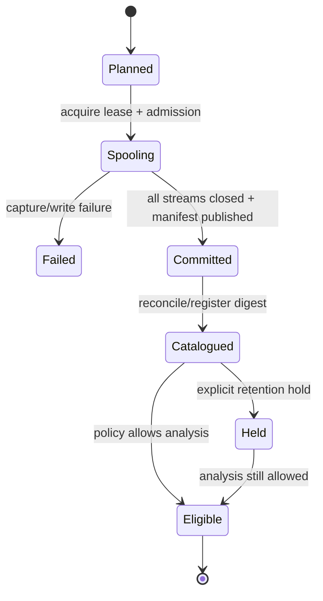
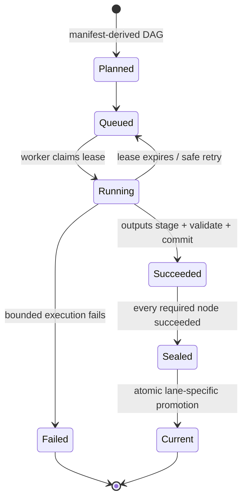

# System architecture

## Motivation

LEO Tracker must preserve scientific meaning while moving large immutable IQ
recordings through hardware, storage, scheduling, numerical analysis,
publication, and presentation. The architecture exists to make every scientific
product traceable to exact input bytes and configuration without coupling the
science to a particular database, filesystem path, radio library, CLI, or HTTP
server.

## Problem

RF acquisition and scientific analysis fail in different ways. Hardware can
retune slowly or stop streaming; files can be partial; jobs can be duplicated
or lose leases; numerical searches can truncate bounded inventories; and a
browser can accidentally make a candidate look authoritative. Direct imports
between these concerns would make failure recovery unsafe and scientific
lineage unverifiable.

## Solution

The repository uses contract-first components and narrow ports. Acquisition
publishes immutable recording bundles. PostgreSQL owns lifecycle, search,
leases, lineage, and current-run pointers. Analysis consumes only verified IQ
ports and versioned contracts. Artifact stores publish content-addressed
products atomically. API and browser code project those products without
changing scientific bytes. QNAP adapters are read-only provenance sources.

## Method

This description is derived from all 237 Python modules under `src/leo`, the
React client, migrations, deployment units, public contracts, component tests,
and the current Standard and Research registries. Runtime counts are taken
from the current source: a normal two-radio/two-receiver recording expands to
12 jobs; the registry declares 41 output specifications across five analyzer
types, producing 134 scoped product instances for that four-path run.

## Context diagram

The arrows describe authority, not only byte movement. For example, a worker
may read IQ from local storage, but it cannot publish a successful product
unless the catalog still grants its exact job lease.

## Non-negotiable invariants

- `leo-tracker` and `leo-tracker-redux` are numerical references, never runtime
  dependencies.
- Public persisted contracts are immutable within a published major version.
- Components exchange contracts or narrow ports, not private ORM rows or
  constructed storage paths.
- Analyzers do not import PostgreSQL, FastAPI, Typer, or concrete storage.
- Paths below `/mnt/qnap01` are read-only. No repository code may delete, move,
  rename, or rewrite them.
- Raw recordings and successfully published analysis products are immutable.
- Replacement analysis becomes current only after every required job succeeds
  and the run seals.
- Scientific goldens change only through explicit review, never because a test
  happens to fail.
- Hardware, PostgreSQL, QNAP, and real-corpus requirements are explicit test
  markers rather than silent skips.
- “Quick,” “Standard,” and “Research” describe resource policy, not scientific
  confidence.

## Component map

| Package | Responsibility | Depends on / communicates through |
|---|---|---|
| `leo.contracts` | Versioned persisted models, closed enums, digests, scientific gates | Pydantic and pure values only |
| `leo.domain` | Small in-process IQ/profile concepts | Contracts and NumPy values |
| `leo.radio` | Pluto anti-corruption adapter and deterministic fakes | `RadioSource`/scanner ports |
| `leo.acquisition` | Admission, exclusive radio authority, synchronized bounded capture | Radio ports, recording writer, clock port |
| `leo.storage` | Crash-safe recording/scanner stores, verified readers, logical URI confinement | Filesystem behind store interfaces |
| `leo.importing` | Digest-verified corpus and recording ingest | Recording contracts and stores |
| `leo.catalog` | PostgreSQL persistence for recordings, runs, jobs, releases, holds, lineage | SQLAlchemy/PostgreSQL; never imported by analyzers |
| `leo.pipeline` | Stage/product contracts, scopes, DAG compilation, derivation identity | Pure contracts |
| `leo.processing` | Job leases, worker isolation, output budgets, commit/finalize | Catalog and IQ/artifact ports |
| `leo.analysis` | Infrastructure-blind quality, power, waterfall, pilot, trajectory, phase, and sky computations | NumPy, contracts, `IqReader`, `OutputSink` |
| `leo.scanner` | Capture-first retuned scanner and retune-bounded analysis | Scanner radio/source contracts |
| `leo.sky` | TLE parsing, SGP4 propagation, coordinate frames, screening, Doppler | Pure inputs; no catalog access |
| `leo.application` | Use cases combining ports: reprocess, calibration, campaigns, presentation | Narrow catalog/store/service interfaces |
| `leo.presentation` | Bounded read models and PNG projection from persisted science | Product repositories; no scientific mutation |
| `leo.api` | HTTP routes and production composition | Application and presentation ports |
| `leo.cli` | Local operator commands and production composition | Application services |
| `leo.qualification` | Release, soak, capture-mode, calibration, and legacy-oracle evidence | Explicit marked external dependencies |
| `leo.operations` | Reconciliation, retention, TLE archive/collection | Catalog/store ports |
| `leo.station` | Digest-pinned hardware path and fixture authority | Hardened no-follow JSON readers |

## Contract and port boundary

The key direction is inward: adapters implement ports required by the core.
The numerical core never reaches outward to discover a database row or path.

## Recording lifecycle

### Acquisition authority

`LocalCaptureAuthority` owns pause state and kernel-enforced, host-local radio
locks. `AuthorizedAcquisitionApplication` obtains one atomic capability for the
exact radio set. `AcquisitionCoordinator` prepares radios concurrently,
validates applied settings, releases them at one common target, streams bounded
refills, and publishes only after all streams close. A cancellation takes
effect at a safe refill boundary.

Queue backpressure uses deterministic 20/10 hysteresis and fails closed if it
cannot observe authoritative pressure. The durable scheduled-acquisition path
records its work before touching radios, so restart does not create a second
capture for the same scheduled slot.

### Recording publication

`RecordingBundleWriter` writes to a spool directory, closes independently
compressed shards, publishes a canonical manifest, fsyncs the necessary
directories, and atomically exposes the final bundle. `RecordingStore` later
verifies declared sizes and digests before returning an `IqReader`.

Public references are logical `bulk://` URIs. `BulkUriResolver` maps them under
one pinned local root and rejects traversal or symlink escapes. Components do
not reconstruct a path from a session ID.

## Analysis lifecycle

`compile_standard_run_plan` derives subjects from the immutable manifest. For a
two-radio recording with receivers 0 and 1 on each stream it creates:

| Scope | Jobs per scope | Total |
|---|---:|---:|
| Receiver path | `path-standard` + `path-alternate-tracks` | 8 |
| Radio | `radio-scientific-report` | 2 |
| Paired recording | `paired-scientific-report` + `paired-presentation` | 2 |
| **Run** |  | **12** |

`path-standard` is a fused job. Its 27 outputs still preserve separate product
kinds and source bindings; fusion avoids repeated IQ decompression and
cross-stage scheduling overhead. The additive alternate-track job reads the
persisted pilot product and never reads IQ.

Each worker runs a stage in an isolated process with a resource-class timeout,
per-product byte limit, aggregate output limit, and live lease. JSON is decoded
against the declared contract before publication. The catalog commits product
references and job success together. A run can only seal after the graph is
complete; promotion is lane-specific and atomic.

## Product identity and lineage

Scientific identity includes:

- recording manifest digest and exact receiver-path binding;
- pipeline lane and exact release SHA;
- stage configuration and implementation digests;
- predecessor product digests and source-binding envelopes;
- product kind and schema version; and
- canonical content digest.

This makes re-analysis additive. A new release or configuration creates a new
run; it does not rewrite old bytes. Identical active or completed tuples are
rejected to prevent duplicate work.

Research JSON uses `research.*` kinds and wraps the shared payload with a
definition-bound envelope. Research current pointers are independent from
Standard and cannot promote into Standard.

## Standard product inventory

The five analyzer types currently declare 41 output specifications:

| Analyzer | Outputs per execution | Role |
|---|---:|---|
| `path-standard` | 27 | Complete receiver-path science and presentation |
| `path-alternate-tracks` | 2 | Additive residual-Hough comparison |
| `radio-scientific-report` | 6 | Two-path radio reduction and PNGs |
| `paired-scientific-report` | 1 | Two-radio scientific reduction |
| `paired-presentation` | 5 | Pair-level PNGs |

For four paths, two radios, and one pair this yields
`4×27 + 4×2 + 2×6 + 1 + 5 = 134` scoped product instances. Identical product
kinds at different subjects are distinct because subject scope and lineage are
part of the catalog identity.

## Scanner boundary

The scanner is capture-first and retune-bounded. It captures all channel-edge
frames while holding the radio lease, releases the lease, and then analyzes the
closed sweep. A concatenated scanner payload is a storage coordinate; no phase,
CFO, or timing state may cross a retune.

*Recorded-data figure: an eight-edge stored scanner sweep. Red lines are hard
retune boundaries and amber spans are the exact windows handed to local pilot
tracking. Source: [scanner Standard analysis
report](../../reports/2026_08_23_scanner_standard_analysis.md).*

Scanner analysis shares the Qin pilot, independent acquisition, controls, and
local phase/rate estimator with the dwell path. It deliberately omits
multi-second trajectory association because the input geometry does not
support it.

## Presentation and control surfaces

The API serves bounded recording, subject, evidence, sky, and PNG projections.
The browser never recomputes scientific values. PNGs are rendered from durable
JSON or produced during analysis and are digest verified when served.

The browser can request Standard or Research re-analysis only when the
corresponding explicit control service is enabled. That queues an immutable
run; it does not mutate an existing run. Capture pause/resume, hardware access,
retention execution, and release cutover remain operator workflows with their
own authorization and audit boundaries.

## Deployment shape

Production uses immutable releases under `/opt/leo-tracker`, a `current`
symlink, systemd services/timers, PostgreSQL, and local bulk storage. The main
units are:

- `leo-acquisition.service` and the acquisition-soak variant;
- `leo-worker@.service` for leased jobs;
- `leo-api.service` for the LAN API/browser;
- reconciliation, retention, TLE collection, qualification, and release-
  qualification timers/services.

Deployment scripts validate metadata, stage a release, perform guarded
cutover, verify health, and retain rollback authority. See the
[production-deployment guide](../operations/production-deployment.md).

## Verification strategy

| Layer | Typical evidence |
|---|---|
| Pure contracts | closed schema tests, validation mutations, canonical digests |
| Numerical kernels | synthetic injection, numerical oracle parity, property tests |
| Component adapters | fake radio/store/catalog tests |
| Integration | isolated PostgreSQL schema and real filesystem publication |
| Protected corpus | explicit `real_corpus` tests against digest-pinned material |
| Hardware | explicit `hardware` tests and bounded qualification receipts |
| API/browser | FastAPI tests, Vitest, Playwright |
| Release | exact-revision qualification and post-cutover health receipts |

No optional external requirement should appear as a passing silent skip. The
markers in `pyproject.toml` make the dependency visible.

## Change guide

When extending the system:

1. define or reuse a contract and its owning component;
2. keep a pure numerical function behind an existing narrow port where
   possible;
3. add component-owned tests, including failure accounting;
4. add the product to source binding and output inventory if it is persisted;
5. update the [Standard](../pipelines/standard-analysis.md) or
   [Research](../pipelines/research-analysis.md) pipeline page;
6. publish real-data evidence only through a bounded, digest-recording report;
   and
7. change a public schema by adding a new version, never redefining the old one.

Measured need, rather than speculative scale, is the threshold for adding new
infrastructure beyond PostgreSQL and local filesystems.
