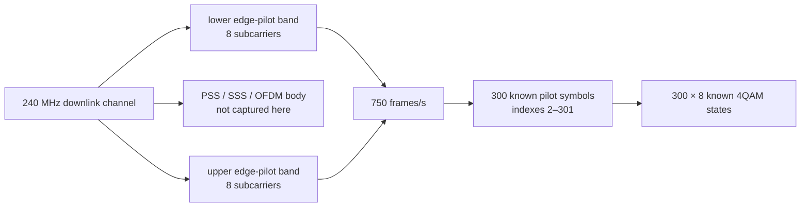
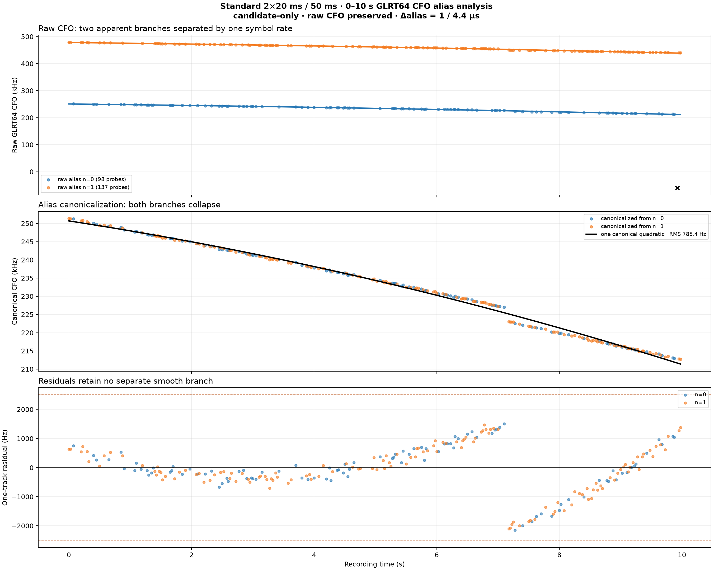
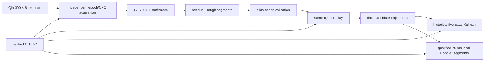

# Starlink downlink and known-pilot evidence

## Motivation

The project can only make useful scientific progress if “Starlink signal,”
“known pilot,” “carrier,” “track,” and “satellite” have distinct meanings. This
page states the best current understanding of the transmitted structure we
target, the structure actually visible in recorded IQ, and the claims the
processing pipeline can and cannot support.

## Problem

The receiver records a narrow edge-pilot band from a wide Starlink Ku-band
downlink. Its measurements combine propagation Doppler, transmitter behavior,
receiver and LNB clocks, acquisition aliases, frame-local phase state, and
capture continuity. A smooth frequency-time line can therefore be real without
being one satellite's pure orbital Doppler. Likewise, a universal known pilot
can identify waveform structure without identifying which spacecraft emitted
it.

## Solution

Treat the transmission as a hierarchy of evidence:

1. use the published Qin edge-pilot symbols as the only known-symbol truth;
2. search each probe independently for frame epoch and CFO;
3. retain raw CFO, symbol-rate alias identity, and replay-selected correction
   lift as separate quantities;
4. form and replay candidate trajectories without naming emitters;
5. estimate local phase and CFO rate only inside explicitly qualified
   continuous intervals; and
6. keep payload, absolute range, and satellite association outside the claim
   boundary until independent evidence closes those gaps.

## Method

This synthesis follows the constants and signal construction in
`leo.analysis.starlink.templates`, the acquisition and QAM implementations,
the Standard runner, primary descriptions by Qin et al. and Kozhaya et al., and
recorded-data reports through 2026-08-26. Numerical statements below link to
the exact report figures or machine-readable evidence. Results from a recording
later found to contain a manifest-mismatching shard are not used as current
proof unless a newer verified-IQ analysis independently reproduces the result.

## Executive understanding

The strongest supported statement is:

> The corpus contains repeatable, controlled, known-symbol evidence consistent
> with the published Starlink edge-pilot waveform, plus coherent
> receiver-relative CFO trajectories and intermittent local modulo-π phase
> locks.

The project has **not** decoded Starlink payload, established absolute carrier
phase or pseudorange, or securely associated a track with one NORAD object.
Those are separate future gates.

## Published structure and repository boundary

The primary literature describes a 240 MHz Starlink Ku-band OFDM downlink with
PSS/SSS synchronization, edge-pilot bands, and additional predictable or
low-entropy frame content. The repository deliberately implements a much
narrower slice:

| Structure | Literature | Repository |
|---|---|---|
| Full 240 MHz downlink channel | Described and captured in the cited work | Not captured by the 2.5 MS/s edge receiver |
| PSS and SSS | Published synchronization sequences | Not the current detector replica |
| Full OFDM beacon / low-entropy elements | Described by Kozhaya et al. and Qin et al. | Not implemented as a production replica |
| Edge-pilot bands | Eight predictable subcarriers at each channel edge | Implemented exactly from Qin Appendix A |
| Edge-pilot QAM | 300 known 4QAM states on each of eight subcarriers | Demodulated and scored; known symbols only |
| User/header payload | May occupy other resource elements | Not decoded or inspected by the pipeline |

Primary references:

- [Qin et al., “Pilots and Other Predictable Elements of the Starlink Ku-Band Downlink”](https://arxiv.org/abs/2602.02627)
- [Kozhaya, Saroufim, and Kassas, “Unveiling Starlink for PNT”](https://doi.org/10.33012/navi.685)

The papers motivate the detector and the PNT-like state models. They do not
turn this repository's narrowband, uncalibrated measurements into a reproduction
of either paper's complete receiver.

## Frame and pilot geometry

The implemented geometry is:

| Quantity | Value | Authority |
|---|---:|---|
| Frame rate | 750 Hz | `FRAME_RATE_HZ` |
| Frame period | 1.333… ms | reciprocal of frame rate |
| OFDM symbol duration | 4.4 µs | `OFDM_SYMBOL_DURATION_S` |
| Cyclic-prefix duration used by the template | 0.1333… µs | `CYCLIC_PREFIX_DURATION_S` |
| Subcarrier spacing | 234.375 kHz | `SUBCARRIER_SPACING_HZ` |
| Known pilot symbols per frame | 300, indexes 2–301 | Qin Appendix A implementation |
| Known subcarriers per edge | 8 | lower 528–535; upper 488–495 |
| Known states per edge/frame | 300 × 8 = 2,400 | 4QAM pilot matrix |
| Control sequence | same matrix rolled by 17 symbols | matched negative control |

At 2.5 MS/s, one 4.4 µs symbol is exactly 11 complex samples. A 20 ms
production probe contains about 15 complete 750 Hz frames. The receiver is
tuned around one eight-tone band; it does not downconvert the entire channel.

## Channel and receiver tuning

The code defines eight Qin/Starlink channels at 250 MHz spacing. The current
live acquisition subset is channels 1–4 because it is bounded by the supported
low-band RF chain.

| Channel | Lower edge RF center | Upper edge RF center | Lower/upper Pluto IF after 9.75 GHz LO |
|---:|---:|---:|---:|
| 1 | 10.7096875 GHz | 10.9403125 GHz | 959.6875 / 1,190.3125 MHz |
| 2 | 10.9596875 GHz | 11.1903125 GHz | 1,209.6875 / 1,440.3125 MHz |
| 3 | 11.2096875 GHz | 11.4403125 GHz | 1,459.6875 / 1,690.3125 MHz |
| 4 | 11.4596875 GHz | 11.6903125 GHz | 1,709.6875 / 1,940.3125 MHz |

The exact eight tones sit at
`−820312.5, −585937.5, −351562.5, −117187.5, +117187.5, +351562.5,
+585937.5, +820312.5 Hz` around the pilot-band center. The centering and
guard-band calculation are reviewed in the
[IF/DC-centering report](../../reports/2026_08_21_edge_pilot_if_dc_centering.md).

Recorded products currently label the working coordinate
`baseband_cfo_hz` and the frequency reference `uncalibrated_prior`. RF center
reconstruction is exact arithmetic; it is not an oscillator calibration.

## What the exact-pilot detector measures

For a retained timing/CFO candidate, the receiver derotates IQ, correlates the
known symbols, and compares the exact template with the 17-symbol-rolled
control on the same samples. The GLRT64 statistic coherently combines 64 pilot
symbols inside each frame and combines frame powers noncoherently. QAM analysis
demodulates all 300 × 8 known pilot states and reports accuracy, EVM, noise, and
confidence. Neither path reads unknown payload bits.

The six recorded probe-geometry experiments below illustrate the difference
between detection density and useful track retention.

*Recorded-data figure: trial 132, `stream-0/RX0`, lower edge. Every scheduled
probe independently searched −400 to +400 kHz. The 20 ms positive rate remains
near 24%; the 50 ms experiment reaches 27.08% but retains fewer trajectory
families. Source: [pilot-window geometry
report](../../reports/2026_08_26_20ms_window_comparison.md).*

Important interpretations:

- an exact-over-control margin is evidence for the published pilot sequence,
  not merely RF energy;
- high QAM accuracy applies to known pilot symbols, not payload;
- a single positive probe is not a time-coherent track;
- more probes and longer integration do not monotonically produce more useful
  physical hypotheses; and
- shared CFO seeds can manufacture visible one-second blocks, so production
  acquisition is independent per probe.

## Raw CFO, canonical identity, and correction lift

There are three different frequency values:

| Quantity | Meaning | May be overwritten? |
|---|---|---|
| Raw CFO | acquired CFO plus detector residual for one observation | Never |
| Canonical CFO | coordinate modulo the known symbol-rate ambiguity, used to group a family | No; store alongside raw CFO |
| Correction CFO | absolute alias lift selected by same-IQ replay and applied to IQ | No; preserve its replay evidence |

The relevant ambiguity is the reciprocal symbol duration,

\[
\Delta f_{alias}=1/T_{symbol}=227{,}272.727\ldots\ \mathrm{Hz}.
\]

It is close to, but distinct from, the 234.375 kHz subcarrier spacing. Apparent
parallel ridges one alias apart must not be counted as two emitters before
canonicalization.

*Recorded-data figure: the first ten seconds of trial 132, Standard 2 × 20 ms.
Of 236 high-gate observations, 235 collapse onto one canonical quadratic. A
two-branch model is worse by 14.67 BIC and 6.8 Hz held-out RMS. Source:
[CFO-alias canonicalization
report](../../reports/2026_08_26_cfo_alias_canonicalization.md).*

Same-IQ replay is decisive about the correction lift: the lower canonical
representative yields only 1/401 GLRT64 positives, while adding one exact alias
spacing yields 400/401 and 144 QAM-positive probes. Canonical identity is
therefore appropriate for grouping; the replay-selected lift is required for
dechirping.

## Frequency-time structure in recorded data

After independent acquisition and alias-aware grouping, the corpus repeatedly
shows strong, smooth CFO-time structure. The current interpretation is
piecewise:

\[
\hat f_m=f_D(t_m)+q_{r(m)}+e_m,
\]

where `f_D` is a locally smooth receiver-relative Doppler/clock term, `q_r` is
a segment-specific carrier bias or acquisition gauge, and `e_m` is measurement
error. A jump in `q_r` must not be converted into instantaneous spacecraft
acceleration.

For the best-studied verified interval:

- qualified 50–100 ms segments have a median direct local rate of
  −3.769 kHz/s;
- the multi-second frozen track is about −6.919 kHz/s;
- adjacent qualified segments often contain an unexplained approximately
  −318 Hz bias change; and
- a 10 ms local-linear smoother reaches 16.48 Hz held-out CFO RMS, close to the
  16.16 Hz reported frame-measurement uncertainty.

*Recorded-data figure: complete 750 Hz frame lattices from several historical
dwells. The binary-π model improves some intervals, but phase qualification is
intermittent. Source: [sub-second pilot-structure
report](../../reports/2026_08_22_subsecond_pilot_structure.md).*

The deployed Standard shadow product applies stricter 75 ms gates. Across five
reprocessed dwells it evaluated 2,525 windows and qualified 224. Local direct
and modulo-π Kalman rates agreed more closely with each other than either did
with the frozen multi-second derivative. This supports separate local-rate and
long-baseline association products.

## Carrier phase and timing

Frame-local phase is real in some intervals, but it is not an ordinary
seconds-long carrier phase.

The known-pilot channel can occupy two phase families separated by π. Squaring
the normalized complex observation removes the sign:

\[
\arg(z_m^2)=2\phi_m\pmod{2\pi}.
\]

This converts an adjacent binary transition into a 375 Hz half-frame-rate
frequency ambiguity. A modulo-π model reduced one verified 80 ms phase residual
from 1.695 rad to 0.151 rad and reached 0.978 coherent-stack efficiency. The
binary state is inferred, not decoded, and its cadence is not universal.

Across five additional phase-blind current-pipeline dwells, every one of 40
selected windows contained exact-pilot support and the rolled control supported
zero frames, yet only 3/40 windows passed the complete modulo-π lock gate. Pilot
presence and phase lock are therefore separate claims.

The timing state estimated from phase across the eight tones is
receiver-relative fractional-frame timing. It is **not** transmit time, code
phase, pseudorange, or absolute range. Phase accumulation stops at a failed
coverage/control/prediction gate or a real capture discontinuity.

## Trajectories, carriers, and targets

The project uses these nouns deliberately:

| Term | Repository meaning |
|---|---|
| Observation | One detector/method result for one acquired probe candidate |
| Canonical observation | Observation expressed modulo symbol-rate CFO ambiguity |
| Segment | Bounded degree-one association over observations, or a qualified local pilot interval |
| Trajectory | A fitted CFO-time hypothesis; may contain one or more segments |
| Correction lift | Integer alias and CFO curve selected by same-IQ replay |
| Carrier candidate | Signal hypothesis supported by correction/replay evidence |
| Target branch | Output of multi-target association; still not a spacecraft |
| Satellite association | External identity claim requiring orbital and nuisance-model controls |

The deterministic multi-target implementation can model births, deaths,
crossings, and duplicate suppression on canonical observations. It is covered
by component and performance tests, but it is not currently called by
`run_receiver_standard`; the production path still uses residual-Hough
segmentation, de-aliasing, lift replay, and final selection. Documentation and
UI must not imply that the Standard final bank is already a physical
multi-target solution.

## Satellite association status

Constant CFO rate is weak identity evidence. In the five-dwell causal-TLE
comparison, 15 linear radio tracks had a median nearest true-time rate error of
1,386.6 Hz/s, versus 1,333.0 Hz/s across deliberately wrong-time controls. The
radio tracks were real and highly linear, but true time was not unusually
predictive.

*Recorded-data figure: five dwells and strictly causal Space-Track snapshots.
The result supports coherent Starlink-format radio trajectories but no secure
spacecraft identity. Source: [five-dwell TLE
comparison](../../reports/2026_08_21_five_dwell_tle_cone.md).*

Timing, a nearby observer-site error, the 9.75 GHz LO arithmetic, and measured
two-LNB drift do not explain the full kHz/s discrepancy. Transmitter/beam
frequency steering, missing or wrong catalog objects, and signal-model error
remain live explanations. A secure identity requires held-out orbital curve
shape, wrong-time and wrong-satellite controls, stable identity across nuisance
models, calibrated capture authority, and replication across independent paths
or dwells.

## Processing path

See the [Standard pipeline](../pipelines/standard-analysis.md) for exact
products, gates, and commands, and the [Research pipeline](../pipelines/research-analysis.md)
for experiment design and promotion rules.

## Current unknowns and next discriminating work

Highest-value work uses existing IQ first:

1. run alias-canonical, strict degree-one final/replay analysis over a broader
   verified corpus;
2. integrate and evaluate the existing multi-target association after
   canonicalization, while preserving every raw observation and correction
   lift;
3. compare simultaneous receivers to separate common transmitter/geometry
   structure from independent LNB/receiver terms;
4. validate local rate and bias changes with injected known-pilot signals;
5. bind surveyed observer location and calibrated frequency/time reference into
   capture authority; and
6. require held-out orbital curvature and repeated identity before assigning a
   NORAD object.

New RF collection is not a default next step. Under repository policy it
requires explicit authorization, must be bounded to at most 30 minutes, and
must not displace recording UI/CLI or re-analysis of the existing corpus.

## Code and evidence map

| Concern | Current authority |
|---|---|
| Pilot constants and synthesis | `src/leo/analysis/starlink/templates.py` |
| Edge tuning and 9.75 GHz LO map | `src/leo/acquisition/starlink_tuning.py` |
| Independent epoch/CFO acquisition | `src/leo/analysis/starlink/acquisition.py` |
| Detector bank and GLRT64 | `src/leo/analysis/starlink/pilot_methods.py` |
| Known-pilot QAM and frame slope | `src/leo/analysis/qam/pilot.py` |
| Modulo-π PNT-like research filter | `src/leo/analysis/qam/pilot_pnt_kalman.py` |
| Residual-Hough association | `src/leo/analysis/residual_hough.py` |
| Alias mapping and lift replay | `src/leo/analysis/starlink/cfo_dealias.py` |
| Multi-target implementation | `src/leo/analysis/starlink/multi_target.py` |
| Deployed local pilot-Doppler segments | `src/leo/analysis/starlink/pilot_doppler_segments.py` |
| Complete receiver path | `src/leo/analysis/standard/runner.py` |
| Evidence dispositions | [Research evidence ledger](../research/evidence-ledger.md) |

## Claim checklist

Before describing a new result as more than candidate evidence, answer all of
these questions in its report:

- Were raw IQ and its manifest digest verified?
- Was each probe acquired independently?
- Did the exact pilot beat the rolled-pilot control on the same samples?
- Are raw CFO, canonical CFO, alias index, and correction lift preserved?
- Did held-out samples pass, rather than only training samples?
- Are capture gaps and retunes hard boundaries?
- Is phase modulo π or 2π, and is the choice justified?
- Are receiver, LNB, transmitter, and orbital contributions separated?
- Is a satellite identity stable across nuisance models and independent data?

If any answer is no, state the lower claim explicitly.
