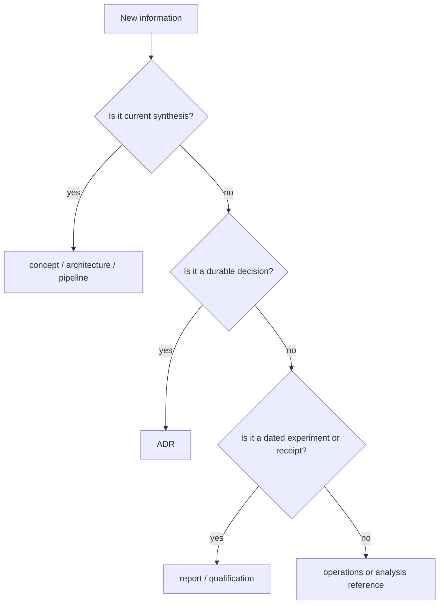
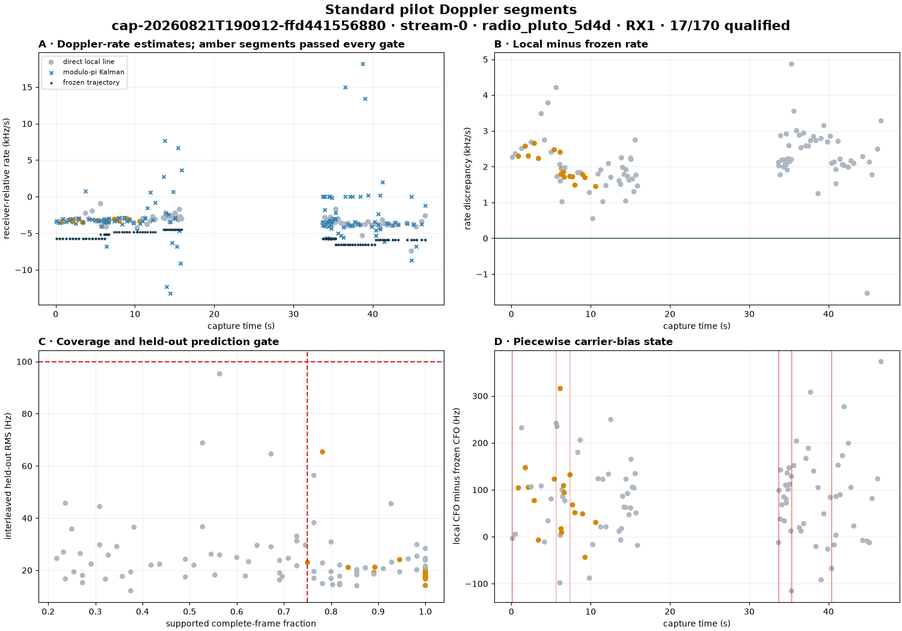

# Documentation standard

## Motivation

Documentation is part of the scientific and operational contract. A page
should explain why it exists, identify the exact problem it resolves, state the
current answer, and make the evidence reproducible even when a reader opens the
file directly instead of following repository history.

## Problem

Without a shared structure, plans, current behavior, dated evidence, and
operator procedures drift together. Pages become dependent on oral context;
figures lose their input provenance; stale topology survives beside deployed
code; and “complete,” “detected,” “track,” or “Starlink” can silently acquire a
stronger meaning than the data supports.

## Solution

Use a small documentation hierarchy, mandatory opening sections, evidence-led
visuals, explicit source authority, stable filenames, relative links, and a
review checklist. Canonical pages synthesize current behavior; ADRs preserve
decisions; reports preserve dated experiments; qualification and operations
pages preserve exact receipts and procedures.

## Method

These rules were derived from the repository's contract-first architecture,
immutable publication model, existing docs and reports, current real-data
figure bundles, and the requirements of readers who encounter a Markdown file
in isolation. They apply to every new canonical narrative page and to an
existing page when its scientific or operational narrative is substantively
rewritten. Historical receipts remain immutable unless their own correction
policy requires an additive erratum.

## Information architecture

Put a page where its main authority lives:

| Directory | Question answered | Lifetime |
|---|---|---|
| `docs/concepts/` | What does this scientific/domain term mean now? | Updated with understanding |
| `docs/architecture/` | Which component owns this behavior and how does data flow? | Updated with implementation |
| `docs/pipelines/` | How is a repeatable end-to-end workflow performed? | Updated with workflow/config |
| `docs/research/` | How does evidence combine across reports? | Updated as evidence changes |
| `docs/operations/` | How does an operator perform/recover a production action? | Exact current procedure |
| `docs/qualification/` | What proves a bounded release/campaign requirement? | Receipt-like; usually additive |
| `docs/adr/` | Why was a durable design choice made? | Immutable after acceptance; supersede additively |
| `docs/analysis/` | What deep numerical contract or implementation detail is needed? | Technical reference |
| `reports/` | What did one dated investigation observe? | Historical evidence; additive |

Do not create a new page merely because a section is long. Split when the new
file answers a different reader question, has a different authority/lifetime,
or can be linked as a stable reusable concept.



## Mandatory opening

Every new canonical narrative page starts immediately after its title with
these four level-two headings, in this order:

```markdown
# Descriptive page title

## Motivation

Why this capability or knowledge matters.

## Problem

The concrete ambiguity, failure mode, or operator/scientific need.

## Solution

The current repository answer and its claim boundary.

## Method

How the page was established: code, contracts, tests, reports, real data,
qualification, and version/date scope.
```

These are content obligations, not ceremonial labels:

- **Motivation** gives the reader a reason to care.
- **Problem** states the tension or failure mode precisely enough to recognize
  when the page applies.
- **Solution** leads with the current outcome, including what is deliberately
  not solved.
- **Method** identifies authority and provenance so a standalone reader can
  judge freshness.

After those sections, order the rest for the intended reader. A concept page
normally gives definitions before algorithms; a pipeline gives eligibility and
data flow before commands; an operator page gives preconditions and safety
before action; a report gives hypothesis and inputs before results.

## Page contract

A standalone page should contain or link to:

1. scope and intended reader;
2. current behavior or claim in the first screenful;
3. definitions for overloaded terms;
4. exact units, coordinate systems, and time/frequency authority;
5. inputs, outputs, ownership, and failure semantics;
6. a visualization when a relationship or recorded result is material;
7. source code/contracts/tests that define behavior;
8. dated reports or qualification receipts that support empirical claims;
9. known limitations and non-claims; and
10. the condition that would make the page stale.

Avoid an unexplained “see above,” “current,” “the system,” or path-dependent
instruction. Give enough identity that the page still makes sense from a
direct link.

## Filename and link conventions

Use lowercase kebab-case Markdown filenames that name the reader's subject:

- `starlink-transmissions.md`, not `notes2.md`;
- `standard-analysis.md`, not `pipeline-current-final.md`;
- a date prefix only for a time-bound report or receipt; and
- a version suffix only when two public versions must remain navigable at once.

Prefer stable directory/index links over duplicating content. Within Markdown,
use relative links so Git hosting and local renderers both work. Link the exact
report, figure, ADR, or canonical page—not a search result. Link source files
only when the repository browser can resolve them; otherwise name the module
and symbol in code formatting.

When a canonical page replaces an older plan, add a prominent supersession
notice to the old page and link forward. Do not erase the old design record.

## Visualization policy

Use the smallest visual that materially improves understanding:

| Relationship | Preferred form |
|---|---|
| Repeated exact values or mappings | Markdown table |
| Stage/data flow | Mermaid flowchart |
| Lifecycle or failure recovery | Mermaid state diagram |
| Hierarchy/ownership | Mermaid graph or compact tree |
| Measured signal behavior | Generated PNG/SVG from recorded data |
| Competing methods or controls | Plot showing all methods and denominators |

Real-data visuals are preferred wherever recorded evidence exists. Mermaid is
appropriate for architecture and method but is not empirical evidence. Do not
invent decorative plots or redraw measurements by hand.

Every empirical figure caption must state:

- recording/session and path or population;
- measured quantity and units;
- transformation/model applied;
- accepted/rejected or control status;
- source report; and
- claim limitation.

For example:



*Recorded `cap-20260821T190912-ffd441556880`, `stream-0/RX1`; 17 of 170
75 ms windows passed the complete local pilot-Doppler gate. The plot compares
direct, modulo-π Kalman, and frozen-track receiver-relative rates. Source:
[piecewise pilot-Doppler report](../../reports/2026_08_23_piecewise_pilot_doppler_rate.md).
It does not establish spacecraft identity.*

Store generated figures and adjacent JSON/CSV metrics under a dated
`reports/figures/<report-name>/` bundle. The versioned tool should create them
deterministically from digest-bound input. Documentation links to that asset;
it does not copy or retouch the image.

## Scientific language

Use nouns at the level the evidence supports:

| Prefer | Do not silently strengthen to |
|---|---|
| known-pilot response | decoded transmission |
| Starlink-format or Qin-pilot candidate | confirmed Starlink spacecraft |
| receiver-relative CFO trajectory | orbital Doppler of satellite N |
| modulo-π phase lock | absolute carrier phase |
| fractional-frame timing | code phase, pseudorange, or range |
| candidate/segment/trajectory | carrier/target/satellite interchangeably |
| computation completed | hypothesis established |

Always state the coordinate and calibration authority. Distinguish raw CFO,
canonical alias-family CFO, and replay correction lift. Distinguish exact pilot
from its rolled control, phase presence from qualified lock, and current
deployed code from a tested but uncalled implementation.

Use the [claim ladder](../README.md#scientific-claim-ladder) and [evidence
ledger](../research/evidence-ledger.md) as the shared vocabulary.

## Report-specific requirements

A new dated research report additionally records:

- hypothesis and predeclared success/failure gates;
- complete source binding, digest, sample range, and exclusions;
- exact command, code revision, and configuration;
- method comparison and matched negative controls;
- fit/selection/holdout separation;
- complete denominators and truncation;
- runtime, threads, and relevant resource bounds;
- machine-readable results beside every headline figure;
- conclusion, non-claims, and next falsifier; and
- whether the result is exploratory, supporting, or proposed for promotion.

Do not overwrite a historical report to conform cosmetically to this template.
Use an additive erratum or a new report when the input, method, or conclusion
changes.

## Code and documentation move together

Update the relevant canonical page in the same change when modifying:

- a public product kind or schema;
- source binding or scientific identity;
- detector/template meaning or numerical coordinate;
- sampling profile, gate, candidate bound, or failure accounting;
- pipeline topology, stage order, timeout, or promotion rule;
- operator command, API control, or recovery procedure; or
- a browser label that could alter scientific interpretation.

A code comment is not a substitute for a reader-facing contract. Conversely,
do not duplicate constants in prose without naming their source authority and
checking them in tests or documentation validation.

## Review checklist

Before merging a documentation change, verify:

- [ ] The page starts with Motivation, Problem, Solution, and Method in order.
- [ ] It states the current outcome and non-claims early.
- [ ] Current configuration/counts match code and component tests.
- [ ] Every local Markdown link and image path resolves.
- [ ] Every empirical claim links to versioned evidence.
- [ ] Figures use real recorded data where available and captions include
      provenance, denominator, units, and limits.
- [ ] Diagrams reflect the deployed call graph, not only an intended plan.
- [ ] Candidate, target, satellite, timing, phase, and CFO terms are precise.
- [ ] Old pages are linked as historical/superseded instead of silently
      contradicting the canonical page.
- [ ] No QNAP data is changed and no golden scientific fixture is regenerated.
- [ ] Commands were checked against current `--help`/CLI definitions.
- [ ] `git diff --check`, link validation, and relevant tests pass.

## Migrating legacy pages

Legacy plans, ADRs, qualification receipts, and dated reports are valuable
history and need not be bulk-reformatted. When one is still the best current
entry point, either:

1. revise it substantively into the canonical structure and validate every
   fact; or
2. add a short notice immediately after its title that identifies its
   historical role and links to the new canonical page.

Do not leave two pages both claiming to be current. The [documentation
hub](../README.md) owns navigation, while the canonical concept, architecture,
pipeline, and evidence pages own synthesis.
