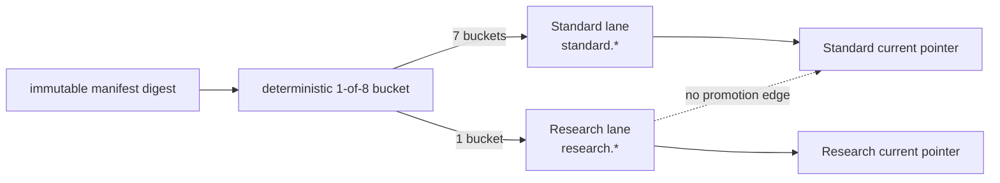
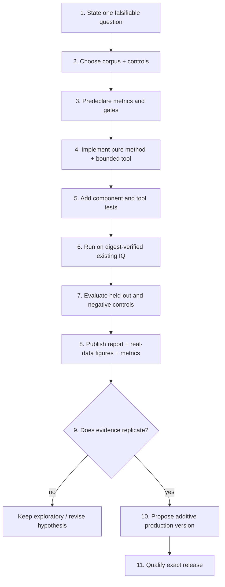

# Research analysis pipeline

## Motivation

Research analysis exists to answer narrower scientific questions with more
evidence per recording than the production profile can afford. It must make
experimentation repeatable without weakening Standard contracts or turning a
promising plot into a production claim.

## Problem

RF investigations are unusually vulnerable to selection effects. A shared CFO
seed can create artificial persistence; tuning on the same interval used for
evaluation can make a model look predictive; universal pilot structure can be
mistaken for satellite identity; and an exploratory script can omit failed
windows or runtime cost. If experimental products share the Standard namespace
or current pointer, readers cannot tell which guarantees apply.

## Solution

The repository provides two related but distinct research mechanisms:

1. a durable **Research lane** that runs the same manifest-derived graph as
   Standard under a denser, independently versioned configuration and writes
   only `research.*` products; and
2. bounded **offline report tools** that test one declared hypothesis on
   digest-bound existing recordings, preserve machine-readable evidence, and
   publish a dated report and figures for review.

Research never promotes itself as Standard. A successful experiment becomes a
production change only through a new contract/configuration version,
component-owned tests, representative held-out evidence, an exact release, and
an explicit Standard cutover.

## Method

This guide follows the Research lane contracts, deterministic lane assignment,
Research analyzer wrappers and configuration, processing timeouts, API/browser
controls, the report-tool/test pattern, all versioned reports through
2026-08-26, and the repository rule that development should iterate on the
existing on-disk corpus. No new RF collection is part of this workflow unless
the user explicitly authorizes a bounded campaign of at most 30 minutes.

## Choose the right path

| Need | Use | Durable result |
|---|---|---|
| Compare every standard product under a denser search | Research lane | Independent `research.*` run and current pointer |
| Diagnose one algorithm or one loss mechanism | Offline report tool | Dated report, figures, metrics, and tool/test revision |
| Establish release readiness | Standard + qualification | Reviewed exact-release evidence |
| Explore synthetic numerical behavior | Unit/property test or notebook-like tool | Reproducible fixture and bounded result |
| Collect different RF geometry | Explicitly authorized acquisition | New immutable recording; never implicit |

An offline report is not automatically a Research-lane result, and a Research
lane result is not automatically a production candidate. State which meaning
you use at the beginning of an investigation.

## Durable Research lane

The production Research-v1 registry wraps the same five analyzer types and 41
output declarations as Standard. Each JSON kind is namespaced and enclosed by
a definition-bound source envelope. The Research definition digest covers its
exact release, graph, configuration, and product namespace.

The production automatic policy hashes the immutable manifest digest with the
allocation epoch `standard10-dense-research-202608`. Bucket 0 of 8 is Research;
the other seven are Standard. The assignment is deterministic and persisted.
There is no “run Standard instead if Research is slow” fallback, because that
would bias the comparison population.

The browser/API also provides an explicit manual Research reprocess action when
the control service is configured. It queues an independent Research run for
the recording and leaves Standard independently current. There is no equivalent
operator CLI Research command at present.

## Standard and Research profiles

Both lanes use independent wide acquisition, the same Qin known pilot, the
same alias-aware graph, and the same source-binding discipline. They differ in
evidence density and resource policy:

| Parameter | Standard | Research |
|---|---:|---:|
| Probe starts per 50 ms | 0, 25 ms | 0, 15, 30 ms |
| Probe duration | 20 ms | 20 ms |
| Probes in complete 60 s | 2,400 | 3,600 |
| Coarse CFO step | 80 kHz | 10 kHz |
| Fine radius / step | ±80 kHz / 500 Hz | ±10 kHz / 100 Hz |
| Conditioned radius / step | ±2 kHz / 100 Hz | ±1 kHz / 25 Hz |
| Persisted candidates per probe | 10 | 32 |
| Candidates/probe entering Hough | 10 | 6 |
| Maximum Hough input for 60 s | 24,000 | 21,600 |
| GLRT size | 512 | 4,096 |
| Threads per path | 4 | 2 |
| Heavy-stage timeout | production heavy bound | 3 hours |
| Product namespace | `standard.*` | `research.*` |
| Standard promotion | allowed after seal | forbidden |

Research persists 32 candidates so competing basins remain inspectable but
sends only six per probe into residual-Hough. For 3,600 probes that is 21,600
points, below the immutable 25,000-point safety bound. This is explicit
truncation, not silent loss.

## Standard research workflow

### 1. State the question before tuning

A good research question names the comparison, population, and failure mode:

- “Does independent wide acquisition recover positives hidden by a shared
  trajectory seed?”
- “Does a modulo-π phase model improve held-out frame prediction without
  increasing rolled-control support?”
- “Does true-time TLE curve shape beat wrong-time and wrong-satellite controls
  after allowing the same nuisance parameters?”

Avoid goals such as “find more tracks” unless “track,” recovery, duplication,
and false-positive cost are predeclared.

### 2. Bind the evidence population

Record session ID, manifest digest, stream/radio/receiver, sample range, RF
center, Starlink edge, source type, software revision, configuration digest,
and any upstream product digests. Verify IQ through `RecordingStore`/`IqReader`
rather than opening a constructed path. Never write beneath `/mnt/qnap01`.

Use more than one independent dwell whenever the claim is expected to
generalize. Explain exclusions. A report built on a recording later shown to
have a manifest mismatch remains useful history but cannot be the sole current
proof.

### 3. Predeclare controls and metrics

At minimum, known-pilot work should compare the exact template with the
17-symbol-rolled control on the same IQ. Add controls appropriate to the claim:

| Claim | Minimum useful controls |
|---|---|
| Pilot specificity | rolled pilot, off-epoch/off-CFO, noise or wrong edge where appropriate |
| Trajectory recovery | independent-winner baseline, time permutation, duplicate/alias accounting |
| Phase continuity | held-out frames, ordinary-phase versus modulo-π, coverage gaps |
| Local rate | direct fit versus causal tracker, held-out CFO error, frozen-track comparison |
| Satellite association | wrong time, wrong satellite, nuisance-model sensitivity, held-out curve shape |
| Performance | complete inventory, wall time, CPU/thread policy, peak/output bounds |

Publish denominators and rejected cases. “3 locks” is not interpretable without
“of 40 selected windows” and the selection rule.

### 4. Separate fit, selection, and evaluation

Do not tune a model and quote its error on the same points. Use chronological
holdout, leave-one-dwell-out evaluation, or a predeclared split appropriate to
the dependence structure. Probe candidates sharing IQ are not independent
replicates. A line fitted to a trajectory cannot then be treated as external
evidence that the trajectory is linear.

The structure-aware holdout below illustrates the right question: which local
model predicts unseen CFO observations, and how close does it get to the
measurement floor?

*Recorded-data holdout from the [sub-second structure
report](../../reports/2026_08_22_subsecond_pilot_structure.md). A 10 ms local
linear smoother reached 16.48 Hz held-out RMS against a 16.16 Hz measurement
uncertainty; that supports a local model, not multi-second absolute phase.*

### 5. Implement the smallest reproducible change

Prefer a pure numerical function in `src/leo/analysis`, a bounded tool under
`tools/`, and component-owned tests. The analyzer must accept contracts and
narrow IQ/product ports; it must not import PostgreSQL, HTTP, CLI, or a concrete
store. Reuse the published Qin template and existing de-alias/phase primitives
instead of creating a second private signal definition.

Every loop over probes, candidates, tracks, aliases, or TLEs needs an explicit
bound and an accounting field for source count, returned count, and truncation.
Measure the existing implementation before adding infrastructure.

### 6. Publish a research receipt

A versioned report should contain:

- the standard Motivation, Problem, Solution, and Method sections;
- exact source bindings and software/configuration identities;
- the hypothesis and predeclared gates;
- accepted and rejected real-data views;
- negative and held-out controls;
- machine-readable metrics beside the figures;
- cost and truncation accounting;
- conclusions written at the supported claim level; and
- limitations, falsifiers, and the next decision.

Figures should be generated deterministically by the tool. Label axes, units,
session/path, transformations, accepted/rejected status, and sample support.
Never hand-edit a plot to hide a failed interval.

The five-dwell phase-blind check is a useful example of honest denominators:
all 40 selected windows supported the exact pilot, none supported the rolled
control, but only three passed the full modulo-π phase lock.

*Recorded-data replication from the [edge-pilot phase-slope
report](../../reports/2026_08_22_edge_pilot_phase_slope.md). Pilot presence and
phase lock remain separate claims.*

## Promotion into Standard

Promotion is a design and qualification action, never a pointer copy. Require:

1. a stable scientific definition and claim boundary;
2. replication on independent, digest-verified recordings;
3. matched negative controls and a held-out evaluation;
4. complete failure and truncation accounting;
5. bounded runtime demonstrated under normal multi-path contention;
6. a new additive contract/configuration/algorithm version where semantics
   change;
7. component-owned unit, property, integration, and protected-corpus tests as
   appropriate;
8. source binding and presentation updates;
9. updates to the canonical concept and pipeline documentation; and
10. exact-release qualification and explicit production cutover.

The production local pilot-Doppler monitor followed this pattern: offline phase
investigations exposed modulo-π behavior, multiple dwell checks bounded lock
frequency, the estimator became an additive product, and Standard retained the
historical Kalman result for comparison rather than silently redefining it.

## Current research priorities

The evidence ledger supports these priorities:

- explain segment-specific carrier bias changes without converting them into
  spacecraft acceleration;
- improve phase-lock coverage while preserving exact/rolled specificity and
  held-out prediction;
- evaluate deployed multi-target association before describing final banks as
  targets;
- identify an orbital association model that beats wrong-time and
  wrong-satellite controls; and
- retain truthful QAM, known-pilot, CFO, local rate, and scanner evidence across
  the existing corpus.

Payload decoding, absolute range/pseudorange, and secure NORAD identity remain
outside the current claim. New RF acquisition is not the default next step.

## Reproducing and reviewing work

Start with the report's recorded command and tool test. Use the repository
virtual environment and set `PYTHONPATH=src` when running a tool directly. Do
not substitute a different raw file or regenerate golden evidence because a
test fails. If protected corpus, PostgreSQL, QNAP, or hardware is required, the
test must carry its explicit marker.

Review a proposed report in this order:

1. verify every input digest and exclusion;
2. verify the code revision and command;
3. check independence of fit, selection, and evaluation;
4. inspect negative controls and rejected evidence before headline metrics;
5. reconcile denominators with machine-readable results;
6. check that alias, receiver clock, LNB drift, discontinuities, and timing
   uncertainty are treated as nuisance terms where relevant;
7. confirm cost and bounds; and
8. match every conclusion to the [scientific claim
   ladder](../README.md#scientific-claim-ladder).

Use the [evidence ledger](../research/evidence-ledger.md) to locate prior work
and the [documentation standard](../contributing/documentation.md) to add a
canonical page or report without fragmenting the hierarchy.
