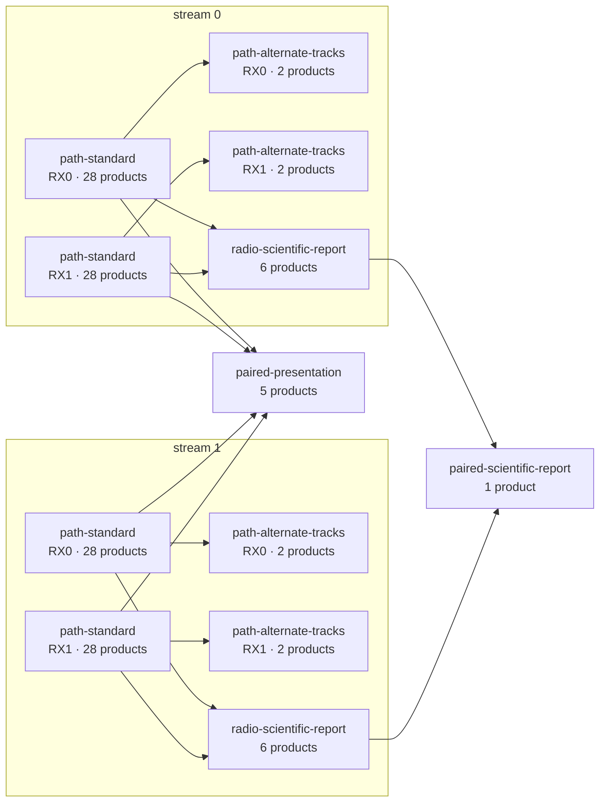
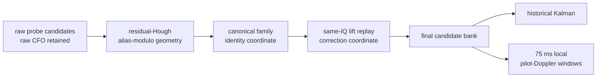
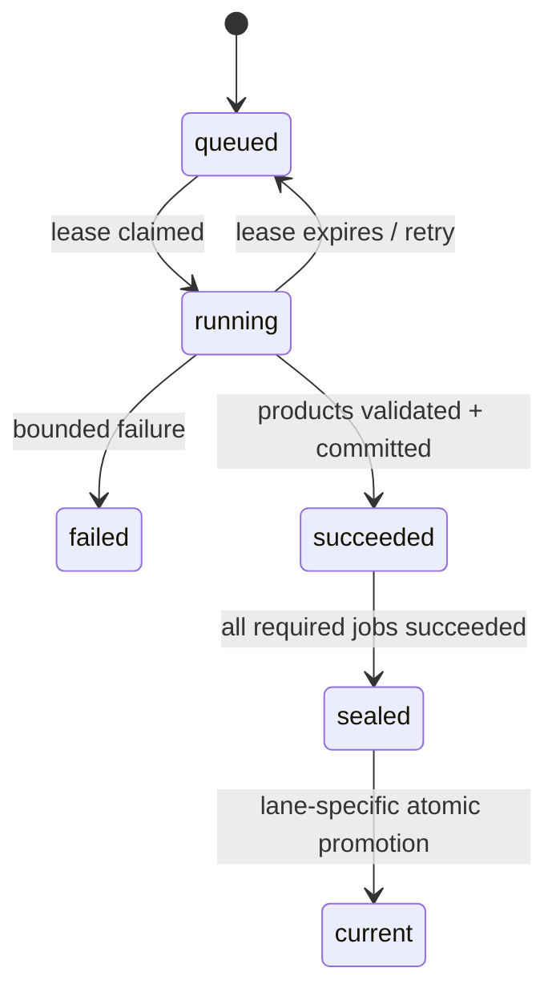

# Standard analysis pipeline

## Motivation

Standard analysis turns every eligible immutable recording into the same
bounded, reviewable set of quality, known-pilot, CFO-trajectory, local-Doppler,
reduction, and presentation products. It is the default answer to “what does
the current release say about this recording?”

## Problem

A 60-second, four-path CI16 recording is too large and scientifically subtle
for an ad hoc script. Probe timing must be independent, CFO aliases must remain
distinguishable from physical carriers, rejected candidates must remain
visible, and a partial or stale run must never appear current. Repeating IQ
decompression for every small stage also made the former expanded design more
expensive than the science required.

## Solution

The production pipeline compiles a manifest-derived 12-job DAG. Each receiver
path is processed once by one fused, isolated `path-standard` job that emits 28
separately typed products. A product-only alternate-track job follows it;
radio- and pair-scoped reducers then publish cross-path summaries. Products are
immutable and digest bound, and a lane-specific current pointer moves only
after the whole run seals.

## Method

This page follows `leo.pipeline.topology`, the production registry and
configuration in `leo.analysis.standard.analyzers`, the exact execution order
in `leo.analysis.standard.runner`, the source-binding declarations, processing
lease/commit code, CLI contracts, component tests, and the deployed
recorded-data reports through 2026-08-26. Values described as “current” are
checked against those sources rather than copied from the earlier Standard-v2
integration plan.

## When to use Standard

Use Standard when you need:

- the comparable, production-supported interpretation of a recording;
- browser-visible path, radio, and paired products;
- exact-release re-analysis and atomic current-run promotion;
- ordinary known-pilot, trajectory, replay, and local-rate monitoring; or
- a baseline against which a Research experiment will be evaluated.

Standard is not a confidence label. A completed Standard run can legitimately
contain no qualified Starlink-format candidates. Conversely, a strong
candidate remains candidate-only until the separate identity or navigation
gates described in [Starlink transmissions](../concepts/starlink-transmissions.md)
are met.

## Eligibility and authority

The exact-release path accepts a recording only when its authority can be
verified:

1. the recording bundle is committed and healthy;
2. stream sizes and digests match the immutable manifest;
3. the manifest defines the exact stream/radio/receiver topology;
4. the requested release is a staged, validated 40-character Git SHA;
5. the release graph, configuration, executable, and environment identities
   are registered; and
6. TEST material is included only through an explicit evidence-only option.

The manifest, not an assumed station layout, determines the subjects. A normal
two-radio recording with RX0 and RX1 on each radio has four receiver paths, two
radio subjects, and one paired subject.

## Current run graph



For that four-path topology:

| Scope | Analyzer executions | Products per execution | Scoped products |
|---|---:|---:|---:|
| Receiver path, fused Standard | 4 | 28 | 112 |
| Receiver path, alternate tracks | 4 | 2 | 8 |
| Radio reduction | 2 | 6 | 12 |
| Paired scientific reduction | 1 | 1 | 1 |
| Paired presentation | 1 | 5 | 5 |
| **Total** | **12 jobs** |  | **138** |

The registry has five analyzer types and 42 output declarations. The larger
138 count includes the subject scope at which each declaration is instantiated.
The historical 43-job/47-product design is not the current runtime topology.

## Production sampling profile

Every complete second is divided into twenty 50 ms subwindows. Standard takes
two independently acquired 20 ms probes in each subwindow, beginning at 0 and
25 ms. A complete 60-second path therefore schedules
`60 × 20 × 2 = 2,400` probes.

| Parameter | Standard value | Purpose |
|---|---:|---|
| Probe geometry | 2 × 20 ms per 50 ms | Dense but bounded time coverage |
| CFO acquisition | independent wide search per probe | Prevent shared-seed persistence |
| CFO search range | −400 to +400 kHz | Cover receiver-relative uncertainty |
| Coarse CFO step | 80 kHz | Bounded first pass |
| Fine radius / step | ±80 kHz / 500 Hz | Refine each coarse basin |
| Conditioned replay radius / step | ±2 kHz / 100 Hz | Test a trajectory on the same IQ |
| Scored candidates per probe | 10 | Preserve competing timing/CFO basins |
| Candidate separation | 5 samples and 10 kHz | Nonmaximum suppression |
| GLRT coherent size | 512 | Production detector cost/quality point |
| Worker threads per path | 4 | Reviewed four-path contention point |

Recorded experiments support the geometry as a practical operating point, not
as a universal optimum. Across six independently acquired geometries, 20 ms
windows remained near a 24% exact-pilot positive rate; longer windows raised
the raw positive rate but could retain fewer useful trajectory families.


*Real-data comparison from trial 132, `stream-0/RX0`, lower edge. See the
[20 ms geometry report](../../reports/2026_08_26_20ms_window_comparison.md).
The figure is evidence for the selected operating trade-off, not a claim that
all future stations or sample rates must use it.*

## Receiver-path execution, in order

`run_receiver_standard` performs the following steps without importing a
database, HTTP server, CLI, or concrete storage implementation:

1. **Bind input.** Validate session, stream, radio, receiver, sample geometry,
   tuning, Starlink edge, manifest digest, and science configuration identities.
2. **Measure quality.** Account for every expected sample, gap, overlap,
   clipping event, and block boundary.
3. **Measure power.** Produce a bounded one-second power timeline from the same
   declared coordinate system.
4. **Compute the numerical waterfall.** Persist bounded numerical cells before
   rendering presentation PNGs.
5. **Build the probe schedule.** Derive every sample start from the declared
   sample rate/count and the versioned probe pattern.
6. **Acquire independently.** Search frame epoch and CFO anew in every probe;
   persist up to ten ranked candidates, exact/control scores, QAM evidence, and
   explicit truncation/accounting.
7. **Fit residual-Hough trajectories.** Form bounded degree-one hypotheses
   modulo the OFDM-symbol CFO alias spacing.
8. **Replay trajectory-conditioned hypotheses.** Re-score the proposed line on
   the same IQ and compare it with the independently reacquired winner.
9. **Publish trajectory accounting.** Record positive→positive,
   positive→negative, negative→positive, and negative→negative transitions so
   selection losses are observable.
10. **Canonicalize aliases.** Map raw observations into trajectory family
    coordinates modulo 227,272.727… Hz while preserving raw values.
11. **Refine robust lines.** Fit a Huber linear bank over de-aliased
    observations.
12. **Replay absolute CFO lifts.** Test integer alias lifts on IQ and preserve
    the accepted correction curve separately from canonical identity.
13. **Select the final bank/table.** Apply replay evidence and bounded gates;
    do not attach spacecraft identity.
14. **Run the historical five-state Kalman product.** Preserve the existing
    multi-second model as its own product and comparison baseline.
15. **Estimate local pilot-Doppler segments.** Apply the additive 75 ms
    modulo-π phase/rate gate and report accepted and rejected windows.
16. **Run the independent full-capture diagnostic.** Reacquire every 20 ms
    window at a 10 ms stride, retain its scalar GLRT CFO, segment only
    margin-passing winners with the same expanded linear Hough/de-alias policy,
    and fit only robust degree-one CFO lines within each window. Its final
    summary is a constant Doppler rate; it does not fit a rate change.
17. **Assemble source bindings, path report, and presentation.** Bind each
    scientific document to its exact predecessors, then render digest-verified
    PNG products.

The `ReceiverStandardConfig` contains a multi-target association configuration
for forward-compatible numerical work, but the runner does not call the
multi-target implementation. The final trajectory bank is therefore a
replayed candidate bank, not a deployed physical target association result.

## Frequency and phase interpretation



These coordinates are intentionally not collapsed:

- raw CFO records what independent acquisition measured;
- canonical CFO groups aliases of one symbol-rate family;
- replay lift says which absolute correction made the known pilot return; and
- local phase/rate is a separately gated estimate inside a continuous window.

In the ten-second trial-132 analysis, 235 of 236 high-gate observations
collapsed onto one canonical quadratic. Yet same-IQ replay accepted the upper
lift for 400 of 401 probes and the lower representative for only one. Grouping
and signal correction therefore require distinct products.


*Real-data alias analysis from the [CFO canonicalization
report](../../reports/2026_08_26_cfo_alias_canonicalization.md). Parallel raw
ridges are not counted as independent emitters without replay evidence.*

## Product inventory

The fused path job publishes the following current product families. Schema
versions remain part of persisted identity even when omitted here for clarity.

| Family | Product kinds | What a reader may infer |
|---|---|---|
| Input/coverage | `standard.path-input-bind`, `quality.summary`, `standard.power-timeline`, `standard.numerical-waterfall`, `standard.probe-schedule` | Exact input authority and coverage |
| Pilot acquisition | `standard.pilot-scan` | Ranked known-pilot candidates and controls |
| Raw association | `standard.trajectory-bank`, `standard.trajectory-feedback`, `standard.glrt64-trajectory-table` | Residual-Hough hypotheses and replay evidence; the Hough search considers up to 64 peaks, detects up to 32 tracks, and publishes up to 16 |
| Selection accounting | `standard.trajectory-conditioned-accounting`, matching PNG | Where conditioned replay retained or lost evidence |
| Alias/lift | `standard.cfo-alias-map`, `standard.dealiased-trajectory-bank`, `standard.cfo-lift-replay` | Canonical identity and absolute correction evidence |
| Final candidates | `standard.final-trajectory-bank`, `standard.glrt64-final-trajectory-table` | Replay-qualified candidate inventory |
| Dynamic models | `standard.kalman-tracking`, `standard.pilot-doppler-segments`, overview/carrier-tracking/segment-rate PNGs | Historical long model and gated local model |
| Path summary | `standard.path-report`, `standard.path-presentation` | Bounded reader-facing synthesis |
| Path PNGs | waterfall, pilot methods, raw/de-aliased/final CFO PNGs, `standard.full-capture-glrt20ms-png` | Persisted rendering of durable science. CFO evidence uses the Variant B style: orange X observations with confidence-weighted opacity and colored linear tracks on top; the full-capture PNG is emitted separately for every receiver path |

The alternate job adds `standard.alternate-cfo-track-bank` and its PNG using
the persisted pilot scan only. Radio reducers publish one scientific report
plus five PNGs; the paired scientific reducer publishes one report; paired
presentation publishes five pair-level PNGs.

## Scientific gates and honest failure

A stage outcome describes computation, not discovery. The path report keeps
several dimensions independent:

- sample coverage and clipping;
- detector availability and bounded-inventory truncation;
- exact-pilot versus rolled-control specificity;
- trajectory support, duration, residuals, and replay transitions;
- alias lift support and selection rejection reasons;
- local complete-frame coverage, modulo-π phase lock, prediction error, and
  direct/Kalman rate agreement; and
- whether every declared artifact was published and source bound.

An empty candidate bank, a control failure, or no qualified local segment is a
scientific result when the computation completed and accounting is intact.
Infrastructure failure, malformed bytes, missing coverage, timeouts, output
budget violations, or lease loss are execution failures and cannot be promoted.

Across five deployed reprocesses, the additive local monitor evaluated 2,525
windows and qualified 224. The figure below shows one path with 17 qualified
windows among 170. Accepted and rejected windows are shown together.


*Recorded path `cap-20260821T190912-ffd441556880`, `stream-0/RX1`; source:
[piecewise pilot-Doppler report](../../reports/2026_08_23_piecewise_pilot_doppler_rate.md).
Rates are receiver-relative and do not establish satellite identity.*

## Run, inspect, and reprocess

Use the exact staged release SHA for authoritative work:

```bash
leo process search --pipeline-state stale --limit 100
leo process show SESSION_ID --subjects
leo process plan SESSION_ID --release 0123456789abcdef0123456789abcdef01234567
leo process reprocess SESSION_ID \
  --release 0123456789abcdef0123456789abcdef01234567 \
  --dry-run
leo process reprocess SESSION_ID \
  --release 0123456789abcdef0123456789abcdef01234567 \
  --wait
leo process jobs
```

Recommended operating sequence:

1. search for the exact pipeline state of interest;
2. show the subject hierarchy and current release;
3. dry-run the exact release and read every refusal and reuse disposition;
4. queue and optionally wait for the immutable run;
5. confirm that all 12 expected jobs succeeded for a four-path recording; and
6. inspect the sealed current hierarchy and its product evidence.

`leo process reprocess SESSION_ID` without `--release` is a legacy control
surface. It does not provide the same exact-release planning contract and
should not be used for a scientific receipt. TEST recordings require the
corresponding explicit `--test` or `--include-test` option and remain evidence
only.

## Failure recovery and promotion

Workers claim durable jobs with leases. Each job executes in an isolated
process under its resource-class timeout, stages outputs, validates JSON
contracts and byte budgets, then atomically registers products and completion.
A lost lease or interrupted worker can be retried; immutable successful
products are never edited in place.



Do not repair a failed run by editing its artifacts, changing a golden fixture,
or manually moving a current pointer. Correct the code/configuration, register
a new release, and queue a new additive run.

## Performance expectations

Runtime depends on CPU, storage, dwell length, candidate density, and four-path
contention. One documented deployed path completed in about 216 seconds; path
jobs in the same five-dwell study were roughly 158–205 seconds, with the local
pilot monitor adding about seven seconds per path. These are observations, not
an SLA. The operative guarantees are bounded inventory, explicit timeout,
durable failure state, and no silent reduction of scientific resolution.

## Verification and code map

| Concern | Primary code | Representative tests |
|---|---|---|
| Manifest-derived DAG | `src/leo/pipeline/topology.py` | pipeline topology/planning tests |
| Registry and profile | `src/leo/analysis/standard/analyzers.py` | `tests/analysis/test_standard_production_analyzers.py` |
| End-to-end path science | `src/leo/analysis/standard/runner.py` | `tests/analysis/test_standard_pipeline_science.py` |
| Probe geometry | `src/leo/analysis/standard/probes.py` | Standard production and probe tests |
| Pilot and trajectory search | `src/leo/analysis/starlink/trajectory_feedback.py` | Starlink analysis tests |
| Alias/lift/final selection | `src/leo/analysis/starlink/cfo_dealias.py` | CFO de-alias and replay tests |
| Local phase/rate | `src/leo/analysis/starlink/pilot_doppler_segments.py` | `tests/analysis/test_pilot_doppler_segments.py` |
| Product/source contracts | `src/leo/analysis/standard/products.py`, `source_bindings.py` | Standard contract tests |
| Leases and atomic publication | `src/leo/processing/service.py` | processing component/integration tests |
| Exact-release CLI | `src/leo/cli/standard_pipeline.py` | CLI Standard tests |

Before changing a stage, update its component-owned tests, output/source
binding inventory, this page, and—when real-corpus behavior changes—a bounded
report with controls. Public persisted contracts receive a new version; they
are never redefined within a published major version.
