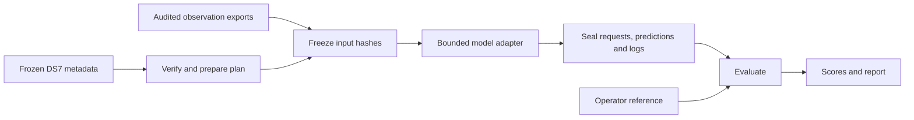

# DS7 evaluation workflow

The shared entry point is [`tools/ds7_eval.py`](../../tools/ds7_eval.py). It loads the exact minted DS7, prepares frozen evaluation plans, freezes derived-input references, runs a model adapter in bounded subprocesses, and scores sealed outputs. It uses Python 3.12+ and the standard library on Linux; no database or acquisition service is required for metadata preparation or scoring.

The six research directions and SOL launch waves are in [the parallel plan](ds7-parallel-plan.md). Their configurations are under [`config/ds7/`](../../config/ds7/). Executed comparisons and remaining gates are recorded in the [wave-2 report](../../reports/2026_09_27_ds7_wave2/RESULTS.md); configuration availability alone does not imply completed model coverage.

## Lifecycle



Dataset membership is pinned to manifest SHA-256 `47007b1c18e8182f6a005dfd05c237cb3edb9bf85ae6376c99ccf29d54434109`. All DS7 artifact seals, approved membership, evaluation partitions and pose bindings are checked. This is metadata verification, not a new 860 GB IQ hash check.

`load_recording(capture, reader)` is the public loading port for an adapter that needs source recordings. Inject an existing `AdaptiveHopIqStore(..., read_only=True)` from the compatible installed runtime; the port calls `inspect(session_id)` and rejects a source-manifest digest mismatch. Use the storage reader's public methods for IQ. Analyzers receive observations through their existing contracts and must not import storage, HTTP, PostgreSQL or this CLI.

## Prepare the exact evaluation units

From the repository root:

```sh
python3 tools/ds7_eval.py inspect
python3 tools/ds7_eval.py prepare --suite smoke --output /path/to/ds7/plans/smoke
python3 tools/ds7_eval.py prepare --suite standard --output /path/to/ds7/plans/standard
python3 tools/ds7_eval.py prepare --suite budgets --output /path/to/ds7/plans/budgets
```

The output directory must be new. `plan.json` has a canonical content seal and an explicit allowlist of capture metadata. It contains no pose file, coordinate, reference path, historical tracking outcome or recorded location result. `inputs.template.json` accounts for all 88 recordings with an initially unavailable state.

| Suite | Units |
|---|---|
| `smoke` | `single-001`, the first chronological recording; transport validation only |
| `standard` | 88 `single-NNN`, eleven `group8-NN`, and `full88`: 100 units |
| `budgets` | Standard plus eleven `prefix2-NN` and eleven `prefix4-NN`: 122 units |

The first recording of each group supplies its one-recording prefix; `group8-NN` supplies its eight-recording prefix. Receivers and visits are never split between unit members. The repeated and overlapping units are not independent trials or training/test folds. Masks and donor/training separation belong to each scientific adapter's frozen specification.

## Freeze model inputs

Copy the input template to an editable index outside the minted dataset. For each session, preserve its exact `session_id` and `manifest_sha256`. Mark `ready` only when the required exported observations are present; otherwise retain `unavailable` and a reason. Do not silently omit pending or failed recordings.

Each ready row needs one or more artifacts:

```json
{
  "session_id": "<exact DS7 session ID>",
  "manifest_sha256": "sha256:<source manifest digest>",
  "state": "ready",
  "artifacts": [
    {"kind": "observations", "path": "exports/session-observations.npz"},
    {"kind": "orbits", "path": "exports/causal-orbits.json"},
    {"kind": "candidates", "path": "exports/candidates.json"}
  ]
}
```

Paths resolve relative to the editable index. Allowed kinds are `observations`, `orbits`, `candidates`, `calibration`, `scan_estimate`, and `reader_config`. A declared `sha256` is checked when present; every artifact receives a hash in the frozen index. Keep the arrays small enough for bounded replay. Raw-IQ adapters should freeze a reader configuration and source digests, not list 860 GB of payloads as derived observation artifacts.

The index header must retain `schema: ds7-input-index/v1` and `dataset_sha256`, and set `reference_audit` to `reference_excluded` only after inspecting export contents and provenance. Artifact schemas remain owned by the model/measurement component, so the adapter must validate them. The generic runner checks identity, hashes and availability, not scientific correctness of arbitrary arrays.

```sh
python3 tools/ds7_eval.py freeze-inputs \
  --plan /path/to/ds7/plans/budgets/plan.json \
  --index /path/to/ds7/input-index.json \
  --output /path/to/ds7/inputs-v1.json
```

Known truth/pose/reference field names and direct inputs from the DS7 metadata directory are rejected. This catches accidental leakage; it does not prove that arbitrary binary arrays, coordinate aliases, geographic priors or previously exposed researchers are reference-independent. The audit declaration is a recorded responsibility, not a sandbox guarantee. Geographic priors must be independently justified in the experiment specification. Derived inputs are hashed again before and after execution and must remain immutable.

## Adapter contract and configurations

An arm JSON uses `schema: ds7-arm/v1`, a unique `model_id`, `status: ready`, a command argv array, `config`, and `code_paths`. `{repo}` expands to this checkout. Script paths must be absolute or use that placeholder. The runner records the resolved executable and Python script hashes automatically; list all local scientific dependencies, the package lock and environment receipt in `code_paths` as well. Imported dependencies are not automatically discovered.

The six checked-in research configurations deliberately have `status: planned`. Before setting a new copy to `ready`, satisfy `required_before_ready`, fill command/dependencies, fix all scientific parameters, and freeze prior/search/mask/candidate policies. The runner refuses planned arms.

The authorized first wave executed [`baseline-ready-v1.json`](../../config/ds7/baseline-ready-v1.json), with numerical-oracle and deterministic-replay evidence. Its working copy is now held at `planned` for the larger-unit runtime gate. Additional arms use explicit direction/version names in the same directory; consult their `status`, not the filename. See the [wave results and admission decisions](../../reports/2026_09_27_ds7_wave1/RESULTS.md) for what actually ran; a ready arm alone is not a completed or scientifically qualified evaluation. Sealed run directories retain the exact configuration used even if a later transport repair changes the working copy.

The timeout audit found that a privileged adapter launched through `sudo` could survive its unprivileged runner. The runner now rejects privilege/session launchers in adapter arguments, including behind `env` or `timeout`. Use a direct interpreter command with the same UID as the runner. If accessing the chosen runtime requires elevated privileges, invoke the runner at that privilege and use the direct interpreter in the arm. Adapters must retain that UID and process group. This is a trusted-code execution contract, not a sandbox against a deliberately escaping adapter. Historical privileged arms may be marked `planned` pending this transport change even though their sealed successful runs remain valid. See the [cleanup repair receipt](../../reports/2026_09_27_ds7_wave1/coordinator/cleanup-repair.json).

The adapter receives appended arguments `--request PATH --response PATH`. A request contains its unit IDs, allowed capture metadata, frozen input references, model configuration, and dataset/plan/input digests. It must write exactly one JSON response:

```json
{
  "schema": "ds7-response/v1",
  "unit_id": "group8-01",
  "status": "ok",
  "estimate": {"latitude_deg": 40.0, "longitude_deg": -120.0},
  "converged": true,
  "boundary_hit": false,
  "horizontal_radius_95_m": 2500.0,
  "diagnostics": {"example_only": true}
}
```

The coordinates above illustrate syntax, not DS7 results. `horizontal_radius_95_m` is optional. Other valid states are `abstained`, `failed`, and `unavailable`; each requires a nonempty `reason` and no estimate. A finite returned position with `converged: false` or `boundary_hit: true` remains visible but is unqualified for headline accuracy.

An adapter may write only `response.json` and its captured `adapter.log` in its unit directory. Put small diagnostics in the response (maximum 1 MiB). Child file sizes are capped at 16 MiB. Large observation preparation is a separate bounded operation, not a side effect of fitting. Requests are hashed before launch and checked after; changing them or earlier unit evidence invalidates the run. This is interface/integrity enforcement in a shared filesystem, not a security sandbox.

[`ds7_position_controls.py`](../../tools/ds7_position_controls.py) is a working adapter for equal, inverse-RMS-squared, and lowest-RMS-75% position means. [`controls.json`](../../config/ds7/controls.json) enables equal averaging. Make separate versioned arm files with `config.method` of `inverse_rms2` or `lowest_rms75` and distinct model IDs for the others. These controls need a `scan_estimate` JSON per session with `schema: ds7-scan-estimate/v1`, session/source binding, `status`, `estimate`, `converged`, `boundary_hit`, and positive `rf_rms_hz` for the RMS methods. They abstain on unqualified upstream estimates. Means use unit-sphere vectors; the 75% method keeps `ceil(0.75*n)` estimates ranked by RMS then session ID. This is an explicit new control implementation; do not label it an exact historical DS5 reproduction without checking those conventions.

## Bounded execution

```sh
python3 tools/ds7_eval.py run \
  --plan /path/to/ds7/plans/budgets/plan.json \
  --inputs /path/to/ds7/inputs-v1.json \
  --arm /path/to/ds7/arms/baseline-ready-v1.json \
  --unit single-001 --unit prefix2-01 --unit prefix4-01 --unit group8-01 \
  --output /path/to/ds7/predictions/baseline-panel-v1 \
  --max-seconds 300 --unit-seconds 60
```

Repeated `--unit` selects an explicit panel in canonical plan order. Without selectors every plan unit is attempted. An unavailable member makes the whole unit unavailable, preserving full-membership comparisons. A nonzero exit, missing/invalid response or timeout becomes a failed trial. When the execution budget expires, every remaining selected unit still gets a failed-budget row. Provenance/integrity violations fail closed and leave an unsealed directory for diagnosis; it cannot be scored.

`--max-seconds` caps the execution phase (default 300, maximum 1800); `--unit-seconds` caps each subprocess (default 60). Hashing and final sealing are outside that execution cap. A minimal environment fixes Python hash seed and BLAS threads to one. Process groups, including ordinary descendants, are killed on timeout and after completion. There is no automatic CPU affinity, memory limit, total-directory quota or IQ-read budget; the coordinator assigns those resources and serializes IQ-heavy work. No production analyses or acquisition jobs are launched implicitly.

Runs refuse existing output directories. A finished run contains copies of the plan, inputs and arm, per-unit requests/responses/logs, `results.json` with all selected units and provenance, and `seal.json` binding every file. Retries use new run IDs. A partially written or integrity-failed run is never upgraded by editing receipts.

## Post-seal scoring

```sh
python3 tools/ds7_eval.py evaluate \
  --run /path/to/ds7/predictions/baseline-panel-v1 \
  --output /path/to/ds7/scores/baseline-panel-v1
```

Metadata validation reads pose evidence to check bindings; only scoring uses its coordinate to compute error. The scorer validates run seals, exact selected-unit accounting and response evidence, then writes `scores.json`, `REPORT.md` and a directory seal without refitting. It can score on another machine with the sealed metadata/run artifacts; original input arrays are not needed for scoring.

The fixed horizontal metric is great-circle distance on a mean-radius Earth (6,371,008.8 m), explicitly labeled in every score. It is not a surveyed WGS84 ellipsoid distance or a 3D error. Comparisons to historical reports must reconcile their distance convention. Metrics are grouped by unit kind, with single-recording rate strata, individual errors, recording spans, runtime, convergence/boundary counts, availability, median/p90/p95/max, and optional reported-radius coverage. Failures and abstentions stay in the **all-attempts fraction below 1 km**; conditional successful-estimate metrics are labeled separately. A full88 score is one long-duration estimate.

Compare arms only on the same declared unit panel, observation/candidate policy, metric and budget; input changes must be the named ablation. The operator reference is unsurveyed and prior DS7 exposure is unaudited. No output should claim independent-site generalization.

## Verification

```sh
.venv/bin/python -m pytest tests/research/test_ds7_eval.py
.venv/bin/ruff check tools/ds7_eval.py tools/ds7_position_controls.py tests/research/test_ds7_eval.py
```

The suite uses frozen DS7 metadata and small synthetic adapters/estimates. These exercise orchestration and failure handling, not scientific localization performance. Production source readers and real-IQ analysis require separate, explicitly scoped integration checks.
