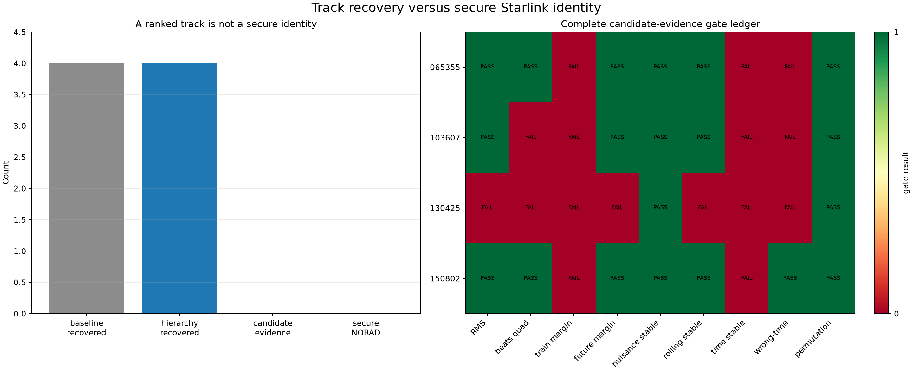

# Research evidence ledger

## Motivation

LEO Tracker needs a durable answer to two different questions: “what did a
particular investigation observe?” and “what is the project currently willing
to claim?” Dated reports preserve the first; this ledger maintains the second
without rewriting research history.

## Problem

The repository's reports span acquisition diagnostics, detector ablations,
trajectory failures, phase models, orbital controls, scanner work, UI changes,
and deployment receipts. Some reports are current support, some are the reason
the code changed, and some used recordings or assumptions later superseded.
Chronology alone does not tell a reader which conclusion still governs.

## Solution

This page maps each current scientific claim to its strongest versioned
evidence, controls, caveats, implementation status, and next falsifier. At
commit `12b00fc`, it also indexes all 127 tracked Markdown assets under
`reports/`: 116 top-level reports, seven documents in the post-refill
retrospective bundle, three scanner-rendered samples, and one TLE figure
README. Canonical concept and pipeline pages link here for provenance; reports
remain dated receipts.

## Method

The original ledger synthesis read 41 top-level versioned reports, three
versioned scanner-rendered samples, the TLE figure README, their figures and
machine-readable results, current code, tests, contracts, and the Qin and
Kozhaya primary signal-structure papers. This update audits the complete
tracked Markdown path inventory at `12b00fc` and re-audits current claims
against the merged Doppler campaign, selector-v2, corrected calibration,
retrospective satellite-nuisance, and TLE-durability receipts. Inventory
inclusion alone does not promote a report to current scientific authority. The
latest report is not automatically preferred: input integrity, controls,
independence, replication, and deployed contract status determine weight.

## Status vocabulary

| Status | Meaning |
|---|---|
| **Established** | Repeated, controlled evidence supports the bounded claim |
| **Supported** | Evidence is substantial but an important independent gate remains |
| **Intermittent** | The effect is real in qualified intervals but not reliably available |
| **Operational** | Implemented and verified as a workflow, not a scientific discovery |
| **Hypothesis-generating** | Useful result whose input or evaluation does not support present authority alone |
| **Not established** | The repository must not make the claim |

“Deployed” and “established” are orthogonal. An estimator can be deployed as a
shadow product while its physical interpretation remains candidate-only.

## Current claim matrix

| Claim | Status | Strongest current evidence | Controls and caveats | Implementation |
|---|---|---|---|---|
| Exact Qin edge-pilot structure is present in recorded IQ | **Established** | [20 ms comparison](../../reports/2026_08_26_20ms_window_comparison.md), [edge-pilot phase-slope replication](../../reports/2026_08_22_edge_pilot_phase_slope.md), [scanner Standard analysis](../../reports/2026_08_23_scanner_standard_analysis.md) | Exact template repeatedly beats the 17-symbol roll; known pilot does not identify payload or spacecraft | Standard and scanner acquisition/QAM paths |
| The 300 × 8 published pilot matrix demodulates as useful 4QAM | **Established, candidate-only** | [20 ms comparison](../../reports/2026_08_26_20ms_window_comparison.md) | Accuracy applies only to known pilot states; no user/header bits are decoded | Pilot scan and report tools |
| Independent probes contain coherent CFO-time structure | **Established** | [dense independent GLRT](../../reports/2026_08_21_dense_independent_glrt.md), [residual-Hough segmentation](../../reports/2026_08_22_residual_hough_segmentation.md), [alias canonicalization](../../reports/2026_08_26_cfo_alias_canonicalization.md) | Receiver/LNB/transmitter terms remain mixed with propagation Doppler | Standard trajectory products |
| Parallel raw CFO ridges can be one symbol-rate alias family | **Established** | [alias canonicalization](../../reports/2026_08_26_cfo_alias_canonicalization.md) | 235/236 high-gate points collapse to one quadratic; grouping does not select the correction lift | Alias map + de-aliased bank |
| Same-IQ replay is required to choose the absolute correction lift | **Established** | [alias canonicalization](../../reports/2026_08_26_cfo_alias_canonicalization.md), [trajectory accounting](../../reports/2026_08_22_4e2a0c111a30_alias_aware_trajectory_accounting.md) | Upper lift: 400/401 positives; lower representative: 1/401 in the canonicalization case | CFO-lift replay v4 + final bank |
| Frame-local pilot phase can be coherent modulo π | **Established intermittently** | [frame-local qualification](../../reports/2026_08_22_frame_local_phase_qualification.md), [edge-pilot phase slope](../../reports/2026_08_22_edge_pilot_phase_slope.md), [pilot PNT Kalman](../../reports/2026_08_22_pilot_pnt_kalman.md) | One 80 ms case improves 1.695→0.151 rad; only 3/40 additional selected windows fully lock | Local pilot-Doppler monitor |
| A local CFO/rate model predicts better than the frozen multi-second derivative | **Supported** | [sub-second structure](../../reports/2026_08_22_subsecond_pilot_structure.md), [piecewise pilot Doppler](../../reports/2026_08_23_piecewise_pilot_doppler_rate.md), [Doppler campaign synthesis](../../reports/2026_08_26_doppler_rate_experiment_campaign.md) | Local 10 ms held-out RMS is 16.48 Hz near 16.16 Hz measurement uncertainty; held-out-CFO prediction is not known physical-Doppler truth and carrier-bias steps remain unexplained | Additive 75 ms Standard product |
| The response-blind holdout has a frozen >=10-capture cohort | **Operational** | [selector-v2 result](../../reports/2026_08_26_doppler_holdout_selector_v2_results.md) | 10/15 captures and 5,413 eligible targets pass even-Qin feasibility only; odd-Qin response availability and every estimator outcome remain unopened here | Frozen IDs and target-mask digests; final scoring pending |
| Fixed 500 ms satisfies the known-truth point-accuracy and finite 95% interval gates | **Not established** | [corrected fixed-500 calibration](../../reports/2026_08_26_fixed500_calibration_results.md) | Primary RMSE is 291.5921 Hz/s versus 92.7065 Hz/s for fixed 125 ms; the combined gate fails and 12 calibration groups force a formal 95% interval abstention | Benchmark only; no interval or physical-Doppler authority |
| The strict-past quadratic is ready for production promotion | **Not established** | [corrected fixed-500 calibration](../../reports/2026_08_26_fixed500_calibration_results.md) | 35.8038 Hz/s passes the corrected component gate, but the correction was specified after outcomes were visible and is not an independent holdout confirmation | Challenger only; response-sealed validation pending |
| Current final banks are deployed multi-target associations | **Not established** | Current `run_receiver_standard` call graph | Multi-target code and tests exist, but the runner does not invoke it | Final bank remains residual-Hough/dealias/replay selection |
| A radio track is securely associated with one catalogued satellite | **Not established** | [retrospective nuisance result](../../reports/2026_08_26_retrospective_satellite_nuisance_results.md), [TLE replay-durability addendum](../../reports/2026_08_26_retrospective_satellite_nuisance_tle_durability_addendum.md), [deep three-dwell tracking review](../../reports/2026_08_24_recent_three_starlink_tracking_deep_review.md) | Four tracks have finite winners 62124/66811/58029/59748, but 0/4 pass candidate-evidence gates and zero identities are secure; baseline/hierarchy future RMS is 78.0226/79.1769 Hz | Research-only sky comparison primitives; final ten-capture association pending |
| Bounded physical-radio rate nuisance improves satellite association | **Not established** | [retrospective nuisance result](../../reports/2026_08_26_retrospective_satellite_nuisance_results.md) | The hierarchy is 1.48% worse in equal-capture future RMS and changes neither four-track recovery nor the 0/4 evidence and zero-secure-ID disposition | Diagnostic option only |
| Timing estimate is code phase, pseudorange, or absolute range | **Not established** | Phase/PNT report family and contracts | Current timing is receiver-relative and modulo a frame/sample coordinate; no transmit-time authority | No qualified navigation observable |
| Starlink payload is decoded | **Not established** | Code and product inventory | Only published known pilot symbols are evaluated | No payload decoder |
| Scanner captures support retune-bounded known-pilot/local-rate evidence | **Operational and supported** | [scanner Standard analysis](../../reports/2026_08_23_scanner_standard_analysis.md) | No state crosses a retune; five stored scans had 3/32 qualified segments and zero negative-control locks | Capture-first scanner pipeline |

## Evidence synthesis by topic

### Waveform specificity and acquisition geometry

Independent acquisition was the decisive methodological improvement. Earlier
shared or guided seeds could create one-second blocks that looked like carrier
continuity. The current detector searches every probe over the full configured
CFO interval, retains ranked basins, and evaluates exact and rolled templates
on the same samples.

Across the six trial-132 geometries, the best QAM median remains strong while
track-family retention changes non-monotonically with probe count and duration.
Standard's 2 × 20 ms schedule and Research's 3 × 20 ms schedule are therefore
resource/evidence policies, not waveform constants.

### Alias geometry and selection

The symbol-rate ambiguity is `1 / 4.4 µs = 227,272.727… Hz`; it is not the
234.375 kHz OFDM subcarrier spacing. Raw values, modulo-alias family identity,
and IQ correction lift are separate persisted facts. Residual-Hough is useful
for bounded association, but its outputs require replay accounting because a
conditioned hypothesis can recover, lose, or duplicate independently acquired
evidence.

### Phase, timing, and local rate

Complete-frame pilot observations sometimes cluster into two phase families
separated by π. A modulo-π model can support efficient coherent stacking and a
causal local rate, but coverage is intermittent and bias changes occur between
adjacent segments. The phase state is reset at failed gates and capture
discontinuities; it is never bridged by interpolation merely to draw a smooth
line.

### Sealed Doppler campaign state

Selector v1 admitted only 4/15 unopened captures. The feasibility-informed,
response-blind selector v2 now admits exactly 10/15 and freezes 5,413 eligible
future target opportunities on those ten captures. This is an operational
cohort result only: no odd-Qin response was read or scored, and response
missingness remains unknown until a separately frozen final pass.

The corrected known-truth calibration reports primary scenario-equal RMSEs of
92.7065, 291.5921, and 35.8038 Hz/s for fixed 125 ms, unchanged fixed 500 ms,
and the strict-past quadratic. Fixed 500 ms fails its combined gate. Twelve
calibration groups cannot supply the required order 13, so the formal finite
95% interval abstains; the displayed maximum-score interval is descriptive
only. The quadratic passes a corrected post-outcome component gate, not an
independent confirmation or production gate.

The final ten-capture odd-Qin comparison and satellite association are still
pending at this inventory point. No estimator winner, response-availability
count, association ranking, or secure identity from that final pass is claimed
in this ledger.

### Orbital association

Radio trajectories are repeatable, but constant rate alone is not a secure
orbital fingerprint. The current retrospective bounded-nuisance result recovers
finite full-catalog rankings for all four primary tracks, with winners NORAD
62124, 66811, 58029, and 59748. None clears the complete candidate-evidence
gates and none is a secure identity. Equal-capture future RMS changes from
78.0226 Hz for the fixed-time/free-offset baseline to 79.1769 Hz for the
physical-radio hierarchy. The post-outcome durability amendment removes the
mutable TLE archive index from replay authority while leaving every sealed
ranking, metric, and gate unchanged.

The earlier causal five-dwell analysis likewise allowed comparable nuisance
terms for true-time and wrong-time TLE controls and found no true-time
advantage. Observer coordinate, LO arithmetic, and measured two-LNB drift
checks did not explain the full rate discrepancy. Transmitter/beam steering,
catalog incompleteness, timing uncertainty, and signal-model error remain live.

## Versioned report index

This path-exhaustive index covers the 127 tracked Markdown assets counted above.
It assigns detailed present roles to the strongest sources and a compact role
to the remaining tracked receipts. “Supporting” means a report contributes
evidence or design context; it does not mean every historical conclusion is
still current. Preregistrations establish chronology and gates, not outcomes.

### Acquisition, detector, and performance studies

- [Line-finder study](../../reports/2026_08_20_line_finder.md) — early
  trajectory-loss localization; supporting history.
- [Recent CFO alias history](../../reports/2026_08_20_recent_cfo_alias_history.md)
  — historical cross-dwell alias survey.
- [Dense independent GLRT](../../reports/2026_08_21_dense_independent_glrt.md) —
  current methodological support for independent per-probe acquisition.
- [Edge-pilot IF/DC centering](../../reports/2026_08_21_edge_pilot_if_dc_centering.md)
  — current RF/IF arithmetic reference.
- [Scanner burst duty cycle](../../reports/2026_08_21_scanner_burst_duty_cycle.md)
  — scanner acquisition geometry and timing support.
- [T1 dense degree-one-only](../../reports/2026_08_21_t1_dense_degree1_only.md)
  — dense-search trajectory study with permutation control.
- [T1 GLRT search parameter study](../../reports/2026_08_22_t1_glrt_search_parameter_study.md)
  — cost/recovery frontier and rank sensitivity.
- [T1 hardware-aligned parameter study](../../reports/2026_08_22_t1_glrt_hardware_aligned_parameter_study.md)
  — host-aligned execution comparison.
- [T2 coarse-acquisition batch prototype](../../reports/2026_08_22_t2_coarse_acquisition_batch_prototype.md)
  — prototype performance evidence, not a production dependency.
- [T3 GLRT hardware execution alignment](../../reports/2026_08_22_t3_glrt_hardware_execution_alignment.md)
  — execution-alignment benchmark evidence.
- [20 ms window comparison](../../reports/2026_08_26_20ms_window_comparison.md)
  — current probe-geometry and QAM synthesis.

### Trajectory, alias, replay, and retention investigations

- [405bcced track loss](../../reports/2026_08_21_405bcced8e67_track_loss.md) —
  historical retention failure and policy before/after.
- [470384 alias offsets](../../reports/2026_08_21_470384_alias_offsets.md) —
  alias-decision diagnostics and geometry audit.
- [e2ac389 track loss](../../reports/2026_08_21_e2ac389247f3_track_loss.md) —
  replay-gate loss investigation.
- [e7935fe recovery](../../reports/2026_08_21_e7935fe8_recovery.md) — bounded
  recovery case.
- [e975 replay investigation](../../reports/2026_08_21_e975ebaac089_replay_investigation.md)
  — paired replay funnel and loss accounting.
- [Paired Hough gallery](../../reports/2026_08_21_paired_hough_gallery.md) —
  cross-path visual evidence; supporting rather than identity proof.
- [Seeded alias EM d6a](../../reports/2026_08_21_seeded_alias_em_d6a.md) —
  historical de-alias comparison; the current deployed path uses Huber linear
  refinement plus lift replay.
- [Alias-aware trajectory accounting](../../reports/2026_08_22_4e2a0c111a30_alias_aware_trajectory_accounting.md)
  — current transition-accounting support.
- [Carrier continuity case](../../reports/2026_08_22_carrier_continuity_case.md)
  — bounded continuity and refill/shard audit.
- [Residual-Hough segmentation](../../reports/2026_08_22_residual_hough_segmentation.md)
  — current segmentation-method evidence.
- [CFO alias canonicalization](../../reports/2026_08_26_cfo_alias_canonicalization.md)
  — current canonical-family and correction-lift synthesis.

### Phase, timing, Kalman, and local Doppler investigations

- [Edge-pilot phase slope](../../reports/2026_08_22_edge_pilot_phase_slope.md) —
  current multi-dwell exact/control and intermittent modulo-π evidence.
- [Frame-local phase qualification](../../reports/2026_08_22_frame_local_phase_qualification.md)
  — verified local phase gate and held-out prediction.
- [Kalman phase tracking comparison](../../reports/2026_08_22_kalman_phase_tracking_comparison.md)
  — historical Standard Kalman comparison.
- [Pilot PNT Kalman](../../reports/2026_08_22_pilot_pnt_kalman.md) — five-state
  known-pilot experiment; timing remains receiver-relative.
- [PNT Kalman comparison](../../reports/2026_08_22_pnt_kalman_comparison.md) —
  phase reset and gate-sensitivity evidence.
- [CH2L scanner Kalman-rate diagnosis](../../reports/2026_08_24_scan_2b2a98cc_ch2l_kalman_rate_diagnosis.md)
  — single-scan supporting evidence that coherent 1.333 ms frame-CFO trends
  can disagree with an overconfident full phase-coupled endpoint state; the
  phase-disabled-after-initialization control remains closer to the robust
  75 ms slope.
- [PNT phase/Doppler comparison](../../reports/2026_08_22_pnt_phase_doppler_comparison.md)
  — short-coherence and rate comparison.
- [Sub-second pilot structure](../../reports/2026_08_22_subsecond_pilot_structure.md)
  — current structure-aware holdout evidence.
- [Within-segment frame phase](../../reports/2026_08_22_within_segment_frame_phase.md)
  — **hypothesis-generating** because the principal historical input was later
  found to contain a manifest-mismatching shard; use newer verified-IQ phase
  reports for current proof.
- [Piecewise pilot Doppler rate](../../reports/2026_08_23_piecewise_pilot_doppler_rate.md)
  — current deployed local-monitor evidence.

### TLE, calibration, and multi-dwell comparisons

- [TLE Doppler alignment](../../reports/2026_08_21_tle_doppler_alignment.md) —
  initial geometry/alignment study and candidate inventory.
- [Five-dwell degree-one-only rerun](../../reports/2026_08_21_five_dwell_degree1_only_rerun.md)
  — independently rerun radio-line distribution.
- [Five-dwell TLE cone](../../reports/2026_08_21_five_dwell_tle_cone.md) —
  current causal true-time/wrong-time control and no-identity conclusion.
- [Three continuity-v2 dwell TLE screen](../../reports/2026_08_24_recent_three_continuity_tle_matching.md)
  — reproducible original nine-track candidate screen; its interpretation is
  superseded by the deeper matched-search review below.
- [D2 `9981b9c27853` CFO curvature and causal TLE comparison](../../reports/2026_08_24_9981b9c27853_cubic_cfo_tle_comparison.md)
  — dense same-episode evidence that a cubic is the minimum adequate radio
  model and that candidate 67930 predicts a retrospective tail better than
  train-only polynomials; it has no matched catalogue/time-search null.
- [Deep three-dwell Starlink tracking review](../../reports/2026_08_24_recent_three_starlink_tracking_deep_review.md)
  — current synthesis: TLE-blind physical episodes, complete matched search,
  scanner reset/timing audit, candidate ledger, and zero secure identities.
- [Dual-LNB drift reference](../../reports/2026_08_22_dual_lnb_drift_reference.md)
  — hardware frequency-drift bound used as a nuisance check.

### Scanner, operations, browser, and delivery reports

- [Capture pause/start UI](../../reports/2026_08_21_capture_pause_start_ui.md) —
  operational control-surface receipt.
- [Dead-code and obsolete-infrastructure audit](../../reports/2026_08_21_dead_code_and_obsolete_infrastructure_audit.md)
  — architectural cleanup inventory.
- [Durable acquisition queue](../../reports/2026_08_21_durable_acquisition_queue.md)
  — durable scheduling/restart authority.
- [Fast test and deploy plan](../../reports/2026_08_21_fast_test_and_deploy_plan.md)
  — delivery plan; use current operations guides for procedures.
- [HTTP Matplotlib PNG rendering](../../reports/2026_08_21_http_matplotlib_png_rendering.md)
  — historical renderer design evidence; current API serves registered PNGs
  without recomputing science.
- [Scanner Standard analysis](../../reports/2026_08_23_scanner_standard_analysis.md)
  — current stored-sweep analysis and five-scan evaluation.

### Extended tracked research and protocol receipts

The following groups complete the tracked top-level report inventory. The
2026-08-23 and 2026-08-24 groups are supporting development, mechanism, and
audit history unless the claim matrix cites them directly. A prototype report
does not establish deployed status.

#### 2026-08-23 development and audit receipts

- [Full-capture 20 ms GLRT and robust slopes](../../reports/2026_08_23_140820_glrt20ms_robust_slope.md)
- [470384 blind timing-CFO experiment](../../reports/2026_08_23_470384_blind_timing_cfo.md)
- [470384 comprehensive blind timing-CFO analysis](../../reports/2026_08_23_470384_blind_timing_cfo_comprehensive.md)
- [470384 boundary-mechanism investigation](../../reports/2026_08_23_470384_boundary_mechanism.md)
- [144200 missing-track root cause](../../reports/2026_08_23_cap_144200_missing_track_rca.md)
- [Eight-hour dwell/scanner operational audit](../../reports/2026_08_23_eight_hour_dwell_scanner_operational_agent.md)
- [Eight-hour dwell/scanner scientific audit](../../reports/2026_08_23_eight_hour_dwell_scanner_science_agent.md)
- [Five-dwell modulo-pi qualification audit](../../reports/2026_08_23_five_dwell_modulo_pi_qualification.md)
- [Dense Hough downstream prototype](../../reports/2026_08_23_full_capture_hough_downstream_prototype.md)
- [Full-capture Hough replay prototype](../../reports/2026_08_23_full_capture_hough_replay_prototype.md)
- [Connected-support extension prototype](../../reports/2026_08_23_full_capture_support_extension_prototype.md)
- [GLRT and short-window phase comparison](../../reports/2026_08_23_glrt_phase_segment_comparison.md)
- [H1 replay seed-policy experiment](../../reports/2026_08_23_h1_replay_seed_policy.md)
- [Main-report and Starlink-association synthesis](../../reports/2026_08_23_main_report_review_and_starlink_association.md)
- [Six-hour dwell/scanner monitor](../../reports/2026_08_23_six_hour_live_dwell_scanner_monitor.md)
- [Support-extension geometry retention](../../reports/2026_08_23_support_extension_geometry_retention.md)
- [Fresh 13-dwell degree-one rerun](../../reports/2026_08_23_thirteen_dwell_degree1_fresh.md)
- [Fresh 13-dwell Starlink association audit](../../reports/2026_08_23_thirteen_dwell_starlink_association_fresh.md)

#### 2026-08-24 mechanism and implementation receipts

- [Continuity-buffer implementation](../../reports/2026_08_24_continuity_buffer_implementation.md)
- [d373c04a GLRT and frame-CFO study](../../reports/2026_08_24_d373c04a_glrt_frames.md)
- [Frame-CFO estimator study](../../reports/2026_08_24_frame_cfo_estimator_study.md)
- [Full-capture Hough end-to-end prototype](../../reports/2026_08_24_full_capture_hough_end_to_end.md)
- [Refill-continuity loopback](../../reports/2026_08_24_refill_continuity_loopback.md)
- [Refill-time compression sawtooth](../../reports/2026_08_24_refill_time_compression_sawtooth.md)
- [Starlink signal and tracking guide](../../reports/2026_08_24_starlink_signal_and_tracking_guide.md)
- [Ten-dwell raw Doppler pipeline](../../reports/2026_08_24_ten_dwell_raw_doppler_pipeline.md)

The 2026-08-25 group contains the frozen campaign foundations, canary and
transport receipts, preregistrations, development results, and retrospective
association work. Each result retains its own disposition; protocol and plan
documents establish scope or chronology rather than an outcome.

#### 2026-08-25 campaign foundations and canary receipts

- [150802 alias-aware common-orbit audit](../../reports/2026_08_25_150802_alias_aware_common_orbit.md)
- [150802 experimental PNT Kalman V4](../../reports/2026_08_25_150802_pnt_kalman_v4_experimental.md)
- [150802 V3 acquisition-model audit](../../reports/2026_08_25_150802_v3_acquisition_model_audit.md)
- [150802 full-dwell V3 replay](../../reports/2026_08_25_150802_v3_full_dwell.md)
- [150802 V3 missing-signal investigation](../../reports/2026_08_25_150802_v3_missing_signal_investigation.md)
- [150802 V3 tracking comparison](../../reports/2026_08_25_150802_v3_tracking_comparison.md)
- [150802 visible-Starlink TLE fit](../../reports/2026_08_25_150802_visible_starlink_tle_fit.md)
- [3 MS/s and 5 MS/s capture deployment](../../reports/2026_08_25_3m_5m_production_capture_deployment.md)
- [Adaptive CFO-rate change](../../reports/2026_08_25_adaptive_cfo_rate_change.md)
- [Causal CFO/rate/acceleration result](../../reports/2026_08_25_causal_cfo_acceleration_development.md)
- [Causal CFO/rate/acceleration preregistration](../../reports/2026_08_25_causal_cfo_acceleration_development_preregistration.md)
- [Continuous frame-recovery prototype](../../reports/2026_08_25_continuous_frame_recovery_prototype.md)
- [Counter-continuous frame timing and delay](../../reports/2026_08_25_counter_continuous_frame_timing_and_delay.md)
- [Doppler experiment dataset policy](../../reports/2026_08_25_doppler_experiment_dataset_policy.md)
- [Holdout selector-v1 feasibility](../../reports/2026_08_25_doppler_holdout_feasibility.md)
- [Doppler-rate and satellite-linking method review](../../reports/2026_08_25_doppler_rate_and_satellite_linking_method_review.md)
- [Five-dwell pilot-filter prototypes](../../reports/2026_08_25_five_dwell_pilot_filter_prototypes.md)
- [Five-dwell frame-CFO prototype](../../reports/2026_08_25_frame_cfo_dwell_prototype.md)
- [Frame-phase rate investigation](../../reports/2026_08_25_frame_phase_rate_investigation.md)
- [Joint CFO/delay/acceleration prototype](../../reports/2026_08_25_joint_cfo_delay_acceleration_prototype.md)
- [Multi-dwell PSS/SSS Doppler comparison](../../reports/2026_08_25_multi_dwell_pss_sss_doppler.md)
- [Multi-radio common-rate preregistration](../../reports/2026_08_25_multi_radio_common_rate_preregistration.md)
- [Dual-radio contiguous transport verification](../../reports/2026_08_25_pluto_dual_radio_contiguous_transport_verification.md)
- [PNT Kalman V3 comprehensive review](../../reports/2026_08_25_pnt_kalman_v3_comprehensive_review.md)
- [PNT Kalman V4 correction plan](../../reports/2026_08_25_pnt_kalman_v4_correction_plan.md)
- [Polynomial injection preregistration](../../reports/2026_08_25_polynomial_injection_preregistration.md)
- [Polynomial Qin injection result](../../reports/2026_08_25_polynomial_qin_injection_results.md)
- [Recent adaptive CFO holdout result](../../reports/2026_08_25_recent_adaptive_cfo_holdout.md)
- [Recent adaptive CFO holdout preregistration](../../reports/2026_08_25_recent_adaptive_cfo_holdout_preregistration.md)
- [Recent adaptive CFO tracking](../../reports/2026_08_25_recent_adaptive_cfo_tracking.md)
- [Recent frame-CFO rate prototype](../../reports/2026_08_25_recent_frame_cfo_rate_prototype.md)
- [RX0 cross-receiver anchor replay](../../reports/2026_08_25_rx0_cross_receiver_anchor_replay.md)
- [Satellite identity recovery v2](../../reports/2026_08_25_satellite_identity_recovery_v2.md)
- [Three-dwell PNT tracking comparison](../../reports/2026_08_25_three_dwell_pnt_tracking_comparison.md)
- [V3/V4 downstream-rate result](../../reports/2026_08_25_v3_v4_downstream_rate_benchmark.md)
- [V3/V4 downstream-rate preregistration](../../reports/2026_08_25_v3_v4_downstream_rate_preregistration.md)

#### 2026-08-26 Doppler campaign and Wave-2 receipts

- [Holdout selector-v2 preregistration](../../reports/2026_08_26_doppler_holdout_selector_v2_preregistration.md) — response-blind feasibility protocol.
- [Holdout selector-v2 result](../../reports/2026_08_26_doppler_holdout_selector_v2_results.md) — 10/15 captures and 5,413 frozen future targets; feasibility only.
- [Doppler-rate campaign synthesis](../../reports/2026_08_26_doppler_rate_experiment_campaign.md) — current campaign-level disposition with the final sealed result marked pending.
- [Fixed-500 calibration preregistration](../../reports/2026_08_26_fixed500_calibration_preregistration.md) — original calibration protocol; read with the disclosed corrective chronology in the result.
- [Corrected fixed-500 calibration result](../../reports/2026_08_26_fixed500_calibration_results.md) — fixed-500 FAIL, finite 95% interval abstention, and post-outcome quadratic component PASS.
- [Multi-radio common-rate result](../../reports/2026_08_26_multi_radio_common_rate_results.md) — dispersion/prediction tradeoff, not physical-rate truth.
- [Retrospective satellite-nuisance preregistration](../../reports/2026_08_26_retrospective_satellite_nuisance_preregistration.md) — frozen retrospective association gates.
- [Retrospective satellite-nuisance result](../../reports/2026_08_26_retrospective_satellite_nuisance_results.md) — four finite rankings, 0/4 evidence passes, and zero secure identities.
- [Retrospective TLE replay-durability addendum](../../reports/2026_08_26_retrospective_satellite_nuisance_tle_durability_addendum.md) — post-outcome input-authority repair with sealed science unchanged.

### Auxiliary versioned Markdown assets

- [TLE figure data README](../../reports/figures/2026_08_21_tle_doppler_alignment/README.md)
  — provenance for the TLE alignment figure bundle.
- [Post-refill 24-hour retrospective bundle](../../reports/2026_08_25_post_refill_24h_retrospective/README.md),
  [capture and analysis IDs](../../reports/2026_08_25_post_refill_24h_retrospective/CAPTURE_AND_ANALYSIS_IDS.md), and
  [snapshot notes](../../reports/2026_08_25_post_refill_24h_retrospective/SNAPSHOT_NOTES.md)
  — frozen retrospective inventory and archived-code provenance.
- [Retrospective related-report index](../../reports/2026_08_25_post_refill_24h_retrospective/related_reports/README.md),
  [065355 activity report](../../reports/2026_08_25_post_refill_24h_retrospective/related_reports/2026_08_25_065355_satellite_activity.md),
  [073628/085623 activity report](../../reports/2026_08_25_post_refill_24h_retrospective/related_reports/2026_08_25_073628_raw_satellite_activity.md), and
  [103607 activity report](../../reports/2026_08_25_post_refill_24h_retrospective/related_reports/2026_08_25_103607_raw_satellite_activity.md)
  — supporting retrospective activity and calibration receipts, not secure
  satellite identities.
- [Scanner sample ee6a5829](../../reports/scanner-rendered-samples/20260821T103718Z_scan-ee6a5829b7054a1a.md),
  [sample eb189e76](../../reports/scanner-rendered-samples/20260821T121316Z_scan-eb189e7612af41d6.md), and
  [sample 8c903aa6](../../reports/scanner-rendered-samples/20260821T122805Z_scan-8c903aa6d2be496e.md)
  — concrete rendered scanner receipts, not population-level conclusions.

## Historical untracked drafts excluded from authority

The original ledger synthesis recorded four unversioned local draft reports:

- `2026_08_21_0b45a2531e70_basin_recovery.md`;
- `2026_08_21_replay_slope_distribution.md`;
- `2026_08_22_multi_dwell_starlink_association.md`; and
- `2026_08_22_thirteen_dwell_degree1_rerun.md`.

Those exact paths are not tracked at audited commit `12b00fc` and are not part
of the 127-asset count or path-exhaustive index. Their stronger basin,
replay-slope, and multi-dwell association interpretations remain excluded from
durable project authority. Similarly named tracked follow-on reports have
their own indexed receipts and must not be treated as publication of these
historical local drafts.

## Known unknowns and next falsifiers

| Unknown | Evidence that would materially change the ledger |
|---|---|
| Which estimator wins the final ten-capture holdout, and is its odd-Qin response sufficiently available? | Separately frozen scoring over all 5,413 selector-v2 targets, with missingness, no-results, identical masks, capture-level aggregation, and response-seal audit retained |
| What causes segment carrier-bias steps? | Independent paths/dwells showing a repeatable model that predicts held-out steps and beats clock/LNB/discontinuity controls |
| Can phase lock become common? | Higher coverage across independent verified dwells with unchanged rolled-control rejection and held-out prediction |
| How many physical emitters are present? | Deployed multi-target association with crossing/birth/death controls, duplicate suppression, replay support, and cross-path consistency |
| Which satellite emitted a carrier? | True-time orbital curve-shape advantage over wrong-time/wrong-satellite controls, robust to timing and frequency nuisance models |
| Is timing navigationally useful? | Calibrated transmit-time authority and qualified absolute observable, not only receiver-relative fractional timing |
| Is unknown payload recoverable? | A separately reviewed decoder with legal/ethical scope, independent validation, and no misuse of known-pilot accuracy as payload accuracy |

## Maintenance

When a new report lands, update the tracked Markdown count, add its exact path
to the index, and update the claim matrix only if its evidence changes the
current synthesis. Record input-integrity dispositions explicitly. A canonical
claim should link to the smallest set of strong sources that establishes it;
the index preserves the full research trail. Follow the
[Research pipeline](../pipelines/research-analysis.md) for experiment design
and the [documentation standard](../contributing/documentation.md) for report
and figure conventions.
