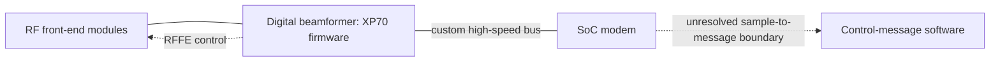

# Oleg Kutkov: Starlink hardware and firmware source review

Reviewed and archived 2026-09-30. This folder supplements the existing
[firmware investigation](../../../starlink_firmware/apk_fw_v1/reports/2026_09_30_rf_receive_trace/README.md).
The main additions are independent evidence about XP70 beamformer firmware,
hardware-dependent FEM families, a historical dish dump layout, and public router
source/binaries. None of these sources supplies an established Ku-band bit-to-message
mapping or a SATAddr-to-NORAD mapping.

Start with the [download inventory](INDEX.md). It links original URLs to local files.
[audit.json](audit.json) records verified byte counts, SHA-256 checks, content types,
failed downloads, and ZIP contents. Raw downloads are under **`local/`**, which is
Git-ignored. The manifests, scripts, and this review can be versioned separately.

The completed audit covers **1,635 unique URLs**, with 1,615 saved HTTP responses
totaling **200,956,699 bytes** (about 201 MB), and 20 failed requests. Saved content
includes 17 validated PDF signatures, 1,092 images (including resized duplicates),
four ZIPs, two gzip datasets, and one ELF. Nine responses contain unusable search or
caption results, and two are invalid PDFs; these are explicitly flagged. All saved
response hashes/lengths verified. Four component tests and Ruff passed.

## Findings ranked by relevance to our investigation

### 1. XP70 belongs to the digital beamformer

In his [January 27, 2025 PHY firmware reply](https://olegkutkov.me/forum/index.php?topic=57.0),
Kutkov explicitly identifies ST XP70 cores in the digital beamformers (DBFs). He
describes a separate RFFE control bus from each DBF to its front-end modules (FEMs),
and a custom high-speed connection between DBF and the modem in the SoC. The XP70
firmware controls beamforming/channeling. [Archived thread](local/topic-57.0.txt).

**Implication:** this independently supports interpreting our six `xp70_*.srec`
images as firmware for DBF operation. It weakens the idea that these images alone
must contain the entire Ku-band demodulator, FEC decoder, or control-message parser.
The post does not specify ADC placement, bus sample format, bus timing, raw-IQ access,
or which algorithms are hardware versus software.

He offers to potentially share a hex image, but there is no downloadable image in
the retrieved thread. His remark about unavailable XP70 tools describes his
knowledge in January 2025, not an independently verified current tooling limit.



Solid connections summarize his hardware account. The last connection marks our
remaining mapping problem; it is not a decoded waveform result.

### 2. Hardware names constrain which embedded image belongs where

His [May 2025 terminal identity/platform article](https://olegkutkov.me/2025/05/22/how-to-physically-transfer-starlink-account-from-one-terminal-to-another/)
distinguishes Catson from Catapult and explains that Panda is an FEM family, not a
new SoC. It also names Peanut, Pulsar, and Bamboo and states that FEM/layout changes
require different beamformer DSP firmware. Catapult-based Bamboo and Panda boards
therefore need different configurations. The same article describes app-based
offline terminal updates beginning in 2024. [Archived text](local/article-3620.txt).

The [June 2026 rev5 post](https://x.com/olegkutkov/status/2062695442518012183)
identifies **Pez** as a newer FEM family and names `rev5_pez_prod2`. This is a useful
additional constraint on `xp70_pez.srec`. His GPS-absence claim is explicitly
uncertain; projected availability and performance are not treated as measured facts.

| Existing image | External constraint | What remains unproved |
|---|---|---|
| `xp70_bamboo.srec` | Bamboo is a FEM family | Exact board/revision selection in our binary |
| `xp70_panda.srec` | Panda FEMs change the RF layout | Exact loader configuration and RF behavior |
| `xp70_peanut.srec`, `xp70_pulsar.srec` | Named earlier FEM families | Full revision-to-image correspondence |
| `xp70_pez.srec` | Pez named for `rev5_pez_prod2` | Whether our image matches the version he examined |
| `xp70_gopher.srec` | No specific mapping established in this review | Hardware role/revision beyond the common XP70 context |

The author's [January 2025 revision chart](https://olegkutkov.me/forum/index.php?topic=35.0)
and [May 2026 charts](https://x.com/olegkutkov/status/2061238675963302050) are archived.
They are useful lookup references, not immutable specifications. Marketing generation
names do not uniquely identify SoC, beamformer count, or firmware branch.

### 3. A real dish dump is documented, but its bytes are not supplied

His [January 4, 2022 post](https://x.com/olegkutkov/status/1478186958128136193)
reports extracting bootloaders, calibration, kernels, and initramfs from a dish
eMMC image. Its [downloaded screenshot](local/objects/521c1d02c698cb14d24a.jpg)
shows `sx_dishy_firmware_parser` processing `MTFC4GACAJCN-1M.BIN`:

| Screenshot label | Offsets shown | Size shown |
|---|---|---|
| BOOT_FIP 0–3 | `0x00000000` through `0x00300000` | `0x00100000` each |
| BOOT_TERM1/2 | `0x00400000`, `0x00500000` | `0x00040000` each |
| U-BOOT 0–3 | `0x00600000` through `0x00900000` | `0x00100000` each |
| FIP_TERM1/2 | `0x00A00000`, `0x00B00000` | `0x00100000` each |
| Version a/b | `0x00F30000`, `0x00F50000` | `0x00020000` each |
| Linux Image a/b | `0x01000000`, `0x03000000` | 33,554,433 decoded bytes each |

These are transcribed screenshot values, not independently validated partitions.
The post supplies neither that `.BIN` nor the parser source. It supports the
historical boot/container architecture; it does **not** establish the offsets of
our APK update package. A screenshot of a successful dump is not a downloadable dump.

### 4. Clock and GNSS information constrain timing interpretations

The [rev3 power architecture article](https://olegkutkov.me/2024/12/31/starlink-rev-3-v2-power-architecture/)
includes annotated board photographs, power sequencing, DBF/FEM sections, and the
CADY clock network. It identifies a **60 MHz reference** distributed to DBFs and
the SoC, with some CADY components enabled during boot. This gives physical context
to CADY initialization and diagnostics in firmware. A 60 MHz reference does not
by itself identify the ADC rate, OFDM clock, or over-the-air frame boundary.
[Archived text](local/article-3325.txt).

The [external GPS antenna article](https://olegkutkov.me/2023/11/07/connecting-external-gps-antenna-to-the-starlink-terminal/)
documents terminal GNSS hardware. The [May 2023 firmware post](https://twitter.com/olegkutkov/status/1655697905263542272)
names `8cd5bb78-2b4d-46d4-95e0-a4cda85b39e0` and `dishInhibitGps`: the reported option
ignores incoming GPS NMEA messages and retains previously resolved coordinates.
This is evidence of a separate GNSS input/configuration path, not a recovered
satellite identifier in our Ku recordings. No settings were changed.

### 5. Terminal identity must stay separate from satellite identity

The platform article attributes UTID and authentication to a discrete STSAFE-A110
on Catson, versus an integrated secure RISC-V core and paired eMMC on Catapult.
These are **terminal** identity mechanisms. They neither explain the satellite
SATAddr field nor prove an association to a public orbital-catalog identifier.
The article's certificate/security claims are the author's hardware account;
this review did not independently verify the cryptographic protocol.

### 6. We obtained useful software, but the new executable is router-side

All three repository snapshots are pinned by commit in [repositories.json](repositories.json).

| Repository | Saved scope | Relevance |
|---|---|---|
| [Space-Debugger](https://github.com/olegkutkov/Space-Debugger) | 62 files: source, docs, images, localization; obsolete Windows bundles excluded | Offline reader for exported debug JSON; useful field names and state definitions |
| [starlink-wifi-gen2](https://github.com/olegkutkov/starlink-wifi-gen2) | Complete tree index; 73 selected SpaceX, payload, root, and configuration files | Router software and boot/security context |
| [satellite-lnb-controller](https://github.com/olegkutkov/satellite-lnb-controller) | 151 files including schematics, MCU source/precompiled image, desktop code | General LNB/DiSEqC receive hardware; not Starlink terminal firmware |

The router payload contains a **12,671,636-byte ARM ELF**,
[`wifi_control.stripped`](local/objects/16978ccfdb6c32d61e50.stripped), plus
SpaceX STSAFE/eFuse/boot configuration source. Its original repository path is
`payload/bazel-out/armv7l-opt-clang-12/bin/spacex/ux/wifi/wifi_control/wifi_control.stripped`.
The ELF header was checked; the binary was not executed or exhaustively disassembled.
This is not evidence of a Ku-band receiver implementation in the router.

Space-Debugger's `dishy.py` consumes JSON and displays hardware/software information,
GNSS status, network metrics, and configuration. Its GPS satellite count is not a
Starlink satellite ID. This tool does not demodulate IQ or furnish PHY packet bytes.

The [2021 router teardown](https://olegkutkov.me/2021/12/25/analysis-and-reverse-engineering-of-the-original-starlink-router/)
and [2022 Gen2 analysis](https://olegkutkov.me/2022/04/10/initial-analysis-of-the-starlink-router-gen2/)
are saved with images and linked datasheets. The [Gen3 X thread](https://twitter.com/olegkutkov/status/1750288105406390376)
corrects its initial **MT8986** typo to **MT7986**. The contemporaneous mailing-list
message retains the typo, so it must not be copied uncritically into a chip inventory.

### 7. Additional engineering artifacts and newer configuration clues

Downloaded attachments include router Ethernet-mod Gerber ZIPs, rev4 12 V-mod
Gerbers, a GNU Radio HackRF flowgraph, two compressed Flent network-test datasets,
component datasheets, PCB photographs, and revision charts. ZIP member names are
recorded in `audit.json`; network-test datasets are not IQ recordings.

The [June 2025 Mini article](https://olegkutkov.me/2025/06/15/how-to-modify-starlink-mini-to-run-without-the-built-in-wifi-router/)
documents the internal Ethernet/router boundary with pinouts and photographs. Its
Ethernet PHY is distinct from the Ku-band PHY.

The [July 2026 Mini2 post](https://x.com/olegkutkov/status/2078989908501582281)
reports `mini2_prod1`, Catapult, a BQ40Z-series battery manager, GNSS, and changed
thermal/duty-cycle configuration. These are candidate names/constants for a future
variant audit, not parameters we can impose on older DS7–DS10 waveforms. Its numerical
claims have not been independently reproduced here. No raw firmware is linked.

## What changes in our working model

| Question | Conclusion after this review |
|---|---|
| Why six XP70 images? | Multiple FEM/array hardware families are now independently supported; exact per-image mapping still needs our loader evidence. |
| Are XP70 images the whole modem? | No evidence for that. DBF-to-SoC separation argues for continuing the SoC receive-path investigation. |
| Can this identify the observed satellite? | No new RF identity field or known header was obtained. UTID is a different identity. |
| Does GPS telemetry explain recovered timing bits? | Not established; GNSS and Ku modem timing must remain separate hypotheses. |
| Did we obtain another complete dish image? | No. We obtained a historical dump screenshot, software references, and a router ELF. |
| Is all historical X content now reviewed? | No. Individual public post bodies were recovered, but authenticated search/history and media coverage remain incomplete. |

The strongest next use is to cross-reference FEM names against our existing loader
branches, then keep tracing the modem/SoC boundary. The newly retrieved sources
provide no independent interleaver, scrambler, FEC, or symbol-position constraint
that would justify another blind scan of the recordings.

## Coverage and limitations

- WordPress keyword discovery found **14 posts and one repair-archive page**.
  Twelve posts are directly about Starlink; two are related receive-hardware context.
  Full HTML includes comments; extracted article text excludes comments.
- The forum archive includes **105 topic pages** plus board indexes. Technical
  threads were reviewed for firmware/hardware evidence. The public boards also
  contain unrelated posts and spam. Those are acquisition artifacts, not findings.
  Two neighboring non-Starlink topics entered the initial crawl; the pagination
  predicate was corrected and tested for future runs.
- **Nine specific X post pages**, their available embedded text and images, and a
  profile snapshot were recovered. Replies can be by other authors. Long-post text
  is retained in `local/x-posts.json`; attribution must be checked against HTML.
  Six public X searches returned pages without post results. The initial browser
  retrieval failures did not prevent direct post downloads.
- Embedded YouTube links are cataloged. Watch-page/metadata retrieval is recorded
  separately: 15 metadata responses and three teardown watch pages were saved.
  All three caption requests returned empty bodies; no transcript was recovered.
  This is not a full video/transcript archive or a claim to have watched
  all videos. Arbitrary third-party forum file hosts were not recursively mirrored.
- The router GPL repository's general kernel/vendor tree is indexed, not fully
  downloaded. Duplicate historical Windows installers were omitted. Sources are
  not represented as an exhaustive mirror of every project or every outbound link.
- Some vendor requests timed out or returned 403/404. Two supposed PDF downloads
  actually contain HTML access-block pages; the audit flags them. They are not
  counted as valid datasheets. Consult the manifests before assuming a source exists.
- Download hashes establish local integrity, not vendor authenticity. Article/post
  dates and source revisions differ; later edits may change claims. This review
  does not assume all described hardware exists in our particular firmware version.

## Reproduction and file layout

```text
docs/research/oleg-kutkov/
  README.md                  reviewed conclusions and boundaries
  INDEX.md                   articles, forums, posts, downloadable object links
  articles.json              article discovery metadata
  links.json                 article outbound references
  embedded-links.json        HTML/comment/forum/video references
  repositories.json          pinned commits and selected repository paths
  *manifest.json             URL, local path, byte count, SHA-256 or failure
  audit.json                 integrity results, invalid responses, ZIP inventories
  collect.py                 WordPress discovery and article/asset acquisition
  enrich.py                  forum and pinned repository acquisition
  supplement.py              embedded links, X text and images
  media.py                   video metadata/caption attempts and X search coverage
  audit.py                   offline validation and index generation
  test_collect.py            component-owned parsing/scope/content checks
  local/                     ignored originals, text, source and binaries
```

From the repository root:

```bash
python3 docs/research/oleg-kutkov/collect.py
python3 docs/research/oleg-kutkov/enrich.py
python3 docs/research/oleg-kutkov/supplement.py
python3 docs/research/oleg-kutkov/media.py
python3 docs/research/oleg-kutkov/audit.py
.venv/bin/python -m pytest -q docs/research/oleg-kutkov/test_collect.py
.venv/bin/ruff check docs/research/oleg-kutkov/*.py
```

Acquisition scripts reuse URL-keyed cached originals. They do not refresh an existing
file, execute downloaded code, contact private terminal endpoints, or modify RF
settings. For an independent dated refresh, retain this snapshot and run the scripts
in a separate archive directory. The manifests pin the bytes used in this review.
Only the final audit and tests are needed for an offline integrity check.
