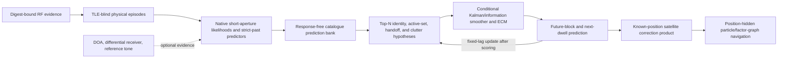

# Satellite Association and PNT Implementation Plan

## Motivation

The project ultimately needs to turn opportunistic Starlink downlink signals
into a defensible global receiver-position estimate. The development receiver
currently has known coordinates, which provides a valuable reference phase for
learning measurement errors, receiver/LNB behavior, satellite ephemeris and
clock corrections, and association uncertainty before receiver position is
released as an unknown.

The immediate scientific opportunity is to combine the repository's recovered
POST-FIX CFO trajectories, including the opened 13.825 s and 30 s long arcs,
with literature-backed multi-hypothesis association and reference-station PNT
methods. The goal is not to make another lowest-residual catalogue label. It is
to determine whether the available radio evidence predicts a stable satellite
identity, ambiguity set, handoff sequence, or abstention on future data, and
then determine whether the resulting correction products support positioning.

## Problem

Current tracking recovers receiver-relative CFO trajectories, but catalogue
identity is unstable across predictor models, training cutoffs, and future
blocks. Short arcs are nearly linear after a free CFO intercept is removed, and
hundreds of visible Starlinks can have similar Doppler rates. Receiver/LNB
drift, transmitter and beam frequency state, satellite clock drift, TLE error,
sample-clock error, aliases, refills, and path-local discontinuities can imitate
parts of the orbital curve.

A single unconstrained fit cannot identify all of those terms. A greedy
rank-one association can lock onto the wrong satellite, while a monolithic EM
fit can converge to a locally consistent but incorrect identity. Conversely,
forcing all fragments or sequential dwells to share one NORAD can hide real
handoffs, activity changes, aliases, and out-of-catalogue observations.

The known development position removes one source of uncertainty, but it does
not itself establish NORAD truth. Using the same observations both to estimate
satellite corrections and to demonstrate positioning would also be circular.
Calibration, association development, correction-product freeze, and blinded
positioning therefore need distinct data and authority boundaries.

## Solution

Implement a catalogue-constrained, Rao-Blackwellized, fixed-lag
multi-hypothesis smoother:

- build physical RF episodes and alias/replica relationships without TLEs;
- preserve short-window likelihood evidence instead of reducing it immediately
  to hard tracks;
- maintain top global hypotheses for satellite identity, active-emitter count,
  handoffs, and unassigned/clutter observations;
- condition on each discrete hypothesis and use an information/Kalman smoother
  plus generalized EM/ECM to estimate only the allowed continuous nuisance
  states;
- select and fit with training data, freeze the state, and score future blocks
  or future dwells exactly once;
- use the known-position phase to publish versioned satellite-side correction
  products with covariance and validity intervals; and
- freeze those products before hiding receiver position and evaluating
  navigation.

This is a living implementation plan, not an experiment protocol, dataset
authorization, evidence receipt, secure-NORAD claim, or RF collection
authorization. Numeric scientific thresholds remain unset until calibrated on
known-truth injections and frozen before untouched confirmation data are
opened.

## Method

This plan synthesizes the repository's seeded alias EM, multi-dwell catalogue
association, raw-Doppler, activity-assignment, and post-refill retrospective
work with the completed 2026-08-26 Doppler/association campaign discussed in
the project review. It also incorporates primary literature on LEO
Mahalanobis data association, MHT/JPDA smoothing, full-frame Starlink
measurement estimation, reference-derived ephemeris corrections,
time-diverse Doppler positioning, and simultaneous tracking and navigation.

Implementation must follow repository contract boundaries: pure analyzers do
not import storage or infrastructure, QNAP access remains read-only, public
contracts remain immutable within a major version, and every component change
includes component-owned tests. Opened development data may refine the method
but cannot become independent confirmation evidence.

The plan was authored from commit
`eca358bc43d82bf672064d184c1c97e49a062cd5` on a dirty development checkout.
Later campaign artifacts discussed in the review are not assumed to be landed
dependencies. WP0 must reconcile the tracked integration state, user-owned
working changes, and exact campaign authorities before scientific execution.

## Goal and current status

**Goal status:** ACTIVE.

**Goal:** implement and test known-position calibration, multi-hypothesis
multi-dwell satellite association with scoped nuisance modeling, predictive
validation, frozen satellite corrections, and blinded-position evaluation.

**Current cut line:** WP0 is complete. Additive V1 physical-episode,
catalogue-prediction, exact `K=0,1,2` hypothesis, transferable-correction, and
blinded-evaluation contracts now exist, together with the first pure synthetic
Rao-Blackwellized exact solver. A response-free raw-snapshot-bound SGP4 bank
adapter and a causal, covariance-aware, single-episode nearest-neighbour
diagnostic now exist. A synthetic causal multi-dwell forward filter now carries
`NULL`/NORAD histories, a receiver-local drift random walk, proper dwell-local
CFO-offset marginalization, and score-before-assimilation next-dwell evidence.
A synthetic single-emitter projection now builds the solver-safe correction
product and replays it conditionally on later known-position observations while
fitting a fresh target-local offset. A truth-isolated local Doppler MAP solver
now consumes frozen correction modes, time-diverse satellite states, and a
precommitted local ECEF prior; it retains shared satellite-frequency
uncertainty across observations and seals an oracle or conditional
unknown-identity position posterior without a truth/reveal input port.
A separate reveal-only evaluator now revalidates the exact post-seal receipt
and recomputes ECEF/ENU errors and covariance-consistency diagnostics without
refitting the estimate.
An additive simultaneous-satellite correction-set contract now keeps one
complete single-emitter probability simplex per externally frozen source slot
and selects exactly one eligible mode per slot for the oracle lane. It does not
renormalize alternative-identity probabilities across physical satellites or
pretend that a one-emitter ambiguity product is a simultaneous constellation.
An additive V2 oracle challenge, local Doppler solver adapter, truth-free
estimate, and reveal-only evaluator now consume this set end to end on
synthetic data without changing the V1 single-emitter contracts.
An exact bounded joint-correction hypothesis builder now combines several
frozen single-emitter posteriors, retains each slot's unassigned choice,
enforces simultaneous-NORAD exclusivity, and preserves every feasible joint
hypothesis. It is explicitly conditional on an independent-slot approximation;
shared calibration nuisance is not yet jointly modeled. An additive partial
unknown-identity navigation lane now consumes every fully assigned, valid
four-satellite hypothesis on identical target response rows, reweights those
modes by target likelihood, and preserves all other prior mass as unresolved.
Separately, an additive exact-association joint-calibration product now
preserves the native `K=0,1,2` modes from one shared-nuisance association fit.
It retains externally calibrated cross-satellite frequency covariance while
keeping the association's receiver/LNB/component nuisance marginalized and
opaque. A frequency-gauge authority is required per non-null mode; unresolved
gauges cannot become navigation-eligible.
The two exact opened POST-FIX long arcs now have a digest-bound, fail-closed
development protocol and one completed authorized execution. Attempt 1 failed
closed at the response-free population work cap before response scoring; the
failure receipt was preserved. A work-cap-only amendment authorized attempt 2,
which completed the full `delta=-500,0,+500 s` populations, training-frozen
catalogue rankings, rolling future scores, and equal-mask polynomial-null
comparisons. The sealed report and additive audit classify `9981` as a stable
conditional candidate with incomplete true-time specificity, and `150802` as a
strongly true-time-specific candidate with one early rolling-origin label flip.
An exact evidence-to-episode adapter now reproduces the two registered graphs
and immediately projects them through the response-free prediction-support
port. A training-frozen support-integrated line/quadratic/cubic radio null is
also qualified on synthetic data. A response-free full-Starlink geometric
horizon selector now authenticates exact TLE bytes and freezes a complete,
unranked candidate universe independently for each predeclared
`delta=-500,0,+500 s` field. The SGP4 bank binds that field receipt before
propagation. A fail-closed development runner now builds all three banks before
response scoring, retains every training-only tau profile, and evaluates the
main and rolling future partitions against equal-calendar-block polynomial
nulls. These components were first qualified on synthetic data and then used
only by the exact authorized attempt-2 runner on the two registered opened
arcs. No IQ was reopened during the execution.
Calibrated ephemeris covariance, full fixed-lag smoothing and ECM,
direct estimation of gauge-resolved satellite frequency covariance from the
known-position batch, broad-prior particle navigation, joint
identity/correction refinement, radio-only positioning, and four-lane blinded
evaluation remain pending. This document authorizes no additional IQ access,
catalogue rerun, data selection, or RF collection. The one catalogue run now
recorded was the exact opened-development execution authorized by the two
committed amendments; it is not confirmation data.

### Implementation checkpoint — 2026-08-27

| Item | State | Evidence |
|---|---|---|
| WP0 collision and reusable-oracle audit | DONE | New work is isolated from the existing TLE-blind `multi_target` tracker and user-owned Research prototypes. |
| Physical observation/episode and response-free candidate bank contracts | DONE, synthetic boundary | Support moments, stable raw-source authority, non-overlap, chronological episode order, causal snapshot, verified element membership, frozen candidate universe, and exact tau-grid policy in [`catalogue_association.py`](../src/leo/contracts/catalogue_association.py) |
| Exact bounded `K=0,1,2` association with normalized feasible-family priors | DONE, synthetic baseline | [`catalogue_association.py`](../src/leo/analysis/catalogue_association.py); input contracts are revalidated before scoring and extreme log-prior translations are normalized in the shifted domain. |
| Proper Gaussian marginalization of continuity offsets and hardware-epoch drift | DONE, synthetic baseline | Direct covariance-form equality and recovery tests in [`test_catalogue_association.py`](../tests/analysis/test_catalogue_association.py) |
| Response-free raw-TLE-to-bank SGP4 adapter | DONE for a frozen synthetic candidate universe | [`catalogue_prediction.py`](../src/leo/analysis/catalogue_prediction.py) and [`test_catalogue_prediction.py`](../tests/analysis/test_catalogue_prediction.py); exact snapshot bytes and selected element pairs are digest-bound before propagation, support kernels are integrated, and tau is canonical at 1 ns. The diagonal uncertainty floor/age/residual model is declared, not calibrated orbit covariance. |
| Response-free full-Starlink field population | DONE, synthetic qualification plus authorized opened-development execution | [`catalogue_population.py`](../src/leo/analysis/catalogue_population.py) and six focused tests in [`test_catalogue_population.py`](../tests/analysis/test_catalogue_population.py) authenticate exact TLE bytes, filter Starlink by name and complete geometric horizon support, bind support/site/tau/field policy, and emit no rank or truncation. Attempt 2 completed all six opened-arc fields: candidate counts were 503/488/501 for `9981` and 572/573/576 for `150802` at `delta=-500/0/+500 s`. |
| Training-frozen covariance-aware nearest-neighbour baseline | DONE, single-episode synthetic diagnostic | [`nearest_neighbour_association.py`](../src/leo/analysis/nearest_neighbour_association.py) and [`test_nearest_neighbour_association.py`](../tests/analysis/test_nearest_neighbour_association.py); candidate/tau/offset selection uses the training prefix and every frozen hypothesis is scored once on the same future suffix. Exact candidate, heldout, and tau-profile ties remain abstentions. |
| Causal multi-dwell catalogue filter | DONE, synthetic forward-filter foundation | [`multi_dwell_catalogue_smoothing.py`](../src/leo/analysis/multi_dwell_catalogue_smoothing.py) and [`test_multi_dwell_catalogue_smoothing.py`](../tests/analysis/test_multi_dwell_catalogue_smoothing.py); one source state per dwell, at most two distinct NORADs per retained history, explicit `NULL`, normalized family priors, receiver-local drift resets, proper dwell-offset marginalization, and score-before-assimilation rolling receipts. This is not yet a simultaneous-emitter solver, ECM, or backward smoother. |
| Solver-safe corrections and blinded truth/estimate/reveal boundary | DONE, contract plus single-emitter synthetic builder | Contracts and boundary poisons are in [`satellite_pnt.py`](../src/leo/contracts/satellite_pnt.py) and [`test_satellite_pnt.py`](../tests/contracts/test_satellite_pnt.py). The `K<=1` known-position projection and conditional future replay are in [`satellite_correction_replay.py`](../src/leo/analysis/satellite_correction_replay.py) and [`test_satellite_correction_replay.py`](../tests/analysis/test_satellite_correction_replay.py). The published V1 product still fails closed on coexisting `K=2`; the additive joint product below carries those semantics instead. |
| Native `K=0,1,2` joint calibration product | DONE, synthetic contract and builder | [`satellite_pnt_joint_calibration.py`](../src/leo/contracts/satellite_pnt_joint_calibration.py) and [`satellite_correction_joint_replay.py`](../src/leo/analysis/satellite_correction_joint_replay.py) preserve every reported exact-association mode and its probability, bind exact episode assignments and TLE members, and retain a PSD cross-satellite bias/drift covariance supplied by a separate known-position calibration authority. Association component offsets and hardware drift affect mode evidence but are never exported. Unresolved receiver/satellite frequency gauge, tau boundary, stale TLE, incomplete mode coverage, indefinite covariance, or missing source authority makes a mode ineligible or fails closed. This does not yet estimate the satellite-side covariance or feed it into the joint positioning lane. |
| Synthetic mixtures and exact-association poisons | DONE for current exact-solver scope | 31 focused tests cover K=0, 10/0, 8/2, 5/5, ambiguity, unassigned, replica/exclusion, enumeration, work caps, normalized priors, covariance, time-grid boundaries, posterior closure, source re-wrapping/chronology, stale-contract inputs, and tamper cases. |
| SGP4 adapter and nearest-neighbour poisons | DONE for current synthetic scope | 33 adapter tests and 18 nearest-neighbour tests cover raw snapshot/element mutations, causality, response exclusion, work caps, field-receipt binding, tau aliases/extreme priors, covariance, train/future isolation, stale contracts, null selection, and exact ambiguity. |
| Multi-dwell filter and numerical poisons | DONE for current synthetic scope | 27 focused tests cover handoff/null histories, candidate-family mass invariance, `K<=2` history semantics, drift/reset behavior, causal future-value isolation, pruning and tie abstention, stable mixture predictive evidence, fail-closed extreme arithmetic, row/extension work caps, and dense-Gaussian equivalence. An independent 5,000-case Woodbury comparison found no high/medium blocker. |
| Correction projection and replay poisons | DONE for current synthetic `K<=1` scope | 9 focused tests cover solver-safe/site-private projection, ambiguity-mode closure, bounded-tau uncertainty, `K=2` refusal, complete satellite-frequency inventory, exact observer/TLE/association binding, future validity, stale-contract rejection, receiver-local-field poison, and dense-Gaussian replay evidence. Replay is conditioned on an assigned mode and scores no radio-only/null alternative, so it makes no identity or navigation claim. |
| Simultaneous oracle correction set | DONE, additive contract and synthetic V2 navigation lane | [`satellite_pnt_sets.py`](../src/leo/contracts/satellite_pnt_sets.py) and [`test_satellite_pnt_sets.py`](../tests/contracts/test_satellite_pnt_sets.py) preserve each selected satellite's complete single-emitter product and local probability semantics, require distinct eligible NORADs and a common validity interval, and contain no calibration site or receiver-local state. [`satellite_pnt_challenge_v2.py`](../src/leo/contracts/satellite_pnt_challenge_v2.py), [`blinded_doppler_position_sets.py`](../src/leo/analysis/blinded_doppler_position_sets.py), and the reveal-only V2 boundary consume four selected products without renormalizing their within-emitter probabilities. Six focused tests recover synthetic position and reject overlap, expiry, incomplete-set, stale-challenge, and nested-estimate poisons. This remains an oracle/precommitted selection lane; it does not encode unknown-identity joint hypotheses. |
| Joint frozen-correction hypotheses and partial positioning | DONE, exact synthetic builder plus conditional joint lane | [`satellite_pnt_hypotheses.py`](../src/leo/contracts/satellite_pnt_hypotheses.py), [`satellite_correction_hypotheses.py`](../src/leo/analysis/satellite_correction_hypotheses.py), and focused tests enumerate the complete bounded product of per-slot mode/unassigned probabilities, reject repeated simultaneous NORADs, preserve exact posterior closure, canonicalize slot order, reject truncation/stale products, and fail before an excessive Cartesian family is materialized. [`satellite_pnt_joint_challenge.py`](../src/leo/contracts/satellite_pnt_joint_challenge.py), [`blinded_doppler_position_joint.py`](../src/leo/analysis/blinded_doppler_position_joint.py), and the reveal-only joint evaluator compare every fully assigned valid four-satellite mode on identical target response rows. Unevaluable prior mass remains unresolved and is explicitly not compared through a fabricated target likelihood. The lane is always `PARTIAL`, with `slot_posterior_independence_assumed=true`, `shared_calibration_nuisance_jointly_modeled=false`, and `identity_claimed=false`. |
| Truth-isolated local Doppler positioning | DONE for the first synthetic oracle/frozen-identity slice | [`blinded_doppler_position.py`](../src/leo/analysis/blinded_doppler_position.py) and [`test_blinded_doppler_position.py`](../tests/analysis/test_blinded_doppler_position.py) implement local ECEF Gaussian-prior MAP positioning with a shared receiver CFO state, frozen per-satellite frequency corrections, correlated correction uncertainty, exact consumed-mode lineage, dense-covariance/work bounds, and no truth/reveal import or argument. Oracle output may be complete; unknown frozen-identity output remains explicitly partial because no radio/null alternative is scored. |
| Reveal-only position evaluation | DONE for the first synthetic lane | [`blinded_position_evaluation.py`](../src/leo/analysis/blinded_position_evaluation.py) and [`test_blinded_position_evaluation.py`](../tests/analysis/test_blinded_position_evaluation.py) revalidate the exact challenge/estimate/truth receipt after sealing, recompute WGS84 ECEF and ENU error, preserve ambiguity mass, and report rank-one/conditional error plus semidefinite-safe NEES and 95% covariance diagnostics. The evaluator cannot alter or refit the sealed estimate. |
| Correction/blinded-boundary poisons | DONE for contract scope | 14 focused tests and all 52 repository contract tests cover covariance, chronology, source-span disjointness, freshness/expiry, lane separation, prior breadth, truth commitment, and reveal closure. |
| Local Doppler-position poisons | DONE for current synthetic local-prior scope | 8 focused tests cover sub-metre synthetic recovery, analytic-vs-finite-difference Jacobians, correlated satellite-frequency uncertainty, equal-mode ambiguity, truth-free source/import boundary, stale nested evidence, frozen tau binding, observation and dense-covariance work caps, candidate-bank provenance, broad-prior rejection, and explicitly partial unknown-identity output. |
| Opened long-arc development protocol | FROZEN; ATTEMPT 2 EXECUTED | [`satellite-pnt-long-arc-development-protocol-v1.json`](../config/analysis/satellite-pnt-long-arc-development-protocol-v1.json), the two additive execution amendments, and the [execution receipt](../reports/figures/2026_08_27_satellite_pnt_long_arc_development_attempt2-execution-receipt.json) bind exactly the registered 30 s `9981` and 13.825 s `150802` arcs, evidence hashes, support-centred timing rules, causal TLE snapshots, reviewed site preset, `tau=0` plus `[-5,+5] s`, observe-only `delta=±500 s`, chronological masks, radio-polynomial comparators, and claim denials. Attempt 1 failed closed at the work cap; attempt 2 completed without reopening IQ. |
| Registered long-arc graph and response-free support adapter | DONE, no association execution | [`long_arc_catalogue_adapter.py`](../src/leo/analysis/research/long_arc_catalogue_adapter.py) authenticates the frozen report bytes, reconstructs the exact 881-row and 550-row support-centred physical graphs, and emits a narrow support port with no CFO, receiver-path, source-binding, or uncertainty response fields. Seven focused tests pin both graph/support/receipt digests and reject evidence or nested-authority mutations. IQ, TLE propagation, candidate selection, and association scoring are absent. |
| Equal-opportunity radio-polynomial null | DONE, synthetic qualification only | [`radio_polynomial_null.py`](../src/leo/analysis/research/radio_polynomial_null.py) fits support-integrated line/quadratic/cubic models on an explicit training prefix and scores one identical future suffix with coefficient uncertainty propagated. Six tests cover exact support moments, curvature discrimination, future-response isolation, dense-Gaussian equality, partitions/work caps, and stale graph poison. It produces no identity probability, threshold, or gate. |
| Common-future predictive-evidence decomposition | DONE, synthetic diagnostic | [`predictive_evidence_diagnostics.py`](../src/leo/analysis/research/predictive_evidence_diagnostics.py) requires exact graph and train/future inventory equality, reconstructs catalogue-orbit and radio-polynomial Gaussian NLL from residual-fit, uncertainty-volume, and normalization terms, and explicitly identifies RMS/NLL preference reversals. Five tests cover the real failure shape, partition/row closure, Gaussian-term tampering, and explicit catalogue selection. Cross-family uncertainty and search multiplicity remain uncalibrated, so this layer emits no odds, threshold, model-selection gate, or identity claim. |
| Known-truth covariance-scale calibration | DONE, synthetic kernel; no real calibration claim | [`predictive_uncertainty_calibration.py`](../src/leo/analysis/research/predictive_uncertainty_calibration.py) learns only a uniform covariance multiplier from digest-bound known-truth cases, weights frozen scenarios equally, and reports leave-one-scenario-out consistency before applying the scale to an evidence-disjoint target. Ten tests cover scenario-vs-row weighting, exact scaled NLL, target leakage/rewrapping, stale decompositions/results, scenario floors, zero-information and extreme-arithmetic refusal, and the 19-scenario finite-rank floor. Covariance shape, formal coverage, cross-family odds, and thresholds remain explicitly unclaimed. |
| Opened-long-arc development runner | DONE; synthetic qualification plus one authorized real execution | [`long_arc_satellite_pnt_runner.py`](../src/leo/analysis/research/long_arc_satellite_pnt_runner.py) builds all `delta=-500,0,+500 s` response-free populations/banks before any response score, preserves all 41 training-only tau scores, evaluates the 60/40 plus three rolling partitions, reports pooled/equal-calendar-block future RMS and line/quadratic/cubic null comparisons, and keeps wrong-epoch fields observation-only. The sealed [results](../reports/2026_08_27_satellite_pnt_long_arc_development_results_attempt2.md) and [independent audit](../reports/2026_08_27_satellite_pnt_long_arc_development_audit.md) now exercise that path on both exact registered arcs. |
| Current null and evidence scope | RESTRICTED synthetic baseline | Exact-association posterior odds remain conditional on the complete frozen response-free candidate universe, and its internal `K=0` still uses the declared zero-curve component-offset/hardware-drift Gaussian baseline. The polynomial null is a separate future-prediction comparator, not yet part of posterior normalization. |
| Real opened long arcs | OPENED-DEVELOPMENT EXECUTION COMPLETE; IDENTITY UNRESOLVED | The 30 s `9981` arc keeps NORAD 67930 at all rolling origins but loses to the `-500 s` field on two future comparisons. The 13.825 s `150802` arc strongly beats both wrong-epoch fields but selects 65438 rather than future-best 59748 at the earliest rolling origin. Both main orbit curves beat the cubic radio null in RMS, while the current Gaussian likelihood favors the cubic, so cross-model calibration remains pending. No secure NORAD, recurrence, correction, or PNT claim is made. |

## North-star milestone

The first end-to-end milestone is complete only when all of the following are
demonstrated:

1. A known-position calibration cohort produces a versioned satellite
   correction product without using future response data.
2. A later untouched observation is processed with the correction product
   frozen.
3. The association layer returns either a stable NORAD, a calibrated ambiguity
   set, a handoff/active-set sequence, or an explicit abstention.
4. With receiver coordinates hidden, the navigation layer produces a
   calibrated position posterior and reports 2-D/3-D error against truth only
   after the estimate is sealed.
5. Oracle-identity, unknown-identity/frozen-correction, and fully joint lanes
   isolate whether any failure came from the measurement, association,
   correction, or positioning layer.

Posterior collapse and optimizer convergence are not success criteria. The
primary criteria are future predictive performance, calibrated uncertainty,
and eventual blinded positioning accuracy.

## System shape



The fundamental association unit is a physical RF episode or source group,
not a tracker fragment and not an arbitrary 500 ms fit. A single emission may
have multiple replicas, aliases, paths, or reset-separated fragments. Multiple
simultaneous incompatible canonical tracks imply multiple physical emissions
and must retain exclusion constraints.

## Claim and work status vocabulary

| Term | Meaning |
|---|---|
| `HARD` | Integrity, causality, leakage, or authority requirement; failure causes no-result. |
| `OBSERVE` | Reported sensitivity with no pass/fail or promotion effect. |
| `DIAGNOSTIC` | Model or nuisance comparison that cannot silently change the primary claim. |
| `UNSET` | Concept is required but its numerical threshold awaits calibration and protocol freeze. |
| `SUPERSEDED` | Historical result remains immutable but is not used prospectively. |
| `BLOCKED` | Work cannot start until its explicit authority or dependency exists. |

Evidence terms such as established, supported, candidate, and not established
remain distinct from implementation status.

## Data roles and authority

| Cohort | Intended role | Prohibited interpretation |
|---|---|---|
| Seeded alias and historical multi-dwell artifacts in this checkout | Algorithm regression and failure-case study | Current identity truth or confirmation |
| Opened POST-FIX 30 s `9981` and 13.825 s `150802` long arcs from the completed campaign | Primary development of curvature-aware, multi-hypothesis association | Independent confirmation, secure NORAD, or positioning validation |
| Completed ten-capture response-sealed final holdout from the completed campaign | Immutable historical regression and method sensitivity | Retuning, new promotion, or fresh confirmation |
| Exact authorized HARD-NULL backgrounds | Known-truth synthetic measurement, mixture, and nuisance calibration after a response-free protocol freeze | Real satellite identity evidence |
| Future unopened POST-FIX long arcs or repeated passes | Confirmation only after model, thresholds, and correction schema are frozen | Exploratory tuning |
| New or ongoing RF data | Forbidden until separately authorized by the user and bounded by repository collection policy | Implicit authorization from this plan |

Before an experiment binds the completed campaign inputs, their exact registry,
protocol, reports, and receipts must be present in the active integration branch.
Missing campaign artifacts must cause a blocked/no-result state; implementations
must not substitute similar captures, TLEs, sites, or spans.

## Measurement and estimator contract

For source episode `e`, observation `j`, and candidate identity `z_e`, use a
window-integrated model rather than evaluating a point curve at probe start:

```text
y[e,j] = Dbar[z_e](support[e,j], receiver_position,
                   satellite_correction[z_e])
         + episode_or_path_offset[e]
         + receiver_radio_state[hardware, time]
         + satellite_or_beam_frequency_state[z_e, activity_epoch]
         + robust_error[e,j]
```

`Dbar` is the predicted Doppler averaged with the actual estimator support
kernel. The observation artifact must persist support moments, RF authority,
sample-clock authority, estimator covariance, continuity identity, alias
identity, and response-access chronology.

### Continuous state scope

| State | Share within | Reset or re-prior at | Primary treatment |
|---|---|---|---|
| Receiver/LNB drift | Simultaneous signals on one physical oscillator; sequential dwells only within a declared hardware-continuity epoch | Retune, restart, clock/LO change, or measured change point | Zero-centered bounded random walk or hierarchical shrinkage |
| Path/episode CFO intercept | Verified continuity component or activity epoch | Refill/reset/retune/path discontinuity | Free local intercept under an explicit gauge |
| Satellite identity | Replica-connected paths and fragments assigned to one emitter | Inactivity/handoff; never on a mere tracker reset | Discrete NORAD or unassigned state |
| Equivalent epoch/orbit correction | One NORAD, causal TLE, and validity interval | New TLE or expired correction | `tau=0` primary; `[-5,+5] s` sensitivity; no automatic widening |
| Satellite/beam clock-frequency state | One inferred emitter and beam/FAI activity epoch | One-second/15-second or detected transmitter step | Bounded/random-walk state with explicit jump model |
| Receiver position | Calibration session | Released only for blinded evaluation | Fixed truth in calibration; posterior variable in navigation |

Absolute receiver LO, transmitter CFO, and satellite clock terms have a gauge
ambiguity. The implementation must fix a documented reference or marginalize
the unidentifiable combination. It must not create a separately free slope,
time shift, and intercept for every fragment, because that erases the orbital
information required for identity.

### Discrete state scope

The hypothesis state includes:

- active emitter count `K`, beginning with `K=0,1,2`;
- NORAD or explicit unassigned/clutter identity for each emitter;
- fragment-to-emitter assignment;
- activity, birth, death, and handoff sequence;
- bounded alias integer and replica/exclusion constraints; and
- optional missed detections on scheduled usable observations.

Birth/death refers to RF activity in the receiver, not physical satellite
existence. A candidate may own multiple non-overlapping fragments. Simultaneous
exclusion-connected fragments may not own the same candidate unless an
explicit multi-beam same-satellite model is separately frozen and tested.

## Prospective time policy

- Exact UTC and `tau=0` remain the primary physical model.
- Candidate-specific `tau in [-5,+5] s` is a bounded sensitivity informed by
  seconds-scale recent-TLE corrections in the PNT literature; it is not a
  universally proven prior.
- A tau solution at either boundary causes an association abstention or
  boundary diagnostic; it never causes the search to widen automatically.
- Full-catalogue fields at `delta=-500 s` and `delta=+500 s` are `OBSERVE`
  challenges only. Each gets the same local tau support and nuisance freedom as
  the true-time field, with training-only selection and one future score.
- The two wrong-epoch fields do not form a null distribution, p-value, hard
  gate, or secure-identity criterion.
- The historical 40-field, +/-15 minute to +/-5 hour empirical-rank control is
  `SUPERSEDED` prospectively but remains immutable historical evidence.

## Window and observable policy

- Preserve native per-probe likelihood/ambiguity evidence for association,
  including the exact 20 ms GLRT aperture where that measurement contract is
  used.
- Keep measurement-aperture duration distinct from strict-past predictor
  history. Fixed20, fixed125, and fixed500 denote history windows; they are not
  automatically 20, 125, and 500 ms RF integration apertures.
- Treat fixed125 as the leading current immediate-CFO predictor, not a promoted
  production winner.
- Retain fixed500 and lean quadratic models on identical masks as model
  sensitivity lanes.
- Treat a 500 ms trajectory as a summary or continuous-state update interval,
  not the fundamental identity unit.
- On long arcs, compare line, quadratic, and bounded cubic descriptions with
  block-weighted validation; curvature is evidence, while jerk remains
  secondary until independently confirmed.
- Add full-frame/predictable-symbol CFO and TOA likelihoods when supported by
  the existing corpus. Qin/pilot detection establishes Starlink-format signal,
  not NORAD identity.
- Add DOA, a disciplined reference, or differential-receiver evidence through
  optional narrow ports; absence of those measurements must remain explicit.

## Work packages

### WP0 — Integration and authority closure

**Purpose:** establish exact inputs and prevent silent use of stale or similar
artifacts.

**Deliverables:**

- active-branch inventory of the completed campaign protocols, reports,
  registries, TLE authorities, site/RF authorities, and artifact hashes;
- one versioned experiment protocol for each data-opening boundary; and
- a deny-by-default dataset resolver that authorizes exact capture/span/path
  identities.

**Tests:** missing, altered, newer, extra, or substituted inputs fail before IQ,
response, propagation, or ranking access.

**Exit:** every development and future-confirmation row resolves to immutable
authority, or the work remains `BLOCKED`.

### WP1 — Measurement-kernel and physical-episode foundation

**Purpose:** ensure association consumes faithful physical observations rather
than biased timestamps or duplicated tracker fragments.

**Deliverables:**

- support-centred/window-integrated CFO observation contract;
- persisted support moments and calibrated/frozen uncertainty inputs;
- TLE-blind source groups, fragments, replica edges, exclusion edges, and
  unassigned state; and
- exact sample-clock, continuity, alias, and RF lineage.

**Tests:** support-centre regression; alias lift/replay; refill and continuity
poisoning; nested-fragment weight caps; simultaneous-incompatible-track
preservation; no TLE import in episode construction.

**Exit:** the long-arc rows reproduce under the new timestamp contract and no
tracker fragmentation can create extra association votes.

### WP2 — Candidate likelihood bank and baselines

**Purpose:** produce complete, uncertainty-aware candidate evidence before
global association.

**Deliverables:**

- causal TLE propagation integrated over observation support;
- response-free candidate geometry/visibility population;
- robust per-fragment and per-episode candidate likelihood/cost matrices;
- explicit radio-only/polynomial and unassigned likelihoods; and
- covariance-aware nearest-neighbor/EKF baseline.

**Tests:** finite-difference propagation; candidate completeness and stable
ordering; TLE/site/RF poison tests; equal-mask scoring; analytic synthetic
curves; invariance under harmless row duplication and ordering.

**Exit:** every candidate and null model is scored with equal evidence and
nuisance opportunity, without looking at future response.

### WP3 — `K=0,1,2` multi-hypothesis association

**Purpose:** preserve one-emitter, two-emitter, handoff, and ambiguity
explanations instead of majority voting fragments.

**Deliverables:**

- exact or top-N active-set enumeration after response-free gating;
- chronological assignment with replica/exclusion constraints;
- unassigned/clutter and handoff states;
- deterministic tie handling, pruning receipts, and complete runner sets; and
- posterior/marginal likelihood that includes covariance and complexity rather
  than minimized RMS alone.

**Tests:** 10/0, 8/2, and 5/5 mixtures; false split/merge; sequential and
simultaneous emitters; close-rate pairs; label swapping; clutter; missed
detections; enumeration versus brute force on small banks.

**Exit:** known-truth mixtures return calibrated active-count and assignment
posteriors or explicit ambiguity without candidate truncation.

### WP4 — Conditional nuisance smoother and ECM

**Purpose:** jointly estimate legitimate shared state without absorbing
identity-specific curvature.

**Deliverables:**

- information/Kalman smoother for conditionally linear nuisance states;
- bounded nonlinear tau/orbit profile;
- generalized EM/ECM updates inside each retained discrete hypothesis;
- deterministic multi-start and two-cycle/local-mode diagnostics; and
- fixed-lag backward smoothing after, never before, future scoring.

**Tests:** monotonic penalized objective/ELBO; gauge invariance; bound hits;
random-walk/reset behavior; multi-start disagreement; comparison with direct
optimization on small synthetic cases; no per-fragment hidden slope/tau.

**Exit:** nuisance recovery and uncertainty are calibrated on known truth, and
different near-optimal identity modes remain separate.

### WP5 — Calibration and model-selection suite

**Purpose:** learn measurement floors, structural penalties, and reporting
thresholds without using real candidate outcomes as truth.

**Deliverables:**

- response-free injection protocol covering rate, acceleration, jerk,
  sample-clock ppm, RF-scale error, SNR, occupancy, steps, aliases, drift,
  retunes, TLE error, and emitter mixtures;
- comparison of radio-only, current independent fit, NNDA/EKF, `K=1`, `K=2`,
  and oracle-label lanes with equal nuisance flexibility; and
- frozen thresholds or formal abstention where the number of independent
  calibration groups is insufficient.

**Tests:** exact truth and seed reproduction; scenario-equal aggregation;
identical evaluable-ID gates; block/group uncertainty; no invalid finite-sample
coverage claim.

**Exit:** any future numeric identity or margin threshold is frozen before an
untouched confirmation cohort is opened.

### WP6 — Opened long-arc development

**Purpose:** determine whether the current best real arcs contain useful
catalogue information under the new model.

**Deliverables:**

- `K=0,1,2` reports for `9981` and `150802`;
- candidate and active-set posterior timelines;
- tau profiles, nuisance profiles, candidate-switch points, and polynomial-null
  comparisons;
- causal future-block and rolling-origin predictions; and
- top-k/equivalence-set and abstention outputs.

**Tests:** results reproduce from sealed inputs; every no-result persists;
training selections are frozen before future scoring; block/episode units, not
raw row counts, control uncertainty.

**Exit:** each arc is honestly classified as stable candidate, ambiguity set,
handoff/multi-emitter sequence, radio-only, or unresolved. No confirmation or
secure-NORAD claim is made.

### WP7 — Sequential multi-dwell prediction

**Purpose:** test whether later geometry resolves earlier ambiguity and whether
shared satellite corrections transfer over time.

**Deliverables:**

- rolling experiment: fit dwells `1..d`, predict `d+1`, seal score, then
  assimilate and optionally smooth backward;
- identity, active-count, nuisance, and correction-state trajectories; and
- leave-one-session-out analysis where enough sessions exist.

**Tests:** future-dwell poison fields; state reset and validity expiry;
permutation of dwell order where chronology should matter; offline reduced-bank
Rao-Blackwellized particle audit of top-N pruning.

**Exit:** improvement is demonstrated in future predictive log score and
calibrated identity sets, not merely full-data residual or apparent convergence.

### WP8 — Satellite correction product

**Purpose:** create the transferable boundary between the known-position
reference and an unknown-position receiver.

**Required fields:**

- NORAD or explicit ambiguity set;
- causal TLE hash, element epoch/age, and propagation model;
- equivalent epoch/orbit correction and covariance;
- satellite/beam clock-frequency state and covariance;
- correction validity start/end and expiry reason;
- association probability/evidence class;
- calibration site/time and measurement provenance; and
- explicit exclusion of local receiver/LNB/path states.

**Tests:** canonical digest, immutable versioning, covariance validity,
expiry/rejection, gauge separation, and no receiver-local state leakage.

**Exit:** a correction product can be loaded without opening calibration IQ and
predicts a later known-site observation within its frozen uncertainty.

### WP9 — Position-hidden navigation

**Purpose:** measure whether associated/corrected signals actually determine
receiver position.

**Current implementation:** the first local-prior numerical slice exists for
lanes 1 and 2. It keeps multiple frozen correction hypotheses separate, solves
time-diverse Doppler plus one receiver-CFO state, propagates shared
satellite-frequency correction covariance, and seals the estimate before any
truth port exists. Lane 2 remains `PARTIAL`: its modes are conditional on the
frozen candidate bank and it has no equal-opportunity radio/null likelihood.
The reveal-only evaluator exists for this slice. The 10 km/100 km/global
initialization ladder, particles, joint correction, radio-only control, and
four-lane blinded comparison remain future work.

**Lanes:**

1. oracle identity and oracle/frozen correction;
2. unknown identity with frozen reference-derived correction;
3. unknown identity with jointly refined correction; and
4. radio-only/no-correction control.

**Initialization ladder:** declared position priors of approximately 100 m,
10 km, 100 km, and continental/global scope. Broad priors require particles or
geographic modes; identity uncertainty remains a mixture in the position
posterior. An Earth-surface/altitude constraint must be declared rather than
silently assumed.

**Tests:** synthetic position recovery; numerical Jacobians; posterior
multimodality; prior-radius sweep; wrong-identity poisoning; correction expiry;
leave-session-out and frozen-output truth reveal.

**Exit:** a sealed position posterior is produced before truth is read, and the
result reports 2-D/3-D error, covariance/credible-region coverage, convergence
mode, and failure attribution by lane.

### WP10 — Untouched confirmation and operational scaling

**Purpose:** confirm the method independently and decide whether a correction
network, STAN, or additional observable is required.

**Deliverables:**

- versioned protocol and thresholds committed before opening new response;
- at least one untouched long arc and preferably repeated, separated geometry;
- independent receiver/pass recurrence where feasible; and
- decision on reference-network corrections, STAN/radio-SLAM, DOA, wideband,
  disciplined oscillator, or differential-receiver investment.

**Exit:** the full milestone passes on untouched data, or the result identifies
the measured observability limitation and the next required observable. Any
new RF collection requires explicit user authorization and remains bounded by
repository policy.

## Parallel execution and dependencies

| Lane | Can start after | Work | Joins at |
|---|---|---|---|
| A — Measurement | WP0 | WP1 support kernels, likelihoods, uncertainty, full-frame feasibility | WP2 |
| B — Association | WP0 contracts plus synthetic adapters | WP2 candidate bank, WP3 active sets | WP4/WP6 |
| C — Nuisance/calibration | WP0 | WP4 kernels on synthetic data, WP5 injections | WP6/WP7 |
| D — Navigation | WP0 plus correction schema draft | Oracle-identity WP9 solver on synthetic data | WP8/WP9 |

WP6 may use opened development data only after WP1-WP5 code and experiment
authority are frozen. WP7 follows the first stable WP6 artifact. WP9 can build
its synthetic/oracle lane in parallel but cannot consume real correction
products until WP8 passes.

## Validation ladder and required metrics

### Test ladder

1. Pure unit/property tests for contracts, propagation, likelihoods, gauges,
   assignments, and smoothers.
2. Analytic and simulation tests with exact truth.
3. Known-truth RF-background injections after protocol freeze.
4. Opened real-data development on exact registered cohorts.
5. Rolling future-block and next-dwell prediction.
6. Immutable correction-product replay.
7. Position-hidden retrospective evaluation.
8. Untouched confirmation under a precommitted protocol.

### Measurement metrics

- future CFO/TOA/DOA log score and RMS in correct units;
- completion/no-result fraction and exact common masks;
- normalized residuals, calibration/coverage, and block-weighted uncertainty;
- absolute versus differential Doppler information retained; and
- support-centre and estimator-model sensitivities.

### Association metrics

- top-1 accuracy where truth exists and top-k credible-set coverage;
- posterior entropy/effective candidate count and runner set;
- active-count confusion and minority-emitter recall;
- false split, false merge, handoff, assignment, and identity-switch rates;
- future winner persistence and fixed-lag revision history; and
- radio-only/unassigned probability and abstention reason.

### Nuisance metrics

- recovery error and covariance for shared/local states;
- boundary-hit and reset counts;
- sensitivity to tau, TLE, site, RF, sample clock, and estimator lane; and
- whether added nuisance freedom improves future prediction rather than only
  training residual.

### Navigation metrics

- sealed 2-D/3-D position and timing error;
- credible-region coverage and consistency diagnostics;
- convergence rate, mode count, and dependence on the declared initial prior;
- oracle-to-unknown-identity and frozen-to-joint-correction degradation; and
- time-to-first-position and observation/satellite support.

## Checkpoints

| Checkpoint | Required outcome |
|---|---|
| C0 — Authority | Exact inputs, protocols, source hashes, and deny-by-default resolver pass before data access. |
| C1 — Measurement | Support-centred observations and TLE-blind episodes pass truth and regression tests. |
| C2 — Association | `K=0,1,2` synthetic mixtures recover calibrated active sets or ambiguity without forced labels. |
| C3 — Nuisance | Shared/local state recovery is identifiable under declared gauges and improves heldout prediction. |
| C4 — Long arcs | Both opened arcs produce complete predictive reports with stable candidates, ambiguity sets, or abstention. |
| C5 — Multi-dwell | Later dwells improve calibrated predictive evidence without forcing inappropriate common identity. |
| C6 — Correction | A receiver-local-state-free correction product predicts a later observation. |
| C7 — Blinded PNT | Position is sealed before truth reveal and all four diagnostic lanes attribute error. |
| C8 — Confirmation | Precommitted untouched data confirms or falsifies the milestone. |

## Failure semantics and non-goals

The system must abstain rather than manufacture an identity when:

- radio-only or unassigned evidence is competitive;
- important catalogue candidates were truncated or propagation is incomplete;
- top modes are restart-dependent or within the calibrated ambiguity margin;
- identity changes under predeclared estimator, TLE, or nuisance variants;
- a critical nuisance hits its bound;
- future likelihood degrades despite better training residual;
- physical episode/alias authority fails;
- support, duration, recurrence, or position/antenna authority is insufficient;
  or
- the position posterior remains materially multimodal.

This plan does not seek to:

- infer secure NORAD identity from Qin/PSS/SSS alone;
- declare hundreds of correlated rows to be independent evidence;
- make the old far-time empirical rank a future hard gate;
- treat `[-5,+5] s` as universally proven or widen it after a boundary result;
- enforce one satellite across all sequential dwells;
- equate receiver-relative CFO with physical orbital Doppler;
- export receiver/LNB state as a satellite correction;
- use opened development data as untouched confirmation; or
- launch an unbounded RF collection campaign.

## Risks and mitigations

| Risk | Mitigation |
|---|---|
| Flexible nuisance absorbs identity curvature | Restrict state scope, use priors/gauges, compare equal-flexibility radio-only models, and score future data. |
| Greedy or EM lock-in | Retain top global modes, deterministic multi-starts, fixed-lag smoothing, and offline particle audit. |
| Fragment duplication creates false votes | TLE-blind physical grouping, replica/exclusion graph, and source-group weight caps. |
| Similar Starlink shells remain inseparable | Return ambiguity sets; prioritize longer curvature, simultaneous differences, DOA, wideband, or reference receivers. |
| Known-position leakage inflates navigation | Freeze correction products on separate calibration data before releasing position on untouched data. |
| Receiver drift assumed stable too long | Random-walk/hierarchical state with measured resets and validity intervals, not hard equality across hours. |
| TLE snapshot is recent but element is stale | Persist both retrieval age and selected element epoch/age; expire corrections explicitly. |
| Added rows manufacture precision | Use block/episode/session analysis units and grouped uncertainty. |
| Point estimate hides multimodality | Persist full top-mode/credible-region summaries and calibration diagnostics. |

## First implementation slice

The first bounded implementation should stop after a synthetic and contract
demonstration; it should not immediately reopen real IQ:

1. Define versioned observation, physical-episode graph, candidate-likelihood,
   active-set hypothesis, and correction-product contracts.
2. Implement window-integrated catalogue prediction and a covariance-aware
   nearest-neighbor baseline using synthetic adapters.
3. Implement exact/brute-force `K=0,1,2` assignment on small candidate banks,
   with unassigned state and equal nuisance opportunity.
4. Implement the conditional linear nuisance solver under an explicit gauge.
5. Implement a causal multi-dwell forward-filter foundation and verify handoff,
   null, drift, reset, pruning, and future-poison cases. Simultaneous 8/2 and
   5/5 mixtures remain the exact within-dwell solver's responsibility until a
   common multi-dwell episode adapter exists.
6. Freeze the long-arc development protocol only after the synthetic and poison
   tests pass and an independent audit verifies data authority and leakage
   boundaries.

This slice answers whether the architecture is sound before optimization,
large-catalogue execution, or navigation code expands the scope.

## Definition of done

The goal is complete when:

- WP0-WP10 artifacts, tests, and protocols are versioned and linked;
- every data opening follows committed authority and chronology;
- the association posterior is calibrated on known truth and predicts future
  observations on untouched data;
- a frozen correction product cleanly separates satellite and receiver-local
  state;
- a position-hidden evaluation seals its posterior before truth reveal;
- the oracle, association, correction, and full-system lanes attribute any
  remaining error;
- the result either meets a precommitted PNT milestone or records a precise,
  evidence-backed observability blocker; and
- no required work remains under the active goal.

## Literature basis

- [Nearest Neighbor Data Association for LEO Satellite Identification](https://people.engineering.osu.edu/media/document/2025-05-19/kassas_nearest_neighbor_data_association_for_leo_satellite_identification.pdf)
- [Multiple Hypothesis Tracking](https://doi.org/10.1109/TAC.1979.1102177)
- [Joint probabilistic data association and smoothing for space objects](https://doi.org/10.2514/1.G002230)
- [Maximum Likelihood TOA and Doppler Estimation for Precise Starlink-Based PNT](https://radionavlab.ae.utexas.edu/wp-content/uploads/qin_ML_Precise_TOA_PLANS.pdf)
- [Modeling and Compensation of Timing and Spatial Ephemeris Errors](https://people.engineering.osu.edu/media/document/2025-07-23/kassas_modeling_and_compensation_of_timing_and_spatial_ephemeris_errors_of_non_cooperative_leo_satellites_with_application_to_pnt.pdf)
- [First Results of Differential Doppler Positioning with Unknown Starlink Signals](https://people.engineering.osu.edu/sites/default/files/2022-10/Kassas_First_results_of_differential_Doppler_positioning_with_unknown_Starlink_satellite_signals.pdf)
- [Time-Diverse Doppler-Only LEO PNT](https://rosap.ntl.bts.gov/view/dot/80647)
- [Ad Astra: Simultaneous Tracking and Navigation](https://people.engineering.osu.edu/media/document/2023-11-14/kassas_ad_astra_simultaneous_tracking_and_navigation_with_megaconstellation_leo_satellites.pdf)
- [Direction-of-Arrival and Doppler-Based Positioning with Starlink and OneWeb](https://www.ion.org/publications/abstract.cfm?articleID=20327)

## Repository evidence and reusable building blocks

- [Seeded alias EM](../reports/2026_08_21_seeded_alias_em_d6a.md)
- [Historical multi-dwell Starlink association evidence](../reports/figures/2026_08_23_thirteen_dwell_starlink_association_fresh/multi-dwell-starlink-association.json)
- [Fresh thirteen-dwell association](../reports/2026_08_23_thirteen_dwell_starlink_association_fresh.md)
- [Ten-dwell raw Doppler pipeline](../reports/2026_08_24_ten_dwell_raw_doppler_pipeline.md)
- [Post-refill retrospective synthesis](../reports/2026_08_25_post_refill_24h_retrospective/README.md)
- [`satellite_assignment` archived research implementation](../reports/2026_08_25_post_refill_24h_retrospective/code/snapshot/repository/src/leo/analysis/research/satellite_assignment.py)
- [`cross_dwell_shared_norad` archived reducer](../reports/2026_08_25_post_refill_24h_retrospective/code/snapshot/repository/src/leo/analysis/research/cross_dwell_shared_norad.py)
- [Evidence ledger](../docs/research/evidence-ledger.md)

These existing implementations and reports are references, regressions, or
component starting points. They are not automatically promoted into the new
public contracts or accepted as current identity evidence.

## Decision log and update rules

- **2026-08-26:** goal activated and this living implementation plan recorded.
- **2026-08-27:** first synthetic checkpoint implemented. It freezes a
  TLE-blind physical-episode contract, a response-free and
  membership-authorized candidate universe, exact `K=0,1,2` Gaussian
  hypothesis enumeration with explicit ambiguity/abstention, and the
  correction/blinded-position artifact boundary. This checkpoint is
  model-conditional and synthetic; it neither opens real data nor completes
  WP2, WP4, WP7, WP8, or WP9.
- **2026-08-27:** causal multi-dwell filter foundation implemented and
  independently audited. It preserves `NULL`/NORAD history modes, limits each
  retained history to at most two distinct NORADs, marginalizes proper
  dwell-local offsets, propagates receiver-local drift only inside declared
  hardware continuity, scores each dwell before assimilation, and abstains on
  pruning, exact ambiguity, null dominance, or numerical/work-bound failure.
  The slice advances WP4/WP7 infrastructure but does not claim full smoothing,
  ECM, simultaneous multi-emitter inference, real-data association, or a
  transferable satellite correction.
- **2026-08-27:** synthetic single-emitter correction projection and
  known-position future replay implemented. The projection consumes a fully
  reported `K<=1` association posterior, derives bounded tau moments, joins an
  explicitly satellite-side frequency calibration, and excludes receiver/LNB/
  path nuisance from the transferable product. It rejects coexisting `K=2`
  posteriors rather than misrepresenting their event probabilities. Replay
  applies the frozen product to a later exact TLE/prediction bank, marginalizes
  fresh target-local offsets, and remains conditional because it has no
  radio-only/null likelihood and makes no identity or navigation claim.
- **2026-08-27:** first truth-isolated Doppler navigation slice implemented.
  It consumes only a blinded challenge plus digest-bound observation/satellite
  states, supports the oracle and unknown-frozen lanes under a declared local
  ECEF prior, models one shared receiver CFO, retains per-satellite correction
  covariance across repeated observations, and seals a multimode estimate
  without importing or accepting truth/reveal artifacts. It does not yet
  establish global initialization, unknown-identity correctness, a radio-only
  comparison, joint correction refinement, or blinded positioning accuracy.
- **2026-08-27:** reveal-only position evaluation implemented. It accepts only
  the exact validated post-seal receipt, recomputes WGS84 ECEF-to-ENU errors,
  conditional multimode error, and covariance-consistency diagnostics, and
  never feeds truth or derived error back into the solver. It qualifies the
  artifact boundary on synthetic data but does not constitute a blinded
  real-observation PNT result.
- **2026-08-27:** the exact two-arc opened-development protocol was frozen
  without execution. It binds the registry and evidence bytes for `9981` and
  `150802`, distinguishes support-centred timing from the historical
  probe-start sensitivity, uses the exact causal TLE snapshots and reviewed
  preset-only observer, keeps `tau=0` primary with bounded `[-5,+5] s`
  sensitivity, and treats `delta=-500,+500 s` as observation-only challenges.
  All numerical scientific thresholds remain unset. Its three explicit
  execution blockers must be closed by an additive audited amendment before
  any TLE propagation or response scoring.
- **2026-08-27:** exact long-arc graph reconstruction and the
  equal-opportunity polynomial-null kernel were implemented. The adapter pins
  both registered response graphs and then exposes only response-free support
  geometry to catalogue prediction. The null uses the same support kernels,
  uncertainty, and chronological masks for degrees one through three, fits on
  training only, and propagates fit covariance to one future score. The
  qualification opened no IQ and ran no catalogue propagation or real-data
  score; response-free geometric population selection and an execution
  amendment remain required.
- **2026-08-27:** response-free full-Starlink field population selection was
  implemented and qualified on authenticated synthetic snapshots. It freezes
  a complete unranked horizon-union population over the observation supports
  and bounded tau grid separately for `delta=-500,0,+500 s`, records all
  propagation failures, and binds each receipt to the matching SGP4 field.
  Work caps fail before propagation or large time-grid materialization. This
  closes the geometric-selection implementation blocker but does not authorize
  or perform the opened-arc run; an additive code-hash amendment and audited
  runner remain required.
- **2026-08-27:** the opened-long-arc development runner and complete tau-profile
  reporting were implemented and qualified on synthetic data. The runner
  constructs every response-free field bank before scoring, fits candidate,
  tau, and CFO offset on training only, freezes them for one future score, and
  reports both pooled and equal-calendar-block residuals against the three
  radio-polynomial degrees. Its complete output is digest-closed. This still
  does not authorize execution; the additive amendment must pin the exact code,
  raw TLE assets, numerical work bounds, and exclusive output paths first.
- **2026-08-27:** execution attempt 1 was authorized against exact committed
  code and failed closed before response scoring because the response-free
  `150802` population exceeded the 20-million propagation-work cap. Its failure
  receipt remains immutable. No partial result was promoted.
- **2026-08-27:** a second amendment changed only the response-free propagation
  work cap to 30 million and authorized one retry to new exclusive paths.
  Attempt 2 completed all six field populations and the eight main/rolling
  future evaluations. The sealed result report, manifest, execution receipt,
  byte-exact compressed result archives, machine audit evidence, and static
  integrity test are linked from the
  [opened long-arc audit](../reports/2026_08_27_satellite_pnt_long_arc_development_audit.md).
  `9981` is a rolling-stable conditional candidate but not consistently
  true-time-specific; `150802` is strongly true-time-specific but has one early
  rolling-origin candidate flip. The orbit-versus-radio RMS/likelihood
  disagreement keeps model calibration and secure identity unresolved.
- **2026-08-27:** a pure common-future predictive-evidence diagnostic was
  added before any EM or multi-dwell score normalization. It decomposes each
  Gaussian NLL into residual-fit and uncertainty-volume terms on identical
  rows and reports when RMS and NLL prefer different families. It deliberately
  does not reinterpret the sealed attempt-2 result, fit an uncertainty scale,
  normalize catalogue multiplicity, emit posterior odds, or create a gate;
  those actions remain WP5 calibration work on known truth.
- **2026-08-27:** the first WP5 calibration kernel now fits a single uniform
  covariance scale from digest-bound known-truth cases with scenario-equal
  weighting and leave-one-scenario-out diagnostics. It refuses calibration-
  target evidence reuse and does not change covariance shape. Nineteen
  independent scenarios only marks the minimum finite-rank count; even then,
  the kernel does not itself claim formal coverage. No scale was learned from
  the two opened real arcs.
- **2026-08-27:** an additive simultaneous-satellite correction-set contract
  closed a semantic gap between WP8 and WP9. A single-emitter correction
  product remains a probability simplex over alternative identities; several
  satellites are now represented as distinct externally selected source slots,
  each retaining its original product and posterior semantics. This first set
  is restricted to response-free precommitted/oracle selection. It neither
  supplies unknown-identity joint probabilities. An additive V2 oracle
  challenge/estimate/reveal boundary and local Doppler adapter now exercise the
  safe set end to end on synthetic data: the solver consumes four distinct
  selected products without a truth port, and the evaluator reads truth only
  after the estimate is sealed. This qualifies the corrected multi-satellite
  semantics, not a real-data PNT result or unknown-identity solution.
- **2026-08-27:** an exact joint-correction hypothesis builder now lifts
  multiple frozen single-emitter products into one complete bounded family.
  It retains unassigned slots, conditions on one-to-one simultaneous catalogue
  ownership, and validates every probability against the originating slot
  products. The first version deliberately assumes the slot posteriors are
  independent and does not reconstruct their shared receiver/calibration
  nuisance covariance. A partial joint position lane now evaluates every fully
  assigned, valid four-satellite hypothesis, preserves the association prior
  mass of null/expired/under-supported hypotheses as unresolved, and reveals
  truth only after sealing. Target likelihood is never compared to that
  unresolved mass. This advances ambiguity-preserving blinded evaluation but
  remains candidate-only and cannot support a secure identity claim until a
  shared-nuisance calibration model and equal-opportunity null positioning lane
  are added.
- **2026-08-27:** a second, non-independent-slot route now projects one exact
  catalogue association directly into a joint correction product. It preserves
  every native `K=0,1,2` mode and its episode assignments, so the association's
  shared continuity-offset/hardware-drift nuisance has already been integrated
  consistently into the discrete mode evidence. Those receiver-local states
  remain absent from the solver product. Each non-null mode instead requires a
  separately authorized, gauge-resolved satellite-frequency mean and joint
  covariance; cross-satellite terms are retained and validated as PSD. This is
  the truthful handoff boundary for a future known-position batch calibrator,
  not yet that calibrator or a navigation solve.
- **2026-08-27:** the shared truth-free position-evidence envelope was tightened
  so every identity hypothesis must consume byte-identical observation IDs,
  support times, measured CFO values, and measurement uncertainties. Candidate
  satellite state, correction identity, tau, and prediction uncertainty may
  differ; measured response may not. This closes a hypothesis-specific response
  injection path before the joint lane is used beyond synthetic tests.
- Prospective changes to data, masks, state scope, tau support, candidate
  population, scoring, or thresholds require a versioned protocol/config and a
  decision-log entry before affected response is opened.
- Dated reports and receipts are never rewritten to match this plan; corrections
  are additive.
- Completed work packages must link their exact code, config, tests, report,
  commit, and artifact hashes.
- This plan becomes stale when the estimator architecture, data policy,
  reference-to-user correction boundary, or target PNT milestone changes.
