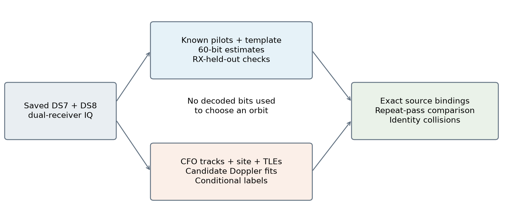
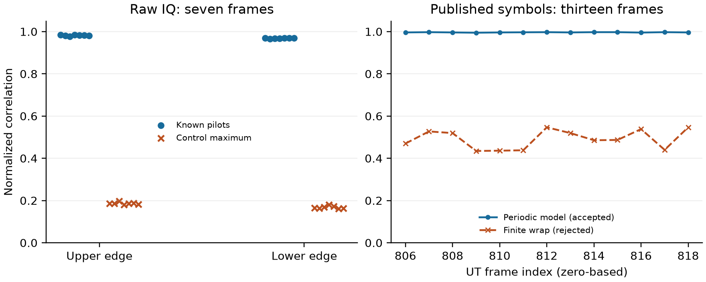
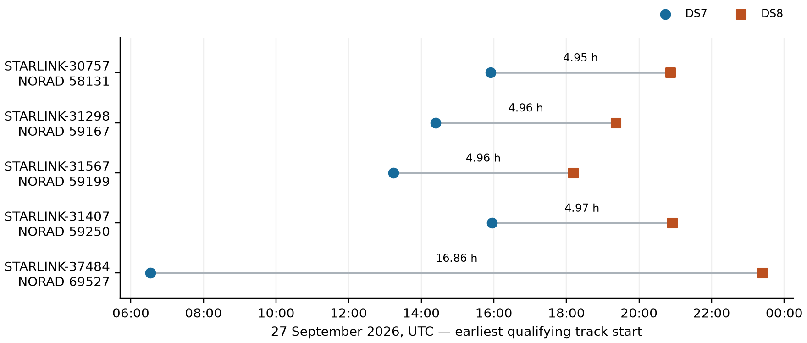
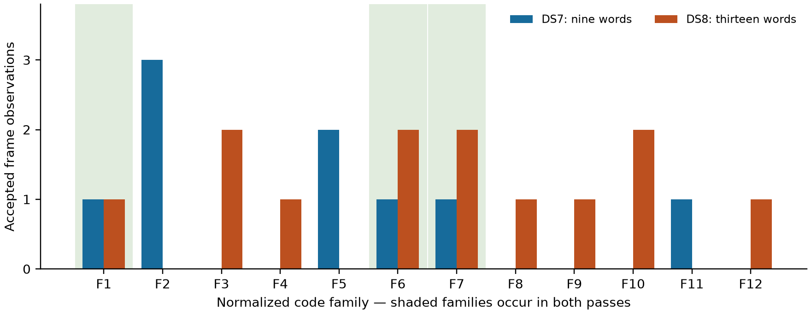
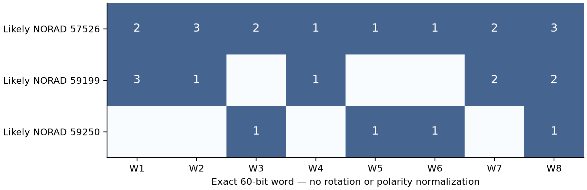

# Recurring 60-bit Structure in Narrowband Starlink Recordings: A DS7–DS8 Repeat-Pass Study

Follow-up: [An exact cyclic-phase generator and additional short-region recovery](2026_09_28_sequence_semantics/README.md)
explains the 60-word vocabulary and reports further full-band UT decoding checks.

## Motivation

Publicly described Starlink synchronization sequences and edge pilots make it
possible to investigate portions of a roughly 240 MHz downlink using a much
narrower receiver. A useful next question is whether recoverable, recurring
bits identify the transmitting spacecraft or convey navigation information.

## Problem

Recurring bits, repeated observations of a spacecraft, and decoded spacecraft
identity are different claims. This study asks whether independently recovered
60-bit patterns persist across observations assigned to the same satellite, and
whether those patterns distinguish different likely satellites. It also tests
a lower-band-edge mapping failure that initially prevented a repeat-pass
comparison. Satellite assignments remain orbital inferences, not ground truth.

## Solution

Across selected excerpts from two roof-receiver datasets, we recover **85
receiver-agreed 60-bit codeword observations representing 27 normalized code
families**. Five likely satellite identities recur across the datasets in the
bounded track survey. For likely STARLINK-31567 (NORAD 59199), nine DS7 words
and thirteen DS8 words include **three exact words recurring across passes
roughly five hours apart**. However, eight exact words in the overall study
occur under multiple likely identities. A word-only identity lookup therefore
fails under these assignments. No satellite-ID, UTC, position, orbit, or user
packet field is decoded. These results support recurring physical-layer
structure, not a navigation-message interpretation.

## Method

This is a **dated exploratory technical report**, prepared on 28 September
2026 from saved DS7/DS8 evidence. It reports historical receiver and temporal
holdouts accurately; it is not a new randomized validation campaign or a
promotion of the orbital labels to confirmed identities. The publication adds
no RF collection and reruns no bulk radio campaign. Figures are generated by
the [versioned report tool](../tools/render_ds7_ds8_paper.py) from
[digest-bound local inputs](figures/2026-09-28-ds7-ds8/input-hashes.sha256).
Measurement files and raw IQ are deliberately excluded from this publication.

## 1. Background and hypotheses

The published Starlink Ku-band waveform model uses a 1024-point OFDM transform,
234.375 kHz subcarrier spacing, 4.4 microsecond symbol intervals, and a 750 Hz
frame grid [1]. Qin and colleagues describe exact edge pilots, a reference
template, and low-entropy 60-bit *tessellation codes*, or T-codes [2]. A T-code
repeats across frequency and changes its cyclic phase by 16 positions between
OFDM symbols. The authors conjecture a connection to unladen allocations; that
is not an established payload interpretation.

We distinguish four hypotheses:

1. **Recoverability:** a narrow captured edge contains enough repeated
   structure to estimate a full 60-bit word with independent receiver agreement.
2. **Persistence:** exact words recur in separately observed passes assigned
   to the same satellite using orbital evidence independent of those words.
3. **Uniqueness:** one recovered word or its cyclic/polarity family identifies
   a unique satellite in the observed population.
4. **Semantic content:** recovered structure contains interpretable identity,
   timing, or position fields.

The original upper-edge acceptance thresholds were reused for this bounded
extension. The repeat-target selection and extra-visit selections were saved
before decoding those excerpts. This was adaptive exploratory work, not a
preregistered experiment: the lower-edge mapping was corrected after a failed
control, and subsequent visits were selected after the first visit failed.



*Figure 1. Method schematic, not measured geometry. Saved receiver measurements
feed two paths: known-pilot/template decoding and known-site orbital matching.
The paths meet through exact acquisition-solution and track bindings. Bit
patterns are not inputs to the satellite labels. Two receivers observe the
same local scene; their agreement is not equivalent to two independent sites.*

## 2. Corpus, receiver, and study population

DS7 and DS8 are frozen membership snapshots of existing dual-receiver recordings
at approximately 37.8491° N, 122.4858° W. The nominal mounting separation is
80 mm, with nominal outward tilt; actual RF phase centers, altitude, directed
baseline, and antenna pointing are not surveyed. Orbital calculations use the
recorded site coordinates and an assumed zero-metre ellipsoidal altitude.
They do not use an uncalibrated antenna beam to exclude satellites.

| Membership quantity | DS7 | DS8 | Combined |
|---|---:|---:|---:|
| Complete recordings | 88 | 65 | 153 |
| Visits | 194,934 | 143,988 | 338,922 |
| Compressed IQ, decimal GB | 860.110 | 590.316 | 1,450.426 |
| Recordings at 10 MS/s | 19 | 13 | 32 |

Other recordings use 7.5, 5, or 2.5 MS/s. DS8 admits complete published
recordings strictly after DS7 and finalized by **2026-09-28 00:22:59 UTC**.
Session IDs and source-manifest digests are disjoint. All 65 DS8 pose companions
and the membership seals were verified. IQ is referenced in place: the
snapshot is neither a payload backup nor a retention hold. Minting checked
metadata and chunk accounting, not a new hash pass over 590 GB of IQ.

This report does not decode all 153 recordings. It combines 5,142 existing DS7
track annotations with **245 newly surveyed tracks from four DS8 recordings**.
Of thirteen DS8 10 MS/s recordings, four had suitable cached upper-edge
detections, seven had none, and two had incomplete analysis products. These
are readiness/selection outcomes, not measurements of absence of transmission.

Each decoded visit uses 120 ms of stored IQ from both receivers. The full-word
sample contains ten successful visits: four DS7 and six DS8. An additional DS7
visit failed decoding, and an additional DS8 visit lacked a qualified matching
peer receiver. Reanalysis of one rejected visit is not counted as a new visit.
The population is selected for available pilot evidence, not representative
sampling of traffic, satellites, or the full corpus.

## 3. Methods and acceptance rules

### 3.1 Narrowband decoding

The decoded excerpts are sampled at 10 MS/s. Resampling and mixing place the
captured band on the native OFDM grid; this does **not** reconstruct unobserved
parts of the 240 MHz waveform. We retain 24 non-pilot bins around the eight
known edge pilots. Upper bins are 476–487 and 496–507; lower bins are 516–527
and 536–547, in zero-based native FFT coordinates.

Pilot symbols 22–301 determine carrier/phase calibration; symbols 2–21 are
reserved for a known-symbol check. Pilot-derived timing drift corrects later
frame windows. The default channel estimate uses the known secondary
synchronization sequence (SSS) from other frames, smoothed across frequency.
Unknown header or T-code bits do not enter this calibration. The two receiver
fits are separate, but share templates, conventions, and the physical scene.

After removing the reference template, let `z[i,n]` be the observed complex
deviation at OFDM symbol `i` and compact carrier coordinate `n`. Compact
coordinates order non-pilot, non-gutter carriers by physical frequency. The
validated periodic model is:

```text
z[i,n] ≈ a[i,n] · T[(n − 16i) mod 60] + noise,
T[j] ∈ {−1, +1}.
```

The lower retained bins correspond to compact coordinates 4–27, the upper
ones to 976–999. Over the sampled symbols both edges cover every code slot.
The word estimate is the sign of the mean real deviation assigned to each slot.
No even-parity rule, desired code family, or satellite label constrains it.

RX0 chooses among 64-symbol windows beginning at symbols 14, 46, …, 238.
Within each window, alternating symbols provide the RX0 selection check.
RX1 independently estimates the word and supplies receiver-held-out evidence.
Acceptance requires RX0 selection correlation >0.25, RX1 correlation >0.25,
RX1 correlation exceeding 1,000 equal-weight shuffled-code controls, and
agreement on **all 60 bits** between receivers. Correlation is mean real
code-weighted deviation divided by RMS complex amplitude. Control maxima are
empirical diagnostics, not corrected familywise p-values. Frames within a visit
are correlated; the codeword count is not an independent sample count.

A *family* is the lexicographically smallest bit string among all 60 cyclic
rotations of a word and its global complement. Exact-word recurrence uses
neither rotation nor complement. Different modulation regions and weak/fading
signals can fail these gates without implying a different satellite.

### 3.2 Independent orbital association

The saved CFO tracks are dealiased and normalized to **11.2 GHz**. Candidate
positions/velocities are propagated from causal archived TLEs. At the recorded
receiver site, line-of-sight velocity predicts Doppler; one constant frequency
offset per track absorbs carrier/hardware offset. The observed CFO is not
rescaled a second time from its acquisition RF.

The DS8 screen considers the catalogue above −2° elevation at the track
midpoint and requires at least 95% of a candidate track above the horizon.
It ranks fits using the first 60% of observations and evaluates the final 40%.
The label is called *conditional* only with at least 20 observations, at least
10 s span, validation RMS ≤250 Hz, training and validation runner-up gaps
≥100 Hz, and ≥25 Hz validation improvement over a fitted linear-time null.
Seventy-two of the 245 DS8 tracks pass this screen.

Existing DS7 labels used a randomized whole-visit partition, a previously
constructed candidate bank, and additional time/height/drift checks. Their
candidate search and validation protocol are not identical to DS8's. In
particular, **DS8's chronological holdout is historical exploratory evidence,
not compliance with the repository's current randomized-group validation
standard**. A common clock/orbit/model error can affect both receivers.
Neither category is a posterior probability or confirmed spacecraft identity.

Decoded excerpts are joined to labels by persistent-track membership and exact
acquisition solutions. Duplicate candidate ranks are tolerated only if the
complete probe and all other numerical solution fields agree. Time proximity,
CFO proximity, and shared words alone are insufficient. An independent
reconstruction verified these bindings for the five extracted visits of the
STARLINK-31567 candidate, including the rejected one.

## 4. Reference validation and the lower-edge correction

An initial test applied the 64-symbol T-code decoder to seven clean UT raw-IQ
frames. Low correlations were initially treated as a lower-edge failure.
Inspection showed that even the upper-edge test failed: those frames lacked
the long contiguous T-code blocks assumed by the test. We separated waveform
demodulation from periodic-code mapping rather than accepting the failed
control as proof of either.

**Raw-IQ check.** Across the seven UT frames, lower-edge known-pilot held-out
correlation is 0.966–0.970, compared with a maximum 0.180 among 100 shifted
pilot-sequence controls. Upper-edge correlation is 0.978–0.984, with controls
below 0.197. This validates demodulation of known pilots, not recovery of long
T-code blocks from those seven frames.

**Mapping check.** From the published UT hard-symbol dataset [3], bounded HTTP
range reads retrieved 122,181 bytes containing the lower edge of zero-based
frames 806–818. Their source ETag agrees with the previously obtained upper
edge. We select the word and window using the upper edge, then predict the
lower edge without fitting it. The periodic model gives correlation
0.9948–0.9974 in all 13 frames. A rejected model that wraps a truncated
1004-element carrier vector gives only 0.435–0.547 at the same code phase.
The correction leaves all earlier upper-edge mappings unchanged.



*Figure 2. Left: seven UT raw frames 250–256, held-out known-pilot normalized
correlation and maximum shifted-sequence control, by captured edge. Right:
13 published hard-symbol frames 806–818, upper-selected code prediction on
lower-edge symbols, comparing the accepted periodic and rejected finite-vector
models. Correlation is dimensionless, not bit accuracy or SNR. Source: saved
raw-UT and reference-check results bound in the input hashes. These checks
validate separate processing stages, not an end-to-end packet decoder.*

## 5. Results

### 5.1 Repeated likely identities

Five identities intersect between DS7's likely labels and the 72 conditional
DS8 labels. Times below are the earliest qualifying track starts, UTC on
27 September 2026. Track counts include receiver replicas and fragments;
they are not counts of independent passes.

| Candidate satellite | NORAD | DS7 UTC | DS8 UTC | DS7 / DS8 tracks |
|---|---:|---|---|---:|
| STARLINK-30757 | 58131 | 15:54:57 | 20:51:42 | 1 / 5 |
| STARLINK-31298 | 59167 | 14:24:00 | 19:21:36 | 2 / 3 |
| STARLINK-31567 | 59199 | 13:13:42 | 18:11:10 | 3 / 3 |
| STARLINK-31407 | 59250 | 15:56:36 | 20:54:32 | 1 / 1 |
| STARLINK-37484 | 69527 | 06:32:28 | 23:24:18 | 4 / 1 |



*Figure 3. Earliest labelled-track starts for the five cross-dataset candidates,
from all 5,142 DS7 annotations and the bounded 245-track DS8 survey. Lines join
candidate identities, not continuous reception or propagated ground tracks.
Times are UTC; four intervals are approximately five hours. Source: saved
repeat-candidate results. No spacecraft identity is decoded from the waveform.*

### 5.2 Codewords across two likely STARLINK-31567 passes

This candidate supplies 10 MS/s recordings at both epochs. DS7 captured the
lower channel edge, DS8 the upper edge. The first DS7 visit, 786, failed:
0/24 frames passed after mapping correction. A pilot-only channel alternative
also gave 0/24 on those same frames. Two additional independently labelled
DS7 tracklets were selected, then their strongest bound pilots selected the
visits below. A planned DS8 visit, 1074, lacked a qualified matching receiver
peer and contributes no accepted codewords.

| Dataset | Visit | Edge | Accepted / attempted frames | Families |
|---|---:|---|---:|---:|
| DS7 | 857 | Lower | 5 / 8 | 3 |
| DS7 | 1014 | Lower | 4 / 8 | 4 |
| DS8 | 1246 | Upper | 7 / 8 | 6 |
| DS8 | 1389 | Upper | 6 / 8 | 6 |

DS8 visits 1246 and 1389 are **19.2756 s apart within one pass**, not separate
orbital returns. The DS7 observation is approximately five hours earlier.
The DS7 pair contains nine words from six families; the DS8 pair contains
thirteen words from nine families. Their union is 22 observations and twelve
families. Three exact words, as well as their three families, occur in both:

```text
001101011101001111110101011111011101010110011101111100010101
001101110101100111010101101101010101001101011111110101010101
111111010101101101111111011111011111010101110101100111111111
```

These are exact measured strings, with no cyclic or polarity normalization.



*Figure 4. Accepted words for the likely NORAD 59199 signal in DS7 session
`scan-fw-7c504d862c2326b4` (visits 857, 1014) and DS8 session
`scan-fw-4458a753c0831235` (visits 1246, 1389). Bars count accepted frame
observations per normalized family; highlighted families occur in both passes.
Source: saved receiver-validated words, 9 DS7 and 13 DS8 observations. Family
indices are local to this figure. This is conditional repeat-pass evidence,
not an independent confirmation of the orbital identity.*

### 5.3 Population-wide recurrence and non-uniqueness

The complete accepted sample comprises 47 DS7 and 38 DS8 codeword observations,
85 total, spanning 27 families. Of the 38 DS8 observations, 28 match families
in the original 38-word DS7 sample; 34 match the expanded DS7 family set after
the repeat-pass follow-up. The latter is a descriptive comparison, not a
prospectively held-out prediction score.

There are **eight exact-word collisions** across distinct likely identities
and **eleven family collisions**. One exact word is shared under NORAD 57526,
59199, and 59250. Thus uniqueness fails even without permitting cyclic rotation
or global polarity inversion. Conversely, a single likely spacecraft produces
many words, so a constant per-satellite T-code is not supported. These findings
do not rule out a longer sequence, another header region, or a combination of
fields carrying identity information.



*Figure 5. Eight exact 60-bit words appearing under at least two of the three
likely identities represented in the accepted labelled sample. Cells count
accepted frame observations, not independent passes; blank cells mean no
accepted occurrence in this sample. Source: the 85-word joint comparison,
restricted to labelled occurrences and collision words. W1–W8 are local plot
indices. Association uncertainty remains; this is evidence against a unique
word-to-identity lookup conditional on those orbital labels.*

## 6. Interpretation, limitations, and next falsifiers

**Recovered structure is not decoded metadata.** The observations are
template-relative physical-layer signs, not FEC-verified packets. Known pilots
and SSS support calibration; the recovered bits themselves have no established
ID, time, position, or ephemeris semantics. No user traffic was decrypted.

**Orbit assignments are conditional.** Incorrect TLE associations could alter
both the persistence and cross-identity conclusions. The midpoint horizon
screen can omit a candidate crossing the horizon within a track. DS7's prior
candidate bank and DS8's screen differ. Randomized whole-group revalidation,
broader nuisance-model checks, and independent identity ground truth are
needed before promoting satellite labels. Equal observed codes must never be
used to strengthen labels and then counted as independent evidence for them.

**Header evidence remains insufficient.** Some upper-edge 24-sign samples at
header symbol 4 repeat across receivers and time splits. The repeated-target
excerpts do not pass strict split stability. Lower and upper edges sample
different header subcarriers and cannot be directly equated. A stable header
field remains a hypothesis, not a result.

**Position cannot be inferred from this design alone.** Both datasets use one
receiver site. Changing satellite azimuth/elevation changes viewing geometry,
not receiver geography. For example, the NORAD 59199 candidate's track-midpoint
azimuth ranges shift from approximately 160–200° in DS7 to 246–281° in DS8.
That does not establish a geographic-position encoding.

**Selection and dependence limit generalization.** Strong cached pilots,
available analysis products, few passages, shared receiver hardware, repeated
frames, and exploratory model changes all restrict the effective sample size.
No overall detection probability, bit-error rate, or constellation-wide code
inventory is claimed. Failed excerpts and unavailable peers remain failures
in the accounting rather than disappearing from the report.

The next falsifying experiment should fix the decoder and candidate-label
protocol, randomize whole independent visits or passes with a recorded seed,
and reserve unseen passes before inspecting header fields. It should require
exact receiver agreement, retain negative controls, and test whether a field
is stable within a satellite and discriminative across satellites. Multiple
known receiver locations would be required to test geographic semantics.

## 7. Reproducibility and data availability

This publication contains the report, generated illustrations, PDF, rendering
source and input hashes. It contains **no IQ arrays, decoded-bit CSV, numerical
archives, source-paper PDFs, or downloaded UT datasets**. Aggregate tables and
illustrations are report content. The local measurement records are therefore
not independently reproducible from this repository checkout alone.

The evidence snapshot is identified by the adjacent SHA-256 list. It binds the
DS7/DS8 manifests, joint results, decoded-word inventory, UT validation, repeat
track bindings, selected excerpt inventories/results and analysis source.
Raw excerpts are hash-bound in their inventories; source readers use immutable
session manifests. The installed storage/propagation reader release is
`17484895464c225ebba977487aa36d3d81658bd8`. The numerical work used NumPy/SciPy,
single-threaded BLAS and bounded offline commands; excerpt processing was
limited to saved visits. There is no campaign-wide runtime benchmark.

For an authorized local workspace holding the bound evidence, regenerate
publication assets with:

```bash
OPENBLAS_NUM_THREADS=1 uv run --no-project \
  --with numpy --with matplotlib --with markdown --with weasyprint \
  python tools/render_ds7_ds8_paper.py --workspace /path/to/analysis-workspace
```

The renderer verifies every listed input hash before generating figures.
It does not read raw IQ or rerun orbital matching. Nineteen decoder tests and
four comparison/binding-helper tests passed in the analysis workspace, along
with the 13-frame UT mapping check and reconstruction of the five repeat-target
bindings. These checks support implementation consistency; they do not
substitute for independent experimental replication. This is version 1 of a
historical report; changed input membership or methods require a dated update.

## 8. Conclusion

Narrowband edge recordings can recover complete recurring 60-bit words with
independent receiver agreement. Correct lower-edge mapping enables a comparison
between two likely passes of STARLINK-31567: three exact words recur roughly
five hours apart. Their recurrence is useful structural evidence, but the
observed cross-identity collisions reject a unique-ID interpretation for an
individual T-code. The next substantive advance is validated header semantics
with independent identity and geographic ground truth.

## References

1. Humphreys, Iannucci, Komodromos and Graff, *Signal Structure of the Starlink
   Ku-Band Downlink*, 2023. [Author preprint](https://arxiv.org/abs/2210.11578).
2. Qin, Psiaki, Bowman and Humphreys, *Pilots and other predictable elements of
   the Starlink Ku-band downlink*, **npj Wireless Technology 2, 69** (2026).
   [Journal article](https://doi.org/10.1038/s44459-026-00075-6).
3. University of Texas Radionavigation Laboratory, supplementary data and code
   for Qin et al. [Author-hosted supplement](https://rnl-data.ae.utexas.edu/datastore/supplementaryMaterial/qin-starlink-pilots/).
   Raw exemplar frames 250–256 and published hard-symbol frames 806–818 are
   different reference populations; this report does not conflate them.
