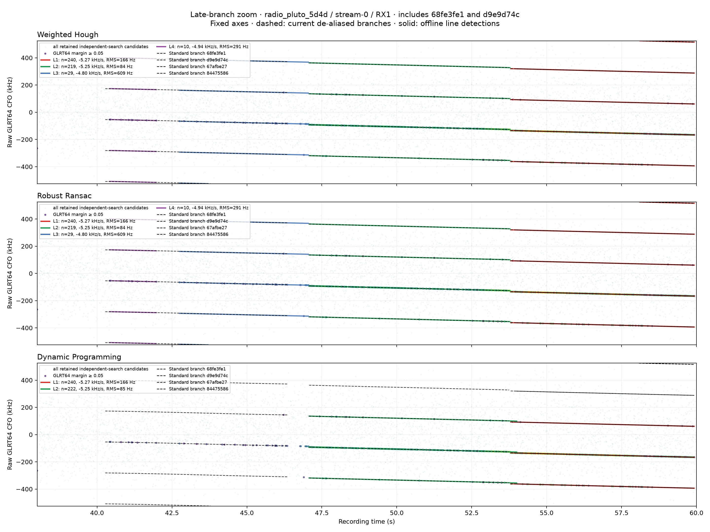
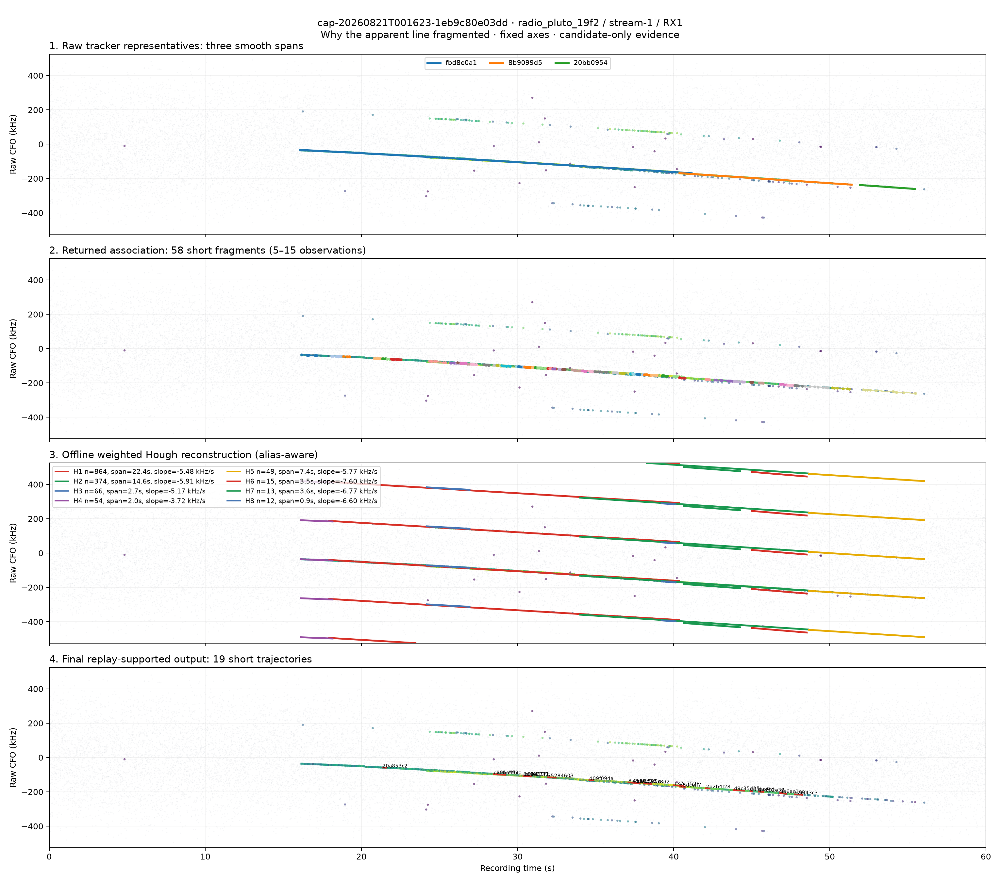

# Alias-aware line finding in GLRT64 CFO point clouds

## Outcome

This offline Research experiment treats every retained independent-search GLRT64 CFO
candidate as a weighted point in time/frequency space. Three deterministic bounded
detectors were implemented: a weighted alias-aware Hough transform, robust RANSAC line
extraction, and a time-ordered dynamic-programming (DP) track-before-detect search.
Nothing in the Standard pipeline, catalog, live recorder, or QNAP corpus was changed.

The strongest practical result is the weighted Hough detector. On
`cap-20260821T001023-1cafa7c30c52`, `radio_pluto_5d4d / stream-0 / RX1`, it recovers
the line underlying branch `d9e9d74c` with 219 unique-probe support over 6.700 s,
-5.249 kHz/s slope, and 83.7 Hz weighted residual RMS. Its modulo-alias disagreement
with the current quadratic branch is only 43.4 Hz RMS. This is strong independent
geometric evidence that `d9e9d74c` is real even though the old replay gate dropped it.




## Problem and persisted point schema

The input is a published `standard.pilot-scan/v3` document. Each of 2,400 scheduled
probes contains at most eight independently searched candidate basins. For every
candidate, the experiment reads only these persisted fields:

| Field | Meaning |
|---|---|
| `time_s` | Probe time in the 60 s recording |
| `scores[glrt64].tracking_cfo_hz` | Raw independently searched GLRT64 CFO |
| `exact_score` | Exact known-pilot score |
| `control_score` | Rolled-control score |
| `margin` | Exact score minus control score |
| candidate `rank` and probe index | Stable point identity and deterministic ordering |

For point (i), the bounded evidence weight is

\[
w_i = \min\left(\frac{\max(m_i,0)}{\max(c_i,0.02)},16\right),
\]

where (m_i) is GLRT64 margin and (c_i) is its control score. Negative margins have
zero weight. The default Hough/RANSAC research cut is (w_i \ge 0.5); DP deliberately
uses (w_i \ge 0.02) to retain weak evidence. Results count at most one candidate per
exact probe time, preventing duplicate alias basins at one probe from inflating support.

The symbol-rate alias spacing is frozen at

\[
A = 1 / 4.4\ \mu\mathrm{s} = 227272.7272727\ \mathrm{Hz}.
\]

All residuals are circular:

\[
r_A(f,\hat f)=((f-\hat f+A/2)\bmod A)-A/2.
\]

Thus raw points separated by an integer multiple of (A) can support one physical
line, while the reported intercept remains explicit modulo (A).

## Algorithms

### 1. Weighted alias-aware Hough transform

For every bounded slope-bin center (s), a point votes for the intercept bin

\[
b_i(s)=(f_i-s t_i)\bmod A.
\]

The accumulator is (H(s,b)=\sum_i w_i\). For each extraction round, the 16 strongest
accumulator cells are refined by weighted least squares after lifting each frequency to
the nearest alias. Inliers must satisfy the circular 2.5 kHz residual gate. They are
split at temporal gaps, reduced to one point per probe, fitted again, then peeled along
every equivalent raw alias. Recomputing the map after peeling permits simultaneous
parallel lines and crossing lines without giving one dense cluster permanent ownership.

Pseudocode:

```text
while tracks < maximum_tracks:
    for slope in bounded_slope_grid:
        vote weight into (frequency - slope*time) modulo alias_spacing
    for peak in strongest_peaks:
        collect circular-residual inliers
        choose one inlier per probe and split on temporal gaps
        lift aliases; weighted-fit and score every valid segment
    retain best segment; peel its alias-equivalent support
```

### 2. Deterministic robust RANSAC

RANSAC uses a stable point sort, high-weight anchor pairs, and a PRNG seed derived from
the canonical sorted point identifiers. For pair (i,j), it enumerates alias deltas
(k\in[-3,3]):

\[
s_{ij,k}=\frac{f_j-f_i-kA}{t_j-t_i}.
\]

Only slopes inside the configured bound survive. Up to 2,000 unique hypotheses are
scored with the same circular inlier, one-point-per-probe, temporal-gap, refit, and
peeling logic as Hough. Sorting plus content-derived seeding makes input permutation
irrelevant.

### 3. Dynamic programming / track-before-detect

DP keeps the three strongest eligible candidates at each time and evaluates 61 fixed
slope hypotheses. For candidate (j), predecessor (i), elapsed time (Delta t), and
circular transition residual (r_{ij}(s)), the recurrence is

\[
D_j(s)=w_j-c_p+\max\left(0,\max_i\left[
D_i(s)-\lambda_r(r_{ij}/g_f)^2-\lambda_t\Delta t
\right]\right).
\]

Only the eight previous candidate-time groups are examined; transitions beyond the
0.75 s gap or 2.5 kHz frequency gate are forbidden. The winning path is alias-lifted,
weighted-fit, gap-checked, and peeled before the next extraction. This method really
does admit weak points, but it is much slower and more prone to switching tracks at
crossings than the two geometric consensus methods.

## Frozen research interfaces

The callable interfaces live in `leo.analysis.research.cfo_lines` and return immutable
`LineSegment` values:

```python
from leo.analysis.research.cfo_lines import (
    DynamicProgrammingConfig,
    HoughConfig,
    RansacConfig,
    dynamic_programming_lines,
    robust_ransac_lines,
    weighted_hough_lines,
)

hough_segments = weighted_hough_lines(points, HoughConfig())
ransac_segments = robust_ransac_lines(points, RansacConfig())
dp_segments = dynamic_programming_lines(points, DynamicProgrammingConfig())
```

Every segment reports algorithm, stable content-derived ID, contributing point IDs,
support, start/end, weighted support, slope, absolute and modulo-alias intercept,
weighted residual RMS/max, and maximum internal temporal gap.

### Default bounds used for the real runs

| Bound | Hough | RANSAC | DP/TBD |
|---|---:|---:|---:|
| Slope range | ±15 kHz/s | ±15 kHz/s | ±15 kHz/s |
| Circular residual gate | 2.5 kHz | 2.5 kHz | 2.5 kHz |
| Maximum gap | 0.75 s | 0.75 s | 0.75 s |
| Minimum span/support | 0.75 s / 8 | 0.75 s / 8 | 0.75 s / 8 |
| Minimum point weight | 0.5 | 0.5 | 0.02 |
| Slope bins | 121 | pair-derived | 61 |
| Intercept bins | 512 | pair-derived | n/a |
| Bounded work | 16 peak cells/round | 2,000 hypotheses/round | 3 candidates/time, 8 predecessor groups |
| Tracks requested for benchmark | 6 | 6 | 6 |

All returned models are straight lines, so their fitted acceleration is exactly
0 Hz/s². A polynomial/acceleration Hough variant was considered but not added: the
measured line detectors already recover the questioned narrow branches, while a third
parameter would substantially enlarge the accumulator and false-positive surface.

## Synthetic red/green gates

`tests/analysis/test_research_cfo_lines.py` freezes 14 tests across all three detectors:

- two crossing lines and a simultaneous parallel line;
- alternating raw alias indices;
- a 0.7 s signal gap that must be bridged under a 0.8 s test bound;
- dense low-margin clutter and a noise-only red case;
- input-permutation determinism;
- duplicate-ID and non-finite-input rejection;
- exact maximum-track enforcement; and
- a two-second synthetic runtime ceiling per detector.

Measured focused test result: **14 passed in 10.09 s** for the complete parametrized
file. The algorithm module and both CLIs pass Ruff and mypy.

## 5d4d/RX1 real-corpus results

Input: `cap-20260821T001023-1cafa7c30c52`, `radio_pluto_5d4d / stream-0 /
RX1`: 19,200 retained candidates, 2,400 unique probes, and 602 points with margin
at least 0.05.

The final corrected benchmark consumed 70.75 s wall time and 201,140 KiB peak RSS for
all three algorithms plus JSON/PNG rendering. Per-algorithm detector times were 0.133 s
for Hough, 7.156 s for RANSAC, and 60.461 s for DP. Hough and RANSAC converge to the
same four segments; DP returns only the two strongest late segments.

| Algorithm / line | Support | Span (s) | Slope (kHz/s) | Accel. (Hz/s²) | Intercept mod (A) (kHz) | RMS (Hz) | Max gap (s) |
|---|---:|---:|---:|---:|---:|---:|---:|
| Hough L1 | 240 | 6.125 | -5.269 | 0 | 149.211 | 165.6 | 0.050 |
| Hough L2 (`d9e9d74c`) | 219 | 6.700 | -5.249 | 0 | 155.594 | 83.7 | 0.125 |
| Hough L3 (`68fe3fe1` vicinity) | 29 | 4.300 | -4.799 | 0 | 139.297 | 609.3 | 0.525 |
| Hough L4 (early fragment) | 10 | 1.550 | -4.938 | 0 | 146.178 | 290.7 | 0.350 |
| RANSAC L1 | 240 | 6.125 | -5.269 | 0 | 149.211 | 165.6 | 0.050 |
| RANSAC L2 (`d9e9d74c`) | 219 | 6.700 | -5.249 | 0 | 155.594 | 83.7 | 0.125 |
| RANSAC L3 (`68fe3fe1` vicinity) | 29 | 4.300 | -4.799 | 0 | 139.297 | 609.3 | 0.525 |
| RANSAC L4 (early fragment) | 10 | 1.550 | -4.938 | 0 | 146.178 | 290.7 | 0.350 |
| DP L1 | 240 | 6.125 | -5.270 | 0 | 149.272 | 165.6 | 0.050 |
| DP L2 (`d9e9d74c`) | 222 | 6.925 | -5.248 | 0 | 155.590 | 84.6 | 0.175 |

The current de-aliased `d9e9d74c` branch has 136 associated observations from
47.075–53.750 s. Hough/RANSAC use 219 unique probe times because they work directly
on all independently searched candidates, not only observations already admitted by
the Standard association. Against the selected Standard quadratic over the common
span, the recovered line differs by just 43.4 Hz RMS and 96.5 Hz maximum modulo the
alias spacing.

The persisted replay result explains its drop precisely. Alias 0 evaluated 268 probes:
119 improved (44.4%), median margin delta was -0.00009796, and median control
separation was a strong 0.3610. It failed the old `improved_fraction >= 0.5` and strict
`median_delta > 0` gates despite being geometrically narrow. The line-finder evidence
supports classifying it as replay-stable under the proposed equivalence-band policy;
it does not itself replace replay validation.

`68fe3fe1` is weaker. The selected current cubic has 18 observations over
40.275–46.350 s and 712.7 Hz RMS. Hough/RANSAC recover a 29-point strong-evidence
segment in its vicinity, but only over 42.750–47.050 s, with 609.3 Hz RMS. Its alias-0
replay has 118/244 improved probes, median delta -0.00006266, and negligible absolute
separation 0.000732. Recommendation: retain it as geometry-only, not replay-supported.

## Dedicated `1eb9c80e03dd` loss trace

Identifier `1eb9c80e03dd` resolves exactly to session
`cap-20260821T001623-1eb9c80e03dd`; the requested path is
`radio_pluto_19f2 / stream-1 / RX1`.



### Full persisted funnel

| Stage | Exact persisted inventory | What happened |
|---|---:|---|
| Scheduled probes | 2,400 source / 2,400 returned / 0 truncated | Complete 60 s schedule |
| Pilot scan | 2,400 detections; 19,200 candidates; 0 candidate truncations | 1,948 margin≥0.05 hits on 1,275 probes |
| Raw tracking | 19,200 observations; 9 fits; 3 families | Long spans: 16.075–41.150, 40.375–51.400, 51.925–55.475 s |
| Alias map | 3 representatives; 3 separate components | First/second overlap 0.775 s but fail at 5.908 kHz RMS; second/third have a 0.525 s no-overlap gap |
| Association observations | 1,827 source / 1,827 returned | No observation truncation |
| Association edges | 108,096 source / 65,536 returned | 42,560 audit decisions truncated |
| Edge decisions retained | 11,133 accepted | 31,769 frequency, 18,335 acceleration, 4,299 slope rejections |
| Association branches | 1,281 source / 64 returned | 1,217 branches truncated from the persisted bounded result |
| Polynomial eligibility | 58 eligible | Six returned branches have only four points; retained branches have 5–15 points |
| Selected models | 16 linear / 9 quadratic / 33 cubic | Minimum persisted BIC among eligible degree 1/2/3 fits |
| Lift replay | 84 lifts | 19 supported; 65 rejected |
| Final bank | 19 trajectories | Still short: most returned branch spans are under 1 s |

The 58 polynomial branches have these spans: 10 below 0.25 s, 25 from
0.25–0.5 s, 18 from 0.5–1 s, four from 1–2 s, and one from 2–4 s. Internal gaps are
usually small—50–250 ms for 50 branches—so the dominant failure is not missing probe
coverage. It is fragmentation by component boundaries and local frequency/slope/
acceleration association gates, amplified by the 64-branch bounded return.

Replay does not repair the fragmentation. Of 84 lifts, 64 fail the 50% improvement
fraction, 65 fail strict positive median delta, and 29 fail 0.05 absolute separation.
Nineteen pass all gates and become nineteen short final tracks.

### Offline piecewise-line reconstruction

| Hough line | Support | Span (s) | Slope (kHz/s) | Accel. (Hz/s²) | Intercept mod (A) (kHz) | RMS (Hz) | Max gap (s) |
|---|---:|---:|---:|---:|---:|---:|---:|
| 56fa3722 | 864 | 22.425 | -5.478 | 0 | 58.393 | 1,104.1 | 0.075 |
| 6d32e0e1 | 374 | 14.625 | -5.914 | 0 | 69.470 | 783.5 | 0.600 |
| 7f6c0147 | 66 | 2.725 | -5.171 | 0 | 53.575 | 104.0 | 0.150 |
| d59a43ee | 54 | 2.025 | -3.723 | 0 | 24.078 | 72.9 | 0.100 |
| a313f34a | 49 | 7.375 | -5.769 | 0 | 60.829 | 496.9 | 0.675 |
| 711ed9f8 | 15 | 3.500 | -7.601 | 0 | 133.005 | 692.3 | 0.650 |
| f39abbdc | 13 | 3.600 | -6.766 | 0 | 94.421 | 161.1 | 0.700 |
| 299a4de4 | 12 | 0.900 | -6.597 | 0 | 93.752 | 108.9 | 0.200 |

The evidence is best described as one dominant *evolving, piecewise-linear apparent
curve*, not one exact constant-slope line. Hough recovers a 22.4 s first segment, a
14.6 s overlapping transition segment, and a 7.4 s late segment. The changing slope
and overlap explain why a single rigid line is insufficient. The remaining narrow
segments can be alternate candidate basins, local curvature approximations, or clutter;
candidate-only GLRT evidence cannot establish separate physical transmitters.

One audit boundary remains: the published contract records the exact aggregate counts
but not the 1,217 omitted source branches or 42,560 omitted edge decisions. Their
individual rank and rejection reason cannot be reconstructed after publication. This
is a persisted-observability limitation, not evidence that those omitted branches were
scientifically valid.

## Reproduction

These commands read already-published products under `/srv/bulk/leo`; they do not read
or modify QNAP and do not write the catalog. Run them as an account with read access to
the analysis store.

```bash
uv run pytest -q tests/analysis/test_research_cfo_lines.py
uv run ruff check \
  src/leo/analysis/research/cfo_lines.py \
  tools/explore_cfo_line_detection.py \
  tools/analyze_cfo_line_loss_case.py \
  tests/analysis/test_research_cfo_lines.py
uv run mypy \
  src/leo/analysis/research/cfo_lines.py \
  tools/explore_cfo_line_detection.py \
  tools/analyze_cfo_line_loss_case.py
```

For 5d4d/RX1, use the three exact product files beneath this immutable scope directory:

```bash
LINE_SOURCE=/srv/bulk/leo/analysis/cap-20260821T001023-1cafa7c30c52/capture-217fef0ecc654200ba0c93a614a5af5e/scientific/path-standard/sha256:c765e1d5271d98ced9065ed3f1bf8fee33bb89ee5f8e112f05b686edbf608050
uv run python tools/explore_cfo_line_detection.py \
  --pilot-scan "$LINE_SOURCE/standard.pilot-scan.v3.json" \
  --dealiased "$LINE_SOURCE/standard.dealiased-trajectory-bank.v2.json" \
  --final "$LINE_SOURCE/standard.final-trajectory-bank.v1.json" \
  --output-root reports/figures/2026_08_20_line_finder \
  --maximum-tracks 6
```

For the separate 19f2/RX1 loss case:

```bash
CASE_SOURCE=/srv/bulk/leo/analysis/cap-20260821T001623-1eb9c80e03dd/capture-ba4e175e94874587b641b92363327948/scientific/path-standard/sha256:8bf3c96a92e4652ea98b3c4af2c557cc5cd210c6382ecc571f63dffc62de34cd
uv run python tools/analyze_cfo_line_loss_case.py \
  --source-root "$CASE_SOURCE" \
  --output-root reports/figures/2026_08_20_line_finder
```

## Limitations and recommendation

- These are candidate-only detectors. They establish narrow geometric consistency,
  not Starlink specificity, payload recovery, or a physical transmitter identity.
- Modulo-alias fitting intentionally discards absolute alias index. Absolute frequency
  still requires a separate calibrated lift decision.
- Crossing lines are ambiguous at their intersection; DP can switch branches and is
  particularly sensitive to its weak-evidence admission threshold.
- A 2.5 kHz tube across a dense point cloud can admit chance alignments. Minimum span,
  unique-probe support, control-normalized weights, controls, and replay remain necessary.
- Hough/RANSAC are straight-line segmenters. Curved Doppler paths appear as overlapping
  piecewise lines. That is useful for discovery but can duplicate one physical curve.
- Real-run timing is machine- and load-dependent. DP is already too slow for a default
  production path at 60.5 s on this single 60 s point cloud.

Recommendation: adopt weighted Hough first as a **Research-only triage and geometry
cross-check**. It is fast, deterministic, alias-aware, and independently recovers the
questioned branches. Use it to propose branch unions and retain geometry-only evidence,
then replay those proposals under the revised improved/stable/geometry-only decision
model. Do not insert any of these detectors into the Standard decision path. An additive,
explicitly research-only persisted product is acceptable for operator comparison, but
promotion into correction or selection requires a
frozen negative-control corpus, calibrated false-positive rate, explicit behavior on
curved injected trajectories and simultaneous targets, and a new persisted contract
that exposes bounded branch/edge ranking rather than silently losing audit detail.

## Additive pipeline implementation (2026-08-21)

The weighted Hough choice is now implemented as the additive comparison surface described
above. A real `path-alternate-tracks` node consumes only the exact persisted
`standard.pilot-scan/v3` predecessor for its receiver path and has no IQ access. It
publishes a strict bounded `standard.alternate-cfo-track-bank/v1` plus deterministic
`standard.alternate-cfo-tracks-png/v1`. The recording detail UI labels both as
research-only. Neither product is an input to CFO correction, final detection,
attribution, radio/paired scientific reduction, or Standard trajectory selection.

The ordinary four-path graph therefore has 12 jobs, 14 edges, and 106 products. Full
contract, configuration, presentation, and failure semantics are documented in
[`docs/analysis/alternate-cfo-line-product.md`](../docs/analysis/alternate-cfo-line-product.md).
