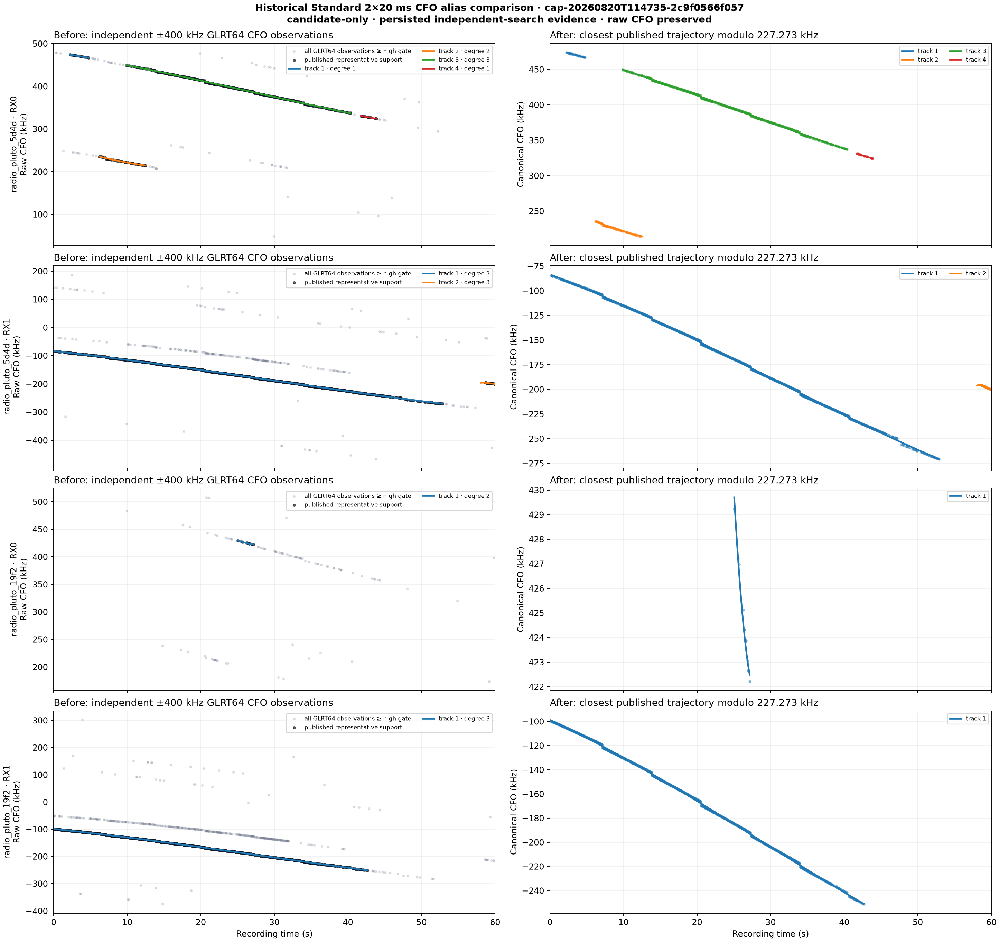
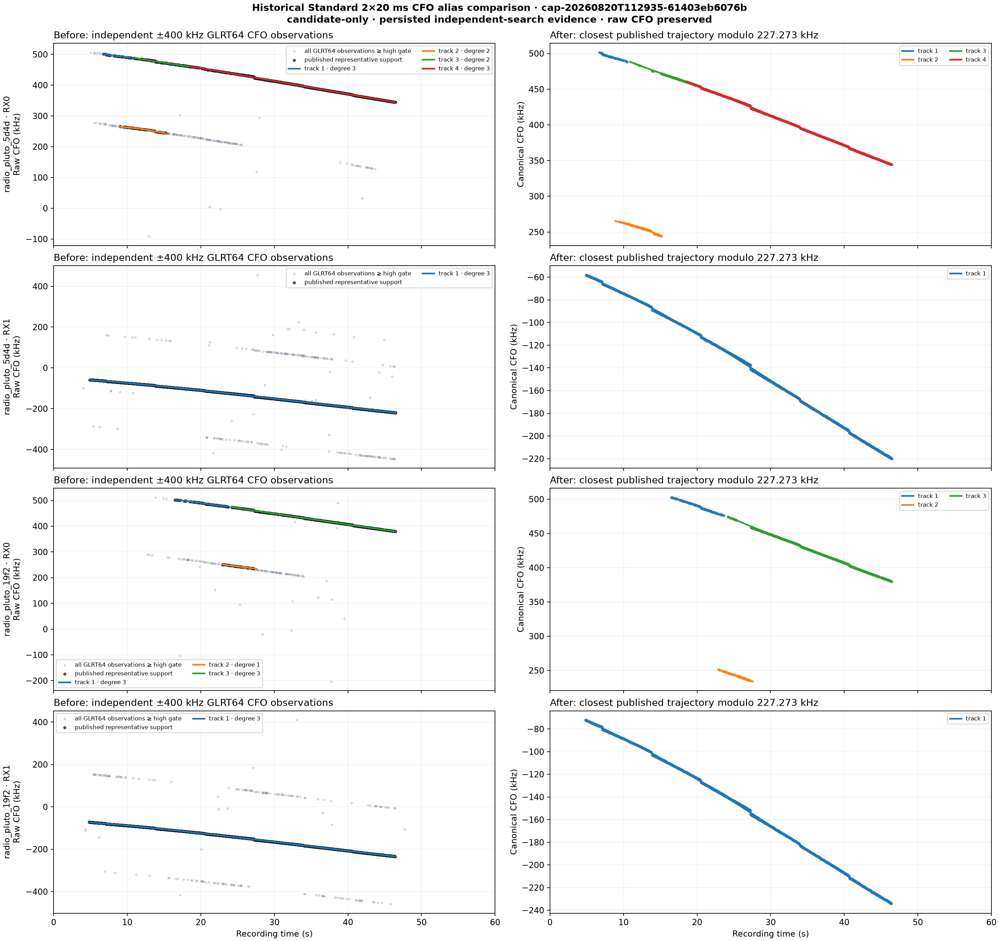
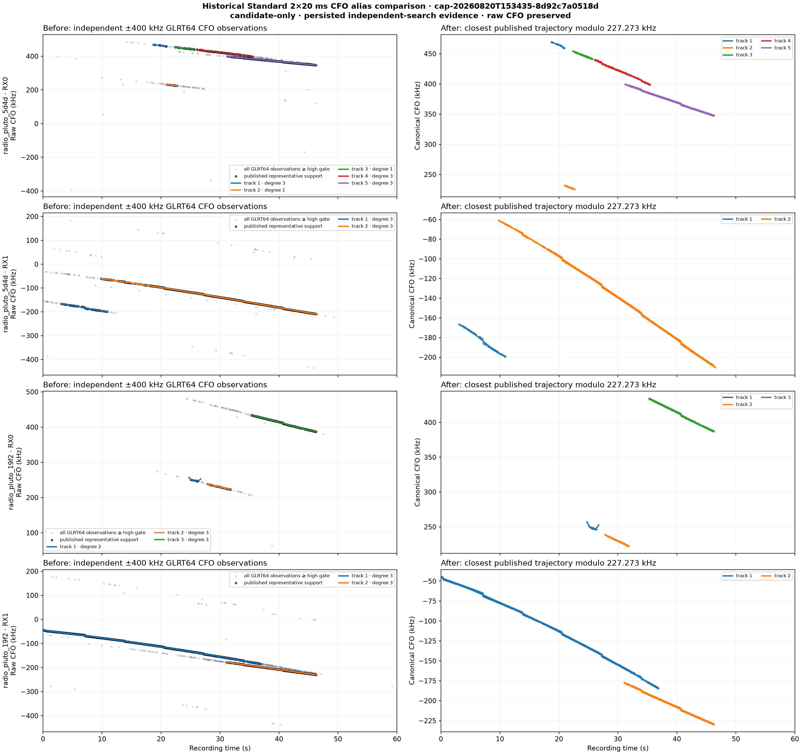
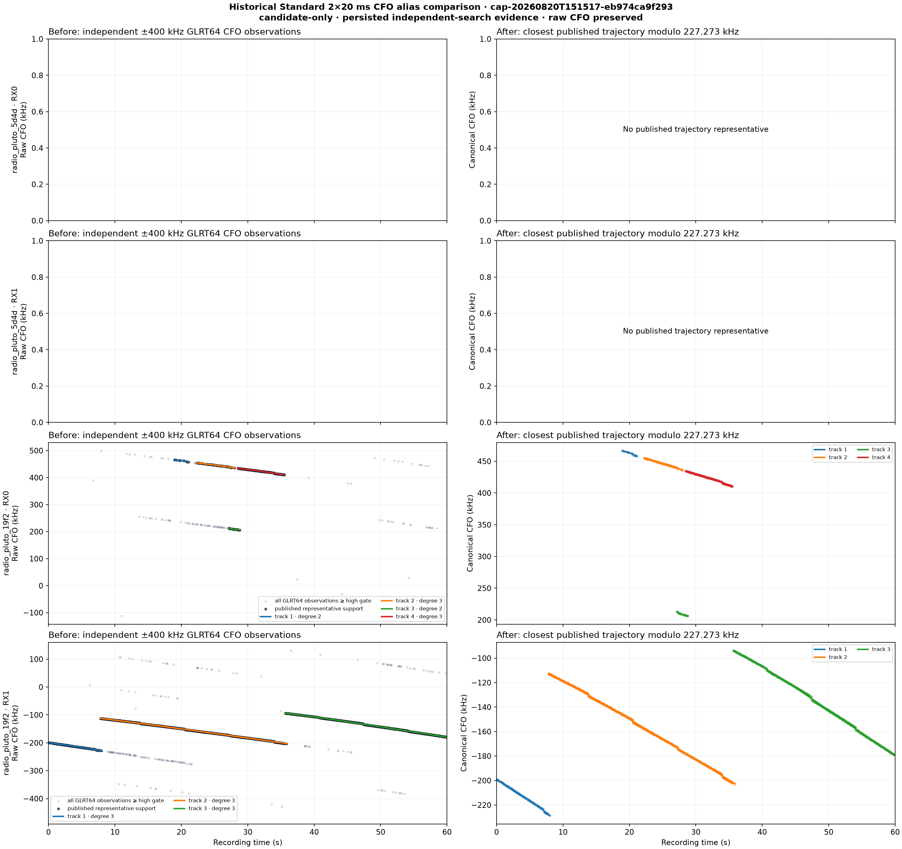

# Recent historical CFO-alias comparison

## Result

The symbol-rate CFO ambiguity seen in the original trial-132 analysis is not unique to that
recording. It recurs in four independently captured 60-second sessions from the last eight
hours, across Starlink channels 1, 3, and 4, both Pluto radios, and both receiver paths.

Across 16 receiver paths, 14 published at least one GLRT64 trajectory. Those paths contained
10,213 high-gate observations that aligned within 2.5 kHz of a published trajectory after an
integer multiple of

\[
\Delta f = 1 / T_{symbol} = 1 / 4.4\,\mu s = 227,272.727\ \text{Hz}
\]

was removed. Of those aligned observations, 1,003 (9.82%) required a nonzero symbol-rate
shift. There were 528 probe/trajectory instances in which more than one integer alias lift
aligned at the same probe time. This is direct evidence that the independent ±400 kHz search
can return multiple CFO coordinates for the same smooth candidate trajectory.

This remains candidate-only evidence. It does not identify a satellite or prove that every
aligned point is generated by one physical signal.

## Capture selection

The input set was selected from completed or sealed Standard results in the eight hours ending
2026-08-20 18:58 UTC. The set intentionally varies channel and edge rather than selecting four
near-identical captures.

| Session | UTC start | Stream 0 | Stream 1 | Reason selected |
|---|---:|---|---|---|
| `cap-20260820T114735-2c9f0566f057` | 11:47:37 | CH1 lower | CH1 lower | Different downlink channel; evidence on both radios |
| `cap-20260820T112935-61403eb6076b` | 11:29:37 | CH3 lower | CH3 lower | Strongest aggregate selected-trajectory support in the interval |
| `cap-20260820T153435-8d92c7a0518d` | 15:34:37 | CH4 lower | CH4 lower | Most recent fully complete four-path result |
| `cap-20260820T151517-eb974ca9f293` | 15:15:18 | CH3 upper | CH3 lower | Same channel with opposite edges; lower-edge radio has the result |

## Aggregate comparison

| Session | Representatives | Strong GLRT64 observations | Alias-aligned | Nonzero alias shift | Same-probe multi-alias cases | Shifted fraction |
|---|---:|---:|---:|---:|---:|---:|
| CH1 lower/lower | 8 | 2,971 | 2,283 | 113 | 45 | 4.95% |
| CH3 lower/lower | 9 | 3,945 | 3,862 | 632 | 354 | 16.36% |
| CH4 lower/lower | 12 | 2,969 | 2,512 | 131 | 51 | 5.21% |
| CH3 upper/lower | 7 | 1,739 | 1,556 | 127 | 78 | 8.16% |

The aligned residual RMS across individual paths ranges from 278.0 to 714.5 Hz. Every
well-supported path uses alias indices from `{-1, 0, +1}`. The sparse CH1/lower 19f2/RX0 path
has only one short representative and uses `0` alone.

## Figures

Each figure uses the persisted Standard `2×20 ms / 50 ms` products. The left column preserves
the independent-search CFO coordinate. Grey points are all GLRT64 observations above the
path's published high gate, black points are the support of the published representative
trajectories, and colored curves are those representatives. The right column assigns each
strong observation to the closest in-time published representative after subtracting the
nearest integer multiple of 227.273 kHz. Only points within 2.5 kHz are shown on the right.

### CH1 lower/lower



### CH3 lower/lower



This is the clearest replication: 632 observations require a nonzero lift and 354
probe/trajectory instances contain multiple aligned alias coordinates.

### CH4 lower/lower



### CH3 upper/lower



The CH3 upper paths on radio 5d4d published `no_result`; the CH3 lower paths on radio 19f2
published seven representatives. The empty upper panels are therefore an honest negative in
this capture, not missing input data.

## Method

This comparison is a bounded post-processing pass over immutable products already generated by
the Standard pipeline:

- `standard.pilot-scan.v3.json`
- `standard.trajectory-bank.v2.json`
- `standard.path-report.v1.json`

It does not rescan raw IQ and does not alter the published trajectories. For each GLRT64
candidate above the published high gate:

1. Consider only representatives whose time interval contains the probe.
2. For each representative prediction `f_track(t)`, calculate
   `n = round((f_raw - f_track(t)) / 227272.727)`.
3. Calculate `f_canonical = f_raw - n × 227272.727`.
4. Choose the representative with the smallest absolute residual.
5. Retain the assignment only when `|f_canonical - f_track(t)| <= 2500 Hz`.

This makes the grouping conditional on independently published trajectory evidence; it does not
invent a trajectory from arbitrary noise points.

Reproduce from a readable local analysis root:

```bash
uv run python tools/analyze_recent_cfo_alias_history.py \
  --analysis-root /srv/bulk/leo/analysis \
  --session-id cap-20260820T114735-2c9f0566f057 \
  --session-id cap-20260820T112935-61403eb6076b \
  --session-id cap-20260820T153435-8d92c7a0518d \
  --session-id cap-20260820T151517-eb974ca9f293 \
  --output-root reports/figures/2026_08_20_recent_cfo_alias_history
```

The machine-readable output is
[`recent-cfo-alias-history.json`](figures/2026_08_20_recent_cfo_alias_history/recent-cfo-alias-history.json).
It includes SHA-256 identities for every consumed path product.

## Interpretation and next step

The same ±227.273 kHz structure appears repeatedly, including simultaneous aliases at the same
probe time. This strengthens the explanation that many visually separate raw ridges are
symbol-rate ambiguity lifts, not automatically separate satellites.

The next production change should preserve two coordinates for every candidate:

- the raw absolute CFO, which is required to correct IQ and replay the detector; and
- an alias-canonical coordinate, which should be used for family grouping and duplicate
  suppression.

Absolute-lift selection must remain a separate replay decision. Canonicalization alone cannot
choose which raw lift correctly corrects the IQ.
