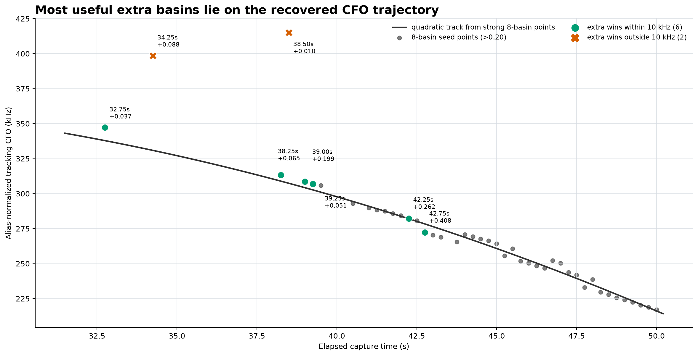
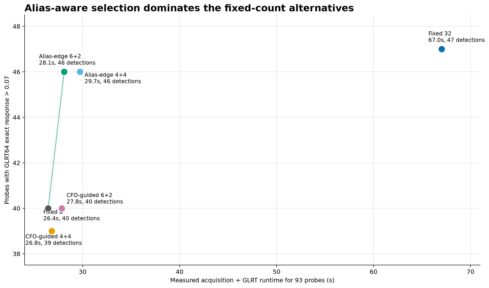
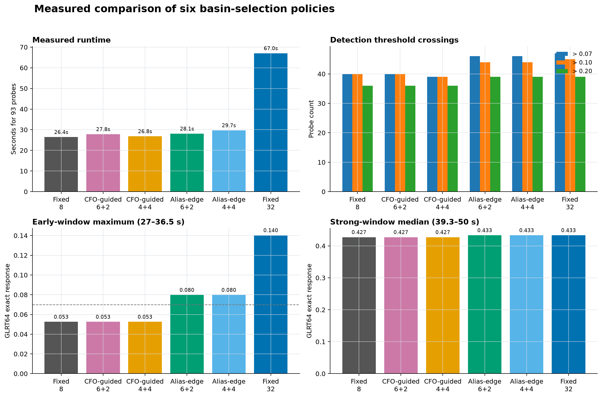

# 0b45a2531e70 RX0 basin-retention investigation

Date: 2026-08-21 UTC

Capture: `cap-20260821T030352-0b45a2531e70`

Investigated path: `radio_pluto_19f2`, `stream-1`, RX0

Sealed run: `capture-8a5496e4d63e4ec0be92e62c46b84e9e`

Scope digest:
`sha256:5b2a1387f86a9e00bd3253458af22975aae88e9f101699f4a02b37240d04dace`

## Executive result

The expected candidate evidence is present in the 27--50 s interval, but the
fixed eight-basin acquisition sometimes discards the useful timing basin before
fine refinement and GLRT64 scoring. Increasing the retained count to 32 recovers
the gaps, including large gains at 39.00, 42.25, and 42.75 s, but costs roughly
2.5 times the fixed-eight runtime in the controlled strategy benchmark.

A bounded **alias-edge 6+2** selector recovered all six track-consistent misses
while refining and GLRT-scoring only eight candidates per probe:

- six slots retain the highest-scoring separated coarse basins globally;
- two slots are reserved for the strongest otherwise-unused basins at the
  positive coarse-CFO search boundary;
- the cheap proposal pool contains up to 32 separated coarse peaks, but only
  the selected eight enter fine CFO refinement and GLRT64.

On this slice it produced 46 responses above 0.07 in 28.09 s, compared with 40
in 26.44 s for fixed eight and 47 in 67.02 s for fixed 32. It did not retain the
isolated 34.25 s fixed-32 peak, which lies well away from the recovered CFO
trajectory and is best treated as a multiple-comparison candidate rather than a
recovery success.

This is candidate-only known-pilot evidence. It does not establish Starlink
attribution, spacecraft identity, or payload recovery.

## Source and analysis bounds

| Field | Value |
|---|---|
| Receiver path | `radio_pluto_19f2`, `stream-1`, RX0 |
| Intended channel/edge | channel 3, upper edge |
| Sample rate | 2.5 Msps |
| Evaluated interval | 27.00--50.00 s |
| Probe cadence / count | 0.25 s / 93 probes |
| Samples per probe | 50,000 |
| Coarse CFO domain / step | -400 to +400 kHz / 80 kHz |
| Fine CFO radius / step | +/-80 kHz / 500 Hz |
| Conditioned radius / step | +/-2 kHz / 100 Hz |
| Final candidate score | conditioned GLRT64 exact-code response |
| Mutation scope | sealed IQ and products read only; no catalog or production product mutation |

The Qin pilot definitions were checked against the local
`qin_pilots_starlink_dl.pdf` reference before this comparison. The experiment
uses the channel-3 upper-edge template selected by the authoritative tuning
intent. The result should not be generalized to another channel or edge without
the explicit code/edge controls listed under next steps.

## What a candidate and its rank mean

A candidate is one locally separated timing/CFO acquisition basin for the same
probe and known-pilot hypothesis. Each retained basin receives fine CFO and
conditioned refinement, held-out exact/control scoring, and an acquisition rank.
Rank zero is only the best basin under that acquisition ordering; ranks 1--7
are alternate basins, not weaker copies of a different signal.

The production trajectory input already has access to all retained basins, but
winner-only presentation can make rank zero look like the entire search. These
benchmarks score every retained candidate with GLRT64 and report the strongest
GLRT64 response per probe. Therefore, "fixed eight" means all ranks 0--7 were
considered; it does not mean rank zero alone.

## Fixed basin-count comparison

The first controlled pass reran identical acquisition and GLRT64 scoring at
8, 16, and 32 retained basins.

| Retained basins | Runtime for 93 probes | Responses >0.07 | >0.10 | >0.20 |
|---:|---:|---:|---:|---:|
| 8 | 22.04 s | 40 | 40 | 36 |
| 16 | 32.84 s | 42 | 41 | 37 |
| 32 | 53.37 s | 47 | 45 | 39 |

Relative to eight, 16 basins cost 49% more and added two responses above 0.07.
Thirty-two cost 142% more and added seven. Six of the eight numerical gains
larger than 0.01 were within 10 kHz of the trajectory fitted from strong
fixed-eight points. The two off-trajectory gains were the 34.25 s and weak
38.50 s candidates.

## Runtime-neutral selector comparison

A second same-process benchmark compared six policies. Raw-IQ loading and the
one-time numerical cache warm-up were outside the timers. Each timer includes
acquisition and four-worker GLRT64 evaluation for all 93 probes. Runtime ratios
should be interpreted within this pass, not by comparing its absolute seconds
with the preceding fixed-count pass.

| Policy | Expensive candidates | Runtime | vs fixed 8 | >0.07 | >0.10 | >0.20 |
|---|---:|---:|---:|---:|---:|---:|
| Fixed 8 | 8 | 26.44 s | -- | 40 | 40 | 36 |
| CFO-guided 6+2 | 8 | 27.84 s | +5.3% | 40 | 40 | 36 |
| CFO-guided 4+4 | 8 | 26.81 s | +1.4% | 39 | 39 | 36 |
| **Alias-edge 6+2** | **8** | **28.09 s** | **+6.2%** | **46** | **44** | **39** |
| Alias-edge 4+4 | 8 | 29.71 s | +12.4% | 46 | 44 | 39 |
| Fixed 32 | 32 | 67.02 s | +153.5% | 47 | 45 | 39 |

The CFO-guided policies used a quadratic trajectory learned from ten fixed seed
probes at one-second cadence from 40.5 through 49.5 s. Seed acquisition and
GLRT64 costs were included. They are simple one-step priors, not Viterbi,
minimum-cost-flow, Kalman, or EM implementations.

The CFO-only prior failed because the useful candidate's coarse basin is not
necessarily close to its final tracked CFO. The track-consistent missed winners
at 38.25, 39.00, 39.25, and 42.25 s all originated from the +400 kHz coarse
boundary. Fine refinement and GLRT tracking then placed them on the recovered
trajectory. Reserving candidates by direct coarse-to-tracked CFO distance
therefore rejects exactly the ambiguity basin that needs to survive.

Alias-edge 6+2 recovered these improvements over fixed eight:

| Time | Fixed 8 | Alias-edge 6+2 | Gain |
|---:|---:|---:|---:|
| 32.75 s | 0.043 | 0.080 | +0.037 |
| 38.25 s | 0.047 | 0.112 | +0.065 |
| 39.00 s | 0.041 | 0.241 | +0.199 |
| 39.25 s | 0.043 | 0.094 | +0.051 |
| 42.25 s | 0.045 | 0.307 | +0.262 |
| 42.75 s | 0.043 | 0.451 | +0.408 |

Its strong-window median was 0.433, equal to fixed 32 and above fixed eight's
0.427. Its early-window maximum was 0.080, versus 0.140 for fixed 32; the
difference is the suspicious off-trajectory 34.25 s peak.

## Interpretation

For this slice, increasing the number of fully refined basins is not justified.
The useful information is already present in the coarse peak map; the failure
is which timing basins are admitted to the expensive stages. A small reserved
budget for the ambiguity boundary captures nearly all the fixed-32 benefit.

The literal `+400 kHz` rule is a diagnostic result, not a production-ready
constant. It is tied to this configured search range and the way Qin pilot
ambiguity maps a coarse boundary basin into the later tracked-CFO result. A
general implementation must derive alias-consistent proposal regions from the
sample rate, pilot geometry, configured CFO bounds, edge, and calibration. It
must also handle the corresponding negative boundary and avoid reserving empty
or redundant slots.

## Approaches not yet tested

This investigation did **not** implement or benchmark:

- Viterbi or minimum-cost-flow selection over a time/CFO candidate lattice;
- Kalman prediction with a multi-hypothesis association bank;
- soft EM over candidates and a noise component.

The current trajectory fitter already performs a hard assignment/refit process
after candidates have survived acquisition. EM cannot restore a basin that was
never proposed. It remains useful only after proposal retention has been fixed,
for optional assignment and trajectory refinement.

## Recommended next steps

1. **Separate cheap proposal count from expensive refinement count.** Add an
   internal acquisition control that can enumerate up to 32 separated coarse
   peaks while refining and GLRT-scoring at most eight. Keep public persisted
   contracts unchanged. Add component-owned tests proving the expensive count
   remains bounded.
2. **Generalize alias-edge reservation.** Replace the capture-specific positive
   boundary check with an alias-aware proposal score derived from the pilot and
   search geometry. Start with six global plus two alias-reserved slots, fill
   unused reserved slots globally, and test both CFO boundaries.
3. **Run explicit code/edge controls.** Replay this slice and a broader
   signal-positive/noise corpus across every supported Qin channel code and both
   edges. The authoritative channel-3 upper hypothesis should retain coherent
   trajectory evidence; wrong-channel and wrong-edge hypotheses must remain
   non-automatic.
4. **Repeat the runtime benchmark.** Use at least five interleaved runs per
   policy and report median, spread, CPU utilization, and peak memory. The
   present single measured pass establishes the large fixed-32 penalty but is
   not a microbenchmark confidence interval.
5. **Prototype global offline path selection.** Build a cheap per-probe
   candidate lattice and compare deterministic Viterbi/minimum-cost-flow paths
   against alias-edge 6+2. Refine only the eight candidates selected per probe;
   include lattice construction and path solving in runtime.
6. **Prototype streaming tracking separately.** Evaluate a small
   Kalman/multi-hypothesis bank with periodic unconstrained rediscovery. Test
   track birth, crossing, loss, reacquisition, and a wrong initial hypothesis.
7. **Use EM only as a final refinement experiment.** Seed it from retained
   paths, include an explicit noise component, and verify that it cannot create
   support by repeatedly selecting one ambiguity basin.
8. **Make rank visibility truthful.** Presentation should expose the selected
   candidate rank and allow inspection of ranks 1--7. Rank zero may remain the
   default view, but it must not imply that alternate candidates were absent or
   excluded from trajectory formation.

Promotion should require broader-corpus success and wrong-code/wrong-edge
controls. This single capture supports an alias-aware proposal policy; it does
not justify hard-coding a boundary or changing scientific attribution claims.

## Archived evidence

The exact per-probe fixed-count outputs are archived as
[`fixed-count-metrics.json`](figures/2026_08_21_0b45a2531e70_basin_recovery/fixed-count-metrics.json).
The selector outputs, timing measurements, seed policy, and configuration
summary are archived as
[`metrics.json`](figures/2026_08_21_0b45a2531e70_basin_recovery/metrics.json).
The analysis used the sealed source read-only. The alias-edge and CFO-guided
selectors were injected only into an external benchmark; they are not current
production behavior.

## Limitations

- Results cover one receiver path and one 23-second slice.
- Threshold counts describe candidate evidence, not calibrated detection
  probabilities.
- The fixed-32 search increases the number of statistical comparisons; its
  isolated extra peaks cannot be treated as true signals without temporal and
  control consistency.
- Runtime was measured on the current host and includes normal host-load noise.
- No new RF data was collected, and no sealed artifact was modified.
