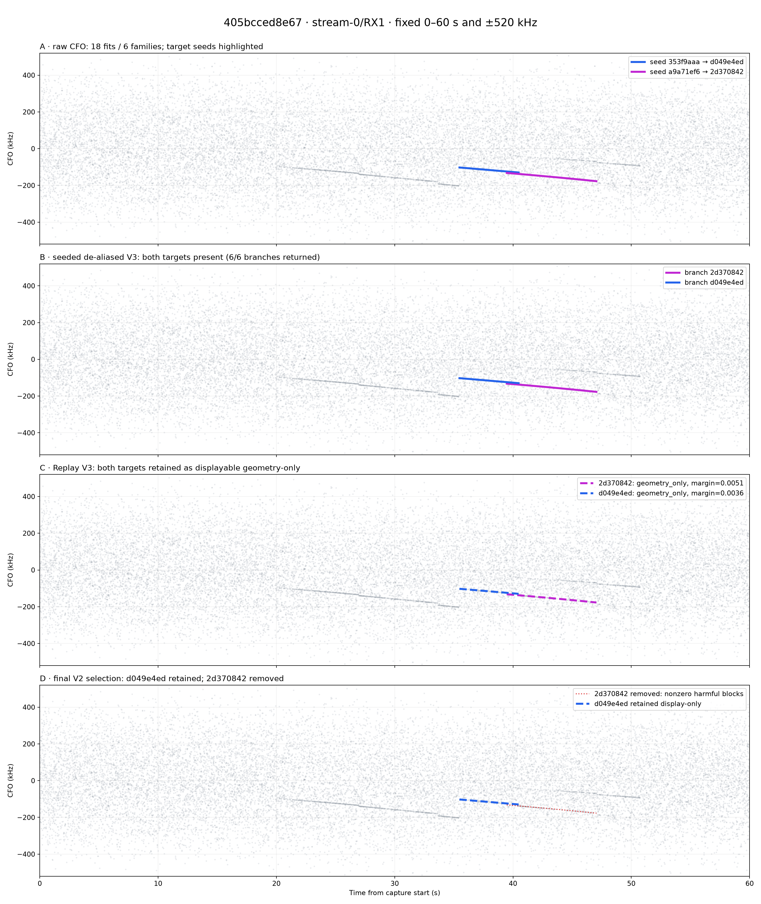
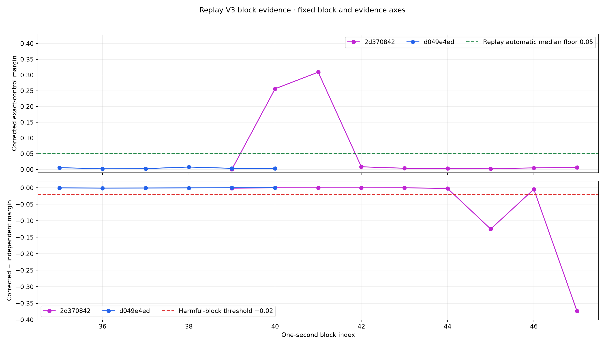

# 405bcced8e67 trajectory-retention investigation

Date: 2026-08-21 UTC

Capture: `cap-20260821T134118-405bcced8e67`

Investigated path: `radio_pluto_5d4d`, `stream-0`, RX1 (`rx_lnb_b`)

Scope digest: `sha256:5677a8c106f0ca405228fe35e78dbd66040a8835f6748c28a4e5373709dbefe3`

Targets: `d049e4ed` and `2d370842`

## Executive result

Neither target disappears between raw CFO fitting and seeded de-aliasing V3, and
neither disappears in Replay V3. Both have an exact raw seed, both become one
seed-preserving V3 branch, and both have an untruncated Replay V3 row classified
`geometry_only` with `geometry_display_eligible=true`.

The targets diverge only at final selection:

- `d049e4ed` survives as final trajectory `dda634ac`, display-only and ineligible
  for automatic correction.
- `2d370842` is absent from the final bank. Its Replay V3 row passes the final
  fallback's probe, coverage, geometry, and 0.0025 corrected-margin floors, but
  has two harmful blocks and a maximum harmful run of one. The final V2
  `one-safe-geometry-fallback-v1` contract requires both counts to be zero.

The root cause of the apparent disappearance is therefore the **final-bank
display-fallback safety policy**, not raw association, seeded de-aliasing, replay
truncation, or the Replay V3 harmful-tail allowance. Replay V3 tolerates this row's
2/9 harmful fraction and one-block run, but still classifies it geometry-only
because its median corrected exact-control margin is 0.005088, below the 0.05
automatic floor. Final selection is deliberately stricter for display fallbacks
and removes it because the harmful counts are nonzero.

## Authority and mutation boundary

| Field | Authoritative value |
|---|---|
| Catalog session | `cap-20260821T134118-405bcced8e67`, committed and raw-available |
| Current Standard run | `capture-faf416d73255412a8fd7af0b809dbc73`, succeeded and sealed |
| Pipeline release | `0a8fc11f2085842439e8686bcb1d7b12e2d387a0` |
| Run manifest | `bulk://analysis/cap-20260821T134118-405bcced8e67/capture-faf416d73255412a8fd7af0b809dbc73/manifest.json` |
| Run manifest digest | `sha256:e1c2aefc6d5e74142a7efdce83cd7a05d2628ff91acf2c2c3ee3a78d59734786` |
| Scope | catalog scope 6251, `stream-0` / RX1 |
| Receiver lineage | `radio_pluto_5d4d`, physical `rx_lnb_b`, receiver path 4, resolved |
| Capture | 60 s, 2.5 Msps, 150,000,000 samples, no reported gaps or overflows |
| Pilot edge | lower, from profile revision digest `sha256:45c66de…e198ce7` |

The catalog was queried inside read-only PostgreSQL transactions. Registered files
were read from `/srv/bulk/leo`, copied to `/tmp` for bounded offline analysis, and
verified against catalog byte counts and SHA-256 digests before use. No live
database row, service, capture, registered artifact, golden fixture, or QNAP path
was modified.

The five inputs used by the report generator are catalog products 48418, 48419,
48423, 48424, and 48425:

| Product | Schema | Catalog SHA-256 | Bytes |
|---|---:|---|---:|
| `standard.pilot-scan` | 3 | `4e1db5a47aa6c4110936f7b19b1d2026a1548884e28fe6c8d16c1999fd4ecbc0` | 15,246,940 |
| `standard.trajectory-bank` | 2 | `5544fc490f0ed5dc2ea3f9bea55c33c3ce8d1dce9ba3e76b140cb8e4d1c37300` | 274,724 |
| `standard.dealiased-trajectory-bank` | 3 | `be7a9dd7e855e48365acde884fa9c51e6d409bb30343d3ed4e5d0c474c915454` | 774,005 |
| `standard.cfo-lift-replay` | 3 | `43ab56ff175a35881088825de87230e079fd463e554916dfc04de79b14b7fa25` | 13,741 |
| `standard.final-trajectory-bank` | 2 | `22c8369722431b4fdc73019882afeec477b31229890ddef0c59d2b21db9bbeed` | 60,971 |

## Exact funnel

| Stage | Full path count | `d049e4ed` | `2d370842` |
|---|---:|---|---|
| Pilot detections / raw GLRT64 candidates | 2,400 / 19,200 | raw seed `353f9aaa` present | raw seed `a9a71ef6` present |
| Raw fitted trajectories / families | 18 / 6 | seed has 81 observations, 35.475–40.475 s | seed has 120 observations, 39.475–47.050 s |
| Seeded de-aliased V3 source / returned / truncated | 6 / 6 / 0 | branch present, 79 selected probes | branch present, 119 selected probes |
| Replay V3 source / returned / truncated | 6 / 6 / 0 | row present, `geometry_only` | row present, `geometry_only` |
| Replay automatic / geometry-display lifts | 3 / 6 | display yes, automatic no | display yes, automatic no |
| Final V2 selection candidates / returned / automatic | 5 / 5 / 3 | retained display-only as `dda634ac` | absent before the five-candidate final set |

The seeded V3 count reductions of 81 to 79 and 120 to 119 are not lost time
support. The seed disposition says one candidate and integer alias were selected
per probe; the branch keeps 79/79 and 119/119 selected probes. This is the
contracted resolution of duplicate same-probe candidates.

The final bank's `source_trajectory_count=5` deserves special attention. It counts
rows that already passed automatic-or-fallback selection, not all six Replay V3
rows. Consequently the final product says 5 source, 5 returned, 0 truncated and
cannot by itself disclose that `2d370842` was considered and rejected. The loss is
visible only by joining the replay and final contracts.

## Fixed-axis visual audit

Every CFO panel below uses the same 0–60 s and −520–+520 kHz axes and the same
19,200 gray GLRT64 candidates. Panel D draws the missing branch as a red dotted
reference so its absence from the actual final bank is explicit rather than
silently erasing its prior geometry.



The two target branches overlap for 1.0 s but are not the same fitted line: their
selected models differ by about 7.84 kHz RMS over the overlap and share no
observation IDs. The final loss is not duplicate suppression or an implicit
stitch.

## Gate-by-gate evidence

| Evidence / gate | `d049e4ed` | `2d370842` |
|---|---:|---:|
| Observations / duration | 79 / 5.000 s | 119 / 7.575 s |
| Replay probes / blocks | 201 / 6 | 304 / 9 |
| Block coverage | 1.0, pass | 1.0, pass |
| Median corrected exact-control margin | 0.003625, below 0.05 | 0.005088, below 0.05 |
| Harmful blocks / fraction | 0 / 0.000 | 2 / 0.222 |
| Maximum consecutive harmful blocks | 0 | 1 |
| Replay V3 harmful fraction ≤0.25 / run ≤2 | pass / pass | pass / pass |
| Replay V3 result | `geometry_only`, displayable | `geometry_only`, displayable |
| Final fallback corrected margin ≥0.0025 | pass | pass |
| Final fallback harmful blocks ==0 / run ==0 | pass / pass | **fail / fail** |
| Final result | retained display-only | **removed** |



`2d370842` has strong corrected absolute evidence only in blocks 40 and 41. Its
median across nine blocks remains weak, and blocks 45 and 47 have margin deltas
−0.124920 and −0.373376, well below the −0.02 harmful threshold. This explains the
seemingly paradoxical contract outcome:

1. Replay V3 keeps the geometry visible because 2/9 harmful blocks and a run of
   one remain inside its bounded harmful-tail limits.
2. Replay V3 does not authorize correction because the median absolute margin is
   below 0.05.
3. Final V2 refuses even the optional display fallback because that separate
   policy requires no harmful block and no harmful run at all.

For `d049e4ed`, all six corrected margins are near zero, so Replay V3 correctly
withholds automatic correction. Its median 0.003625 is nevertheless above the
separate 0.0025 display floor and it has no harmful blocks, so final selection
retains it as non-correcting geometry.

## Contract and implementation locus

The loss occurs in `select_final_trajectories_v2`, not in either V3 producer. For
a non-automatic Replay V3 row, the final fallback predicate requires:

```text
tier == geometry_only
AND geometry_display_eligible
AND probe and coverage floors pass
AND harmful_block_count == 0
AND maximum_consecutive_harmful_blocks == 0
AND median_block_corrected_margin >= 0.0025
```

The persisted selection configuration is
`FinalTrajectorySelectionConfigV1(policy_version="one-safe-geometry-fallback-v1",
require_zero_harmful_blocks=true)`. `2d370842` fails exactly the two zero-harmful
predicates; every other fallback predicate passes.

This is a display-retention policy, not an RF truth judgment. Both contracts are
candidate-only, claim no payload decode or spacecraft specificity, and correctly
keep automatic correction disabled for these two rows.

## Recommendations

1. **Do not promote `2d370842` to automatic correction and do not weaken Replay
   V3.** Its median absolute evidence is one tenth of the automatic floor and its
   two late harmful blocks are material. The current evidence supports geometry
   inspection, not correction.
2. **Make all Replay V3 dispositions visible in an additive final-contract major
   or a versioned retention ledger.** Record every replay branch ID, selected or
   excluded, with a stable reason such as `fallback_nonzero_harmful_blocks`.
   Preserve final-bank V2 and all existing public majors unchanged.
3. **Expose replay-visible geometry separately from final correction geometry in
   the API/UI.** `geometry_display_lifts` already contains all six rows, including
   `2d370842`. A clearly dashed, non-correcting replay layer would remove the
   apparent disappearance without relaxing safety policy.
4. **Clarify final source-count semantics in the next schema.** Publish both
   `predecessor_replay_row_count=6` and `selection_candidate_count=5`; the current
   `source_trajectory_count=5` hides the one row rejected before bounding and
   makes `truncated_trajectory_count=0` look like full stage retention.
5. **Keep the exact regression added with this report.** It asserts that Replay
   V3 can tolerate a bounded 2/9 harmful tail while final display fallback still
   requires zero, and that nonharmful weak geometry above 0.0025 remains
   display-only. Add a future product-level test asserting an explicit exclusion
   disposition when the next contract is introduced.

## Reproduction

The tool performs no catalog or artifact writes. Point it at read-only copies of
the five registered products and supply their catalog digests:

```bash
export MPLCONFIGDIR=/tmp/405bcc-mpl
PY=/home/mouse9911/gits/leo-tracker-reduxredux/.venv/bin/python
SRC=/tmp/405bcc-track-loss-source
OUT=/tmp/405bcc-track-loss-report

$PY tools/summarize_405bcc_track_loss.py \
  --artifacts-root "$SRC" \
  --output-root "$OUT" \
  --expected-sha256 standard.pilot-scan.v3.json=4e1db5a47aa6c4110936f7b19b1d2026a1548884e28fe6c8d16c1999fd4ecbc0 \
  --expected-sha256 standard.trajectory-bank.v2.json=5544fc490f0ed5dc2ea3f9bea55c33c3ce8d1dce9ba3e76b140cb8e4d1c37300 \
  --expected-sha256 standard.dealiased-trajectory-bank.v3.json=be7a9dd7e855e48365acde884fa9c51e6d409bb30343d3ed4e5d0c474c915454 \
  --expected-sha256 standard.cfo-lift-replay.v3.json=43ab56ff175a35881088825de87230e079fd463e554916dfc04de79b14b7fa25 \
  --expected-sha256 standard.final-trajectory-bank.v2.json=22c8369722431b4fdc73019882afeec477b31229890ddef0c59d2b21db9bbeed
```

The exhaustive machine-readable result, including every predicate evaluation,
is [`facts.json`](figures/2026_08_21_405bcced8e67_track_loss/facts.json).

Verification:

```bash
.venv/bin/pytest tests/analysis/test_summarize_405bcc_track_loss.py -q
.venv/bin/ruff check tools/summarize_405bcc_track_loss.py \
  tests/analysis/test_summarize_405bcc_track_loss.py
```

## Limitations

This is a lineage and candidate-evidence audit of one registered receiver path.
It does not establish satellite identity, transmitter count, or payload content.
The strong block-local evidence on `2d370842` does not override its weak median
or harmful tail, and the visual continuity of a CFO line does not itself authorize
correction.
