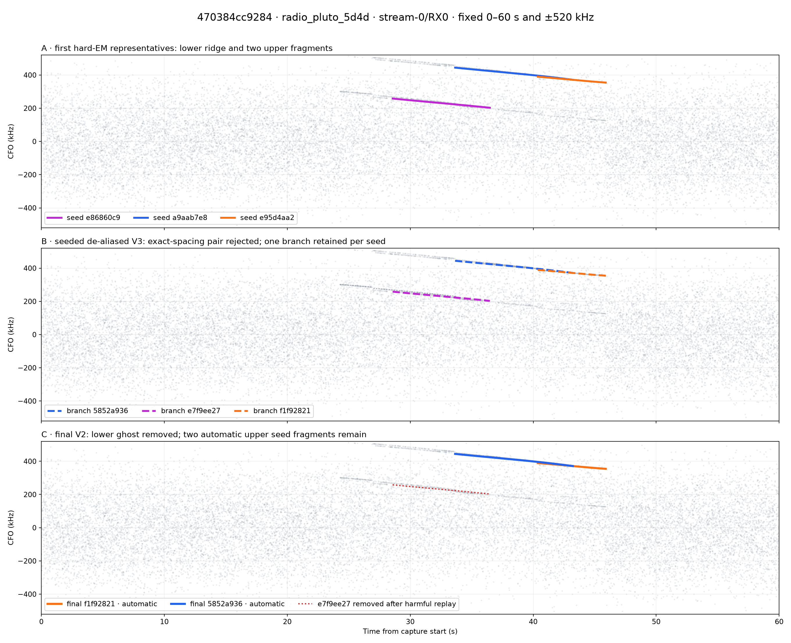
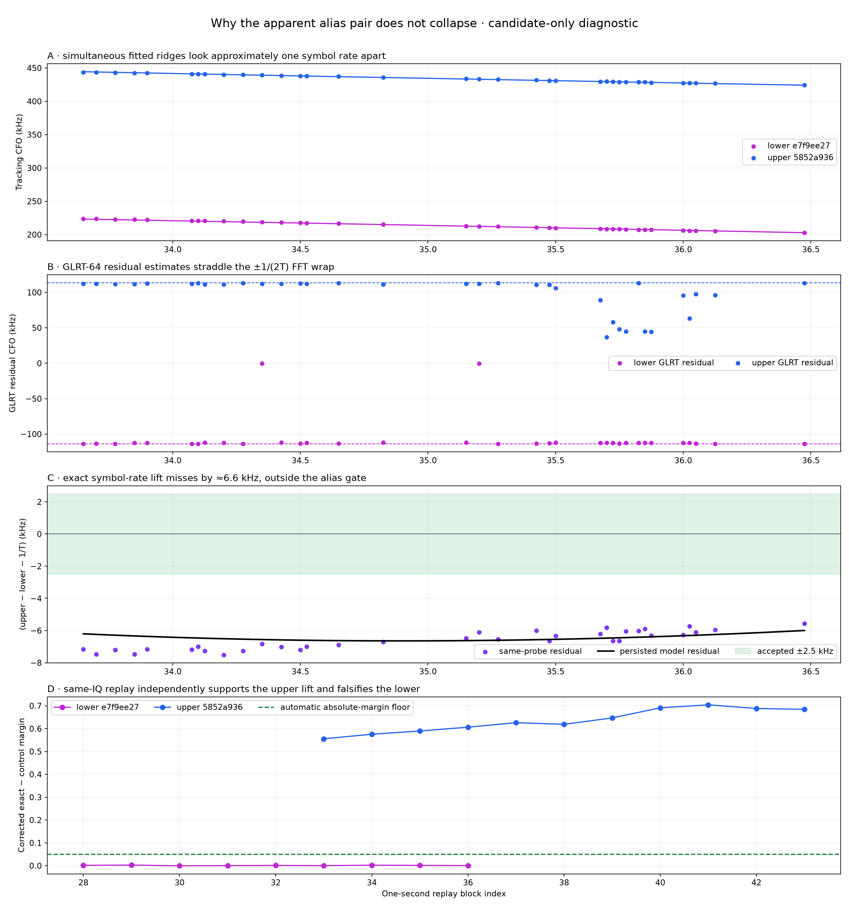
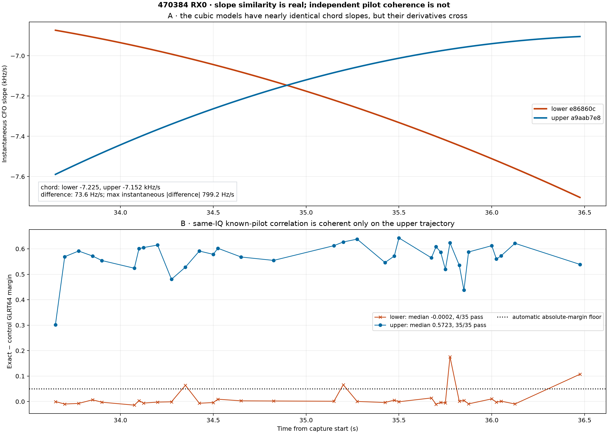
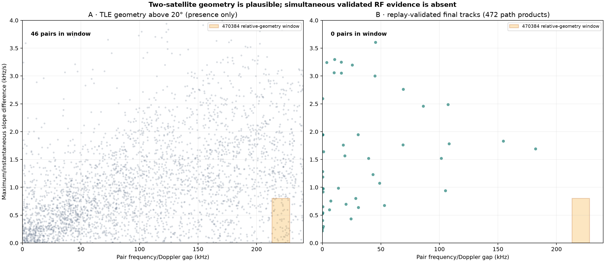

# 470384cc9284 RX0 apparent CFO-alias investigation

Date: 2026-08-21 UTC

Capture: `cap-20260821T140820-470384cc9284`

Investigated path: `radio_pluto_5d4d`, `stream-0`, RX0 (`rx_lnb_a`)

Scope digest: `sha256:ccdc4b152617f6e99b23044948cea7be040905cf1e7dd074bb36668b36dc0963`

## Executive result

The two prominent lower/upper ridges look approximately one OFDM symbol rate
apart, but they are **not an exact symbol-rate alias pair under the persisted
evidence**. The exact spacing is 227,272.727 Hz. During their 2.825 s overlap,
the persisted cubic models are separated by a median 220,768.939 Hz, leaving a
6,455.464 Hz RMS and 6,641.692 Hz maximum residual after the best integer lift.
The de-alias contract requires every comparison residual to be at most 2,500 Hz,
so it explicitly records `rejected_residual` and leaves the tracks in separate
components.

The same result appears directly in the observations, not just the polynomial
models. At 35 probes selected by both branches, the median raw separation is
220,635.212 Hz and the median one-symbol residual is −6,637.515 Hz. The residual
range is −7,503.329 to −5,569.077 Hz; no reasonable choice of comparison points
can bring it inside the frozen gate.

The visual resemblance has a concrete numerical cause: the GLRT-64 residual CFO
estimator is an FFT over symbol-to-symbol phase and wraps at ±1/(2T), or
±113,636.364 Hz for T = 4.4 µs. Of the 35 simultaneous probes, 33 lower-track
residuals lie within 5 kHz of the negative wrap and 23 upper-track residuals lie
within 5 kHz of the positive wrap. But published tracking CFO is
`acquired_cfo_hz + residual_cfo_hz`; the two acquisition basins do not differ by
the compensating amount required to make the totals one exact 1/T lift.

The lower ridge is therefore best classified as a **smooth GLRT multi-basin/wrap
hypothesis**, not as a verified second absolute CFO trajectory and not as an
exact alias duplicate. Same-IQ replay strongly supports this classification:

- upper branch `5852a936`: automatic, corrected margin 0.626132, 0/11 harmful
  blocks, retained in the final bank;
- lower branch `e7f9ee27`: geometry-only, corrected margin 0.001363, median
  degradation −0.379819, 9/9 harmful blocks in one run, removed from the final
  bank.

The root cause of seeing both lines in the **de-aliased** plot is the combination
of a correct strict rejection and the V3 retention policy: the alias map rejects
the approximate lift, and seeded de-aliasing V3 deliberately refines and retains
one branch for every first-EM seed. Replay happens later and does not rewrite the
immutable de-aliased product. This is expected contract behavior, but the current
plot title makes a rejected, later-falsified geometry easy to mistake for a
surviving physical track.

There is a separate genuine fragmentation issue on the upper ridge. Branches
`5852a936` and `f1f92821` overlap for 2.85 s, both pass replay automatically, and
both survive the final bank. They are zero-lift seed fragments, not the apparent
one-symbol-offset pair. Seed preservation plus the absence of a post-replay
stitch/deduplication stage is why the final plot still contains two overlapping
upper segments.

## Authority and mutation boundary

| Field | Authoritative value |
|---|---|
| Catalog session | `cap-20260821T140820-470384cc9284`, committed and raw-available |
| Current Standard run | `capture-438ad263e01048ef82f660975ec55a08`, succeeded and sealed |
| Pipeline release | `0a8fc11f2085842439e8686bcb1d7b12e2d387a0` |
| Run manifest | `bulk://analysis/cap-20260821T140820-470384cc9284/capture-438ad263e01048ef82f660975ec55a08/manifest.json` |
| Run manifest digest | `sha256:048dc4696aab19cf71b462bfb1ffd6da85696552418ddfe942196ae410fe24ae` |
| Scope | catalog scope 6351, `stream-0` / RX0 |
| Subject binding | `sha256:224c532143373ce98be1c2b39a56535568a08b63f2ca185a19515363b2878f8e` |
| Receiver lineage | `radio_pluto_5d4d`, physical `rx_lnb_a`, resolved |
| Input | channel 4, upper pilot edge, uncalibrated prior, tuner 1,940,312,500 Hz |
| Capture | 60 s, 2.5 Msps, 150,000,000 samples, no reported gaps or overflows |

The catalog was queried read-only. Six registered artifacts were copied from
`/srv/bulk/leo` to `/tmp` and verified against catalog byte counts and SHA-256
digests before analysis. No catalog row, service, registered artifact, capture,
golden fixture, RF configuration, or path beneath `/mnt/qnap01` was modified.

| Catalog product | ID | Schema | Catalog SHA-256 | Bytes |
|---|---:|---:|---|---:|
| `standard.pilot-scan` | 49032 | 3 | `a1ad40a1…9d24a24e` | 15,251,885 |
| `standard.trajectory-bank` | 49033 | 2 | `1cc2ebfb…b978276` | 281,521 |
| `standard.cfo-alias-map` | 49036 | 2 | `e7631422…8664afd` | 7,904 |
| `standard.dealiased-trajectory-bank` | 49037 | 3 | `836355c1…5f1403` | 723,281 |
| `standard.cfo-lift-replay` | 49038 | 3 | `c1d34a53…5ab271` | 11,485 |
| `standard.final-trajectory-bank` | 49039 | 2 | `2e990e7d…abbe` | 36,464 |

## Stage-by-stage audit

| Stage | Count | Relevant outcome |
|---|---:|---|
| Scheduled pilot detections | 2,400 | eight GLRT64-scored basins per probe |
| Raw GLRT64 candidates | 19,200 | both smooth ridges have high initial candidate scores |
| Raw fitted trajectories / families | 15 / 5 | lower seed `e86860c9`; upper seeds `a9aab7e8`, `e95d4aa2` |
| Alias-map components / accepted pairs | 5 / 0 | all five representatives remain singleton components |
| Seeded V3 source / returned / truncated | 5 / 5 / 0 | one independently refined branch per seed |
| Replay V3 source / returned | 5 / 5 | lower geometry rejected for correction; both upper fragments automatic |
| Final V2 returned | 2 | only upper branches `5852a936` and `f1f92821` |

Every panel below uses the same 0–60 s and ±520 kHz axes. The red dotted lower
line in panel C is a reference showing what final selection removed, not a final
trajectory.



## Why it looks like an alias

The initial multi-basin detector gives both ridges plausible scores during the
overlap. The lower median GLRT64 exact-control margin is 0.413927 and the upper
median is 0.499485. The upper wins 30 of 35 same-probe comparisons, but the lower
still forms an unusually clean candidate ridge. Visual smoothness alone is not
an absolute-lift decision.

The GLRT residual calculation explains the nearly periodic appearance. The
implementation forms a 512-bin FFT grid with
`np.fft.fftfreq(..., d=symbol_step_s)`. That estimator is periodic at 1/T. Most
lower observations sit at the negative half-spacing wrap while most upper
observations sit at the positive wrap. Different symbolwise acquisition basins
supply the coarse CFO term, leaving an approximately—but not exactly—periodic
sum.



| Quantity | Persisted-model result | Same-probe result |
|---|---:|---:|
| Measured overlap | 2.825 s | 35 probes, 33.650–36.475 s |
| Median upper − lower gap | 220,768.939 Hz | 220,635.212 Hz |
| Exact alias spacing | 227,272.727 Hz | 227,272.727 Hz |
| Alias residual RMS | 6,455.464 Hz | 6,641.673 Hz |
| Alias residual maximum | 6,641.692 Hz | 7,503.329 Hz |
| Contract gate | 2,500 Hz maximum | diagnostic comparison |

The persisted decision uses 128 model comparison points and the **maximum**
absolute residual, not RMS. Accepting this pair without changing its geometry
would require a gate of at least 6,641.692 Hz, 2.657 times the configured value.
That would also accept the early/late upper zero-lift pair at its 6,082.091 Hz
raw-model maximum and would materially broaden false merges across the corpus.

Changing the spacing to the observed 220.6–220.8 kHz is also unjustified. It
would turn a capture-specific acquisition-basin discrepancy into a purported
symbol duration of about 4.53 µs and violate the exact 2,500,000/11 persisted
contract. No evidence here supports a sample-clock or symbol-rate change.

## Deeper follow-up: slope, two-satellite odds, and signal correlation

### What is the slope of each line?

The authoritative raw cubic representatives were differentiated analytically
over the exact 33.650–36.475 s overlap. A single slope number hides real
curvature, so the table reports both instantaneous derivatives and the
end-to-end chord slope.

| Raw representative | Start slope | Midpoint slope | End slope | Chord slope |
|---|---:|---:|---:|---:|
| Lower `e86860c9` | −6.873 kHz/s | −7.194 kHz/s | −7.704 kHz/s | **−7.225 kHz/s** |
| Upper `a9aab7e8` | −7.589 kHz/s | −7.104 kHz/s | −6.904 kHz/s | **−7.152 kHz/s** |

The chord slopes differ by only **73.599 Hz/s**. Across 128 points the
instantaneous upper-minus-lower slope difference has 89.569 Hz/s median,
447.110 Hz/s RMS, and 799.225 Hz/s maximum magnitude. The curves are therefore
genuinely close in first derivative, although their curvatures have opposite
behavior and their derivatives cross near 34.9 s. Seed-preserving V3 refinement
does not change the conclusion: its chord slopes are −7.259 and −7.121 kHz/s.



Slope agreement is weak identity evidence here. Both estimates came from one
receiver and share any LNB/receiver frequency drift. More importantly, many LEO
objects can have comparable radial acceleration at one instant.

### How plausible are two satellites?

There is no defensible scalar probability for “two satellites transmitted this
channel into this antenna” in the persisted capture. The recording does not bind
an observer coordinate, antenna boresight/beamwidth, serving-cell assignment, or
satellite frequency/time allocation. A TLE establishes geometric presence, not
transmission. Two complementary bounded calculations are nevertheless useful.

First, the Space-Track Starlink snapshot collected at 13:02:51 UTC, 65 minutes
before this 14:08:22 UTC capture, contains 10,976 valid records. Propagating it
at the overlap midpoint with the repository's **illustrative, non-capture-bound**
Spinnaker/Sausalito preset gives:

| Elevation mask | Visible objects | All pairs | Pairs within 799.225 Hz/s chord-slope difference | Also within 220.769 ± 7.503 kHz Doppler gap |
|---:|---:|---:|---:|---:|
| 0° | 504 | 126,756 | 87,189 | 1,729 |
| 10° | 208 | 21,528 | 11,596 | 228 |
| 20° | 99 | 4,851 | 2,200 | **46 (0.948%)** |
| 30° | 52 | 1,326 | 657 | 18 |

Thus two-satellite **relative geometry is entirely plausible** before applying
an antenna beam or transmission schedule. This calculation cannot name the RF
source: above 20°, predicted individual Ku-band Doppler slopes span −5.336 to
−0.355 kHz/s, so none reproduces the observed ≈−7.2 kHz/s without an unmodelled
common receiver/LNB drift, a different observer position, or both. The capture
lacks the authority needed to resolve that discrepancy.

Second, the receiver's own current Standard corpus is a closer empirical check
on simultaneous known-pilot transmissions. A frozen read-only export covered
472 digest-verified final path products from 118 captures between 05:01 and
14:45 UTC, containing 1,037 replay-validated trajectories:

- 211 final pairs overlap at all; 47 overlap for at least this case's 2.825 s;
- 14 of those 47 meet this case's 799.225 Hz/s maximum slope-difference bound;
- the largest frequency gap among those 14 is only 53.096 kHz;
- **zero** final pairs at any positive overlap fall within 220.769 ± 7.503 kHz,
  even before imposing the slope bound.

If the 472 paths or 118 sessions were independent Bernoulli trials, zero events
would give one-sided 95% rate ceilings of 0.633% per path or 2.507% per session.
They are serial observations from one station, not independent random trials, so
those numbers are descriptive ceilings rather than physical odds. The sound
conclusion is narrower: orbital geometry allows such pairs, but this station's
validated RF corpus has not produced one in the frozen comparison set.



### Correlating the signals

A naive correlation between two frequency-shifted copies of the same raw IQ
would be circular: both curves are hypotheses over the same samples, and the
eight-subcarrier pilot bands overlap. The discriminating test is a
trajectory-conditioned correlation against the independent published pilot
sequence and its equal-energy rolled negative control.

For every one of the 35 shared probes, the audit dechirped the raw RX0 samples
along each V3 trajectory, reacquired only within ±20 kHz, and reran the exact
upper-edge Qin GLRT64/control correlation:

| Conditioned hypothesis | Median exact − control margin | Range | Probes above 0.05 |
|---|---:|---:|---:|
| Lower `e7f9ee27` | **−0.000210** | −0.014176 to +0.175681 | **4 / 35** |
| Upper `5852a936` | **+0.572252** | +0.301785 to +0.642801 | **35 / 35** |

The four lower excursions are isolated; they do not form sustained blockwise
evidence and are compatible with the known cross-ambiguity/GLRT-wrap mechanism.
The lower and upper conditioned-margin series have Pearson `r = 0.097` with a
Fisher 95% interval of −0.244 to +0.417, so their apparent strengths do not
covary measurably in this small sample.

The decomposition is even more revealing. Initial **total tracking CFOs** are
correlated at `r = 0.999325`, which explains the compelling parallel plot. But
the underlying coarse acquired CFOs have `r = 0.0445`, initial GLRT margins have
`r = 0.204`, and candidate epochs differ by a median 406 samples (162.4 µs)
modulo the frame period; none is within the detector's 20-sample same-basin
separation. Smooth total-frequency covariance is therefore not shared waveform
coherence.

A second physical transmitter could still be present elsewhere in the IQ, but
for these two plotted hypotheses it would need a repeatable independent pilot
correlation on the lower dechirped trajectory. That evidence is absent. The
correlation result materially strengthens the root-cause finding: the lower line
is best classified as a smooth ambiguity-basin response to the supported upper
signal, not as a validated second satellite track.

## Replay is the decisive evidence

| Replay evidence | Lower `e7f9ee27` | Upper `5852a936` |
|---|---:|---:|
| Probes / one-second blocks | 317 / 9 | 384 / 11 |
| Median corrected exact-control margin | 0.001363 | 0.626132 |
| Automatic floor | 0.05 | 0.05 |
| Median corrected − independent margin | −0.379819 | +0.106579 |
| Harmful blocks / maximum run | 9 / 9 | 0 / 0 |
| Replay tier | `geometry_only` | `automatic` |
| Final bank | absent | present |

The lower line is not lost through truncation: all five V3 branches and all five
replay lifts are returned. Its geometry remains display-eligible because it is
smooth and well populated, while its absolute correction evidence fails. This
is precisely the distinction between a candidate geometry product and a final
correction product.

The evidence does not establish how many transmitters are present. It does show
that these two plotted CFO curves should not be collapsed as one exact alias and
that the lower curve should not authorize correction.

## Separate upper-track fragmentation

The final bank contains two upper branches:

| Branch | Support | Replay | Final |
|---|---|---|---|
| `5852a936` | 33.650–43.225 s | automatic, margin 0.626132 | retained |
| `f1f92821` | 40.375–45.900 s | automatic, margin 0.698909 | retained |

Their raw representatives overlap for 2.85 s with alias index zero, but the
model difference evolves from −6.082 kHz to −0.174 kHz and has a 3.923 kHz RMS.
The same maximum-residual gate rejects that pair too. Seeded V3 then guarantees
one output branch for each input seed, and final selection evaluates branches
independently. Consequently both supported fragments survive.

This is a continuity/deduplication limitation, not a CFO alias error. Any fix
should operate after replay and retain explicit predecessor identities; weakening
the alias gate is the wrong mechanism.

## Root cause in the implementation

1. `pilot_methods._glrt_pair` estimates residual CFO on an FFT grid periodic at
   the OFDM symbol rate. Strong basins can therefore occur near opposite residual
   wrap boundaries.
2. `trajectory_observations` publishes total tracking CFO as acquired CFO plus
   GLRT residual CFO. The two coarse acquisition basins leave the totals about
   6.6 kHz short of one exact symbol-rate separation.
3. `build_cfo_alias_map` and `_compare_representatives` correctly choose the
   nearest integer lift, then require all 128 residuals to fit the 2.5 kHz gate.
   The pair fails and becomes two singleton components.
4. `fit_seed_preserving_dealiased_trajectories` intentionally preserves every
   first-EM seed and its membership. It does not perform a second cross-seed
   alias merge, so the lower geometry remains visible in the de-aliased V3 bank.
5. `replay_observed_cfo_lifts_v3` runs later on the same IQ. It rejects the lower
   absolute lift, and `select_final_trajectories_v2` excludes it from the final
   bank. Neither later stage mutates the already-published de-aliased product.

## Recommendations

1. **Keep the exact 227,272.727 Hz spacing and 2.5 kHz maximum-residual gate.**
   Do not force-merge this pair and do not tune a physical constant to one
   acquisition-basin artifact. The replay evidence independently says the lower
   lift is harmful.
2. **Make alias decisions visible beside de-aliased geometry.** Add an additive
   UI diagnostic showing component ID, best integer delta, residual RMS/maximum,
   and `rejected_residual`. Rename or subtitle the V3 view as “seed-preserving
   canonical candidate geometry” so “de-aliased” is not read as “validated and
   fully merged.”
3. **Visually distinguish replay disposition in the de-aliased view.** Overlay
   later replay status without changing the immutable scientific product: gray
   or cross-hatch harmful geometry, solid automatic branches, and label the
   product boundary explicitly.
4. **Add a joint acquisition/GLRT-wrap diagnostic before changing algorithms.**
   Persist or derive the coarse acquired CFO, wrapped GLRT residual, epoch, and
   total CFO for compared pairs. This case shows why comparing only total CFO can
   hide the origin of an approximate alias. Treat such output as diagnostic;
   absolute same-IQ replay remains the authority for correction.
5. **Add a post-replay branch stitcher for supported zero-lift fragments.** It
   should require overlapping or bounded-gap support, compatible local
   frequency/slope/acceleration, and no contradictory simultaneous observations;
   publish predecessor IDs and an explicit disposition in a new additive
   contract. Target `5852a936` + `f1f92821`, not the rejected lower ridge.
6. **Add corpus regression coverage for both outcomes.** Freeze this artifact
   audit as a non-golden report regression: the approximate 220.6 kHz pair must
   remain rejected and harmful, while a future stitcher should demonstrate
   conservative closure of the two replay-supported upper fragments without
   changing existing public majors.

## Reproduction

The report generator performs no catalog or artifact writes. Point it at
read-only copies of the six registered products:

```bash
export MPLCONFIGDIR=/tmp/470384-mpl
PY=/home/mouse9911/gits/leo-tracker-reduxredux/.venv/bin/python
SRC=/tmp/470384-alias-source
OUT=/tmp/470384-alias-report

$PY tools/summarize_470384_alias_offsets.py \
  --artifacts-root "$SRC" \
  --output-root "$OUT" \
  --expected-sha256 standard.pilot-scan.v3.json=a1ad40a1485ed85b65a8325ad8b6b13b1a53d557aad114997971edd82924a24e \
  --expected-sha256 standard.trajectory-bank.v2.json=1cc2ebfb628593537ce4df56cf1d1c78a336bd71108368095a1271ec3b978276 \
  --expected-sha256 standard.cfo-alias-map.v2.json=e76314221ce310110e2db33a7f91c85eaa86c3e16409009b1f83d91068664afd \
  --expected-sha256 standard.dealiased-trajectory-bank.v3.json=836355c17df27502ee748593f86842afebbcebdf4469207cdd85f29af35f1403 \
  --expected-sha256 standard.cfo-lift-replay.v3.json=c1d34a53e68ece49c069ad400f609bfcc0e4f7f666a337b013993d2d575ab271 \
  --expected-sha256 standard.final-trajectory-bank.v2.json=2e990e7d5ca061d346e0be189b4bf39ac16178f199b7b319723452ca86eeabbe
```

The exhaustive numerical output, including all 35 matched-probe decompositions,
is [`facts.json`](figures/2026_08_21_470384_alias_offsets/facts.json).

The slope, focused IQ-correlation, corpus, and illustrative TLE facts are in
[`deeper-facts.json`](figures/2026_08_21_470384_alias_offsets/deeper-facts.json).
The exact 472-row corpus inventory is
[`current-final-product-index.csv`](figures/2026_08_21_470384_alias_offsets/current-final-product-index.csv)
with SHA-256 `bccb55e397b53b955eadbe4ce53d64b862b097656195c585aba796392f0955d6`.
It was frozen with this read-only query:

```sql
select p.id, p.logical_uri, p.digest, p.byte_size,
       s.session_id, s.stream_id, s.receiver_id,
       r.id as run_id, r.created_at
from current_analysis ca
join analysis_run r on r.id = ca.run_id
join analysis_product p on p.run_id = r.id
join analysis_scope s on s.id = p.scope_id
where p.kind = 'standard.final-trajectory-bank'
  and p.schema_version = 2 and p.available
order by p.id;
```

Reproduce the deeper audit as the read-authorized service account:

```bash
sudo -u leo env MPLCONFIGDIR=/tmp/470384-mpl-deep \
  .venv/bin/python tools/deepen_470384_alias_analysis.py \
  --artifacts-root /tmp/470384-alias-source \
  --recordings-root /srv/bulk/leo \
  --tle-snapshot /var/lib/leo/tle/archive/space-track/1787317371990635152-9569a81e7bb181e699b09b5dfdf60c7758e010cbeec845a325c0336028a625d1.tle \
  --corpus-index reports/figures/2026_08_21_470384_alias_offsets/current-final-product-index.csv \
  --output-root /tmp/470384-deeper-output \
  --workers 8
```

Verification:

```bash
.venv/bin/pytest tests/analysis/test_summarize_470384_alias_offsets.py -q
.venv/bin/ruff check tools/summarize_470384_alias_offsets.py \
  tests/analysis/test_summarize_470384_alias_offsets.py
```

## Limitations

This is a candidate-evidence, lineage, and same-IQ replay audit of one receiver
path. It does not decode payload, attribute a spacecraft, establish transmitter
count, or prove that every smooth rejected ridge is algorithmic. “Ghost” here
means an unsupported absolute-CFO hypothesis under the frozen replay controls,
not an assertion about the RF scene beyond those controls. The TLE calculation
uses an explicitly illustrative site preset because the capture has no bound
observer or antenna pointing; it must not be read as a spacecraft association.
