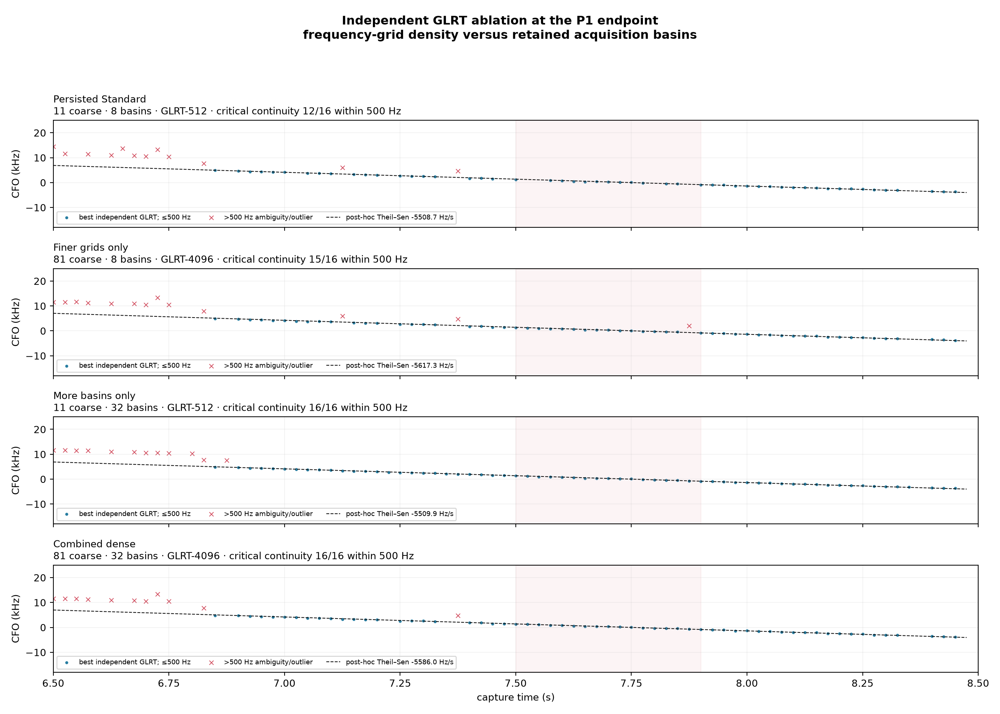

# Dense independent GLRT audit of the T1 endpoint

Capture: `cap-20260821T201522-841b2a20e151`

Path: `stream-0/RX1` (`rx_lnb_b`, upper Starlink edge)

Analyzed interval: 0–27.25 s

## Result

The original GLRT search limits are **partly responsible for the apparent local
discontinuity**, but replay did not erase the signal. The signal is present in
independently searched raw-IQ probes through the end of P1. Expanding the retained
acquisition inventory removes four approximately 227 kHz ambiguity jumps in the
critical 7.5–7.9 s interval and produces a continuous best-candidate line in all
16 probes.

The larger effect comes from retaining and scoring more acquisition basins, not
from frequency-grid refinement alone:

| Independent search | Critical probes within 500 Hz of local line | Median residual | Maximum residual |
|---|---:|---:|---:|
| Persisted Standard: 11 coarse CFO hypotheses, 8 basins, GLRT-512 | 12/16 | 93.4 Hz | 227.5 kHz |
| Finer grids only: 81 coarse hypotheses, 8 basins, GLRT-4096 | 15/16 | 108.1 Hz | 2.66 kHz |
| More basins only: 11 coarse hypotheses, 32 basins, GLRT-512 | **16/16** | **44.8 Hz** | **311 Hz** |
| Combined dense: 81 coarse hypotheses, 32 basins, GLRT-4096 | **16/16** | 60.6 Hz | 235 Hz |

This points to a candidate-inventory/ambiguity-selection problem. Finer frequency
sampling helps, but the eight-basin cap and broad basin-separation policy are the
stronger failure mode at this boundary.

## What “independent” means here

Every 20 ms IQ probe performs a fresh acquisition over the complete −400 to
+400 kHz baseband CFO range. No adjacent probe, trajectory, TLE prediction, or
expected CFO line enters candidate generation, ranking, or GLRT scoring. The
straight line in the figures is fitted only afterward for visualization and
continuity counting.

This confirms that the existing Standard first scan was also conceptually
independent per probe. The later failure occurred when a single polynomial member
was selected from the raw trajectory family and seed-preserving de-aliasing could
not import the sibling observations. The bounded first-stage candidate inventory
made that later selection less robust.

## Search configuration

| Parameter | Persisted Standard for this capture | Combined dense rerun |
|---|---:|---:|
| Probe duration / spacing | 20 ms / 25 ms | 20 ms / 25 ms |
| CFO domain | ±400 kHz | ±400 kHz |
| Coarse CFO grid | 80 kHz; 11 hypotheses | 10 kHz; 81 hypotheses |
| Fine CFO spacing | 500 Hz | 100 Hz |
| Conditioned CFO spacing | 100 Hz | 25 Hz |
| Retained and scored basins | 8 | 32 |
| Candidate CFO separation | 80 kHz | 10 kHz |
| Candidate epoch separation | 20 samples | 5 samples |
| GLRT residual grid | 512 points; 443.9 Hz | 4096 points; 55.5 Hz |

The combined run searched 1,090 independent probes and retained all 34,880
requested candidates. Runtime was 657.9 s with eight workers.

## Full T1 picture

Across the full interval, the dense and persisted strongest GLRT CFOs agree within
500 Hz for 917/1,090 probes. Their median absolute difference is 63.3 Hz. Dense
search increases the count of probes whose best exact-minus-control margin is at
least 0.05 from 908 to 922. Thus the original search was already accurate for most
probes; the important improvement is eliminating sparse ambiguity jumps and
retaining alternate basins for later association.

## P1 endpoint

In 7.5–7.9 s, all 16 dense best candidates are within 500 Hz of the post-hoc local
Theil–Sen line, with a 60.6 Hz median absolute residual. The persisted strongest
candidates are continuous in 12/16 probes; the other four select a different
approximately one-symbol-rate ambiguity. The paired median CFO change is only
91.0 Hz because the other twelve probes were already correct.

The local independent rate is approximately −5.59 kHz/s. It is a local straight
line fit, not a curved radio model and not yet a satellite identity.

## Artifacts

- Summary metrics: `dense-independent-glrt-summary.json`
- Complete per-probe candidate inventory: `dense-independent-glrt-candidates.jsonl.gz`
- Hyperparameter ablation: `dense-independent-glrt-ablation.json`
- Reproduction tool: `tools/rerun_dense_independent_glrt.py`

All outputs are candidate-only. No payload was decoded, no new RF was collected,
and the source recording remained read-only.
