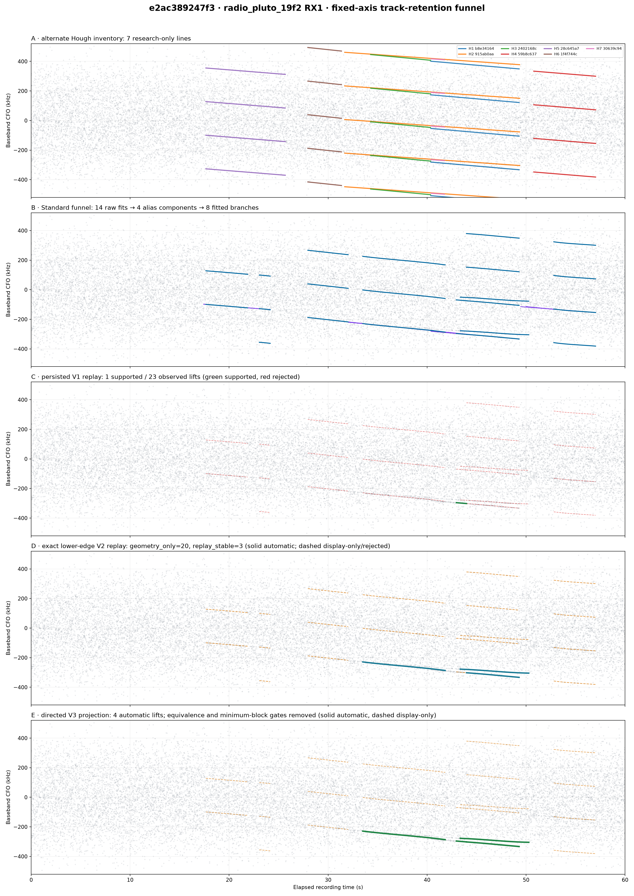
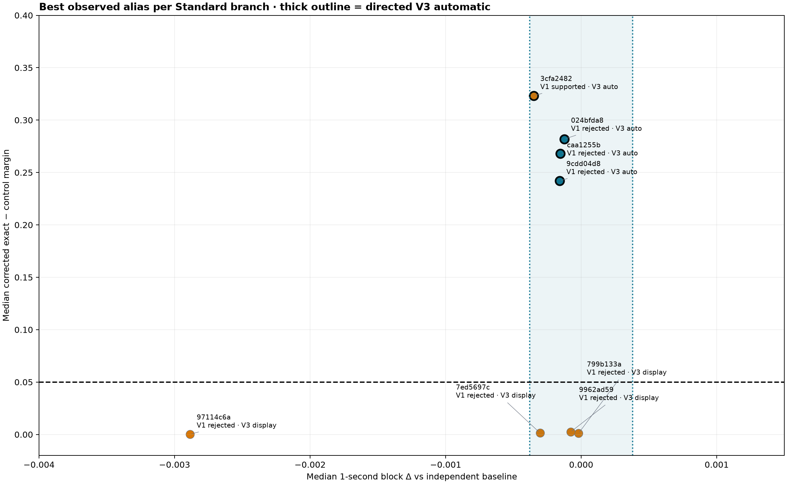

# e2ac389247f3 track-retention investigation

Date: 2026-08-21 UTC

Capture: `cap-20260821T024252-e2ac389247f3`

Investigated path: `radio_pluto_19f2`, `stream-1`, RX1

Scope digest: `sha256:8f6e1c5d82ca9d626d8bb2d2b8048c6d5de5569ea64de3285bc362f67bae0535`

## Executive result

The visually strong lines did **not** disappear because the 64-branch publication cap removed real multi-probe paths. This capture produced 523 association paths, but all 459 omitted paths were singletons. The 64 published paths retained every one of the 232 association edges and all 11 non-singleton paths. Eight branches had enough support to fit.

The apparent loss has two separate causes:

1. The alternate Hough plot is an independent, research-only geometric inventory. It publishes seven lines with `automatic_use_allowed=false`; those lines are not inputs to the Standard replay/final-selection path. Six of the seven geometrically correspond to one or more fitted Standard branches. H7 has no Standard branch within the 2.5 kHz residual gate and therefore never enters Standard replay.
2. Persisted V1 replay kept only one of 23 observed CFO lifts. It rejected three other branches that have strong exact lower-edge pilot/control separation because fewer than half of their individual probes improved over the independent baseline. A blockwise V2 same-IQ replay retains three of those branches. Under the user-directed V3 policy—remove the replay-equivalence and minimum-one-second-block gates while preserving geometry, probe/coverage, corrected-margin, and harmful-tail gates—all four strong branches are automatic.

This is therefore primarily a **replay-policy and product-lineage visibility problem**, not evidence that 64 physical signals were present and not an association-cap failure for this sample.

## Authority and provenance

| Field | Value |
|---|---|
| Sealed run | `capture-651db511cf2149548feee818f0ebf945` |
| Pipeline release | `1aa1e795e8af9730a35e80ee4045732e35c9e3bf` |
| Local recording root | `/srv/bulk/leo` |
| Sealed analysis root | `/srv/bulk/leo/analysis/cap-20260821T024252-e2ac389247f3/capture-651db511cf2149548feee818f0ebf945` |
| Capture duration / sample rate | 60 s / 2.5 Msps |
| Radio setup | manual gain, 30 dB |
| Authoritative pilot edge | lower, from `tuning:stream-1:ch3:lower` |
| Negative control | the same IQ replayed with the wrong upper-edge pilot |
| Mutation scope | none; all sealed products and IQ were read only, and replay output was written to `/tmp` before selected evidence was copied into this report |

The authoritative tuning metadata is important. Replaying the same path with the wrong upper-edge sequence produced zero automatic V2 rows and zero rows that would be automatic under directed V3. Its largest corrected margin was 0.001671, far below the retained 0.05 absolute-evidence gate.

## Candidate funnel

| Stage | Count | What happened |
|---|---:|---|
| Independent GLRT64 probes | 2,400 | Two 20 ms probes per 50 ms interval across 60 s |
| Raw GLRT64 candidates | 19,200 | Eight CFO candidates per probe, spanning about -506 to +503 kHz |
| Raw fitted trajectories / families | 14 / 4 | Pre-de-alias trajectory fit |
| Alias representatives / components | 4 / 4 | Canonicalized by known ambiguity spacing |
| Canonical observations | 755 | Association input |
| Source association paths | 523 | 1942 accepted edge decisions among 15,483 decisions |
| Published association paths | 64 | 459 paths omitted by the bounded contract |
| Non-singleton published paths | 11 | Support sizes: 2, 2, 4, 6, 12, 20, 22, 25, 46, 49, 55 |
| Fitted Standard branches | 8 | The fitter requires at least five observations |
| Observed CFO lifts | 23 | Alias alternatives presented to replay |
| Persisted V1 supported/final | 1 / 1 | Only `3cfa2482`, alias 0 |
| Measured V2 automatic | 3 | `024bfda8`, `9cdd04d8`, and `caa1255b`, all alias 0 |
| Directed V3 automatic | 4 | The three above plus short, strong `3cfa2482`, alias 0 |

Association rejected 8,783 candidate edges by frequency, 3,256 by acceleration, and 1,502 by slope. The accepted count was 1,942.

### Why the 64 cap is innocent here

For a set of disjoint paths, a path of support `n` contains `n - 1` selected edges. The source association graph reports:

```text
source path edges = source observations - source paths
                  = 755 - 523
                  = 232

published path edges = sum(published support - 1)
                     = 232
```

Because the published set contains every selected path edge, every omitted path necessarily has support one. Raising 64 would display more isolated points but would not restore another line in this recording.

## Fixed-axis visual audit

All five panels below use exactly 0–60 s and -520–+520 kHz. The gray points are the same 19,200 independent GLRT64 CFO candidates in every panel.



The panels deliberately keep distinct contracts distinct:

- A shows the seven research-only Hough lines, including their ambiguity lifts.
- B shows the Standard raw and de-aliased fitted geometry.
- C shows persisted V1 replay, where red dashed lifts failed V1.
- D shows measured exact lower-edge V2 replay; solid rows are automatic and dashed rows are display-only.
- E projects the directed V3 policy onto the measured V2 block evidence; four green lifts are automatic and the remaining geometry stays visible but cannot drive correction.

## Exact replay evidence

The following table selects the best observed alias for each fitted Standard branch. `V1 improved` is a per-probe count. V2 values are medians over one-second blocks. All eight rows had full eligible-block coverage and zero harmful blocks; that alone does not establish pilot evidence.

| Branch | Obs / span | Probes | V1 improved | V1 | Blocks | V2 median delta | Corrected exact-control | V2 | Directed V3 |
|---|---:|---:|---:|---|---:|---:|---:|---|---|
| `024bfda8` | 49 / 5.325 s | 214 | 91 (42.52%) | rejected | 7/7 | -0.000125 | 0.281827 | stable, automatic | automatic |
| `3cfa2482` | 20 / 1.025 s | 42 | 26 (61.90%) | supported | 2/2 | -0.000351 | 0.323257 | geometry-only: minimum three-block gate | automatic |
| `9cdd04d8` | 55 / 8.325 s | 334 | 152 (45.51%) | rejected | 9/9 | -0.000158 | 0.242062 | stable, automatic | automatic |
| `caa1255b` | 46 / 6.925 s | 278 | 126 (45.32%) | rejected | 8/8 | -0.000154 | 0.267909 | stable, automatic | automatic |
| `799b133a` | 12 / 4.075 s | 164 | 78 (47.56%) | rejected | 6/6 | -0.000020 | 0.001018 | geometry-only | display-only |
| `7ed5697c` | 22 / 4.225 s | 170 | 81 (47.65%) | rejected | 5/5 | -0.000304 | 0.001503 | geometry-only | display-only |
| `97114c6a` | 6 / 1.100 s | 45 | 25 (55.56%) | rejected | 2/2 | -0.002886 | 0.000182 | geometry-only | display-only |
| `9962ad59` | 25 / 4.225 s | 170 | 81 (47.65%) | rejected | 6/6 | -0.000078 | 0.002407 | geometry-only | display-only |

The four strong rows are separated cleanly from the four geometry-only rows by more than two orders of magnitude in corrected exact-minus-control margin. Removing every gate would be unjustified; retaining the 0.05 corrected-margin gate is what prevents attractive line geometry from becoming an automatic CFO correction without known-pilot support.



The V1 rejection of the three long strong rows is caused by the strict per-probe sign/median-improvement requirement. Their corrected absolute margins are 0.242–0.282 despite slightly negative median deltas relative to independent search. Blockwise V2 correctly treats these as stable rather than demanding that an optimizer initialized near its optimum improve on more than half of individual noisy probes.

`3cfa2482` is the complementary short-track case. It is strong, covers both available blocks, uses 42 probes, and has no harmful tail. V2 classifies it geometry-only solely because it spans two one-second blocks instead of the minimum three. Directed V3 makes it automatic because the user explicitly removed both the minimum-block and replay-equivalence gates; all safety gates listed below still pass.

## Hough-to-Standard correspondence

The matching below evaluates temporal overlap and residual after reducing frequency differences modulo the 2.5 Msps / 11 ambiguity spacing. Matches require at most 2.5 kHz RMS residual.

| Hough line | Time / support / confidence | Matching Standard branch(es) | Result |
|---|---|---|---|
| H1 `b8e34164` | 40.375–49.300 s / 205 / strong geometry | `3cfa2482` (1.025 s, 169 Hz RMS), `024bfda8` (5.325 s, 372 Hz RMS) | One geometric line is split across two Standard branches. Both are directed-V3 automatic. |
| H2 `915ab0aa` | 31.675–49.350 s / 207 / candidate geometry | `caa1255b` (6.000 s, 628 Hz RMS) | Strong exact replay over the Standard segment; directed-V3 automatic. |
| H3 `2402168c` | 34.300–40.350 s / 111 / strong geometry | `9cdd04d8` (6.050 s, 198 Hz RMS) | Strong exact replay; directed-V3 automatic. |
| H4 `59b8c637` | 50.775–57.025 s / 65 / strong geometry | `9962ad59` (4.225 s, 819 Hz RMS) | Visually narrow but corrected margin is only 0.002407; display-only. |
| H5 `28c645a7` | 17.650–25.675 s / 55 / strong geometry | `7ed5697c` (4.225 s, 327 Hz), `97114c6a` (1.100 s, 396 Hz) | Both exact margins are near zero; display-only. |
| H6 `1f4f744c` | 27.950–31.350 s / 20 / strong geometry | `799b133a` (3.400 s overlap, 392 Hz RMS) | Corrected margin is only 0.001018; display-only. |
| H7 `30639c94` | 40.400–41.750 s / 13 / candidate geometry | none | Best overlap is `9cdd04d8`, but 12.7 kHz RMS is outside the gate. It never reaches Standard replay. |

`strong_geometry` is a line-finder statement about support, span, gaps, and residual. It is not a known-pilot claim and does not mean “satellite.” In particular, H4–H6 look persuasive as narrow lines yet fail the exact lower-edge pilot/control separation test. H1 also demonstrates that the alternate and Standard products have different segmentation semantics: it is unsafe to compare counts as if every colored line has a one-to-one final row.

## Policy comparison

| Policy | Automatic lifts | Display-only geometry | Interpretation |
|---|---:|---:|---|
| Persisted V1 | 1 | 0 in the final bank | Three exact-evidence tracks disappear from the final visualization. |
| Measured V2 | 3 | 20 observed lifts | Recovers the three long stable branches; `3cfa2482` is demoted only by the three-block minimum. |
| Directed V3 | 4 | Remaining best geometry per branch | Makes the four exact-evidence branches automatic; keeps weak geometry visible and non-correcting. |
| Wrong-edge V2/V3 control | 0 / 0 | 23 V2 geometry-only lifts | Confirms that the automatic result depends on the lower-edge known-pilot sequence. |

The directed V3 projection is not a newly persisted production product in this report. It applies the requested rule to measured V2 evidence:

```text
automatic = geometry eligible
        AND probe count >= configured minimum
        AND eligible-block coverage >= configured minimum
        AND median corrected exact-control margin >= 0.05
        AND harmful-block fraction <= configured maximum
        AND consecutive harmful blocks <= configured maximum
```

It intentionally does **not** require a minimum number of one-second blocks or replay equivalence to the independent baseline.

## Recommendations and tests

1. **Land V3 as an additive final bank/table, not by erasing scientific evidence.** Automatic rows should be the four strong branches above. Publish the best remaining alias per branch as display-only with `correction_eligible=false`. Keep the original de-aliased and replay products unchanged for inspection.
2. **Add a stage-retention ledger to the API and UI.** For every Standard branch and alternate line, show source product, branch/track ID, support, alias, replay tier, automatic/display status, and exact reason for stopping. Label the Hough panel “independent research-only proposals” so it is not read as the upstream input to the final bank.
3. **Test V3 safety on this exact fixture.** Assert four automatic lower-edge lifts (`024bfda8:0`, `3cfa2482:0`, `9cdd04d8:0`, `caa1255b:0`), zero wrong-upper automatic lifts, full coverage, zero harmful tails, and the 0.05 absolute corrected-margin gate. Assert the other four fitted branches remain non-correcting.
4. **Add evidence-aware post-replay stitching.** H1 shows `3cfa2482` and `024bfda8` on the same modulo-frequency line. A later stage may propose a stitched display trajectory only when source branches share an alias component, have compatible endpoint frequency/slope, do not overlap inconsistently, and both pass exact replay. Preserve both source IDs and never let stitching manufacture new evidence.
5. **Let Hough propose replay work, never automatic tracks.** Introduce a versioned adapter that converts an unmatched Hough segment such as H7 into a bounded same-IQ exact-pilot replay proposal. Initially keep this research-only. Promotion must pass the same corrected-margin and harmful-tail gates as Standard geometry.
6. **Do not raise the 64 path cap to fix this sample.** Add a regression asserting that truncation closure preserves all non-singleton paths and selected edges. Report omitted singleton count separately from omitted supported-path count.
7. **Run the same lower/wrong-edge audit across a signal-positive corpus.** The present sample cleanly separates strong and weak rows, but one recording cannot calibrate population-level thresholds or establish satellite identity.

Suggested component tests:

- V3 eligibility: two fully covered blocks and 42 probes may pass when corrected margin and harmful-tail gates pass; replay-equivalence is irrelevant.
- V3 negative gates: insufficient probes, insufficient coverage, corrected margin below 0.05, excessive harmful fraction, or excessive harmful run each independently prevents automatic correction.
- Association closure: a bounded output may omit singletons, but no selected edge or multi-observation path may be omitted.
- Product lineage: alternate Hough rows are never silently presented as Standard/final rows.
- Hough adapter: unmatched proposals reach exact replay with source digest, edge, parameters, and IQ identity bound; a wrong-edge replay remains non-automatic.
- UI/E2E: automatic tracks use the final-bank visual style; display-only tracks are dashed; the retention reason and source product are visible.

## Reproduction

The sealed source is read-only. The evaluator writes only to the named temporary output directory. The stock evaluator currently evaluates every Standard path in the sealed run, so only the target scope digest above should be interpreted for this path; each radio path must be replayed with its own authoritative edge.

```bash
export PYTHONPATH=src
export MPLCONFIGDIR=/tmp/e2ac389-mpl

python tools/evaluate_glrt64_replay_gate_v2.py \
  --recordings-root /srv/bulk/leo \
  --session-id cap-20260821T024252-e2ac389247f3 \
  --sealed-run-root /srv/bulk/leo/analysis/cap-20260821T024252-e2ac389247f3/capture-651db511cf2149548feee818f0ebf945 \
  --controls config/analysis/glrt64-replay-equivalence-controls-v2.json \
  --output-root /tmp/e2ac389-v2-lower \
  --workers 8 \
  --edge lower

python tools/evaluate_glrt64_replay_gate_v2.py \
  --recordings-root /srv/bulk/leo \
  --session-id cap-20260821T024252-e2ac389247f3 \
  --sealed-run-root /srv/bulk/leo/analysis/cap-20260821T024252-e2ac389247f3/capture-651db511cf2149548feee818f0ebf945 \
  --controls config/analysis/glrt64-replay-equivalence-controls-v2.json \
  --output-root /tmp/e2ac389-v2-upper \
  --workers 8 \
  --edge upper

python tools/summarize_e2ac389_track_loss.py \
  --sealed-run-root /srv/bulk/leo/analysis/cap-20260821T024252-e2ac389247f3/capture-651db511cf2149548feee818f0ebf945 \
  --scope-digest sha256:8f6e1c5d82ca9d626d8bb2d2b8048c6d5de5569ea64de3285bc362f67bae0535 \
  --exact-v2 /tmp/e2ac389-v2-lower/sha256:8f6e1c5d82ca9d626d8bb2d2b8048c6d5de5569ea64de3285bc362f67bae0535/standard.cfo-lift-replay.v2.json \
  --wrong-edge-v2 /tmp/e2ac389-v2-upper/sha256:8f6e1c5d82ca9d626d8bb2d2b8048c6d5de5569ea64de3285bc362f67bae0535/standard.cfo-lift-replay.v2.json \
  --output-root /tmp/e2ac389-report
```

Machine-readable facts, the exact lower-edge V2 result, and the wrong-upper negative control are archived beside the figures:

- [`facts.json`](figures/2026_08_21_e2ac389247f3_track_loss/facts.json)
- [`exact lower-edge replay`](figures/2026_08_21_e2ac389247f3_track_loss/exact-lower/standard.cfo-lift-replay.v2.json)
- [`wrong upper-edge replay`](figures/2026_08_21_e2ac389247f3_track_loss/wrong-upper/standard.cfo-lift-replay.v2.json)

## Limitations

This is candidate-only known-pilot/CFO evidence. It does not identify a spacecraft, prove that each geometric line is a distinct transmitter, or convert Hough confidence into physical truth. The V3 panel is an explicitly labeled policy projection over measured replay evidence, not a claim that V3 was already persisted by release `1aa1e795`.
