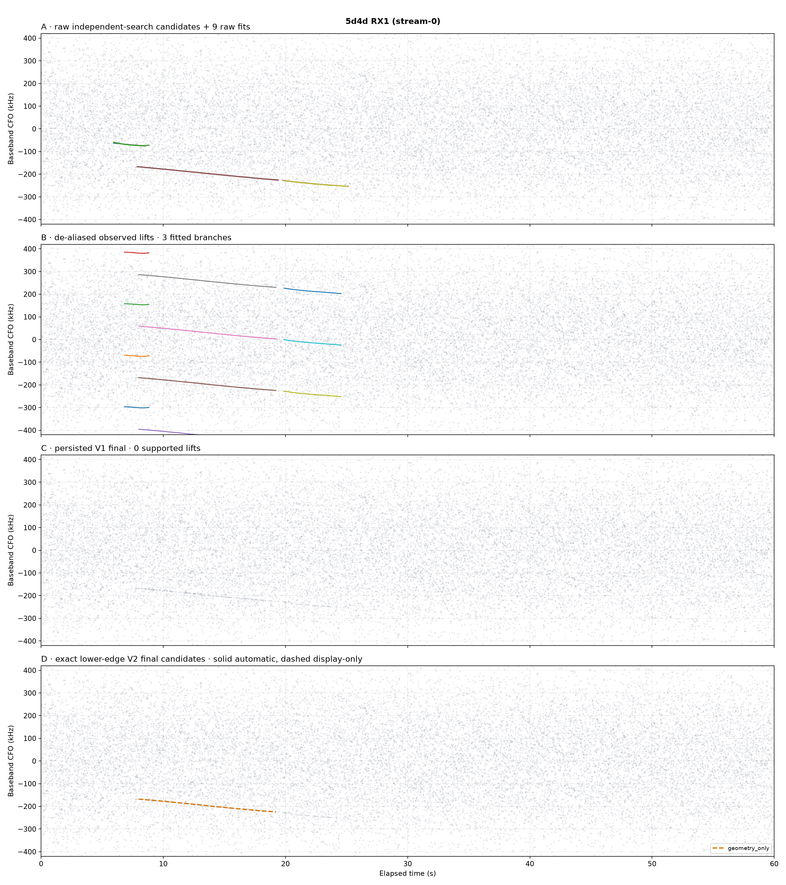
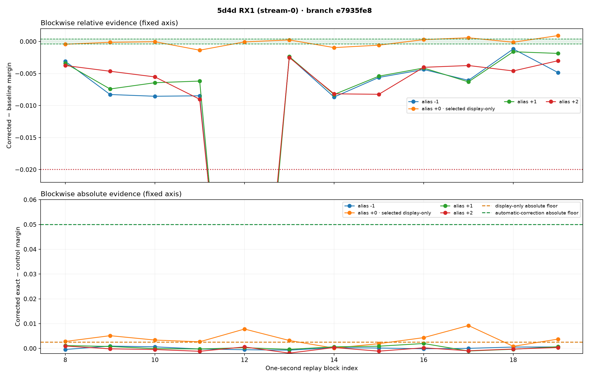

# Recovery of `e7935fe8` in `cap-20260821T013440-8065b3e24a75`

## Outcome

Branch `e7935fe8` was not lost during detection, association, de-aliasing, or polynomial
fitting. It survived all of those stages as a well-populated candidate, but the persisted
V1 replay gate rejected every absolute CFO lift. The final V1 bank was consequently
empty.

The production fix keeps the scientifically distinct decisions separate:

- `e7935fe8`, alias 0 is retained in the V2 final **candidate/display inventory**;
- it remains `geometry_only` and `automatic_correction_eligible=false` because its
  absolute replay evidence is only `0.003310`, below the unchanged `0.05` automatic
  correction threshold;
- aliases -1, +1, and +2 are not retained because their absolute evidence is below the
  display floor and each contains a harmful block;
- no geometry-only row reaches the aggregate cross-path correction report.

This is the smallest truthful recovery: the strong, stable-looking geometry no longer
disappears from the final artifact or UI, while weak evidence is not mislabeled as safe
to correct IQ. The raw, unmerged, de-aliased, and replay evidence products remain
separate and inspectable.

## Authority and exact input

| Fact | Authoritative value |
|---|---|
| Session | `cap-20260821T013440-8065b3e24a75` |
| Sealed run | `capture-f82a8ff488fb4f77badd75f8de0ba664` |
| Input manifest | `sha256:327228c6b4e04943692d97422ec97880c0e4dcb724148bbfe938d8fabb99545f` |
| Path scope | `sha256:1bab4baa1e120ed113832058b298daede183438abb3970ae54414a5ef18b3b7d` |
| Path | `stream-0`, `radio_pluto_5d4d`, RX1 |
| Manifest tuning tag | `tuning:stream-0:ch1:lower` |
| Applied center / bandwidth / sample rate | 959,687,498 Hz / 2.5 MHz / 2.5 MS/s |
| Applied gain | manual, 30 dB on RX0 and RX1 |
| Branch | `sha256:e7935fe88db67f1be3859c581ad0787175954bdc151c1c74ca6270d96583a37b` |

The capture profile's descriptive name is not used as edge authority. The manifest's
per-stream tuning tag says channel 1 lower, and the exact replay uses the lower-edge pilot
template. The recording is committed and contains the full 150,000,000 samples on the
stream. Investigation and replay were read-only; no catalog, service, live database, or
QNAP state was modified.

## Full funnel

| Stage | Persisted result | `e7935fe8` result |
|---|---:|---|
| Probe schedule | 2,400 / 2,400 probes | complete source inventory |
| Independent GLRT64 candidates | 19,200 | candidate points feed raw fitting |
| Raw trajectory fits | 9 | survives into canonical association |
| Alias representatives / components | 3 / 3 | resolved component |
| Canonical observations | 338 | 82 retained observations |
| Association branches | 221 source / 64 retained / 157 truncated | branch is among retained 64 |
| Fitted canonical branches | 3 | selected cubic model |
| Observed replay lifts | 11 | aliases -1, 0, +1, +2 |
| Persisted V1 supported / final | 0 / 0 | all four lifts rejected |
| Exact V3-policy final candidate / automatic | 1 / 0 | alias 0 display-only; no correction |

The large association truncation remains an upstream recall limitation for branches that
never reach fitting. It is not the cause of this disappearance: `e7935fe8` is present in
the de-aliased fitted bank and in every replay inventory.

## Geometry that reached replay

The selected model has 82 observations from 8.000 to 19.225 seconds. Its maximum
observation gap is 0.875 seconds. The selected cubic is the BIC minimum:

```text
reference time t0 = 8.000 s
CFO(t) = 16.7844028145 (t-t0)^3
       - 255.294018515 (t-t0)^2
       - 4256.94705198 (t-t0)
       - 168092.656364 Hz
```

| Metric | Value |
|---|---:|
| BIC | 998.079590 |
| Residual RMS | 394.796 Hz |
| Maximum absolute residual | 986.276 Hz |
| Geometry RMS limit | 2,500 Hz |
| Geometry maximum-residual limit | 8,000 Hz |

This is credible candidate geometry. It is not, by itself, a Starlink attribution or a
claim that replay correction improves detection.

## Exact replay evidence and root cause

V1 required all of the following on individual probes: enough probes, at least half with
positive corrected-minus-baseline delta, a strictly positive median delta, and corrected
exact-minus-control margin at least `0.05`.

For alias 0, V1 measured 450 probes, only 215 positive deltas (47.78%), median delta
`-0.0001158`, and corrected margin `0.003473`. It therefore failed both relative-sign
conditions and the absolute correction threshold. That explains the empty final bank.

V3 reduces correlated probes to one-second block medians and records geometry, replay
coverage, relative delta, absolute evidence, and harmful-tail behavior separately. The
relative delta is audit evidence only: it does not decide automatic eligibility.
The exact same-IQ replay produced:

| Alias | Blocks / coverage | Median block delta | Median corrected margin | Harmful blocks | Final disposition |
|---:|---:|---:|---:|---:|---|
| -1 | 12 / 1.00 | -0.005837 | 0.000114 | 1 | omit |
| **0** | **12 / 1.00** | **-0.000084995** | **0.003310** | **0** | **retain display-only** |
| +1 | 12 / 1.00 | -0.005793 | 0.000490 | 1 | omit |
| +2 | 12 / 1.00 | -0.004620 | -0.000183 | 1 | omit |

Alias 0 has zero harmful blocks. It is above the explicit display-only
absolute floor of `0.0025`, but far below the unchanged automatic-correction floor of
`0.05`. The correct label is therefore `geometry_only`, not correction-safe. V3 does not
ask whether corrected and baseline responses are equivalent.

## Selection policy implemented

| Decision | Required evidence | Consequence |
|---|---|---|
| Automatic correction | credible geometry; adequate probes and coverage; corrected margin ≥0.05; harmful-tail guard passes | retain every qualifying observed lift and permit correction |
| Display-only fallback | branch has no automatic lift; `geometry_only`; adequate probes/coverage; zero harmful blocks and run; corrected margin ≥0.0025 | retain at most one alias, explicitly nonautomatic |
| Fallback ranking | highest corrected absolute evidence, then smallest absolute alias, signed alias, model digest | deterministic one-alias closure |
| Global bound | automatic rows before display-only rows, then corrected evidence, coverage, support, digest | a weaker digest cannot truncate a correction-eligible row |
| Rejected / harmful / weak | any fallback condition fails | preserve replay row, omit from final candidate bank |

The `0.0025` display-only evidence floor is an explicit, digest-bound
`FinalTrajectorySelectionConfigV1` field. It is not part of `ReplayGateConfigV3`, is not
derived from the `0.05` correction floor, and is not
an implicit magic ratio. Boundary tests reject `0.001` and `0.00249`, accept exactly
`0.0025`, and recover the measured `0.003310` case. It is intentionally display-only and
does not weaken any correction gate.

There is no minimum one-second block-count gate in V3. One-second block summaries remain
in the artifact for audit and harmful-tail protection, but a short track can pass with a
single covered block when it has at least 20 probes, credible geometry, absolute corrected
margin at least `0.05`, and no harmful tail. Likewise, a non-harmful negative replay delta
does not reject otherwise strong absolute evidence.

## Before and after

Every panel below uses the same fixed 0–60 s and -420 to +420 kHz axes. Gray points are
the persisted independent-search GLRT64 CFO candidates. Panel C is the exact historical
V1 final output; panel D is the new V2 final candidate bank. The dashed orange curve is
`e7935fe8` alias 0 and is deliberately not correction-eligible.



The next figure fixes the relative-evidence axis at -0.022 to +0.002 and the absolute
axis at -0.002 to +0.06. It shows why alias 0 is retained and the orange aliases outside
the central track are not. The green band is calibrated relative equivalence; the orange
and green horizontal lines are the display-only and automatic absolute floors.



Machine-readable funnel facts and the exact historical V2 evidence contracts are archived
beside the figures. V2 remains decodable byte-for-byte; production advances additively to
V3 rather than changing that persisted contract:

- [`facts.json`](figures/2026_08_21_e7935fe8_recovery/facts.json)
- [`standard.cfo-lift-replay.v2.json`](figures/2026_08_21_e7935fe8_recovery/exact-lower/sha256:1bab4baa1e120ed113832058b298daede183438abb3970ae54414a5ef18b3b7d/standard.cfo-lift-replay.v2.json)
- [`standard.final-trajectory-bank.v2.json`](figures/2026_08_21_e7935fe8_recovery/exact-lower/sha256:1bab4baa1e120ed113832058b298daede183438abb3970ae54414a5ef18b3b7d/standard.final-trajectory-bank.v2.json)
- [`standard.glrt64-final-trajectory-table.v2.json`](figures/2026_08_21_e7935fe8_recovery/exact-lower/sha256:1bab4baa1e120ed113832058b298daede183438abb3970ae54414a5ef18b3b7d/standard.glrt64-final-trajectory-table.v2.json)

## Production integration

Standard and Research both use the shared receiver runner, so both now produce replay V3,
final-bank V2, and final-table V2 products. Research retains its independent probe geometry;
it does not fork the replay policy.

The detailed final table and PNG expose `replay_tier`,
`automatic_correction_eligible`, block evidence, and the display/correction distinction.
The final PNG uses solid thick lines for automatic correction and dashed lines for
display-only geometry. The web label is now “Final replay-classified CFO candidates.”
The existing aggregate path/radio/paired report contract receives only automatic V2
trajectories through its V1-shaped compatibility projection, so a geometry-only candidate
cannot silently influence cross-radio association or appear correction-supported.

No new orchestration stage or job was added. The path analyzer still publishes the same
number of products; only the replay/final product major schemas and implementation digest
advance.

## Tests and controls

The component suite includes:

- strong absolute automatic tracks, including a one-block short track;
- material non-harmful negative replay delta accepted automatically;
- geometry-only recovery independent of replay equivalence;
- exactly one evidence-ranked fallback from aliases -1, 0, +1, +2;
- display-floor boundaries at 0.001, 0.00249, and 0.0025;
- harmful-block rejection;
- noise, zero-IQ, wrong-edge, wrong-alias, time-shift, and unrelated-IQ named controls,
  none of which can enter the automatic inventory;
- evidence-priority truncation before the final bound;
- persisted V2 decode, V3 codec, application projection, final PNG, and UI labels/flags;
- an exact-corpus marked regression binding the manifest, edge, 82 observations, exact
  block metrics, unique alias-0 fallback, and false correction flag.

Verification completed for this change:

| Check | Result |
|---|---|
| CFO de-alias component tests | 50 passed, including archived exact-evidence policy assertions |
| Focused runner/config/presentation tests | 64 passed |
| Production analyzer and Research slice | 22 passed |
| Additional API/contract/processing slice | 78 passed; 16 PostgreSQL tests could not create isolated schemas with the current role |
| Web component test | 6 passed |
| Web production build | passed |
| Ruff / `git diff --check` | passed |
| Targeted mypy | passed, 10 source files |
| Archived exact lower-edge evidence | V2 artifact decodes unchanged; V3 classification retains e793 as geometry-only |

The same-capture exact-IQ replay was not repeated for V3 because the sealed local session
was not readable by the test process during final verification. V3 changes policy only;
the archived block metrics are the exact same-IQ input to the new decision. Wrong-edge
behavior remains covered by the named control and component red test; the actual alternate
aliases on this exact capture also fail the absolute and harmful-tail controls. This report
does not claim a measured wrong-edge false-positive rate for this one capture.

## Reproduction

These commands read sealed local products/IQ and write only a chosen output directory:

```bash
SESSION=cap-20260821T013440-8065b3e24a75
RUN=/srv/bulk/leo/analysis/$SESSION/capture-f82a8ff488fb4f77badd75f8de0ba664
SCOPE=sha256:1bab4baa1e120ed113832058b298daede183438abb3970ae54414a5ef18b3b7d
BRANCH=sha256:e7935fe88db67f1be3859c581ad0787175954bdc151c1c74ca6270d96583a37b
OUT=/tmp/e793-v2-current

sudo -u leo env PYTHONPATH=src MPLCONFIGDIR=/tmp/e793-mpl \
  .venv/bin/python tools/evaluate_glrt64_replay_gate_v2.py \
  --recordings-root /srv/bulk/leo --session-id "$SESSION" \
  --sealed-run-root "$RUN" \
  --controls config/analysis/glrt64-replay-equivalence-controls-v2.json \
  --output-root "$OUT" --workers 12 --edge lower --scope-digest "$SCOPE"

sudo -u leo env MPLCONFIGDIR=/tmp/e793-mpl \
  .venv/bin/python tools/summarize_cfo_replay_investigation.py \
  --sealed-run-root "$RUN" --exact-v2-root "$OUT" \
  --output-root /tmp/e793-report-assets --scope-digest "$SCOPE" \
  --exact-edge lower --highlight-branch "$BRANCH"
```

## Limitations

- These are candidate-only pilot/CFO observations. No payload was decoded and no source
  or spacecraft identity is claimed.
- Display retention is intentionally broader than correction eligibility. A dashed
  geometry-only track must not be treated as a successful replay correction.
- The explicit `0.0025` display-only floor is conservative relative to the measured
  branch and named red controls, but corpus-scale false-display calibration remains future
  work.
- Association truncation (157 of 221 constructed branches on this path) remains a
  separate upstream recall problem. This fix cannot recover a branch that never reaches
  fitting and replay.
- Existing sealed V1 products are historical evidence and remain unchanged. A new run on
  the new release is required for the UI to serve V2 final artifacts.
