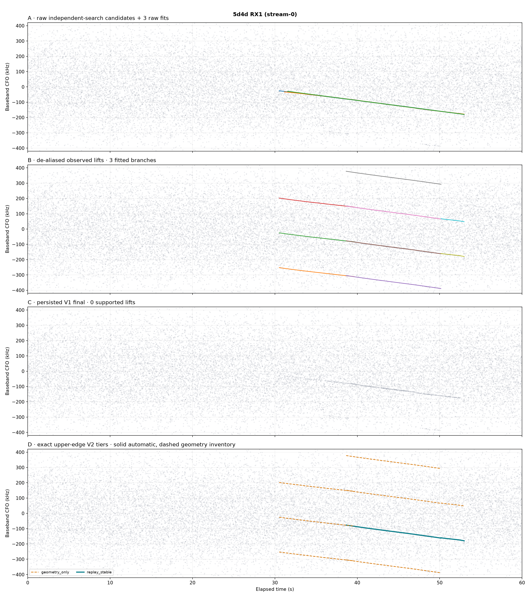
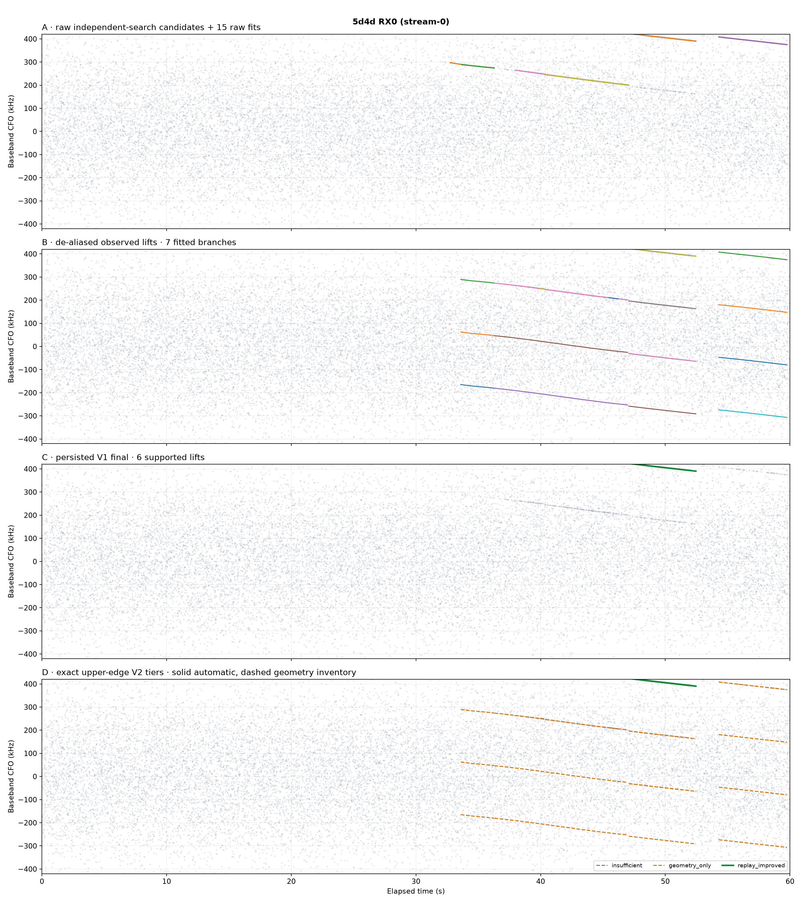
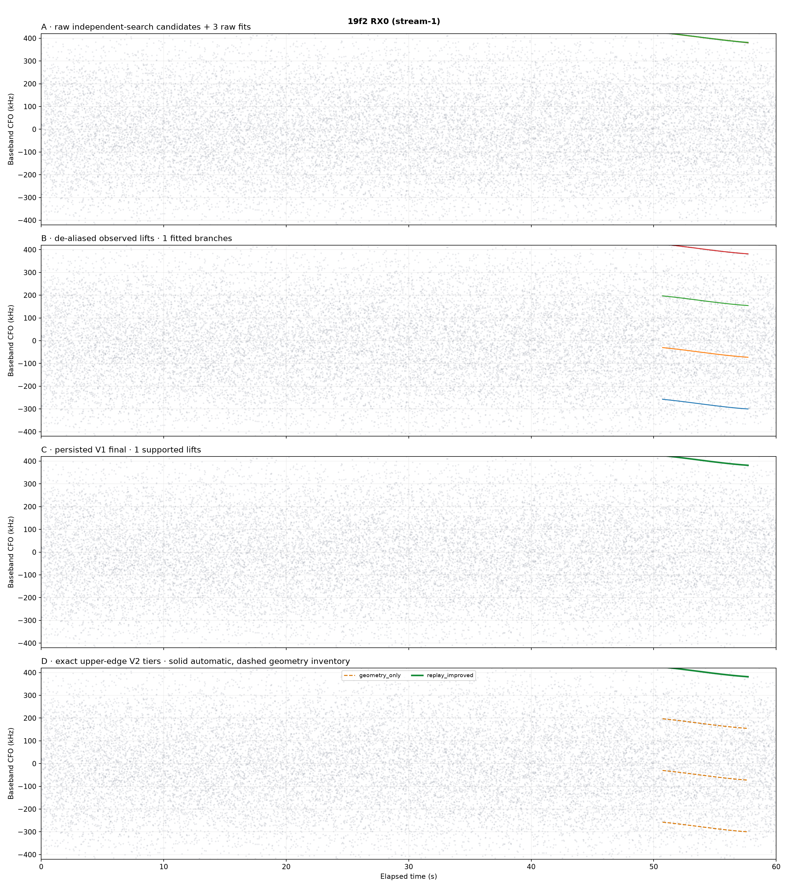
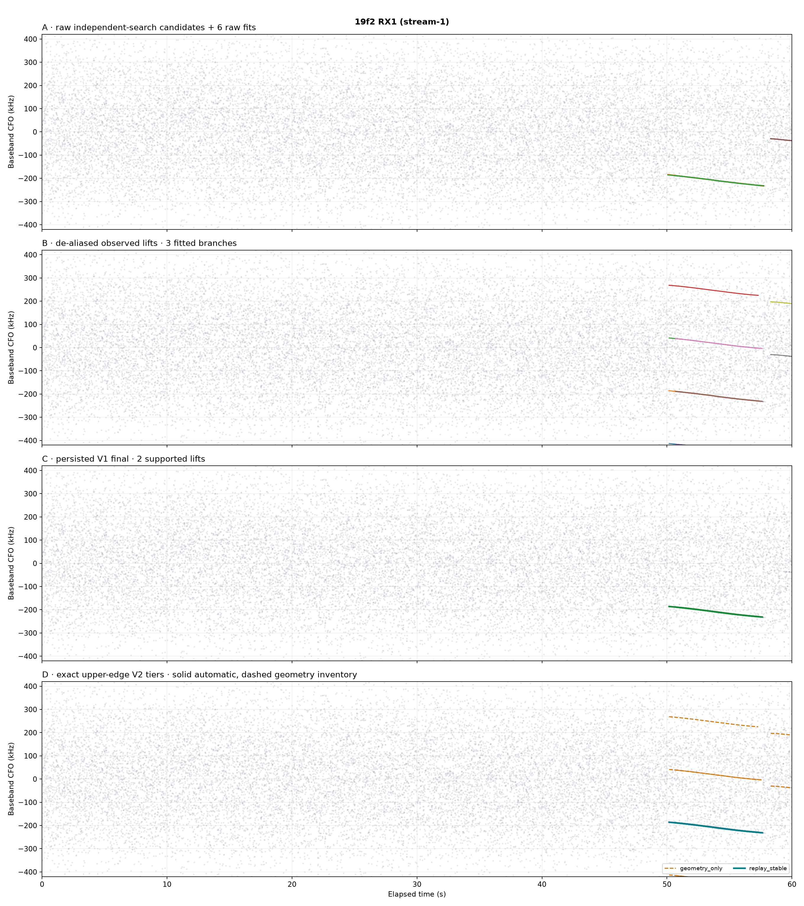
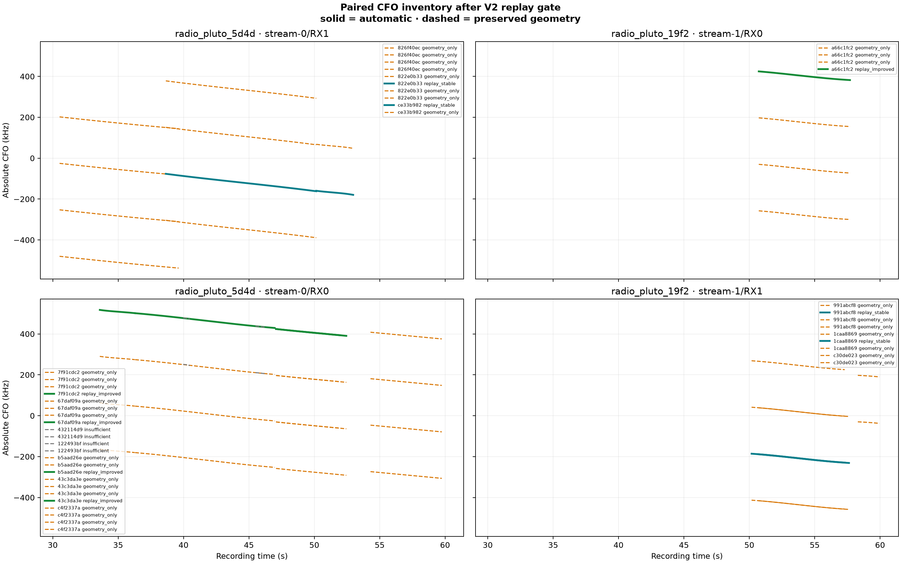

# Replay investigation: `cap-20260821T004323-e975ebaac089`

## Outcome

This is a read-only, candidate-only investigation of one sealed LIVE recording. It does
not change Standard products, catalog state, correction selection, attribution, or live
services.

The authoritative manifest tuning tags select the **upper edge on both streams**:

| Stream | Radio | Channel | Edge authority |
|---|---|---:|---|
| `stream-0` | `radio_pluto_5d4d` | 2 | `tuning:stream-0:ch2:upper` |
| `stream-1` | `radio_pluto_19f2` | 1 | `tuning:stream-1:ch1:upper` |

Those tags override the fallback capture-profile name and its `lower` edge. Replaying the
same candidates with the lower template is therefore a deliberate wrong-edge negative
control, not the correct interpretation of this recording.

The sealed run is
`capture-5468673ca0dd4c6eb5b616e286def64b`, produced by pipeline release
`45eae59cd43e539eb8809048483fbfa1f0bd3f9a`. Every path has the complete
`2,400/2,400` scheduled-probe inventory and `19,200` GLRT64 candidates (eight
candidates per probe). No replay result below is explained by a missing probe.

## Full persisted funnel

| Path | Raw fits | Alias reps/components | Canonical observations | Association edges: accepted / frequency / acceleration / slope rejected | Branches source / retained / truncated | Fitted | V1 lifts / supported / final | Exact V2 tiers |
|---|---:|---:|---:|---:|---:|---:|---:|---:|
| 5d4d RX1 | 3 | 1 / 1 | 643 | 4,204 / 10,347 / 5,620 / 1,542 | 368 / 64 / 304 | 3 | 10 / **0** / **0** | 2 stable, 8 geometry-only |
| 19f2 RX0 | 3 | 1 / 1 | 173 | 555 / 2,274 / 1,097 / 285 | 107 / 64 / 43 | 1 | 4 / 1 / 1 | 1 improved, 3 geometry-only |
| 5d4d RX0 | 15 | 5 / 4 | 848 | 6,045 / 17,964 / 9,622 / 1,636 | 523 / 64 / 459 | 7 | 23 / 6 / 6 | 4 improved, 15 geometry-only, 4 insufficient |
| 19f2 RX1 | 6 | 2 / 2 | 378 | 4,744 / 6,503 / 5,123 / 342 | 180 / 64 / 116 | 3 | 9 / 2 / 2 | 2 stable, 7 geometry-only |

Association is heavily bounded: only the best 64 constructed branches reach fitting on
each path. That creates a real recall risk for fragments outside the retained inventory,
especially on 5d4d RX0 and RX1. It is not, however, the immediate cause of the two strong
5d4d RX1 disappearances: both branches survived association, fit selection, alias
enumeration, and exact-IQ replay.

## Branch-level evidence

These are all exact-upper lifts that V2 would place in its automatic inventory, plus the
two short V1-supported lifts that V2 labels insufficient. `Δ` is corrected trajectory
margin minus the independently optimized per-probe baseline. Coverage is evaluated
one-second blocks over eligible time blocks.

| Path | Branch | Alias | Obs / duration | Degree; BIC Δ | RMS / max residual (Hz) | V1 probes; improved; median Δ; corrected | V1 | V2 blocks / coverage; median Δ; corrected; harmful | V2 |
|---|---|---:|---:|---:|---:|---|---|---|---|
| 5d4d RX1 | `822e0b33` | 0 | 172 / 11.500 s | 3; 0.00 | 753 / 1,898 | 461; 222 (48.16%); −0.0000297; 0.3605 | rejected | 13/13; −0.0000507; 0.3608; 0 | **stable** |
| 5d4d RX1 | `ce33b982` | 0 | 32 / 2.825 s | 3; 0.00 | 173 / 352 | 114; 55 (48.25%); −0.0000952; 0.2853 | rejected | 3/3; −0.00000557; 0.2959; 0 | **stable** |
| 19f2 RX0 | `a66c1fc2` | 0 | 64 / 6.975 s | 3; 0.00 | 442 / 1,167 | 280; 71.43%; +0.00723; 0.3023 | supported | 8/8; +0.01599; 0.3096; 0 | improved |
| 5d4d RX0 | `43c3da3e` | 0 | 82 / 5.375 s | 3; 0.00 | 167 / 518 | 216; 81.02%; +0.09375; 0.6253 | supported | 6/6; +0.11343; 0.6302; 0 | improved |
| 5d4d RX0 | `67daf09a` | 0 | 110 / 10.675 s | 3; 0.00 | 445 / 1,344 | 428; 97.66%; +0.11297; 0.5241 | supported | 11/11; +0.11298; 0.5227; 0 | improved |
| 5d4d RX0 | `7f91cdc2` | **+1** | 9 / 2.675 s | 3; 0.00 | 110 / 181 | 108; 87.04%; +0.25078; 0.2798 | supported | 4/4; +0.23530; 0.3081; 0 | improved |
| 5d4d RX0 | `b5aad26e` | 0 | 73 / 4.900 s | 2; 0.00 | 169 / 423 | 197; 82.74%; +0.10244; 0.6249 | supported | 5/5; +0.14400; 0.6249; 0 | improved |
| 5d4d RX0 | `122493bf` | 0 | 7 / 0.725 s | 1; 0.71 | 108 / 167 | 30; 100%; +0.10504; 0.5920 | supported | only 2 blocks; +0.10255; 0.5906; 0 | insufficient |
| 5d4d RX0 | `432114d9` | 0 | 5 / 0.500 s | 3; 0.00 | 24 / 38 | 21; 100%; +0.10497; 0.4962 | supported | only 2 blocks; +0.29994; 0.5000; 0 | insufficient |
| 19f2 RX1 | `1caa8869` | 0 | 94 / 6.925 s | 3; 0.00 | 510 / 1,453 | 278; 52.52%; +0.0000362; 0.5222 | supported | 8/8; +0.0000506; 0.5318; 0 | stable |
| 19f2 RX1 | `991abcf8` | 0 | 93 / 7.125 s | 3; 0.00 | 550 / 1,428 | 286; 53.50%; +0.0000576; 0.5219 | supported | 8/8; +0.0000515; 0.5206; 0 | stable |

The maximum observation gaps for `822e0b33` and `ce33b982` are only 0.800 s and
0.600 s. Their selected cubic models are the actual BIC minima (not merely within the
`+2` simpler-model tolerance). Fragmentation, gap geometry, BIC simplification, and an
incorrect alias therefore do not explain their replay loss. The `+1` alias on
`7f91cdc2` is an example where alias choice matters and was selected correctly.

## Hypothesis verdicts

| Hypothesis | Measured result | Verdict |
|---|---|---|
| Independently optimized baseline bias | Both lost RX1 branches have strong absolute corrected evidence but only 48.16%/48.25% positive probe deltas and tiny negative medians. Block medians remain within ±0.00038. | **Root cause of the two strong losses.** |
| Edge mismatch | Manifest binding says upper for both streams. Deliberate lower-edge replay yields 0 automatic lifts out of 46; every lower-edge corrected median is below 0.05. | Ruled out. |
| Wrong alias | Both lost branches are strongest at alias 0; alternate aliases fail absolute evidence. | Ruled out for the losses. |
| Fragmentation/gaps | Association truncation is large, but the two visible branches reach fitting with 172/32 observations and sub-second maximum gaps. | Upstream recall risk, not immediate loss. |
| Strict 50% sign gate | Exactly fails at 48.16% and 48.25%; V1 also requires a strictly positive median. | **Immediate rejecting gate.** |
| Weak absolute evidence | Corrected exact-minus-control medians are 0.3605 and 0.2853, versus 0.05 required. | Ruled out. |
| Equivalence epsilon | Lost branch block medians are −0.0000507 and −0.00000557, well inside reviewed ±0.00038. | V2 recovers them as intended. |

## What each gate means

Persisted V1 accepts a lift only when all four conditions pass:

1. at least three replay probes;
2. at least half of individual probes have positive corrected-minus-baseline margin;
3. the median margin delta is strictly positive; and
4. the median corrected exact-minus-control margin is at least `0.05`.

The first two comparisons treat the independently optimized per-probe CFO as though it
were a neutral baseline. It is not: it is a strong local optimizer. A correct smooth
trajectory can therefore have compelling absolute corrected evidence while tying the
baseline within numerical/noise variation. V2 addresses that specific bias by reducing
probes to one-second block medians and classifying improvement, calibrated equivalence,
absolute evidence, harmful tails, and geometry as separate facts.

The frozen V2 equivalence controls contain 24 named block-delta values across noise,
zero-IQ, wrong-edge, wrong-alias, time-shift, and unrelated-IQ classes. Their p95 absolute
delta is `0.00019`; the reviewed `2×` safety factor makes the equivalence tolerance
`0.00038`. The negative-control red tests use corrected margin `0.001`, so every control
remains `geometry_only` through the independent absolute-evidence gate.

## Alternative-gate evaluation

| Candidate rule on this same replay | Automatic inventory | Lost strong RX1 branches recovered | Negative-control implication | Recommendation |
|---|---:|---:|---|---|
| Persisted V1 per-probe sign gates | 9 historical final lifts | 0/2 | Existing historical behavior | Do not retain as the sole replay decision. |
| V2 with epsilon 0 (strict block-median sign) | 7 | 0/2 | Needlessly treats optimizer ties as failures | Reject. |
| V2 with p95 epsilon 0.00019 | 9 | 2/2 | Named null deltas define this boundary without safety factor | Plausible but less conservative than reviewed config. |
| **V2 with reviewed 2× epsilon 0.00038** | **9** | **2/2** | All six named synthetic negative classes remain geometry-only through absolute evidence; wrong-edge same-IQ replay is 0/46 automatic | **Best candidate.** |
| V2 with epsilon 0.001 | 9 | 2/2 | No gain on this recording; broader unmeasured acceptance band | No justification. |
| Remove corrected-margin ≥0.05 | More weak aliases become eligible | 2/2 | The six named red tests use corrected margin 0.001 and would no longer be rejected by the independent absolute gate | Unsafe; reject. |
| Remove harmful-tail guard | No gain: all 9 automatic lifts already have zero harmful blocks | 2/2 | Deletes the guard exercised by the strong-median/harmful-tail red test | Unsafe; reject. |

The sample does not support loosening absolute evidence, geometry, block coverage, or
harmful-tail limits. It supports replacing the biased strict sign comparison with the
already reviewed block-equivalence interpretation, subject to corpus-level validation.

## Figures

All four per-path funnel plots use exactly `0–60 s` and `−420–+420 kHz` on every panel.
Gray points are the complete persisted independent-search GLRT64 candidate inventory.

### 5d4d RX1



### 5d4d RX0



### 19f2 RX0



### 19f2 RX1



### Paired exact-upper V2 summary



The exhaustive machine-readable branch and funnel facts are in
[`facts.json`](figures/2026_08_21_e975ebaac089_replay_investigation/facts.json). The exact
and wrong-edge V2 contract-shaped result documents and V1/V2 comparison tables are kept
under the adjacent `upper/` and `lower/` directories.

## Ranked recommendations

1. Qualify the reviewed V2 gate on a multi-recording positive and explicit negative
   corpus, then propose it as a versioned replacement for V1. This recording is a strong
   green case, not enough evidence by itself for Standard promotion.
2. Keep corrected exact-minus-control margin ≥0.05, harmful-block, geometry, coverage,
   and alias inventories independent and fail-closed. They prevented all 46 deliberate
   wrong-edge lifts and weak alternate aliases from entering the automatic inventory.
3. Add regression greens that reproduce `822e0b33` and `ce33b982`: strong absolute
   evidence, full coverage, no harmful blocks, and optimizer-equivalent slightly negative
   deltas must be stable. Add reds for wrong edge/alias, corrected margin 0.001, >25%
   harmful blocks, three consecutive harmful blocks, fewer than three blocks, and corrupt
   or incomplete replay rows.
4. Separately measure association top-64 recall. The 304/459 branch truncations on 5d4d
   are too large to infer that every visible line reached replay, even though the two
   investigated strong branches did. Do not solve that separate upstream problem by
   weakening replay evidence gates.

## Reproduction

The persisted V1 products are never modified. The following commands write only report
assets under this repository:

```bash
SESSION=cap-20260821T004323-e975ebaac089
RUN=/srv/bulk/leo/analysis/$SESSION/capture-5468673ca0dd4c6eb5b616e286def64b
OUT=reports/figures/2026_08_21_e975ebaac089_replay_investigation

sudo -u leo .venv/bin/python tools/evaluate_glrt64_replay_gate_v2.py \
  --recordings-root /srv/bulk/leo --session-id "$SESSION" \
  --sealed-run-root "$RUN" \
  --controls config/analysis/glrt64-replay-equivalence-controls-v2.json \
  --output-root "$OUT/upper" --workers 8 --edge upper

sudo -u leo .venv/bin/python tools/evaluate_glrt64_replay_gate_v2.py \
  --recordings-root /srv/bulk/leo --session-id "$SESSION" \
  --sealed-run-root "$RUN" \
  --controls config/analysis/glrt64-replay-equivalence-controls-v2.json \
  --output-root "$OUT/lower" --workers 8 --edge lower

sudo -u leo .venv/bin/python tools/summarize_cfo_replay_investigation.py \
  --sealed-run-root "$RUN" --exact-v2-root "$OUT/upper" \
  --wrong-edge-v2-root "$OUT/lower" --output-root "$OUT"
```

## Limitations

- All lines and replay tiers are candidate geometry/evidence only; no payload, spacecraft,
  or source identity is claimed.
- This single positive-looking recording cannot set a false-positive rate or justify
  weakening gates. Alternative-gate recommendations are constrained by the frozen named
  negative controls and require multi-recording red/green qualification.
- V2 results are an offline same-IQ re-evaluation. Persisted V1 products remain the exact
  historical Standard result.
