# Five-dwell strict degree-1-only rerun

This report-only rerun starts from each sealed `standard.pilot-scan` V3 product. Every candidate was scored independently at its probe. A new trajectory bank was fitted with `polynomial_degrees=(1,)`. Persisted raw-family representatives, de-aliased membership, IQ-replay membership, and final tracks were not reused.

**Selected** means a representative of a family built entirely from degree-1 tracks. It is not a newly sealed Standard final product. This bounded rerun does not replay IQ or claim the published de-alias/replay gates, so it never labels these results as after replay.

| Contamination audit of superseded report sections | Count |
|---|---:|
| Former displayed top-three tracks from d3 membership | 15 / 15 |
| Former post-replay tracks from d2 or d3 membership | 47 / 61 |

Those old post-replay results are not inputs to this rerun.

## Observation and RF provenance

| Field | Value |
|---|---|
| Observer latitude | 37.858988° |
| Observer longitude | -122.478103° |
| Observer altitude | -29.0 m |
| LNB model reported for 3 of 4 paths | GEOSATpro UL1PLL |
| LNB local oscillators | 9.75 / 10.6 GHz |
| Per-path physical LNB mapping | Unknown |

Reconstructed RF is tuned IF plus the configured 10.6 GHz high-band LO. For the highlighted first dwell, the two RX1 centers are approximately 11.6903125 and 10.7096875 GHz. That arithmetic does not establish which physical LNB fed each path.

## Cross-capture basin-retention control

A separate capture, `cap-20260821T030352-0b45a2531e70`, tests search mechanics. It is outside this cohort and does not support satellite association. Fixed 8/16/32 is candidate-level and uses no trajectory prior. Alias-edge 6+2 also uses no fitted CFO trajectory.

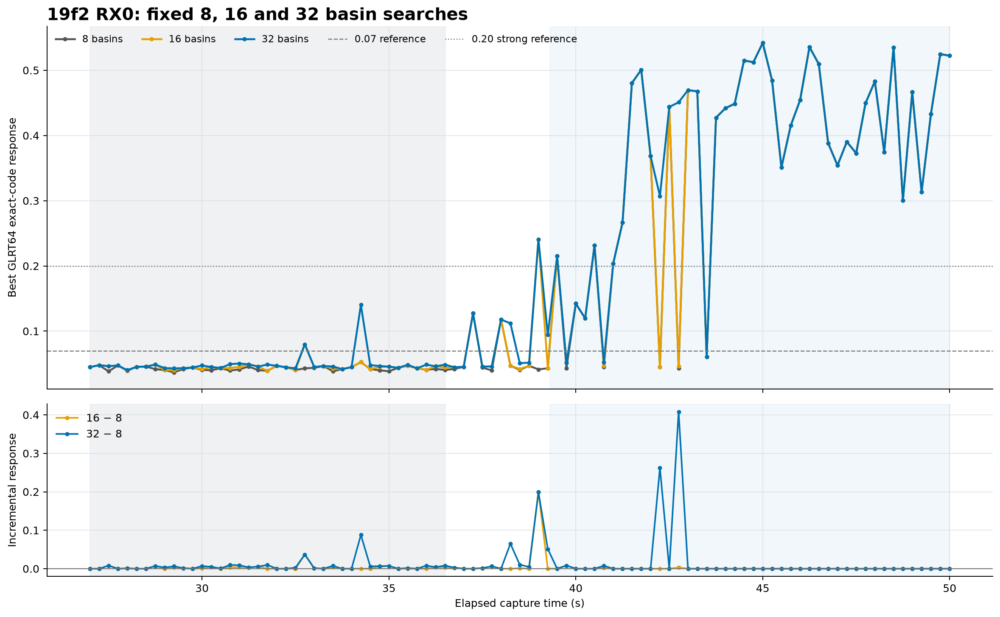

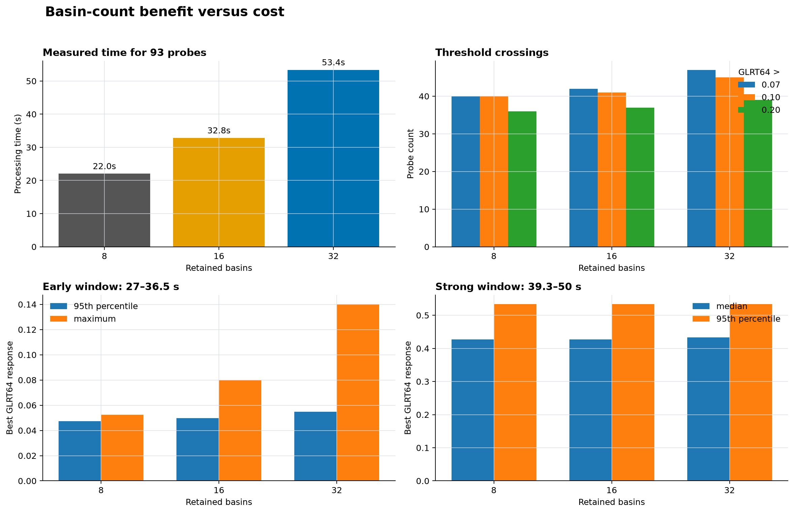

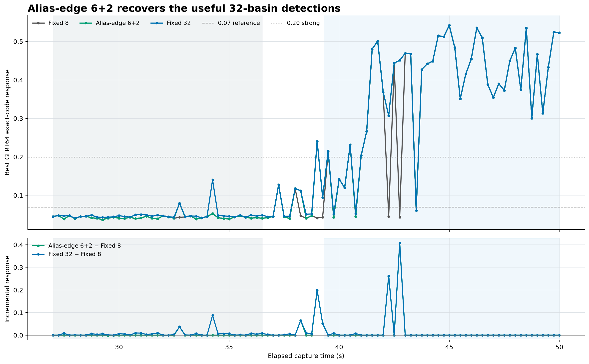

Basin-track-consistency and CFO-guided policy figures are deliberately omitted because those analyses used a quadratic trajectory.

Machine-readable evidence: [five-dwell-d1only-evidence.json](figures/2026_08_21_five_dwell_degree1_only_rerun/five-dwell-d1only-evidence.json)

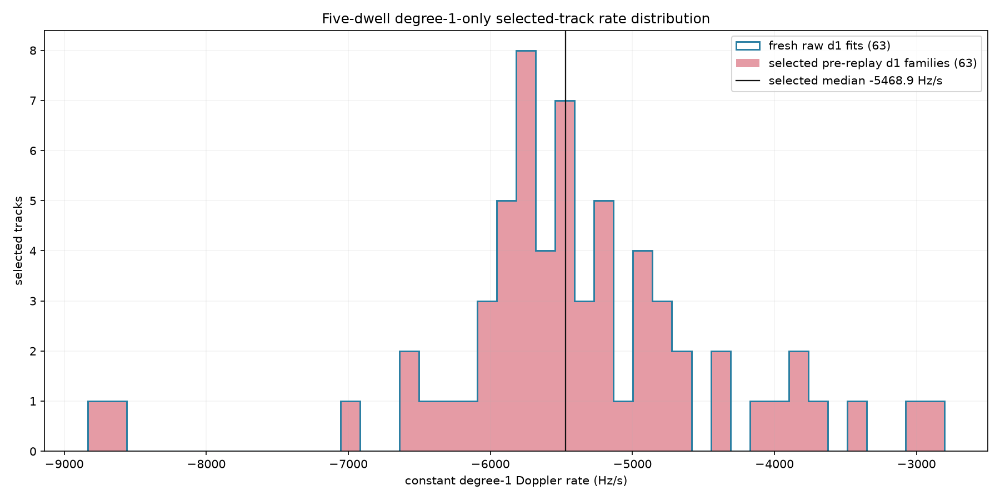

The raw-d1 and selected-pre-replay distributions coincide here: all 63 fresh d1 trajectories formed distinct d1-only families. This is not an after-replay comparison.

## Focused T1 strict-linear association and basin impact

This focused audit starts from the 32 independently scored raw-IQ GLRT candidates at each probe. RANSAC associates at most one candidate per probe, and Huber refits only an intercept and one constant slope. Its breakpoints are selected within disclosed post-hoc windows; none comes from the superseded mixed-order replay membership.

| Piece | Interval | Constant rate | Step entering | Support | Median |residual| |
|---:|---:|---:|---:|---:|---:|
| 1 | 0.000–6.825 s | -4954.6 Hz/s | — | 142/162 | 71.7 Hz |
| 2 | 6.825–13.525 s | -5560.5 Hz/s | -4.98 kHz | 235/237 | 97.9 Hz |
| 3 | 13.525–20.250 s | -6175.2 Hz/s | -4.25 kHz | 260/261 | 23.5 Hz |
| 4 | 20.250–27.250 s | -5886.1 Hz/s | -4.65 kHz | 251/262 | 39.8 Hz |

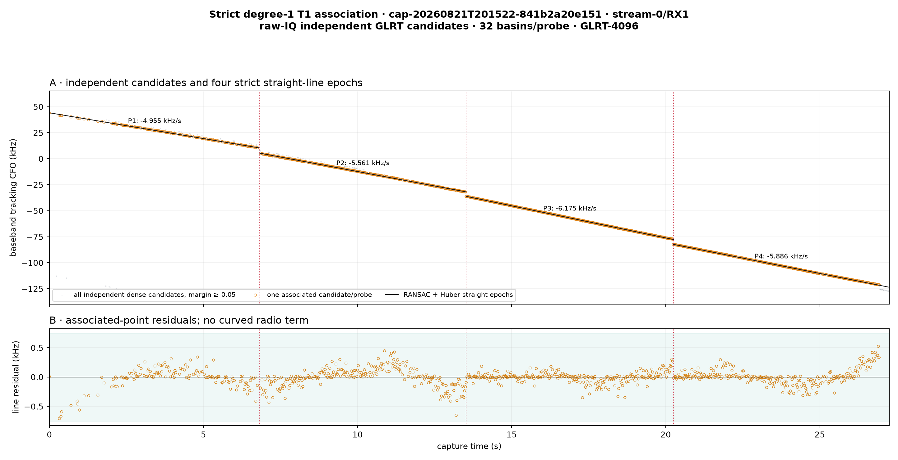

The first supported transition is **6.825 s**. The earlier ≈7.9 s marker was an equal-duration plotting boundary, not a fitted changepoint. The four straight rates are real candidate-level line coherence; they do not establish that all four epochs came from one spacecraft.

### What better basin retention and CFO search change

An acquisition basin is a distinct local timing/CFO maximum for one 20 ms probe. Raising the retained count from 8 to 32 keeps more synchronization alternatives for later straight-line association; it does not add time samples or make adjacent probes dependent. A finer CFO/GLRT grid reduces quantization and refinement error after a useful basin survives.

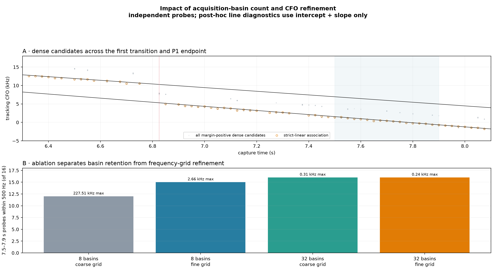

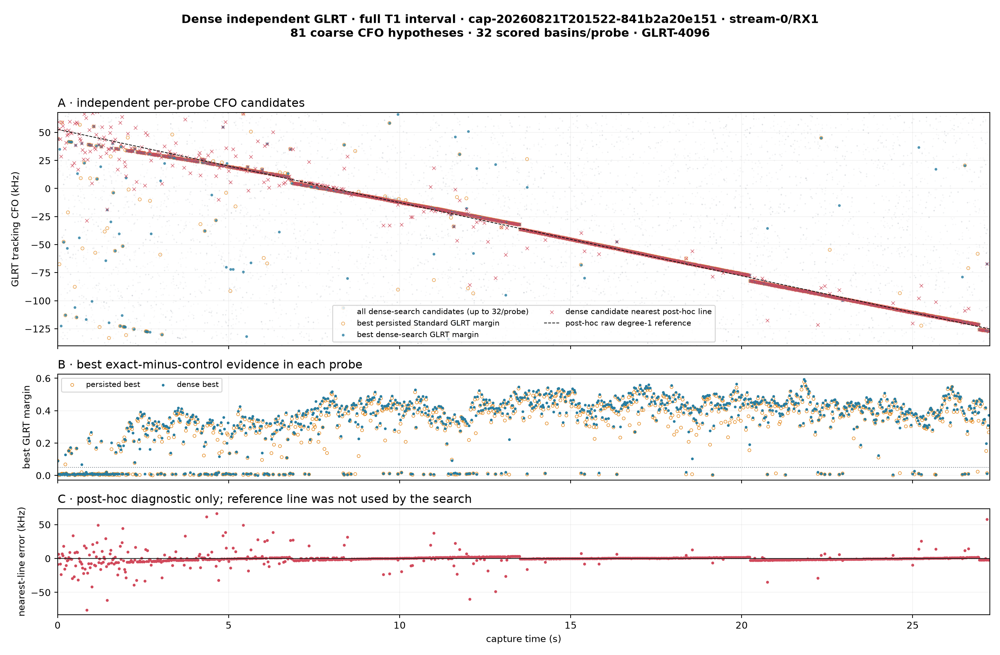

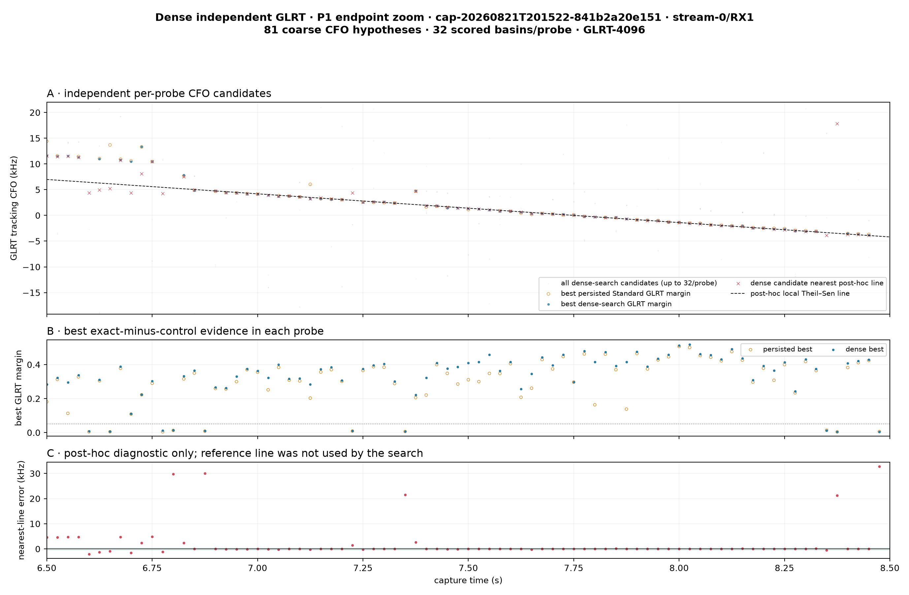

A later raw-IQ one-factor sweep resolves the mechanism more precisely. In 7.5–7.9 s, Standard recovers 13/16 probes from its complete inventory; 32 basins with the original broad separation recovers 14/16; a 10 kHz coarse grid recovers 15/16; and changing only nonmaximum-suppression separation from 80 kHz/20 samples to 10 kHz/5 samples recovers 16/16. Thus candidate-retention geometry—especially separation policy—is the dominant local fix. Basin count alone helps but is not sufficient. See the [full parameter study](2026_08_22_t1_glrt_search_parameter_study.md).

This overturns one narrow interpretation: missing replay markers near the end of the old P1 panel are not evidence that the RF signal vanished or physically stepped there. The independently searched signal branch continues. The old candidate truncation and mixed-order family selection made its membership brittle.

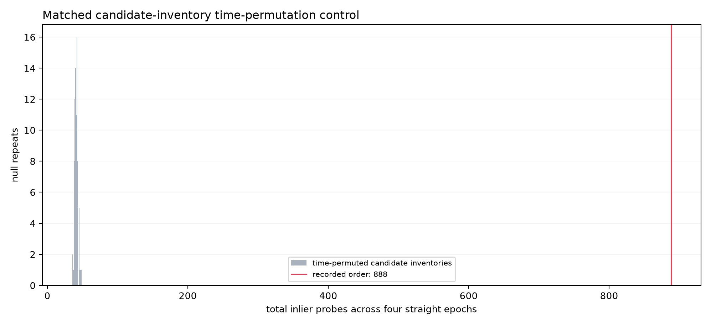

Recorded time order supports **888** probes; the largest of 80 matched time-permutation controls supports **48**. The plus-one p-value is 0.0123. This tests temporal line coherence after searching 32 alternatives, not Starlink attribution; capture selection and breakpoint-window choice remain post hoc.

The published replay is deliberately not compared here because its membership was seeded by a mixed-order family representative. A true after-replay distribution remains pending the separately versioned linear-only pipeline. See the [focused T1 report](2026_08_21_t1_dense_degree1_only.md) for full method details.

## Dwell 1: `cap-20260821T201522-841b2a20e151`

Fresh raw degree-1 tracks: **16**. Selected pre-replay d1 families: **16**.

Capture start: **2026-08-21T20:15:24.015201+00:00**. Space-Track snapshot: **2026-08-21T20:02:09.960326+00:00**, 13.2 minutes before capture. Causal: **yes**.

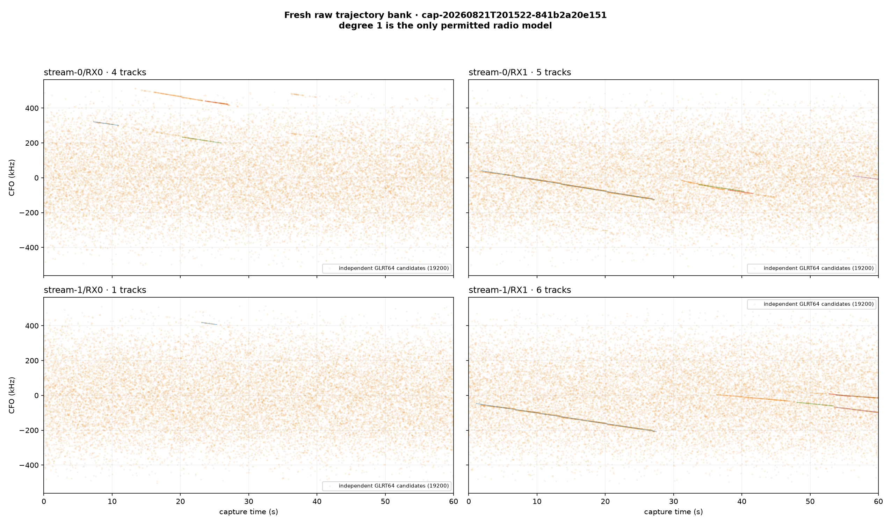

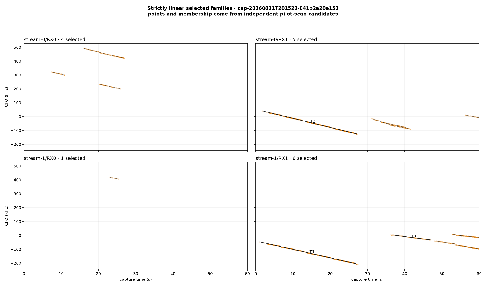

### Top three tracks and top three broad-sky candidates

The satellite candidates use a broader elevation ≥10° legacy scalar-rate screen as a secondary control.

| Track | Sat. rank | Path / RF | Duration | Obs. | Rate | Satellite | Elev. | Predicted | Error | TLE age | True-time rank |
|---|---:|---|---:|---:|---:|---|---:|---:|---:|---:|---:|
| **T1** | 1 | `stream-1/RX1` / 10.7096875 GHz | 26.38 s | 739 | -6093.6 | STARLINK-11412 | 65.6° | -4615.1 | 1478.5 | 4.83 h | 6/41 |
| **T1** | 2 | `stream-1/RX1` / 10.7096875 GHz | 26.38 s | 739 | -6093.6 | STARLINK-30533 | 72.3° | -3665.4 | 2428.2 | 17.40 h | 6/41 |
| **T1** | 3 | `stream-1/RX1` / 10.7096875 GHz | 26.38 s | 739 | -6093.6 | STARLINK-32200 | 69.7° | -3606.8 | 2486.8 | 11.51 h | 6/41 |
| **T2** | 1 | `stream-0/RX1` / 11.6903125 GHz | 25.30 s | 800 | -6527.3 | STARLINK-11412 | 65.7° | -5044.2 | 1483.2 | 4.83 h | 6/41 |
| **T2** | 2 | `stream-0/RX1` / 11.6903125 GHz | 25.30 s | 800 | -6527.3 | STARLINK-30533 | 72.3° | -4005.3 | 2522.1 | 17.40 h | 6/41 |
| **T2** | 3 | `stream-0/RX1` / 11.6903125 GHz | 25.30 s | 800 | -6527.3 | STARLINK-32200 | 69.8° | -3941.5 | 2585.9 | 11.51 h | 6/41 |
| **T3** | 1 | `stream-1/RX1` / 10.7096875 GHz | 10.75 s | 128 | -3472.5 | STARLINK-36506 | 76.5° | -3456.7 | 15.7 | 9.93 h | 8/41 |
| **T3** | 2 | `stream-1/RX1` / 10.7096875 GHz | 10.75 s | 128 | -3472.5 | STARLINK-30277 | 78.8° | -3488.5 | 16.1 | 4.98 h | 8/41 |
| **T3** | 3 | `stream-1/RX1` / 10.7096875 GHz | 10.75 s | 128 | -3472.5 | STARLINK-30533 | 65.8° | -3248.4 | 224.0 | 17.41 h | 8/41 |

### 30° zenith cone during the full capture

Half-angle 30° is equivalent to elevation ≥60°. Intervals are relative to capture start.

| Satellite | NORAD | Peak elevation | Visible interval(s) | TLE age |
|---|---:|---:|---|---:|
| STARLINK-11412 | 63062 | 66.2° | 1.40–37.38 s | 4.83 h |
| STARLINK-30277 | 57645 | 81.3° | 0.00–60.00 s | 4.97 h |
| STARLINK-30379 | 57811 | 63.8° | 0.00–19.67 s | 9.94 h |
| STARLINK-30533 | 58037 | 73.2° | 0.00–51.60 s | 17.40 h |
| STARLINK-32200 | 60258 | 70.6° | 0.00–49.82 s | 11.51 h |
| STARLINK-3312 | 50850 | 62.3° | 0.00–28.80 s | 22.26 h |
| STARLINK-35493 | 65928 | 80.1° | 0.00–25.24 s | 17.41 h |
| STARLINK-36506 | 67414 | 78.8° | 0.00–60.00 s | 9.92 h |
| STARLINK-36526 | 67508 | 66.3° | 39.56–60.00 s | 20.64 h |
| STARLINK-37407 | 69534 | 71.2° | 43.88–60.00 s | 25.55 h |
| STARLINK-5286 | 55294 | 88.1° | 16.10–60.00 s | 5.41 h |
| STARLINK-5451 | 54771 | 62.5° | 20.45–53.02 s | 9.97 h |
| STARLINK-5631 | 55346 | 60.4° | 59.15–60.00 s | 12.83 h |
| STARLINK-5663 | 55347 | 60.5° | 0.00–0.89 s | 5.01 h |
| STARLINK-6218 | 57368 | 81.9° | 29.64–60.00 s | 9.90 h |

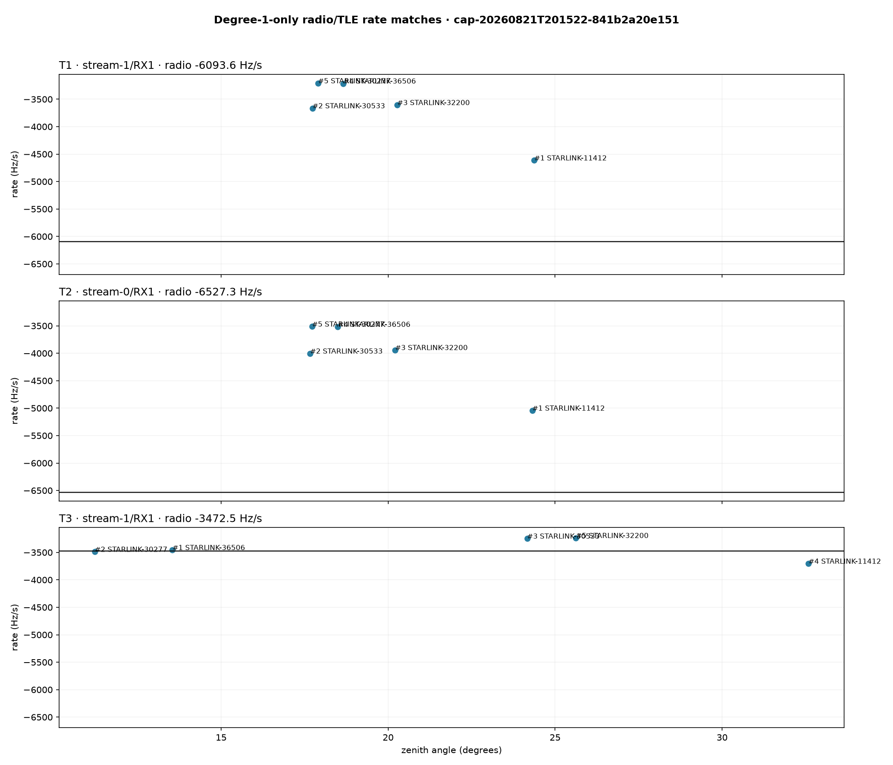

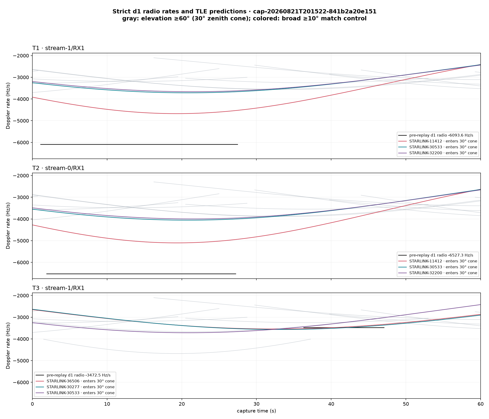

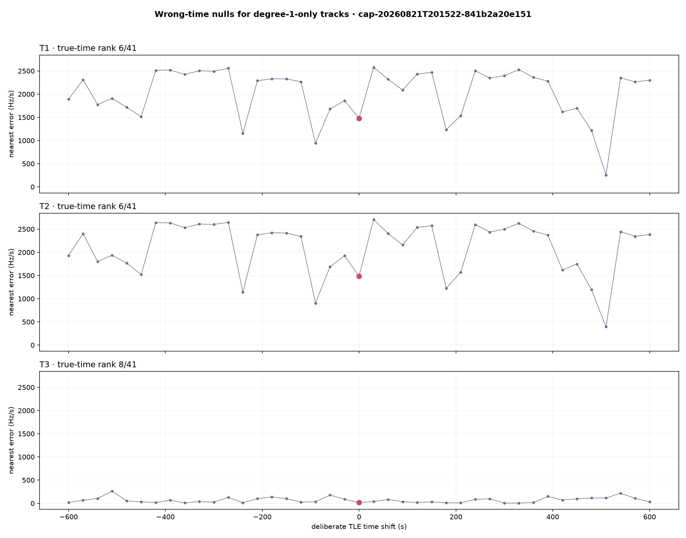

## Dwell 2: `cap-20260821T193701-87f96f47e73f`

Fresh raw degree-1 tracks: **18**. Selected pre-replay d1 families: **18**.

Capture start: **2026-08-21T19:37:03.687769+00:00**. Space-Track snapshot: **2026-08-21T19:01:38.807480+00:00**, 35.4 minutes before capture. Causal: **yes**.

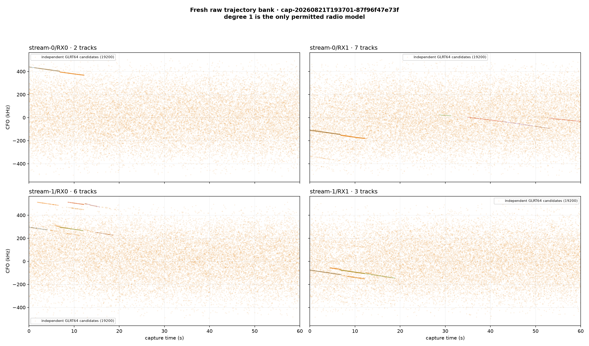

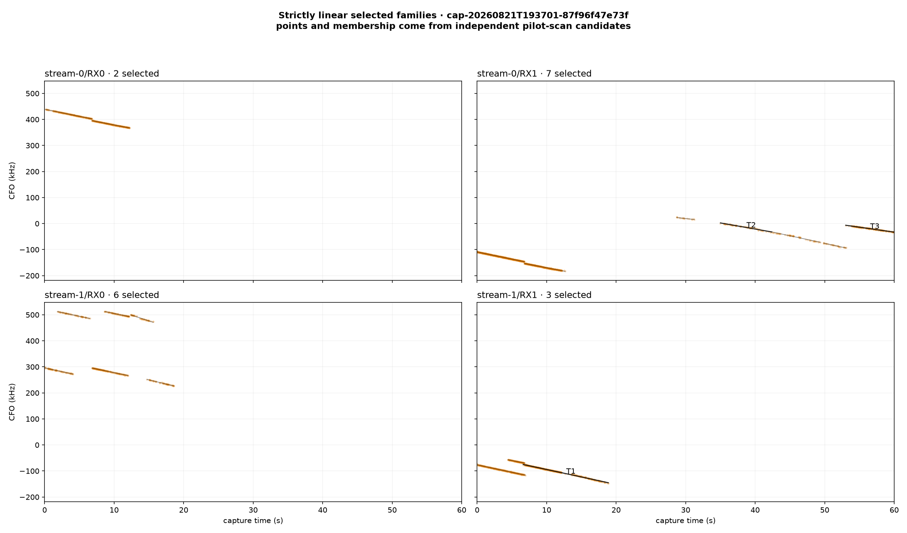

### Top three tracks and top three broad-sky candidates

The satellite candidates use a broader elevation ≥10° legacy scalar-rate screen as a secondary control.

| Track | Sat. rank | Path / RF | Duration | Obs. | Rate | Satellite | Elev. | Predicted | Error | TLE age | True-time rank |
|---|---:|---|---:|---:|---:|---|---:|---:|---:|---:|---:|
| **T1** | 1 | `stream-1/RX1` / 11.4403125 GHz | 12.25 s | 378 | -5732.1 | STARLINK-11083 | 61.2° | -4427.5 | 1304.5 | 11.25 h | 12/41 |
| **T1** | 2 | `stream-1/RX1` / 11.4403125 GHz | 12.25 s | 378 | -5732.1 | STARLINK-1413 | 80.4° | -4170.0 | 1562.1 | 6.79 h | 12/41 |
| **T1** | 3 | `stream-1/RX1` / 11.4403125 GHz | 12.25 s | 378 | -5732.1 | STARLINK-36318 | 79.1° | -4046.3 | 1685.8 | 11.50 h | 12/41 |
| **T2** | 1 | `stream-0/RX1` / 10.9596875 GHz | 7.42 s | 68 | -4685.8 | STARLINK-3999 | 76.5° | -3707.2 | 978.6 | 18.97 h | 32/41 |
| **T2** | 2 | `stream-0/RX1` / 10.9596875 GHz | 7.42 s | 68 | -4685.8 | STARLINK-35808 | 69.6° | -3674.9 | 1010.9 | 11.50 h | 32/41 |
| **T2** | 3 | `stream-0/RX1` / 10.9596875 GHz | 7.42 s | 68 | -4685.8 | STARLINK-36451 | 72.5° | -3450.9 | 1234.9 | 3.66 h | 32/41 |
| **T3** | 1 | `stream-0/RX1` / 10.9596875 GHz | 6.95 s | 154 | -3798.1 | STARLINK-35808 | 68.1° | -3572.1 | 226.0 | 11.50 h | 31/41 |
| **T3** | 2 | `stream-0/RX1` / 10.9596875 GHz | 6.95 s | 154 | -3798.1 | STARLINK-32701 | 57.4° | -3121.0 | 677.1 | 5.02 h | 31/41 |
| **T3** | 3 | `stream-0/RX1` / 10.9596875 GHz | 6.95 s | 154 | -3798.1 | STARLINK-32159 | 48.2° | -2988.8 | 809.3 | 25.56 h | 31/41 |

### 30° zenith cone during the full capture

Half-angle 30° is equivalent to elevation ≥60°. Intervals are relative to capture start.

| Satellite | NORAD | Peak elevation | Visible interval(s) | TLE age |
|---|---:|---:|---|---:|
| STARLINK-11083 | 59424 | 66.1° | 0.00–14.79 s | 11.24 h |
| STARLINK-1413 | 45689 | 89.9° | 0.00–37.09 s | 6.79 h |
| STARLINK-30413 | 57814 | 64.1° | 0.00–7.29 s | 8.35 h |
| STARLINK-31512 | 59500 | 85.5° | 0.00–50.50 s | 4.98 h |
| STARLINK-34291 | 64359 | 87.4° | 0.00–60.00 s | 13.43 h |
| STARLINK-34476 | 64364 | 88.0° | 0.00–51.63 s | 5.42 h |
| STARLINK-35682 | 66467 | 82.2° | 0.00–35.20 s | 4.99 h |
| STARLINK-35808 | 68052 | 70.3° | 16.52–60.00 s | 11.49 h |
| STARLINK-36318 | 68048 | 79.3° | 0.00–48.84 s | 11.50 h |
| STARLINK-36451 | 67339 | 75.1° | 0.00–60.00 s | 3.65 h |
| STARLINK-36468 | 67415 | 62.3° | 0.00–20.94 s | 8.33 h |
| STARLINK-37603 | 69846 | 63.6° | 0.00–26.68 s | 20.51 h |
| STARLINK-3999 | 52704 | 84.1° | 0.00–60.00 s | 18.96 h |
| STARLINK-5422 | 54804 | 73.3° | 0.00–18.28 s | 11.51 h |

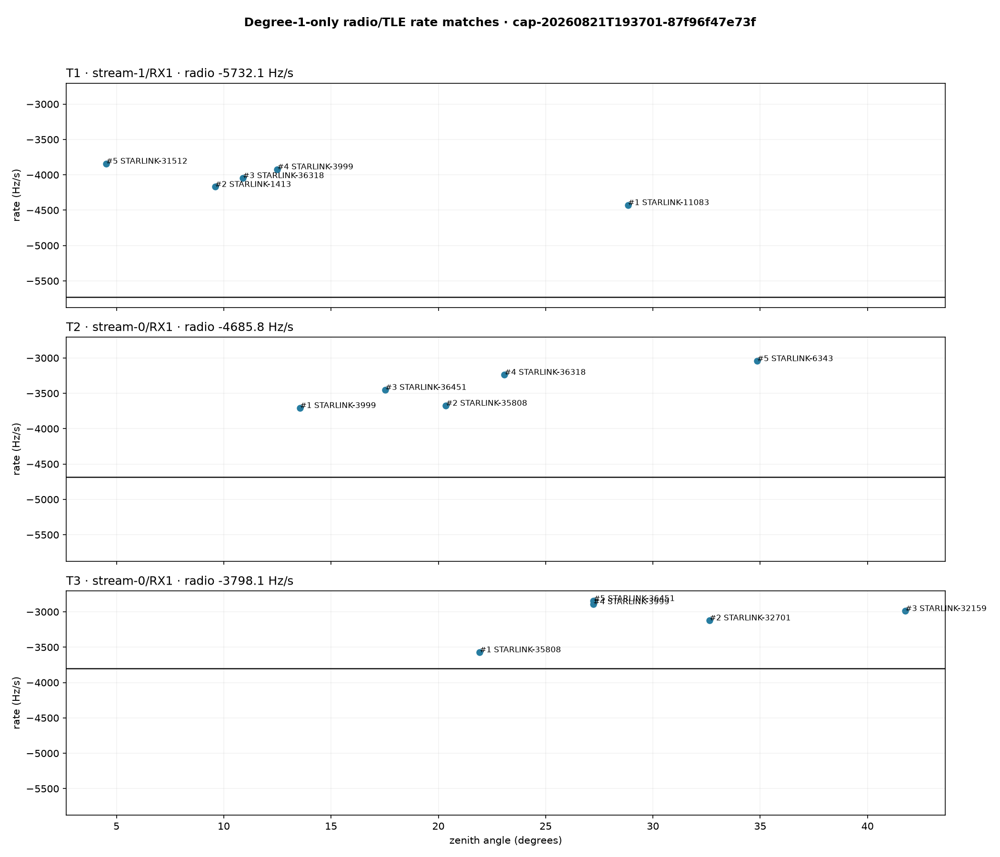

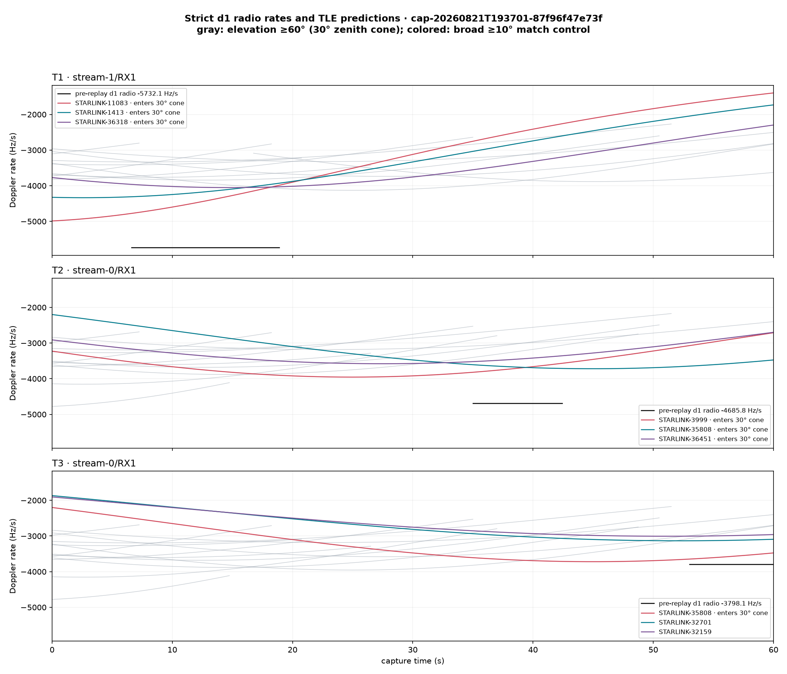

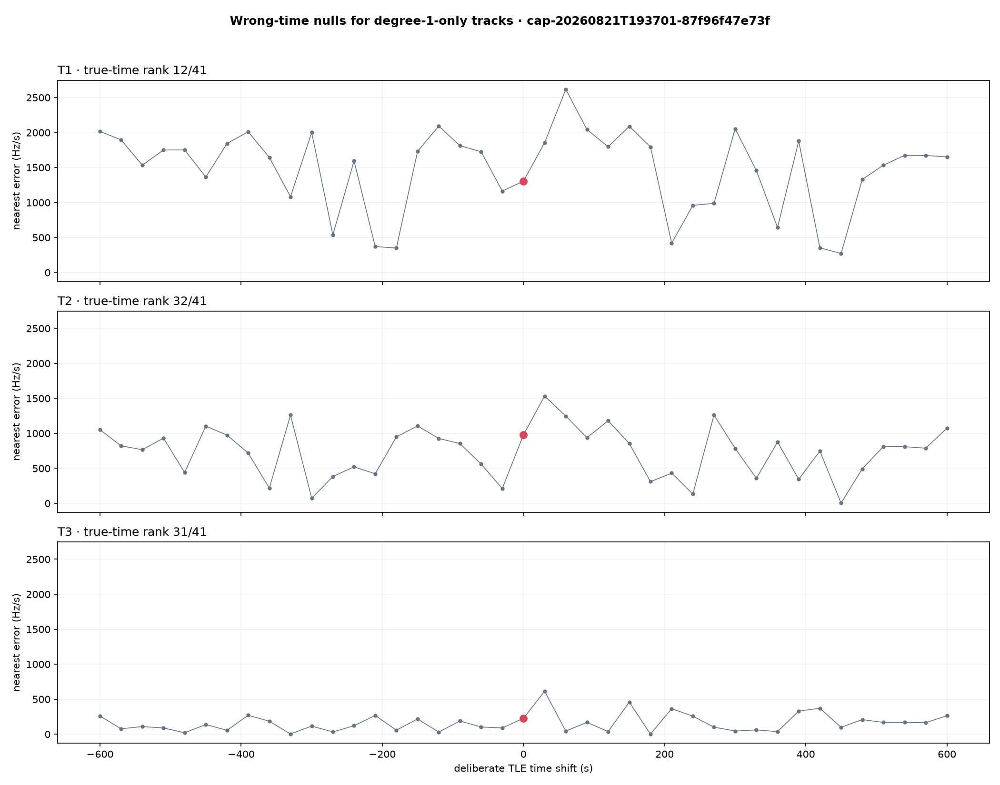

## Dwell 3: `cap-20260821T193440-17c2e0ebef6a`

Fresh raw degree-1 tracks: **11**. Selected pre-replay d1 families: **11**.

Capture start: **2026-08-21T19:34:42.311499+00:00**. Space-Track snapshot: **2026-08-21T19:01:38.807480+00:00**, 33.1 minutes before capture. Causal: **yes**.

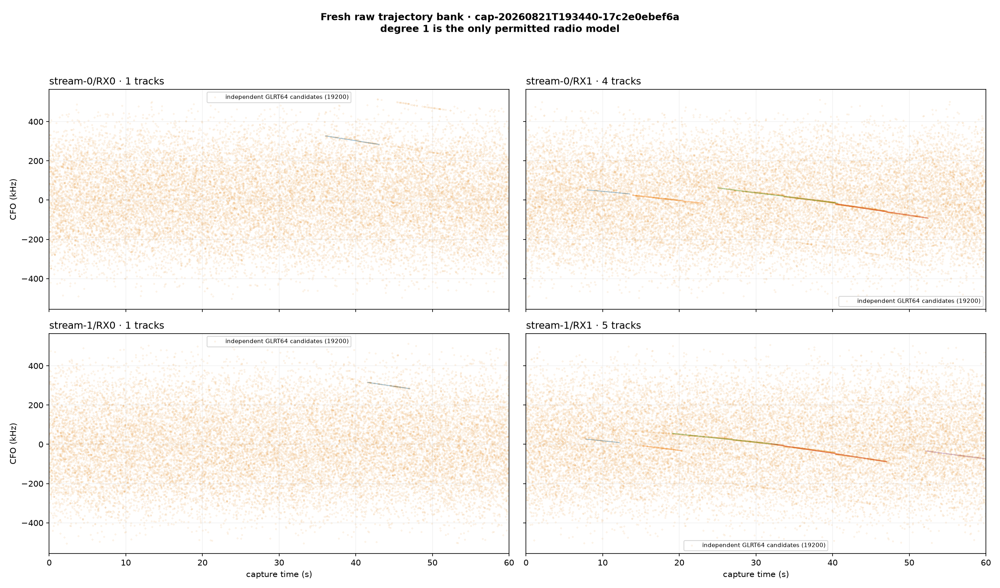

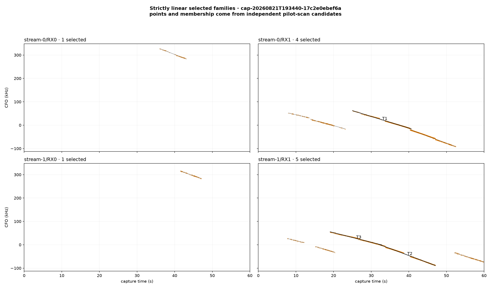

### Top three tracks and top three broad-sky candidates

The satellite candidates use a broader elevation ≥10° legacy scalar-rate screen as a secondary control.

| Track | Sat. rank | Path / RF | Duration | Obs. | Rate | Satellite | Elev. | Predicted | Error | TLE age | True-time rank |
|---|---:|---|---:|---:|---:|---|---:|---:|---:|---:|---:|
| **T1** | 1 | `stream-0/RX1` / 10.9403125 GHz | 15.60 s | 410 | -4965.4 | STARLINK-35371 | 78.7° | -3512.7 | 1452.7 | 19.12 h | 36/41 |
| **T1** | 2 | `stream-0/RX1` / 10.9403125 GHz | 15.60 s | 410 | -4965.4 | STARLINK-3844 | 68.8° | -3368.7 | 1596.7 | 11.16 h | 36/41 |
| **T1** | 3 | `stream-0/RX1` / 10.9403125 GHz | 15.60 s | 410 | -4965.4 | STARLINK-37589 | 58.4° | -3327.8 | 1637.6 | 19.59 h | 36/41 |
| **T2** | 1 | `stream-1/RX1` / 10.9403125 GHz | 15.07 s | 483 | -6048.8 | STARLINK-6135 | 73.4° | -3448.4 | 2600.4 | 22.48 h | 38/41 |
| **T2** | 2 | `stream-1/RX1` / 10.9403125 GHz | 15.07 s | 483 | -6048.8 | STARLINK-34901 | 62.5° | -3355.4 | 2693.4 | 18.98 h | 38/41 |
| **T2** | 3 | `stream-1/RX1` / 10.9403125 GHz | 15.07 s | 483 | -6048.8 | STARLINK-35371 | 73.8° | -3313.2 | 2735.6 | 19.12 h | 38/41 |
| **T3** | 1 | `stream-1/RX1` / 10.9403125 GHz | 13.70 s | 366 | -4105.6 | STARLINK-3844 | 73.5° | -3641.8 | 463.8 | 11.16 h | 30/41 |
| **T3** | 2 | `stream-1/RX1` / 10.9403125 GHz | 13.70 s | 366 | -4105.6 | STARLINK-35371 | 83.0° | -3634.4 | 471.2 | 19.11 h | 30/41 |
| **T3** | 3 | `stream-1/RX1` / 10.9403125 GHz | 13.70 s | 366 | -4105.6 | STARLINK-37589 | 59.6° | -3451.8 | 653.9 | 19.59 h | 30/41 |

### 30° zenith cone during the full capture

Half-angle 30° is equivalent to elevation ≥60°. Intervals are relative to capture start.

| Satellite | NORAD | Peak elevation | Visible interval(s) | TLE age |
|---|---:|---:|---|---:|
| STARLINK-11693 | 63763 | 62.0° | 0.00–2.16 s | 8.13 h |
| STARLINK-31421 | 59218 | 64.5° | 53.03–60.00 s | 11.14 h |
| STARLINK-31504 | 59303 | 63.6° | 0.00–5.29 s | 8.36 h |
| STARLINK-32416 | 61589 | 65.8° | 0.00–19.83 s | 9.94 h |
| STARLINK-32752 | 62567 | 68.3° | 0.00–18.54 s | 19.13 h |
| STARLINK-34901 | 65207 | 65.6° | 33.16–60.00 s | 18.97 h |
| STARLINK-35371 | 66484 | 84.2° | 0.00–58.94 s | 19.11 h |
| STARLINK-36431 | 67421 | 61.0° | 19.46–40.14 s | 8.32 h |
| STARLINK-37589 | 69839 | 60.0° | 17.78–21.39 s | 19.58 h |
| STARLINK-3844 | 52705 | 79.2° | 0.00–45.68 s | 11.15 h |
| STARLINK-4209 | 52855 | 75.3° | 28.94–60.00 s | 11.52 h |
| STARLINK-6135 | 56539 | 76.3° | 16.42–60.00 s | 22.47 h |
| STARLINK-6291 | 56547 | 62.4° | 3.59–35.47 s | 9.94 h |

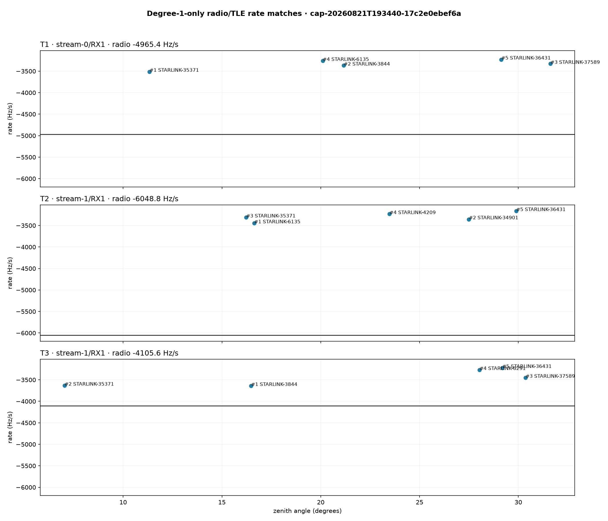

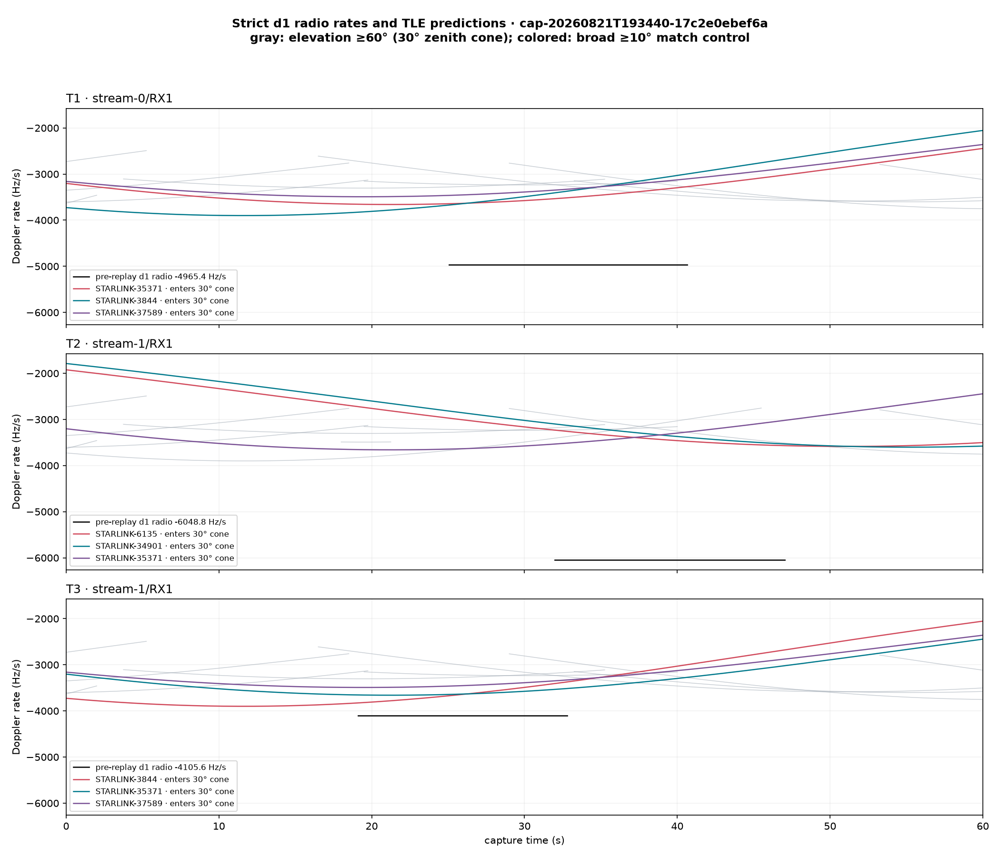

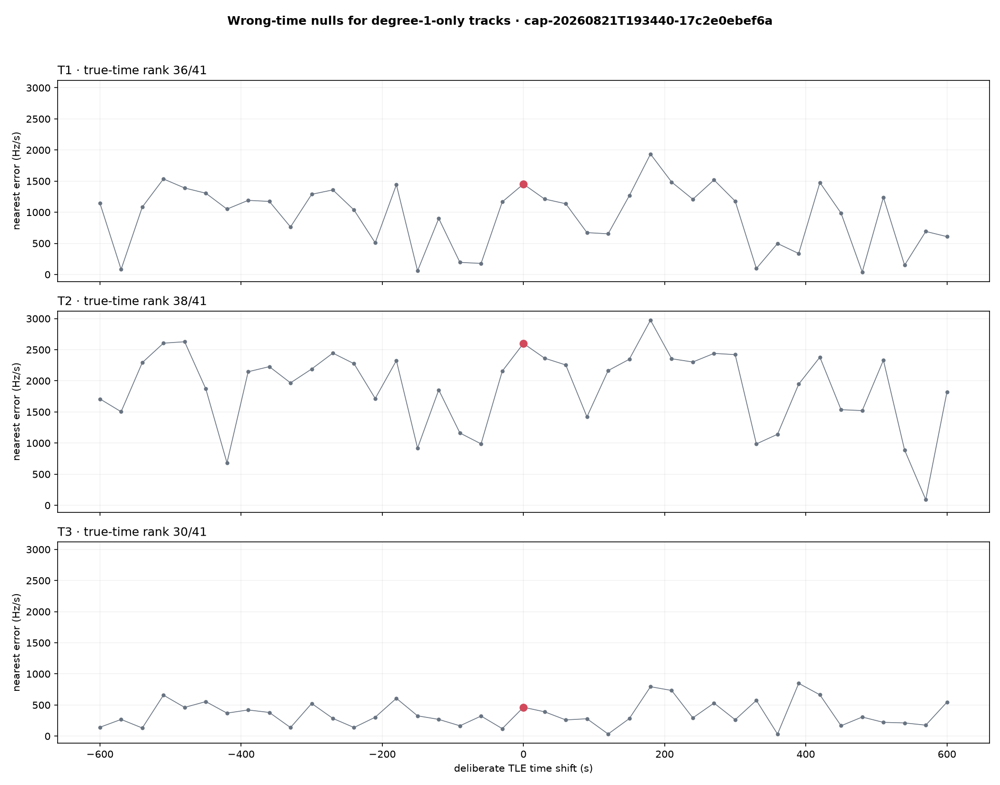

## Dwell 4: `cap-20260821T190912-ffd441556880`

Fresh raw degree-1 tracks: **10**. Selected pre-replay d1 families: **10**.

Capture start: **2026-08-21T19:09:13.968555+00:00**. Space-Track snapshot: **2026-08-21T19:01:38.807480+00:00**, 7.6 minutes before capture. Causal: **yes**.

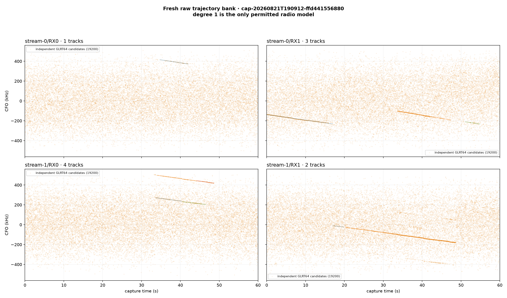

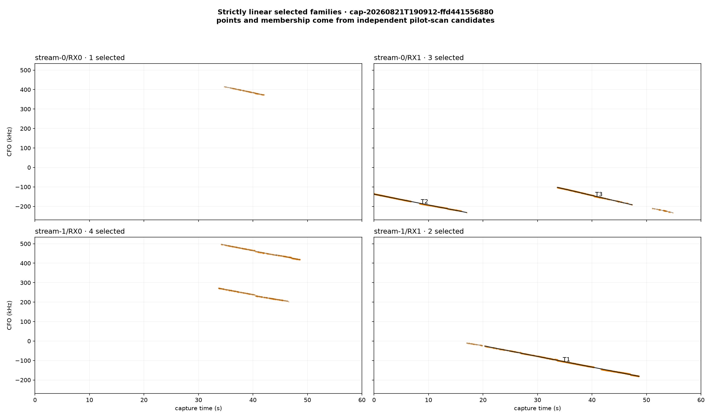

### Top three tracks and top three broad-sky candidates

The satellite candidates use a broader elevation ≥10° legacy scalar-rate screen as a secondary control.

| Track | Sat. rank | Path / RF | Duration | Obs. | Rate | Satellite | Elev. | Predicted | Error | TLE age | True-time rank |
|---|---:|---|---:|---:|---:|---|---:|---:|---:|---:|---:|
| **T1** | 1 | `stream-1/RX1` / 11.4403125 GHz | 28.30 s | 1171 | -5488.5 | STARLINK-11182 | 73.7° | -5225.2 | 263.3 | 11.24 h | 1/41 |
| **T1** | 2 | `stream-1/RX1` / 11.4403125 GHz | 28.30 s | 1171 | -5488.5 | STARLINK-11417 | 49.4° | -4124.5 | 1364.0 | 18.56 h | 1/41 |
| **T1** | 3 | `stream-1/RX1` / 11.4403125 GHz | 28.30 s | 1171 | -5488.5 | STARLINK-3935 | 76.4° | -3933.0 | 1555.5 | 3.34 h | 1/41 |
| **T2** | 1 | `stream-0/RX1` / 11.4596875 GHz | 17.00 s | 583 | -5555.5 | STARLINK-11182 | 61.4° | -4071.2 | 1484.3 | 11.24 h | 21/41 |
| **T2** | 2 | `stream-0/RX1` / 11.4596875 GHz | 17.00 s | 583 | -5555.5 | STARLINK-33944 | 73.5° | -3903.2 | 1652.3 | 5.16 h | 21/41 |
| **T2** | 3 | `stream-0/RX1` / 11.4596875 GHz | 17.00 s | 583 | -5555.5 | STARLINK-11417 | 47.8° | -3868.7 | 1686.8 | 18.55 h | 21/41 |
| **T3** | 1 | `stream-0/RX1` / 11.4596875 GHz | 13.73 s | 422 | -6530.2 | STARLINK-11182 | 71.0° | -5020.4 | 1509.9 | 11.25 h | 2/41 |
| **T3** | 2 | `stream-0/RX1` / 11.4596875 GHz | 13.73 s | 422 | -6530.2 | STARLINK-11417 | 48.1° | -3919.7 | 2610.5 | 18.56 h | 2/41 |
| **T3** | 3 | `stream-0/RX1` / 11.4596875 GHz | 13.73 s | 422 | -6530.2 | STARLINK-3935 | 72.3° | -3722.3 | 2807.9 | 3.34 h | 2/41 |

### 30° zenith cone during the full capture

Half-angle 30° is equivalent to elevation ≥60°. Intervals are relative to capture start.

| Satellite | NORAD | Peak elevation | Visible interval(s) | TLE age |
|---|---:|---:|---|---:|
| STARLINK-11182 | 60399 | 74.1° | 6.67–55.37 s | 11.24 h |
| STARLINK-1522 | 46027 | 77.4° | 0.00–27.14 s | 3.39 h |
| STARLINK-30823 | 58248 | 65.6° | 42.59–60.00 s | 4.99 h |
| STARLINK-32729 | 62497 | 64.4° | 52.93–60.00 s | 19.09 h |
| STARLINK-33944 | 64209 | 74.6° | 0.00–47.17 s | 5.15 h |
| STARLINK-34976 | 65209 | 66.7° | 46.31–60.00 s | 3.32 h |
| STARLINK-3545 | 51855 | 70.0° | 41.00–60.00 s | 11.49 h |
| STARLINK-35466 | 66457 | 69.0° | 9.98–60.00 s | 4.96 h |
| STARLINK-36458 | 67343 | 75.9° | 31.24–60.00 s | 8.32 h |
| STARLINK-3935 | 52549 | 80.7° | 0.00–57.74 s | 3.33 h |
| STARLINK-5327 | 55291 | 63.6° | 38.08–60.00 s | 13.43 h |
| STARLINK-5446 | 54789 | 78.0° | 0.00–39.09 s | 10.11 h |

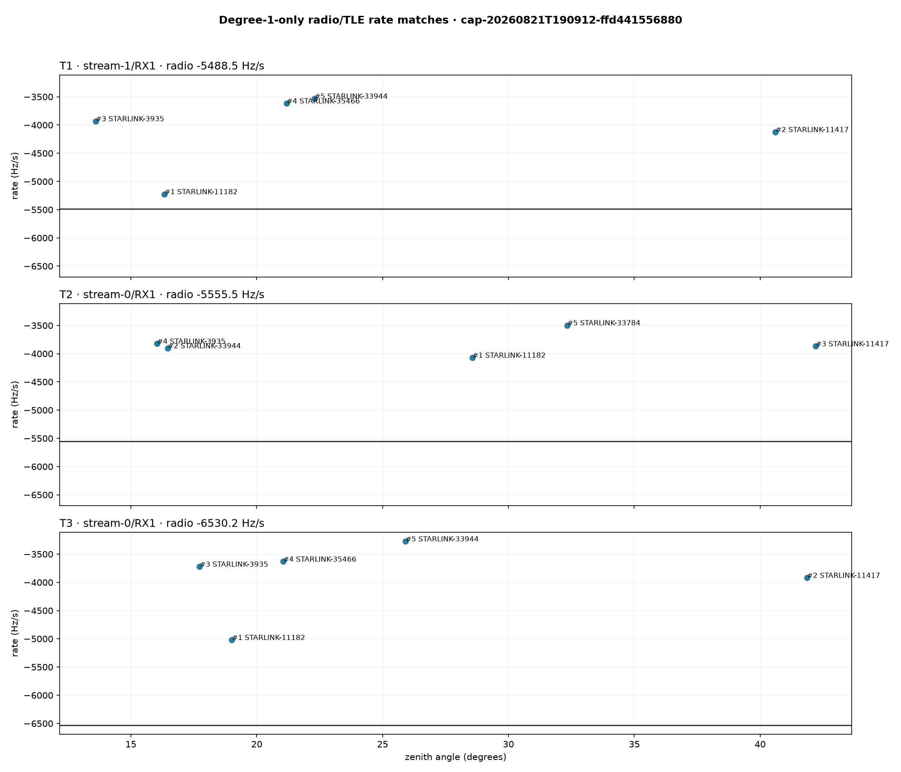

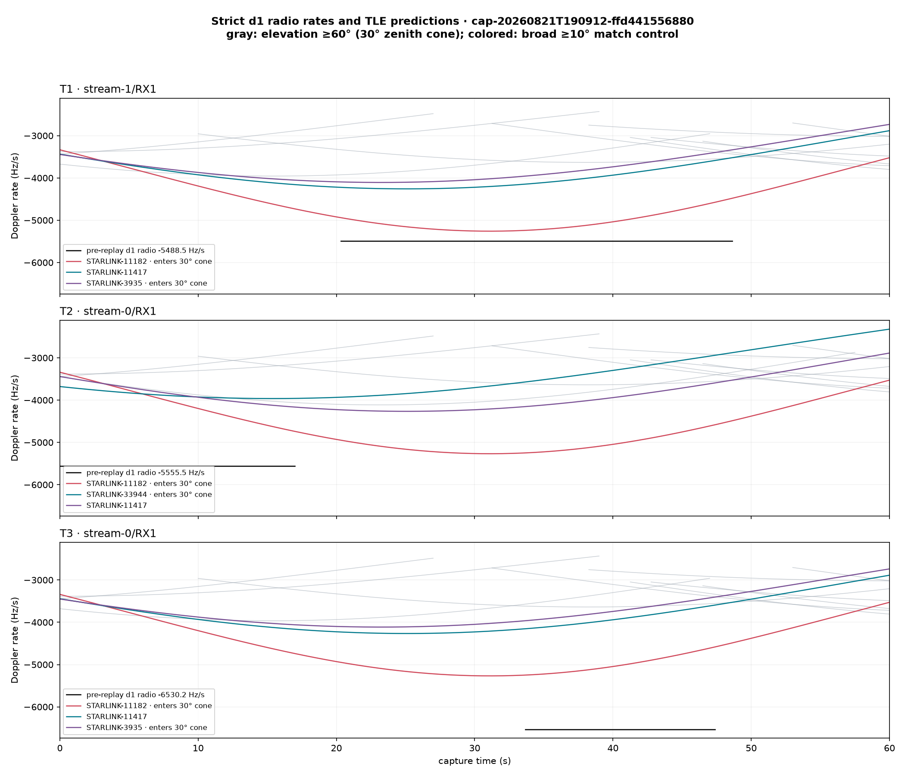

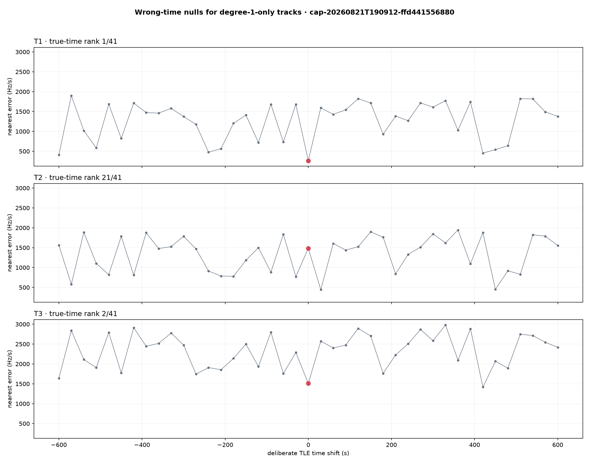

## Dwell 5: `cap-20260821T190701-7a5d980ec1c6`

Fresh raw degree-1 tracks: **8**. Selected pre-replay d1 families: **8**.

Capture start: **2026-08-21T19:07:02.822230+00:00**. Space-Track snapshot: **2026-08-21T19:01:38.807480+00:00**, 5.4 minutes before capture. Causal: **yes**.

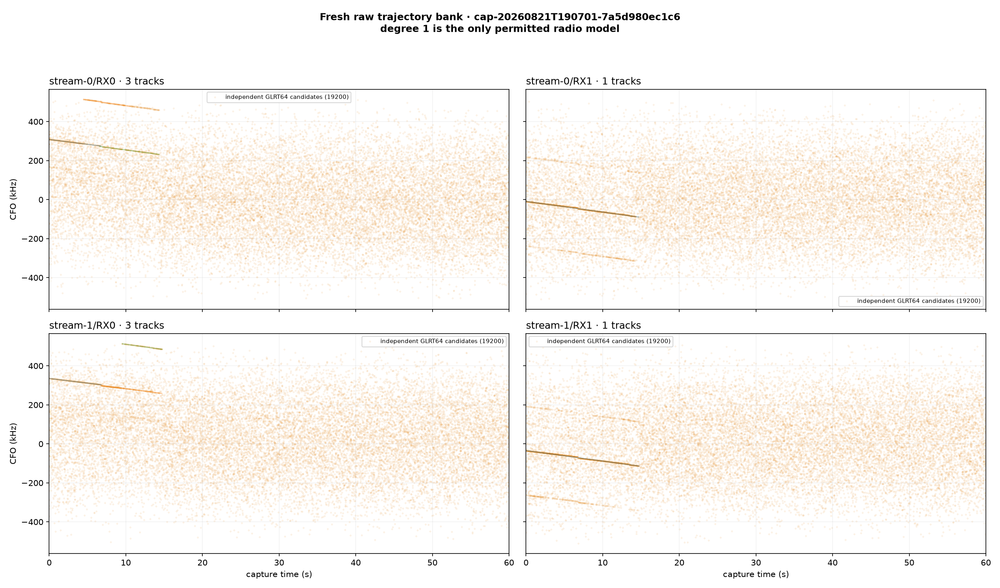

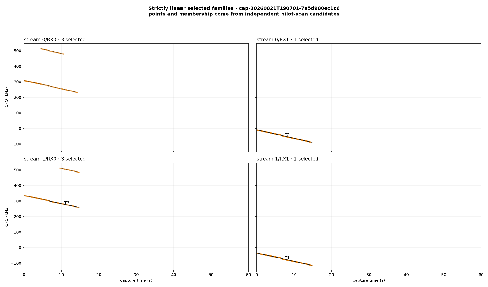

### Top three tracks and top three broad-sky candidates

The satellite candidates use a broader elevation ≥10° legacy scalar-rate screen as a secondary control.

| Track | Sat. rank | Path / RF | Duration | Obs. | Rate | Satellite | Elev. | Predicted | Error | TLE age | True-time rank |
|---|---:|---|---:|---:|---:|---|---:|---:|---:|---:|---:|
| **T1** | 1 | `stream-1/RX1` / 11.4403125 GHz | 14.75 s | 1015 | -5389.2 | STARLINK-11599 | 50.8° | -4083.3 | 1305.9 | 3.57 h | 22/41 |
| **T1** | 2 | `stream-1/RX1` / 11.4403125 GHz | 14.75 s | 1015 | -5389.2 | STARLINK-31239 | 78.7° | -3998.7 | 1390.5 | 11.51 h | 22/41 |
| **T1** | 3 | `stream-1/RX1` / 11.4403125 GHz | 14.75 s | 1015 | -5389.2 | STARLINK-3659 | 67.8° | -3751.3 | 1637.8 | 27.11 h | 22/41 |
| **T2** | 1 | `stream-0/RX1` / 11.4403125 GHz | 14.72 s | 920 | -5468.9 | STARLINK-11599 | 50.8° | -4083.7 | 1385.2 | 3.57 h | 22/41 |
| **T2** | 2 | `stream-0/RX1` / 11.4403125 GHz | 14.72 s | 920 | -5468.9 | STARLINK-31239 | 78.7° | -3998.5 | 1470.4 | 11.51 h | 22/41 |
| **T2** | 3 | `stream-0/RX1` / 11.4403125 GHz | 14.72 s | 920 | -5468.9 | STARLINK-3659 | 67.8° | -3751.1 | 1717.8 | 27.11 h | 22/41 |
| **T3** | 1 | `stream-1/RX0` / 11.4403125 GHz | 7.95 s | 220 | -4974.0 | STARLINK-31239 | 80.2° | -4052.9 | 921.1 | 11.51 h | 22/41 |
| **T3** | 2 | `stream-1/RX0` / 11.4403125 GHz | 7.95 s | 220 | -4974.0 | STARLINK-11599 | 49.8° | -3931.2 | 1042.8 | 3.57 h | 22/41 |
| **T3** | 3 | `stream-1/RX0` / 11.4403125 GHz | 7.95 s | 220 | -4974.0 | STARLINK-3659 | 68.9° | -3829.0 | 1145.0 | 27.11 h | 22/41 |

### 30° zenith cone during the full capture

Half-angle 30° is equivalent to elevation ≥60°. Intervals are relative to capture start.

| Satellite | NORAD | Peak elevation | Visible interval(s) | TLE age |
|---|---:|---:|---|---:|
| STARLINK-11567 | 62909 | 61.9° | 31.04–52.46 s | 12.48 h |
| STARLINK-30849 | 58245 | 65.1° | 47.73–60.00 s | 19.11 h |
| STARLINK-31076 | 58736 | 75.4° | 0.00–51.52 s | 8.36 h |
| STARLINK-31239 | 60093 | 80.9° | 0.00–49.63 s | 11.51 h |
| STARLINK-31480 | 59306 | 62.2° | 0.00–11.91 s | 8.33 h |
| STARLINK-32773 | 62571 | 83.5° | 0.00–55.21 s | 19.10 h |
| STARLINK-34289 | 64225 | 87.0° | 9.08–60.00 s | 11.49 h |
| STARLINK-34302 | 65216 | 64.5° | 0.00–35.15 s | 17.40 h |
| STARLINK-36225 | 67207 | 89.4° | 0.00–60.00 s | 16.20 h |
| STARLINK-36267 | 67198 | 88.8° | 0.00–50.27 s | 16.20 h |
| STARLINK-3659 | 52001 | 70.1° | 0.00–46.75 s | 27.11 h |
| STARLINK-4530 | 53393 | 67.2° | 0.00–10.89 s | 5.12 h |
| STARLINK-5665 | 55361 | 76.0° | 0.00–23.98 s | 19.12 h |
| STARLINK-6252 | 56555 | 89.0° | 11.69–60.00 s | 8.34 h |
| STARLINK-6311 | 56537 | 66.4° | 49.43–60.00 s | 8.32 h |

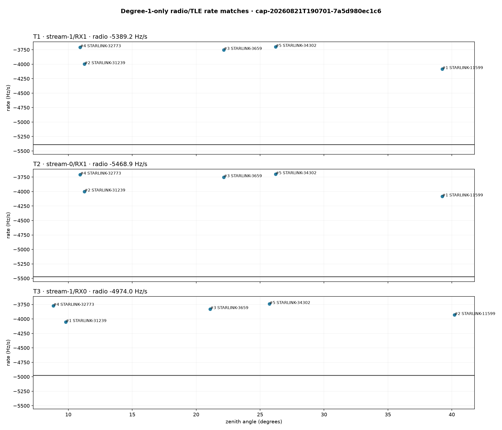

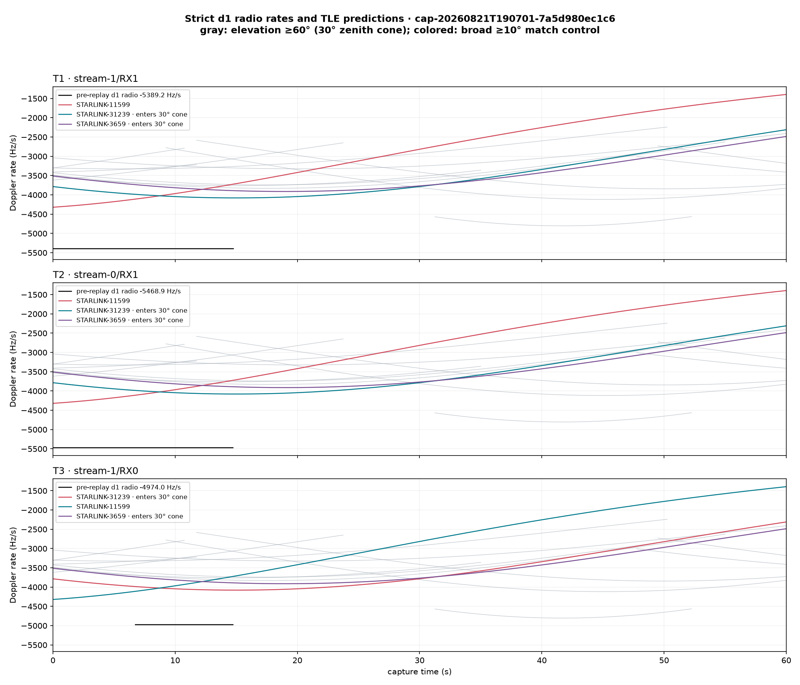

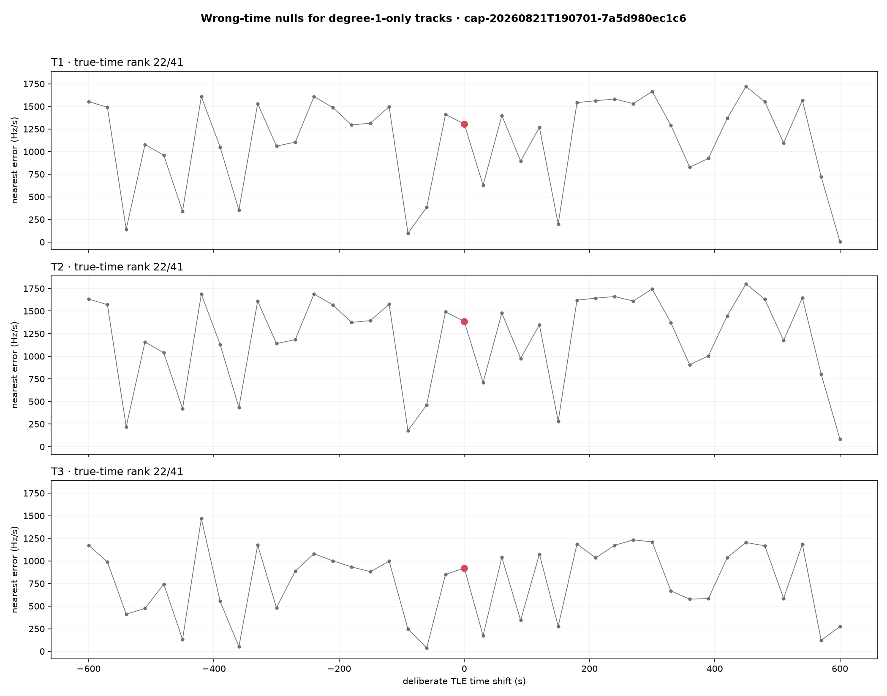

## Scope and limitations

No quadratic or cubic radio fit, family member, selector, observation membership, or curvature statistic is used. TLE curve curvature is orbital prediction, not a nonlinear radio estimate. Space-Track snapshots are the newest archived snapshot at or before each dwell. This is compatibility evidence, not satellite identification.
