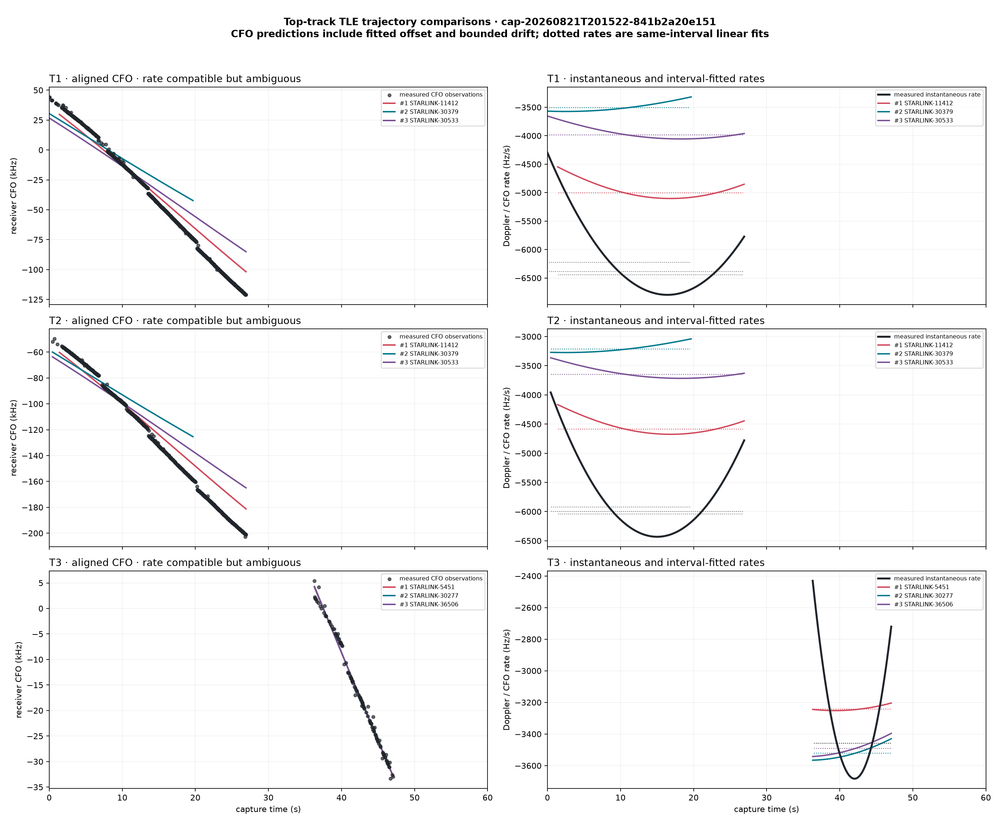
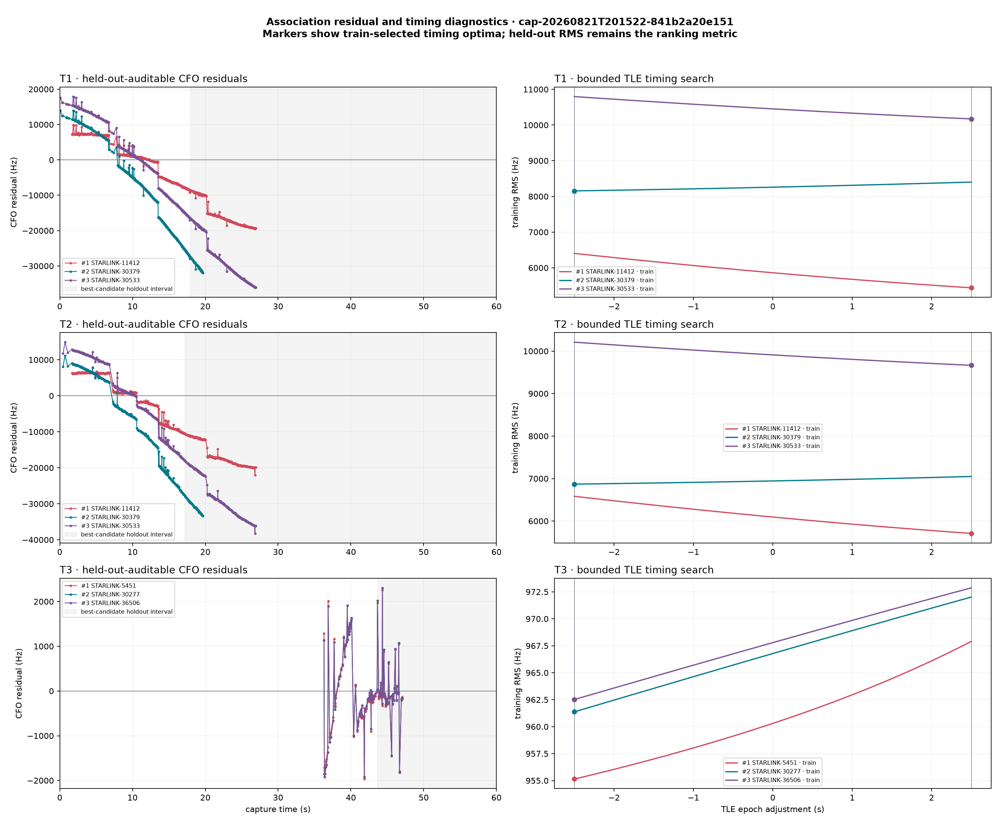
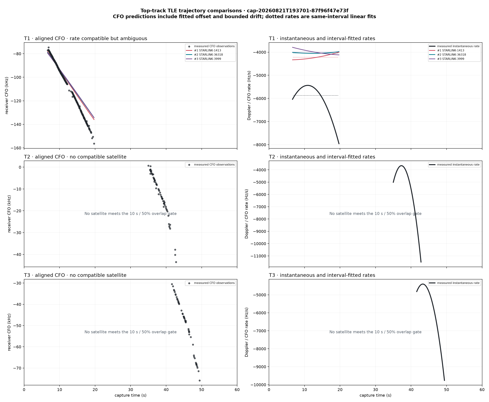
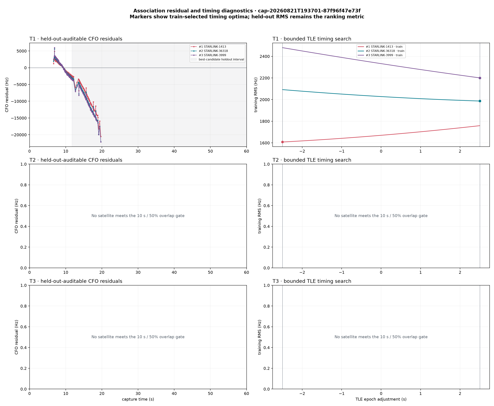
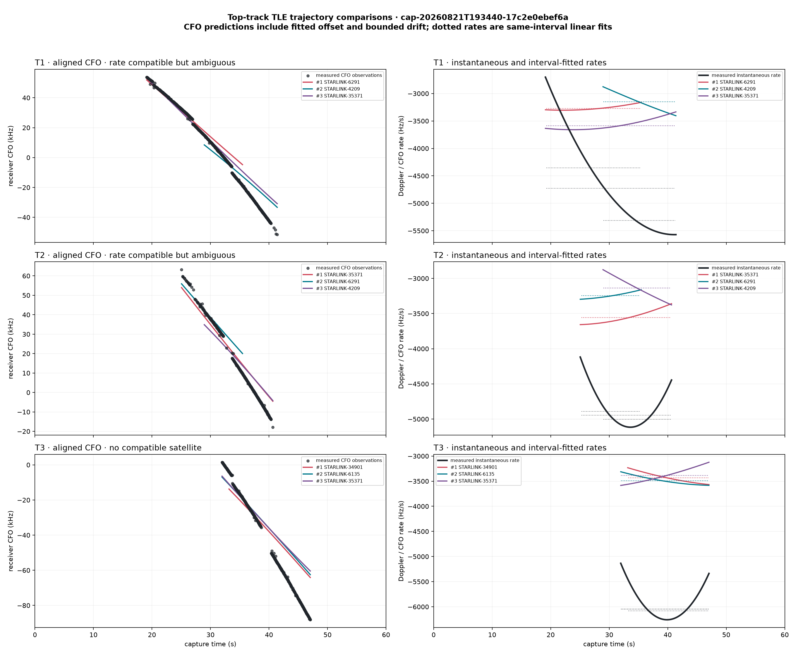
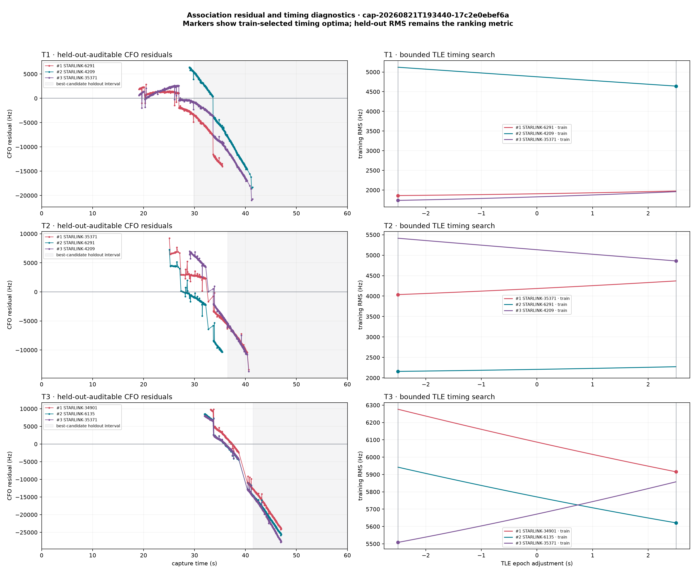
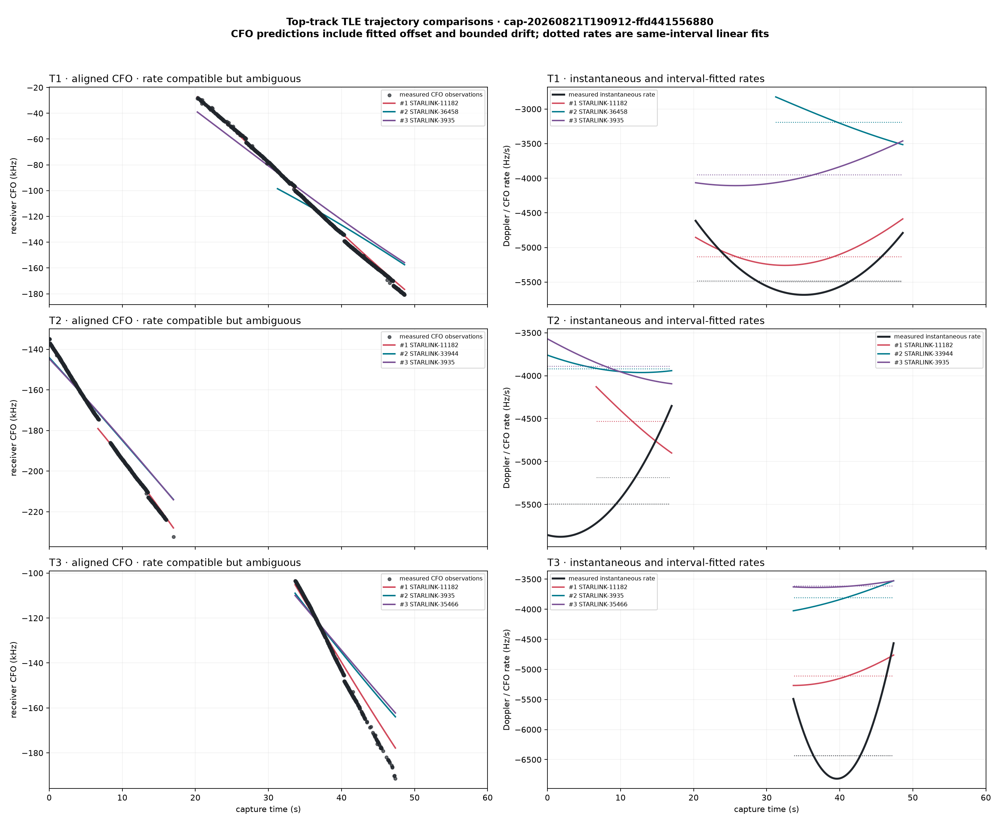
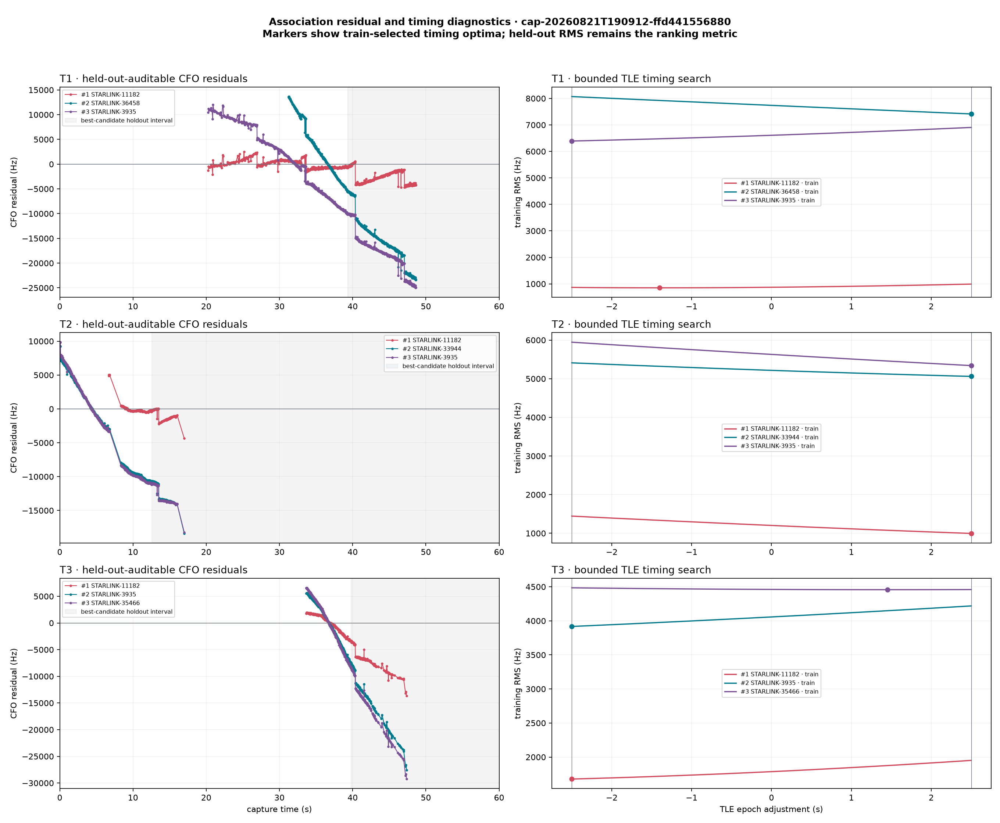
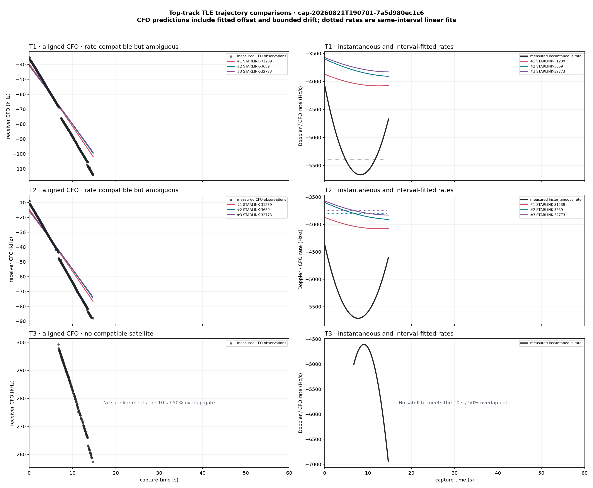
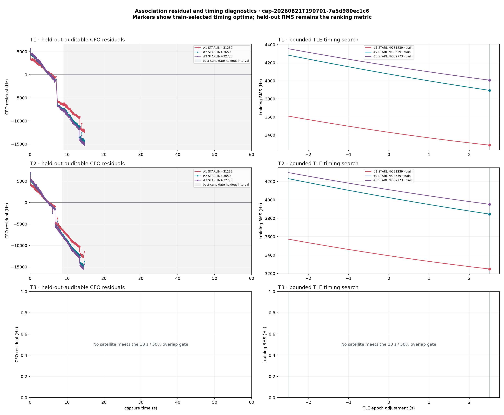

# Five-dwell GLRT track and zenith-cone TLE report

Generated: `2026-08-21T22:33:16.121060+00:00`

Status: retrospective candidate evidence only; no spacecraft identity is claimed.

## Reading the report

For each dwell, the first figure shows the pre-dealias raw GLRT trajectory fits and the second shows the sealed final retained tracks. The top-three table ranks final tracks by duration, then observation count, then median corrected GLRT margin. This is an explicit inspection ordering, not a new scientific confidence score.

A 30° cone centered on zenith means elevation ≥ 60°. The observer is the reviewed Sausalito preset (37.858988, -122.478103, -29 m). Visibility intervals are clipped to the nominal 60-second capture and threshold crossings are linearly interpolated from a 0.25-second propagation grid.

The rate overlay uses **Doppler rate in Hz/s**, not absolute CFO. Unknown constant receiver/LNB offsets do not affect this derivative. The matching panels separately compare CFO evolution after fitting only a constant offset and a bounded linear nuisance drift.

The black radio curves are the complete derivatives of the sealed linear, quadratic, or cubic CFO polynomials. For each track–satellite overlap, both measured and predicted CFO are also reduced to linear slopes over exactly the same timestamps. This keeps scalar rate comparisons interval matched.

Full-trajectory matching uses the underlying de-aliased CFO observations. A small TLE timing adjustment is selected on the earlier 60% of observations, along with one free CFO offset and a nuisance drift bounded to ±200 Hz/s. Satellites are ranked by residual RMS on the later, unseen 40%. A stable candidate must remain best under 50/50, 60/40, and 70/30 splits and a 20% tighter drift bound; it must also beat the runner-up and ±30-second time controls.

## Terminology

| Term | Units | Meaning in this report |
|---|---:|---|
| Doppler shift | Hz | Geometric received-minus-transmitted frequency shift. |
| Doppler rate / Doppler drift | Hz/s | Time derivative of Doppler shift; approximately constant and negative near closest approach. |
| CFO | Hz | Radio-measured carrier-frequency offset: Doppler plus receiver, LNB, and transmitter offsets. |
| Reference-time rate | Hz/s | Instantaneous derivative of the sealed radio CFO polynomial at `reference_time_s`. |
| Interval-fitted rate | Hz/s | Linear slope fitted over the exact common track–cone interval, computed identically for radio and TLE series. |
| Predicted rate | Hz/s | Numerical time derivative of TLE/SGP4 geometric Doppler shift at the path's RF center. |
| Linear-rate residual | Hz/s | Signed or absolute difference between the two interval-fitted slopes. |
| Instantaneous-rate RMS | Hz/s RMS | RMS difference between the complete measured and predicted rate curves over their overlap. |
| Held-out CFO RMS | Hz | CFO trajectory error on observations not used to fit timing, frequency offset, or nuisance drift. |
| Nuisance drift | Hz/s | Bounded residual receiver/LNB/transmitter-clock drift; it is not the geometric Doppler rate. |
| Doppler-rate curvature | Hz/s² | Change in Doppler rate; not plotted as a radio measurement in the overlay. |

## Cross-dwell preliminary result

Across the 15 inspected top tracks, 0 pass every stable-candidate gate, 0 are trajectory-compatible without stability, 11 are rate-compatible but ambiguous, and 4 have no adequate rate-compatible candidate.

The smallest held-out RMS is 618.2 Hz for cap-20260821T201522-841b2a20e151 T3 against STARLINK-5451; it still does not pass the complete gate set. This report therefore finds no satellite identity in these five dwells.

## Dwell 1: `cap-20260821T201522-841b2a20e151`

Sealed run: `capture-fb15d5f27c1c43b2b1c4f3fcf9fd13cf`

Capture: `2026-08-21T20:15:24.015+00:00` to `2026-08-21T20:16:24.015+00:00`

Inventory: 48 raw GLRT fits, 15 final tracks, 15 Starlink satellites entering the cone.

### Raw GLRT tracks

### Final tracks

### Three longest final tracks

| Track | Path | Interval (s) | Duration | Observations | Degree | Reference-time rate | Median corrected GLRT | Replay | Cone satellites during track, closest rate first |
|---|---|---:|---:|---:|---:|---:|---:|---|---|
| **T1** `48a58b5a` | stream-0/RX1 | 0.00–26.93 | 26.93 s | 819 | 3 | -4297.6 Hz/s | 0.3941 | automatic | STARLINK-11412, STARLINK-30533, STARLINK-32200, STARLINK-30379, STARLINK-35493, STARLINK-36506, STARLINK-3312, STARLINK-30277, STARLINK-5663, STARLINK-5451, STARLINK-5286 |
| **T2** `4663d9c7` | stream-1/RX1 | 0.45–26.92 | 26.48 s | 756 | 3 | -3958.1 Hz/s | 0.3451 | automatic | STARLINK-11412, STARLINK-30533, STARLINK-32200, STARLINK-30379, STARLINK-35493, STARLINK-36506, STARLINK-30277, STARLINK-3312, STARLINK-5451, STARLINK-5286 |
| **T3** `c2051f6e` | stream-1/RX1 | 36.30–47.05 | 10.75 s | 124 | 3 | -2430.7 Hz/s | 0.0020 | automatic | STARLINK-36506, STARLINK-30277, STARLINK-30533, STARLINK-32200, STARLINK-5451, STARLINK-6218, STARLINK-5286, STARLINK-37407, STARLINK-36526, STARLINK-11412 |

### Interval-matched scalar rate comparison

Only satellites overlapping at least 10 seconds and 50% of the measured track enter these top-three rate tables. Shorter geometric overlaps remain listed in the cone inventory below.

#### T1

| Rank | Satellite | NORAD | Overlap | Measured slope | Predicted slope | Signed Δ | Instantaneous RMS |
|---:|---|---:|---:|---:|---:|---:|---:|
| 1 | STARLINK-11412 | 63062 | 25.52 s (95%) | -6446.1 Hz/s | -4958.4 Hz/s | -1487.7 Hz/s | 1385.0 Hz/s |
| 2 | STARLINK-30533 | 58037 | 26.93 s (100%) | -6385.6 Hz/s | -3945.3 Hz/s | -2440.3 Hz/s | 2305.4 Hz/s |
| 3 | STARLINK-32200 | 60258 | 26.93 s (100%) | -6385.6 Hz/s | -3883.0 Hz/s | -2502.7 Hz/s | 2364.8 Hz/s |

#### T2

| Rank | Satellite | NORAD | Overlap | Measured slope | Predicted slope | Signed Δ | Instantaneous RMS |
|---:|---|---:|---:|---:|---:|---:|---:|
| 1 | STARLINK-11412 | 63062 | 25.52 s (96%) | -6043.1 Hz/s | -4542.4 Hz/s | -1500.6 Hz/s | 1373.9 Hz/s |
| 2 | STARLINK-30533 | 58037 | 26.48 s (100%) | -5999.4 Hz/s | -3617.1 Hz/s | -2382.4 Hz/s | 2208.9 Hz/s |
| 3 | STARLINK-32200 | 60258 | 26.48 s (100%) | -5999.4 Hz/s | -3560.0 Hz/s | -2439.4 Hz/s | 2263.3 Hz/s |

#### T3

| Rank | Satellite | NORAD | Overlap | Measured slope | Predicted slope | Signed Δ | Instantaneous RMS |
|---:|---|---:|---:|---:|---:|---:|---:|
| 1 | STARLINK-36506 | 67414 | 10.75 s (100%) | -3459.6 Hz/s | -3450.2 Hz/s | -9.3 Hz/s | 368.5 Hz/s |
| 2 | STARLINK-30277 | 57645 | 10.75 s (100%) | -3459.6 Hz/s | -3481.9 Hz/s | +22.3 Hz/s | 380.0 Hz/s |
| 3 | STARLINK-30533 | 58037 | 10.75 s (100%) | -3459.6 Hz/s | -3242.4 Hz/s | -217.1 Hz/s | 381.8 Hz/s |

### Held-out full-trajectory matching

#### T1: `rate_compatible_but_ambiguous`

Stable winner across sensitivity cases: `False`; primary runner-up margin: `8434.2 Hz`.

Primary gates — held-out RMS: `False`; interior timing optimum: `False`; runner-up margin: `True`; time controls: `True`.

| Rank | Satellite | NORAD | Held-out RMS | Train RMS | Epoch Δt | Nuisance drift | Linear-rate Δ | Time-control advantage |
|---:|---|---:|---:|---:|---:|---:|---:|---:|
| 1 | STARLINK-11412 | 63062 | 15873.9 Hz | 5439.5 Hz | +2.50 s | -200.0 Hz/s | -1441.4 Hz/s | +16330.3 Hz |
| 2 | STARLINK-30379 | 57811 | 24308.1 Hz | 8155.5 Hz | -2.50 s | -200.0 Hz/s | -2715.8 Hz/s | +1764.7 Hz |
| 3 | STARLINK-30533 | 58037 | 28481.9 Hz | 10172.1 Hz | +2.50 s | -200.0 Hz/s | -2403.6 Hz/s | +8342.4 Hz |

#### T2: `rate_compatible_but_ambiguous`

Stable winner across sensitivity cases: `False`; primary runner-up margin: `8495.3 Hz`.

Primary gates — held-out RMS: `False`; interior timing optimum: `False`; runner-up margin: `True`; time controls: `True`.

| Rank | Satellite | NORAD | Held-out RMS | Train RMS | Epoch Δt | Nuisance drift | Linear-rate Δ | Time-control advantage |
|---:|---|---:|---:|---:|---:|---:|---:|---:|
| 1 | STARLINK-11412 | 63062 | 16714.4 Hz | 5708.5 Hz | +2.50 s | -200.0 Hz/s | -1458.2 Hz/s | +15509.7 Hz |
| 2 | STARLINK-30379 | 57811 | 25209.7 Hz | 6869.3 Hz | -2.50 s | -200.0 Hz/s | -2709.9 Hz/s | +1817.2 Hz |
| 3 | STARLINK-30533 | 58037 | 28953.7 Hz | 9664.9 Hz | +2.50 s | -200.0 Hz/s | -2349.3 Hz/s | +7832.2 Hz |

#### T3: `rate_compatible_but_ambiguous`

Stable winner across sensitivity cases: `False`; primary runner-up margin: `4.4 Hz`.

Primary gates — held-out RMS: `False`; interior timing optimum: `False`; runner-up margin: `False`; time controls: `True`.

| Rank | Satellite | NORAD | Held-out RMS | Train RMS | Epoch Δt | Nuisance drift | Linear-rate Δ | Time-control advantage |
|---:|---|---:|---:|---:|---:|---:|---:|---:|
| 1 | STARLINK-5451 | 54771 | 618.2 Hz | 955.1 Hz | -2.50 s | -200.0 Hz/s | -217.1 Hz/s | +1623.3 Hz |
| 2 | STARLINK-30277 | 57645 | 622.6 Hz | 961.4 Hz | -2.50 s | +66.5 Hz/s | +60.8 Hz/s | +175.1 Hz |
| 3 | STARLINK-36506 | 67414 | 623.5 Hz | 962.5 Hz | -2.50 s | +38.9 Hz/s | +31.3 Hz/s | +152.7 Hz |

### Satellites inside the 30° zenith cone

Intervals marked `≤` touch a capture boundary and may continue outside it.

| Starlink satellite | NORAD | Peak elevation | Visible capture interval(s) | Visible UTC interval(s) |
|---|---:|---:|---|---|
| STARLINK-11412 | 63062 | 66.2° | 1.40–37.38 s | 2026-08-21T20:15:25.415+00:00 to 2026-08-21T20:16:01.393+00:00 |
| STARLINK-30277 | 57645 | 81.3° | ≤0.00–60.00≤ s | 2026-08-21T20:15:24.015+00:00 to 2026-08-21T20:16:24.015+00:00 |
| STARLINK-30379 | 57811 | 63.8° | ≤0.00–19.67 s | 2026-08-21T20:15:24.015+00:00 to 2026-08-21T20:15:43.687+00:00 |
| STARLINK-30533 | 58037 | 73.2° | ≤0.00–51.60 s | 2026-08-21T20:15:24.015+00:00 to 2026-08-21T20:16:15.611+00:00 |
| STARLINK-32200 | 60258 | 70.6° | ≤0.00–49.82 s | 2026-08-21T20:15:24.015+00:00 to 2026-08-21T20:16:13.831+00:00 |
| STARLINK-3312 | 50850 | 62.3° | ≤0.00–28.80 s | 2026-08-21T20:15:24.015+00:00 to 2026-08-21T20:15:52.816+00:00 |
| STARLINK-35493 | 65928 | 80.1° | ≤0.00–25.24 s | 2026-08-21T20:15:24.015+00:00 to 2026-08-21T20:15:49.256+00:00 |
| STARLINK-36506 | 67414 | 78.8° | ≤0.00–60.00≤ s | 2026-08-21T20:15:24.015+00:00 to 2026-08-21T20:16:24.015+00:00 |
| STARLINK-36526 | 67508 | 66.3° | 39.56–60.00≤ s | 2026-08-21T20:16:03.574+00:00 to 2026-08-21T20:16:24.015+00:00 |
| STARLINK-37407 | 69534 | 71.2° | 43.88–60.00≤ s | 2026-08-21T20:16:07.896+00:00 to 2026-08-21T20:16:24.015+00:00 |
| STARLINK-5286 | 55294 | 88.1° | 16.10–60.00≤ s | 2026-08-21T20:15:40.113+00:00 to 2026-08-21T20:16:24.015+00:00 |
| STARLINK-5451 | 54771 | 62.5° | 20.45–53.02 s | 2026-08-21T20:15:44.468+00:00 to 2026-08-21T20:16:17.039+00:00 |
| STARLINK-5631 | 55346 | 60.4° | 59.15–60.00≤ s | 2026-08-21T20:16:23.163+00:00 to 2026-08-21T20:16:24.015+00:00 |
| STARLINK-5663 | 55347 | 60.5° | ≤0.00–0.89 s | 2026-08-21T20:15:24.015+00:00 to 2026-08-21T20:15:24.905+00:00 |
| STARLINK-6218 | 57368 | 81.9° | 29.64–60.00≤ s | 2026-08-21T20:15:53.656+00:00 to 2026-08-21T20:16:24.015+00:00 |

### TLE Doppler-rate overlay

Black curves are instantaneous derivatives of all sealed final CFO polynomials; the heavier labelled curves are T1–T3. The marker identifies the polynomial reference-time rate. Colored predicted-rate curves are shown only while the named satellite is inside the cone. Each receiver panel uses its actual tuned RF center.

### Top-three trajectory and rate comparisons

Left panels align each candidate's geometric Doppler to the measured CFO with the fitted offset and bounded nuisance drift. Right panels compare instantaneous rates; dotted segments are the same-interval linear slopes.

### Residual and timing-sensitivity diagnostics

Residual panels retain the observation-level errors for the three best candidates. Timing panels show the complete ±2.5-second training search; a boundary optimum is rejected rather than interpreted as an association.

## Dwell 2: `cap-20260821T193701-87f96f47e73f`

Sealed run: `capture-e19e3933f9ea4b079b2a7efa1a23baec`

Capture: `2026-08-21T19:37:03.687+00:00` to `2026-08-21T19:38:03.687+00:00`

Inventory: 52 raw GLRT fits, 17 final tracks, 14 Starlink satellites entering the cone.

### Raw GLRT tracks

### Final tracks

### Three longest final tracks

| Track | Path | Interval (s) | Duration | Observations | Degree | Reference-time rate | Median corrected GLRT | Replay | Cone satellites during track, closest rate first |
|---|---|---:|---:|---:|---:|---:|---:|---|---|
| **T1** `8b192d1c` | stream-1/RX1 | 6.62–19.70 | 13.07 s | 319 | 3 | -6037.0 Hz/s | 0.2818 | automatic | STARLINK-1413, STARLINK-36318, STARLINK-3999, STARLINK-31512, STARLINK-37603, STARLINK-35682, STARLINK-36451, STARLINK-36468, STARLINK-34476, STARLINK-5422, STARLINK-34291, STARLINK-11083, STARLINK-30413, STARLINK-35808 |
| **T2** `777a12e7` | stream-0/RX1 | 35.00–42.80 | 7.80 s | 62 | 3 | -5010.5 Hz/s | 0.0010 | automatic | STARLINK-1413, STARLINK-3999, STARLINK-35808, STARLINK-36451, STARLINK-36318, STARLINK-31512, STARLINK-34291, STARLINK-34476 |
| **T3** `9cb8a8aa` | stream-0/RX1 | 41.60–49.40 | 7.80 s | 51 | 3 | -4818.2 Hz/s | 0.0012 | automatic | STARLINK-35808, STARLINK-3999, STARLINK-36451, STARLINK-36318, STARLINK-34291, STARLINK-31512, STARLINK-34476 |

### Interval-matched scalar rate comparison

Only satellites overlapping at least 10 seconds and 50% of the measured track enter these top-three rate tables. Shorter geometric overlaps remain listed in the cone inventory below.

#### T1

| Rank | Satellite | NORAD | Overlap | Measured slope | Predicted slope | Signed Δ | Instantaneous RMS |
|---:|---|---:|---:|---:|---:|---:|---:|
| 1 | STARLINK-1413 | 45689 | 13.07 s (100%) | -5871.7 Hz/s | -4147.1 Hz/s | -1724.6 Hz/s | 2071.8 Hz/s |
| 2 | STARLINK-36318 | 68048 | 13.07 s (100%) | -5871.7 Hz/s | -4037.2 Hz/s | -1834.5 Hz/s | 2136.1 Hz/s |
| 3 | STARLINK-3999 | 52704 | 13.07 s (100%) | -5871.7 Hz/s | -3924.8 Hz/s | -1946.9 Hz/s | 2219.9 Hz/s |

#### T2

| Rank | Satellite | NORAD | Overlap | Measured slope | Predicted slope | Signed Δ | Instantaneous RMS |
|---:|---|---:|---:|---:|---:|---:|---:|
| — | No cone overlap | — | — | — | — | — | — |

#### T3

| Rank | Satellite | NORAD | Overlap | Measured slope | Predicted slope | Signed Δ | Instantaneous RMS |
|---:|---|---:|---:|---:|---:|---:|---:|
| — | No cone overlap | — | — | — | — | — | — |

### Held-out full-trajectory matching

#### T1: `rate_compatible_but_ambiguous`

Stable winner across sensitivity cases: `False`; primary runner-up margin: `1183.0 Hz`.

Primary gates — held-out RMS: `False`; interior timing optimum: `False`; runner-up margin: `True`; time controls: `True`.

| Rank | Satellite | NORAD | Held-out RMS | Train RMS | Epoch Δt | Nuisance drift | Linear-rate Δ | Time-control advantage |
|---:|---|---:|---:|---:|---:|---:|---:|---:|
| 1 | STARLINK-1413 | 45689 | 8774.7 Hz | 1608.0 Hz | -2.50 s | -200.0 Hz/s | -1652.8 Hz/s | +3037.4 Hz |
| 2 | STARLINK-36318 | 68048 | 9957.6 Hz | 1986.7 Hz | +2.50 s | -200.0 Hz/s | -1831.7 Hz/s | +5643.8 Hz |
| 3 | STARLINK-3999 | 52704 | 10287.8 Hz | 2200.8 Hz | +2.50 s | -200.0 Hz/s | -1876.2 Hz/s | +1889.8 Hz |

#### T2: `no_compatible_satellite`

Stable winner across sensitivity cases: `False`; primary runner-up margin: `—`.

Primary gates — held-out RMS: `False`; interior timing optimum: `False`; runner-up margin: `False`; time controls: `False`.

| Rank | Satellite | NORAD | Held-out RMS | Train RMS | Epoch Δt | Nuisance drift | Linear-rate Δ | Time-control advantage |
|---:|---|---:|---:|---:|---:|---:|---:|---:|
| — | Insufficient ≥10 s / ≥50% cone overlap | — | — | — | — | — | — | — |

#### T3: `no_compatible_satellite`

Stable winner across sensitivity cases: `False`; primary runner-up margin: `—`.

Primary gates — held-out RMS: `False`; interior timing optimum: `False`; runner-up margin: `False`; time controls: `False`.

| Rank | Satellite | NORAD | Held-out RMS | Train RMS | Epoch Δt | Nuisance drift | Linear-rate Δ | Time-control advantage |
|---:|---|---:|---:|---:|---:|---:|---:|---:|
| — | Insufficient ≥10 s / ≥50% cone overlap | — | — | — | — | — | — | — |

### Satellites inside the 30° zenith cone

Intervals marked `≤` touch a capture boundary and may continue outside it.

| Starlink satellite | NORAD | Peak elevation | Visible capture interval(s) | Visible UTC interval(s) |
|---|---:|---:|---|---|
| STARLINK-11083 | 59424 | 66.1° | ≤0.00–14.79 s | 2026-08-21T19:37:03.687+00:00 to 2026-08-21T19:37:18.482+00:00 |
| STARLINK-1413 | 45689 | 89.9° | ≤0.00–37.09 s | 2026-08-21T19:37:03.687+00:00 to 2026-08-21T19:37:40.778+00:00 |
| STARLINK-30413 | 57814 | 64.1° | ≤0.00–7.29 s | 2026-08-21T19:37:03.687+00:00 to 2026-08-21T19:37:10.975+00:00 |
| STARLINK-31512 | 59500 | 85.5° | ≤0.00–50.50 s | 2026-08-21T19:37:03.687+00:00 to 2026-08-21T19:37:54.191+00:00 |
| STARLINK-34291 | 64359 | 87.4° | ≤0.00–60.00≤ s | 2026-08-21T19:37:03.687+00:00 to 2026-08-21T19:38:03.687+00:00 |
| STARLINK-34476 | 64364 | 88.0° | ≤0.00–51.63 s | 2026-08-21T19:37:03.687+00:00 to 2026-08-21T19:37:55.320+00:00 |
| STARLINK-35682 | 66467 | 82.2° | ≤0.00–35.20 s | 2026-08-21T19:37:03.687+00:00 to 2026-08-21T19:37:38.892+00:00 |
| STARLINK-35808 | 68052 | 70.3° | 16.52–60.00≤ s | 2026-08-21T19:37:20.212+00:00 to 2026-08-21T19:38:03.687+00:00 |
| STARLINK-36318 | 68048 | 79.3° | ≤0.00–48.84 s | 2026-08-21T19:37:03.687+00:00 to 2026-08-21T19:37:52.523+00:00 |
| STARLINK-36451 | 67339 | 75.1° | ≤0.00–60.00≤ s | 2026-08-21T19:37:03.687+00:00 to 2026-08-21T19:38:03.687+00:00 |
| STARLINK-36468 | 67415 | 62.3° | ≤0.00–20.94 s | 2026-08-21T19:37:03.687+00:00 to 2026-08-21T19:37:24.627+00:00 |
| STARLINK-37603 | 69846 | 63.6° | ≤0.00–26.68 s | 2026-08-21T19:37:03.687+00:00 to 2026-08-21T19:37:30.371+00:00 |
| STARLINK-3999 | 52704 | 84.1° | ≤0.00–60.00≤ s | 2026-08-21T19:37:03.687+00:00 to 2026-08-21T19:38:03.687+00:00 |
| STARLINK-5422 | 54804 | 73.3° | ≤0.00–18.28 s | 2026-08-21T19:37:03.687+00:00 to 2026-08-21T19:37:21.972+00:00 |

### TLE Doppler-rate overlay

Black curves are instantaneous derivatives of all sealed final CFO polynomials; the heavier labelled curves are T1–T3. The marker identifies the polynomial reference-time rate. Colored predicted-rate curves are shown only while the named satellite is inside the cone. Each receiver panel uses its actual tuned RF center.

### Top-three trajectory and rate comparisons

Left panels align each candidate's geometric Doppler to the measured CFO with the fitted offset and bounded nuisance drift. Right panels compare instantaneous rates; dotted segments are the same-interval linear slopes.

### Residual and timing-sensitivity diagnostics

Residual panels retain the observation-level errors for the three best candidates. Timing panels show the complete ±2.5-second training search; a boundary optimum is rejected rather than interpreted as an association.

## Dwell 3: `cap-20260821T193440-17c2e0ebef6a`

Sealed run: `capture-90ee94c2fc35408f9150f80df0db29cc`

Capture: `2026-08-21T19:34:42.311+00:00` to `2026-08-21T19:35:42.311+00:00`

Inventory: 33 raw GLRT fits, 11 final tracks, 13 Starlink satellites entering the cone.

### Raw GLRT tracks

### Final tracks

### Three longest final tracks

| Track | Path | Interval (s) | Duration | Observations | Degree | Reference-time rate | Median corrected GLRT | Replay | Cone satellites during track, closest rate first |
|---|---|---:|---:|---:|---:|---:|---:|---|---|
| **T1** `e39dbc64` | stream-1/RX1 | 19.10–41.40 | 22.30 s | 662 | 3 | -2701.4 Hz/s | 0.3526 | automatic | STARLINK-6291, STARLINK-35371, STARLINK-3844, STARLINK-36431, STARLINK-6135, STARLINK-4209, STARLINK-32416, STARLINK-37589, STARLINK-34901 |
| **T2** `4d73b11c` | stream-0/RX1 | 25.05–40.65 | 15.60 s | 369 | 3 | -4118.0 Hz/s | 0.2406 | automatic | STARLINK-35371, STARLINK-3844, STARLINK-6291, STARLINK-6135, STARLINK-36431, STARLINK-4209, STARLINK-34901 |
| **T3** `436de28e` | stream-1/RX1 | 31.97–47.05 | 15.07 s | 445 | 3 | -5134.4 Hz/s | 0.3890 | automatic | STARLINK-6135, STARLINK-34901, STARLINK-35371, STARLINK-4209, STARLINK-3844, STARLINK-6291, STARLINK-36431 |

### Interval-matched scalar rate comparison

Only satellites overlapping at least 10 seconds and 50% of the measured track enter these top-three rate tables. Shorter geometric overlaps remain listed in the cone inventory below.

#### T1

| Rank | Satellite | NORAD | Overlap | Measured slope | Predicted slope | Signed Δ | Instantaneous RMS |
|---:|---|---:|---:|---:|---:|---:|---:|
| 1 | STARLINK-6291 | 56547 | 16.37 s (73%) | -4354.3 Hz/s | -3246.2 Hz/s | -1108.2 Hz/s | 1350.4 Hz/s |
| 2 | STARLINK-35371 | 66484 | 22.30 s (100%) | -4725.2 Hz/s | -3545.8 Hz/s | -1179.4 Hz/s | 1461.3 Hz/s |
| 3 | STARLINK-3844 | 52705 | 22.30 s (100%) | -4725.2 Hz/s | -3462.7 Hz/s | -1262.5 Hz/s | 1609.5 Hz/s |

#### T2

| Rank | Satellite | NORAD | Overlap | Measured slope | Predicted slope | Signed Δ | Instantaneous RMS |
|---:|---|---:|---:|---:|---:|---:|---:|
| 1 | STARLINK-35371 | 66484 | 15.60 s (100%) | -4945.0 Hz/s | -3501.5 Hz/s | -1443.5 Hz/s | 1375.4 Hz/s |
| 2 | STARLINK-3844 | 52705 | 15.60 s (100%) | -4945.0 Hz/s | -3361.1 Hz/s | -1583.9 Hz/s | 1525.0 Hz/s |
| 3 | STARLINK-6291 | 56547 | 10.42 s (67%) | -4889.9 Hz/s | -3208.7 Hz/s | -1681.2 Hz/s | 1670.3 Hz/s |

#### T3

| Rank | Satellite | NORAD | Overlap | Measured slope | Predicted slope | Signed Δ | Instantaneous RMS |
|---:|---|---:|---:|---:|---:|---:|---:|
| 1 | STARLINK-6135 | 56539 | 15.07 s (100%) | -6047.1 Hz/s | -3438.5 Hz/s | -2608.6 Hz/s | 2494.0 Hz/s |
| 2 | STARLINK-34901 | 65207 | 13.89 s (92%) | -6081.5 Hz/s | -3366.2 Hz/s | -2715.4 Hz/s | 2619.1 Hz/s |
| 3 | STARLINK-35371 | 66484 | 15.07 s (100%) | -6047.1 Hz/s | -3306.2 Hz/s | -2740.8 Hz/s | 2632.4 Hz/s |

### Held-out full-trajectory matching

#### T1: `rate_compatible_but_ambiguous`

Stable winner across sensitivity cases: `False`; primary runner-up margin: `2628.3 Hz`.

Primary gates — held-out RMS: `False`; interior timing optimum: `False`; runner-up margin: `True`; time controls: `True`.

| Rank | Satellite | NORAD | Held-out RMS | Train RMS | Epoch Δt | Nuisance drift | Linear-rate Δ | Time-control advantage |
|---:|---|---:|---:|---:|---:|---:|---:|---:|
| 1 | STARLINK-6291 | 56547 | 8844.0 Hz | 1860.5 Hz | -2.50 s | -200.0 Hz/s | -1082.6 Hz/s | +2209.9 Hz |
| 2 | STARLINK-4209 | 52855 | 11472.3 Hz | 4642.4 Hz | +2.50 s | -200.0 Hz/s | -2160.9 Hz/s | -3289.4 Hz |
| 3 | STARLINK-35371 | 66484 | 12305.6 Hz | 1737.8 Hz | -2.50 s | -200.0 Hz/s | -1138.6 Hz/s | +3217.7 Hz |

#### T2: `rate_compatible_but_ambiguous`

Stable winner across sensitivity cases: `False`; primary runner-up margin: `178.1 Hz`.

Primary gates — held-out RMS: `False`; interior timing optimum: `False`; runner-up margin: `True`; time controls: `True`.

| Rank | Satellite | NORAD | Held-out RMS | Train RMS | Epoch Δt | Nuisance drift | Linear-rate Δ | Time-control advantage |
|---:|---|---:|---:|---:|---:|---:|---:|---:|
| 1 | STARLINK-35371 | 66484 | 8181.1 Hz | 4036.6 Hz | -2.50 s | -200.0 Hz/s | -1389.1 Hz/s | +1051.7 Hz |
| 2 | STARLINK-6291 | 56547 | 8359.1 Hz | 2158.5 Hz | -2.50 s | -200.0 Hz/s | -1644.0 Hz/s | +877.0 Hz |
| 3 | STARLINK-4209 | 52855 | 8630.3 Hz | 4859.8 Hz | +2.50 s | -200.0 Hz/s | -1869.2 Hz/s | -3011.9 Hz |

#### T3: `no_compatible_satellite`

Stable winner across sensitivity cases: `False`; primary runner-up margin: `1193.9 Hz`.

Primary gates — held-out RMS: `False`; interior timing optimum: `False`; runner-up margin: `True`; time controls: `True`.

| Rank | Satellite | NORAD | Held-out RMS | Train RMS | Epoch Δt | Nuisance drift | Linear-rate Δ | Time-control advantage |
|---:|---|---:|---:|---:|---:|---:|---:|---:|
| 1 | STARLINK-34901 | 65207 | 18635.1 Hz | 5915.5 Hz | +2.50 s | -200.0 Hz/s | -2649.7 Hz/s | +615.5 Hz |
| 2 | STARLINK-6135 | 56539 | 19829.0 Hz | 5621.2 Hz | +2.50 s | -200.0 Hz/s | -2557.6 Hz/s | +2240.4 Hz |
| 3 | STARLINK-35371 | 66484 | 20875.1 Hz | 5508.3 Hz | -2.50 s | -200.0 Hz/s | -2659.1 Hz/s | -1140.6 Hz |

### Satellites inside the 30° zenith cone

Intervals marked `≤` touch a capture boundary and may continue outside it.

| Starlink satellite | NORAD | Peak elevation | Visible capture interval(s) | Visible UTC interval(s) |
|---|---:|---:|---|---|
| STARLINK-11693 | 63763 | 62.0° | ≤0.00–2.16 s | 2026-08-21T19:34:42.311+00:00 to 2026-08-21T19:34:44.473+00:00 |
| STARLINK-31421 | 59218 | 64.5° | 53.03–60.00≤ s | 2026-08-21T19:35:35.341+00:00 to 2026-08-21T19:35:42.311+00:00 |
| STARLINK-31504 | 59303 | 63.6° | ≤0.00–5.29 s | 2026-08-21T19:34:42.311+00:00 to 2026-08-21T19:34:47.604+00:00 |
| STARLINK-32416 | 61589 | 65.8° | ≤0.00–19.83 s | 2026-08-21T19:34:42.311+00:00 to 2026-08-21T19:35:02.145+00:00 |
| STARLINK-32752 | 62567 | 68.3° | ≤0.00–18.54 s | 2026-08-21T19:34:42.311+00:00 to 2026-08-21T19:35:00.849+00:00 |
| STARLINK-34901 | 65207 | 65.6° | 33.16–60.00≤ s | 2026-08-21T19:35:15.468+00:00 to 2026-08-21T19:35:42.311+00:00 |
| STARLINK-35371 | 66484 | 84.2° | ≤0.00–58.94 s | 2026-08-21T19:34:42.311+00:00 to 2026-08-21T19:35:41.255+00:00 |
| STARLINK-36431 | 67421 | 61.0° | 19.46–40.14 s | 2026-08-21T19:35:01.767+00:00 to 2026-08-21T19:35:22.451+00:00 |
| STARLINK-37589 | 69839 | 60.0° | 17.78–21.39 s | 2026-08-21T19:35:00.093+00:00 to 2026-08-21T19:35:03.702+00:00 |
| STARLINK-3844 | 52705 | 79.2° | ≤0.00–45.68 s | 2026-08-21T19:34:42.311+00:00 to 2026-08-21T19:35:27.986+00:00 |
| STARLINK-4209 | 52855 | 75.3° | 28.94–60.00≤ s | 2026-08-21T19:35:11.249+00:00 to 2026-08-21T19:35:42.311+00:00 |
| STARLINK-6135 | 56539 | 76.3° | 16.42–60.00≤ s | 2026-08-21T19:34:58.734+00:00 to 2026-08-21T19:35:42.311+00:00 |
| STARLINK-6291 | 56547 | 62.4° | 3.59–35.47 s | 2026-08-21T19:34:45.905+00:00 to 2026-08-21T19:35:17.784+00:00 |

### TLE Doppler-rate overlay

Black curves are instantaneous derivatives of all sealed final CFO polynomials; the heavier labelled curves are T1–T3. The marker identifies the polynomial reference-time rate. Colored predicted-rate curves are shown only while the named satellite is inside the cone. Each receiver panel uses its actual tuned RF center.

### Top-three trajectory and rate comparisons

Left panels align each candidate's geometric Doppler to the measured CFO with the fitted offset and bounded nuisance drift. Right panels compare instantaneous rates; dotted segments are the same-interval linear slopes.

### Residual and timing-sensitivity diagnostics

Residual panels retain the observation-level errors for the three best candidates. Timing panels show the complete ±2.5-second training search; a boundary optimum is rejected rather than interpreted as an association.

## Dwell 4: `cap-20260821T190912-ffd441556880`

Sealed run: `capture-ea9a98e68a174cfeb5de46abf573b0e7`

Capture: `2026-08-21T19:09:13.968+00:00` to `2026-08-21T19:10:13.968+00:00`

Inventory: 30 raw GLRT fits, 10 final tracks, 12 Starlink satellites entering the cone.

### Raw GLRT tracks

### Final tracks

### Three longest final tracks

| Track | Path | Interval (s) | Duration | Observations | Degree | Reference-time rate | Median corrected GLRT | Replay | Cone satellites during track, closest rate first |
|---|---|---:|---:|---:|---:|---:|---:|---|---|
| **T1** `9d1c112a` | stream-1/RX1 | 20.28–48.63 | 28.35 s | 929 | 3 | -4614.0 Hz/s | 0.5773 | automatic | STARLINK-11182, STARLINK-3935, STARLINK-35466, STARLINK-33944, STARLINK-36458, STARLINK-5446, STARLINK-34976, STARLINK-3545, STARLINK-30823, STARLINK-1522, STARLINK-5327 |
| **T2** `07c7e6c5` | stream-0/RX1 | 0.00–17.00 | 17.00 s | 532 | 3 | -5855.0 Hz/s | 0.4548 | automatic | STARLINK-11182, STARLINK-33944, STARLINK-3935, STARLINK-5446, STARLINK-1522, STARLINK-35466 |
| **T3** `4f68c980` | stream-0/RX1 | 33.65–47.37 | 13.73 s | 381 | 3 | -5491.2 Hz/s | 0.4373 | automatic | STARLINK-11182, STARLINK-3935, STARLINK-35466, STARLINK-33944, STARLINK-36458, STARLINK-34976, STARLINK-30823, STARLINK-3545, STARLINK-5327, STARLINK-5446 |

### Interval-matched scalar rate comparison

Only satellites overlapping at least 10 seconds and 50% of the measured track enter these top-three rate tables. Shorter geometric overlaps remain listed in the cone inventory below.

#### T1

| Rank | Satellite | NORAD | Overlap | Measured slope | Predicted slope | Signed Δ | Instantaneous RMS |
|---:|---|---:|---:|---:|---:|---:|---:|
| 1 | STARLINK-11182 | 60399 | 28.35 s (100%) | -5488.1 Hz/s | -5117.8 Hz/s | -370.3 Hz/s | 387.7 Hz/s |
| 2 | STARLINK-3935 | 52549 | 28.35 s (100%) | -5488.1 Hz/s | -3888.2 Hz/s | -1599.9 Hz/s | 1540.8 Hz/s |
| 3 | STARLINK-35466 | 66457 | 28.35 s (100%) | -5488.1 Hz/s | -3579.8 Hz/s | -1908.3 Hz/s | 1818.9 Hz/s |

#### T2

| Rank | Satellite | NORAD | Overlap | Measured slope | Predicted slope | Signed Δ | Instantaneous RMS |
|---:|---|---:|---:|---:|---:|---:|---:|
| 1 | STARLINK-11182 | 60399 | 10.33 s (61%) | -5186.9 Hz/s | -4338.5 Hz/s | -848.3 Hz/s | 1039.4 Hz/s |
| 2 | STARLINK-33944 | 64209 | 17.00 s (100%) | -5494.2 Hz/s | -3884.5 Hz/s | -1609.7 Hz/s | 1642.9 Hz/s |
| 3 | STARLINK-3935 | 52549 | 17.00 s (100%) | -5494.2 Hz/s | -3805.4 Hz/s | -1688.9 Hz/s | 1747.3 Hz/s |

#### T3

| Rank | Satellite | NORAD | Overlap | Measured slope | Predicted slope | Signed Δ | Instantaneous RMS |
|---:|---|---:|---:|---:|---:|---:|---:|
| 1 | STARLINK-11182 | 60399 | 13.73 s (100%) | -6435.6 Hz/s | -5000.5 Hz/s | -1435.0 Hz/s | 1312.4 Hz/s |
| 2 | STARLINK-3935 | 52549 | 13.73 s (100%) | -6435.6 Hz/s | -3715.4 Hz/s | -2720.2 Hz/s | 2544.4 Hz/s |
| 3 | STARLINK-35466 | 66457 | 13.73 s (100%) | -6435.6 Hz/s | -3623.6 Hz/s | -2812.0 Hz/s | 2644.5 Hz/s |

### Held-out full-trajectory matching

#### T1: `rate_compatible_but_ambiguous`

Stable winner across sensitivity cases: `False`; primary runner-up margin: `14787.1 Hz`.

Primary gates — held-out RMS: `False`; interior timing optimum: `True`; runner-up margin: `True`; time controls: `True`.

| Rank | Satellite | NORAD | Held-out RMS | Train RMS | Epoch Δt | Nuisance drift | Linear-rate Δ | Time-control advantage |
|---:|---|---:|---:|---:|---:|---:|---:|---:|
| 1 | STARLINK-11182 | 60399 | 2963.7 Hz | 850.5 Hz | -1.40 s | -200.0 Hz/s | -350.7 Hz/s | +14646.1 Hz |
| 2 | STARLINK-36458 | 67343 | 17750.8 Hz | 7414.3 Hz | +2.50 s | -200.0 Hz/s | -2304.8 Hz/s | -4242.1 Hz |
| 3 | STARLINK-3935 | 52549 | 18296.6 Hz | 6391.9 Hz | -2.50 s | -200.0 Hz/s | -1536.8 Hz/s | +1883.6 Hz |

#### T2: `rate_compatible_but_ambiguous`

Stable winner across sensitivity cases: `False`; primary runner-up margin: `10255.1 Hz`.

Primary gates — held-out RMS: `False`; interior timing optimum: `False`; runner-up margin: `True`; time controls: `False`.

| Rank | Satellite | NORAD | Held-out RMS | Train RMS | Epoch Δt | Nuisance drift | Linear-rate Δ | Time-control advantage |
|---:|---|---:|---:|---:|---:|---:|---:|---:|
| 1 | STARLINK-11182 | 60399 | 1353.0 Hz | 995.9 Hz | +2.50 s | -200.0 Hz/s | -652.8 Hz/s | -462.6 Hz |
| 2 | STARLINK-33944 | 64209 | 11608.1 Hz | 5060.0 Hz | +2.50 s | -200.0 Hz/s | -1574.5 Hz/s | +4802.3 Hz |
| 3 | STARLINK-3935 | 52549 | 11847.8 Hz | 5340.3 Hz | +2.50 s | -200.0 Hz/s | -1603.7 Hz/s | +879.1 Hz |

#### T3: `rate_compatible_but_ambiguous`

Stable winner across sensitivity cases: `False`; primary runner-up margin: `7842.3 Hz`.

Primary gates — held-out RMS: `False`; interior timing optimum: `False`; runner-up margin: `True`; time controls: `True`.

| Rank | Satellite | NORAD | Held-out RMS | Train RMS | Epoch Δt | Nuisance drift | Linear-rate Δ | Time-control advantage |
|---:|---|---:|---:|---:|---:|---:|---:|---:|
| 1 | STARLINK-11182 | 60399 | 7432.1 Hz | 1677.3 Hz | -2.50 s | -200.0 Hz/s | -1326.6 Hz/s | +5763.0 Hz |
| 2 | STARLINK-3935 | 52549 | 15274.4 Hz | 3917.7 Hz | -2.50 s | -200.0 Hz/s | -2622.9 Hz/s | -172.4 Hz |
| 3 | STARLINK-35466 | 66457 | 16577.1 Hz | 4457.6 Hz | +1.45 s | -200.0 Hz/s | -2820.7 Hz/s | +4022.1 Hz |

### Satellites inside the 30° zenith cone

Intervals marked `≤` touch a capture boundary and may continue outside it.

| Starlink satellite | NORAD | Peak elevation | Visible capture interval(s) | Visible UTC interval(s) |
|---|---:|---:|---|---|
| STARLINK-11182 | 60399 | 74.1° | 6.67–55.37 s | 2026-08-21T19:09:20.638+00:00 to 2026-08-21T19:10:09.338+00:00 |
| STARLINK-1522 | 46027 | 77.4° | ≤0.00–27.14 s | 2026-08-21T19:09:13.968+00:00 to 2026-08-21T19:09:41.105+00:00 |
| STARLINK-30823 | 58248 | 65.6° | 42.59–60.00≤ s | 2026-08-21T19:09:56.557+00:00 to 2026-08-21T19:10:13.968+00:00 |
| STARLINK-32729 | 62497 | 64.4° | 52.93–60.00≤ s | 2026-08-21T19:10:06.903+00:00 to 2026-08-21T19:10:13.968+00:00 |
| STARLINK-33944 | 64209 | 74.6° | ≤0.00–47.17 s | 2026-08-21T19:09:13.968+00:00 to 2026-08-21T19:10:01.140+00:00 |
| STARLINK-34976 | 65209 | 66.7° | 46.31–60.00≤ s | 2026-08-21T19:10:00.281+00:00 to 2026-08-21T19:10:13.968+00:00 |
| STARLINK-3545 | 51855 | 70.0° | 41.00–60.00≤ s | 2026-08-21T19:09:54.971+00:00 to 2026-08-21T19:10:13.968+00:00 |
| STARLINK-35466 | 66457 | 69.0° | 9.98–60.00≤ s | 2026-08-21T19:09:23.945+00:00 to 2026-08-21T19:10:13.968+00:00 |
| STARLINK-36458 | 67343 | 75.9° | 31.24–60.00≤ s | 2026-08-21T19:09:45.209+00:00 to 2026-08-21T19:10:13.968+00:00 |
| STARLINK-3935 | 52549 | 80.7° | ≤0.00–57.74 s | 2026-08-21T19:09:13.968+00:00 to 2026-08-21T19:10:11.711+00:00 |
| STARLINK-5327 | 55291 | 63.6° | 38.08–60.00≤ s | 2026-08-21T19:09:52.049+00:00 to 2026-08-21T19:10:13.968+00:00 |
| STARLINK-5446 | 54789 | 78.0° | ≤0.00–39.09 s | 2026-08-21T19:09:13.968+00:00 to 2026-08-21T19:09:53.055+00:00 |

### TLE Doppler-rate overlay

Black curves are instantaneous derivatives of all sealed final CFO polynomials; the heavier labelled curves are T1–T3. The marker identifies the polynomial reference-time rate. Colored predicted-rate curves are shown only while the named satellite is inside the cone. Each receiver panel uses its actual tuned RF center.

### Top-three trajectory and rate comparisons

Left panels align each candidate's geometric Doppler to the measured CFO with the fitted offset and bounded nuisance drift. Right panels compare instantaneous rates; dotted segments are the same-interval linear slopes.

### Residual and timing-sensitivity diagnostics

Residual panels retain the observation-level errors for the three best candidates. Timing panels show the complete ±2.5-second training search; a boundary optimum is rejected rather than interpreted as an association.

## Dwell 5: `cap-20260821T190701-7a5d980ec1c6`

Sealed run: `capture-ef266427f2e044608b4ae0c8b6598413`

Capture: `2026-08-21T19:07:02.822+00:00` to `2026-08-21T19:08:02.822+00:00`

Inventory: 24 raw GLRT fits, 8 final tracks, 15 Starlink satellites entering the cone.

### Raw GLRT tracks

### Final tracks

### Three longest final tracks

| Track | Path | Interval (s) | Duration | Observations | Degree | Reference-time rate | Median corrected GLRT | Replay | Cone satellites during track, closest rate first |
|---|---|---:|---:|---:|---:|---:|---:|---|---|
| **T1** `df1c85bf` | stream-1/RX1 | 0.00–14.75 | 14.75 s | 568 | 3 | -4065.5 Hz/s | 0.7141 | automatic | STARLINK-31239, STARLINK-3659, STARLINK-32773, STARLINK-34302, STARLINK-31076, STARLINK-5665, STARLINK-31480, STARLINK-36267, STARLINK-36225, STARLINK-4530, STARLINK-34289, STARLINK-6252 |
| **T2** `c628cdfe` | stream-0/RX1 | 0.00–14.73 | 14.72 s | 576 | 3 | -4363.0 Hz/s | 0.7019 | automatic | STARLINK-31239, STARLINK-3659, STARLINK-32773, STARLINK-34302, STARLINK-31076, STARLINK-5665, STARLINK-36267, STARLINK-31480, STARLINK-36225, STARLINK-4530, STARLINK-34289, STARLINK-6252 |
| **T3** `af9166fd` | stream-1/RX0 | 6.75–14.70 | 7.95 s | 210 | 3 | -5002.1 Hz/s | 0.0041 | automatic | STARLINK-31239, STARLINK-3659, STARLINK-32773, STARLINK-34302, STARLINK-31076, STARLINK-31480, STARLINK-36267, STARLINK-36225, STARLINK-5665, STARLINK-4530, STARLINK-34289, STARLINK-6252 |

### Interval-matched scalar rate comparison

Only satellites overlapping at least 10 seconds and 50% of the measured track enter these top-three rate tables. Shorter geometric overlaps remain listed in the cone inventory below.

#### T1

| Rank | Satellite | NORAD | Overlap | Measured slope | Predicted slope | Signed Δ | Instantaneous RMS |
|---:|---|---:|---:|---:|---:|---:|---:|
| 1 | STARLINK-31239 | 60093 | 14.75 s (100%) | -5386.8 Hz/s | -3983.0 Hz/s | -1403.8 Hz/s | 1298.4 Hz/s |
| 2 | STARLINK-3659 | 52001 | 14.75 s (100%) | -5386.8 Hz/s | -3737.7 Hz/s | -1649.1 Hz/s | 1532.2 Hz/s |
| 3 | STARLINK-32773 | 62571 | 14.75 s (100%) | -5386.8 Hz/s | -3692.9 Hz/s | -1693.9 Hz/s | 1576.6 Hz/s |

#### T2

| Rank | Satellite | NORAD | Overlap | Measured slope | Predicted slope | Signed Δ | Instantaneous RMS |
|---:|---|---:|---:|---:|---:|---:|---:|
| 1 | STARLINK-31239 | 60093 | 14.72 s (100%) | -5471.7 Hz/s | -3986.0 Hz/s | -1485.8 Hz/s | 1377.2 Hz/s |
| 2 | STARLINK-3659 | 52001 | 14.72 s (100%) | -5471.7 Hz/s | -3741.4 Hz/s | -1730.4 Hz/s | 1615.1 Hz/s |
| 3 | STARLINK-32773 | 62571 | 14.72 s (100%) | -5471.7 Hz/s | -3696.1 Hz/s | -1775.6 Hz/s | 1659.1 Hz/s |

#### T3

| Rank | Satellite | NORAD | Overlap | Measured slope | Predicted slope | Signed Δ | Instantaneous RMS |
|---:|---|---:|---:|---:|---:|---:|---:|
| — | No cone overlap | — | — | — | — | — | — |

### Held-out full-trajectory matching

#### T1: `rate_compatible_but_ambiguous`

Stable winner across sensitivity cases: `False`; primary runner-up margin: `1717.5 Hz`.

Primary gates — held-out RMS: `False`; interior timing optimum: `False`; runner-up margin: `True`; time controls: `True`.

| Rank | Satellite | NORAD | Held-out RMS | Train RMS | Epoch Δt | Nuisance drift | Linear-rate Δ | Time-control advantage |
|---:|---|---:|---:|---:|---:|---:|---:|---:|
| 1 | STARLINK-31239 | 60093 | 9035.2 Hz | 3288.3 Hz | +2.50 s | -200.0 Hz/s | -1360.5 Hz/s | +4683.0 Hz |
| 2 | STARLINK-3659 | 52001 | 10752.6 Hz | 3894.7 Hz | +2.50 s | -200.0 Hz/s | -1589.2 Hz/s | +2462.0 Hz |
| 3 | STARLINK-32773 | 62571 | 11186.1 Hz | 4007.6 Hz | +2.50 s | -200.0 Hz/s | -1642.6 Hz/s | +2910.3 Hz |

#### T2: `rate_compatible_but_ambiguous`

Stable winner across sensitivity cases: `False`; primary runner-up margin: `1660.6 Hz`.

Primary gates — held-out RMS: `False`; interior timing optimum: `False`; runner-up margin: `True`; time controls: `True`.

| Rank | Satellite | NORAD | Held-out RMS | Train RMS | Epoch Δt | Nuisance drift | Linear-rate Δ | Time-control advantage |
|---:|---|---:|---:|---:|---:|---:|---:|---:|
| 1 | STARLINK-31239 | 60093 | 9307.2 Hz | 3248.6 Hz | +2.50 s | -200.0 Hz/s | -1443.2 Hz/s | +4410.6 Hz |
| 2 | STARLINK-3659 | 52001 | 10967.8 Hz | 3845.5 Hz | +2.50 s | -200.0 Hz/s | -1671.0 Hz/s | +2279.3 Hz |
| 3 | STARLINK-32773 | 62571 | 11378.7 Hz | 3952.1 Hz | +2.50 s | -200.0 Hz/s | -1724.9 Hz/s | +2714.7 Hz |

#### T3: `no_compatible_satellite`

Stable winner across sensitivity cases: `False`; primary runner-up margin: `—`.

Primary gates — held-out RMS: `False`; interior timing optimum: `False`; runner-up margin: `False`; time controls: `False`.

| Rank | Satellite | NORAD | Held-out RMS | Train RMS | Epoch Δt | Nuisance drift | Linear-rate Δ | Time-control advantage |
|---:|---|---:|---:|---:|---:|---:|---:|---:|
| — | Insufficient ≥10 s / ≥50% cone overlap | — | — | — | — | — | — | — |

### Satellites inside the 30° zenith cone

Intervals marked `≤` touch a capture boundary and may continue outside it.

| Starlink satellite | NORAD | Peak elevation | Visible capture interval(s) | Visible UTC interval(s) |
|---|---:|---:|---|---|
| STARLINK-11567 | 62909 | 61.9° | 31.04–52.46 s | 2026-08-21T19:07:33.862+00:00 to 2026-08-21T19:07:55.280+00:00 |
| STARLINK-30849 | 58245 | 65.1° | 47.73–60.00≤ s | 2026-08-21T19:07:50.556+00:00 to 2026-08-21T19:08:02.822+00:00 |
| STARLINK-31076 | 58736 | 75.4° | ≤0.00–51.52 s | 2026-08-21T19:07:02.822+00:00 to 2026-08-21T19:07:54.339+00:00 |
| STARLINK-31239 | 60093 | 80.9° | ≤0.00–49.63 s | 2026-08-21T19:07:02.822+00:00 to 2026-08-21T19:07:52.449+00:00 |
| STARLINK-31480 | 59306 | 62.2° | ≤0.00–11.91 s | 2026-08-21T19:07:02.822+00:00 to 2026-08-21T19:07:14.735+00:00 |
| STARLINK-32773 | 62571 | 83.5° | ≤0.00–55.21 s | 2026-08-21T19:07:02.822+00:00 to 2026-08-21T19:07:58.034+00:00 |
| STARLINK-34289 | 64225 | 87.0° | 9.08–60.00≤ s | 2026-08-21T19:07:11.898+00:00 to 2026-08-21T19:08:02.822+00:00 |
| STARLINK-34302 | 65216 | 64.5° | ≤0.00–35.15 s | 2026-08-21T19:07:02.822+00:00 to 2026-08-21T19:07:37.970+00:00 |
| STARLINK-36225 | 67207 | 89.4° | ≤0.00–60.00≤ s | 2026-08-21T19:07:02.822+00:00 to 2026-08-21T19:08:02.822+00:00 |
| STARLINK-36267 | 67198 | 88.8° | ≤0.00–50.27 s | 2026-08-21T19:07:02.822+00:00 to 2026-08-21T19:07:53.088+00:00 |
| STARLINK-3659 | 52001 | 70.1° | ≤0.00–46.75 s | 2026-08-21T19:07:02.822+00:00 to 2026-08-21T19:07:49.573+00:00 |
| STARLINK-4530 | 53393 | 67.2° | ≤0.00–10.89 s | 2026-08-21T19:07:02.822+00:00 to 2026-08-21T19:07:13.708+00:00 |
| STARLINK-5665 | 55361 | 76.0° | ≤0.00–23.98 s | 2026-08-21T19:07:02.822+00:00 to 2026-08-21T19:07:26.801+00:00 |
| STARLINK-6252 | 56555 | 89.0° | 11.69–60.00≤ s | 2026-08-21T19:07:14.516+00:00 to 2026-08-21T19:08:02.822+00:00 |
| STARLINK-6311 | 56537 | 66.4° | 49.43–60.00≤ s | 2026-08-21T19:07:52.252+00:00 to 2026-08-21T19:08:02.822+00:00 |

### TLE Doppler-rate overlay

Black curves are instantaneous derivatives of all sealed final CFO polynomials; the heavier labelled curves are T1–T3. The marker identifies the polynomial reference-time rate. Colored predicted-rate curves are shown only while the named satellite is inside the cone. Each receiver panel uses its actual tuned RF center.

### Top-three trajectory and rate comparisons

Left panels align each candidate's geometric Doppler to the measured CFO with the fitted offset and bounded nuisance drift. Right panels compare instantaneous rates; dotted segments are the same-interval linear slopes.

### Residual and timing-sensitivity diagnostics

Residual panels retain the observation-level errors for the three best candidates. Timing panels show the complete ±2.5-second training search; a boundary optimum is rejected rather than interpreted as an association.

## Provenance and limits

All raw and final JSON artifacts were re-read from immutable bulk storage and verified against their catalog SHA-256 digests. The local TLE reader likewise re-verifies its selected snapshot. The JSON evidence beside the figures records every source URI/digest, cone interval, observation-level held-out fit, timing search, stability case, control result, and rate residual.

GPS source: `reviewed spinnaker-sausalito preset; not capture-bound GPS authority`. The location is not capture-bound authority. The nominal first-sample estimate is used for each 60-second plot; the much wider recorded last-sample uncertainty is not drawn as extra capture duration. Satellite visibility means geometric TLE visibility within this zenith cone, not antenna gain, payload activity, or proof that a detected track came from that spacecraft. The 10-second/50% overlap, 500 Hz held-out RMS, 100 Hz runner-up margin, and 100 Hz time-control advantage are preliminary diagnostic gates inherited from the legacy experiment, not calibrated false-identification probabilities for this receiver corpus.
