# Five-dwell GLRT track and zenith-cone TLE report

Generated: `2026-08-21T21:36:02.906048+00:00`

Status: retrospective candidate evidence only; no spacecraft identity is claimed.

## Reading the report

For each dwell, the first figure shows the pre-dealias raw GLRT trajectory fits and the second shows the sealed final retained tracks. The top-three table ranks final tracks by duration, then observation count, then median corrected GLRT margin. This is an explicit inspection ordering, not a new scientific confidence score.

A 30° cone centered on zenith means elevation ≥ 60°. The observer is the reviewed Sausalito preset (37.858988, -122.478103, -29 m). Visibility intervals are clipped to the nominal 60-second capture and threshold crossings are linearly interpolated from a 0.25-second propagation grid.

The overlay uses **Doppler rate in Hz/s**, not absolute CFO. That is the quantity that can be overlaid truthfully because these Standard products declare `uncalibrated_prior`; an unknown constant CFO offset cannot affect a rate.

## Dwell 1: `cap-20260821T201522-841b2a20e151`

Sealed run: `capture-fb15d5f27c1c43b2b1c4f3fcf9fd13cf`

Capture: `2026-08-21T20:15:24.015+00:00` to `2026-08-21T20:16:24.015+00:00`

Inventory: 48 raw GLRT fits, 15 final tracks, 15 Starlink satellites entering the cone.

### Raw GLRT tracks

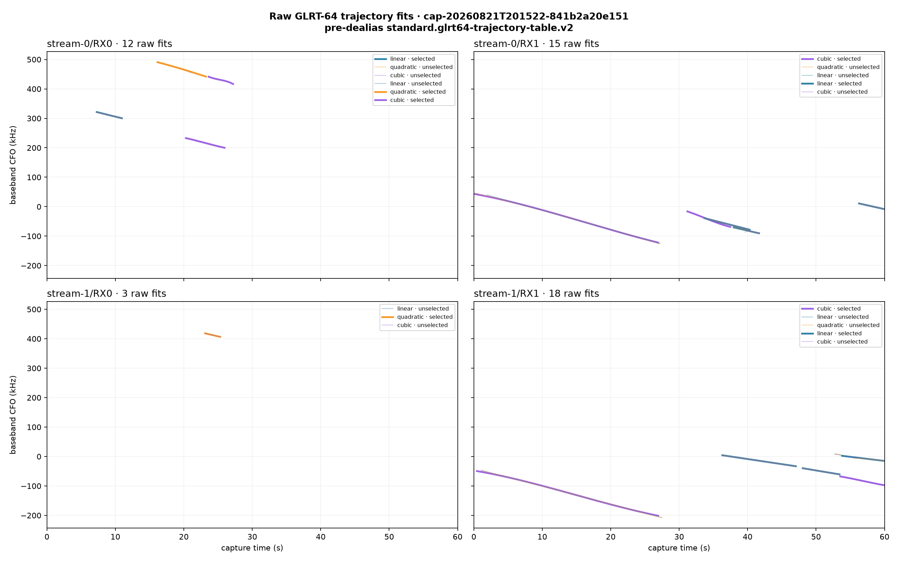

### Final tracks

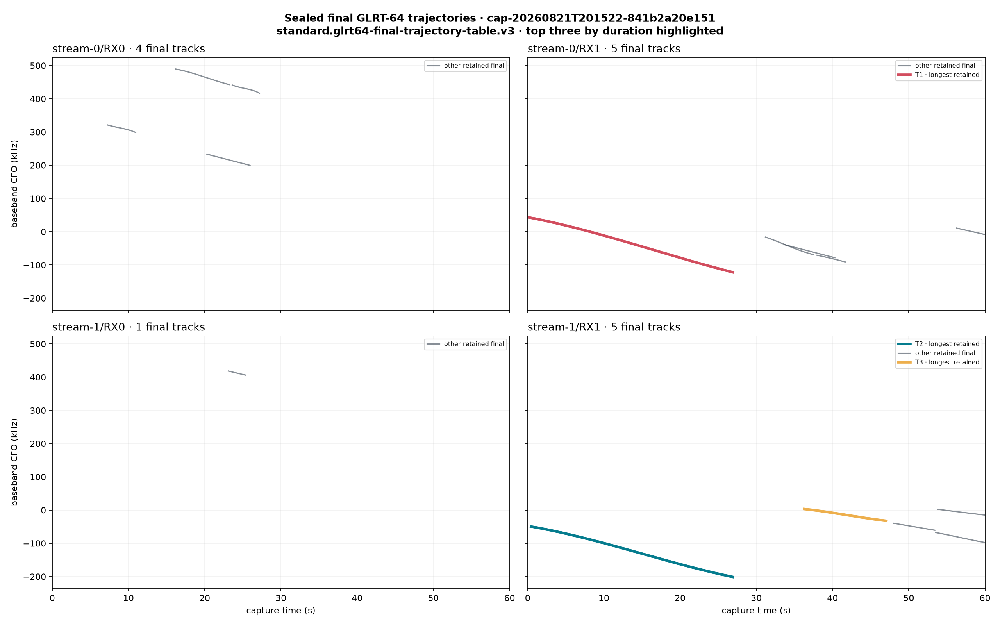

### Three longest final tracks

| Track | Path | Interval (s) | Duration | Observations | Degree | Median corrected GLRT | Replay | Cone satellites during track, closest rate first |
|---|---|---:|---:|---:|---:|---:|---|---|
| **T1** `48a58b5a` | stream-0/RX1 | 0.00–26.93 | 26.93 s | 819 | 3 | 0.3941 | automatic | STARLINK-11412, STARLINK-5663, STARLINK-30533, STARLINK-32200, STARLINK-36506, STARLINK-30379, STARLINK-30277, STARLINK-3312, STARLINK-35493, STARLINK-5451, STARLINK-5286 |
| **T2** `4663d9c7` | stream-1/RX1 | 0.45–26.92 | 26.48 s | 756 | 3 | 0.3451 | automatic | STARLINK-5663, STARLINK-11412, STARLINK-30533, STARLINK-32200, STARLINK-5451, STARLINK-36506, STARLINK-30277, STARLINK-3312, STARLINK-30379, STARLINK-35493, STARLINK-5286 |
| **T3** `c2051f6e` | stream-1/RX1 | 36.30–47.05 | 10.75 s | 124 | 3 | 0.0020 | automatic | STARLINK-5451, STARLINK-36506, STARLINK-30277, STARLINK-32200, STARLINK-30533, STARLINK-6218, STARLINK-37407, STARLINK-5286, STARLINK-36526, STARLINK-11412 |

Closest cone-restricted Doppler-rate shapes for each of these tracks:

- **T1**: STARLINK-11412 (1385.0 Hz/s RMS), STARLINK-5663 (1492.8 Hz/s RMS), STARLINK-30533 (2305.4 Hz/s RMS).
- **T2**: STARLINK-5663 (1314.8 Hz/s RMS), STARLINK-11412 (1373.9 Hz/s RMS), STARLINK-30533 (2208.9 Hz/s RMS).
- **T3**: STARLINK-5451 (345.2 Hz/s RMS), STARLINK-36506 (368.5 Hz/s RMS), STARLINK-30277 (380.0 Hz/s RMS).

### Satellites inside the 30° zenith cone

Intervals marked `≤` touch a capture boundary and may continue outside it.

| Starlink satellite | NORAD | Peak elevation | Visible capture interval(s) | Visible UTC interval(s) |
|---|---:|---:|---|---|
| STARLINK-11412 | 63062 | 66.2° | 1.40–37.38 s | 2026-08-21T20:15:25.415+00:00 to 2026-08-21T20:16:01.393+00:00 |
| STARLINK-30277 | 57645 | 81.3° | ≤0.00–60.00≤ s | 2026-08-21T20:15:24.015+00:00 to 2026-08-21T20:16:24.015+00:00 |
| STARLINK-30379 | 57811 | 63.8° | ≤0.00–19.67 s | 2026-08-21T20:15:24.015+00:00 to 2026-08-21T20:15:43.687+00:00 |
| STARLINK-30533 | 58037 | 73.2° | ≤0.00–51.60 s | 2026-08-21T20:15:24.015+00:00 to 2026-08-21T20:16:15.611+00:00 |
| STARLINK-32200 | 60258 | 70.6° | ≤0.00–49.82 s | 2026-08-21T20:15:24.015+00:00 to 2026-08-21T20:16:13.831+00:00 |
| STARLINK-3312 | 50850 | 62.3° | ≤0.00–28.80 s | 2026-08-21T20:15:24.015+00:00 to 2026-08-21T20:15:52.816+00:00 |
| STARLINK-35493 | 65928 | 80.1° | ≤0.00–25.24 s | 2026-08-21T20:15:24.015+00:00 to 2026-08-21T20:15:49.256+00:00 |
| STARLINK-36506 | 67414 | 78.8° | ≤0.00–60.00≤ s | 2026-08-21T20:15:24.015+00:00 to 2026-08-21T20:16:24.015+00:00 |
| STARLINK-36526 | 67508 | 66.3° | 39.56–60.00≤ s | 2026-08-21T20:16:03.574+00:00 to 2026-08-21T20:16:24.015+00:00 |
| STARLINK-37407 | 69534 | 71.2° | 43.88–60.00≤ s | 2026-08-21T20:16:07.896+00:00 to 2026-08-21T20:16:24.015+00:00 |
| STARLINK-5286 | 55294 | 88.1° | 16.10–60.00≤ s | 2026-08-21T20:15:40.113+00:00 to 2026-08-21T20:16:24.015+00:00 |
| STARLINK-5451 | 54771 | 62.5° | 20.45–53.02 s | 2026-08-21T20:15:44.468+00:00 to 2026-08-21T20:16:17.039+00:00 |
| STARLINK-5631 | 55346 | 60.4° | 59.15–60.00≤ s | 2026-08-21T20:16:23.163+00:00 to 2026-08-21T20:16:24.015+00:00 |
| STARLINK-5663 | 55347 | 60.5° | ≤0.00–0.89 s | 2026-08-21T20:15:24.015+00:00 to 2026-08-21T20:15:24.905+00:00 |
| STARLINK-6218 | 57368 | 81.9° | 29.64–60.00≤ s | 2026-08-21T20:15:53.656+00:00 to 2026-08-21T20:16:24.015+00:00 |

### TLE Doppler-rate overlay

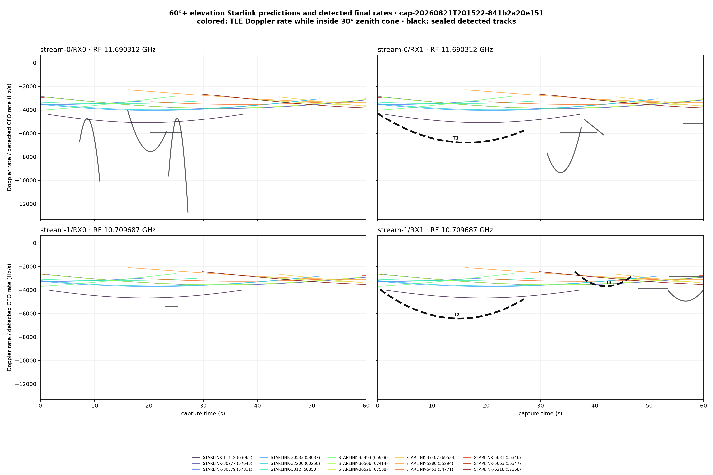

Black curves are all sealed final detected CFO-rate tracks; dashed black curves labelled T1–T3 are the three tracks in the table. Colored curves are shown only while the named satellite is inside the cone. Each receiver panel uses its actual tuned RF center.

## Dwell 2: `cap-20260821T193701-87f96f47e73f`

Sealed run: `capture-e19e3933f9ea4b079b2a7efa1a23baec`

Capture: `2026-08-21T19:37:03.687+00:00` to `2026-08-21T19:38:03.687+00:00`

Inventory: 52 raw GLRT fits, 17 final tracks, 14 Starlink satellites entering the cone.

### Raw GLRT tracks

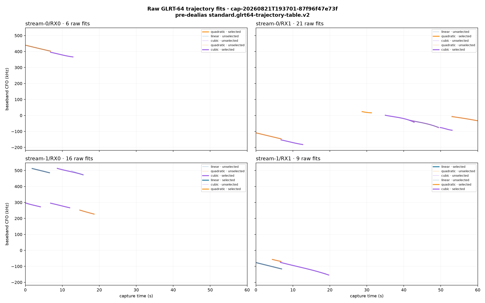

### Final tracks

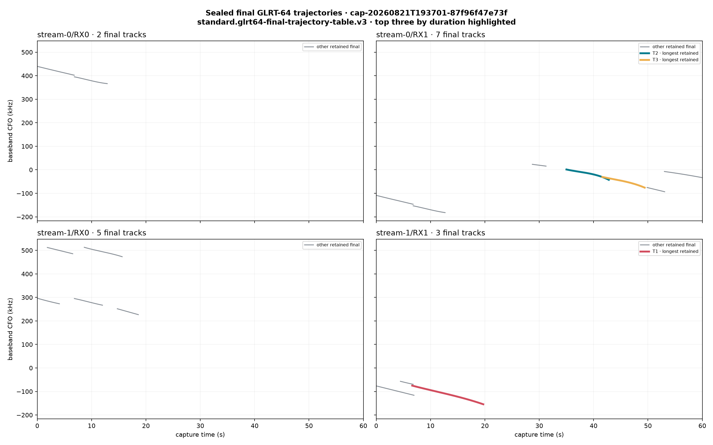

### Three longest final tracks

| Track | Path | Interval (s) | Duration | Observations | Degree | Median corrected GLRT | Replay | Cone satellites during track, closest rate first |
|---|---|---:|---:|---:|---:|---:|---|---|
| **T1** `8b192d1c` | stream-1/RX1 | 6.62–19.70 | 13.07 s | 319 | 3 | 0.2818 | automatic | STARLINK-11083, STARLINK-1413, STARLINK-36318, STARLINK-3999, STARLINK-31512, STARLINK-37603, STARLINK-35682, STARLINK-36451, STARLINK-36468, STARLINK-5422, STARLINK-34476, STARLINK-34291, STARLINK-30413, STARLINK-35808 |
| **T2** `777a12e7` | stream-0/RX1 | 35.00–42.80 | 7.80 s | 62 | 3 | 0.0010 | automatic | STARLINK-1413, STARLINK-35808, STARLINK-3999, STARLINK-36451, STARLINK-36318, STARLINK-34291, STARLINK-31512, STARLINK-34476 |
| **T3** `9cb8a8aa` | stream-0/RX1 | 41.60–49.40 | 7.80 s | 51 | 3 | 0.0012 | automatic | STARLINK-35808, STARLINK-3999, STARLINK-36318, STARLINK-36451, STARLINK-34291, STARLINK-31512, STARLINK-34476 |

Closest cone-restricted Doppler-rate shapes for each of these tracks:

- **T1**: STARLINK-11083 (1096.5 Hz/s RMS), STARLINK-1413 (2071.8 Hz/s RMS), STARLINK-36318 (2136.1 Hz/s RMS).
- **T2**: STARLINK-1413 (1291.4 Hz/s RMS), STARLINK-35808 (3042.5 Hz/s RMS), STARLINK-3999 (3099.7 Hz/s RMS).
- **T3**: STARLINK-35808 (2619.3 Hz/s RMS), STARLINK-3999 (2899.3 Hz/s RMS), STARLINK-36318 (3002.1 Hz/s RMS).

### Satellites inside the 30° zenith cone

Intervals marked `≤` touch a capture boundary and may continue outside it.

| Starlink satellite | NORAD | Peak elevation | Visible capture interval(s) | Visible UTC interval(s) |
|---|---:|---:|---|---|
| STARLINK-11083 | 59424 | 66.1° | ≤0.00–14.79 s | 2026-08-21T19:37:03.687+00:00 to 2026-08-21T19:37:18.482+00:00 |
| STARLINK-1413 | 45689 | 89.9° | ≤0.00–37.09 s | 2026-08-21T19:37:03.687+00:00 to 2026-08-21T19:37:40.778+00:00 |
| STARLINK-30413 | 57814 | 64.1° | ≤0.00–7.29 s | 2026-08-21T19:37:03.687+00:00 to 2026-08-21T19:37:10.975+00:00 |
| STARLINK-31512 | 59500 | 85.5° | ≤0.00–50.50 s | 2026-08-21T19:37:03.687+00:00 to 2026-08-21T19:37:54.191+00:00 |
| STARLINK-34291 | 64359 | 87.4° | ≤0.00–60.00≤ s | 2026-08-21T19:37:03.687+00:00 to 2026-08-21T19:38:03.687+00:00 |
| STARLINK-34476 | 64364 | 88.0° | ≤0.00–51.63 s | 2026-08-21T19:37:03.687+00:00 to 2026-08-21T19:37:55.320+00:00 |
| STARLINK-35682 | 66467 | 82.2° | ≤0.00–35.20 s | 2026-08-21T19:37:03.687+00:00 to 2026-08-21T19:37:38.892+00:00 |
| STARLINK-35808 | 68052 | 70.3° | 16.52–60.00≤ s | 2026-08-21T19:37:20.212+00:00 to 2026-08-21T19:38:03.687+00:00 |
| STARLINK-36318 | 68048 | 79.3° | ≤0.00–48.84 s | 2026-08-21T19:37:03.687+00:00 to 2026-08-21T19:37:52.523+00:00 |
| STARLINK-36451 | 67339 | 75.1° | ≤0.00–60.00≤ s | 2026-08-21T19:37:03.687+00:00 to 2026-08-21T19:38:03.687+00:00 |
| STARLINK-36468 | 67415 | 62.3° | ≤0.00–20.94 s | 2026-08-21T19:37:03.687+00:00 to 2026-08-21T19:37:24.627+00:00 |
| STARLINK-37603 | 69846 | 63.6° | ≤0.00–26.68 s | 2026-08-21T19:37:03.687+00:00 to 2026-08-21T19:37:30.371+00:00 |
| STARLINK-3999 | 52704 | 84.1° | ≤0.00–60.00≤ s | 2026-08-21T19:37:03.687+00:00 to 2026-08-21T19:38:03.687+00:00 |
| STARLINK-5422 | 54804 | 73.3° | ≤0.00–18.28 s | 2026-08-21T19:37:03.687+00:00 to 2026-08-21T19:37:21.972+00:00 |

### TLE Doppler-rate overlay

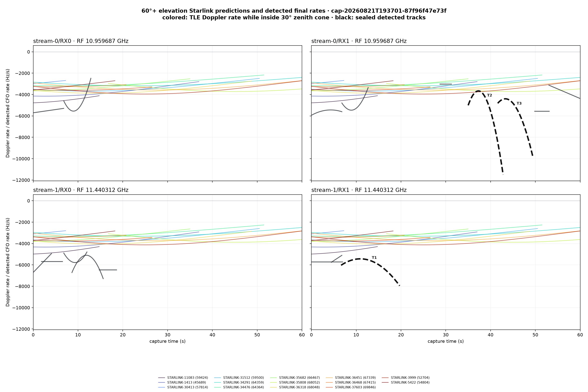

Black curves are all sealed final detected CFO-rate tracks; dashed black curves labelled T1–T3 are the three tracks in the table. Colored curves are shown only while the named satellite is inside the cone. Each receiver panel uses its actual tuned RF center.

## Dwell 3: `cap-20260821T193440-17c2e0ebef6a`

Sealed run: `capture-90ee94c2fc35408f9150f80df0db29cc`

Capture: `2026-08-21T19:34:42.311+00:00` to `2026-08-21T19:35:42.311+00:00`

Inventory: 33 raw GLRT fits, 11 final tracks, 13 Starlink satellites entering the cone.

### Raw GLRT tracks

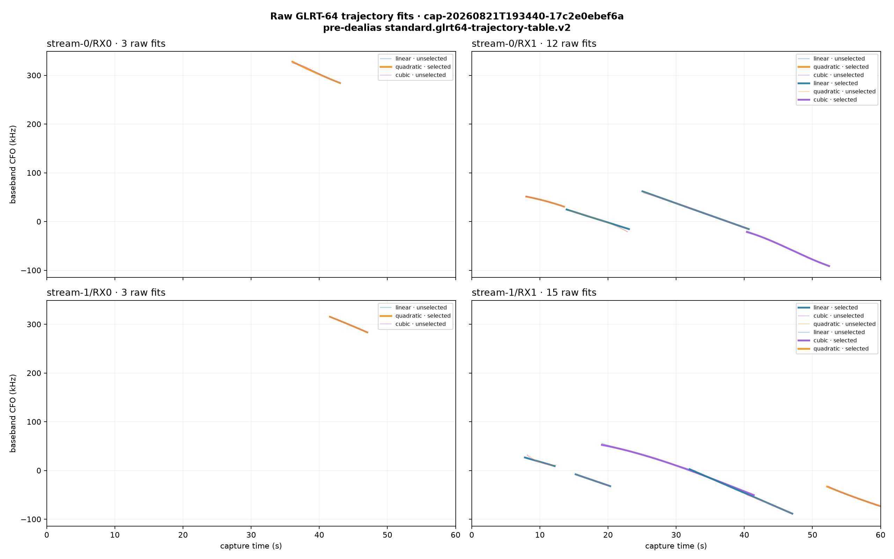

### Final tracks

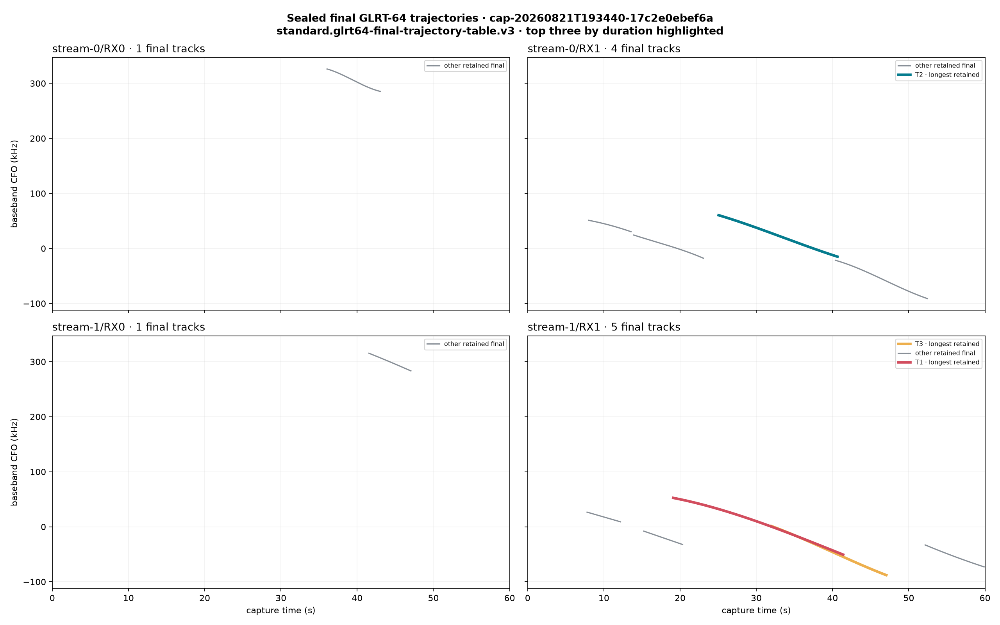

### Three longest final tracks

| Track | Path | Interval (s) | Duration | Observations | Degree | Median corrected GLRT | Replay | Cone satellites during track, closest rate first |
|---|---|---:|---:|---:|---:|---:|---|---|
| **T1** `e39dbc64` | stream-1/RX1 | 19.10–41.40 | 22.30 s | 662 | 3 | 0.3526 | automatic | STARLINK-32416, STARLINK-37589, STARLINK-6291, STARLINK-35371, STARLINK-6135, STARLINK-3844, STARLINK-36431, STARLINK-34901, STARLINK-4209 |
| **T2** `4d73b11c` | stream-0/RX1 | 25.05–40.65 | 15.60 s | 369 | 3 | 0.2406 | automatic | STARLINK-35371, STARLINK-3844, STARLINK-6135, STARLINK-36431, STARLINK-34901, STARLINK-6291, STARLINK-4209 |
| **T3** `436de28e` | stream-1/RX1 | 31.97–47.05 | 15.07 s | 445 | 3 | 0.3890 | automatic | STARLINK-6291, STARLINK-6135, STARLINK-34901, STARLINK-35371, STARLINK-4209, STARLINK-36431, STARLINK-3844 |

Closest cone-restricted Doppler-rate shapes for each of these tracks:

- **T1**: STARLINK-32416 (339.7 Hz/s RMS), STARLINK-37589 (524.6 Hz/s RMS), STARLINK-6291 (1350.4 Hz/s RMS).
- **T2**: STARLINK-35371 (1375.4 Hz/s RMS), STARLINK-3844 (1525.0 Hz/s RMS), STARLINK-6135 (1604.9 Hz/s RMS).
- **T3**: STARLINK-6291 (2402.2 Hz/s RMS), STARLINK-6135 (2494.0 Hz/s RMS), STARLINK-34901 (2619.1 Hz/s RMS).

### Satellites inside the 30° zenith cone

Intervals marked `≤` touch a capture boundary and may continue outside it.

| Starlink satellite | NORAD | Peak elevation | Visible capture interval(s) | Visible UTC interval(s) |
|---|---:|---:|---|---|
| STARLINK-11693 | 63763 | 62.0° | ≤0.00–2.16 s | 2026-08-21T19:34:42.311+00:00 to 2026-08-21T19:34:44.473+00:00 |
| STARLINK-31421 | 59218 | 64.5° | 53.03–60.00≤ s | 2026-08-21T19:35:35.341+00:00 to 2026-08-21T19:35:42.311+00:00 |
| STARLINK-31504 | 59303 | 63.6° | ≤0.00–5.29 s | 2026-08-21T19:34:42.311+00:00 to 2026-08-21T19:34:47.604+00:00 |
| STARLINK-32416 | 61589 | 65.8° | ≤0.00–19.83 s | 2026-08-21T19:34:42.311+00:00 to 2026-08-21T19:35:02.145+00:00 |
| STARLINK-32752 | 62567 | 68.3° | ≤0.00–18.54 s | 2026-08-21T19:34:42.311+00:00 to 2026-08-21T19:35:00.849+00:00 |
| STARLINK-34901 | 65207 | 65.6° | 33.16–60.00≤ s | 2026-08-21T19:35:15.468+00:00 to 2026-08-21T19:35:42.311+00:00 |
| STARLINK-35371 | 66484 | 84.2° | ≤0.00–58.94 s | 2026-08-21T19:34:42.311+00:00 to 2026-08-21T19:35:41.255+00:00 |
| STARLINK-36431 | 67421 | 61.0° | 19.46–40.14 s | 2026-08-21T19:35:01.767+00:00 to 2026-08-21T19:35:22.451+00:00 |
| STARLINK-37589 | 69839 | 60.0° | 17.78–21.39 s | 2026-08-21T19:35:00.093+00:00 to 2026-08-21T19:35:03.702+00:00 |
| STARLINK-3844 | 52705 | 79.2° | ≤0.00–45.68 s | 2026-08-21T19:34:42.311+00:00 to 2026-08-21T19:35:27.986+00:00 |
| STARLINK-4209 | 52855 | 75.3° | 28.94–60.00≤ s | 2026-08-21T19:35:11.249+00:00 to 2026-08-21T19:35:42.311+00:00 |
| STARLINK-6135 | 56539 | 76.3° | 16.42–60.00≤ s | 2026-08-21T19:34:58.734+00:00 to 2026-08-21T19:35:42.311+00:00 |
| STARLINK-6291 | 56547 | 62.4° | 3.59–35.47 s | 2026-08-21T19:34:45.905+00:00 to 2026-08-21T19:35:17.784+00:00 |

### TLE Doppler-rate overlay

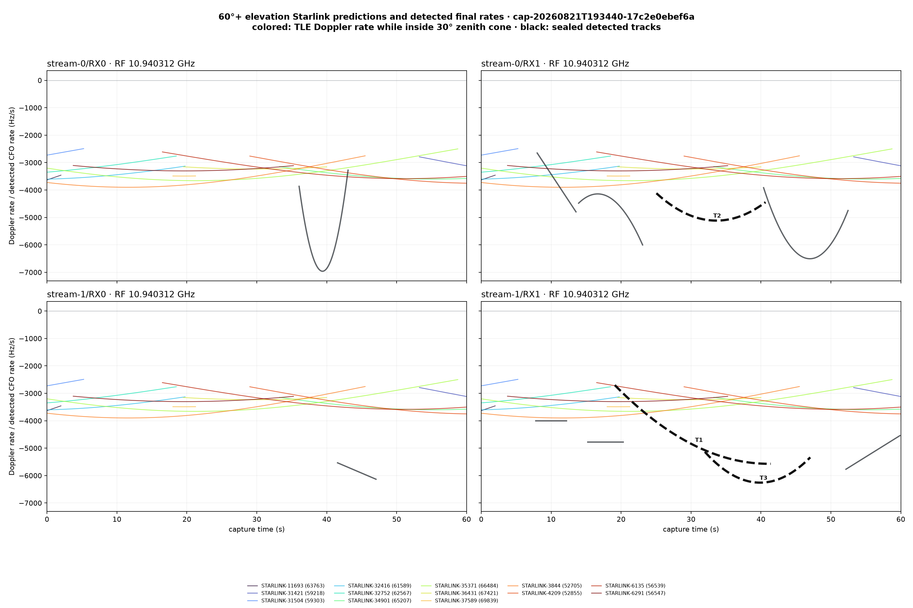

Black curves are all sealed final detected CFO-rate tracks; dashed black curves labelled T1–T3 are the three tracks in the table. Colored curves are shown only while the named satellite is inside the cone. Each receiver panel uses its actual tuned RF center.

## Dwell 4: `cap-20260821T190912-ffd441556880`

Sealed run: `capture-ea9a98e68a174cfeb5de46abf573b0e7`

Capture: `2026-08-21T19:09:13.968+00:00` to `2026-08-21T19:10:13.968+00:00`

Inventory: 30 raw GLRT fits, 10 final tracks, 12 Starlink satellites entering the cone.

### Raw GLRT tracks

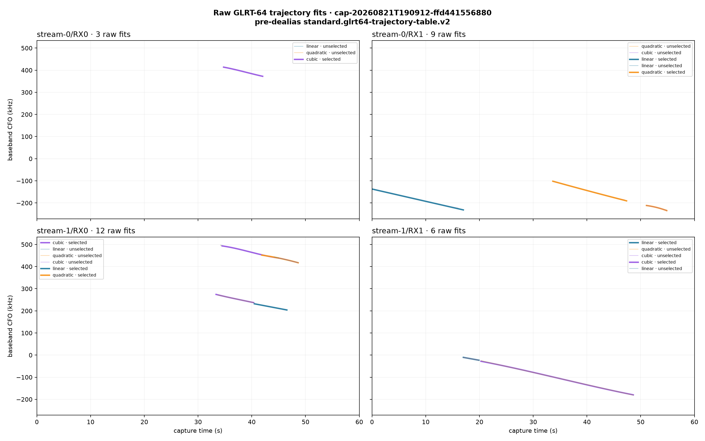

### Final tracks

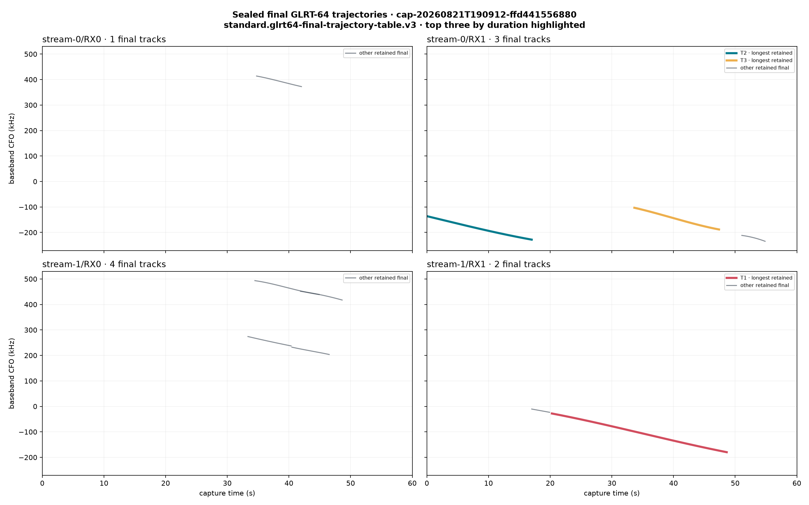

### Three longest final tracks

| Track | Path | Interval (s) | Duration | Observations | Degree | Median corrected GLRT | Replay | Cone satellites during track, closest rate first |
|---|---|---:|---:|---:|---:|---:|---|---|
| **T1** `9d1c112a` | stream-1/RX1 | 20.28–48.63 | 28.35 s | 929 | 3 | 0.5773 | automatic | STARLINK-11182, STARLINK-3935, STARLINK-34976, STARLINK-35466, STARLINK-33944, STARLINK-30823, STARLINK-3545, STARLINK-36458, STARLINK-1522, STARLINK-5327, STARLINK-5446 |
| **T2** `07c7e6c5` | stream-0/RX1 | 0.00–17.00 | 17.00 s | 532 | 3 | 0.4548 | automatic | STARLINK-11182, STARLINK-33944, STARLINK-3935, STARLINK-35466, STARLINK-5446, STARLINK-1522 |
| **T3** `4f68c980` | stream-0/RX1 | 33.65–47.37 | 13.73 s | 381 | 3 | 0.4373 | automatic | STARLINK-11182, STARLINK-34976, STARLINK-3935, STARLINK-30823, STARLINK-35466, STARLINK-3545, STARLINK-33944, STARLINK-36458, STARLINK-5327, STARLINK-5446 |

Closest cone-restricted Doppler-rate shapes for each of these tracks:

- **T1**: STARLINK-11182 (387.7 Hz/s RMS), STARLINK-3935 (1540.8 Hz/s RMS), STARLINK-34976 (1756.4 Hz/s RMS).
- **T2**: STARLINK-11182 (1039.4 Hz/s RMS), STARLINK-33944 (1642.9 Hz/s RMS), STARLINK-3935 (1747.3 Hz/s RMS).
- **T3**: STARLINK-11182 (1312.4 Hz/s RMS), STARLINK-34976 (1696.2 Hz/s RMS), STARLINK-3935 (2544.4 Hz/s RMS).

### Satellites inside the 30° zenith cone

Intervals marked `≤` touch a capture boundary and may continue outside it.

| Starlink satellite | NORAD | Peak elevation | Visible capture interval(s) | Visible UTC interval(s) |
|---|---:|---:|---|---|
| STARLINK-11182 | 60399 | 74.1° | 6.67–55.37 s | 2026-08-21T19:09:20.638+00:00 to 2026-08-21T19:10:09.338+00:00 |
| STARLINK-1522 | 46027 | 77.4° | ≤0.00–27.14 s | 2026-08-21T19:09:13.968+00:00 to 2026-08-21T19:09:41.105+00:00 |
| STARLINK-30823 | 58248 | 65.6° | 42.59–60.00≤ s | 2026-08-21T19:09:56.557+00:00 to 2026-08-21T19:10:13.968+00:00 |
| STARLINK-32729 | 62497 | 64.4° | 52.93–60.00≤ s | 2026-08-21T19:10:06.903+00:00 to 2026-08-21T19:10:13.968+00:00 |
| STARLINK-33944 | 64209 | 74.6° | ≤0.00–47.17 s | 2026-08-21T19:09:13.968+00:00 to 2026-08-21T19:10:01.140+00:00 |
| STARLINK-34976 | 65209 | 66.7° | 46.31–60.00≤ s | 2026-08-21T19:10:00.281+00:00 to 2026-08-21T19:10:13.968+00:00 |
| STARLINK-3545 | 51855 | 70.0° | 41.00–60.00≤ s | 2026-08-21T19:09:54.971+00:00 to 2026-08-21T19:10:13.968+00:00 |
| STARLINK-35466 | 66457 | 69.0° | 9.98–60.00≤ s | 2026-08-21T19:09:23.945+00:00 to 2026-08-21T19:10:13.968+00:00 |
| STARLINK-36458 | 67343 | 75.9° | 31.24–60.00≤ s | 2026-08-21T19:09:45.209+00:00 to 2026-08-21T19:10:13.968+00:00 |
| STARLINK-3935 | 52549 | 80.7° | ≤0.00–57.74 s | 2026-08-21T19:09:13.968+00:00 to 2026-08-21T19:10:11.711+00:00 |
| STARLINK-5327 | 55291 | 63.6° | 38.08–60.00≤ s | 2026-08-21T19:09:52.049+00:00 to 2026-08-21T19:10:13.968+00:00 |
| STARLINK-5446 | 54789 | 78.0° | ≤0.00–39.09 s | 2026-08-21T19:09:13.968+00:00 to 2026-08-21T19:09:53.055+00:00 |

### TLE Doppler-rate overlay

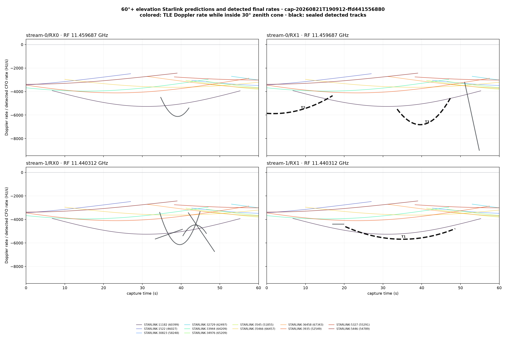

Black curves are all sealed final detected CFO-rate tracks; dashed black curves labelled T1–T3 are the three tracks in the table. Colored curves are shown only while the named satellite is inside the cone. Each receiver panel uses its actual tuned RF center.

## Dwell 5: `cap-20260821T190701-7a5d980ec1c6`

Sealed run: `capture-ef266427f2e044608b4ae0c8b6598413`

Capture: `2026-08-21T19:07:02.822+00:00` to `2026-08-21T19:08:02.822+00:00`

Inventory: 24 raw GLRT fits, 8 final tracks, 15 Starlink satellites entering the cone.

### Raw GLRT tracks

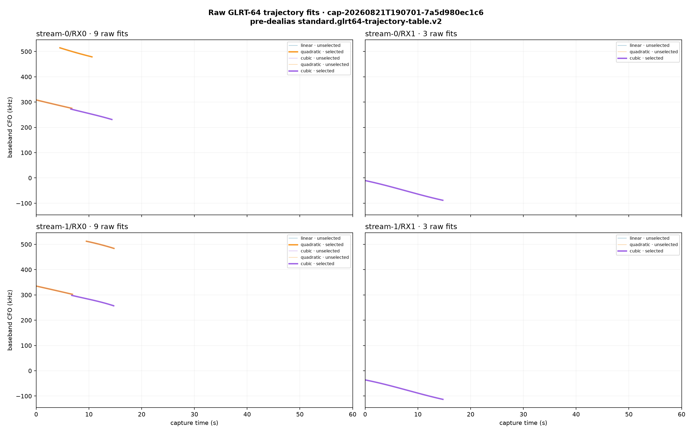

### Final tracks

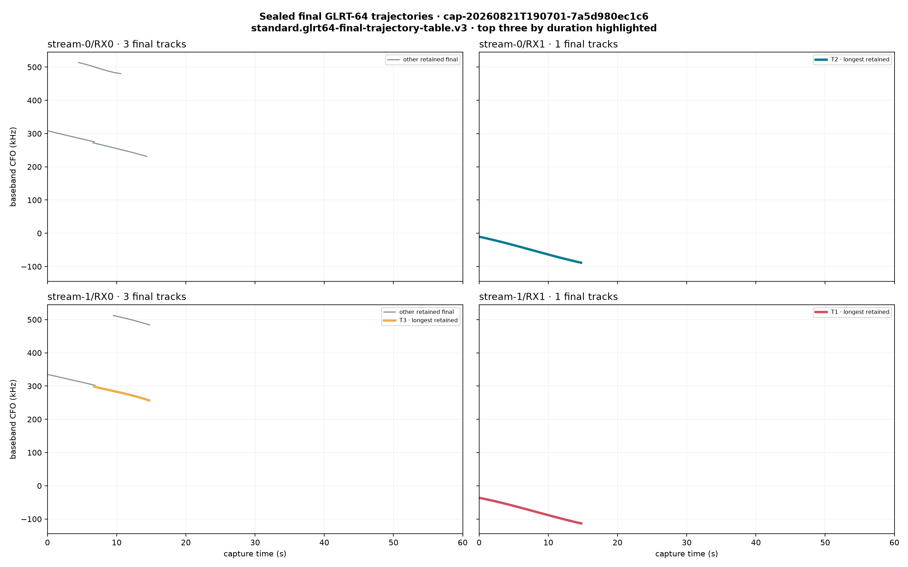

### Three longest final tracks

| Track | Path | Interval (s) | Duration | Observations | Degree | Median corrected GLRT | Replay | Cone satellites during track, closest rate first |
|---|---|---:|---:|---:|---:|---:|---|---|
| **T1** `df1c85bf` | stream-1/RX1 | 0.00–14.75 | 14.75 s | 568 | 3 | 0.7141 | automatic | STARLINK-31239, STARLINK-3659, STARLINK-32773, STARLINK-34302, STARLINK-31076, STARLINK-5665, STARLINK-36267, STARLINK-31480, STARLINK-36225, STARLINK-4530, STARLINK-34289, STARLINK-6252 |
| **T2** `c628cdfe` | stream-0/RX1 | 0.00–14.73 | 14.72 s | 576 | 3 | 0.7019 | automatic | STARLINK-31239, STARLINK-3659, STARLINK-32773, STARLINK-34302, STARLINK-31076, STARLINK-5665, STARLINK-36267, STARLINK-31480, STARLINK-36225, STARLINK-34289, STARLINK-4530, STARLINK-6252 |
| **T3** `af9166fd` | stream-1/RX0 | 6.75–14.70 | 7.95 s | 210 | 3 | 0.0041 | automatic | STARLINK-31239, STARLINK-3659, STARLINK-31480, STARLINK-32773, STARLINK-34302, STARLINK-31076, STARLINK-4530, STARLINK-36267, STARLINK-36225, STARLINK-5665, STARLINK-34289, STARLINK-6252 |

Closest cone-restricted Doppler-rate shapes for each of these tracks:

- **T1**: STARLINK-31239 (1298.4 Hz/s RMS), STARLINK-3659 (1532.2 Hz/s RMS), STARLINK-32773 (1576.6 Hz/s RMS).
- **T2**: STARLINK-31239 (1377.2 Hz/s RMS), STARLINK-3659 (1615.1 Hz/s RMS), STARLINK-32773 (1659.1 Hz/s RMS).
- **T3**: STARLINK-31239 (1292.1 Hz/s RMS), STARLINK-3659 (1485.9 Hz/s RMS), STARLINK-31480 (1513.9 Hz/s RMS).

### Satellites inside the 30° zenith cone

Intervals marked `≤` touch a capture boundary and may continue outside it.

| Starlink satellite | NORAD | Peak elevation | Visible capture interval(s) | Visible UTC interval(s) |
|---|---:|---:|---|---|
| STARLINK-11567 | 62909 | 61.9° | 31.04–52.46 s | 2026-08-21T19:07:33.862+00:00 to 2026-08-21T19:07:55.280+00:00 |
| STARLINK-30849 | 58245 | 65.1° | 47.73–60.00≤ s | 2026-08-21T19:07:50.556+00:00 to 2026-08-21T19:08:02.822+00:00 |
| STARLINK-31076 | 58736 | 75.4° | ≤0.00–51.52 s | 2026-08-21T19:07:02.822+00:00 to 2026-08-21T19:07:54.339+00:00 |
| STARLINK-31239 | 60093 | 80.9° | ≤0.00–49.63 s | 2026-08-21T19:07:02.822+00:00 to 2026-08-21T19:07:52.449+00:00 |
| STARLINK-31480 | 59306 | 62.2° | ≤0.00–11.91 s | 2026-08-21T19:07:02.822+00:00 to 2026-08-21T19:07:14.735+00:00 |
| STARLINK-32773 | 62571 | 83.5° | ≤0.00–55.21 s | 2026-08-21T19:07:02.822+00:00 to 2026-08-21T19:07:58.034+00:00 |
| STARLINK-34289 | 64225 | 87.0° | 9.08–60.00≤ s | 2026-08-21T19:07:11.898+00:00 to 2026-08-21T19:08:02.822+00:00 |
| STARLINK-34302 | 65216 | 64.5° | ≤0.00–35.15 s | 2026-08-21T19:07:02.822+00:00 to 2026-08-21T19:07:37.970+00:00 |
| STARLINK-36225 | 67207 | 89.4° | ≤0.00–60.00≤ s | 2026-08-21T19:07:02.822+00:00 to 2026-08-21T19:08:02.822+00:00 |
| STARLINK-36267 | 67198 | 88.8° | ≤0.00–50.27 s | 2026-08-21T19:07:02.822+00:00 to 2026-08-21T19:07:53.088+00:00 |
| STARLINK-3659 | 52001 | 70.1° | ≤0.00–46.75 s | 2026-08-21T19:07:02.822+00:00 to 2026-08-21T19:07:49.573+00:00 |
| STARLINK-4530 | 53393 | 67.2° | ≤0.00–10.89 s | 2026-08-21T19:07:02.822+00:00 to 2026-08-21T19:07:13.708+00:00 |
| STARLINK-5665 | 55361 | 76.0° | ≤0.00–23.98 s | 2026-08-21T19:07:02.822+00:00 to 2026-08-21T19:07:26.801+00:00 |
| STARLINK-6252 | 56555 | 89.0° | 11.69–60.00≤ s | 2026-08-21T19:07:14.516+00:00 to 2026-08-21T19:08:02.822+00:00 |
| STARLINK-6311 | 56537 | 66.4° | 49.43–60.00≤ s | 2026-08-21T19:07:52.252+00:00 to 2026-08-21T19:08:02.822+00:00 |

### TLE Doppler-rate overlay

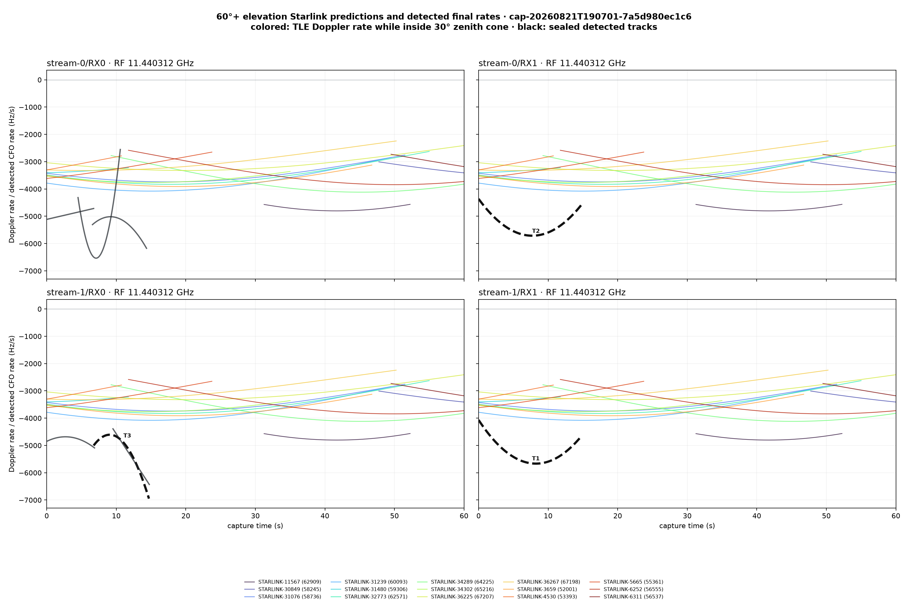

Black curves are all sealed final detected CFO-rate tracks; dashed black curves labelled T1–T3 are the three tracks in the table. Colored curves are shown only while the named satellite is inside the cone. Each receiver panel uses its actual tuned RF center.

## Provenance and limits

All raw and final JSON artifacts were re-read from immutable bulk storage and verified against their catalog SHA-256 digests. The local TLE reader likewise re-verifies its selected snapshot. The JSON evidence beside the figures records every source URI/digest, cone interval, top-track ordering, and rate residual.

GPS source: `reviewed spinnaker-sausalito preset; not capture-bound GPS authority`. The location is not capture-bound authority. The nominal first-sample estimate is used for each 60-second plot; the much wider recorded last-sample uncertainty is not drawn as extra capture duration. Satellite visibility means geometric TLE visibility within this zenith cone, not antenna gain, payload activity, or proof that a detected track came from that spacecraft.
