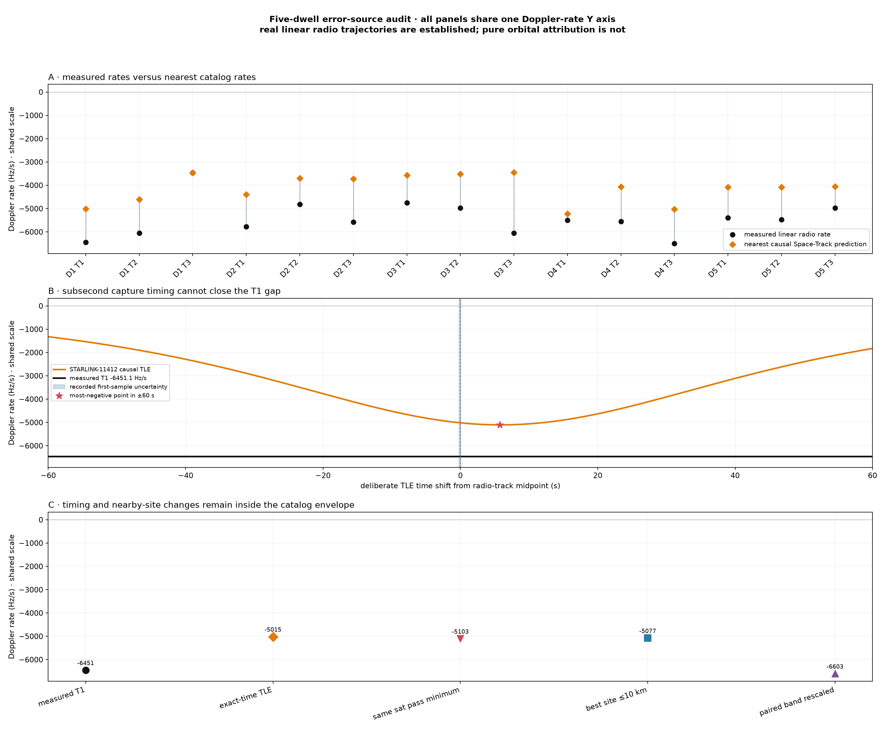
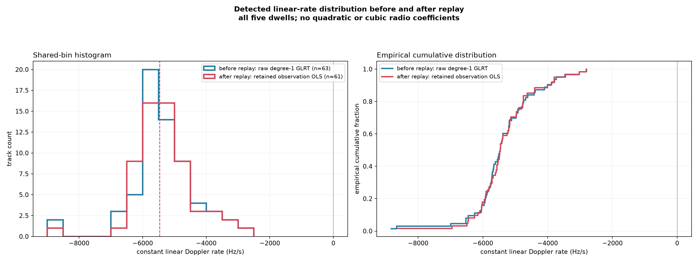
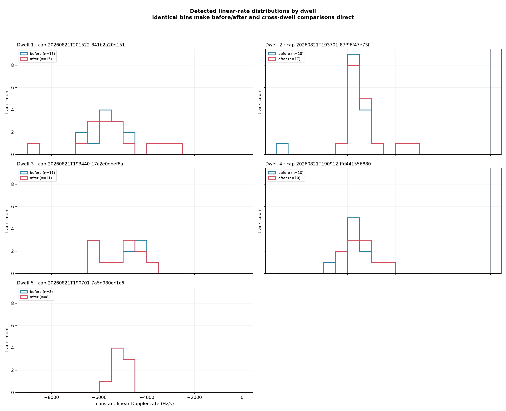
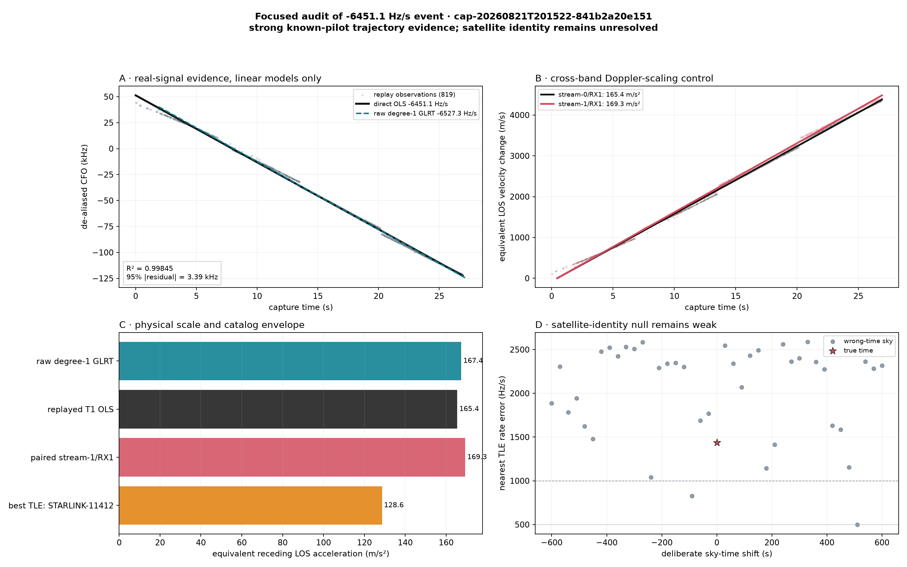

# Five-dwell linear radio-rate comparison with Starlink TLEs

## Result

This revision uses **only straight-line fits to radio CFO observations**. Each radio track contributes one constant rate in Hz/s. Quadratic and cubic radio coefficients are not evaluated anywhere in this report.

The satellite comparison follows the earlier `leo-tracker` slope review: at each track midpoint, every catalogued Starlink at elevation ≥10° is considered, and predicted rate is the two-second Doppler secant centered on that midpoint. Constant frequency bias is irrelevant because only slope is compared.

Across 15 inspected tracks, the median nearest true-time rate error is 1386.6 Hz/s. The corresponding median across 600 deliberately wrong-time controls is 1333.0 Hz/s. 3/15 true times fall at or below the 5th percentile of their own wrong-time controls. A close rate is compatibility evidence only; the null comparison determines whether it is time-specific.

### Observer assumption

All TLE predictions use the reviewed `spinnaker-sausalito` WGS-84 preset: **37.858988° latitude, -122.478103° longitude, -29 m ellipsoidal altitude**. This is not a GPS position embedded in, or otherwise bound to, these captures. The location sensitivity audit below therefore tests every direction out to 10 km from the preset.

The left panel compares nearest-match distributions. The right panel gives each true time's lower-tail empirical percentile among 40 wrong-time skies. Smaller is better; 2.44% is the smallest resolvable value with 40 controls.

## What is real, and where the remaining error most likely lives

The 5,000+ Hz/s observations are real **linear known-pilot CFO trajectories** within the recorded radio data. The unresolved step is interpreting the entire measured CFO slope as one-way geometric orbital Doppler. These are different claims, and the evidence strongly supports only the first so far.

Every panel above uses the same Doppler-rate Y axis. The connected points in panel A show that most long radio tracks are systematically more negative than their nearest causal Space-Track prediction, rather than being random weak detections.

| Hypothesis | Direct check | Assessment |
|---|---|---|
| Radio signal is not real | Raw degree-1 GLRT and replayed OLS differ by only 76.3 Hz/s; replay R² is 0.998446. | Strongly disfavored. |
| Capture timezone or synchronization | All times are UTC. Four path-start estimates span 0.09 ms; the full first-sample bound is 261.8 ms. | Far too small to explain a 1.4 kHz/s rate gap. |
| TLE along-track timing | At the correct time, STARLINK-11412 predicts -5015.1 Hz/s. Moving anywhere through its ±60 s pass reaches only -5103.1 Hz/s at Δt=+5.75 s. | Timing shift cannot make this satellite reach the measured rate. |
| Wrong elevation cut | The same best object remains nearest from 0° through 60° minimum elevation and is already at 65.4°. | Not caused by using only the zenith cone. |
| Observer location | Moving the observer anywhere within 10 km changes the candidate prediction only to -5076.8–-4951.1 Hz/s. | A plausible Sausalito position error is insufficient. |
| Wrong RF scale | The actual tuned RF is 11.690 GHz; forcing the best geometry to match requires 15.04 GHz. | A channel-center error cannot supply the missing 28.6%. |
| Independent-radio consistency | The simultaneous second-band track gives 169.3 versus 165.4 m/s², a 2.32% difference. | Supports a real shared event, but both paths can contain a transmitter-side or common estimator term. |

The leading explanations are therefore: **(1)** measured pilot CFO rate contains a non-orbital term such as Starlink transmitter/beam frequency steering or LNB drift; **(2)** the transmitting spacecraft is absent or materially wrong in the causal TLE snapshot; or **(3)** the pilot estimator's Hz/s scale has a systematic bias that must be tested by end-to-end synthetic injection. Ordinary timezone, subsecond synchronization, nearby observer-position, cone-cut, and channel-center errors do not fit the observed scale.

## Comparison with the earlier `leo-tracker` analysis

A read-only audit of the reference repository found that it also measured large negative linear rates, but did **not** establish satellite identities for most of them. Its 90-track scalar-rate review spanned −9781.6 to +8824.0 Hz/s. Seventeen tracks were between −6500 and −5000 Hz/s; only 4/17 had a visible catalog rate within 500 Hz/s and 5/17 within 1000 Hz/s. Their median nearest-catalog error was 1422.8 Hz/s.

| Question | Earlier `leo-tracker` | This report |
|---|---|---|
| Did it see this rate regime? | Yes. The closest analogue was −6445.209 Hz/s for 3.276 s. | Yes. T1 is −6451.097 Hz/s for 26.925 s with R² = 0.998446. |
| Did that event match a satellite? | No. Nearest prediction −3765.270 Hz/s; 2679.940 Hz/s error at 79.68° elevation. | No secure identity. Nearest causal prediction −5015.1 Hz/s; 1436.0 Hz/s error. |
| Early association | Average measured versus predicted slope; no absolute CFO; rise/culmination/set interpolation; permissive 2500 Hz/s tolerance. | Exact two-second midpoint rate against every visible object, plus wrong-time nulls and horizon sensitivity. |
| Stronger association design | Full SGP4 curves, simultaneous dual receiver epochs, per-channel offsets, drift bounded to ±200 Hz/s, temporal train/holdout, and ±2.5 s epoch search. No successful mature high-rate artifact was found locally. | Not yet applied to these five dwells; their short constant-rate arcs contain little identity-bearing curvature. |
| TLE provenance | Early review used a later-retrieved Hugging Face mirror; 67/90 captures preceded catalog retrieval, despite pre-capture element epochs. Later code added causal Space-Track selection. | Strictly causal Space-Track snapshot collected before capture, with snapshot and element ages reported. |
| Detection population | A hybrid watcher default could forward events even when Doppler gates failed, so the population was not a clean orbital truth set. | Raw degree-1 GLRT tracks and retained replay fits are shown separately; neither is labeled a satellite identity. |

The earlier repository's own strongest 25-second review reported that a straight line beat every sampled SGP4 path, with many nearly tied TLEs, and reported zero orbital-shape-qualified tracks. The lesson is not that these radio trajectories are unreal; it is that **constant rate alone is weak satellite identity evidence**, even for a high-quality signal.

The legacy observer (37.849165°, −122.485677°) is about 1.28 km from the preset used here. Re-evaluating the current best candidate at that site changes its predicted rate by only about 8 Hz/s, so the site difference does not close the 1436 Hz/s gap.

### Highest-value next diagnostics

1. Run end-to-end synthetic known-pilot injections at ±5.0 and ±6.5 kHz/s through acquisition, de-aliasing, replay, and fitting. This directly tests sample-index-to-seconds and bin-to-Hz scale without fitting radio curvature.
2. Compare against later Space-Track snapshots as a clearly labeled retrospective diagnostic—not as causal evidence—to look for missing, newly catalogued, or maneuvering low-shell spacecraft.
3. Audit pilot ambiguity lifting for a deterministic frame-to-frame linear ramp. Explaining −5015 as −6451 by time scale alone would require an implausible 22.3% compression.
4. Use simultaneous bands to separate a geometric fractional shift from transmitter frequency steering, beam handoff, and independent receiver/LNB terms. The present two-band agreement makes an isolated weak detection unlikely, but does not distinguish orbit from a common transmitted term.
5. Acquire identity-bearing evidence: a longer uninterrupted arc with measurable orbital-rate evolution, decoded satellite-specific information, or an independently constrained pointing/beam observation.

## Detected rate distributions before and after replay

The comparison is deliberately like-for-like: **before replay** contains only raw degree-1 GLRT candidates, while **after replay** contains fresh degree-1 OLS fits to all retained de-aliased observation sets. No slope from a quadratic or cubic radio polynomial enters either population.

| Population | Tracks | Median | 25th–75th percentile | Minimum–maximum |
|---|---:|---:|---:|---:|
| Before replay | 63 | -5468.9 Hz/s | -5832.7 to -4909.6 Hz/s | -8836.1 to -2801.8 Hz/s |
| After replay | 61 | -5470.3 Hz/s | -5819.6 to -4925.7 Hz/s | -8630.7 to -2808.8 Hz/s |

Dashed vertical lines mark medians. The right-hand ECDF avoids conclusions that depend on histogram bin boundaries.

All dwell panels use the same bin edges, X axis, and Y axis.

## TLE snapshot selection and age

The generator requires **Space-Track** and uses the newest immutable snapshot whose collection timestamp is **at or before the capture start**. A post-capture snapshot is rejected even when it is closer in absolute time. Today's latest TLE is never propagated backward for this report.

All five selected archive entries contain the same verified payload digest: `sha256:349b985cb345e2f87e9bdbbbe47caac1cbd48062eda71d308eb4fca5cdd50393`. Dwell 1 uses the 20:02 UTC collection; dwells 2–5 use the 19:01 UTC collection. Every selection is therefore strictly causal with respect to its capture.

| Dwell | Selected TLE collection | Age at capture start | Latest collection at or before capture | Same payload? |
|---:|---|---:|---|---:|
| 1 | 2026-08-21T20:02:09.960+00:00 (`space-track`) | 13.2 min before capture start | 2026-08-21T20:02:09.960+00:00 | yes |
| 2 | 2026-08-21T19:01:38.807+00:00 (`space-track`) | 35.4 min before capture start | 2026-08-21T19:01:38.807+00:00 | yes |
| 3 | 2026-08-21T19:01:38.807+00:00 (`space-track`) | 33.1 min before capture start | 2026-08-21T19:01:38.807+00:00 | yes |
| 4 | 2026-08-21T19:01:38.807+00:00 (`space-track`) | 7.6 min before capture start | 2026-08-21T19:01:38.807+00:00 | yes |
| 5 | 2026-08-21T19:01:38.807+00:00 (`space-track`) | 5.4 min before capture start | 2026-08-21T19:01:38.807+00:00 | yes |

The collection age above describes the archive snapshot. Each object inside that snapshot has its own orbital element epoch. Candidate tables below list the absolute element-epoch age at the radio-track midpoint; the full digest and nanosecond timestamps remain in the adjacent JSON evidence.

## Method and terminology

| Term | Meaning |
|---|---|
| Radio CFO | De-aliased frequency-offset observations in Hz. |
| Measured radio rate | Slope of one degree-1 OLS fit through those CFO observations. It is constant over the track. |
| Formal slope SE | Ordinary least-squares standard error. It does not correct for serial correlation and is descriptive only. |
| Half-to-half change | Second-half linear slope minus first-half linear slope; a simple stability diagnostic, not curvature. |
| TLE snapshot age | Difference between archive collection time and capture start; direction is stated explicitly. |
| TLE element age | Absolute difference between one satellite element epoch and the radio-track midpoint. |
| Predicted satellite rate | TLE/SGP4 Doppler change from midpoint −1 s to midpoint +1 s, divided by 2 s. |
| Zenith angle | 90° minus elevation; 0° is directly overhead and 80° is the 10° horizon cut. |
| Nearest rate error | Absolute difference between measured and predicted rates. |
| Wrong-time null | The same measured radio rate compared with skies shifted every 30 s from −600 to +600 s, excluding zero. |
| Empirical p | `(1 + null errors ≤ true error) / 41`; small values mean the true time is unusually good. |

The retained final-track artifact is used only to choose observation membership and the constant de-alias lift. Any sealed nonlinear radio coefficients are explicitly ignored. Raw-track figures likewise show degree-1 GLRT candidates only.

## Cohort

Observer: 37.858988, -122.478103, -29 m. GPS source: `reviewed spinnaker-sausalito preset; not capture-bound GPS authority`.

| Dwell | UTC capture | Raw linear / all raw | Final tracks | TLE objects |
|---|---|---:|---:|---:|
| `cap-20260821T201522-841b2a20e151` | 2026-08-21T20:15:24.015+00:00–2026-08-21T20:16:24.015+00:00 | 16 / 48 | 15 | 10976 |
| `cap-20260821T193701-87f96f47e73f` | 2026-08-21T19:37:03.687+00:00–2026-08-21T19:38:03.687+00:00 | 18 / 52 | 17 | 10976 |
| `cap-20260821T193440-17c2e0ebef6a` | 2026-08-21T19:34:42.311+00:00–2026-08-21T19:35:42.311+00:00 | 11 / 33 | 11 | 10976 |
| `cap-20260821T190912-ffd441556880` | 2026-08-21T19:09:13.968+00:00–2026-08-21T19:10:13.968+00:00 | 10 / 30 | 10 | 10976 |
| `cap-20260821T190701-7a5d980ec1c6` | 2026-08-21T19:07:02.822+00:00–2026-08-21T19:08:02.822+00:00 | 8 / 24 | 8 | 10976 |

## Dwell 1: `cap-20260821T201522-841b2a20e151`

### Raw GLRT tracks — linear candidates only

All four receiver-path panels share one CFO Y axis.

### Retained tracks refit linearly from observations

All four receiver-path panels share one CFO Y axis.

### Top-three measured rates and controls

| Track | Path | Duration | Obs. | Constant rate | CFO RMS | Half-to-half Δ | Visible | ≤500 | Best error | True-time p / rank |
|---|---|---:|---:|---:|---:|---:|---:|---:|---:|---:|
| **T1** | `stream-0/RX1` | 26.93 s | 819 | -6451.1 Hz/s | 1818.8 Hz | -444.2 Hz/s | 207 | 0 | 1436.0 Hz/s | 17.1% / 7/41 |
| **T2** | `stream-1/RX1` | 26.48 s | 756 | -6048.8 Hz/s | 1697.5 Hz | -185.1 Hz/s | 207 | 0 | 1448.4 Hz/s | 14.6% / 6/41 |
| **T3** | `stream-1/RX1` | 10.75 s | 124 | -3457.3 Hz/s | 836.9 Hz | +12.0 Hz/s | 207 | 7 | 0.6 Hz/s | 4.9% / 2/41 |

### Focused audit: -6451.1 Hz/s

This is strong evidence for a real coherent **Starlink-format known-pilot trajectory**, but it is not yet a spacecraft identification. The raw GLRT detection and replayed observations independently support essentially the same straight-line rate.

| Check | Result |
|---|---|
| Raw degree-1 GLRT | -6527.3 Hz/s over 25.30 s; RMS 1246.3 Hz |
| Replayed observation OLS | -6451.1 Hz/s over 26.925 s; R² 0.998446 |
| Raw-to-replayed rate difference | +76.3 Hz/s (1.18%) |
| RF center used for conversion | 11.690312500 GHz; frequency reference `uncalibrated_prior` |
| Total fitted CFO sweep | -173,696 Hz |
| Fractional frequency rate | -0.551833 ppm/s |
| Equivalent LOS range acceleration | 165.4 m/s², using `a_r = -c f_dot / f_c` |
| Illustrative straight-line closest-range scale | 340–358 km for 7.5–7.7 km/s |

The closest-range scale is an intuition aid, not an orbital inversion: it omits Earth geometry and the accelerations of both the spacecraft and rotating observer.

#### Exact-time TLE catalog test

The nearest catalogued visible rate is **STARLINK-11412 (NORAD 63062)** at altitude 351.6 km. Its element epoch is 2026-08-21T15:25:38.479+00:00, 4.83 h from the track midpoint. It is at elevation 65.4°, and slant range 392.7 km. Its prediction is -5015.1 Hz/s—still 1436.0 Hz/s from the measured rate. No visible catalog object is within 500 or 1,000 Hz/s. The true sky ranks 7th among true time plus 40 wrong-time controls (empirical p = 17.1%).

Starlink's published constellation plan confirms that 330–370 km shells exist or are planned, so the physical scale in the supplied hypothesis is useful. But this timestamped catalog already includes a 351.6 km candidate: its 65° geometry does not produce the observed rate. A missing or badly timed near-zenith low-shell object could; the current catalog does not show one. If the best candidate's geometry were exact, matching the measured rate would require an effective carrier of 15.04 GHz, far outside the tuned Starlink channel.

| Minimum elevation | Visible catalog objects | Best satellite | Predicted rate | Absolute gap |
|---:|---:|---|---:|---:|
| 0° | 489 | STARLINK-11412 (63062) | -5015.1 Hz/s | 1436.0 Hz/s |
| 5° | 317 | STARLINK-11412 (63062) | -5015.1 Hz/s | 1436.0 Hz/s |
| 10° | 207 | STARLINK-11412 (63062) | -5015.1 Hz/s | 1436.0 Hz/s |
| 20° | 100 | STARLINK-11412 (63062) | -5015.1 Hz/s | 1436.0 Hz/s |
| 30° | 45 | STARLINK-11412 (63062) | -5015.1 Hz/s | 1436.0 Hz/s |
| 60° | 8 | STARLINK-11412 (63062) | -5015.1 Hz/s | 1436.0 Hz/s |

#### Simultaneous cross-band control

A simultaneous track on `stream-1/RX1` overlaps for 26.475 s and measures -6048.8 Hz/s at its own RF center. After normalizing by carrier, the inferred range accelerations differ by 2.32%. That is useful evidence for a shared kinematic-scale event across two physical radios/bands, though it is not exact common-source proof.

The remaining explanations to test are: incomplete/stale TLE association, timestamp or observer-position error, transmitter frequency control/beam handoff, and receiver/LNB frequency dynamics. A waveform-family detection by itself cannot name a satellite because the Starlink edge pilots repeat across frames, beams, channels, and spacecraft.

Sources: [Starlink constellation altitudes](https://space-safety.starlink.com/docs/space-safety-articles/constellation_altitudes/), [Qin et al. pilot analysis](https://arxiv.org/abs/2602.02627), and [Kassas et al. Starlink PNT paper](https://people.engineering.osu.edu/media/document/2025-08-06/kassas_unveiling_starlink_for_pnt.pdf).

### Satellite rate field versus zenith angle

Gray points are all Starlinks above 10° at the track midpoint. The black line is the single measured radio rate; colored rings mark the five nearest rate matches. All three track panels share one rate Y axis.

### Full-capture overlay

Black is constant by construction and is drawn only across the radio track. Colored curves are the three nearest TLE-predicted rates and may vary with time; their curvature is orbital prediction, not a nonlinear radio estimate. All three track panels share one rate Y axis.

### Wrong-time null controls

Zero seconds is the true sky. The other 40 points deliberately use the wrong sky time. A compelling scalar-rate match should have an unusually small zero-time error and limited match multiplicity. Error panels share one Y axis; multiplicity panels share a separate common Y axis.

### Five nearest satellites per track

| Track | Rank | Satellite | NORAD | Elevation | Zenith angle | TLE element epoch | Element age | Predicted rate | Signed error |
|---|---:|---|---:|---:|---:|---|---:|---:|---:|
| T1 | 1 | STARLINK-11412 | 63062 | 65.42° | 24.58° | 2026-08-21T15:25:38.479+00:00 | 4.83 h | -5015.1 Hz/s | -1436.0 Hz/s |
| T1 | 2 | STARLINK-30533 | 58037 | 72.03° | 17.97° | 2026-08-21T02:51:23.261+00:00 | 17.40 h | -3986.4 Hz/s | -2464.7 Hz/s |
| T1 | 3 | STARLINK-32200 | 60258 | 69.52° | 20.48° | 2026-08-21T08:44:55.392+00:00 | 11.51 h | -3921.9 Hz/s | -2529.2 Hz/s |
| T1 | 4 | STARLINK-3312 | 50850 | 62.33° | 27.67° | 2026-08-20T21:59:52.420+00:00 | 22.26 h | -3485.7 Hz/s | -2965.4 Hz/s |
| T1 | 5 | STARLINK-36506 | 67414 | 70.82° | 19.18° | 2026-08-21T10:20:08.428+00:00 | 9.92 h | -3478.3 Hz/s | -2972.8 Hz/s |
| T2 | 1 | STARLINK-11412 | 63062 | 65.48° | 24.52° | 2026-08-21T15:25:38.479+00:00 | 4.83 h | -4600.4 Hz/s | -1448.4 Hz/s |
| T2 | 2 | STARLINK-30533 | 58037 | 72.10° | 17.90° | 2026-08-21T02:51:23.261+00:00 | 17.40 h | -3655.8 Hz/s | -2393.0 Hz/s |
| T2 | 3 | STARLINK-32200 | 60258 | 69.58° | 20.42° | 2026-08-21T08:44:55.392+00:00 | 11.51 h | -3596.8 Hz/s | -2451.9 Hz/s |
| T2 | 4 | STARLINK-36506 | 67414 | 70.96° | 19.04° | 2026-08-21T10:20:08.428+00:00 | 9.92 h | -3194.2 Hz/s | -2854.6 Hz/s |
| T2 | 5 | STARLINK-3312 | 50850 | 62.32° | 27.68° | 2026-08-20T21:59:52.420+00:00 | 22.26 h | -3193.0 Hz/s | -2855.8 Hz/s |
| T3 | 1 | STARLINK-36506 | 67414 | 76.46° | 13.54° | 2026-08-21T10:20:08.428+00:00 | 9.93 h | -3456.7 Hz/s | -0.6 Hz/s |
| T3 | 2 | STARLINK-30277 | 57645 | 78.78° | 11.22° | 2026-08-21T15:17:12.402+00:00 | 4.98 h | -3488.5 Hz/s | +31.2 Hz/s |
| T3 | 3 | STARLINK-30533 | 58037 | 65.84° | 24.16° | 2026-08-21T02:51:23.261+00:00 | 17.41 h | -3248.4 Hz/s | -208.9 Hz/s |
| T3 | 4 | STARLINK-32200 | 60258 | 64.38° | 25.62° | 2026-08-21T08:44:55.392+00:00 | 11.52 h | -3237.4 Hz/s | -219.9 Hz/s |
| T3 | 5 | STARLINK-5451 | 54771 | 62.24° | 27.76° | 2026-08-21T10:16:56.428+00:00 | 9.99 h | -3232.7 Hz/s | -224.7 Hz/s |

## Dwell 2: `cap-20260821T193701-87f96f47e73f`

### Raw GLRT tracks — linear candidates only

All four receiver-path panels share one CFO Y axis.

### Retained tracks refit linearly from observations

All four receiver-path panels share one CFO Y axis.

### Top-three measured rates and controls

| Track | Path | Duration | Obs. | Constant rate | CFO RMS | Half-to-half Δ | Visible | ≤500 | Best error | True-time p / rank |
|---|---|---:|---:|---:|---:|---:|---:|---:|---:|---:|
| **T1** | `stream-1/RX1` | 13.07 s | 319 | -5768.5 Hz/s | 850.9 Hz | -348.5 Hz/s | 198 | 0 | 1368.3 Hz/s | 29.3% / 12/41 |
| **T2** | `stream-0/RX1` | 7.80 s | 62 | -4812.5 Hz/s | 2102.0 Hz | -2389.3 Hz/s | 202 | 0 | 1111.7 Hz/s | 78.0% / 32/41 |
| **T3** | `stream-0/RX1` | 7.80 s | 51 | -5571.9 Hz/s | 1603.5 Hz | -2223.7 Hz/s | 200 | 0 | 1852.3 Hz/s | 75.6% / 31/41 |

### Satellite rate field versus zenith angle

Gray points are all Starlinks above 10° at the track midpoint. The black line is the single measured radio rate; colored rings mark the five nearest rate matches. All three track panels share one rate Y axis.

### Full-capture overlay

Black is constant by construction and is drawn only across the radio track. Colored curves are the three nearest TLE-predicted rates and may vary with time; their curvature is orbital prediction, not a nonlinear radio estimate. All three track panels share one rate Y axis.

### Wrong-time null controls

Zero seconds is the true sky. The other 40 points deliberately use the wrong sky time. A compelling scalar-rate match should have an unusually small zero-time error and limited match multiplicity. Error panels share one Y axis; multiplicity panels share a separate common Y axis.

### Five nearest satellites per track

| Track | Rank | Satellite | NORAD | Elevation | Zenith angle | TLE element epoch | Element age | Predicted rate | Signed error |
|---|---:|---|---:|---:|---:|---|---:|---:|---:|
| T1 | 1 | STARLINK-11083 | 59424 | 60.94° | 29.06° | 2026-08-21T08:22:30.429+00:00 | 11.25 h | -4400.2 Hz/s | -1368.3 Hz/s |
| T1 | 2 | STARLINK-1413 | 45689 | 80.03° | 9.97° | 2026-08-21T12:49:49.411+00:00 | 6.79 h | -4156.7 Hz/s | -1611.8 Hz/s |
| T1 | 3 | STARLINK-36318 | 68048 | 79.17° | 10.83° | 2026-08-21T08:07:06.316+00:00 | 11.50 h | -4048.3 Hz/s | -1720.1 Hz/s |
| T1 | 4 | STARLINK-3999 | 52704 | 77.83° | 12.17° | 2026-08-21T00:39:35.475+00:00 | 18.96 h | -3935.1 Hz/s | -1833.4 Hz/s |
| T1 | 5 | STARLINK-31512 | 59500 | 85.46° | 4.54° | 2026-08-21T14:38:21.597+00:00 | 4.98 h | -3841.7 Hz/s | -1926.7 Hz/s |
| T2 | 1 | STARLINK-3999 | 52704 | 76.30° | 13.70° | 2026-08-21T00:39:35.475+00:00 | 18.97 h | -3700.8 Hz/s | -1111.7 Hz/s |
| T2 | 2 | STARLINK-35808 | 68052 | 69.69° | 20.31° | 2026-08-21T08:07:47.214+00:00 | 11.50 h | -3677.5 Hz/s | -1135.0 Hz/s |
| T2 | 3 | STARLINK-36451 | 67339 | 72.39° | 17.61° | 2026-08-21T15:58:10.707+00:00 | 3.66 h | -3446.7 Hz/s | -1365.8 Hz/s |
| T2 | 4 | STARLINK-36318 | 68048 | 66.79° | 23.21° | 2026-08-21T08:07:06.316+00:00 | 11.51 h | -3229.0 Hz/s | -1583.5 Hz/s |
| T2 | 5 | STARLINK-6343 | 57362 | 55.14° | 34.86° | 2026-08-21T11:18:35.282+00:00 | 8.32 h | -3044.1 Hz/s | -1768.4 Hz/s |
| T3 | 1 | STARLINK-35808 | 68052 | 70.31° | 19.69° | 2026-08-21T08:07:47.214+00:00 | 11.50 h | -3719.6 Hz/s | -1852.3 Hz/s |
| T3 | 2 | STARLINK-3999 | 52704 | 71.11° | 18.89° | 2026-08-21T00:39:35.475+00:00 | 18.97 h | -3435.9 Hz/s | -2135.9 Hz/s |
| T3 | 3 | STARLINK-36451 | 67339 | 69.14° | 20.86° | 2026-08-21T15:58:10.707+00:00 | 3.66 h | -3263.5 Hz/s | -2308.4 Hz/s |
| T3 | 4 | STARLINK-32701 | 62510 | 57.16° | 32.84° | 2026-08-21T14:36:55.423+00:00 | 5.01 h | -3102.1 Hz/s | -2469.8 Hz/s |
| T3 | 5 | STARLINK-6343 | 57362 | 54.63° | 35.37° | 2026-08-21T11:18:35.282+00:00 | 8.32 h | -2993.7 Hz/s | -2578.1 Hz/s |

## Dwell 3: `cap-20260821T193440-17c2e0ebef6a`

### Raw GLRT tracks — linear candidates only

All four receiver-path panels share one CFO Y axis.

### Retained tracks refit linearly from observations

All four receiver-path panels share one CFO Y axis.

### Top-three measured rates and controls

| Track | Path | Duration | Obs. | Constant rate | CFO RMS | Half-to-half Δ | Visible | ≤500 | Best error | True-time p / rank |
|---|---|---:|---:|---:|---:|---:|---:|---:|---:|---:|
| **T1** | `stream-1/RX1` | 22.30 s | 662 | -4756.4 Hz/s | 2357.6 Hz | -1399.5 Hz/s | 197 | 0 | 1186.5 Hz/s | 85.4% / 35/41 |
| **T2** | `stream-0/RX1` | 15.60 s | 369 | -4969.1 Hz/s | 912.6 Hz | +154.3 Hz/s | 197 | 0 | 1456.4 Hz/s | 87.8% / 36/41 |
| **T3** | `stream-1/RX1` | 15.07 s | 445 | -6051.2 Hz/s | 1113.3 Hz | -397.9 Hz/s | 199 | 0 | 2602.8 Hz/s | 92.7% / 38/41 |

### Satellite rate field versus zenith angle

Gray points are all Starlinks above 10° at the track midpoint. The black line is the single measured radio rate; colored rings mark the five nearest rate matches. All three track panels share one rate Y axis.

### Full-capture overlay

Black is constant by construction and is drawn only across the radio track. Colored curves are the three nearest TLE-predicted rates and may vary with time; their curvature is orbital prediction, not a nonlinear radio estimate. All three track panels share one rate Y axis.

### Wrong-time null controls

Zero seconds is the true sky. The other 40 points deliberately use the wrong sky time. A compelling scalar-rate match should have an unusually small zero-time error and limited match multiplicity. Error panels share one Y axis; multiplicity panels share a separate common Y axis.

### Five nearest satellites per track

| Track | Rank | Satellite | NORAD | Elevation | Zenith angle | TLE element epoch | Element age | Predicted rate | Signed error |
|---|---:|---|---:|---:|---:|---|---:|---:|---:|
| T1 | 1 | STARLINK-35371 | 66484 | 80.46° | 9.54° | 2026-08-21T00:28:17.323+00:00 | 19.12 h | -3569.8 Hz/s | -1186.5 Hz/s |
| T1 | 2 | STARLINK-3844 | 52705 | 70.64° | 19.36° | 2026-08-21T08:25:35.024+00:00 | 11.16 h | -3479.8 Hz/s | -1276.5 Hz/s |
| T1 | 3 | STARLINK-37589 | 69839 | 58.94° | 31.06° | 2026-08-21T00:00:02.000+00:00 | 19.59 h | -3383.7 Hz/s | -1372.6 Hz/s |
| T1 | 4 | STARLINK-36431 | 67421 | 60.95° | 29.05° | 2026-08-21T11:15:38.687+00:00 | 8.33 h | -3235.3 Hz/s | -1521.1 Hz/s |
| T1 | 5 | STARLINK-6291 | 56547 | 61.26° | 28.74° | 2026-08-21T09:38:30.540+00:00 | 9.95 h | -3212.2 Hz/s | -1544.1 Hz/s |
| T2 | 1 | STARLINK-35371 | 66484 | 78.67° | 11.33° | 2026-08-21T00:28:17.323+00:00 | 19.12 h | -3512.7 Hz/s | -1456.4 Hz/s |
| T2 | 2 | STARLINK-3844 | 52705 | 68.84° | 21.16° | 2026-08-21T08:25:35.024+00:00 | 11.16 h | -3368.7 Hz/s | -1600.4 Hz/s |
| T2 | 3 | STARLINK-37589 | 69839 | 58.38° | 31.62° | 2026-08-21T00:00:02.000+00:00 | 19.59 h | -3327.8 Hz/s | -1641.3 Hz/s |
| T2 | 4 | STARLINK-6135 | 56539 | 69.90° | 20.10° | 2026-08-20T21:06:23.222+00:00 | 22.48 h | -3260.7 Hz/s | -1708.4 Hz/s |
| T2 | 5 | STARLINK-36431 | 67421 | 60.87° | 29.13° | 2026-08-21T11:15:38.687+00:00 | 8.33 h | -3228.4 Hz/s | -1740.7 Hz/s |
| T3 | 1 | STARLINK-6135 | 56539 | 73.37° | 16.63° | 2026-08-20T21:06:23.222+00:00 | 22.48 h | -3448.4 Hz/s | -2602.8 Hz/s |
| T3 | 2 | STARLINK-34901 | 65207 | 62.50° | 27.50° | 2026-08-21T00:36:35.703+00:00 | 18.98 h | -3355.4 Hz/s | -2695.8 Hz/s |
| T3 | 3 | STARLINK-35371 | 66484 | 73.78° | 16.22° | 2026-08-21T00:28:17.323+00:00 | 19.12 h | -3313.2 Hz/s | -2738.0 Hz/s |
| T3 | 4 | STARLINK-4209 | 52855 | 66.52° | 23.48° | 2026-08-21T08:03:46.990+00:00 | 11.53 h | -3233.8 Hz/s | -2817.4 Hz/s |
| T3 | 5 | STARLINK-36431 | 67421 | 60.11° | 29.89° | 2026-08-21T11:15:38.687+00:00 | 8.33 h | -3163.8 Hz/s | -2887.4 Hz/s |

## Dwell 4: `cap-20260821T190912-ffd441556880`

### Raw GLRT tracks — linear candidates only

All four receiver-path panels share one CFO Y axis.

### Retained tracks refit linearly from observations

All four receiver-path panels share one CFO Y axis.

### Top-three measured rates and controls

| Track | Path | Duration | Obs. | Constant rate | CFO RMS | Half-to-half Δ | Visible | ≤500 | Best error | True-time p / rank |
|---|---|---:|---:|---:|---:|---:|---:|---:|---:|---:|
| **T1** | `stream-1/RX1` | 28.35 s | 929 | -5499.6 Hz/s | 1188.7 Hz | +82.3 Hz/s | 212 | 1 | 273.9 Hz/s | 2.4% / 1/41 |
| **T2** | `stream-0/RX1` | 17.00 s | 532 | -5549.8 Hz/s | 1005.4 Hz | +742.5 Hz/s | 207 | 0 | 1478.6 Hz/s | 51.2% / 21/41 |
| **T3** | `stream-0/RX1` | 13.73 s | 381 | -6494.8 Hz/s | 807.3 Hz | -69.6 Hz/s | 213 | 0 | 1474.5 Hz/s | 4.9% / 2/41 |

### Satellite rate field versus zenith angle

Gray points are all Starlinks above 10° at the track midpoint. The black line is the single measured radio rate; colored rings mark the five nearest rate matches. All three track panels share one rate Y axis.

### Full-capture overlay

Black is constant by construction and is drawn only across the radio track. Colored curves are the three nearest TLE-predicted rates and may vary with time; their curvature is orbital prediction, not a nonlinear radio estimate. All three track panels share one rate Y axis.

### Wrong-time null controls

Zero seconds is the true sky. The other 40 points deliberately use the wrong sky time. A compelling scalar-rate match should have an unusually small zero-time error and limited match multiplicity. Error panels share one Y axis; multiplicity panels share a separate common Y axis.

### Five nearest satellites per track

| Track | Rank | Satellite | NORAD | Elevation | Zenith angle | TLE element epoch | Element age | Predicted rate | Signed error |
|---|---:|---|---:|---:|---:|---|---:|---:|---:|
| T1 | 1 | STARLINK-11182 | 60399 | 73.68° | 16.32° | 2026-08-21T07:55:06.549+00:00 | 11.24 h | -5225.6 Hz/s | -273.9 Hz/s |
| T1 | 2 | STARLINK-11417 | 62983 | 49.40° | 40.60° | 2026-08-21T00:36:14.000+00:00 | 18.56 h | -4125.2 Hz/s | -1374.4 Hz/s |
| T1 | 3 | STARLINK-3935 | 52549 | 76.42° | 13.58° | 2026-08-21T15:49:22.528+00:00 | 3.34 h | -3933.7 Hz/s | -1565.9 Hz/s |
| T1 | 4 | STARLINK-35466 | 66457 | 68.81° | 21.19° | 2026-08-21T14:11:39.301+00:00 | 4.97 h | -3617.8 Hz/s | -1881.8 Hz/s |
| T1 | 5 | STARLINK-33944 | 64209 | 67.72° | 22.28° | 2026-08-21T14:00:01.999+00:00 | 5.16 h | -3533.7 Hz/s | -1965.9 Hz/s |
| T2 | 1 | STARLINK-11182 | 60399 | 61.43° | 28.57° | 2026-08-21T07:55:06.549+00:00 | 11.24 h | -4071.2 Hz/s | -1478.6 Hz/s |
| T2 | 2 | STARLINK-33944 | 64209 | 73.54° | 16.46° | 2026-08-21T14:00:01.999+00:00 | 5.16 h | -3903.2 Hz/s | -1646.6 Hz/s |
| T2 | 3 | STARLINK-11417 | 62983 | 47.80° | 42.20° | 2026-08-21T00:36:14.000+00:00 | 18.55 h | -3868.7 Hz/s | -1681.1 Hz/s |
| T2 | 4 | STARLINK-3935 | 52549 | 73.96° | 16.04° | 2026-08-21T15:49:22.528+00:00 | 3.33 h | -3823.4 Hz/s | -1726.4 Hz/s |
| T2 | 5 | STARLINK-33784 | 63453 | 57.67° | 32.33° | 2026-08-21T01:43:49.900+00:00 | 17.43 h | -3497.5 Hz/s | -2052.2 Hz/s |
| T3 | 1 | STARLINK-11182 | 60399 | 70.99° | 19.01° | 2026-08-21T07:55:06.549+00:00 | 11.25 h | -5020.4 Hz/s | -1474.5 Hz/s |
| T3 | 2 | STARLINK-11417 | 62983 | 48.14° | 41.86° | 2026-08-21T00:36:14.000+00:00 | 18.56 h | -3919.7 Hz/s | -2575.1 Hz/s |
| T3 | 3 | STARLINK-3935 | 52549 | 72.27° | 17.73° | 2026-08-21T15:49:22.528+00:00 | 3.34 h | -3722.3 Hz/s | -2772.5 Hz/s |
| T3 | 4 | STARLINK-35466 | 66457 | 68.95° | 21.05° | 2026-08-21T14:11:39.301+00:00 | 4.97 h | -3632.6 Hz/s | -2862.3 Hz/s |
| T3 | 5 | STARLINK-33944 | 64209 | 64.09° | 25.91° | 2026-08-21T14:00:01.999+00:00 | 5.16 h | -3274.0 Hz/s | -3220.8 Hz/s |

## Dwell 5: `cap-20260821T190701-7a5d980ec1c6`

### Raw GLRT tracks — linear candidates only

All four receiver-path panels share one CFO Y axis.

### Retained tracks refit linearly from observations

All four receiver-path panels share one CFO Y axis.

### Top-three measured rates and controls

| Track | Path | Duration | Obs. | Constant rate | CFO RMS | Half-to-half Δ | Visible | ≤500 | Best error | True-time p / rank |
|---|---|---:|---:|---:|---:|---:|---:|---:|---:|---:|
| **T1** | `stream-1/RX1` | 14.75 s | 568 | -5390.9 Hz/s | 1078.4 Hz | -204.1 Hz/s | 203 | 0 | 1307.6 Hz/s | 53.7% / 22/41 |
| **T2** | `stream-0/RX1` | 14.72 s | 576 | -5470.3 Hz/s | 881.4 Hz | -116.6 Hz/s | 203 | 0 | 1386.6 Hz/s | 53.7% / 22/41 |
| **T3** | `stream-1/RX0` | 7.95 s | 210 | -4972.8 Hz/s | 614.2 Hz | -649.7 Hz/s | 203 | 0 | 919.9 Hz/s | 53.7% / 22/41 |

### Satellite rate field versus zenith angle

Gray points are all Starlinks above 10° at the track midpoint. The black line is the single measured radio rate; colored rings mark the five nearest rate matches. All three track panels share one rate Y axis.

### Full-capture overlay

Black is constant by construction and is drawn only across the radio track. Colored curves are the three nearest TLE-predicted rates and may vary with time; their curvature is orbital prediction, not a nonlinear radio estimate. All three track panels share one rate Y axis.

### Wrong-time null controls

Zero seconds is the true sky. The other 40 points deliberately use the wrong sky time. A compelling scalar-rate match should have an unusually small zero-time error and limited match multiplicity. Error panels share one Y axis; multiplicity panels share a separate common Y axis.

### Five nearest satellites per track

| Track | Rank | Satellite | NORAD | Elevation | Zenith angle | TLE element epoch | Element age | Predicted rate | Signed error |
|---|---:|---|---:|---:|---:|---|---:|---:|---:|
| T1 | 1 | STARLINK-11599 | 63670 | 50.75° | 39.25° | 2026-08-21T15:33:00.727+00:00 | 3.57 h | -4083.3 Hz/s | -1307.6 Hz/s |
| T1 | 2 | STARLINK-31239 | 60093 | 78.74° | 11.26° | 2026-08-21T07:36:39.722+00:00 | 11.51 h | -3998.7 Hz/s | -1392.3 Hz/s |
| T1 | 3 | STARLINK-3659 | 52001 | 67.84° | 22.16° | 2026-08-20T16:00:27.046+00:00 | 27.11 h | -3751.3 Hz/s | -1639.6 Hz/s |
| T1 | 4 | STARLINK-32773 | 62571 | 79.08° | 10.92° | 2026-08-21T00:01:07.312+00:00 | 19.10 h | -3706.2 Hz/s | -1684.7 Hz/s |
| T1 | 5 | STARLINK-34302 | 65216 | 63.78° | 26.22° | 2026-08-21T01:43:07.294+00:00 | 17.40 h | -3699.5 Hz/s | -1691.4 Hz/s |
| T2 | 1 | STARLINK-11599 | 63670 | 50.75° | 39.25° | 2026-08-21T15:33:00.727+00:00 | 3.57 h | -4083.7 Hz/s | -1386.6 Hz/s |
| T2 | 2 | STARLINK-31239 | 60093 | 78.74° | 11.26° | 2026-08-21T07:36:39.722+00:00 | 11.51 h | -3998.5 Hz/s | -1471.9 Hz/s |
| T2 | 3 | STARLINK-3659 | 52001 | 67.84° | 22.16° | 2026-08-20T16:00:27.046+00:00 | 27.11 h | -3751.1 Hz/s | -1719.2 Hz/s |
| T2 | 4 | STARLINK-32773 | 62571 | 79.07° | 10.93° | 2026-08-21T00:01:07.312+00:00 | 19.10 h | -3705.9 Hz/s | -1764.4 Hz/s |
| T2 | 5 | STARLINK-34302 | 65216 | 63.78° | 26.22° | 2026-08-21T01:43:07.294+00:00 | 17.40 h | -3699.3 Hz/s | -1771.0 Hz/s |
| T3 | 1 | STARLINK-31239 | 60093 | 80.21° | 9.79° | 2026-08-21T07:36:39.722+00:00 | 11.51 h | -4052.9 Hz/s | -919.9 Hz/s |
| T3 | 2 | STARLINK-11599 | 63670 | 49.79° | 40.21° | 2026-08-21T15:33:00.727+00:00 | 3.57 h | -3931.2 Hz/s | -1041.6 Hz/s |
| T3 | 3 | STARLINK-3659 | 52001 | 68.90° | 21.10° | 2026-08-20T16:00:27.046+00:00 | 27.11 h | -3829.0 Hz/s | -1143.8 Hz/s |
| T3 | 4 | STARLINK-32773 | 62571 | 81.18° | 8.82° | 2026-08-21T00:01:07.312+00:00 | 19.10 h | -3772.1 Hz/s | -1200.7 Hz/s |
| T3 | 5 | STARLINK-34302 | 65216 | 64.27° | 25.73° | 2026-08-21T01:43:07.294+00:00 | 17.40 h | -3741.2 Hz/s | -1231.6 Hz/s |

## Limits

This is a scalar-rate compatibility analysis, not satellite identification. The Starlink constellation is dense enough that a close rate match can occur at many wrong times; the controls quantify that ambiguity. The 10° threshold is geometric visibility, not an antenna gain or payload-transmission model. The observer preset is reviewed but is not capture-bound GPS authority.

All Standard artifacts are re-read from immutable bulk storage and checked against catalog digests. The selected local TLE snapshot is likewise verified. The adjacent JSON contains the five closest true-time candidates and every null summary used by the tables and figures.
