# Five-dwell linear radio-rate comparison with Starlink TLEs

## Result

This revision uses **only straight-line fits to radio CFO observations**. Each radio track contributes one constant rate in Hz/s. Quadratic and cubic radio coefficients are not evaluated anywhere in this report.

The satellite comparison follows the earlier `leo-tracker` slope review: at each track midpoint, every catalogued Starlink at elevation ≥10° is considered, and predicted rate is the two-second Doppler secant centered on that midpoint. Constant frequency bias is irrelevant because only slope is compared.

Across 15 inspected tracks, the median nearest true-time rate error is 1386.6 Hz/s. The corresponding median across 600 deliberately wrong-time controls is 1333.0 Hz/s. 3/15 true times fall at or below the 5th percentile of their own wrong-time controls. A close rate is compatibility evidence only; the null comparison determines whether it is time-specific.

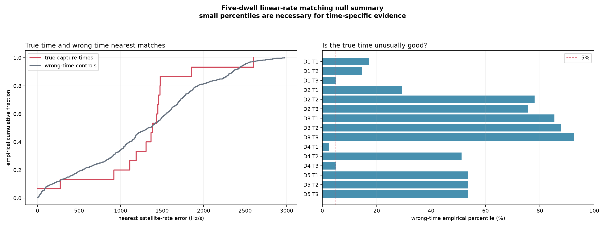

The left panel compares nearest-match distributions. The right panel gives each true time's lower-tail empirical percentile among 40 wrong-time skies. Smaller is better; 2.44% is the smallest resolvable value with 40 controls.

## Method and terminology

| Term | Meaning |
|---|---|
| Radio CFO | De-aliased frequency-offset observations in Hz. |
| Measured radio rate | Slope of one degree-1 OLS fit through those CFO observations. It is constant over the track. |
| Formal slope SE | Ordinary least-squares standard error. It does not correct for serial correlation and is descriptive only. |
| Half-to-half change | Second-half linear slope minus first-half linear slope; a simple stability diagnostic, not curvature. |
| Predicted satellite rate | TLE/SGP4 Doppler change from midpoint −1 s to midpoint +1 s, divided by 2 s. |
| Zenith angle | 90° minus elevation; 0° is directly overhead and 80° is the 10° horizon cut. |
| Nearest rate error | Absolute difference between measured and predicted rates. |
| Wrong-time null | The same measured radio rate compared with skies shifted every 30 s from −600 to +600 s, excluding zero. |
| Empirical p | `(1 + null errors ≤ true error) / 41`; small values mean the true time is unusually good. |

The retained final-track artifact is used only to choose observation membership and the constant de-alias lift. Any sealed nonlinear radio coefficients are explicitly ignored. Raw-track figures likewise show degree-1 GLRT candidates only.

## Cohort

Observer: 37.858988, -122.478103, -29 m. GPS source: `reviewed spinnaker-sausalito preset; not capture-bound GPS authority`.

| Dwell | UTC capture | Raw linear / all raw | Final tracks | TLE objects |
|---|---|---:|---:|---:|
| `cap-20260821T201522-841b2a20e151` | 2026-08-21T20:15:24.015+00:00–2026-08-21T20:16:24.015+00:00 | 16 / 48 | 15 | 10976 |
| `cap-20260821T193701-87f96f47e73f` | 2026-08-21T19:37:03.687+00:00–2026-08-21T19:38:03.687+00:00 | 18 / 52 | 17 | 10976 |
| `cap-20260821T193440-17c2e0ebef6a` | 2026-08-21T19:34:42.311+00:00–2026-08-21T19:35:42.311+00:00 | 11 / 33 | 11 | 10976 |
| `cap-20260821T190912-ffd441556880` | 2026-08-21T19:09:13.968+00:00–2026-08-21T19:10:13.968+00:00 | 10 / 30 | 10 | 10976 |
| `cap-20260821T190701-7a5d980ec1c6` | 2026-08-21T19:07:02.822+00:00–2026-08-21T19:08:02.822+00:00 | 8 / 24 | 8 | 10976 |

## Dwell 1: `cap-20260821T201522-841b2a20e151`

### Raw GLRT tracks — linear candidates only

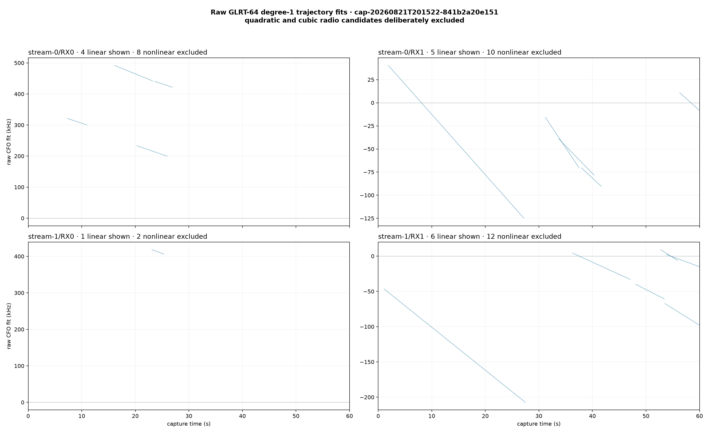

### Retained tracks refit linearly from observations

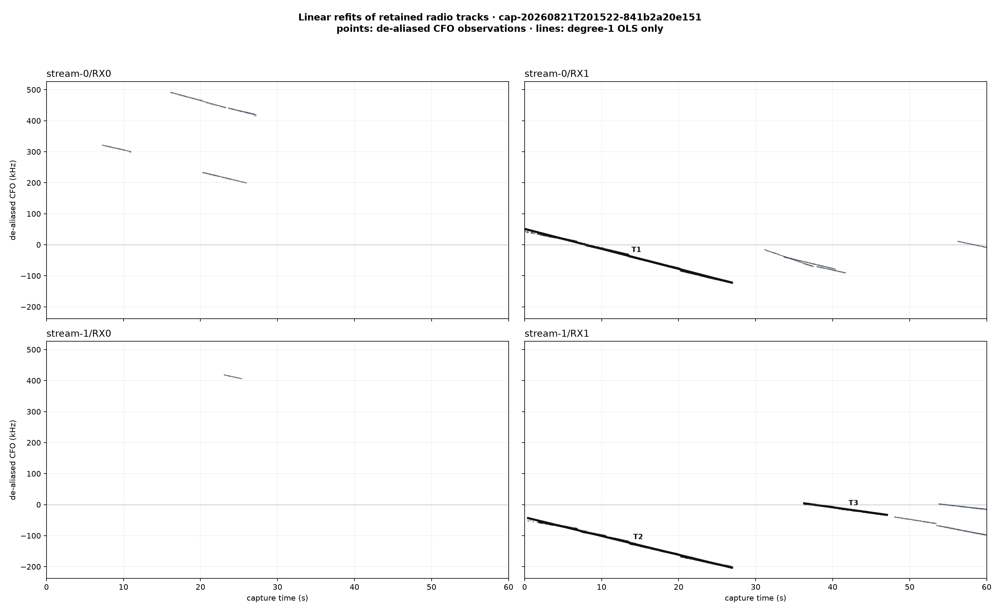

### Top-three measured rates and controls

| Track | Path | Duration | Obs. | Constant rate | CFO RMS | Half-to-half Δ | Visible | ≤500 | Best error | True-time p / rank |
|---|---|---:|---:|---:|---:|---:|---:|---:|---:|---:|
| **T1** | `stream-0/RX1` | 26.93 s | 819 | -6451.1 Hz/s | 1818.8 Hz | -444.2 Hz/s | 207 | 0 | 1436.0 Hz/s | 17.1% / 7/41 |
| **T2** | `stream-1/RX1` | 26.48 s | 756 | -6048.8 Hz/s | 1697.5 Hz | -185.1 Hz/s | 207 | 0 | 1448.4 Hz/s | 14.6% / 6/41 |
| **T3** | `stream-1/RX1` | 10.75 s | 124 | -3457.3 Hz/s | 836.9 Hz | +12.0 Hz/s | 207 | 7 | 0.6 Hz/s | 4.9% / 2/41 |

### Satellite rate field versus zenith angle

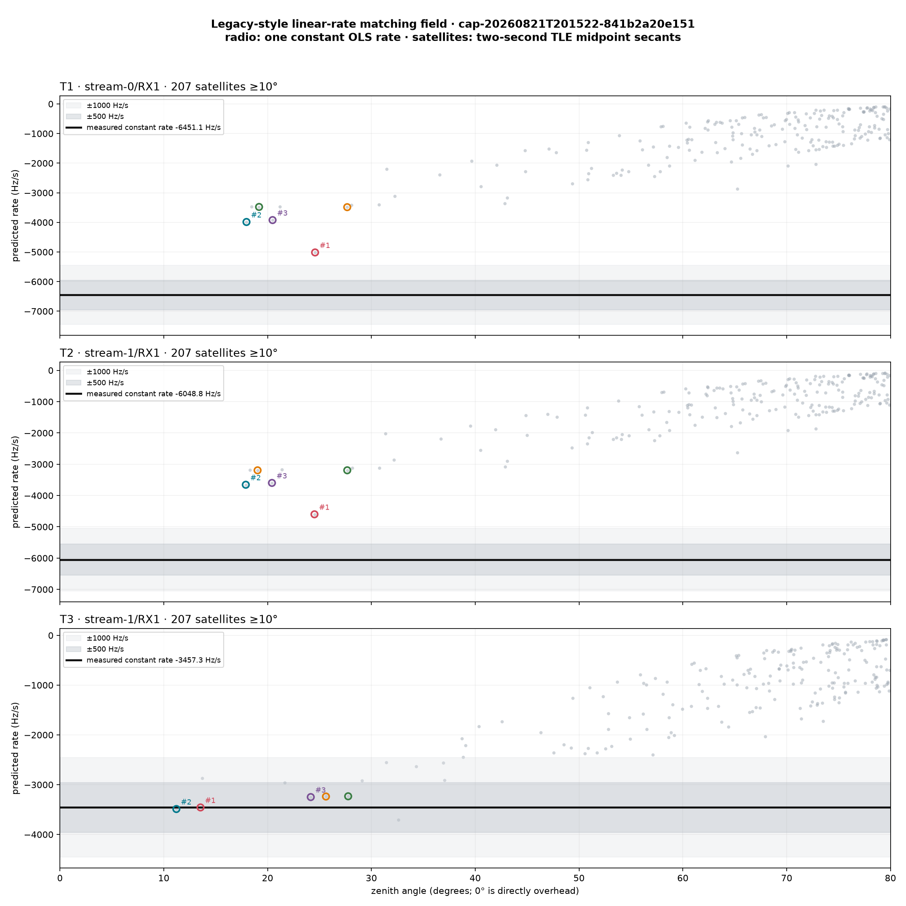

Gray points are all Starlinks above 10° at the track midpoint. The black line is the single measured radio rate; colored rings mark the five nearest rate matches.

### Full-capture overlay

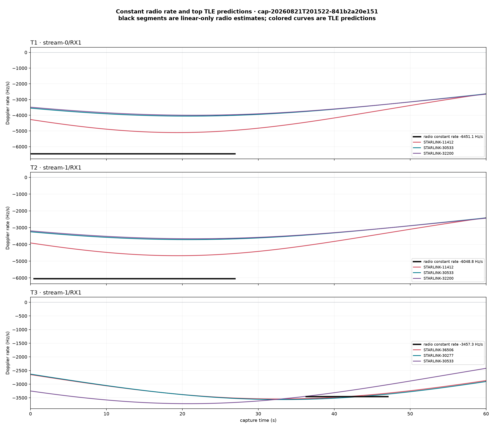

Black is constant by construction and is drawn only across the radio track. Colored curves are the three nearest TLE-predicted rates and may vary with time; their curvature is orbital prediction, not a nonlinear radio estimate.

### Wrong-time null controls

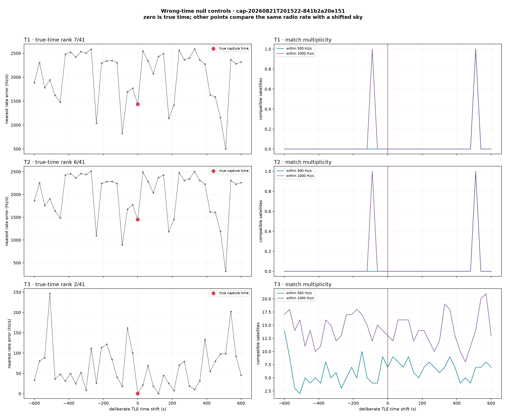

Zero seconds is the true sky. The other 40 points deliberately use the wrong sky time. A compelling scalar-rate match should have an unusually small zero-time error and limited match multiplicity.

### Five nearest satellites per track

| Track | Rank | Satellite | NORAD | Elevation | Zenith angle | Predicted rate | Signed error |
|---|---:|---|---:|---:|---:|---:|---:|
| T1 | 1 | STARLINK-11412 | 63062 | 65.42° | 24.58° | -5015.1 Hz/s | -1436.0 Hz/s |
| T1 | 2 | STARLINK-30533 | 58037 | 72.03° | 17.97° | -3986.4 Hz/s | -2464.7 Hz/s |
| T1 | 3 | STARLINK-32200 | 60258 | 69.52° | 20.48° | -3921.9 Hz/s | -2529.2 Hz/s |
| T1 | 4 | STARLINK-3312 | 50850 | 62.33° | 27.67° | -3485.7 Hz/s | -2965.4 Hz/s |
| T1 | 5 | STARLINK-36506 | 67414 | 70.82° | 19.18° | -3478.3 Hz/s | -2972.8 Hz/s |
| T2 | 1 | STARLINK-11412 | 63062 | 65.48° | 24.52° | -4600.4 Hz/s | -1448.4 Hz/s |
| T2 | 2 | STARLINK-30533 | 58037 | 72.10° | 17.90° | -3655.8 Hz/s | -2393.0 Hz/s |
| T2 | 3 | STARLINK-32200 | 60258 | 69.58° | 20.42° | -3596.8 Hz/s | -2451.9 Hz/s |
| T2 | 4 | STARLINK-36506 | 67414 | 70.96° | 19.04° | -3194.2 Hz/s | -2854.6 Hz/s |
| T2 | 5 | STARLINK-3312 | 50850 | 62.32° | 27.68° | -3193.0 Hz/s | -2855.8 Hz/s |
| T3 | 1 | STARLINK-36506 | 67414 | 76.46° | 13.54° | -3456.7 Hz/s | -0.6 Hz/s |
| T3 | 2 | STARLINK-30277 | 57645 | 78.78° | 11.22° | -3488.5 Hz/s | +31.2 Hz/s |
| T3 | 3 | STARLINK-30533 | 58037 | 65.84° | 24.16° | -3248.4 Hz/s | -208.9 Hz/s |
| T3 | 4 | STARLINK-32200 | 60258 | 64.38° | 25.62° | -3237.4 Hz/s | -219.9 Hz/s |
| T3 | 5 | STARLINK-5451 | 54771 | 62.24° | 27.76° | -3232.7 Hz/s | -224.7 Hz/s |

## Dwell 2: `cap-20260821T193701-87f96f47e73f`

### Raw GLRT tracks — linear candidates only

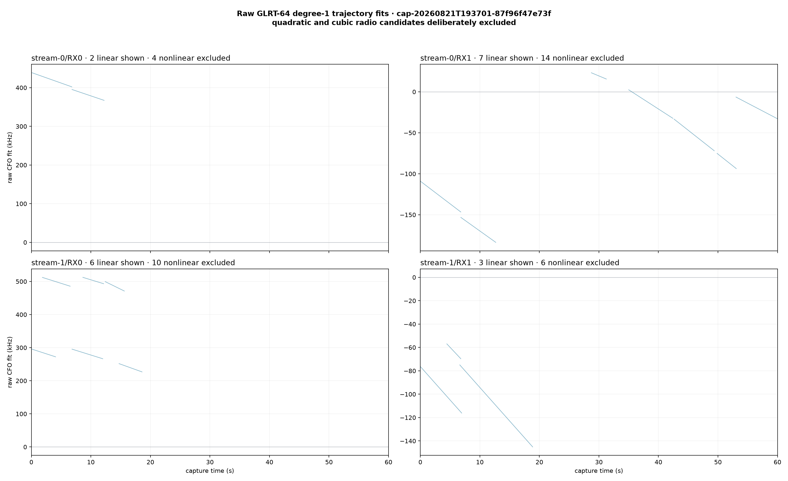

### Retained tracks refit linearly from observations

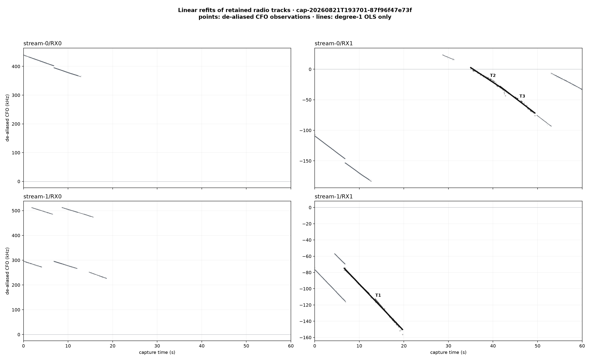

### Top-three measured rates and controls

| Track | Path | Duration | Obs. | Constant rate | CFO RMS | Half-to-half Δ | Visible | ≤500 | Best error | True-time p / rank |
|---|---|---:|---:|---:|---:|---:|---:|---:|---:|---:|
| **T1** | `stream-1/RX1` | 13.07 s | 319 | -5768.5 Hz/s | 850.9 Hz | -348.5 Hz/s | 198 | 0 | 1368.3 Hz/s | 29.3% / 12/41 |
| **T2** | `stream-0/RX1` | 7.80 s | 62 | -4812.5 Hz/s | 2102.0 Hz | -2389.3 Hz/s | 202 | 0 | 1111.7 Hz/s | 78.0% / 32/41 |
| **T3** | `stream-0/RX1` | 7.80 s | 51 | -5571.9 Hz/s | 1603.5 Hz | -2223.7 Hz/s | 200 | 0 | 1852.3 Hz/s | 75.6% / 31/41 |

### Satellite rate field versus zenith angle

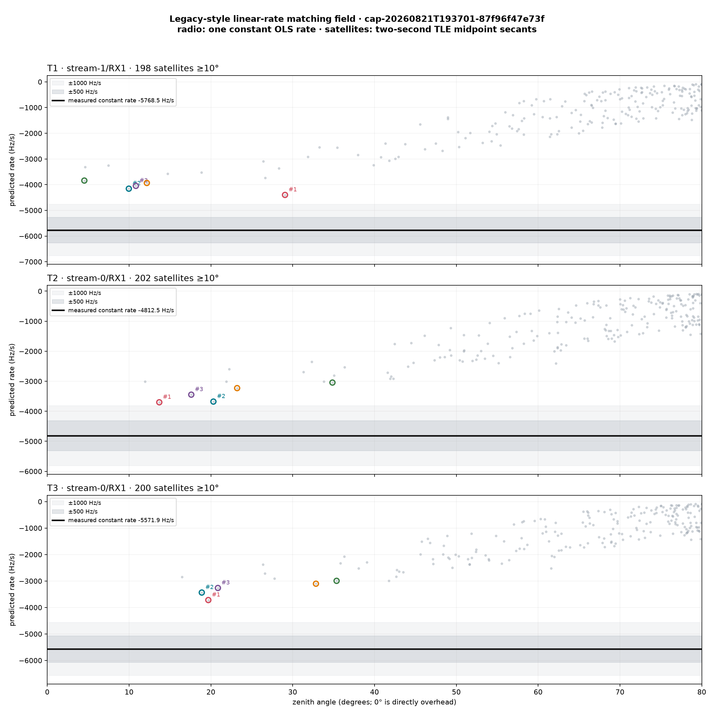

Gray points are all Starlinks above 10° at the track midpoint. The black line is the single measured radio rate; colored rings mark the five nearest rate matches.

### Full-capture overlay

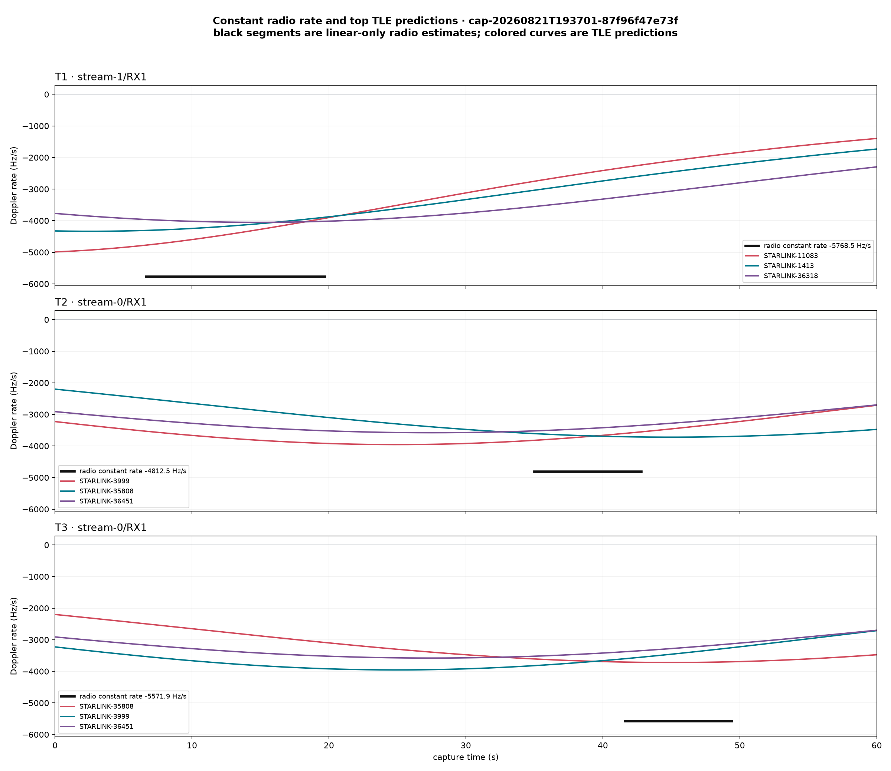

Black is constant by construction and is drawn only across the radio track. Colored curves are the three nearest TLE-predicted rates and may vary with time; their curvature is orbital prediction, not a nonlinear radio estimate.

### Wrong-time null controls

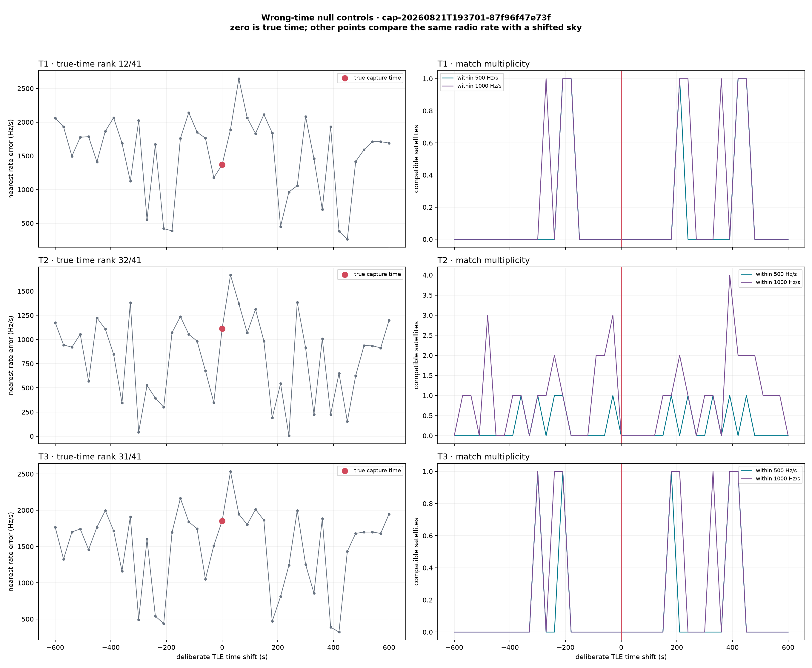

Zero seconds is the true sky. The other 40 points deliberately use the wrong sky time. A compelling scalar-rate match should have an unusually small zero-time error and limited match multiplicity.

### Five nearest satellites per track

| Track | Rank | Satellite | NORAD | Elevation | Zenith angle | Predicted rate | Signed error |
|---|---:|---|---:|---:|---:|---:|---:|
| T1 | 1 | STARLINK-11083 | 59424 | 60.94° | 29.06° | -4400.2 Hz/s | -1368.3 Hz/s |
| T1 | 2 | STARLINK-1413 | 45689 | 80.03° | 9.97° | -4156.7 Hz/s | -1611.8 Hz/s |
| T1 | 3 | STARLINK-36318 | 68048 | 79.17° | 10.83° | -4048.3 Hz/s | -1720.1 Hz/s |
| T1 | 4 | STARLINK-3999 | 52704 | 77.83° | 12.17° | -3935.1 Hz/s | -1833.4 Hz/s |
| T1 | 5 | STARLINK-31512 | 59500 | 85.46° | 4.54° | -3841.7 Hz/s | -1926.7 Hz/s |
| T2 | 1 | STARLINK-3999 | 52704 | 76.30° | 13.70° | -3700.8 Hz/s | -1111.7 Hz/s |
| T2 | 2 | STARLINK-35808 | 68052 | 69.69° | 20.31° | -3677.5 Hz/s | -1135.0 Hz/s |
| T2 | 3 | STARLINK-36451 | 67339 | 72.39° | 17.61° | -3446.7 Hz/s | -1365.8 Hz/s |
| T2 | 4 | STARLINK-36318 | 68048 | 66.79° | 23.21° | -3229.0 Hz/s | -1583.5 Hz/s |
| T2 | 5 | STARLINK-6343 | 57362 | 55.14° | 34.86° | -3044.1 Hz/s | -1768.4 Hz/s |
| T3 | 1 | STARLINK-35808 | 68052 | 70.31° | 19.69° | -3719.6 Hz/s | -1852.3 Hz/s |
| T3 | 2 | STARLINK-3999 | 52704 | 71.11° | 18.89° | -3435.9 Hz/s | -2135.9 Hz/s |
| T3 | 3 | STARLINK-36451 | 67339 | 69.14° | 20.86° | -3263.5 Hz/s | -2308.4 Hz/s |
| T3 | 4 | STARLINK-32701 | 62510 | 57.16° | 32.84° | -3102.1 Hz/s | -2469.8 Hz/s |
| T3 | 5 | STARLINK-6343 | 57362 | 54.63° | 35.37° | -2993.7 Hz/s | -2578.1 Hz/s |

## Dwell 3: `cap-20260821T193440-17c2e0ebef6a`

### Raw GLRT tracks — linear candidates only

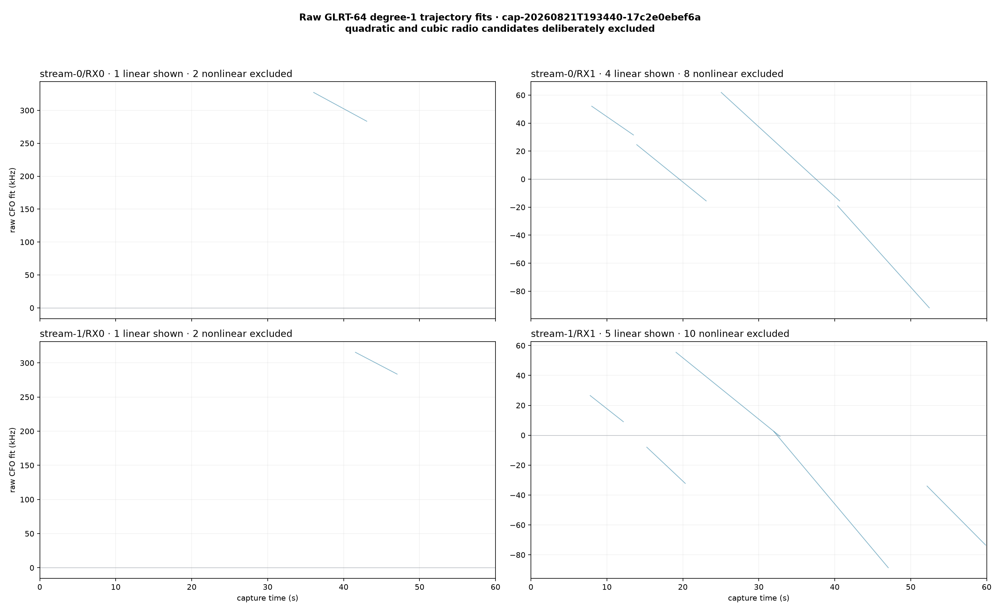

### Retained tracks refit linearly from observations

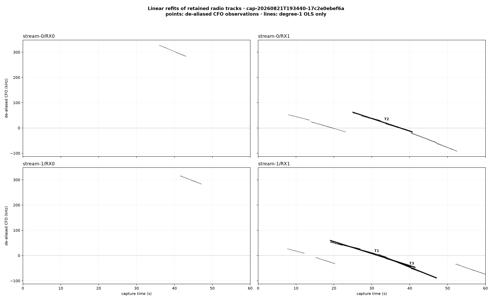

### Top-three measured rates and controls

| Track | Path | Duration | Obs. | Constant rate | CFO RMS | Half-to-half Δ | Visible | ≤500 | Best error | True-time p / rank |
|---|---|---:|---:|---:|---:|---:|---:|---:|---:|---:|
| **T1** | `stream-1/RX1` | 22.30 s | 662 | -4756.4 Hz/s | 2357.6 Hz | -1399.5 Hz/s | 197 | 0 | 1186.5 Hz/s | 85.4% / 35/41 |
| **T2** | `stream-0/RX1` | 15.60 s | 369 | -4969.1 Hz/s | 912.6 Hz | +154.3 Hz/s | 197 | 0 | 1456.4 Hz/s | 87.8% / 36/41 |
| **T3** | `stream-1/RX1` | 15.07 s | 445 | -6051.2 Hz/s | 1113.3 Hz | -397.9 Hz/s | 199 | 0 | 2602.8 Hz/s | 92.7% / 38/41 |

### Satellite rate field versus zenith angle

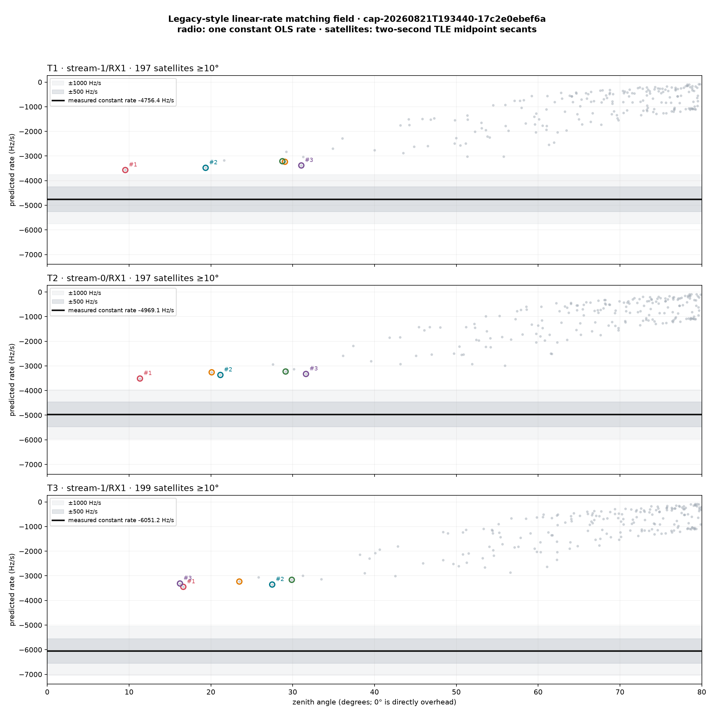

Gray points are all Starlinks above 10° at the track midpoint. The black line is the single measured radio rate; colored rings mark the five nearest rate matches.

### Full-capture overlay

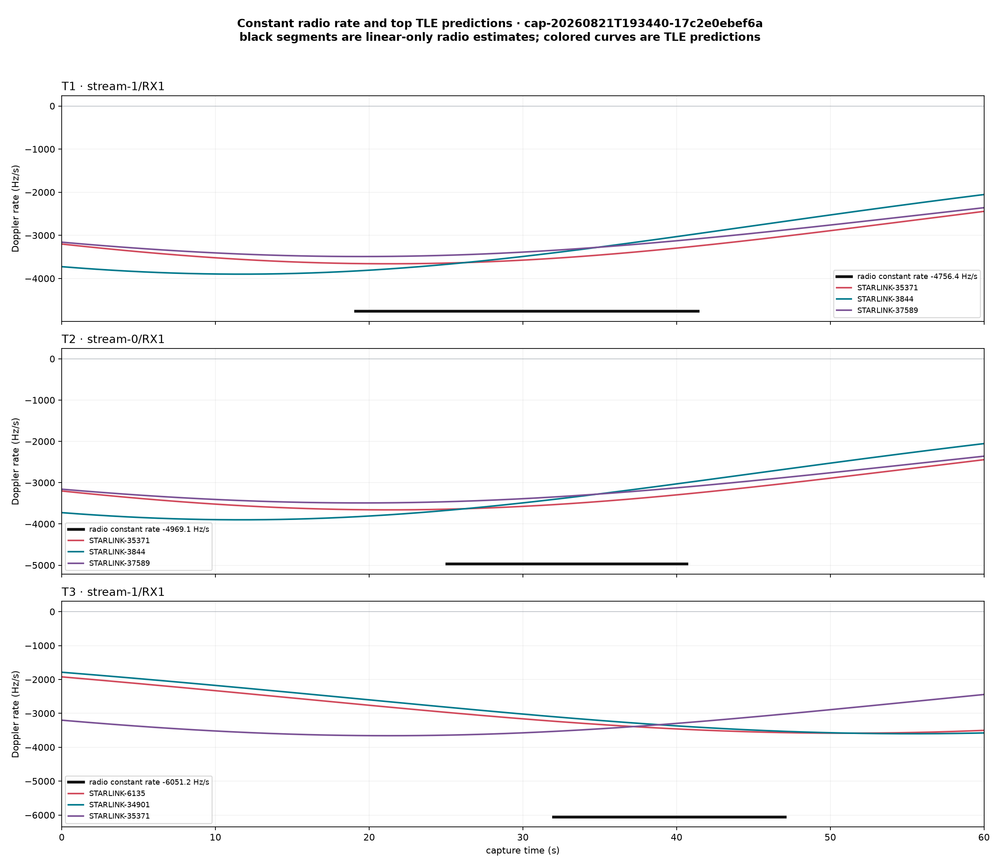

Black is constant by construction and is drawn only across the radio track. Colored curves are the three nearest TLE-predicted rates and may vary with time; their curvature is orbital prediction, not a nonlinear radio estimate.

### Wrong-time null controls

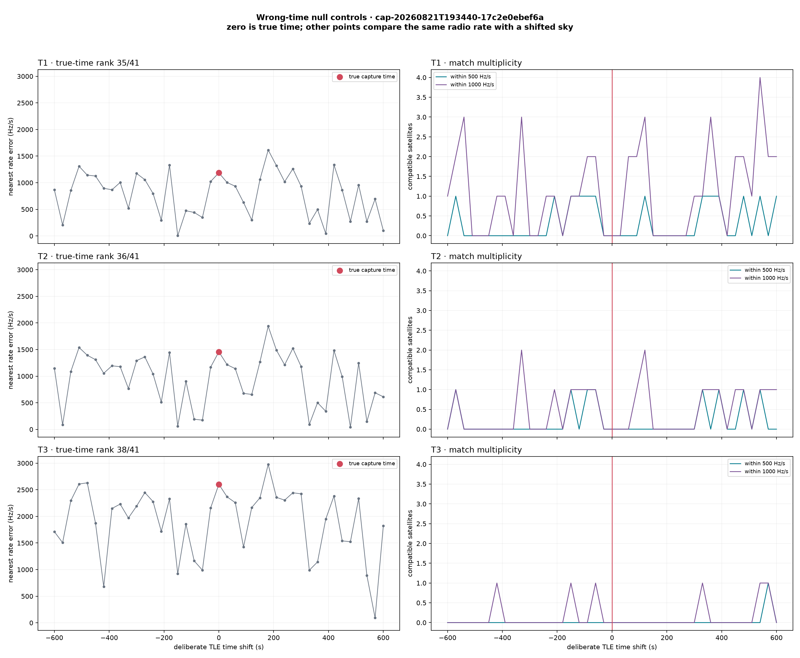

Zero seconds is the true sky. The other 40 points deliberately use the wrong sky time. A compelling scalar-rate match should have an unusually small zero-time error and limited match multiplicity.

### Five nearest satellites per track

| Track | Rank | Satellite | NORAD | Elevation | Zenith angle | Predicted rate | Signed error |
|---|---:|---|---:|---:|---:|---:|---:|
| T1 | 1 | STARLINK-35371 | 66484 | 80.46° | 9.54° | -3569.8 Hz/s | -1186.5 Hz/s |
| T1 | 2 | STARLINK-3844 | 52705 | 70.64° | 19.36° | -3479.8 Hz/s | -1276.5 Hz/s |
| T1 | 3 | STARLINK-37589 | 69839 | 58.94° | 31.06° | -3383.7 Hz/s | -1372.6 Hz/s |
| T1 | 4 | STARLINK-36431 | 67421 | 60.95° | 29.05° | -3235.3 Hz/s | -1521.1 Hz/s |
| T1 | 5 | STARLINK-6291 | 56547 | 61.26° | 28.74° | -3212.2 Hz/s | -1544.1 Hz/s |
| T2 | 1 | STARLINK-35371 | 66484 | 78.67° | 11.33° | -3512.7 Hz/s | -1456.4 Hz/s |
| T2 | 2 | STARLINK-3844 | 52705 | 68.84° | 21.16° | -3368.7 Hz/s | -1600.4 Hz/s |
| T2 | 3 | STARLINK-37589 | 69839 | 58.38° | 31.62° | -3327.8 Hz/s | -1641.3 Hz/s |
| T2 | 4 | STARLINK-6135 | 56539 | 69.90° | 20.10° | -3260.7 Hz/s | -1708.4 Hz/s |
| T2 | 5 | STARLINK-36431 | 67421 | 60.87° | 29.13° | -3228.4 Hz/s | -1740.7 Hz/s |
| T3 | 1 | STARLINK-6135 | 56539 | 73.37° | 16.63° | -3448.4 Hz/s | -2602.8 Hz/s |
| T3 | 2 | STARLINK-34901 | 65207 | 62.50° | 27.50° | -3355.4 Hz/s | -2695.8 Hz/s |
| T3 | 3 | STARLINK-35371 | 66484 | 73.78° | 16.22° | -3313.2 Hz/s | -2738.0 Hz/s |
| T3 | 4 | STARLINK-4209 | 52855 | 66.52° | 23.48° | -3233.8 Hz/s | -2817.4 Hz/s |
| T3 | 5 | STARLINK-36431 | 67421 | 60.11° | 29.89° | -3163.8 Hz/s | -2887.4 Hz/s |

## Dwell 4: `cap-20260821T190912-ffd441556880`

### Raw GLRT tracks — linear candidates only

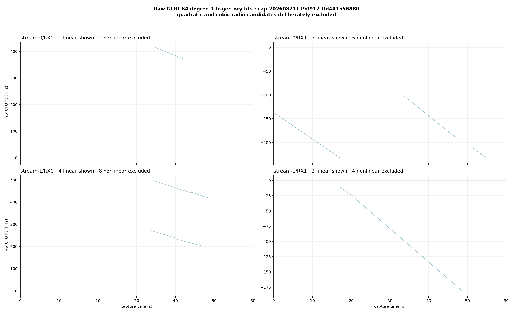

### Retained tracks refit linearly from observations

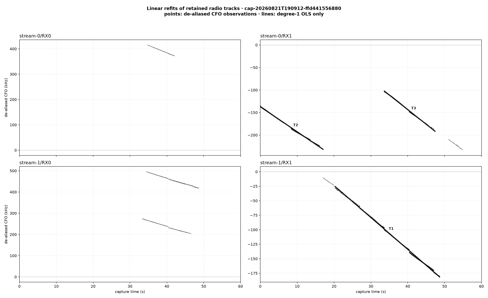

### Top-three measured rates and controls

| Track | Path | Duration | Obs. | Constant rate | CFO RMS | Half-to-half Δ | Visible | ≤500 | Best error | True-time p / rank |
|---|---|---:|---:|---:|---:|---:|---:|---:|---:|---:|
| **T1** | `stream-1/RX1` | 28.35 s | 929 | -5499.6 Hz/s | 1188.7 Hz | +82.3 Hz/s | 212 | 1 | 273.9 Hz/s | 2.4% / 1/41 |
| **T2** | `stream-0/RX1` | 17.00 s | 532 | -5549.8 Hz/s | 1005.4 Hz | +742.5 Hz/s | 207 | 0 | 1478.6 Hz/s | 51.2% / 21/41 |
| **T3** | `stream-0/RX1` | 13.73 s | 381 | -6494.8 Hz/s | 807.3 Hz | -69.6 Hz/s | 213 | 0 | 1474.5 Hz/s | 4.9% / 2/41 |

### Satellite rate field versus zenith angle

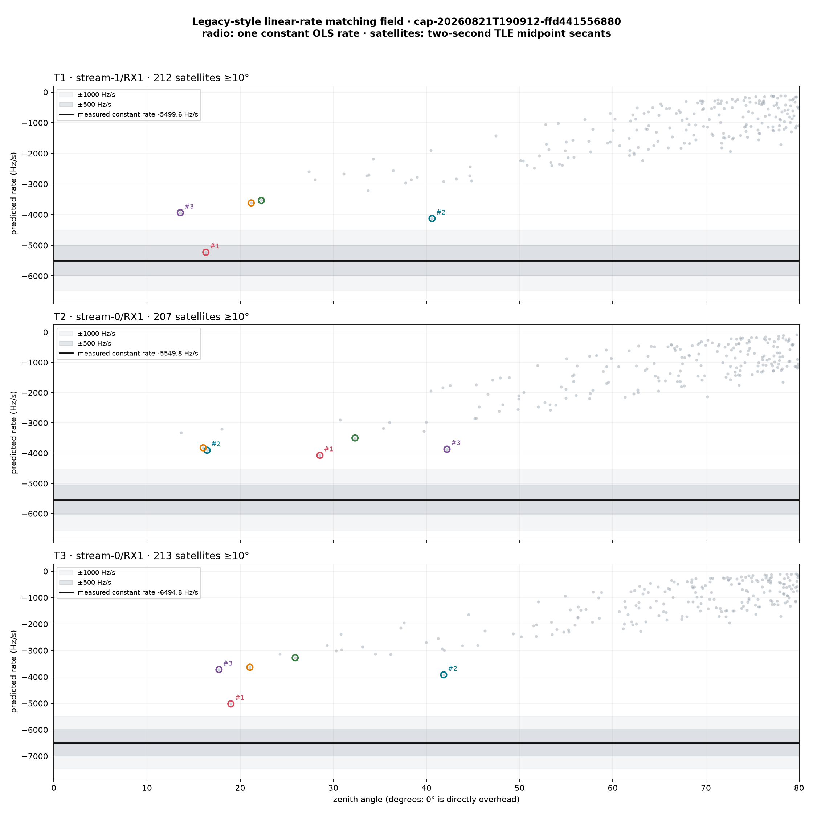

Gray points are all Starlinks above 10° at the track midpoint. The black line is the single measured radio rate; colored rings mark the five nearest rate matches.

### Full-capture overlay

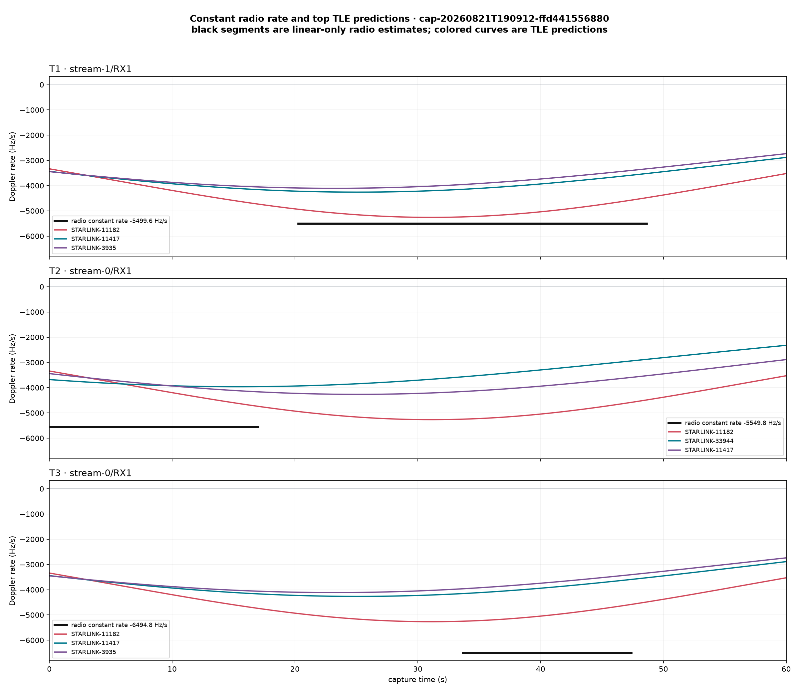

Black is constant by construction and is drawn only across the radio track. Colored curves are the three nearest TLE-predicted rates and may vary with time; their curvature is orbital prediction, not a nonlinear radio estimate.

### Wrong-time null controls

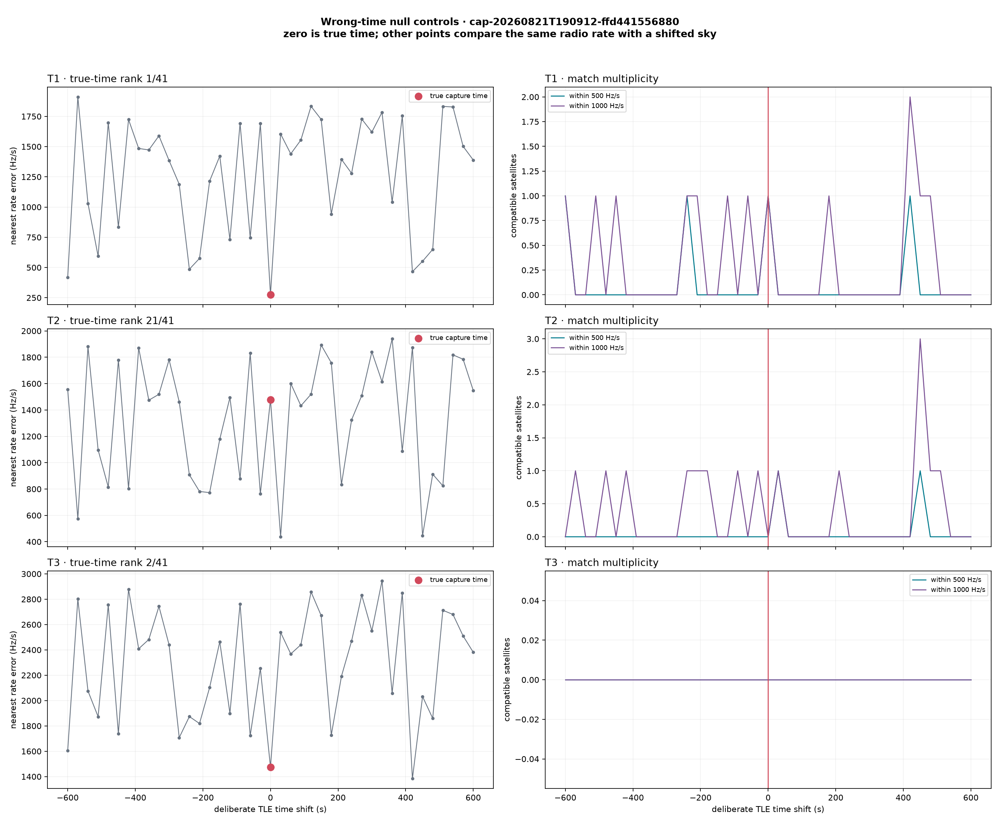

Zero seconds is the true sky. The other 40 points deliberately use the wrong sky time. A compelling scalar-rate match should have an unusually small zero-time error and limited match multiplicity.

### Five nearest satellites per track

| Track | Rank | Satellite | NORAD | Elevation | Zenith angle | Predicted rate | Signed error |
|---|---:|---|---:|---:|---:|---:|---:|
| T1 | 1 | STARLINK-11182 | 60399 | 73.68° | 16.32° | -5225.6 Hz/s | -273.9 Hz/s |
| T1 | 2 | STARLINK-11417 | 62983 | 49.40° | 40.60° | -4125.2 Hz/s | -1374.4 Hz/s |
| T1 | 3 | STARLINK-3935 | 52549 | 76.42° | 13.58° | -3933.7 Hz/s | -1565.9 Hz/s |
| T1 | 4 | STARLINK-35466 | 66457 | 68.81° | 21.19° | -3617.8 Hz/s | -1881.8 Hz/s |
| T1 | 5 | STARLINK-33944 | 64209 | 67.72° | 22.28° | -3533.7 Hz/s | -1965.9 Hz/s |
| T2 | 1 | STARLINK-11182 | 60399 | 61.43° | 28.57° | -4071.2 Hz/s | -1478.6 Hz/s |
| T2 | 2 | STARLINK-33944 | 64209 | 73.54° | 16.46° | -3903.2 Hz/s | -1646.6 Hz/s |
| T2 | 3 | STARLINK-11417 | 62983 | 47.80° | 42.20° | -3868.7 Hz/s | -1681.1 Hz/s |
| T2 | 4 | STARLINK-3935 | 52549 | 73.96° | 16.04° | -3823.4 Hz/s | -1726.4 Hz/s |
| T2 | 5 | STARLINK-33784 | 63453 | 57.67° | 32.33° | -3497.5 Hz/s | -2052.2 Hz/s |
| T3 | 1 | STARLINK-11182 | 60399 | 70.99° | 19.01° | -5020.4 Hz/s | -1474.5 Hz/s |
| T3 | 2 | STARLINK-11417 | 62983 | 48.14° | 41.86° | -3919.7 Hz/s | -2575.1 Hz/s |
| T3 | 3 | STARLINK-3935 | 52549 | 72.27° | 17.73° | -3722.3 Hz/s | -2772.5 Hz/s |
| T3 | 4 | STARLINK-35466 | 66457 | 68.95° | 21.05° | -3632.6 Hz/s | -2862.3 Hz/s |
| T3 | 5 | STARLINK-33944 | 64209 | 64.09° | 25.91° | -3274.0 Hz/s | -3220.8 Hz/s |

## Dwell 5: `cap-20260821T190701-7a5d980ec1c6`

### Raw GLRT tracks — linear candidates only

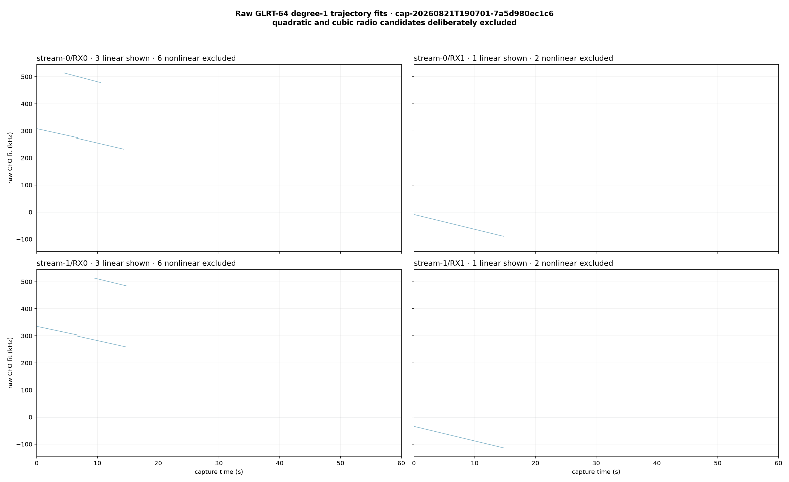

### Retained tracks refit linearly from observations

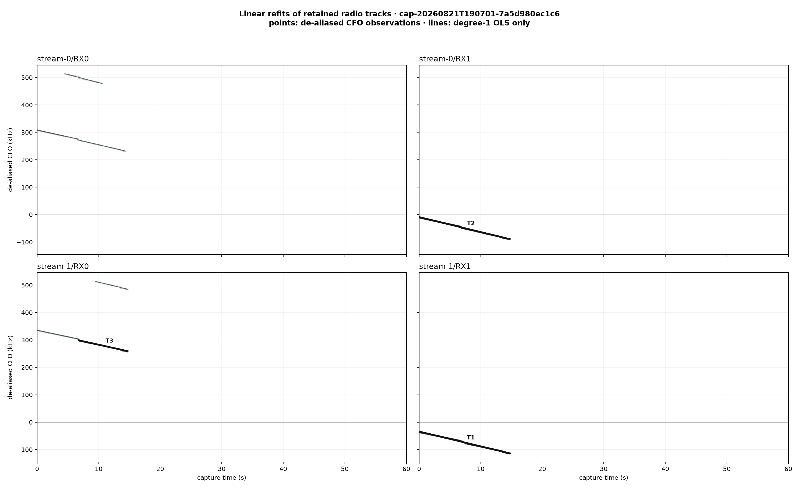

### Top-three measured rates and controls

| Track | Path | Duration | Obs. | Constant rate | CFO RMS | Half-to-half Δ | Visible | ≤500 | Best error | True-time p / rank |
|---|---|---:|---:|---:|---:|---:|---:|---:|---:|---:|
| **T1** | `stream-1/RX1` | 14.75 s | 568 | -5390.9 Hz/s | 1078.4 Hz | -204.1 Hz/s | 203 | 0 | 1307.6 Hz/s | 53.7% / 22/41 |
| **T2** | `stream-0/RX1` | 14.72 s | 576 | -5470.3 Hz/s | 881.4 Hz | -116.6 Hz/s | 203 | 0 | 1386.6 Hz/s | 53.7% / 22/41 |
| **T3** | `stream-1/RX0` | 7.95 s | 210 | -4972.8 Hz/s | 614.2 Hz | -649.7 Hz/s | 203 | 0 | 919.9 Hz/s | 53.7% / 22/41 |

### Satellite rate field versus zenith angle

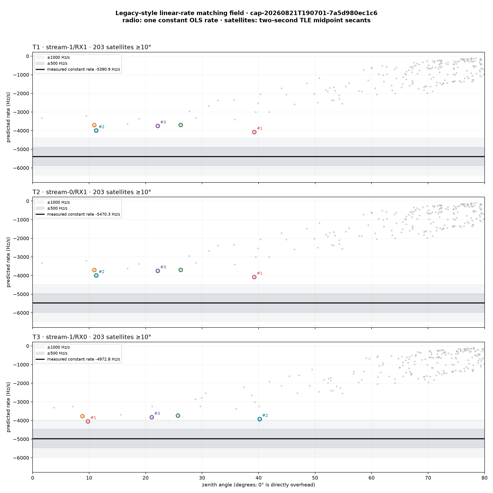

Gray points are all Starlinks above 10° at the track midpoint. The black line is the single measured radio rate; colored rings mark the five nearest rate matches.

### Full-capture overlay

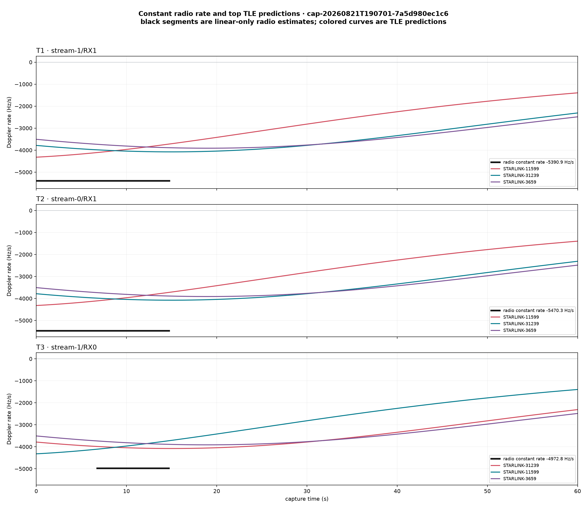

Black is constant by construction and is drawn only across the radio track. Colored curves are the three nearest TLE-predicted rates and may vary with time; their curvature is orbital prediction, not a nonlinear radio estimate.

### Wrong-time null controls

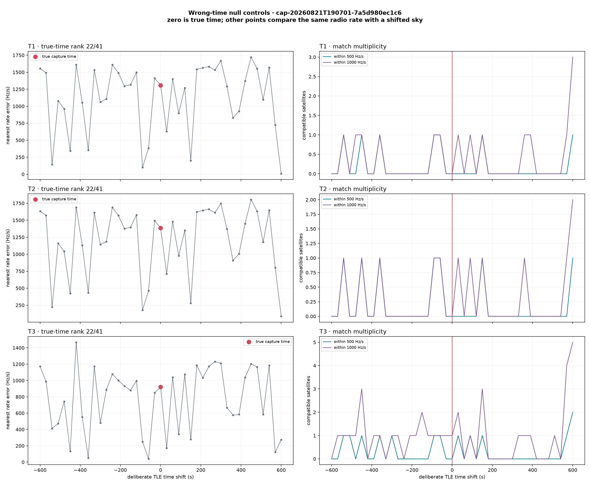

Zero seconds is the true sky. The other 40 points deliberately use the wrong sky time. A compelling scalar-rate match should have an unusually small zero-time error and limited match multiplicity.

### Five nearest satellites per track

| Track | Rank | Satellite | NORAD | Elevation | Zenith angle | Predicted rate | Signed error |
|---|---:|---|---:|---:|---:|---:|---:|
| T1 | 1 | STARLINK-11599 | 63670 | 50.75° | 39.25° | -4083.3 Hz/s | -1307.6 Hz/s |
| T1 | 2 | STARLINK-31239 | 60093 | 78.74° | 11.26° | -3998.7 Hz/s | -1392.3 Hz/s |
| T1 | 3 | STARLINK-3659 | 52001 | 67.84° | 22.16° | -3751.3 Hz/s | -1639.6 Hz/s |
| T1 | 4 | STARLINK-32773 | 62571 | 79.08° | 10.92° | -3706.2 Hz/s | -1684.7 Hz/s |
| T1 | 5 | STARLINK-34302 | 65216 | 63.78° | 26.22° | -3699.5 Hz/s | -1691.4 Hz/s |
| T2 | 1 | STARLINK-11599 | 63670 | 50.75° | 39.25° | -4083.7 Hz/s | -1386.6 Hz/s |
| T2 | 2 | STARLINK-31239 | 60093 | 78.74° | 11.26° | -3998.5 Hz/s | -1471.9 Hz/s |
| T2 | 3 | STARLINK-3659 | 52001 | 67.84° | 22.16° | -3751.1 Hz/s | -1719.2 Hz/s |
| T2 | 4 | STARLINK-32773 | 62571 | 79.07° | 10.93° | -3705.9 Hz/s | -1764.4 Hz/s |
| T2 | 5 | STARLINK-34302 | 65216 | 63.78° | 26.22° | -3699.3 Hz/s | -1771.0 Hz/s |
| T3 | 1 | STARLINK-31239 | 60093 | 80.21° | 9.79° | -4052.9 Hz/s | -919.9 Hz/s |
| T3 | 2 | STARLINK-11599 | 63670 | 49.79° | 40.21° | -3931.2 Hz/s | -1041.6 Hz/s |
| T3 | 3 | STARLINK-3659 | 52001 | 68.90° | 21.10° | -3829.0 Hz/s | -1143.8 Hz/s |
| T3 | 4 | STARLINK-32773 | 62571 | 81.18° | 8.82° | -3772.1 Hz/s | -1200.7 Hz/s |
| T3 | 5 | STARLINK-34302 | 65216 | 64.27° | 25.73° | -3741.2 Hz/s | -1231.6 Hz/s |

## Limits

This is a scalar-rate compatibility analysis, not satellite identification. The Starlink constellation is dense enough that a close rate match can occur at many wrong times; the controls quantify that ambiguity. The 10° threshold is geometric visibility, not an antenna gain or payload-transmission model. The observer preset is reviewed but is not capture-bound GPS authority.

All Standard artifacts are re-read from immutable bulk storage and checked against catalog digests. The selected local TLE snapshot is likewise verified. The adjacent JSON contains the five closest true-time candidates and every null summary used by the tables and figures.
