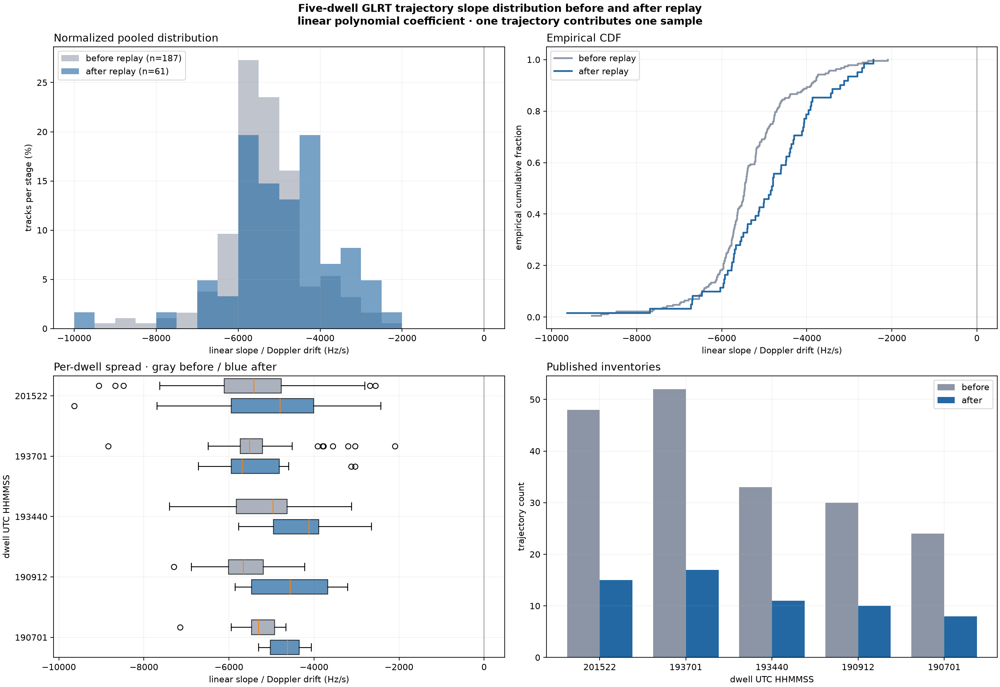
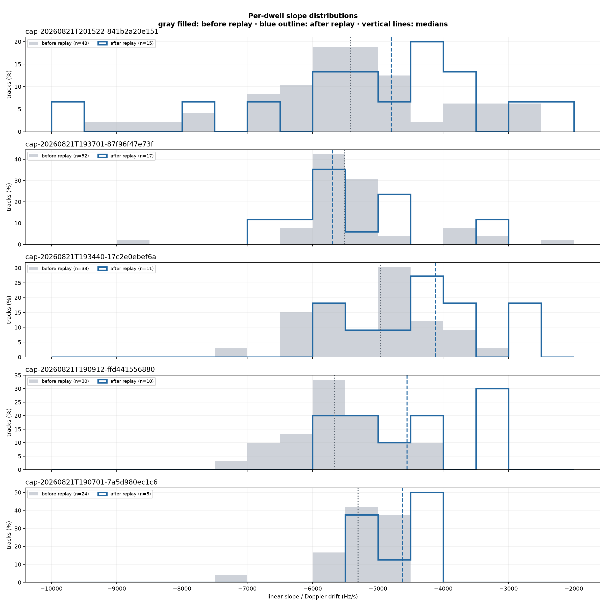

# Five-dwell trajectory slope distribution before and after replay

Generated: `2026-08-21T21:45:18.334152+00:00`

## Result

The pre-replay GLRT inventory contains 187 trajectories and the final post-replay inventory contains 61. Every fitted linear coefficient is negative in this cohort.

The pooled median changes from -5456.0 Hz/s before replay to -4818.2 Hz/s after replay, a change of +637.8 Hz/s. This is a change between published inventories, not a paired per-track correction statistic: dealiasing, graph selection, and replay can merge, replace, or omit candidates.

## Per-dwell summary

| Dwell | Before n | Before median | Before IQR | After n | After median | After IQR | Median change |
|---|---:|---:|---:|---:|---:|---:|---:|
| `cap-20260821T201522-841b2a20e151` | 48 | -5414.8 Hz/s | -6106.2 to -4765.7 | 15 | -4797.7 Hz/s | -5941.9 to -4008.4 | +617.2 Hz/s |
| `cap-20260821T193701-87f96f47e73f` | 52 | -5509.9 Hz/s | -5732.3 to -5207.9 | 17 | -5691.5 Hz/s | -5942.7 to -4818.2 | -181.6 Hz/s |
| `cap-20260821T193440-17c2e0ebef6a` | 33 | -4965.4 Hz/s | -5828.6 to -4635.7 | 11 | -4118.0 Hz/s | -4956.2 to -3890.3 | +847.4 Hz/s |
| `cap-20260821T190912-ffd441556880` | 30 | -5663.5 Hz/s | -6011.3 to -5189.2 | 10 | -4554.4 Hz/s | -5465.9 to -3679.8 | +1109.2 Hz/s |
| `cap-20260821T190701-7a5d980ec1c6` | 24 | -5303.1 Hz/s | -5469.3 to -4929.2 | 8 | -4620.4 Hz/s | -5030.2 to -4351.0 | +682.8 Hz/s |

Four dwells move toward a less-negative median drift after replay. `cap-20260821T193701-87f96f47e73f` is the exception, moving slightly more negative. Replay also removes the most extreme negative pre-replay tail in several dwells, but the final distributions remain broad and overlapping.

## Definition and provenance

For every linear, quadratic, or cubic trajectory, the reported value is the coefficient of the linear term in the published highest-power-first polynomial. It is therefore the instantaneous CFO derivative at that trajectory's published `reference_time_s`. One trajectory contributes one unweighted sample.

“Before replay” is `standard.glrt64-trajectory-table.v2`; “after replay” is `standard.glrt64-final-trajectory-table.v3` using `absolute_coefficients_hz`. All 40 source artifacts were re-read from immutable bulk storage, checked against their catalog SHA-256 digests, and validated before extraction.

## Evidence

- [`replay-slope-tracks.csv`](figures/2026_08_21_replay_slope_distribution/replay-slope-tracks.csv): one row per trajectory with path, degree, time range, slope, disposition, and source digest.
- [`replay-slope-evidence.json`](figures/2026_08_21_replay_slope_distribution/replay-slope-evidence.json): machine-readable cohort provenance and distribution statistics.
