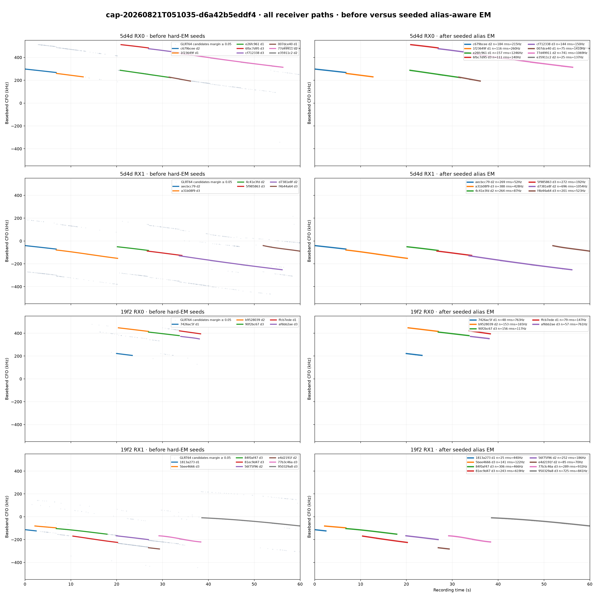
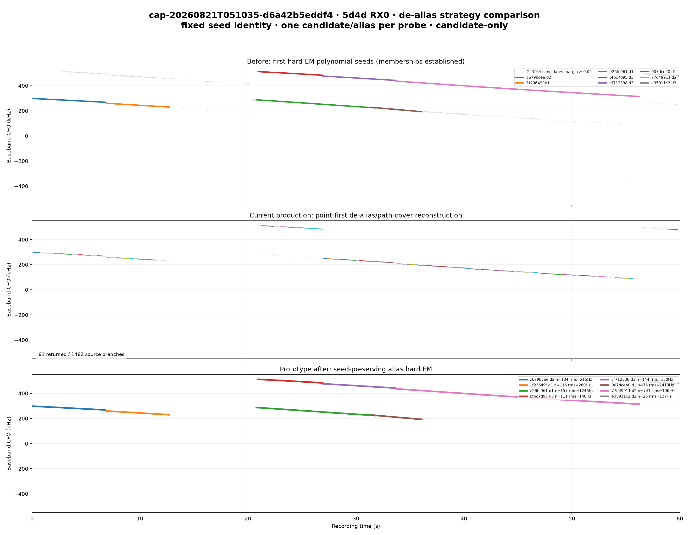
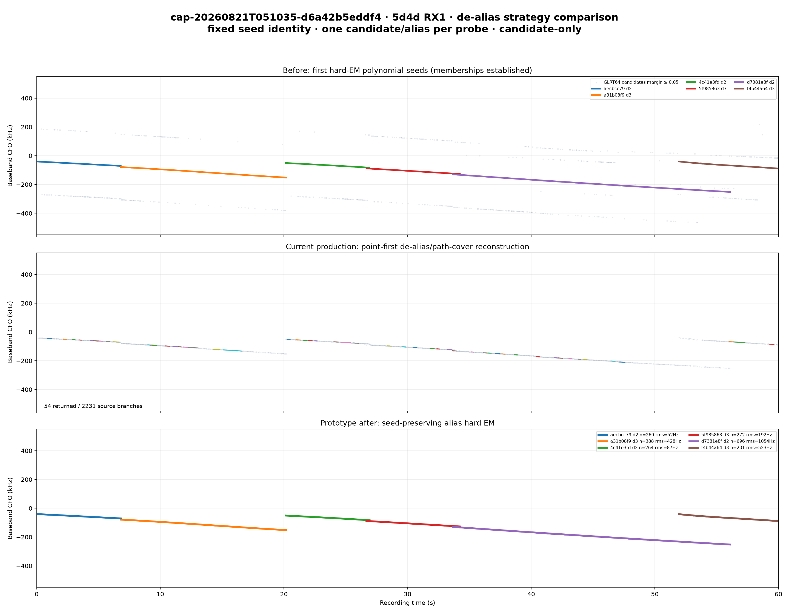
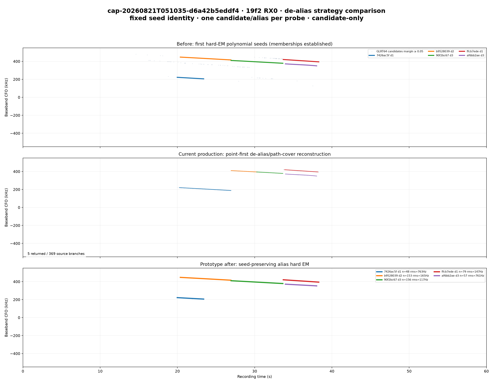
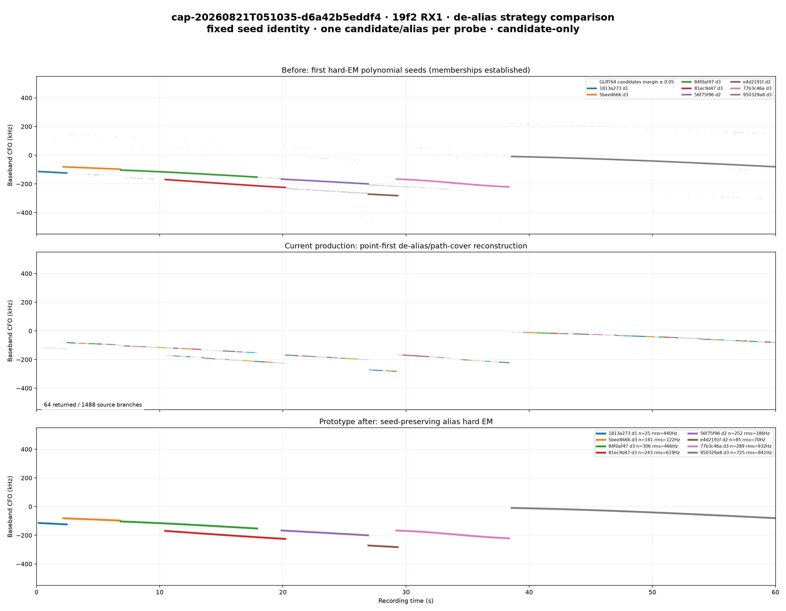

# Seed-preserving alias EM on d6a42b5eddf4 and Standard-v3 cutover

Date: 2026-08-21  
Recording: `cap-20260821T051035-d6a42b5eddf4`  
Production run: `capture-2f85bdef968a4ec1bdd02d282dc9d34b`  
Production release: `d73f5af6b89b6a1ca09c778c9834cd63efd9a26f`

## Outcome

The conservative second hard-EM pass retained all 27 upstream GLRT64 trajectory
seeds and converged in two to four iterations. Production point-first
de-aliasing expanded the same evidence into 5,550 source branches and returned
184 fragments. The prototype returned exactly the original 27 track identities,
with one candidate per probe, without silently dropping a seed.

Most importantly, all 6,202 selected probe assignments chose alias index zero.
For this recording the evidence did not ask for a symbol-rate lift within any
seed. The large visual change is therefore caused by rebuilding paths after
canonicalization, not by a necessary non-zero alias correction.

The measurement was performed offline and did not modify the catalog, retained
artifacts, current run, or UI. The reviewed algorithm has subsequently been
promoted into the Standard source tree as the schema-v3 de-aliased trajectory
bank; deployment and re-analysis remain separate operational steps.



## Method

For each trajectory selected by the first Standard hard-EM bank:

1. Preserve the exact seed trajectory identity and its observation membership.
2. Group member candidates by probe and retain at most one candidate per probe.
3. E-step: choose the member candidate and bounded integer alias index closest
   to the current polynomial prediction.
4. M-step: robustly refit the seed's existing linear, quadratic, or cubic model.
5. Repeat until candidate/alias assignments and coefficients stop changing, or
   for at most 12 iterations.
6. Retain the seed even when no non-zero alias change is required.

The tested alias spacing was the exact Standard value
`2,500,000 / 11 = 227,272.727272... Hz`. The prototype deliberately does not
perform cross-seed merge, split, birth, or global reassignment. That restriction
isolates whether preserving the first EM's established memberships prevents the
observed fragmentation.

## Measured comparison

| Receiver path | First hard-EM seeds | Production source branches | Production returned branches | Seeded alias-EM tracks |
|---|---:|---:|---:|---:|
| 5d4d RX0 | 8 | 1,462 | 61 | 8 |
| 5d4d RX1 | 6 | 2,231 | 54 | 6 |
| 19f2 RX0 | 5 | 369 | 5 | 5 |
| 19f2 RX1 | 8 | 1,488 | 64 | 8 |
| **Total** | **27** | **5,550** | **184** | **27** |

All 27 fits converged. The maximum track RMS was 1,409.9 Hz and the maximum
single residual was 4,117.1 Hz. These remain below the existing 8 kHz raw
trajectory residual gate. Multiple raw observations at the same probe explain
the reduction from 7,190 seed observations to 6,202 selected probes; this is
intentional one-candidate-per-probe selection, not temporal track loss.

### 5d4d RX0



### 5d4d RX1



### 19f2 RX0



### 19f2 RX1



## Source evidence

The evaluator read only registered durable Standard products. SHA-256 values
were independently recomputed after copying them into a local temporary
evaluation directory.

| Path | Pilot scan v3 | Trajectory bank v2 | Production de-aliased bank v2 |
|---|---|---|---|
| 5d4d RX0 | `9181047a...08a2b52` | `5e20ca6f...7766466` | `6c3c57e1...025def` |
| 5d4d RX1 | `4524c75e...ad9a4c` | `e81f9c2b...1ccfbf` | `a363bc6f...3b7e92` |
| 19f2 RX0 | `ea4c7145...0756a67` | `4dc0cc84...0dd451` | `05877d78...0c37679` |
| 19f2 RX1 | `e2bc40ec...12e48` | `f33b3d1c...b17dc` | `ba427eb6...dded5` |

Exact machine-readable results are in
[`metrics.json`](figures/2026_08_21_seeded_alias_em_d6a/metrics.json).

## Reproduction

The general evaluator accepts an explicit pilot scan, trajectory bank, and
production de-aliased bank for every path:

```bash
PYTHONPATH=src .venv/bin/python tools/prototype_seeded_alias_em.py \
  --session-id SESSION \
  --path "RADIO RX" PILOT_SCAN_V3.json TRAJECTORY_BANK_V2.json DEALIASED_BANK_V2.json \
  --output-dir OUTPUT_DIRECTORY
```

Component tests cover alternating integer aliases, exactly one selected
candidate per probe, deterministic input permutation, exclusion of observations
outside the seed membership, and fail-closed missing evidence.

## Standard pipeline implementation

Standard now calls the seed-preserving refinement immediately after the exact
alias-map product. The durable product advances additively from
`standard.dealiased-trajectory-bank/v2` to `/v3`; the published v1/v2 contracts
and codecs remain available for historical evidence.

The v3 product enforces these closure rules:

- every upstream representative seed has exactly one ordered disposition;
- every disposition identifies exactly one output branch;
- every branch observation binds back to exactly that seed;
- branch truncation is forbidden, so a cap or lexicographic order cannot make a
  seed disappear;
- the selected candidate/alias inventory, convergence, iteration count, RMS,
  maximum residual, and all seed/output digests are persisted;
- replay v3 remains downstream and is still the authority for whether a refined
  trajectory is safe for automatic correction. Seed retention is not a claim
  of Starlink or satellite specificity.

The original CFO trajectory PNG remains the before view. The de-aliased CFO PNG
is generated from the new seed-preserving bank, and the final CFO PNG continues
to show replay-v3 automatic versus geometry-only dispositions.

## Interpretation and next validation

This result supports the implemented replacement of point-first reconstruction
with trajectory-first de-alias refinement. Remaining validation is deliberately
about scientific generalization, not whether seeds may silently disappear:

- `d6a42b5eddf4` required no non-zero within-seed lift, so a reviewed sample
  with known non-zero alias transitions must be evaluated next.
- Cross-seed merge, split, birth/death, and simultaneous-track exclusivity are
  not implemented in this prototype.
- Wrong-edge, noise-only, two-crossing-track, and two-parallel-track controls
  must remain separate and must not be joined merely because an integer lift is
  available.
- Historical v2 point-first artifacts remain immutable evidence and the figures
  above preserve the direct before/current-v2/new-v3 comparison.
