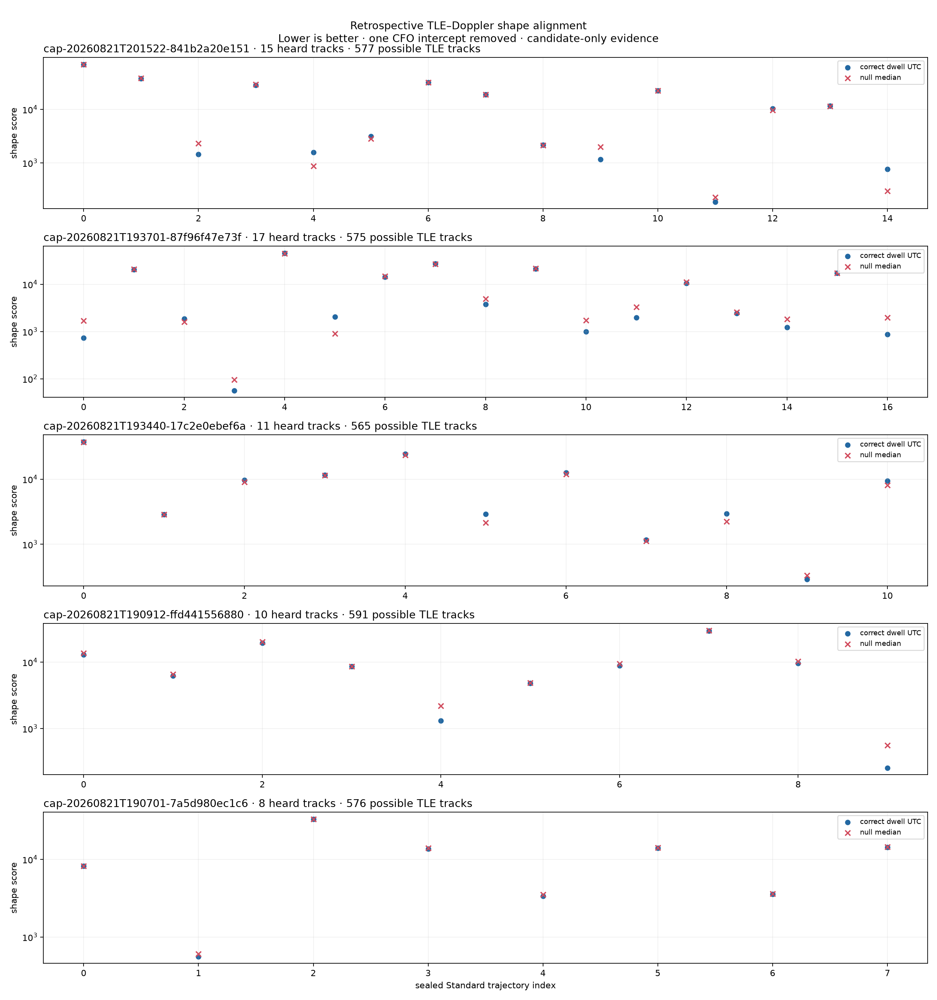

# Preliminary Standard-to-TLE Doppler alignment

Date: 2026-08-21 UTC

Status: retrospective candidate evidence only. This analysis does not claim a
Starlink spacecraft identity and does not write to the production catalog.

## Executive result

The five frozen, completed Standard dwells contain 61 final CFO trajectories
across 20 receiver paths. Comparing their frequency evolution with every
conservatively horizon-plausible Starlink TLE prediction produced two dwells
with encouraging time-specific alignment and three that remain ambiguous.

- `cap-20260821T193701-87f96f47e73f` is the strongest result: 13 of 17 heard
  tracks beat the nearest candidate in all four shifted-time controls, and
  STARLINK-11083 is the nearest candidate for 10 of 17 tracks.
- `cap-20260821T190912-ffd441556880` is also encouraging: 8 of 10 tracks beat
  all four time-shift controls, and STARLINK-11182 is nearest for 9 of 10.
- The other three dwells do not yet support attribution. In particular,
  `193440` and `190701` have zero tracks that beat all four null sets even
  though a repeated nearest object appears within each dwell.

Across the complete cohort, 26 of 61 tracks beat all four shifted-time nulls.
The nearest-object rank is frequently non-specific: 35 of 61 tracks have a
runner-up score within 5% of the best score. The useful preliminary signal is
therefore the combination of correct-time advantage and cross-path agreement,
not the nearest candidate by itself.

## Frozen cohort

| Session | Sealed Standard run | Release | Paths | Heard tracks |
|---|---|---|---:|---:|
| `cap-20260821T201522-841b2a20e151` | `capture-fb15d5f27c1c43b2b1c4f3fcf9fd13cf` | `4f0b17e5f` | 4 | 15 |
| `cap-20260821T193701-87f96f47e73f` | `capture-e19e3933f9ea4b079b2a7efa1a23baec` | `d9dfe1bf3` | 4 | 17 |
| `cap-20260821T193440-17c2e0ebef6a` | `capture-90ee94c2fc35408f9150f80df0db29cc` | `d9dfe1bf3` | 4 | 11 |
| `cap-20260821T190912-ffd441556880` | `capture-ea9a98e68a174cfeb5de46abf573b0e7` | `6bbc4c616` | 4 | 10 |
| `cap-20260821T190701-7a5d980ec1c6` | `capture-ef266427f2e044608b4ae0c8b6598413` | `6bbc4c616` | 4 | 8 |

Only the sealed `standard.glrt64-final-trajectory-table.v3` artifacts were
read. Each artifact's recorded SHA-256 digest was verified before use. No IQ
was re-analyzed and no radio was touched.

## Candidate comparison

| Session suffix | Possible TLE tracks | Median nearest score | Correct time beats all nulls | Dominant nearest object | Within-dwell count |
|---|---:|---:|---:|---|---:|
| `201522` | 577 | 10,377 | 5/15 | STARLINK-11412 | 9/15 |
| `193701` | 575 | 2,415 | 13/17 | STARLINK-11083 | 10/17 |
| `193440` | 565 | 9,350 | 0/11 | STARLINK-4209 | 4/11 |
| `190912` | 591 | 8,749 | 8/10 | STARLINK-11182 | 9/10 |
| `190701` | 576 | 10,975 | 0/8 | STARLINK-31239 | 7/8 |

The score is the existing Standard derivative-comparison form:

`slope RMS + duration * acceleration RMS + duration^2 * jerk RMS`

Lower is better. One constant frequency offset is fitted and removed because
these products declare an `uncalibrated_prior` frequency reference. Absolute
CFO therefore contributes no identity evidence in this pass.

For each heard track, the archive contains the top five TLE candidates, their
frequency-shape residuals, fitted nuisance offset, elevation, TLE age, timing
sensitivity, top-two margin, and four null scores. The repeated nearest-object
counts above are useful cross-path structure, but they are not independent
votes: trajectories in one dwell can share RF and processing conditions.

## Prediction provenance and assumptions

The run used the verified local Space-Track snapshot with content digest
`sha256:349b985cb345e2f87e9bdbbbe47caac1cbd48062eda71d308eb4fca5cdd50393`.
Its element ages at the selected matches range from about 3.6 to 22.5 hours.
Predictions were sampled every 0.5 seconds without the public 512-object display
cap. A conservative 0.375-degree horizon-boundary margin retained between 565
and 591 possible objects per dwell.

The observer location is the reviewed Spinnaker/Sausalito preset
(`37.858988`, `-122.478103`, ellipsoid height `-29 m`). It is an explicit input,
not capture-bound GPS authority. The analysis evaluates the recorded
first-sample timing estimate and its earliest/latest bounds. It also repeats
the full candidate search at `-600`, `-300`, `+300`, and `+600` seconds as a
chance-alignment control.

## Interpretation

The `193701` and `190912` dwells justify a focused second pass. Their correct
UTC advantage and repeated candidates are qualitatively stronger than the
other dwells. Even there, the large candidate inventory and small top-two
margins prevent a spacecraft claim.

The `201522`, `193440`, and `190701` results are valuable negative controls.
They show why a visually plausible or repeated nearest Doppler shape is not
sufficient: the same fitting procedure often finds an equally good trajectory
at deliberately wrong times.

## Lean next pass

1. Bind the actual capture GPS and antenna pointing/beam state to these five
   sessions. Use them to reduce the candidate set before ranking.
2. Jointly score tracks that overlap across the four receiver paths, with one
   shared spacecraft hypothesis and explicit receiver-specific nuisance terms.
3. Add denser empirical time-shift and wrong-channel/wrong-edge controls, then
   report an empirical rank or false-match rate instead of a four-null count.
4. Inspect overlays for `193701`/STARLINK-11083 and
   `190912`/STARLINK-11182 first. Require stability to timing bounds and a clear
   runner-up margin before considering any production association contract.

This sequence keeps the next iteration on sealed products and is more likely
to improve specificity than collecting more RF data.

## Archived evidence

- [`tle-doppler-alignment.json`](figures/2026_08_21_tle_doppler_alignment/tle-doppler-alignment.json): complete reproducible input provenance, observed trajectories, candidate rankings, and null scores.
- [`tle-doppler-candidates.csv`](figures/2026_08_21_tle_doppler_alignment/tle-doppler-candidates.csv): five ranked candidates per heard trajectory for tabular review.
- [`README.md`](figures/2026_08_21_tle_doppler_alignment/README.md): generated run summary.
