# Alias-aware, trajectory-conditioned replay analysis for `4e2a0c111a30`

## Decision

Trajectory replay must be evaluated against the acquisition basin belonging to
the replayed trajectory, not against the probe's global rank-zero winner. When
several CFO components coexist at one probe time, every accepted trajectory is
replayed independently and may associate with a different retained candidate.
The final physical-probe view then takes the best corrected result across all
trajectories evaluated at that probe.

This is an additive accounting rule. It does not mutate historical
`standard.trajectory-feedback` bytes, reinterpret an existing schema, or assign
previously unmatched rows to an unrelated component.

The analysis below is for capture
`cap-20260822T143411-4e2a0c111a30`, `stream-0/RX1`, using the persisted offline
products and sealed recording input. It is candidate-only analysis; no payload
claim is made.

## Executive result

The earlier conclusion that correction lost 110 positive probes was mostly an
accounting error. The global rank-zero baseline often followed a different CFO
component from the trajectory being corrected. Once each replay row is paired
with its own component:

| View | Retained | Lost | Gained | Negative | Baseline positive | Corrected positive |
|---|---:|---:|---:|---:|---:|---:|
| Old global-rank-zero comparison | 719 | 110 | 5 | 49 | 829 | 724 |
| Trajectory-conditioned, associated rows | 673 | 28 | 1 | 8 | 701 | 674 |
| Unique physical probes, best trajectory | 535 | 7 | 5 | 35 | 542 | 540 |

At the physical-probe level the net result is therefore **542 before and 540
after**, not 883 before and 724 after. Seven positive probes are not retained;
a targeted raw-IQ retest with normal production candidate retention recovered
six of those seven. That points to candidate pruning or basin choice in the
replay search, rather than trajectory correction destroying the underlying
signal.

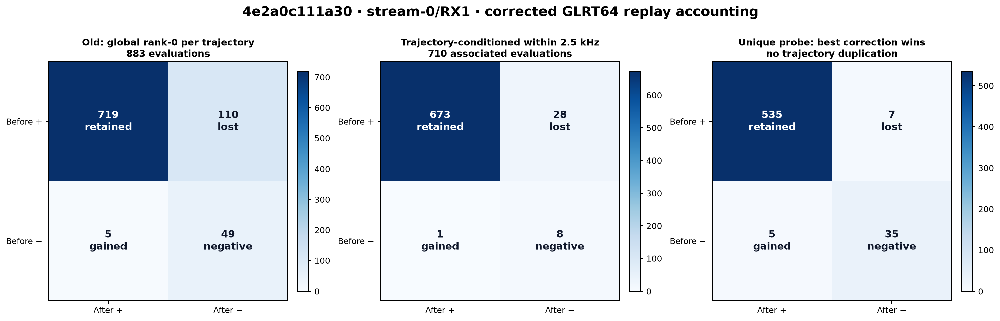

## What was wrong

GLRT acquisition retains multiple CFO basins at a probe. The original diagnostic
used the globally strongest candidate as the baseline for every replay row:

`global rank-0 margin -> corrected margin for trajectory T`

That comparison is invalid when trajectory `T` follows rank 1, 2, or 3. It asks
whether correction of one physical signal preserves the score of another
physical signal. The problem is especially visible for trajectory `ca2273`: its
supporting candidate is non-rank-zero in 86 of 101 inspected probes (rank 1: 32,
rank 2: 46, rank 3: 7, rank 9: 1). The typical separation from the global winner
is about 107 kHz, far outside the replay window.

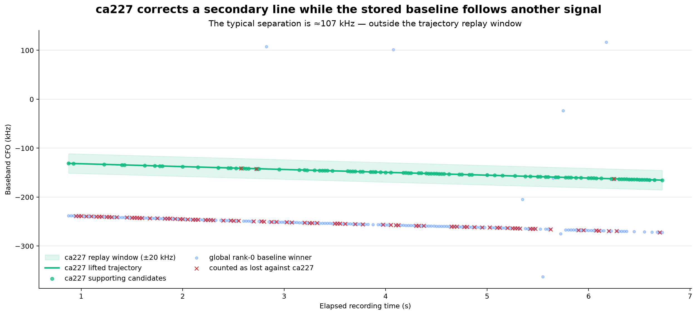

The corrected comparison predicts the physical CFO of trajectory `T` at the
probe, searches all retained acquisition candidates of the same detector method,
and selects the nearest candidate only if it lies inside the production
2.5 kHz association gate:

`candidate(T,t) = arg min_c |c.tracking_cfo - lifted_T(t)|`

If the minimum error exceeds the gate, that replay row is explicitly
**unassociated**. It is not counted as retained, lost, gained, or negative.
This prevents a nearby but unrelated signal from becoming synthetic ground
truth.

The physical lift uses the selected alias for each trajectory. The six aliases
in this path were `-2, -1, -2, -1, -1, -1` for trajectories `71d36e`, `ca2273`,
`3f991b`, `e5fd81`, `e4b9f6`, and `45043f` respectively. This fixes the earlier
replay bug where a mathematically equivalent wrapped trajectory could be applied
on the wrong physical alias.

## Two complementary accounting levels

Trajectory-level accounting answers: *when this trajectory has a geometrically
matching baseline component, did correction preserve its detector result?* A
single probe may contribute to more than one trajectory because several real
components can coexist at the same time.

Unique-probe accounting answers: *did any replayed trajectory preserve or recover
the best detectable signal at this physical probe?* It counts a sample start once
and uses the maximum corrected margin across all its replay rows. This is the
appropriate system-level count and avoids double-counting overlapping tracks.

The implementation is in
`src/leo/analysis/starlink/trajectory_accounting.py`. It deliberately preserves
both views because collapsing them would hide either component-level failures or
physical-probe performance.

## Per-trajectory results

There are 883 GLRT64 replay evaluations. Of those, 710 have a retained candidate
within 2.5 kHz of the trajectory and 173 remain explicitly unassociated.

| Trajectory | Evaluated | Associated | Unassociated | Retained | Lost | Gained | Negative |
|---|---:|---:|---:|---:|---:|---:|---:|
| `71d36e` | 96 | 95 | 1 | 95 | 0 | 0 | 0 |
| `ca2273` | 235 | 112 | 123 | 92 | 16 | 0 | 4 |
| `3f991b` | 185 | 171 | 14 | 166 | 5 | 0 | 0 |
| `e5fd81` | 117 | 105 | 12 | 103 | 2 | 0 | 0 |
| `e4b9f6` | 196 | 177 | 19 | 169 | 5 | 1 | 2 |
| `45043f` | 54 | 50 | 4 | 48 | 0 | 0 | 2 |

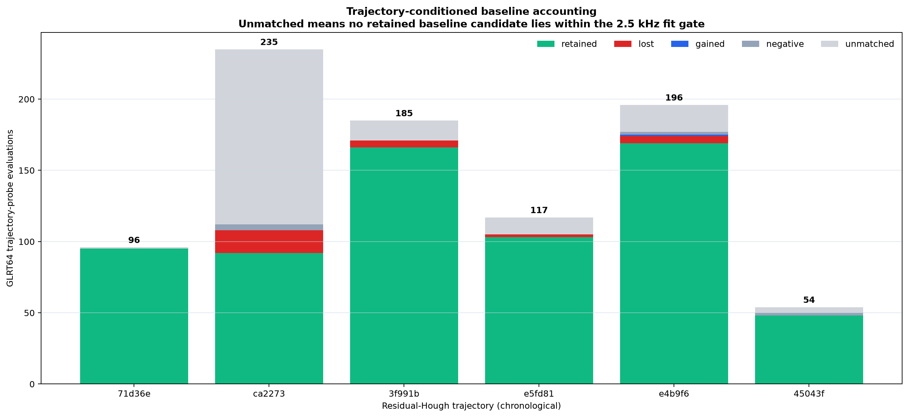

`ca2273` has 45 corrected-positive rows among its 123 unassociated evaluations.
Those results are useful evidence, but they cannot be labeled gained without a
same-component baseline. Its remaining 16 associated losses are real detector
transitions under the present gate and threshold, rather than the 91 apparent
losses previously attributed to it.

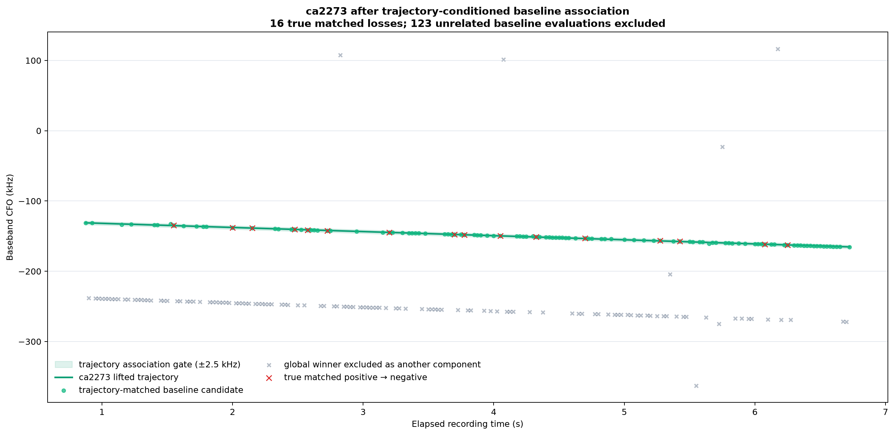

## Relationship to Hough and residual-Hough segmentation

The initial Hough stage discovers strong linear parents. Residual Hough then
finds piecewise-linear structure hidden inside a parent. The figure below shows
the GLRT CFO points, first-stage parent lines, and final residual-Hough segments.

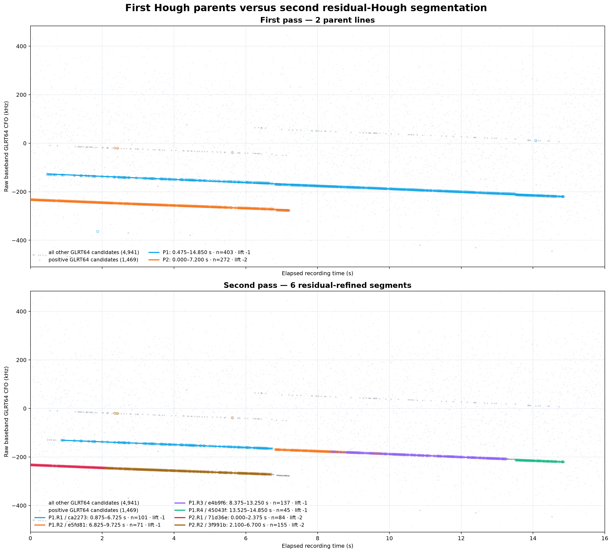

Discovery and replay have different association semantics:

- During discovery, support is exclusive within a greedy peel or partition so
  the same evidence does not manufacture several statistically strong lines.
- During replay and evaluation, association is non-exclusive across accepted
  trajectories. Two trajectories overlapping at one time may each bind to their
  own CFO candidate.
- If two trajectories compete for the same retained candidate, both component
  evaluations remain visible, while unique-probe aggregation counts the physical
  probe once.

For this path the two principal first-stage parents have 403 and 272 support
points. Their final residual segments account for 354 and 239 points, leaving 82
parent-support points outside the final assignment: 33 lie outside selected final
spans, 24 are inside a span but beyond the derived 221.946 Hz residual gate, and
25 are inside a current final gate but were not backfilled after proposal peeling.
Only 2 of the 82 occur in overlapping child time spans. This segmentation support
loss is distinct from replay detector loss and should not be combined with the
before/after probe counts.

## Remaining seven unique-probe losses

The system-level view has seven positive-to-negative probes. Re-running those
sample starts directly from raw IQ with the normal production multi-candidate
retention recovered six. The diagnostic therefore supports this causal ordering:

1. alias-aware correction is necessary;
2. trajectory-conditioned baseline association removes the large false-loss
   count caused by overlapping components;
3. most of the small remaining physical-probe loss is caused by replay candidate
   retention/search behavior;
4. one probe remains a genuine unresolved regression under this retest.

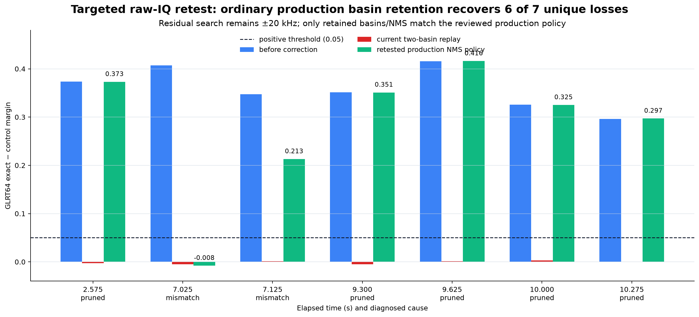

This does not prove correction universally improves detection. It establishes
that the old denominator and pairing were wrong, and gives a truthful baseline
for evaluating subsequent replay-search changes.

## Implemented paired replay and offline result

The follow-up implementation removes the remaining acquisition-basin mismatch.
It does **not** reacquire a new rank-zero winner and call that the corrected
version of an arbitrary baseline component. For each replay row it now:

1. predicts the alias-lifted trajectory CFO at the probe time;
2. associates the nearest retained same-method baseline candidate inside the
   declared 2.5 kHz gate;
3. applies the signed trajectory correction to the IQ;
4. transports that candidate's acquisition epoch into the corrected IQ;
5. seeds GLRT64 with the candidate CFO minus the lifted trajectory CFO, which is
   the expected residual CFO after correction; and
6. scores that paired basin directly.

Independent reacquisition is retained as a diagnostic field. It is no longer
used as the truth value for the paired trajectory result. Unmatched rows remain
explicitly unmatched, and the immutable `standard.trajectory-feedback.v3`
projection is unchanged.

The Standard lane publishes additive schema-v2 JSON and PNG products. Research
preserves its immutable schema-v1 research envelope, carries the same
schema-v2 accounting payload inside that envelope, and publishes a schema-v2
PNG. Existing schema-v1 Standard presentation remains readable through a
fallback; no published payload was reinterpreted.

### Standard result

The exact persisted Standard pilot scan, trajectory bank, feedback product, and
sealed raw IQ were replayed offline for `stream-0/RX1`.

| Metric | Independent reacquisition | Paired transported epoch |
|---|---:|---:|
| Associated positive rows retained | 673 / 701 | **701 / 701** |
| Associated positive rows lost | 28 | **0** |
| Unique positive probes retained | 535 / 542 | **539 / 542** |
| Unique positive probes lost | 7 | **3** |
| Total corrected-positive unique probes | 540 | **541** |

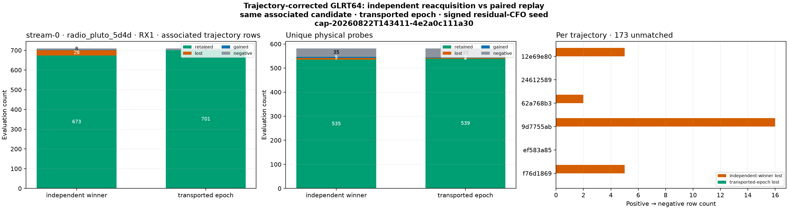

### Research result

Research retains a larger candidate inventory and evaluates 1,407 replay rows,
of which 1,175 have a geometrically associated baseline candidate.

| Metric | Independent reacquisition | Paired transported epoch |
|---|---:|---:|
| Associated positive rows retained | 1,097 / 1,145 | **1,145 / 1,145** |
| Associated positive rows lost | 48 | **0** |
| Unique positive probes retained | 798 / 808 | **801 / 808** |
| Unique positive probes lost | 10 | **7** |
| Total corrected-positive unique probes | 821 | **828** |

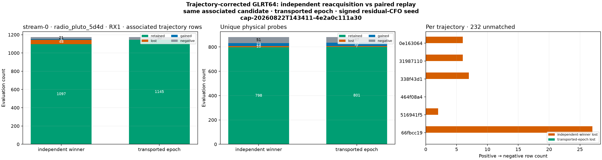

The 48 Research row losses from independent reacquisition are the cleanest
causal check. Paired replay recovers all 48 above the 0.05 GLRT64 threshold. The
independent winner lands inside 2.5 kHz of residual zero for only 1 of 48 rows;
the transported-epoch score does so for 48 of 48. Median absolute residual CFO
falls from 50.049 kHz to 0.155 kHz, and the largest paired residual is 0.516 kHz.

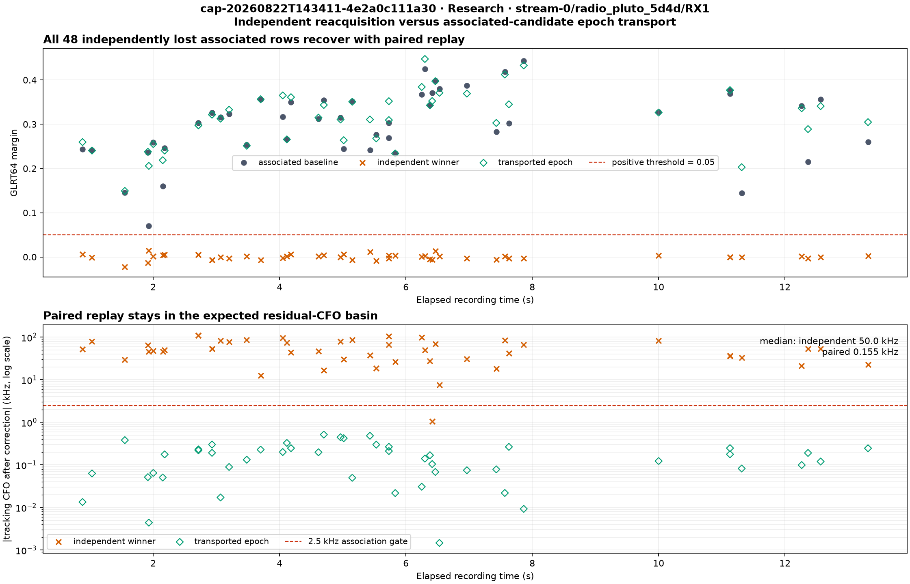

### What the remaining losses mean

All seven remaining Research positive-to-negative physical probes occur where
the global detector has a positive component but the replayed trajectory bank
has no positive associated baseline component. Their elapsed times are 6.830,
6.915, 7.030, 7.065, 7.080, 8.180, and 14.815 seconds. These are trajectory-bank
coverage gaps, not failures to preserve an associated signal. Transporting an
epoch cannot recover a component that the trajectory bank did not represent.

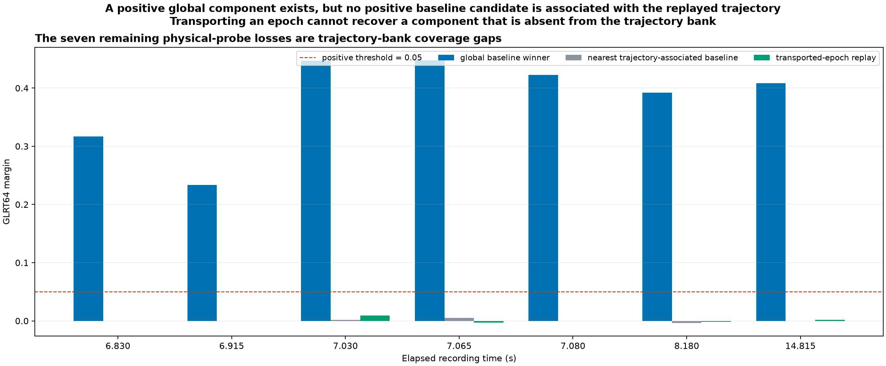

This distinction is intentional in schema v2: associated-row retention measures
whether correction preserves the same component, while unique-probe accounting
also exposes whether the accepted trajectory bank covers every globally active
component.

## Independent holdout: `841b2a20e151`

To test whether the paired result was specific to `4e2a0c111a30`, the method was
run unchanged on `cap-20260821T201522-841b2a20e151`, `stream-0/RX1`. This dwell
was recorded 18.31 hours earlier and has materially more signal evidence: 1,196
probe times contain at least one positive retained GLRT64 candidate, and 1,153
have a positive global winner.

The first preselected holdout was `4d536888cfbc`, but it was rejected before
scoring because raw chunk `iq-000007.ci16.zst` fails decompression with a data
corruption error. No partial result from that dwell was used. `841b2a20e151` was
then selected as the next earlier reviewed signal dwell.

The holdout used its exact persisted eight-candidate pilot inventory. Rebuilding
the pilot product reproduced those frozen bytes exactly. The current production
Hough plus residual-Hough implementation was then refit from those detections,
yielding eight replay trajectories. The same 2.5 kHz association gate, 0.05
positive margin, GLRT size, signed residual-CFO policy, and epoch-transport rule
were used without dwell-specific tuning.

### Same-component result generalizes

| Metric | Independent reacquisition | Paired transported epoch |
|---|---:|---:|
| Associated positive rows retained | 870 / 919 | **919 / 919** |
| Associated positive rows lost | 49 | **0** |
| Associated negative rows gained | 9 | 1 |
| Associated negative rows remaining negative | 42 | 50 |

All 49 independently lost positive rows recover with paired replay. Only 1 of 49
independent winners is within 2.5 kHz of residual zero; all 49 paired scores are
inside the gate. Median absolute residual CFO falls from 45.814 kHz to 0.112 kHz.
The weakest recovered paired margin is 0.0856, still comfortably above the fixed
0.05 threshold.

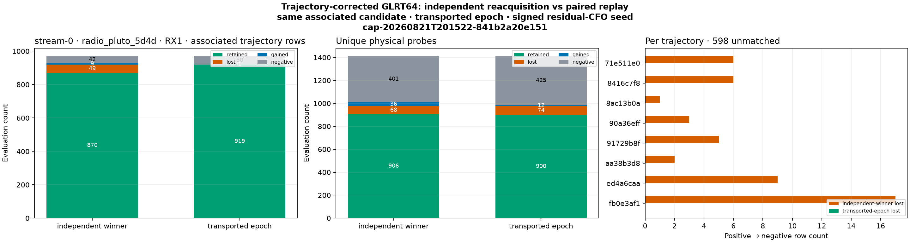

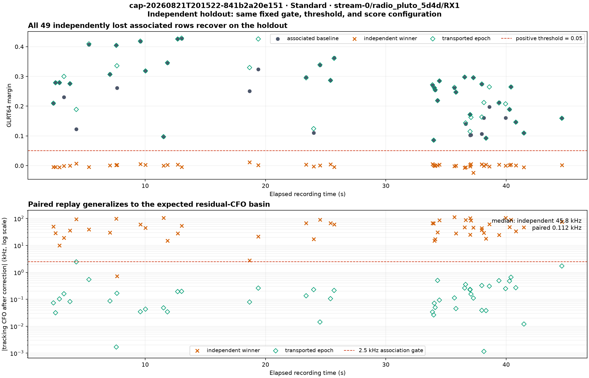

This is strong evidence that associated-candidate epoch transport is correcting
a general acquisition-basin mismatch rather than fitting constants to the first
dwell.

### Any-signal detection needs both views

The holdout also identifies an important product-semantics constraint. Paired
replay answers whether the *associated component* survives correction.
Independent reacquisition can instead land on a different or currently
unmodelled component, which is useful when the scanner question is simply
whether any signal is active.

| Unique physical probes | Retained | Lost | Gained | Negative | Corrected positive |
|---|---:|---:|---:|---:|---:|
| Independent winner | 906 | 68 | 36 | 401 | 942 |
| Paired transported epoch | 900 | 74 | 12 | 425 | 912 |
| Diagnostic hybrid OR | **946** | **28** | **41** | **396** | **987** |

Among the 974 baseline-positive probes, both methods retain 860, independent
reacquisition alone retains 46, paired replay alone retains 40, and neither
retains 28. The methods are therefore complementary rather than substitutes.

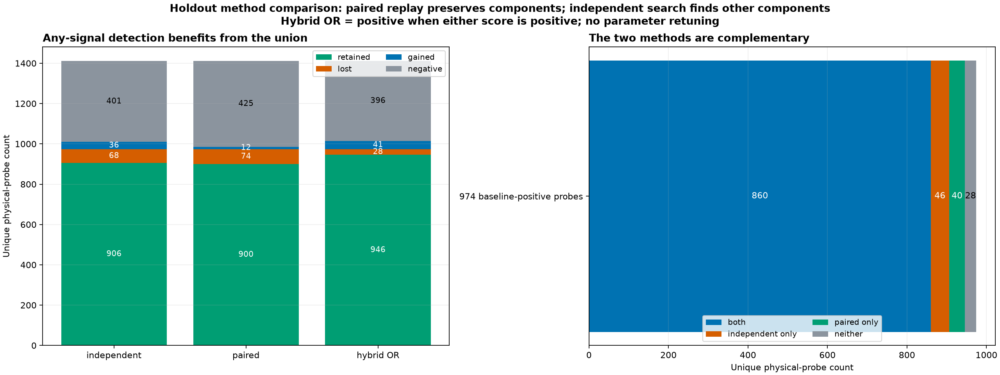

The hybrid OR is a diagnostic upper-recall policy, not yet a production
recommendation. OR-ing two tests changes the false-alarm behavior. It must first
be evaluated on the fully inactive real and synthetic scan datasets at a fixed
false-positive budget. Until then, paired replay should be the authoritative
same-component retention metric and independent reacquisition should remain a
separate any-signal diagnostic.

The machine-readable holdout result is
[holdout-841-method-comparison-summary.json](figures/2026_08_22_4e2a0c111a30_alias_aware_trajectory_accounting/holdout-841-method-comparison-summary.json).

## Production integration and verification

The implementation and holdout evidence were merged to `main`, pushed, release
qualified, and deployed as exact revision
`9f45c2aefc60b355ad1da173211c9c1255a13395` on 2026-08-22. The deployed
revision was then used to reprocess both the Standard and Research lanes for the
original dwell. This section records the final production evidence; it
supersedes the earlier offline-only integration status.

### Contract and policy status

1. `standard.trajectory-feedback.v3` remains an exact legacy projection.
2. Standard publishes `standard.trajectory-conditioned-accounting.v2` JSON and
   PNG products carrying independent-winner and transported-epoch results.
3. Research retains its schema-v1 research envelope around the identical
   schema-v2 accounting payload and publishes its trajectory-accounting PNG as
   schema v2.
4. The association gate and GLRT size come from declared lane configuration;
   there is no dwell-specific scoring constant.
5. Standard and Research share the implementation and differ only through their
   declared configurations and candidate inventories.
6. Presentation loads schema v2 and falls back to schema v1 for historical
   Standard runs.
7. Paired transported-epoch replay is the authoritative same-component
   retention metric. Independent reacquisition remains a separately visible
   any-signal diagnostic. Hybrid OR is not enabled as production policy because
   its false-alarm rate has not yet been calibrated on inactive/null data.

### Qualification and deployment

| Evidence | Result |
|---|---|
| Scoped `./ops test` | Passed; mypy, three component test files, Ruff check and Ruff format |
| Full `./ops test --release` | Passed all 165 planned gates in 50.620 s |
| Protected release qualification | `release-9f45c2a-20260822T203316Z`; passed in 148.251 s |
| Deployment | Healthy; completed in 192.486 s; no migration |
| Release selectors | API, worker, acquisition and default selectors all resolved to exact revision `9f45c2a` |
| Services after verification | API, both worker units, acquisition and reconciliation timer active |

The immutable production receipts are:

- scoped test receipt digest
  `sha256:1b21e4530cb03b2c9abd355bd4d3c859f83237455e11df270f7bc942b526dc36`;
- full release-test receipt digest
  `sha256:d39c231ee8279e1569d791bb13036f36744eb60d7553ac5dae9b00e3b0a48669`;
- protected release-qualification receipt digest
  `sha256:387c70da9673a7b85042d9a6844df6ba95ac6669ba8b7b1fbdd94b56c762a5ff`;
  and
- deployment receipt digest
  `sha256:f2592c03beb07e60ade662ec114929f706f216f482af85b1b873112668cd8ca7`.

### Persisted production reruns

Both production runs sealed successfully, promoted in their respective lanes,
and produced 12 successful jobs with no failed or retried job.

| Lane | Run ID | Runtime | Evaluated / associated / unmatched | Independent associated retained / lost | Paired associated retained / lost | Independent unique retained / lost / gained | Paired unique retained / lost / gained |
|---|---|---:|---:|---:|---:|---:|---:|
| Standard | `reprocess-04811760a6fa41da8de6a50902729b7f` | 188 s | 883 / 710 / 173 | 673 / 28 | **701 / 0** | 535 / 7 / 5 | **539 / 3 / 2** |
| Research | `research-9d33f958c6884f26a2433c84937207b3` | 907 s | 1,407 / 1,175 / 232 | 1,097 / 48 | **1,145 / 0** | 798 / 10 / 23 | **801 / 7 / 27** |

These persisted counts exactly match the pre-deployment offline result. In both
lanes, paired replay has zero positive-to-negative transitions among associated
same-component rows. The three Standard and seven Research unique-probe losses
therefore do not contradict paired retention: unique-probe accounting also
measures trajectory-bank coverage of the globally positive component.

The following figures are the exact PNG bytes generated by the deployed
pipeline, copied from the sealed production artifact store. Their repository
file digests equal the catalog product digests.

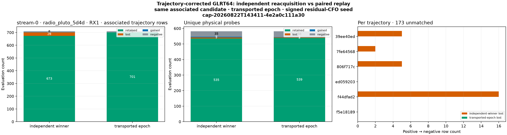

The Standard PNG is 2,880 × 768 pixels, 143,836 bytes, and has digest
`sha256:1b2d890f4fa63fcea64500407cc73eb83eeb47ba6d36ca24816b3bdf239dd9eb`.
Its paired JSON product has digest
`sha256:6919f35dc2c917dac3964acf3a72b4383058e5a8bda0174d3526e0fe6b65671b`.

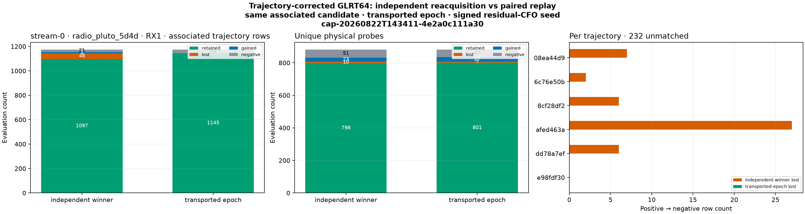

The Research PNG is 2,880 × 768 pixels, 143,951 bytes, and has digest
`sha256:44a1490886eb1edb8b2b933d5c87507ab1db0d40944dc5ed9203089c88ac73de`.
Its immutable research envelope has digest
`sha256:3388326de1db9135fd307a6009cb3f43beff5fe905c01f0cacf3ed58eb079819`
and declares payload kind `standard.trajectory-conditioned-accounting`, schema
version 2.

The named Standard and Research `trajectory-accounting.png` API routes both
returned HTTP 200, `image/png`, immutable artifact-cache headers, and bytes whose
SHA-256 digests exactly matched the catalog rows. The Standard and Research UI
hierarchies both reported `current` at revision `9f45c2a`.

### Verification coverage

- Secondary acquisition candidates are selected instead of an unrelated global
  winner.
- An absent same-component baseline remains explicitly unmatched.
- Overlapping trajectories associate independently at the same sample start.
- Unique physical probes use the best replay margin and are counted once.
- Alias-aware replay tests cover non-zero physical aliases.
- Regression coverage includes wrong-basin independent acquisition, exact epoch
  transport, signed residual-CFO seeding, immutable V3 projection, strict V2
  codec validation, deterministic V2 PNG rendering and historical V1
  presentation fallback.
- Seventy-four focused analysis, API, application and presentation tests passed;
  Ruff, mypy and `git diff --check` passed before the broader release gates.
- Both `4e2a0c111a30` offline lane replays reproduce the persisted independent
  `trajectory-feedback.v3` rows exactly before producing additive V2 results.
- The `841b2a20e151` holdout reproduces its frozen pilot-scan bytes exactly before
  current segmentation and paired replay.

The machine-readable inputs and results are:

- [initial trajectory-conditioned accounting](figures/2026_08_22_4e2a0c111a30_alias_aware_trajectory_accounting/trajectory-conditioned-accounting-summary.json);
- [offline Standard V2](figures/2026_08_22_4e2a0c111a30_alias_aware_trajectory_accounting/paired-replay-standard-summary.json);
- [offline Research V2](figures/2026_08_22_4e2a0c111a30_alias_aware_trajectory_accounting/paired-replay-research-summary.json);
- [independent holdout comparison](figures/2026_08_22_4e2a0c111a30_alias_aware_trajectory_accounting/holdout-841-method-comparison-summary.json); and
- [production verification](figures/2026_08_22_4e2a0c111a30_alias_aware_trajectory_accounting/production-verification-summary.json).

## Limitations

- This is two signal-bearing dwells on one receiver path. Broader receiver,
  channel, inactive-dwell, and synthetic-null validation is still required.
- The 2.5 kHz association gate is inherited from current production fitting
  policy; it is not a learned satellite-specific constant.
- Unassociated corrected-positive rows are evidence without a trustworthy
  before-state, not automatic gains.
- Hough support membership, acquisition-candidate retention, replay search, and
  detector threshold transitions are separate mechanisms and must remain
  separately observable.
- No TLE identity is inferred here. Satellite association remains downstream of
  the statistical CFO trajectory and detector evidence.
