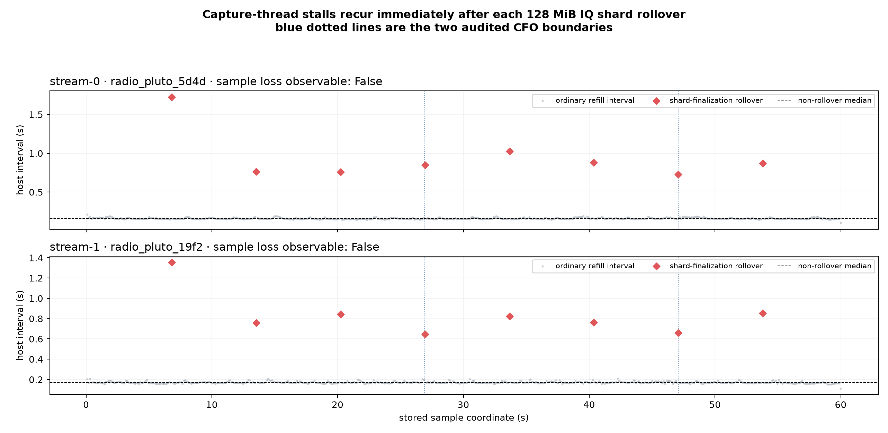
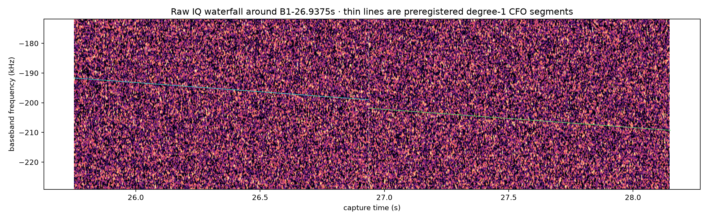
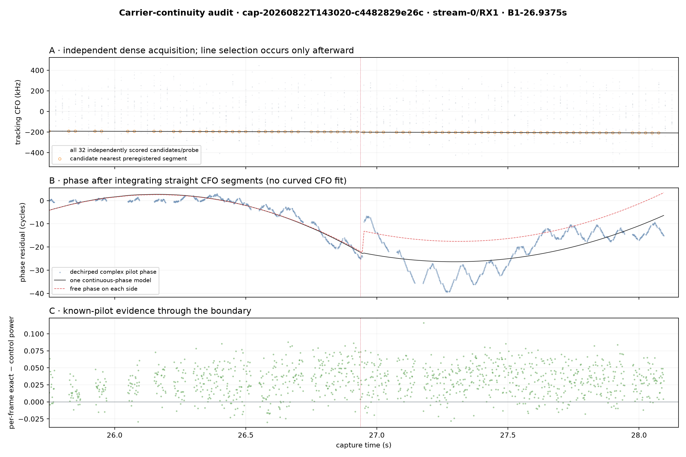
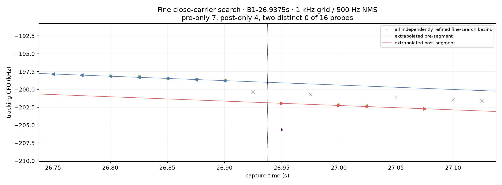
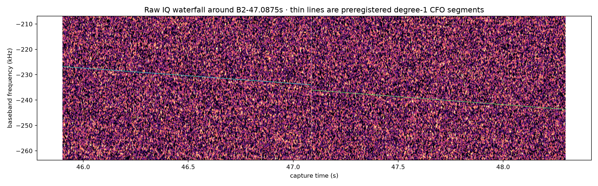
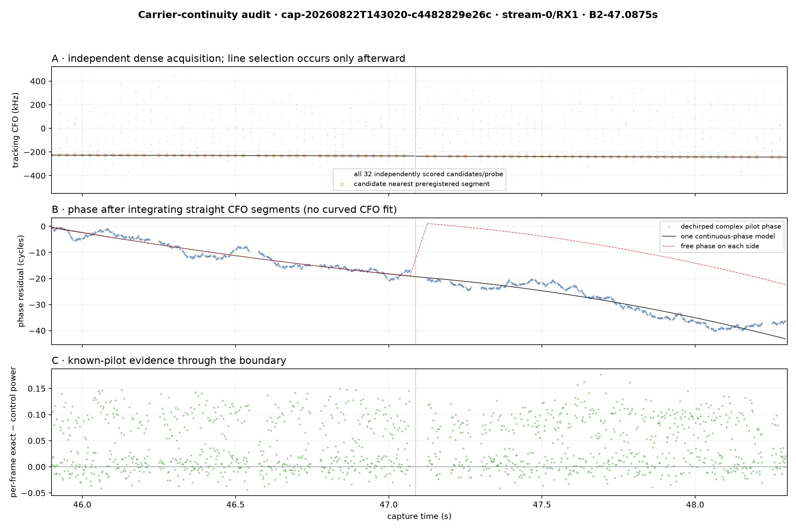
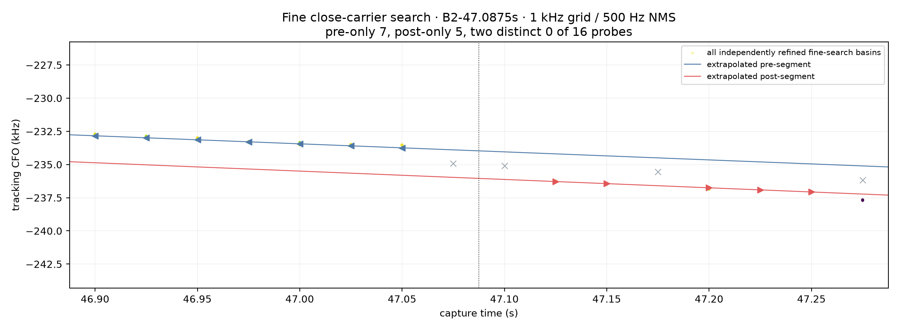

# Are adjacent linear CFO segments the same carrier?

## Answer

The same-physical-carrier explanation is now favored, but phase continuity cannot be proven from this recording. Only 0 of 2 preregistered boundaries has a coherent phase or arrival-time observable, and both boundaries align within 11 ms of repeatable capture-thread stalls at IQ-shard rollover. Because hardware sample loss is unobservable, a real continuous carrier can be split in stored sample time.

This is a receiver-relative, candidate-only test. It does not identify a satellite and does not decode payload. A continuous-carrier result is evidence about one RF component, not spacecraft identity.

## Dominant finding: the boundaries coincide with capture stalls

The stored IQ files have contiguous **sample indexes**, but this capture has no hardware device sample counter, `sample_loss_observable=false`, timeline continuity `unknown`, and `phase_coherent=false`. Host timestamps expose a repeatable stall immediately after every 128 MiB compressed IQ shard rollover.

| CFO boundary | Stall sample coordinate (s) | Boundary − stall coordinate | stream-0 excess host delay | stream-1 excess host delay |
|---|---:|---:|---:|---:|
| B1-26.9375s | 26.948403 | -10.9 | 0.691 | 0.477 |
| B2-47.0875s | 47.081062 | +6.4 | 0.569 | 0.490 |

The alignment is exceptionally close: B1 is 10.9 ms before the affected refill edge and B2 is 6.4 ms after it. The excess delay is 0.48–0.69 s across the two independent radios. This is the strongest explanation for the segmentation: the synchronous capture loop reads one refill, finalizes/compresses/fsyncs a full shard in `StreamBundleWriter.append`, and only then requests the next radio refill. If the Pluto buffers overrun during that pause, elapsed RF time is omitted while the stored sample index remains contiguous.

We cannot convert host delay exactly into missing samples because the firmware reports no device counter or overflow flag. But the timing, recurrence, two-radio agreement, and sign all fit one real carrier observed across an unmeasured capture gap. This makes a local capture artifact substantially more likely than a satellite changing Doppler abruptly.

## Frozen example and method

Dwell `cap-20260822T143020-c4482829e26c`, sealed reprocessing `reprocess-806801e6519b4fcdb95f597f98c25982`, pipeline release `6e71fbae5884761274e8ee621467abbb28d9e314`, path `stream-0/RX1`, scope `sha256:424ec0775d22b40bd7f84ab693a65c412f5675c2c1aba6a4e3e89bf9342ba9ba`. The two boundaries were selected before inspecting complex phase because their neighboring final straight segments are separated by only 25 and 75 ms.

Every 20 ms probe was reacquired independently with the Research search: 81 coarse CFO hypotheses, 32 retained/scored basins, GLRT-4096, and no neighboring observation, line, TLE, or phase model entering acquisition. Candidate association to the frozen straight segments happens afterward.

Carrier frequency is degree one on each side. The phase display integrates those straight frequency lines, so a quadratic term exists only in phase. No degree-2 or degree-3 CFO trajectory is fitted.

## What this step is testing

1. The independent GLRT asks only whether a known Starlink pilot is present at each 20 ms probe and returns several local CFO likelihood basins.
2. Only after scoring do we select the candidate nearest each already-frozen straight CFO segment. This prevents the line from creating the detections it is meant to test.
3. We return to raw complex IQ, dechirp with the integral of that straight CFO, and ask whether one phase state can bridge the gap better than two independent phase offsets.
4. Separately, a finer 1 kHz search asks whether both segment frequencies coexist in the same probe. These are different hypotheses: phase bridging tests sameness; two simultaneous peaks test multiplicity.

The input is immutable CI16 IQ plus frozen degree-1 segment parameters. The output is a boundary-level evidence record; it is not a merged track, TLE match, or satellite ID.

| Search parameter | Primary independent acquisition | Close-carrier diagnostic | Meaning |
|---|---:|---:|---|
| Probe / spacing | 20 / 25 ms | 20 / 25 ms | Independent raw-IQ window and cadence |
| Residual-CFO interval | ±400 kHz | ±400 kHz | Entire searched baseband offset |
| Coarse CFO step | 10 kHz | 1 kHz | Initial frequency hypotheses |
| Fine radius / step | 10 kHz / 100 Hz | 1 kHz / 25 Hz | Local refinement around each basin |
| Conditioned radius / step | 1 kHz / 25 Hz | 500 Hz / 10 Hz | Final known-pilot refinement |
| Retained basins | 32 | 32 | Independently scored local likelihood maxima |
| CFO NMS separation | 10 kHz | 500 Hz | When refined peaks count as distinct |
| GLRT residual grid | 4096 | 4096 | Exact-versus-control pilot score resolution |

| Boundary | Gap | Pre rate (Hz/s) | Post rate (Hz/s) | Phase observable? | Timing observable? | Fine-search coexistence probes | Result |
|---|---:|---:|---:|---:|---:|---:|---|
| B1-26.9375s | 25 ms | -6188.3 | -6113.6 | **no** | **no** | 0 | **inconclusive: pilot statistic is not phase/timing coherent** |
| B2-47.0875s | 75 ms | -6055.8 | -6291.4 | **no** | **no** | 0 | **inconclusive: pilot statistic is not phase/timing coherent** |

## B1-26.9375s

Classification: **inconclusive: pilot statistic is not phase/timing coherent** — phase residuals are uniform-like and acquisition epochs are diffuse.

The fitted boundary-frequency discontinuity is -2865.2 Hz. The wrapped phase discontinuity is +0.056 cycles (+20.1°). The continuous-phase model has 0.99× the median circular error of a model that grants each side an independent phase.

The arrival-epoch jump is +1177.12 samples, but its circular dispersions are 875.0/888.7 samples. That epoch statistic is not coherent enough to interpret the jump.

| Coherence diagnostic | Value | Passing behavior |
|---|---:|---|
| Independent-phase median circular error | 0.255 cycles | Clearly below the 0.25-cycle uniform-phase baseline |
| One-phase / independent-phase error ratio | 0.993 | Near 1 only after phase itself is coherent |
| False boundary inside pre segment | -0.316 cycles | Near 0 |
| False boundary inside post segment | -0.012 cycles | Near 0 |
| Epoch dispersion, pre/post | 875.0 / 888.7 samples | Tens, not hundreds–thousands, of samples |

Normalized pilot-shape similarity is 0.996. This is not an independent emitter fingerprint: it is formed after correlating both sides against the same exact pilot template.

The fine search found 7 pre-only, 4 post-only, and 0 simultaneous-distinct detections among 16 boundary probes. This is evidence against two overlapping resolved carriers at this threshold. It does not distinguish one carrier that retuned from two carriers that transmitted back-to-back.

## B2-47.0875s

Classification: **inconclusive: pilot statistic is not phase/timing coherent** — phase residuals are uniform-like and acquisition epochs are diffuse.

The fitted boundary-frequency discontinuity is -2075.4 Hz. The wrapped phase discontinuity is -0.407 cycles (-146.6°). The continuous-phase model has 1.03× the median circular error of a model that grants each side an independent phase.

The arrival-epoch jump is +1324.28 samples, but its circular dispersions are 1305.6/896.1 samples. That epoch statistic is not coherent enough to interpret the jump.

| Coherence diagnostic | Value | Passing behavior |
|---|---:|---|
| Independent-phase median circular error | 0.245 cycles | Clearly below the 0.25-cycle uniform-phase baseline |
| One-phase / independent-phase error ratio | 1.033 | Near 1 only after phase itself is coherent |
| False boundary inside pre segment | -0.475 cycles | Near 0 |
| False boundary inside post segment | +0.009 cycles | Near 0 |
| Epoch dispersion, pre/post | 1305.6 / 896.1 samples | Tens, not hundreds–thousands, of samples |

Normalized pilot-shape similarity is 0.995. This is not an independent emitter fingerprint: it is formed after correlating both sides against the same exact pilot template.

The fine search found 7 pre-only, 5 post-only, and 0 simultaneous-distinct detections among 16 boundary probes. This is evidence against two overlapping resolved carriers at this threshold. It does not distinguish one carrier that retuned from two carriers that transmitted back-to-back.

## Four-path common-mode control at B2

The degree-1 final banks put a negative frequency step at essentially the same B2 time on all four receiver paths:

| Path | Boundary | Pre rate (Hz/s) | Post rate (Hz/s) | Fitted step (Hz) |
|---|---:|---:|---:|---:|
| stream-0/RX0 | 47.0625 s | -6065.0 | -6210.4 | -2084.9 |
| stream-0/RX1 | 47.0875 s | -6055.8 | -6291.4 | -2075.4 |
| stream-1/RX0 | 47.0500 s | -6486.9 | -5743.7 | -1799.8 |
| stream-1/RX1 | 47.0625 s | -6514.3 | -5752.1 | -1729.5 |

The agreement across both streams and both receiver indices makes a single-channel Pluto or LNB glitch less likely. Coupled with the independently measured shard-rollover stalls on both capture threads, it instead supports a common acquisition/storage mechanism. It does not establish phase continuity because the potentially missing samples are not counted.

## Important limitation: close-carrier coexistence

The primary Research acquisition has a 10 kHz coarse grid and 10 kHz CFO non-maximum suppression. The additional close search uses a 1 kHz coarse grid and 500 Hz suppression inside ±0.2 s. Even there, only distinct GLRT-refined peaks count; several coarse seeds that converge to one CFO are one likelihood basin.

In both audited boundaries the fine search changes from pre-only detections to post-only detections, with no probe containing two distinct resolved peaks. That rules out only the simple *overlapping two-carrier* picture at the tested margin and 500 Hz separation. It remains compatible with either one retuning carrier or two scheduled back-to-back carriers.

## Why phase continuity is not recoverable from today's detector output

The known-pilot GLRT is intentionally a detection statistic: it maximizes over CFO and arrival epoch, then compares exact-pilot and control **power**. Squaring magnitude removes the complex phase. Each probe is also acquired independently, so its best epoch can move within the Starlink frame period. Re-extracting a complex correlation afterward supplies a local phase, but not a stable phase or integer-frame reference shared by adjacent probes.

The measured median circular phase errors are near the 0.25-cycle uniform-phase baseline, and the acquisition-epoch dispersions are hundreds to more than one thousand samples. Consequently, a small fitted phase jump at one boundary would be a chance number, not continuity evidence.

## Reproducibility artifacts

Each candidate gzip contains every independently scored basin; each adjacent run JSON records the complete search configuration, interval, probe count, and runtime:

- `b1-research-candidates.jsonl.gz` / `b1-research-run.json`
- `b2-research-candidates.jsonl.gz` / `b2-research-run.json`
- `b1-close-candidates.jsonl.gz` / `b1-close-run.json`
- `b2-close-candidates.jsonl.gz` / `b2-close-run.json`
- `carrier-continuity-metrics.json` is the machine-readable final evidence record.

## Interpretation rules

- Phase continuity is usable only after stable within-segment controls beat the 0.25-cycle   uniform-phase baseline.
- The current known-pilot magnitude detector does not satisfy that requirement.
- Two resolved simultaneous peaks, or discontinuous timing/fingerprint, supports two carriers.
- A matching event on unrelated signals or both receivers supports an SDR/LNB/common-mode cause.

## Next gated experiment

First decouple radio reads from compression, shard close, `fsync`, and rename using a bounded writer queue or preallocated ring buffer. Persist a device sample counter and hardware overflow evidence; a capture without either must not claim RF-time or phase continuity across a host stall. Add an integration test that deliberately delays shard finalization and proves radio refill cadence is unaffected.

Then add a research-only phase-aware continuation stage that starts from a detected segment and persists the complex coherent pilot amplitude, absolute sample epoch, frame index ambiguity, refined CFO, and residual phase for every frame. Compare a continuous state `[phase, CFO, constant CFO rate]` against a phase-reset state on held-out frames. Then run the same decision on matched-SNR synthetic continuous/reset/two-carrier injections and within-segment false boundaries. Do not merge adjacent Standard segments automatically until those controls define a reviewed threshold.
