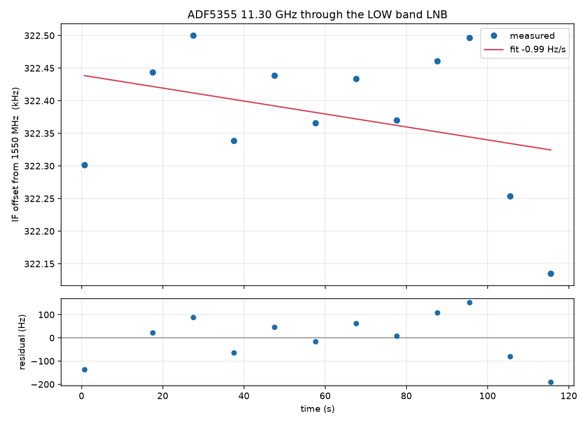

# Dual-LNB oscillator drift reference and implications for CFO tracks

## Executive conclusion

The conducted dual-tone bench measurement in
[`misko/adf5355_tester`](https://github.com/misko/adf5355_tester) is now the
best local empirical reference for LNB-induced CFO dynamics. At source revision
[`06180507`](https://github.com/misko/adf5355_tester/blob/06180507bfcd427551a166bd3ab0f6311aff2d34/docs/dual_tone.md),
two consumer LNBs measured over separate approximately two-minute windows gave:

| Path | Window | Points | Fitted slope | Formal significance | Residual RMS |
|---|---:|---:|---:|---:|---:|
| RX0, LNB #1 | 114.8 s | 12 | **−0.992 ± 0.888 Hz/s** | 1.1σ | 97.8 Hz |
| RX1, LNB #2 | 110.8 s | 12 | **+1.197 ± 0.889 Hz/s** | 1.3σ | 95.3 Hz |
| Difference | sequential runs | — | **+2.189 ± 1.256 Hz/s** | 1.7σ | — |

None of the three slopes is statistically resolved at 2σ. Approximate 95%
intervals are −2.73 to +0.75 Hz/s, −0.55 to +2.94 Hz/s, and −0.27 to
+4.65 Hz/s respectively. The strongest statement from these two-minute fits is
therefore not a measured ramp; it is that each LNB wandered with about 95–98 Hz
residual RMS and no stable linear drift was established.

This does **not** make LNB dynamics negligible. A 60 s fit to LNB #1 in a nearby
window produced −10.446 ± 1.684 Hz/s (6.2σ), while the following 120 s fit gave
−0.992 ± 0.888 Hz/s. Other source measurements include −22.3 Hz/s on a different
evening and sign reversals between neighboring windows. The source's central
lesson is correct: the oscillator wanders; a short, significant local slope is
not a stationary rate that may be extrapolated.

## Measurement provenance

| Field | Source value |
|---|---|
| Source repository | [`misko/adf5355_tester`](https://github.com/misko/adf5355_tester) |
| Source document | [`docs/dual_tone.md`](https://github.com/misko/adf5355_tester/blob/06180507bfcd427551a166bd3ab0f6311aff2d34/docs/dual_tone.md) |
| Pinned source revision | `06180507bfcd427551a166bd3ab0f6311aff2d34` |
| Path | Closed conducted path; no antenna |
| Transmitted reference | ADF5355, 11.30 GHz low-band-identification tone |
| LNB low-band nominal LO | 9.75 GHz |
| Receiver | PlutoSDR, 2.5 MS/s single-shot captures |
| Drift acquisition | One fixed receiver tuning per run; estimate timestamped at measurement-window center |
| Fit | Straight line with formal ordinary least-squares slope standard error |
| Important timing caveat | The two LNB drift runs were sequential and about seven minutes apart, not simultaneous |

The copied plots below are byte-for-byte copies from that pinned revision. They
are included locally so this report remains renderable if the source repository
moves, while the links above preserve attribution and full experimental detail.

## Why the observation window changes the answer

### Significant 60 s local slope


Six points spanning 54.8 s gave −10.446 ± 1.684 Hz/s with 61.0 Hz residual RMS.
The formal 6.2σ result says that a line fit this short window better than a flat
line under the fit assumptions. It does not establish stationarity.

### The following 120 s window



Twelve points gave −0.992 ± 0.888 Hz/s, only 1.1σ. Both fits are internally
valid; the change means the local oscillator was wandering on the timescale of
minutes rather than following one persistent linear ramp. Ordinary least-squares
standard errors also do not correct for serial correlation in oscillator noise,
so the quoted errors should not be treated as a complete stochastic model.

## The two-LNB measurement

Both paths were positively identified as low band with more than 42 dB of
presence/absence margin. Their offsets and implied LOs were:

| Path | Band margin | Mean offset | Implied LO | Offset from nominal |
|---|---:|---:|---:|---:|
| RX0, LNB #1 | 42.4 dB | +322.257 kHz | 9.749677743 GHz | −33.1 ppm |
| RX1, LNB #2 | 42.6 dB | −290.520 kHz | 9.750290520 GHz | +29.8 ppm |

The two inferred LOs were **612.777 kHz apart**, or **62.8 ppm**. Because the
same transmitted tone and receiver reference were used, the large differential
offset isolates the LNB-to-LNB LO separation much more cleanly than either
absolute offset, each of which also contains ADF5355-reference and Pluto-clock
terms.


The points are not noise around clean ramps:

- LNB #1 rose about 198 Hz by 28 s, returned near its start, rose again, then
  fell to about −167 Hz relative to its first point by 116 s.
- LNB #2 moved from about −200 Hz at 47 s to +209 Hz at 65 s, a roughly 409 Hz
  swing in 18 s, then returned.
- Fine FFT bins were 1.19 Hz and SNR remained approximately 59–65 dB. The
  roughly 96 Hz residual scatter is therefore about two orders of magnitude
  larger than the tone estimator's bin scale and is not explained by weak-tone
  measurement noise.
- The nearly equal residual RMS values, 97.8 and 95.3 Hz, are compatible with a
  shared receiver-side contribution, independent LNB wander of similar scale,
  or both. This experiment does not separate those stochastic terms.

The source calls the +2.189 ± 1.256 Hz/s differential its strongest drift
number because common ADF5355 and receiver references cancel algebraically.
For drift, however, the sequential-run timing prevents interpreting it as a
simultaneous differential process. A defensible differential drift experiment
must capture both LNB paths in the same time window.

## Application to the Standard CFO evidence

This measurement changes how LNB terms should be discussed in trajectory
reports, but it does not explain away the observed high-rate tracks.

### Absolute track slope

The two raw curves in the
[`470384cc9284` alias-offset report](2026_08_21_470384_alias_offsets.md) have
chord slopes −7.225 and −7.152 kHz/s. Those magnitudes are roughly 6,000–7,000
times the approximately 1 Hz/s slopes from the two-minute LNB fits. Even the
observed short-window LNB excursions of 10–22 Hz/s are hundreds of times smaller
than the approximately 7.2 kHz/s CFO slopes.

Accordingly, these bench data strongly disfavor **ordinary measured LNB wander
as the sole cause** of the absolute high-rate trajectories. They do not prove
an orbital origin: transmitter steering, estimator scale, acquisition-branch
behavior, and incomplete sky association remain separate hypotheses.

### Difference between the two 470384 curves

The 470384 chord slopes differ by 73.599 Hz/s. That is about 34 times the
two-LNB differential point estimate and about 16 times its approximate 95%
upper endpoint. It is also only about 3.3 times the largest cited 22.3 Hz/s
single-window LNB slope, illustrating why the bench values must not be promoted
to a hard bound.

More importantly, both 470384 curves came from the **same RX0 IQ and therefore
the same physical LNB/receiver chain at the same time**. LNB and receiver drift
are common-mode between those two hypotheses. They can contribute to the shared
approximately −7.2 kHz/s slope, but cannot create their approximately 220.8 kHz
frequency separation and should cancel to first order in the 73.599 Hz/s slope
difference. The source's 612.777 kHz separation between two physical LNBs is not
an explanation for two curves extracted from one receiver path.

### Interpreting similar simultaneous slopes

For two real signals observed through one LNB, measured CFO rate is usefully
decomposed as

```text
measured rate = source/geometric rate + shared LNB/receiver rate + estimator error.
```

The shared term makes absolute slopes more similar, so slope agreement alone is
weaker evidence that two tracks share a spacecraft or are aliases. Conversely,
subtracting simultaneous slopes suppresses the shared LNB/receiver term and is
the better statistic for comparing two candidate signals. This supports the
existing 470384 report's use of trajectory-conditioned known-pilot replay and
negative controls rather than visual parallelism alone.

### Relation to the broader TLE-rate gap

The
[`five-dwell strict degree-1 report`](2026_08_21_five_dwell_tle_cone.md)
contains measured rates around 3–7 kHz/s and typical nearest-catalog rate errors
around 1.4 kHz/s. The conducted LNB measurements provide no evidence for a
stable LNB ramp at either scale. LNB wander remains a nuisance contribution,
especially for short-window curvature and residual structure, but this reference
does not support assigning a kilohertz-per-second catalog mismatch to the LNB.

## Recommendations

1. **Measure the station's actual LNBs simultaneously.** Feed one conducted
   reference to all acquisition paths and record both channels in the same
   window. Sequential runs are inadequate for differential drift.
2. **Use multiple windows and timescales.** Report 60 s, 120 s, 10 min, and
   longer Allan-style statistics rather than one linear slope. Preserve the raw
   time series so nonstationarity is visible.
3. **Model LNB/receiver dynamics as path-level common mode.** Simultaneous
   tracks from one receiver path should share one nuisance process; assigning an
   independent arbitrary drift to every track would overfit and destroy useful
   differential evidence.
4. **Do not use this bench as a hard correction or gate.** The physical LNB
   mapping for the radio corpus remains incomplete, and temperature, power,
   band selection, warm-up state, and hardware identity differ. Use these values
   as an order-of-magnitude reference until capture-bound calibration exists.
5. **Carry calibration provenance into reports.** Record LNB serial/path, LO
   band, supply voltage, 22 kHz state, receiver clock source, temperature,
   warm-up time, and calibration timestamp.
6. **Keep replay and controls decisive.** LNB drift can make unrelated tracks
   look parallel. Known-pilot exact-versus-control replay, cross-path
   simultaneity, and time-specific TLE null tests remain necessary before any
   source attribution.

## Copied-asset manifest

| Local asset | SHA-256 |
|---|---|
| `dual_tone_drift_60s.png` | `9d84ae83c9ffd5cef89f58c959145e3cb52beec1e03f37b0cbca8ee56fd727a4` |
| `dual_tone_drift_120s.png` | `9df230172ac113f2dedf3344bbcfe3480cb77b81dc4749cc70b0fce74a79a090` |
| `dual_tone_two_lnbs.png` | `96298918356cb376377a4fbc9cd1222415d6bf01096b0ed7d50da80f97156026` |

No RF was collected for this report. It is a report-only import and
interpretation of the pinned conducted measurement.
