# Edge-pilot phase slope and PNT-like carrier tracking

Date: 2026-08-22

Updated: 2026-08-23

Status: causal modulo-pi pilot Kalman tracker implemented and evaluated; Research-only,
not deployed

## Decision

The Qin edge pilots contain usable carrier-frequency information inside each Starlink
frame. The new estimator recovers one frequency slope from all 300 known pilot symbols
and all eight edge subcarriers while treating the phase and channel of every frame as
nuisance parameters. It therefore does **not** require carrier phase to remain continuous
between frames.

Synthetic tests are strong and the first real-dwell result is encouraging: 237 of 240
complete frames preferred the exact Qin sequence over a symbol-rolled control, and the
estimated carrier-frequency rate was within 61.9 Hz/s (0.88%) of the frozen trajectory
model. The estimator did not, however, beat independent GLRT64 CFO against that model on
this interval. It remains a Research observable and is not a Standard replacement or a
trajectory input yet.

The follow-on experiment also tracks a PNT-like state containing carrier phase,
Doppler/CFO, and Doppler/CFO rate. It uses no PNT beacon: every measurement comes from the
same exact Qin edge-pilot wipeoff and rolled-sequence control described below. A dense
pass used all 125 existing timing locks and 1,875 pilot frames. The result is decisive:
under its ordinary unambiguous 2-pi measurement model, phase is coherent locally but not
continuously across the four-second dwell. Only 471 phase updates were accepted, 570
resets were declared, and the longest uninterrupted run of accepted observed frames was
14 frames spanning 22.7 ms. On accepted frequency updates, tracking RMS was 404.5 Hz
versus 398.0 Hz for independent pilot frames and 377.0 Hz for source-window GLRT64. The
tracker is an implemented continuity diagnostic, not a superior Doppler product; the
modulo-pi result below explains one important class of its resets.

That observation-model defect has now been corrected in the Research tracker and tested
against the unchanged ordinary-2-pi implementation. On the complete verified 80 ms
lattice, the ordinary filter accepted 18/60 phase updates and declared 21 resets. The
causal modulo-pi filter accepted 60/60 in one segment with no reset, identified 21
half-cycle transitions, and matched the independently fitted batch state sequence on
every frame up to the unavoidable global sign. Its accepted phase-innovation RMS was
0.250 rad. This is a functioning causal phase/frequency/rate Kalman lock modulo pi, not
yet an unambiguous carrier lock or a PNT solution.

The visually smooth 34.73-34.81 s frequency run was also reprocessed as a complete
noncausal batch, including the 11 frame epochs omitted by the retained-lock pass. All 60
frames pass the pilot-quality test and their CFOs fit a smooth curve to 17.8 Hz RMS. The
ordinary phase innovations initially look incompatible at 1.88 rad RMS, but they form two
clear families separated by pi. Doubling phase to remove that binary sign state, fitting
a noncausal cubic, and then resolving the state sequence leaves only 0.151 rad RMS and
0.978 coherent-stack efficiency versus a 0.989 per-frame oracle ceiling. The causal
Kalman filter is therefore rejecting a strong modulo-pi phase observable because its
measurement model assumes one unambiguous 2-pi phase. This is a model failure, not an
absence of coherent signal. An interleaved held-out check confirms it: the even 150 pilot
symbols predict the odd 150 at 0.152 rad RMS and 0.970 stack efficiency; odd predicts even
at 0.164 rad and 0.966; and both halves infer the same 60 binary states up to one global
sign. That same analysis must still transfer without retuning before calling this a
navigation-grade carrier lock.

The frozen filter was then applied to one previously reviewed holdout and five additional
phase-blind dwell selections on RX1, with no parameter changes. Across all seven complete
lattices, 378/420 frames passed the existing pilot-quality gate. Modulo-pi tracking
accepted 273 of those quality frames versus 142 for ordinary 2-pi and reduced resets from
89 to 39. More decisively, the noncausal modulo-pi batch fit improved phase-residual RMS
in every one of the five new dwells, reaching 0.167-0.562 rad and 0.846-0.981 coherent-
stack efficiency.

The causal result is not universal. Only two of the five new dwells had zero modulo-pi
resets; two others reset 19 times each, and causal/batch branch agreement was imperfect.
Doppler-rate error ranged from 75 to 9,770 Hz/s where the final third contained accepted
frequency updates, and one sparse-quality dwell contained none. The broader result is
therefore a repeatable batch phase observable modulo pi and a partially effective causal
observation model—not a generally locked carrier/rate tracker, an unambiguous carrier
phase, or a PNT solution.

## Introduction

The current receiver obtains coarse and fine carrier frequency from independent GLRT64
acquisitions. That is robust, but it uses only selected acquisition structure and returns
one CFO estimate for a probe. The recently characterized Qin edge pilots provide a second
opportunity: their transmitted complex symbols are known for all 300 OFDM symbols in a
frame, on eight subcarriers at either channel edge. Residual carrier frequency appears as
a common phase ramp across those known symbols.

This work asks whether that ramp can provide a useful frame-rate Doppler observable from
the existing recordings, without assuming the cross-frame phase continuity that the Qin
paper found difficult to model and without changing any persisted analysis contract.

### Reconciliation with the reports already on main

All 37 top-level Markdown reports present on `main` at protocol freeze were inventoried
before this rerun.
The operational/UI/storage reports were checked for provenance and workflow constraints
but were not treated as RF evidence. The scientific lineage resolves into four consistent
boundaries:

- The acquisition and alias studies require independent known-pilot scoring before any
  trajectory or phase association. In particular, the
  [probe-geometry comparison](2026_08_26_20ms_window_comparison.md) and
  [CFO-alias audit](2026_08_26_cfo_alias_canonicalization.md) show why a smooth selected
  ridge or one modulo-symbol-rate CFO is not by itself physical truth. This report keeps
  the persisted GLRT selection frozen before examining phase.
- The [frame-local qualification](2026_08_22_frame_local_phase_qualification.md) and
  [within-segment analysis](2026_08_22_within_segment_frame_phase.md) establish that an
  approximately 1.3 ms frame can carry measurable phase and that some adjacent actual
  frames are locally predictive. They do not establish an ordinary unambiguous phase
  history across independently acquired containers.
- The earlier [PNT-style comparison](2026_08_22_pnt_phase_doppler_comparison.md),
  [Kalman comparison](2026_08_22_kalman_phase_tracking_comparison.md), and
  [carrier-continuity case](2026_08_22_carrier_continuity_case.md) correctly retain the
  negative result for ordinary 2-pi continuity. The new result does not rewrite it: the
  frozen ordinary configuration is reproduced as an ablation, and the newly observed
  binary half-cycle symmetry explains a major subset of its resets.
- The [dual-LNB drift review](2026_08_22_dual_lnb_drift_reference.md) and capture-boundary
  reports prohibit interpreting receiver-relative CFO/rate as pure satellite Doppler or
  bridging unobservable sample loss with carrier phase. This work consequently compares
  the short Kalman state with local pilot fits as well as frozen trajectories and makes
  no satellite, clock, pseudorange, or absolute-time claim.

The reconciliation changes the experiment's emphasis: it reruns actual consecutive
frames from verified IQ, qualifies the observation model against its exact ordinary-2-pi
predecessor, and then freezes that model for six disjoint-dwell checks. Persisted Standard
products and all prior golden evidence remain unchanged.

## Problem statement

A direct carrier-phase tracker would normally unwrap phase over time and differentiate it
to estimate Doppler. That is unsafe here. Each frame may start with a different phase, and
each edge subcarrier has its own complex channel response. Connecting those phases can
turn a frame reset, channel change, or receiver discontinuity into a false frequency
excursion.

The desired observable must therefore:

- use the known Qin edge-pilot symbols rather than payload;
- recover frequency from phase evolution **within** one frame;
- tolerate an arbitrary common phase and eight arbitrary complex channel gains per frame;
- provide a matched negative control so structure-free coherence is not mistaken for a
  valid pilot match;
- fail explicitly on short, zero-energy, dropped, or unsupported inputs; and
- remain Research-only until real-corpus accuracy and runtime justify promotion.

Figure 1 shows the distinction. The useful measurement is the slope inside each frame;
the arbitrary phase jump between frames is never joined or unwrapped.

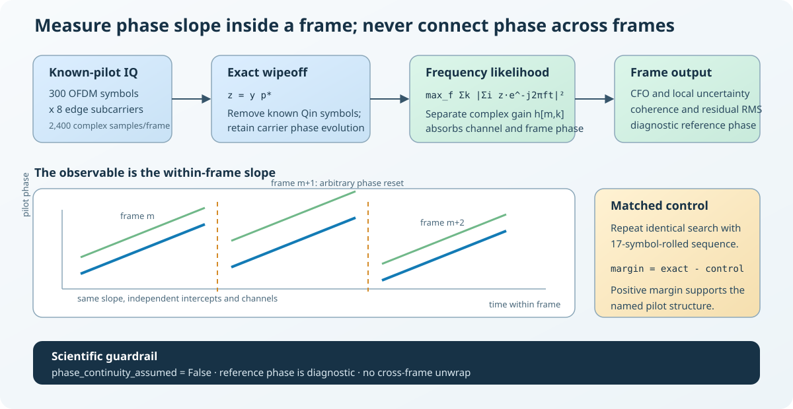

*Figure 1. Exact pilot wipeoff exposes a common within-frame phase slope. Separate complex
channel gains absorb subcarrier phase, and every frame is solved independently. The
17-symbol-rolled sequence traverses the same search as a negative control.*

## Approach

For frame \(m\), pilot symbol \(i\), and edge subcarrier \(k\), exact symbol wipeoff gives

\[
z_{m,i,k}=y_{m,i,k}p^*_{i,k}
\approx h_{m,k}\exp\!\left(j2\pi\Delta f_m(t_i-t_\mathrm{ref})\right)+n_{m,i,k}.
\]

Here \(h_{m,k}\) is a separate unknown complex gain for every subcarrier and frame.
Maximizing over those gains leaves the one-dimensional frequency likelihood

\[
\Lambda_m(f)=\sum_k\left|\sum_i z_{m,i,k}
\exp\!\left(-j2\pi f(t_i-t_\mathrm{ref})\right)\right|^2.
\]

The implementation searches \(\Lambda_m\) over a configurable residual-CFO interval
(default \(\pm2\) kHz), refines the maximum with weighted phase regression, and adds that
residual to the acquisition CFO. The same search is repeated after wiping off a
17-symbol-rolled Qin sequence. Exact and control likelihoods are normalized by their
Cauchy ceilings, so their difference is a directly comparable coherence margin.

The result for every complete frame contains:

- residual and absolute CFO;
- an approximate local weighted-fit uncertainty;
- exact coherence, control coherence, and their margin;
- phase residual RMS; and
- a diagnostic phase at the frame reference time.

The diagnostic phase is not an authorization to unwrap between frames. The public result
states `phase_continuity_assumed=False` and the API documentation repeats that constraint.

### PNT-like five-state pilot model

The tracking extension changes the channel model from an unrelated channel in every
frame to a slowly varying eight-subcarrier channel reference within one locked segment.
Its corrected state is

\[
\mathbf{x}_m=[\theta_m,\dot\theta_m,\ddot\theta_m,\tau_m,\dot\tau_m]^T,
\qquad f_m=\dot\theta_m/(2\pi),
\qquad \dot f_m=\ddot\theta_m/(2\pi).
\]

The first block propagates the same locally quadratic carrier phase used by Kassas et al.;
the second propagates fractional frame phase and its rate. A frame contributes its
independent phase-slope CFO, a wrapped common-phase measurement formed by comparing its
dechirped eight-subcarrier channel vector with the causal channel reference, and a
modulo-one-sample timing measurement from the channel's frequency-dependent phase ramp.
Like the paper's carrier/code state transition, the two blocks are independent unless a
future physical clock model supplies cross-covariance.

The original comparison mode wraps the phase innovation into `[-pi, pi)` and treats a
half-cycle change as a discontinuity. The corrected default declares the observed pilot
symmetry explicitly, wraps it into `[-pi/2, pi/2)`, and records which of the two
half-cycle branches was selected. It also searches a bounded +/-0.75-sample fractional
delay across the eight edge subcarriers and carries local CFO uncertainty into the
cross-frame phase measurement noise.

An update still requires the exact Qin sequence to pass the coherence gates, the channel
shape to remain similar, the frequency innovation to be plausible, and the phase
innovation to remain within 1.2 rad. Two consecutive failures declare a reset while
preserving the Doppler and Doppler-rate state. The ordinary 2-pi mode and its original
noise model remain available as the frozen ablation used in the four-second dense
comparison.

## Methods

### Implementation boundary

The estimator is implemented in
[`src/leo/analysis/qam/pilot.py`](../src/leo/analysis/qam/pilot.py) as
`analyze_pilot_phase_slope`. It reuses the existing known-pilot demodulator, exports narrow
frozen result dataclasses through `leo.analysis.qam`, and has no storage or service
dependency. No Standard profile, persisted schema, recording, or frozen analysis artifact
was changed.

The PNT-like tracker is implemented in
[`src/leo/analysis/qam/tracking.py`](../src/leo/analysis/qam/tracking.py) as
`analyze_pilot_phase_doppler_tracking`. It consumes the same demodulated Qin pilot cube,
frequency likelihood, exact coherence, and rolled-control coherence as the frame-local
estimator. It does not import, correlate, synthesize, or claim the PNT paper's central
beacon or pseudorange observable.

One complete frame contributes 2,400 known complex observations: 300 pilot symbols times
eight subcarriers. Frames with a positive exact-minus-control margin contribute to the
aggregate median. A dropped all-zero frame has zero margin and is excluded. The maximum
residual-CFO option is rejected if it exceeds the pilot-symbol-rate Nyquist limit.

### Synthetic qualification design

The focused tests in
[`tests/dsp/test_pilot_phase_slope.py`](../tests/dsp/test_pilot_phase_slope.py) exercise:

1. five independently phased frames with arbitrary complex subcarrier channels, additive
   noise, and residual CFO from -875 to +1,190 Hz;
2. raw-IQ demodulation with independent phase on every frame;
3. a capture made from the rolled sequence, which must make the control win;
4. a dropped zero frame, which must not bias the aggregate;
5. short and zero-energy windows; and
6. rejection of a search interval above the symbol-rate Nyquist limit.

The arbitrary-frame-phase cases are the critical scientific test: frequency must remain
correct even though the phases cannot be connected.

The tracking tests in
[`tests/dsp/test_pilot_phase_doppler_tracking.py`](../tests/dsp/test_pilot_phase_doppler_tracking.py)
add continuous quadratic carrier phase, injected Doppler rate, additive noise, a persistent
`pi/2` phase reset, deterministic binary `pi` flips, a one-frame dropout, a ten-frame gap,
a wrapped frame-timing drift, and the rolled-sequence null. The required behavior is
explicit: continuous and binary-flip cases retain one phase segment; the causal binary
states equal the injected sequence; the `pi/2` step starts a new segment without
discarding Doppler; one missing frame coasts; a long gap reacquires; the timing-rate state
converges; and the rolled sequence cannot initialize the tracker.

### Real-dwell selection and reference

The real-data evaluation used the ordinary read-only recording corpus:

- session `cap-20260821T140820-470384cc9284`;
- `stream-0`, RX0, upper channel edge (`radio_pluto_5d4d`);
- 2.5 MS/s sample rate;
- signal interval 33.7-37.7 s; and
- frozen final trajectory branch prefix `sha256:5852a936` from the Standard analysis root
  ending in `sha256:ccdc4b152617f6e99b23044948cea7be040905cf1e7dd074bb36668b36dc0963`.

Candidate probes came from Standard detections with GLRT64 margin at least 0.05. At each
time, the candidate nearest the frozen trajectory was selected, subject to a maximum
2.5 kHz model difference. Every eighth accepted probe was evaluated, yielding 16 probes
and 240 complete frames across four seconds. This sparse protocol was chosen before
looking at phase-slope performance; it limits repeated adjacent samples while spanning
the observed frequency evolution.

The frozen trajectory is a consistency reference, not carrier-frequency ground truth.
Its residual includes model, calibration, and front-end effects, so all reported errors
must be read as *difference from that frozen model*.

### Paper alignment

Qin et al., *Pilots and Other Predictable Elements of the Starlink Ku-Band Downlink*,
establish the exact edge-pilot structure used here and report that inter-frame carrier
phase discontinuities resist simple modeling. That evidence motivates the frame-local
design and the refusal to unwrap the diagnostic phases.

Kassas et al., *Unveiling Starlink for PNT*, track beat-carrier phase, Doppler, Doppler
rate, code phase, and code rate from early/prompt/late correlations; their final
navigation solve uses Doppler and pseudorange-rate observables. Their central unmodulated
pilot tones are not the Qin edge pilots. This implementation mirrors the five-state
transition topology, but substitutes a fractional eight-tone delay observable for code
phase and explicitly handles the Qin pilot's measured half-cycle symmetry. The
transferable idea is coherent phase/frequency/rate filtering, not equivalence between the
signals or observables.

## Results

### Synthetic results

All focused scientific cases passed. With arbitrary frame phase and arbitrary subcarrier
channel, the pure frame-cube kernel recovered every injected CFO to within 2 Hz; its
estimated uncertainty was below 1 Hz, exact-minus-control margin exceeded 0.98, and phase
residual RMS stayed below 0.03 rad. The raw-IQ case recovered four independently phased
frames to within 0.3 Hz. In the rolled-sequence negative control, exact coherence stayed
below 0.01 while control coherence exceeded 0.97. The deliberately dropped frame had zero
margin and did not enter the aggregate.

These are deterministic qualification cases, not estimates of field accuracy. Their role
is to show that the algorithm recovers the intended observable and rejects its named
control under controlled conditions.

### Real 20 ms anchor

The first 20 ms probe at 33.7 s used a coarse CFO of 443,503.891 Hz and contained 15
complete frames. All 15 had positive coherence margin. The margin quantiles were 0.116
(p10), 0.128 (median), and 0.137 (p90). Against the frozen model, the frame estimates had
a median error of -321.5 Hz, MAD 13.5 Hz, and RMS 317.3 Hz. The narrow within-probe MAD
shows stable frame-local estimates, while the common offset warns that the local fit
uncertainty does not cover model/acquisition bias.

DSP execution after IQ had been read took 20.39 ms for the probe, or 1.36 ms per complete
frame on this host.

### Four-second sparse validation

Across 16 probes, 237 of 240 complete frames (98.75%) preferred the exact sequence over
the rolled control. Median coherence margin was 0.152 and median approximate local
uncertainty was 16.2 Hz.

The phase-slope estimates differed from the frozen model by 182.6 Hz median, 273.6 Hz MAD,
and 379.0 Hz RMS. Independent GLRT64 on the same selected probes produced 177.4 Hz median,
159.9 Hz MAD, and 347.1 Hz RMS. The phase refinement relative to GLRT64 had 35.9 Hz median,
64.6 Hz MAD, and 140.3 Hz RMS.

The fitted phase-slope carrier-frequency rate was -6,991.5 Hz/s, versus -7,053.4 Hz/s for
the frozen model: a +61.9 Hz/s difference, or 0.88% of the model magnitude. Figure 2 puts
the central field results and their timing scopes side by side.

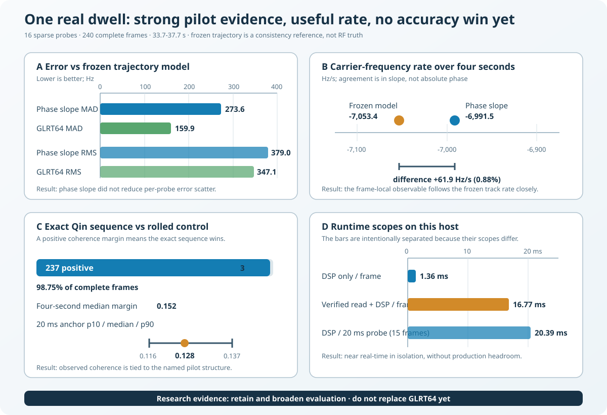

*Figure 2. The exact pilot wins its control on nearly every frame and the four-second
frequency rate agrees closely with the frozen model. Per-probe scatter is not better than
GLRT64, so the evidence supports continued Research use rather than promotion.*

The quantitative record behind the figure is available as
[`metrics.json`](figures/2026_08_22_edge_pilot_phase_slope/metrics.json).

### Pilot-only phase/Doppler tracking result

The initial sparse evaluation restarted the tracker inside 16 separate 20 ms windows. It
was useful for debugging but could not answer the continuity question. The definitive
dense pass therefore used all 125 existing Qin-pilot timing locks before the reporting
stride, exposing 1,875 actual pilot frames over four seconds. Timing was re-anchored from
those existing locks because a single 750 Hz epoch did not survive the gaps. Carrier
phase, CFO, and CFO rate were carried between locks; no frozen trajectory or PNT beacon
steered the Kalman updates. The pre-existing choice of which candidate locks belonged to
this trajectory was nevertheless conditioned by the frozen-model selection gate described
above; the model is also the comparison reference.

Of the 1,875 frames, 1,777 passed the exact-pilot structure gates. Frequency updates were
accepted on 1,109 frames and phase updates on 471. The tracker declared 570 resets and
formed 571 phase segments. The longest uninterrupted run of accepted observed frames was
14 frames spanning 22.7 ms. The widest segment spanned 65.2 ms but contained only 16
accepted phase updates, and the median segment contained zero accepted updates. Because
the accepted locks do not cover every transmitted frame, the 22.7 ms span includes short
unobserved gaps; it is not proof of continuously observed phase throughout that interval.

| Dense accepted-update comparison against frozen model | Median | MAD | RMS |
|---|---:|---:|---:|
| Independent pilot frame | +340.3 Hz | 151.1 Hz | 398.0 Hz |
| Phase + Doppler tracker | +356.9 Hz | 145.5 Hz | 404.5 Hz |
| Source-window GLRT64 | +288.6 Hz | 192.9 Hz | 377.0 Hz |

This denser and fairer comparison reverses the small improvement seen in the sparse
restarted run: tracking increases CFO RMS by 6.5 Hz relative to the independent pilot
measurement. The Doppler-rate state also remains inaccurate, with 4,897.7 Hz/s RMS error
against the frozen model on accepted frequency updates. Frequent phase discontinuities
do not provide enough continuous phase leverage to stabilize rate.

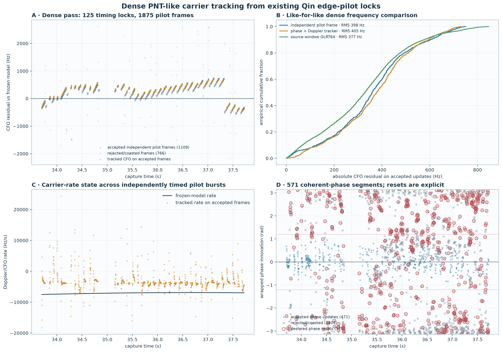

*Tracking result figure. The 125 timing-locked windows make the sampled bursts explicit
(A). Phase+Doppler tracking does not beat either frequency baseline (B), the rate state
does not converge to the frozen reference (C), and accepted local phase measurements are
interspersed with 570 explicit resets (D).*

### Why the dense frame times are not uniform

“Dense” here means every one of the 15 frame hypotheses inside every accepted acquisition
window, not every transmitted frame on a continuous four-second lattice. The 1,875 points
therefore arrive as 125 short, acquisition-timed bursts. Within each burst the reference
times follow the expected 750 Hz cadence, but the persisted timing-lock scan did not accept
a window at every possible epoch. The 124 gaps between bursts retain that irregular
selection geometry. This is why the independent-frame points in the tracking plot form
vertical-looking clusters separated by blank intervals instead of being uniformly spread
over capture time.

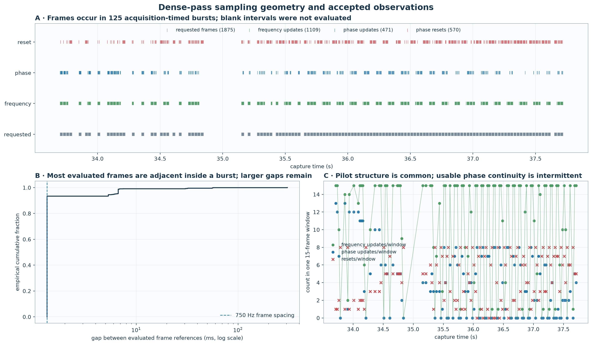

*Dense sampling geometry. Panel A separates requested frames, accepted frequency updates,
accepted phase updates, and declared resets on the same time axis. Panel B distinguishes
the nominal 1.333 ms within-burst spacing from the larger inter-burst gaps. Panel C shows
how many of the 15 requested frames in each acquisition window supported frequency and
phase updates. Raw IQ exists in the blank intervals, but this analysis did not evaluate a
frame there because no retained timing lock supplied an epoch; the blanks are not evidence
of a quiet or incoherent carrier.*

### What the denser pass says about coherent phase

There is a clear phase observable locally: the accepted phase innovations cluster near
zero, with 0.22 rad median absolute innovation and 0.36 rad RMS. It is not a clear global
phase history. Reset-delimited segments usually contain no accepted phase update, and the
longest consecutive sequence contains 14 evaluated frames over 22.7 ms. The widest
segment lasts 65.2 ms but contains only 16 accepted phase updates. Since evaluated frames
can straddle an inter-window gap, elapsed span is an upper bound on continuously observed
coherence; it must not be read as a claim that every intervening transmitted frame was
tracked.

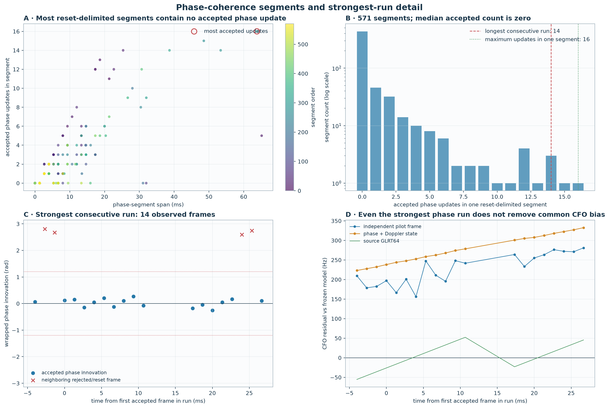

*Phase-coherence detail. Panels A and B show the population of all 571 reset-delimited
segments, including the large mass at zero accepted updates. Panels C and D zoom into the
strongest consecutive accepted run: its wrapped innovations remain inside the acceptance
gate, while its CFO estimates still share the several-hundred-hertz offset from the frozen
model. This is short-burst carrier coherence, not yet a seconds-long carrier-phase track.*

### Distribution and apparent cadence of coherent-phase runs

Using the stricter definition of a lock run as consecutive accepted evaluated frames gives
273 observed runs. Of these, 175 (64.1%) are singletons and only 98 contain two or more
frames. There are 272 observed run-start intervals: 191 remain inside continuously
evaluated stretches and 81 cross at least one frame-evaluation gap.

Within the continuously evaluated stretches, 92 of 191 run-start intervals (48.2%) are
two nominal frame periods, or 2.667 ms; another 49 (25.7%) are three frame periods, or
4.000 ms. This is an apparent cadence, but it is not evidence of a physical oscillator or
channel process at 375 Hz or 250 Hz. A run is split by a rejected evaluated frame, all
observations lie on the 750 Hz frame grid, and the tracker explicitly resets after repeated
gate failures or an expired coast. The quantization is therefore expected from the
observation and state-machine definitions. Intervals crossing missing coverage have a
separate, much broader distribution and cannot reveal when the physical phase lock was
actually lost or recovered.

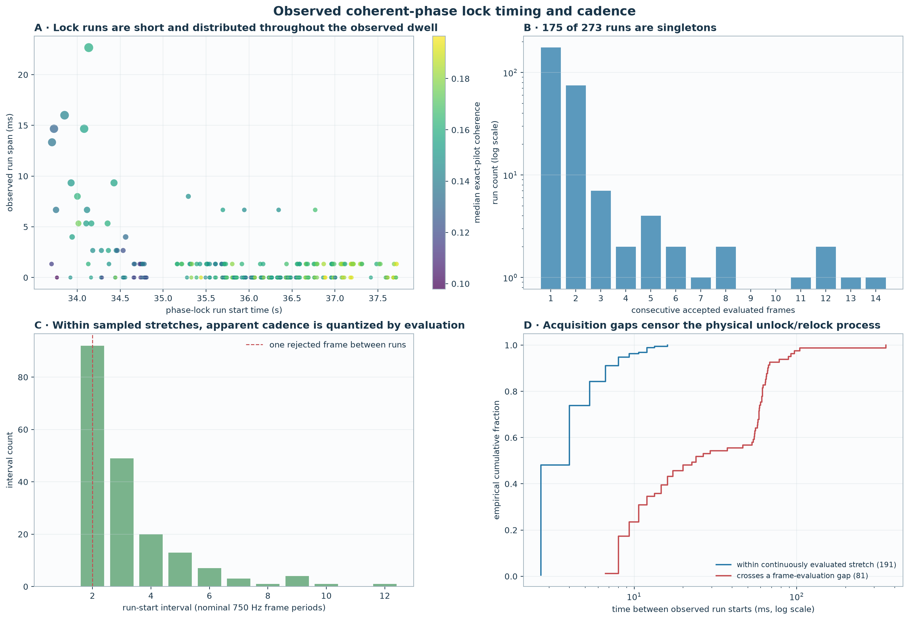

*Observed lock timing and cadence. Panel A places every accepted run in time and exposes
its measured duration and median pilot quality. Panel B shows that single-frame runs
dominate. Panel C shows the frame-grid quantization inside sampled stretches. Panel D
separates those intervals from the 81 intervals censored by missing acquisition coverage.
The present data support an algorithmic/evaluation cadence, not a fixed physical relock
rate.*

The missing information matters. A physical lock-rate claim requires continuously
evaluating every frame over a retained interval, preserving rejected as well as accepted
pilot statistics, and then repeating the analysis with tracker reset/coast thresholds
varied. Without that experiment, physical coherence, acquisition availability, and the
tracker state machine are not identifiable from one another.

### Correcting and controlling for probe quality within a lock run

A common phase rotation does not change the existing single-frame exact-pilot coherence
score, so phase correction cannot improve that metric inside one frame. It can improve
coherent combination across frames. For each of the 98 multi-frame runs, the analysis now
reconstructs the eight-subcarrier channel vector and compares three stacks:

1. no inter-frame phase correction;
2. causal derotation from the carrier state predicted before the current frame update;
3. independent self-alignment from the current frame itself, used only as an optimistic
   ceiling.

The causal correction raises median normalized channel-stack efficiency from 0.444 to
0.861; the self-aligned ceiling is 0.939. Expressed as effective coherent gain relative to
one frame, the medians are -0.15 dB uncorrected, +2.61 dB with the causal tracker, and
+2.81 dB for the self-aligned ceiling. The causal correction improves 86 of the 98
multi-frame runs (87.8%), with a median +2.90 dB improvement over the uncorrected stack.

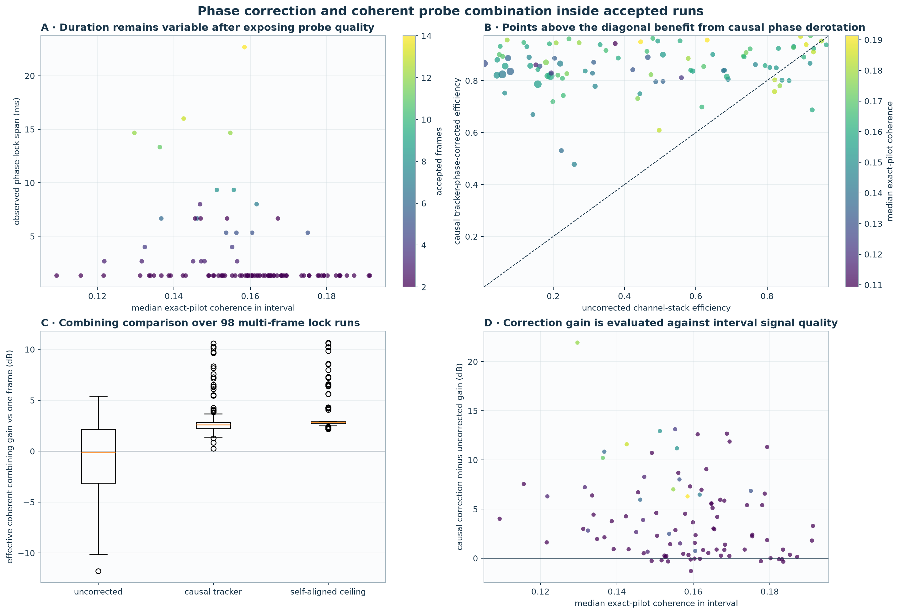

*Phase correction and probe combination. Panel A controls visually for median exact-pilot
coherence while showing interval duration. Panel B compares uncorrected and causally
phase-corrected stack efficiency. Panel C gives the complete multi-run gain distribution,
and panel D plots the correction gain against interval signal quality. Exact-pilot
coherence has only a weak association with observed run length in this selected sample
(Pearson r = -0.10), so ordinary probe quality does not explain the duration pattern.*

This is useful evidence that the tracked phase can align probes already classified as
locked. It is not an independent SNR or payload-quality validation: the run selection and
channel vectors both use the known Qin pilot, the quality range is truncated by the
selection gates, and 175 singleton runs offer no combining opportunity. A held-out test
should estimate phase from one pilot subset and score a disjoint following subset before
using the gain as a calibrated signal-quality improvement.

### Six zoomed frequency runs with explicit phase status

The full-dwell CFO panel makes the frequency-supported streaks look longer and more
uniform than their phase support. The six zooms below retain the same independent and
tracked CFO residuals but add phase status directly: green rings are accepted phase
updates, red crosses are rejected phase updates, red open circles are resets, green bands
are strict multi-frame phase runs with no missing frame interval, and hatched bands are
raw-IQ intervals that were not evaluated because no retained timing lock supplied frame
epochs.

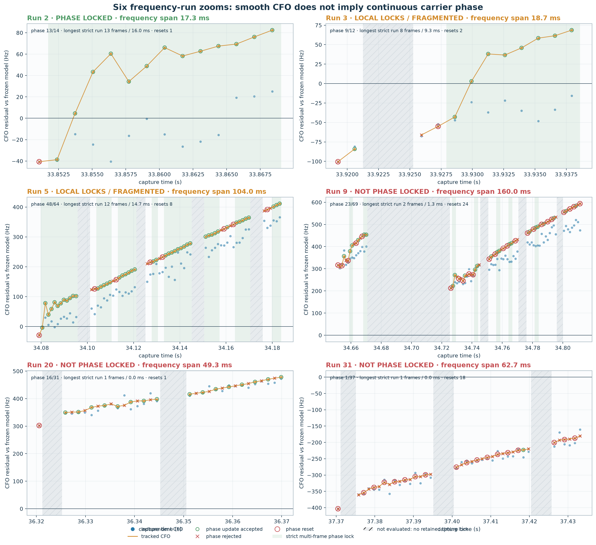

*Six representative frequency runs. Run 2 is phase locked across 13 of 14 frames for a
strict 16.0 ms interval. Run 3 and run 5 contain genuine local phase locks but are
fragmented across their complete frequency streaks. Runs 9, 20, and 31 retain smooth CFO
behavior without a sustained strict phase lock. The repeated diagonal CFO geometry is
therefore not sufficient evidence of carrier-phase continuity.*

### Requested zooms and sensitivity to the phase-lock thresholds

The hatched regions in these figures were previously called “unsampled.” That wording was
too strong: the recording contains continuous raw IQ. They are **not evaluated** by this
dense pass because the retained acquisition results did not supply a pilot-frame epoch in
those intervals. No conclusion about phase coherence can be drawn inside a hatched band
without generating and validating additional timing hypotheses.

The causal phase-update decision combines several gates: supported exact-over-control
pilot structure, an accepted frequency innovation, no expired 12 ms phase coast, channel
similarity above threshold, and wrapped phase innovation inside threshold. A reset is
declared after two supported phase failures. The current research defaults are channel
similarity >= 0.65 and absolute phase innovation <= 1.2 rad. These are engineering choices,
not a calibrated physical boundary. The figure therefore reruns the complete causal
tracker with three configurations rather than merely recoloring one result:

| Configuration | Channel similarity | Absolute innovation |
|---|---:|---:|
| Strict | >= 0.80 | <= 0.6 rad |
| Current | >= 0.65 | <= 1.2 rad |
| Lenient | >= 0.50 | <= 2.0 rad |

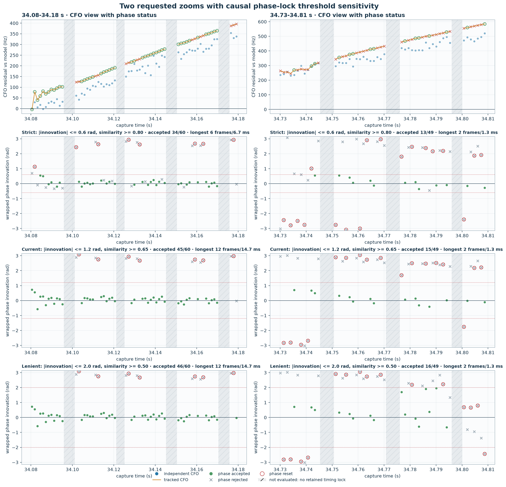

*Threshold sensitivity in the requested intervals. In 34.08-34.18 s, the strict tracker
accepts 34/60 evaluated frames and finds at most 6 consecutive frames over 6.7 ms; the
current tracker accepts 45/60 and finds 12 frames over 14.7 ms; the lenient result changes
only to 46/60 and the same 12-frame maximum. This supports genuine local phase-coherent
islands, but the evaluation gaps prevent claiming one continuous 100 ms lock. In
34.73-34.81 s, strict/current/lenient accept 13/15/16 of 49 frames respectively, yet every
configuration has the same maximum of only 2 consecutive frames over 1.3 ms. The absence
of sustained lock there is robust to this threshold range.*

A phase lock in this analysis therefore looks like a sequence of green innovations near
zero, with no intervening rejection, reset, or frame-evaluation gap. The thresholds decide
how much prediction error and channel change are tolerated, while the consecutive-frame
requirement tests continuity. Promotion would require calibrating those tolerances against
held-out phase prediction or independent truth, not treating the current defaults as a
physical constant.

### Offline audit of the apparently smooth 34.73-34.81 s run

The top-left CFO streak is visually persuasive, but it plots **frequency**, not carrier
phase. A small frequency error integrates rapidly: at the 750 Hz frame rate, a 100 Hz
CFO error produces 0.84 rad of phase error by the next frame. Smooth per-frame slopes are
therefore necessary but not sufficient for a cross-frame phase lock.

This interval was rerun without the online constraint. The retained frame starts lie on
one 750 Hz lattice, with at most a one-sample re-anchoring difference between acquisition
windows. That lattice supplies 60 consecutive hypotheses from 34.7300 through 34.8087 s:
49 correspond to retained timing locks and 11 fill the formerly hatched gaps directly
from the continuously recorded IQ. Every one of the 60 frames passes exact-over-control
pilot quality. The median within-frame phase residual is 0.70 rad, the median local CFO
uncertainty is 18.7 Hz, and a robust quadratic CFO curve fits the independent frame
slopes to 17.8 Hz RMS.

The offline phase extraction then removes a separate fractional-delay ramp across the
eight subcarriers in every frame before evaluating the common carrier phase. The fitted
delays follow the expected approximately -1/3, 0, +1/3 sample rounding pattern; after
correction the median channel-vector similarity is 0.990. Thus neither missing IQ,
integer frame timing, nor a changing eight-tone channel explains the rejected phase
updates.

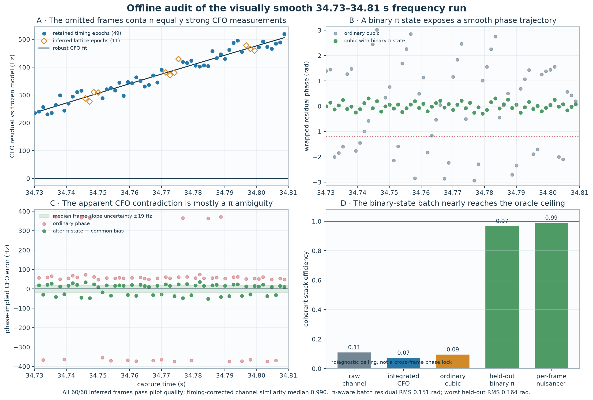

*The 34.73-34.81 s interval on a complete 750 Hz lattice. Panel A confirms that both the
retained and newly evaluated frames carry the same smooth CFO trend. Panel B shows that
an ordinary 2-pi cubic fit leaves broad residuals while a cubic fit to doubled phase
collapses them near zero. Panel C exposes the two ordinary phase-increment families and
their collapse after resolving the pi state and a common 38.4 Hz correction. Panel D
shows coherent combining: raw, CFO-only, and ordinary cubic correction reach only
0.07-0.11 efficiency; the conservative held-out binary-pi result reaches 0.966 (0.978
when fit and scored on all pilots) against a 0.989 independently aligned per-frame
ceiling.*

The original ordinary-2-pi causal result on the 49 previously evaluated epochs was 15
accepted phase updates, 17 resets, and a longest strict run of two frames. The offline
results show why relaxing the Kalman gates did not repair it, and why a different
observation model does:

- ordinary adjacent innovations are 1.880 rad RMS, but modulo pi they share a 0.322 rad
  circular center, equivalent to a 38.4 Hz common CFO correction;
- after removing that center and the nearest pi state, adjacent innovation RMS is 0.227
  rad;
- an ordinary noncausal cubic still fails at 1.695 rad RMS and 0.095 stack efficiency,
  and a degree-8 fit improves only to 1.521 rad and 0.249;
- the doubled-phase cubic plus binary-state reconstruction reaches 0.151 rad RMS and
  0.978 efficiency, nearly the 0.989 per-frame nuisance ceiling; and
- the inferred binary state changes 21 times over 59 frame boundaries. It is observable,
  but neither rare nor yet tied to a documented transmitter rule.

### Causal modulo-pi Kalman result

The batch result was converted into a causal discriminator and rerun from verified IQ,
not replayed from the fitted batch phases. At each actual approximately 1.3 ms frame, the
tracker predicts phase, CFO, and CFO rate; independently demodulates the known Qin pilot;
separates the bounded fractional-delay ramp; selects the nearest of the two phase branches;
and then applies a joint phase/frequency Kalman update. The ordinary ablation uses the
same frames, initial CFO, quality gates, and process model, with only the previously
published unambiguous-2-pi observation and noise treatment restored.

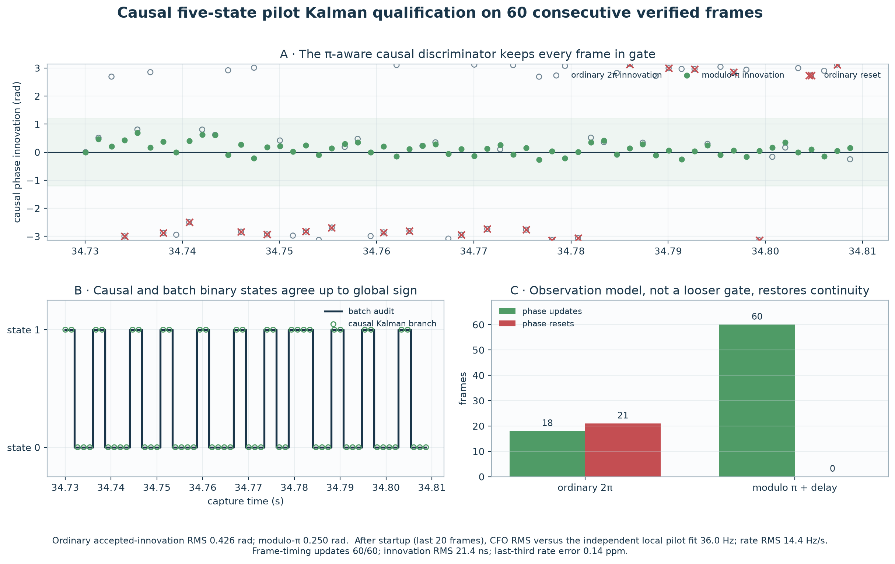

*Causal qualification on all 60 consecutive frames. Panel A shows the ordinary
innovations repeatedly leaving the gate while every modulo-pi innovation remains
accepted. Panel B compares the online branch decision with the independent noncausal
batch state; they agree on all frames up to one global sign. Panel C gives the direct
update/reset ablation.*

| Complete-lattice causal result | Ordinary 2-pi | Modulo pi + fractional delay |
|---|---:|---:|
| Phase updates | 18/60 | 60/60 |
| Phase resets | 21 | 0 |
| Phase segments | 22 | 1 |
| Accepted phase-innovation RMS | 0.426 rad | 0.250 rad |
| Inferred half-cycle transitions | not modeled | 21 |
| Fractional frame-timing updates | not measured | 60/60 |

Those 21 transitions occupy 35.6% of the 59 frame boundaries. The 22 constant-state
runs last two to four frames (mean 2.73 frames), so the branch changes roughly every
3.6 ms in this interval; it is not a rare cycle slip. The causal and batch state
sequences agree 100% up to global sign, which is the evidence that the bunches are a
coherent phase trajectory with a frequent binary overlay rather than unrelated phase
clusters.

The carrier-rate state also behaves as a filter, but the comparison boundary matters.
Across all 60 frames, startup from the deliberately neutral 0 Hz/s rate prior gives
1,076 Hz/s RMS error against the independent local pilot-frequency fit. Over the final
third (20 frames), after convergence, rate RMS is 14.4 Hz/s and CFO RMS is 36.0 Hz against
that fit. Against the frozen four-second trajectory, the full-interval CFO and rate RMS
remain 414 Hz and 3,398 Hz/s because the local pilot curve itself has a different slope.
The new phase model therefore restores causal phase continuity and a locally converged
rate estimate; it does not establish which frequency reference is physically correct or
improve the existing trajectory association.

The two remaining Kalman states consume the independently estimated fractional-delay
ramp as modulo-one-sample frame phase and frame-rate error. All 60 timing updates were
accepted with 21.4 ns innovation RMS. The final rate state was -100.23 ppm; the expected
value from rounding a 2.5 MS/s sample lattice onto 750 frames/s is -100.00 ppm, and the
last-third RMS error was 0.14 ppm. This verifies that the five-state transition and pilot
timing discriminator work on measured data. It does **not** measure transmitter clock
error, code phase, pseudorange, or range rate: in this interval the dominant timing ramp
is the receiver's known integer-sample/frame geometry.

The disjoint-symbol validation is equally important. Fitting frequency, smooth doubled
phase, fractional timing, and all binary states from the even pilot symbols predicts the
odd symbols with 0.152 rad RMS and 0.970 stack efficiency. Reversing the halves gives
0.164 rad and 0.966. The independently inferred state sequences agree on every frame up
to the unavoidable single global sign. Only one global carrier-phase offset is fit when
scoring each held-out half; there is no held-out per-frame phase adjustment.

An ordinary integer-cycle Viterbi decoder cannot fix this because adding 2-pi does not
change the wrapped innovation. The implemented causal loop instead makes the half-cycle
symmetry part of its measurement model and resolves the current branch greedily. A
hybrid factor graph or Viterbi smoother remains the stronger offline extension: phase
doubling can initialize the continuous phase/frequency/rate states, while
forward/backward smoothing can use a learned transition law rather than only the current
innovation. The causal result shows that such a smoother is an enhancement, not a
prerequisite for local modulo-pi lock.

The first disjoint-symbol test therefore passes. The following sections keep the model
and binary-state treatment frozen while moving to six other dwell selections. Those
results test repeatability but still do not reveal whether the binary state follows a
reproducible signal rule. Until that rule and causal dynamics qualify, the primary result
is best described as a local phase lock **modulo pi**, not an unambiguous 2-pi carrier-
phase lock.

### Independent out-of-dwell holdout

No tracker setting was changed for the holdout. The report generator reopened
`cap-20260821T201522-841b2a20e151`, stream 0, RX1, verified its recording chunks, and read
60 upper-edge frame hypotheses beginning at sample 54,565,782. This epoch was the maximum
positive GLRT64-margin detection in that dwell's already persisted Standard pilot scan
(margin 0.578); phase behavior was not used to select it.

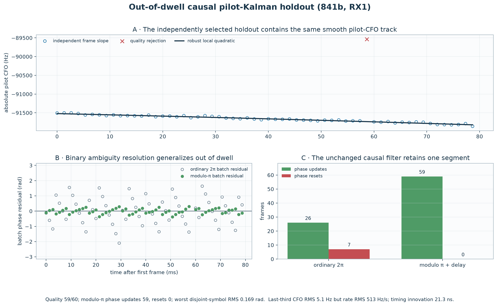

*The unchanged tracker on the disjoint 841b/RX1 holdout. Panel A shows the independent
within-frame pilot slopes and their robust local comparison curve. Panel B shows the
ordinary and modulo-pi batch residuals. Panel C repeats the causal update/reset ablation.
One null-like frame fails the pre-existing pilot-quality test and is not forced into the
phase lock.*

| Independent holdout result | Ordinary 2-pi | Modulo pi + fractional delay |
|---|---:|---:|
| Quality-supported phase updates | 26/60 | 59/60 |
| Phase resets | 7 | 0 |
| Batch phase-residual RMS | 0.884 rad | 0.163 rad |
| Batch coherent-stack efficiency | not promoted | 0.978 |
| Causal agreement with batch state | not modeled | 100% of 59 quality frames |
| Fractional frame-timing updates | not measured | 59/60 |

The independent even/odd-symbol checks remain strong: their phase residuals are 0.169
and 0.163 rad, stack efficiencies are 0.969 and 0.967, and the two inferred branch
sequences agree on 59/60 frames up to global sign. The causal tracker records 46
half-cycle transitions, confirming that the binary overlay is again frequent rather than
a rare receiver cycle slip.

The timing discriminator also transfers without retuning: 59 updates have 21.3 ns
innovation RMS, and last-third frame-rate error against the known integer-sample lattice
is 1.32 ppm. Carrier dynamics are mixed. The robust independent frame slopes fit their
local curve to 16.9 Hz RMS, and the causal CFO state reaches 5.1 Hz RMS against it over
the final third. The corresponding rate error is still 513 Hz/s because the local slope
changes materially within this short interval. This negative result is retained: the
observation model has generalized, while one constant-acceleration prior has not yet
qualified Doppler rate across dwells.

### Five additional phase-blind dwells

The same frozen analysis was next run on five more existing dwells. The dwell identities
and maximum-margin selection protocol were frozen from persisted products before their
phase results were inspected. Before final analysis, all five were checked against the
production catalog. Four older-release dwells were reprocessed, sealed, and atomically
promoted with 12/12 successful jobs on the currently deployed Standard release
`9f45c2aefc60b355ad1da173211c9c1255a13395`. `4e2a` already had a successful current
Standard run on that exact release, so the redundant queued candidate
`reprocess-70a70f13e56c49debcbe48c89f2495c2` was cancelled before any job started; its
existing current result remained untouched.

No phase estimate, batch residual, causal result, or figure was inspected during
selection. Within each sealed current run, the selected epoch was the maximum positive
persisted GLRT64 margin with enough trailing raw samples for 60 frames. Margins tied to
within `1e-12` resolve to the lowest persisted candidate rank, preventing numerically
identical duplicate candidate rows from changing the selection. Reapplying that rule to
the current products returned the same five frame starts and CFOs; no dwell or epoch was
substituted after seeing phase. The generator pins and checks the exact pilot-scan digest
before reopening the named stream, verifies the raw recording chunks, and reads only the
bounded approximately 80 ms lattice. All selected candidates are persisted rank zero; no
RF was collected.

| Dwell | Frozen persisted analysis | Stream / path / edge | Detection | GLRT64 margin | First frame sample |
|---|---|---|---:|---:|---:|
| `87f9` | `reprocess-296b01090d724717b0deffeae663fade` | stream 0 / RX1 / lower | 4.200 s | 0.780 | 10,501,102 |
| `17c2` | `reprocess-fe677a0b45d343b79eb2db239ec5a8e6` | stream 0 / RX1 / upper | 46.475 s | 0.649 | 116,189,398 |
| `ffd4` | `reprocess-f0389b67ae1248619906ed157f17ca4b` | stream 1 / RX1 / upper | 48.025 s | 0.746 | 120,063,904 |
| `7a5d` | `reprocess-c0adab7361004006bd5e5b6e77018fd7` | stream 1 / RX1 / upper | 1.175 s | 0.800 | 2,938,047 |
| `4e2a` | `reprocess-04811760a6fa41da8de6a50902729b7f` | stream 0 / RX1 / lower | 2.050 s | 0.601 | 5,125,121 |

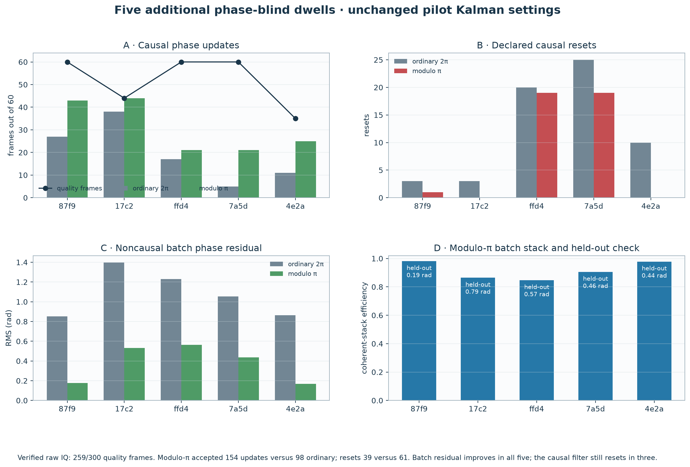

*The unchanged ordinary and modulo-pi analyses on the five additional phase-blind
selections. Every dwell has a lower modulo-pi batch residual (panel C), but the causal
update and reset panels show that this does not imply an uninterrupted online lock.
Labels are the first four characters of each capture suffix.*

| Dwell | Quality | Phase updates, ordinary -> modulo pi | Resets, ordinary -> modulo pi | Batch RMS, ordinary -> modulo pi | Modulo-pi stack | Worst held-out RMS |
|---|---:|---:|---:|---:|---:|---:|
| `87f9` | 60/60 | 27 -> 43 | 3 -> 1 | 0.851 -> 0.178 rad | 0.981 | 0.185 rad |
| `17c2` | 44/60 | 38 -> 44 | 3 -> 0 | 1.398 -> 0.533 rad | 0.864 | 0.792 rad |
| `ffd4` | 60/60 | 17 -> 21 | 20 -> 19 | 1.229 -> 0.562 rad | 0.846 | 0.575 rad |
| `7a5d` | 60/60 | 5 -> 21 | 25 -> 19 | 1.055 -> 0.437 rad | 0.905 | 0.464 rad |
| `4e2a` | 35/60 | 11 -> 25 | 10 -> 0 | 0.865 -> 0.167 rad | 0.978 | 0.441 rad |
| **Five-dwell total** | **259/300** | **98 -> 154** | **61 -> 39** | **improved in 5/5** | **0.846-0.981** | **0.185-0.792 rad** |

The batch conclusion generalizes cleanly: resolving a binary pi ambiguity reduces phase
residual in all five independently selected dwells. The improvement is not obtained by
loosening the quality gate, and the even/odd-symbol checks fit one global held-out phase
offset rather than a per-frame correction. Four worst-direction held-out residuals are
at or below 0.575 rad; `17c2` is the weaker case at 0.792 rad. That weaker prediction and
its 44/60 quality count are retained rather than filtered away.

The online conclusion is mixed. The modulo-pi filter accepts 59.5% of the 259 quality
frames versus 37.8% for ordinary phase and declares 22 fewer resets. It nevertheless
retains zero-reset operation only on `17c2` and `4e2a`; the latter has just 35 quality
frames and 25 accepted phase updates. `87f9` has the strongest new batch result but still
declares one reset and its causal branch labels agree with the batch labels on only 50%
of quality frames after one global sign choice. `ffd4` and `7a5d` each declare 19 resets.
This distinction is why batch observability is reported as replicated while causal lock
is reported as partial.

| Dwell | Longest accepted phase run | Final-third frequency updates | CFO RMS vs local fit | Rate RMS vs local fit | Timing updates | Timing rate error |
|---|---:|---:|---:|---:|---:|---:|
| `87f9` | 4 frames | 20 | 41.9 Hz | 75 Hz/s | 60/60 | 1.20 ppm |
| `17c2` | 7 frames | 13 | 51.5 Hz | 211 Hz/s | 29/60 | 189.87 ppm |
| `ffd4` | 11 frames | 10 | 77.2 Hz | 9,770 Hz/s | 60/60 | 2.27 ppm |
| `7a5d` | 11 frames | 7 | 60.9 Hz | 8,381 Hz/s | 60/60 | 2.41 ppm |
| `4e2a` | 3 frames | 0 | not observable | not observable | 35/60 | 4.90 ppm |

The local CFO fit remains smooth at 9.7-37.9 Hz RMS in the five dwells, but the causal
constant-acceleration rate state does not reliably follow it. In particular, `ffd4` and
`7a5d` have multi-kilohertz-per-second final-third rate errors, while `4e2a` has no
accepted final-third frequency update from which to compute the metric. The 189.9 ppm
timing-rate error for sparse `17c2` is also a failure of that local timing estimate, not a
clock observation. These outcomes reinforce the existing boundary: frame timing is an
eight-tone sample-lattice proxy and Doppler rate is not qualified across dwells.

The five per-dwell figures retain every requested frame and make the quality exclusions,
local CFO comparison, batch residuals, and causal counts auditable:

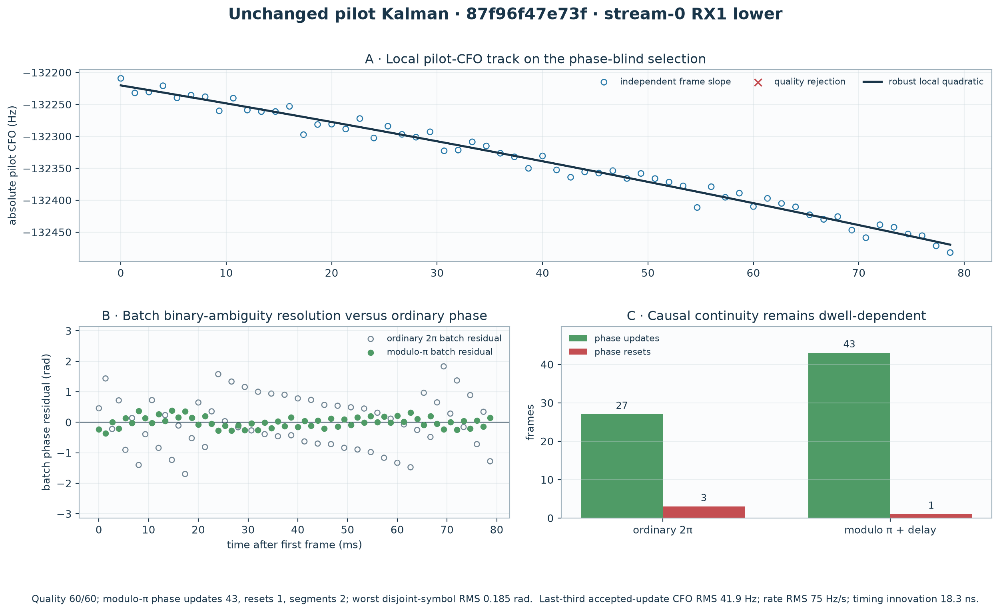

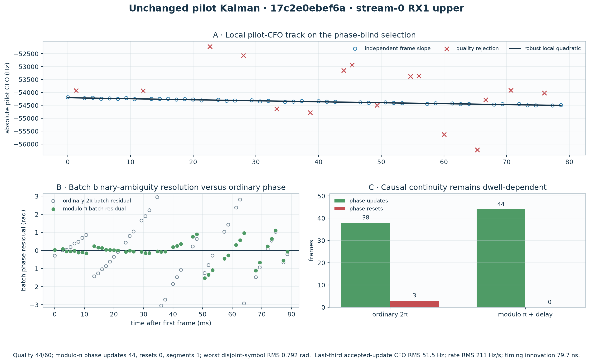

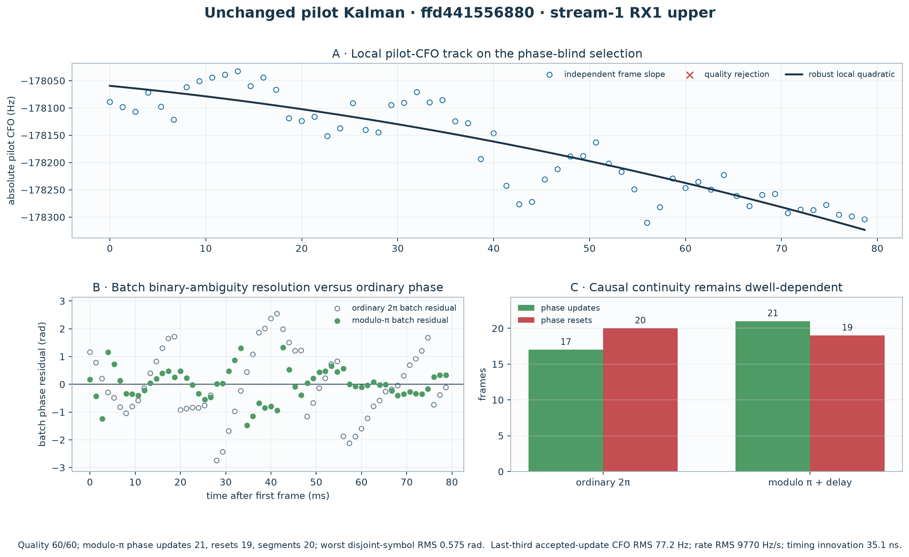

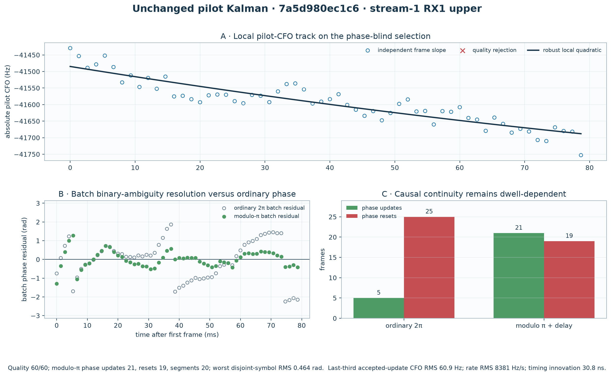

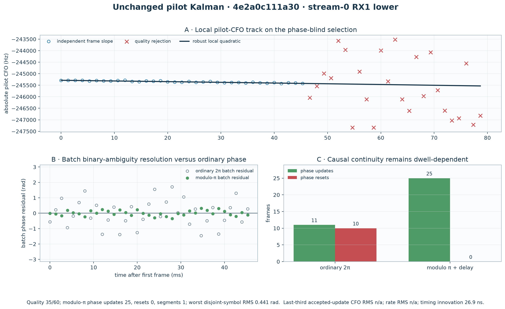

### Measured-data figure walkthrough

The aggregate comparison above hides the signal-processing geometry. Figures 3-7 return
to the measured RX0 IQ and then move progressively through raw spectrum, frame-local
phase, window alignment, and residual/control diagnostics. Five PNGs use the preregistered
16-window sparse selection; the seven dense tracking PNGs use all 125 pre-stride timing
locks; the two primary offline/causal PNGs use the complete inferred lattice in the
requested 34.73-34.81 s interval; and the seven cross-dwell PNGs summarize and expose the
60-frame verified-IQ reruns on the six disjoint RX1 dwells.

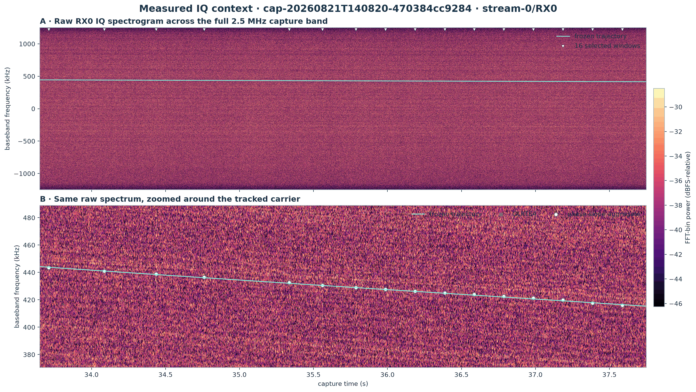

*Figure 3. Raw RX0 IQ over the complete 2.5 MHz capture band (top) and a zoom around the
tracked carrier (bottom). The ordinary FFT view has no clean narrow carrier ridge; the
trajectory and estimator marks are overlays. This is why exact known-symbol correlation,
rather than visual peak following, is needed to recover the pilot phase observable.*

The white triangles mark the 16 windows selected only after the persisted GLRT64 margin
and frozen-model gates were applied. The phase-slope result does not create or move those
windows. In the zoom, the GLRT64 and phase aggregates sit close to the same declining
trajectory even though the raw spectral texture alone does not isolate it.

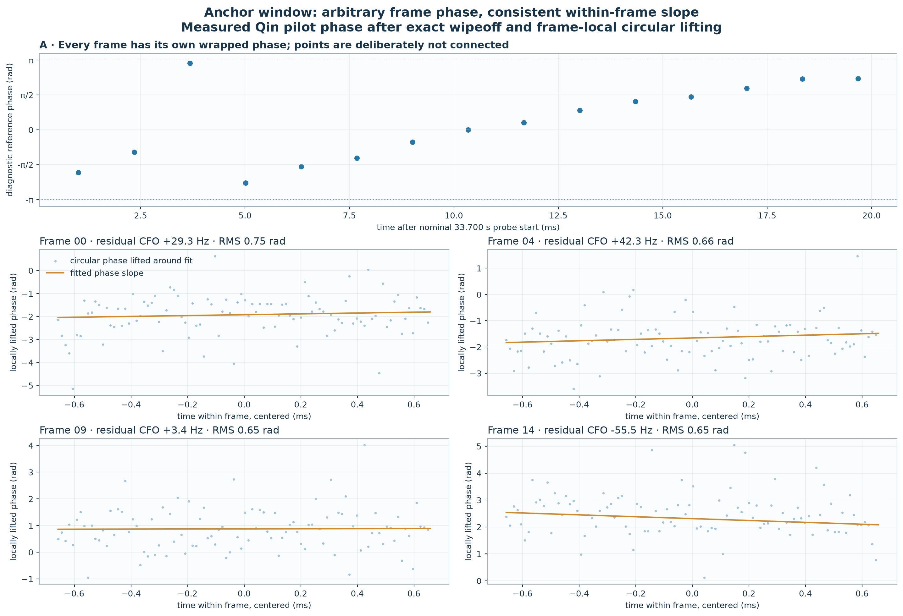

*Figure 4. The 15 frames in the 33.700 s anchor window. The top panel shows independent
wrapped diagnostic phases and intentionally draws no line between them. The lower panels
show measured exact-wiped pilot phase from four frames and each frame's independent
frequency-slope fit.*

The lower observations are circular phase values lifted onto the branch nearest their own
frame-local fit. This is a display operation inside one frame, not an unwrap between
frames. It avoids rendering a low-weight symbol near the +/-pi boundary as a false 2-pi
jump. The dense central clouds follow their fitted slopes; scattered points farther away
are retained rather than hidden. The displayed phase-residual RMS is 0.65-0.75 rad for
these four examples.

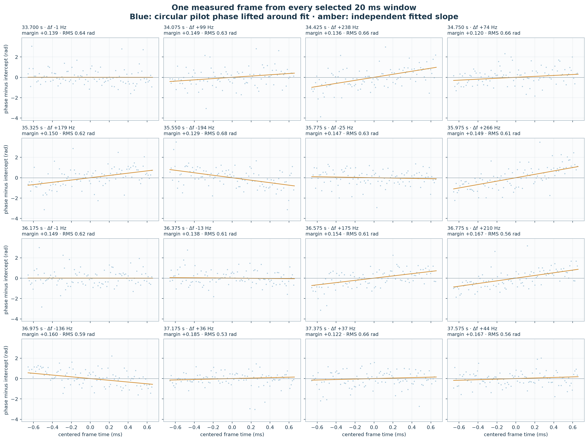

*Figure 5. One control-supported representative frame from every selected 20 ms window.
Blue points are measured circular pilot phase after exact wipeoff and per-frame channel
combining; amber lines are independent fits. Titles report the residual correction to
GLRT64, exact-minus-control margin, and circular phase-residual RMS.*

The gallery is deliberately exhaustive over the 16 selected windows rather than a set of
best-looking examples. Residual corrections change sign and magnitude as expected for a
local refinement. Every representative frame has a positive control margin, while the
phase scatter makes clear why the local curvature uncertainty must not be interpreted as
calibrated end-to-end frequency error.

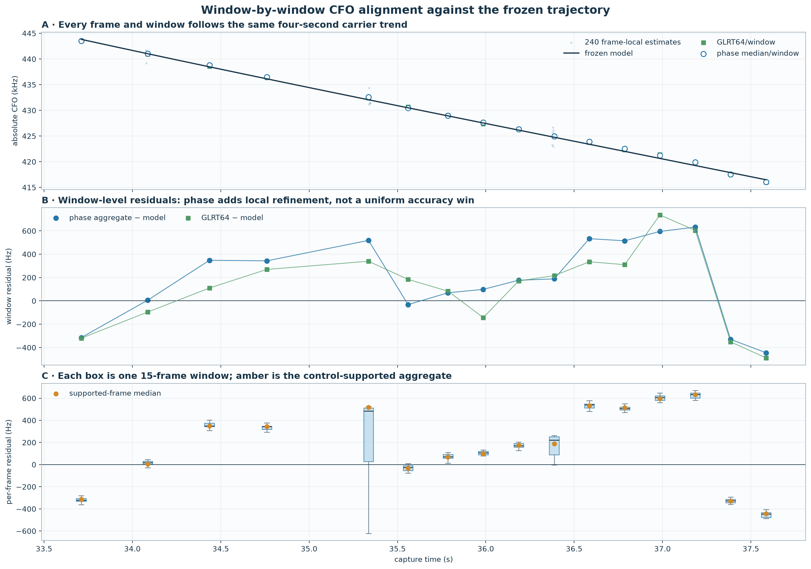

*Figure 6. Absolute CFO, aggregate residual, and the complete 15-frame distribution for
each window. The boxes expose windows whose individual frame estimates are tight as well
as windows with broad or asymmetric residuals; amber points are medians of only the
frames supported by the exact-over-control test.*

The top panel makes the useful result visible: all 240 frame-local estimates follow the
same four-second carrier trend. The lower panels also preserve the negative result. Phase
refinement sometimes moves GLRT64 toward the frozen model and sometimes away from it, so
there is no uniform accuracy improvement on this dwell.

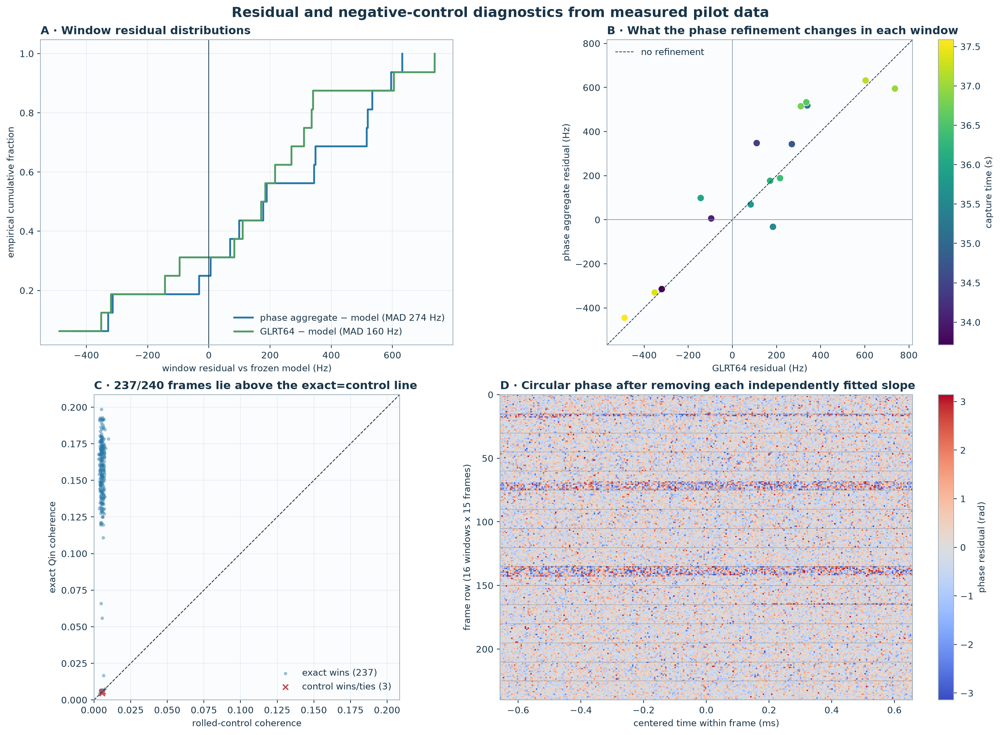

*Figure 7. Window-error ECDFs, phase-versus-GLRT residual changes, exact/control
coherence, and all 72,000 circular symbol residuals (240 frames times 300 symbols). Thin
horizontal lines in the heatmap separate the 16 windows.*

The ECDF restates the field-accuracy decision without reducing it to one number: GLRT64
has the narrower residual distribution on this interval. The exact/control panel shows
why the phase observable is nevertheless credible: 237 frames form a high-exact,
near-zero-control column, while the three unsupported frames lie near the origin rather
than masquerading as strong control detections. The residual heatmap shows structured
frame-to-frame quality variation but no cross-frame phase connection is used.

The per-window/per-frame values and SHA-256 digest of every PNG are retained in
[`detailed-results.json`](figures/2026_08_22_edge_pilot_phase_slope/detailed-results.json).

## Interpretation

Three conclusions are supported.

First, phase helps because frequency is the slope of phase. Three hundred known symbols
provide many coherent time samples inside a frame, so the estimator uses far more than a
single phase value. It does not obtain Doppler by comparing absolute phase between frames.

Second, the Qin correspondence is explicit: the received symbols are wiped with the exact
known Qin sequence, and that result is required to beat an identically processed rolled
sequence. The satellite/trajectory correspondence is a separate downstream association
problem. In this experiment it came from the pre-existing frozen Standard trajectory,
not from carrier phase alone and not from Doppler rate alone.

Third, the result is promising but not yet superior. Rate agreement and control
separation show real signal content; the larger MAD and RMS than GLRT64 show that this
implementation is not ready to replace independent CFO acquisition. A useful next role
may be as additional likelihood evidence or a locally smoothed frequency-rate observable,
provided that evaluation remains frame-local and uses held-out tracks.

Fourth, ordinary 2-pi phase can be tracked only in short coherent segments across the
sparsely locked four-second history: the dense pass accepted 471 phase updates but
required 570 resets, and no uninterrupted run exceeded 22.7 ms. On the primary complete
80 ms lattice, the corrected causal model maintains one 60-frame lock modulo pi; the six
cross-dwell reruns show that this causal continuity is not universal. This is a useful
batch phase observable and sometimes a locally converged rate filter, but not yet a
validated unambiguous carrier-phase navigation observable.

## Runtime and operational consequence

The 1.36 ms/frame number measures the estimator after IQ read. The 16.77 ms/frame number
from the sparse run includes independent verified corpus reads and must not be interpreted
as DSP cost. The 20.39 ms anchor-probe total is close to its 20 ms observation span, so the
Python implementation is approximately real-time on one core but has insufficient
production headroom once scheduling, acquisition, storage, and other analysis are added.

The dense locked-frame tracker processed 1,875 requested frames in 1.437 s after IQ read,
or 0.766 ms per requested frame on this host. This is an offline batch measurement; it
does not include acquisition, timing-lock generation, verified storage read, or service
scheduling.

Promotion would require batching or a native kernel, then a benchmark in the intended
pipeline. The current Research API adds no service or recording overhead unless called.

## Limitations

- The broad four-second comparison still covers one receiver path and one dwell. The
  seven complete-lattice audits span two receiver paths and both channel edges, but six
  use RX1 and all come from one on-disk campaign/site. This is not a population study.
- The frozen trajectory is a reference, not RF truth; field error cannot be calibrated
  from this comparison alone.
- The reported ~16 Hz uncertainty is local weighted phase-fit curvature. It excludes
  acquisition bias, trajectory error, oscillator drift, calibration error, and model
  mismatch, and is not a calibrated one-sigma field uncertainty.
- Positive exact-minus-control margin is evidence for the named pilot structure, not an
  independently calibrated detection probability.
- Phase at the reference time is diagnostic only. This work neither proves nor assumes
  global cross-frame phase continuity; the tracker tests it locally and labels resets.
- The historical dense comparison carries carrier state across all 125 existing pilot
  locks but re-anchors timing at each lock. The complete-lattice causal result estimates
  fractional frame phase and rate, but its discriminator is an eight-tone delay proxy
  dominated here by known sample-lattice rounding; it is not the paper's independent
  early/prompt/late code-phase discriminator.
- The seven complete-lattice audits cover only about 80 ms each. The modulo-pi batch fit
  improves all five additional selections, but the causal filter resets in three of
  those five. The analysis does not identify whether the binary state is set by
  transmitter framing, precoding, an unmodeled deterministic signal law, or propagation.
  Each dwell's even/odd-symbol validation remains interleaved within the same frames.
- Selecting the maximum positive persisted GLRT64 margin deliberately asks whether the
  tracker works on good existing signals. It does not estimate prevalence over all
  dwells, detection probability, or performance on marginal/null selections.
- The default residual search is limited to +/-2 kHz and depends on a sufficiently close
  acquisition CFO.
- No live RF, hardware capture, existing immutable artifact, or persisted public contract
  was changed. Four new Standard runs were added and promoted; one redundant candidate
  was cancelled before execution.

## Testing and qualification

This worktree starts from the then-current `origin/main` at `eb9dfb4`. Mypy for the QAM
package, Ruff, formatting, JSON parsing, and the diff check pass. The seven collected
`real_corpus` tests were not run because user `mouse9911` does not have the `leo` group
permission required
for `/srv/bulk/leo/test-corpus`; this is an access-controlled test limitation, not a
scientific test failure. The separate ordinary recording corpus used for all seven
read-only dwell evaluations was accessible and its chunks were verified while reading.

The retained measured-data figure tool has focused tests for the selection order and the
frame-local circular-phase display, phase-run splitting, and reset-segment grouping. The
three focused estimator/report modules passed after regenerating the dense and offline
figures. The report-tool tests include a complete-lattice synthetic continuous-carrier
case with injected binary pi states, wrapped batch fitting, interleaved held-out
prediction, phase doubling, and fractional-timing factorization:

```text
27 passed in 1.52s
```

Run them with:

```bash
.venv/bin/python -m pytest -q \
  tests/analysis/test_edge_pilot_phase_slope_report_tool.py \
  tests/dsp/test_pilot_phase_slope.py \
  tests/dsp/test_pilot_phase_doppler_tracking.py
```

The complete test suite excluding access-controlled `real_corpus` and PostgreSQL tests
also passed:

```text
1494 passed, 162 deselected, 1 warning in 91.53s
```

## Reproducibility and next gates

The original frame-local estimator implementation commit is
`fe22a71e873d3d40d76eaeb50e93db2a6feda604`. The dense PNT-like tracking extension,
synthetic fixtures, selection protocol, input identity, frozen reference identity,
measured aggregates, and timing scopes are recorded in this worktree and must be committed
together. The original real-dwell selection was run interactively. It is now retained as
[`tools/report_edge_pilot_phase_slope_figures.py`](../tools/report_edge_pilot_phase_slope_figures.py),
which repeats selection from the frozen products before opening IQ, performs seven
bounded digest-verified reads, reruns all 240 sparse estimates, the dense phase/Doppler
tracker, all seven complete 60-frame lattices, and emits the detailed JSON and 21 PNGs:

```bash
OPENBLAS_NUM_THREADS=1 OMP_NUM_THREADS=1 \
  .venv/bin/python tools/report_edge_pilot_phase_slope_figures.py
```

Before any Standard or trajectory use:

1. evaluate a representative, independently sampled cohort spanning other campaigns,
   sites, receiver hardware, signal strengths, and null/marginal selections;
2. separate acquisition/model bias from frame-local estimator variance;
3. replace the fractional-delay timing proxy with an independently qualified early/late
   frame/code discriminator before interpreting timing rate as transmitter clock drift;
4. calibrate the coherence margin and uncertainty against nulls and independent truth;
5. batch or move the likelihood kernel native and remeasure end-to-end latency; and
6. require an explicit scientific review before changing any persisted contract.
