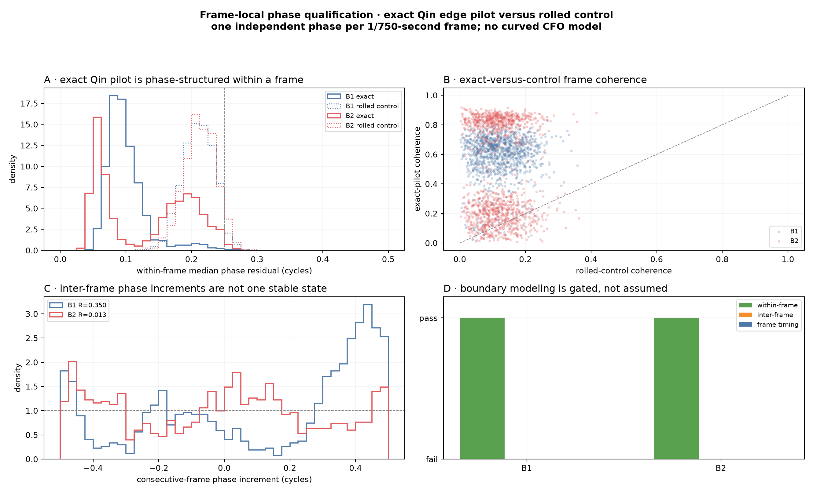
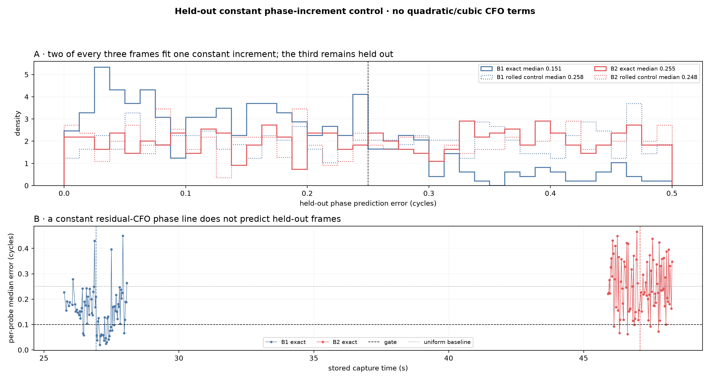
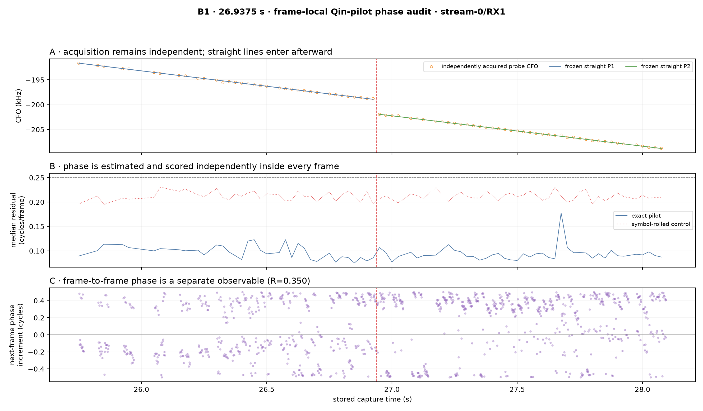
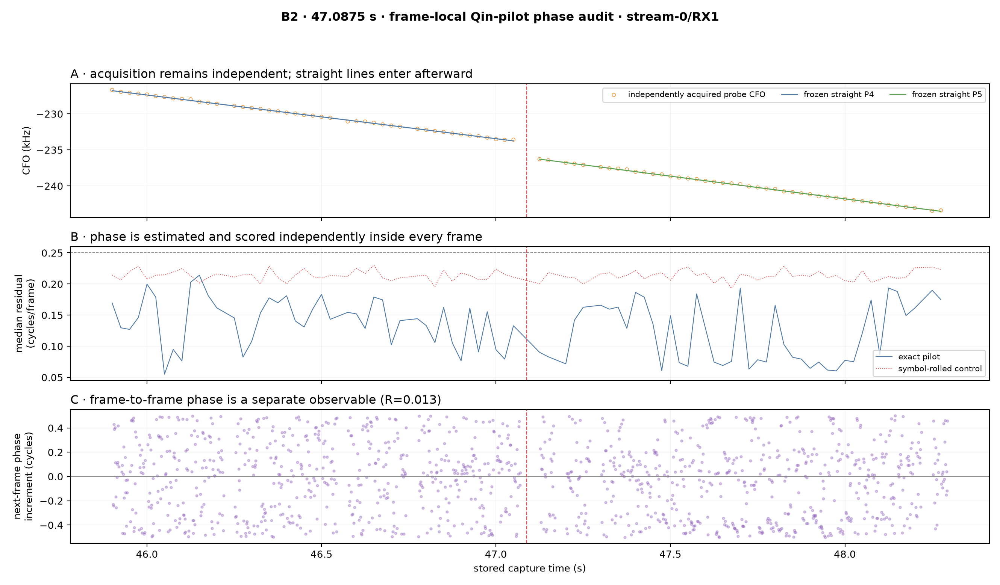

# Frame-local phase qualification for adjacent Starlink CFO segments

## Answer

The existing IQ contains **measurable phase structure inside individual Starlink frames**, but it does **not** provide a qualified phase or frame-timing state that predicts the next frame across either audited boundary. Consequently B1 and B2 remain ineligible for a continuous-phase bridge. This is the expected failure mode described by Qin: coherent processing within a frame is useful, while inter-frame carrier phase discontinuities have not been generally modeled.

This result is narrower than the earlier 20 ms phase audit. A 20 ms probe contains about 15 Starlink frames; this rerun estimates one independent circular phase per approximately 1.33 ms frame and tests within-frame measurability separately from inter-frame predictability.

## Decision gates

| Boundary | Frames | Exact/control residual | Exact/control coherence | Consecutive-phase R | Held-out exact/control error | Timing R pre/post | Phase-boundary result |
|---|---:|---:|---:|---:|---:|---:|---|
| B1 · 26.9375 s | 1155 | 0.094/0.211 cycles | 0.625/0.115 | 0.350 | 0.151/0.258 cycles | 0.257/0.246 | **not eligible: frame-to-frame phase/timing state is not qualified** |
| B2 · 47.0875 s | 1297 | 0.143/0.213 cycles | 0.336/0.113 | 0.013 | 0.255/0.248 cycles | 0.048/0.240 | **not eligible: frame-to-frame phase/timing state is not qualified** |

These exploratory operational gates are declared explicitly so they can be preregistered on the next dwell: exact-pilot median phase residual must beat the symbol-rolled control by at least 0.03 cycles and exact coherence must be at least twice control; a constant phase increment fit on two of every three frames must predict the interleaved third with median error≤0.10 cycles and beat control by at least 0.03 cycles; frame-epoch concentration must be at least 0.80 on both sides. These are research gates, not production acceptance thresholds.

The within-frame gate passes at both boundaries. The inter-frame and timing gates do not. B1 has statistically ordered, near-half-cycle structure and partially predicts held-out frames (0.151 cycles overall and 0.118 after B1), but it misses the 0.10-cycle gate and retains a 0.301-cycle 90th-percentile error. B2 remains at the approximately 0.25-cycle uniform baseline. A small apparent phase jump at either CFO boundary would therefore still be a chance-dependent number.

## Input and estimator

- Recording: `cap-20260822T143020-c4482829e26c`, `stream-0/RX1`, scope `sha256:424ec0775d22b40bd7f84ab693a65c412f5675c2c1aba6a4e3e89bf9342ba9ba`.
- Raw input: immutable CI16 IQ at 2.5 MS/s.
- Candidate input: the already-published dense Research acquisition (81 coarse CFO hypotheses, 32 independently scored basins/probe, GLRT-4096).
- Candidate selection: after acquisition, select the basin nearest each frozen straight CFO segment within 2.5 kHz and margin≥0.05.
- Per-frame input: exact and symbol-rolled-control correlations for Qin symbols 2–65.
- Per-frame output: circular phase, bounded-power-weighted coherence, median phase residual, exact/control normalized power, and a global-phase-removed diagnostic shape.
- CFO rule: the independent candidate CFO and frozen degree-1 segment are retained. No order-2 or order-3 CFO trajectory is fit.

The frame estimator uses a bounded square-root power weight and a circular mean. A single symbol cannot dominate because its weight is capped at four times the frame median. Every frame is estimated independently; neither a neighboring frame nor the boundary hypothesis enters the phase estimate.

## Synthetic estimator control

The same implementation recovered 128 synthetic frames despite an independently random phase reset in every frame:

| Frames | Median error | 95th-percentile error | Median within-frame coherence |
|---:|---:|---:|---:|
| 128 | 0.0008 cycles | 0.0020 cycles | 0.9987 |

This control establishes that arbitrary inter-frame phase resets do not prevent the algorithm from recovering frame-local phase. It does not simulate the full Starlink channel or prove satellite identity.

A separate synthetic constant-increment sequence produced 0.0031-cycle median held-out error, whereas independent random resets produced 0.1987 cycles. This verifies that the held-out test recognizes a genuinely constant residual CFO.

## B1 · 26.9375 seconds

The exact pilot's median within-frame residual is 0.094 cycles versus 0.211 for the rolled control, so local phase is measurable. Consecutive-frame increments have concentration R=0.350 and ordered-permutation p=0.0020. A constant-increment phase line fit on two of every three frames has 0.151-cycle median held-out error versus 0.258 for control; the exact pre/post errors are 0.174/0.118. Frame timing concentrations are 0.257/0.246 before/after. The result is **not eligible: frame-to-frame phase/timing state is not qualified**.

## B2 · 47.0875 seconds

The exact pilot's median within-frame residual is 0.143 cycles versus 0.213 for the rolled control, so local phase is measurable. Consecutive-frame increments have concentration R=0.013 and ordered-permutation p=0.7944. A constant-increment phase line fit on two of every three frames has 0.255-cycle median held-out error versus 0.248 for control; the exact pre/post errors are 0.271/0.246. Frame timing concentrations are 0.048/0.240 before/after. The result is **not eligible: frame-to-frame phase/timing state is not qualified**.

## Boundary hypothesis comparison

| Hypothesis | B1 | B2 | What this phase analysis means |
|---|---|---|---|
| One phase-continuous component with one constant residual CFO | **Not qualified; partial structure** | **Not qualified** | B1 improves over control but misses the accuracy gate; B2 remains uniform-like. |
| One physical component with permitted Starlink frame-phase resets | Compatible | Compatible | This is explicitly allowed by Qin and cannot be rejected by the observed phase. |
| One component with a transmitter CFO correction or scheduling transition | Compatible | Compatible | Frame-local phase survives, but phase resets prevent a unique bridge. |
| Two components transmitted back-to-back | Compatible | Compatible | Phase alone cannot distinguish this from one reset-bearing component. |
| Two simultaneously overlapping resolved components | Not tested here | Not tested here | The parent report's fine-CFO coexistence control, rather than phase, addresses this case. |

The first row qualifies only a **phase model**. Its failure does not reject one physical satellite or one waveform component because Starlink itself may reset phase between frames and the recording may contain an unobserved sample-time interval.

## What phase can and cannot say

| Question | Result |
|---|---|
| Is the exact Qin pilot phase-structured inside one frame? | **Yes**, relative to the rolled control. |
| Is the next frame's phase predictable well enough to bridge B1/B2? | **No.** |
| Does failure of inter-frame phase prove two satellites? | **No.** Qin reports such discontinuities even within Starlink transmissions. |
| Does the edge-pilot pattern identify a satellite? | **No.** It repeats across satellites, beams, channels, and frames. |
| Can phase prove continuity across a potentially missing capture interval? | **No.** Absolute cycle count is unobservable there. |
| Can we retain frame-local phase for future waveform studies? | **Yes.** That observable is now qualified at candidate level. |

The global-phase-removed symbol shape is also intentionally not promoted to an emitter fingerprint. Its adjacent/random median similarities are 0.313/0.305 at B1 and 0.155/0.162 at B2. Because all rows were selected with the same universal exact template, this similarity is useful as an estimator diagnostic but not independent component identity.

## Relation to Qin and Kassas

Qin et al. model each recovered frame with its own complex amplitude/phase and state that coherent processing beyond one full frame is complicated by inter-frame carrier phase discontinuities that have resisted general modeling. They also separate effective carrier-frequency offset, which combines orbital Doppler and carrier-clock drift, from sampling-frequency offset. The present result reproduces precisely that distinction: the exact edge pilot has usable local phase, but one constant residual-CFO phase line does not predict the next held-out frame.

Kassas et al. independently report user-dependent OFDM phase references and discrete phase changes when frames are directed to different users. Their central data-less pilot tones can behave more continuously, but this capture observes the Qin edge-pilot band, not a qualified central pilot tone. Therefore lack of edge-pilot inter-frame phase continuity is not evidence for a satellite handoff.

Primary sources: [Qin et al., arXiv:2602.02627](https://arxiv.org/abs/2602.02627) and [Kassas et al., DOI 10.33012/navi.685](https://doi.org/10.33012/navi.685).

## Revised next experiment

1. Preserve these frame-local complex states in a research artifact rather than collapsing them into a 20 ms magnitude score.
2. Develop a true phase-invariant channel fingerprint from per-subcarrier estimates, validated against unrelated simultaneous candidates before using it at a boundary.
3. Estimate timing/SFO from a continuous frame sequence rather than independently maximized 20 ms epochs; require within-segment controls to pass first.
4. Compare one-component-with-phase-resets against back-to-back components using CFO, timing/SFO, power, and qualified channel features. Treat frame phase as a nuisance parameter.
5. Keep firmware continuity work asynchronous. Even a better waveform model cannot recover absolute phase across samples that may not have been recorded.

## Reproducibility

- Machine-readable metrics: `frame-local-phase-metrics.json`.
- Per-frame complex-state artifact: `frame-local-phase-states.jsonl.gz`.
- Source candidate artifacts remain under the earlier carrier-continuity figure directory.
- Parent report: [reports/2026_08_22_carrier_continuity_case.md](2026_08_22_carrier_continuity_case.md).
