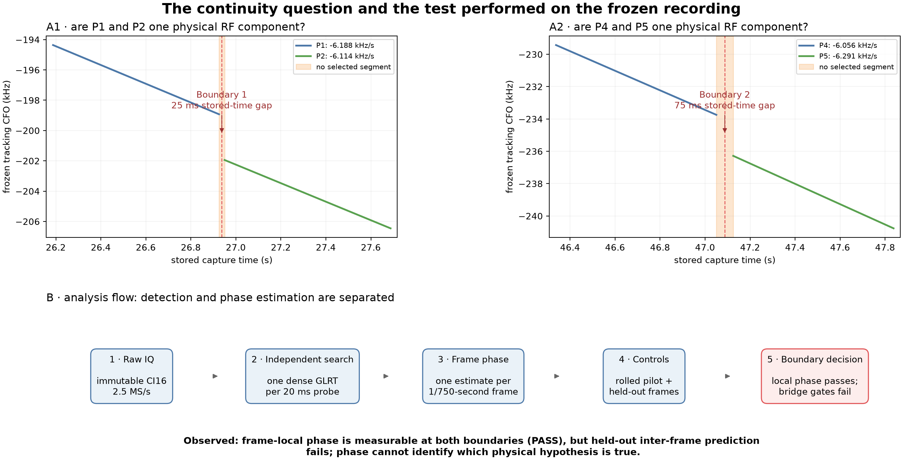

# Can frame phase connect adjacent Starlink-like carrier segments?

## Executive conclusion

This report asks whether two pairs of adjacent, straight carrier-frequency-offset (CFO) segments in one recording can be shown to be the **same phase-continuous RF component**. The answer is **not with the phase observable available in this capture**.

Correlation with the exact Qin edge-pilot template reveals clearly measurable phase inside an individual approximately 1.33 ms frame at both tested boundaries. However, that phase does not predict held-out neighboring frames accurately enough, and the estimated frame epochs are not stable. We therefore cannot propagate a unique phase state across either boundary.

This is an important but deliberately narrow result. It does **not** show that the two segments came from different satellites. One physical Starlink component with permitted frame-phase resets, one component that retuned, and two components scheduled back-to-back all remain compatible with the data.

> **Plain-language takeaway:** we can read the phase inside each short frame, but the clock
> hand does not advance predictably from one frame to the next. A phase value on one side
> of a gap therefore cannot identify the signal on the other side.

## 1. Why this question matters

The radio analysis found long, nearly linear Starlink-like CFO trajectories that are split into adjacent straight segments. A frequency step between two fitted segments can have several explanations: the same carrier may continue across unrecorded RF time, the transmitter may reset or retune, or a different scheduled carrier may begin. CFO and CFO rate alone do not distinguish those cases.

Complex carrier phase could be a much stronger continuity test: if phase and frame timing are stable, a model trained before a boundary should predict phase after it. But this test is valid only after demonstrating that phase is measurable within a frame and predictable between ordinary neighboring frames. This report performs those prerequisite checks rather than assuming coherence.

The stored sample index is continuous, but elapsed RF time is not known to be continuous. The parent capture audit found the two boundaries within 10.9 ms and 6.4 ms of repeatable IQ-shard rollover stalls. Without a device sample counter or lost-sample flag, any omitted samples also erase the absolute cycle count across the stall. Firmware/capture continuity work is intentionally left asynchronous; this report asks what can be learned from the existing IQ.

## 2. Frozen recording and audited boundaries

- Recording: `cap-20260822T143020-c4482829e26c`
- Receiver path: `stream-0/RX1`
- Immutable scope: `sha256:424ec0775d22b40bd7f84ab693a65c412f5675c2c1aba6a4e3e89bf9342ba9ba`
- Raw samples: CI16 IQ at 2.5 MS/s
- Time axis: stored sample time; continuous elapsed RF time is not guaranteed
- Carrier model: one straight CFO line per segment; no quadratic or cubic radio fit

Boundary 1 and Boundary 2 are labels for two transitions in this one recording. They are not satellite names, beams, receivers, or frequency bands. The P labels are the frozen piecewise-linear segment names inherited from the carrier-continuity analysis.

| Boundary | Before | After | Stored-time gap | Before/after CFO rate | Nearby shard-stall alignment |
|---|---|---|---:|---:|---:|
| Boundary 1 (B1), 26.9375 s | P1, 20.250–26.925 s | P2, 26.950–33.300 s | 25 ms | -6188.3/-6113.6 Hz/s | boundary 10.9 ms before stall |
| Boundary 2 (B2), 47.0875 s | P4, 40.625–47.050 s | P5, 47.125–49.425 s | 75 ms | -6055.8/-6291.4 Hz/s | boundary 6.4 ms after stall |

## 3. Terminology

| Term | Meaning in this report |
|---|---|
| Carrier-frequency offset (CFO) | Instantaneous frequency displacement of the detected pilot relative to the receiver's reference, in Hz. It includes Doppler and oscillator terms. |
| CFO rate | Slope of CFO versus time, in Hz/s. Each P segment uses one constant rate. |
| Segment (P1, P2, P4, P5) | A time interval described by one independently supported straight CFO line. |
| Boundary (B1 or B2) | The short transition between the end of one selected segment and the start of the next. |
| Starlink frame | One approximately 1/750-second waveform frame. A 20 ms acquisition probe contains about 15 frames. |
| Exact edge pilot | The known Qin pilot pattern used to estimate a complex correlation and phase within a frame. |
| Rolled control | A deliberately symbol-shifted pilot that should not align with the waveform; it measures accidental structure. |
| Frame-local phase | Circular phase estimated independently inside one frame, reported in cycles where one cycle is 360 degrees. |
| Phase bridge | A phase/timing model trained on ordinary frames that can predict held-out frames and then propagate across a boundary. |
| Circular coherence or concentration, R | A 0–1 measure: near 1 means phases/epochs cluster; near 0 means they are diffuse around the circle. |
| Uniform-phase baseline | Random circular prediction has median absolute error near 0.25 cycles. |
| Eligible | All prerequisite gates pass, so a boundary phase jump may be interpreted. It does not mean the satellites have been identified. |

## 4. Competing explanations

| Physical explanation | What would be needed to distinguish it |
|---|---|
| One phase-continuous component | Stable frame timing and a held-out phase model that predicts ordinary frames before attempting the boundary. |
| One component with frame-phase resets | Frame-local phase may be strong while inter-frame phase is unpredictable. Additional timing/channel features are needed. |
| One component that retunes or changes scheduling state | A repeatable transmitter-state signature or a qualified phase-invariant channel fingerprint. |
| Two components transmitted back-to-back | Evidence of a different timing/channel state; phase alone is insufficient if either component resets per frame. |
| Two overlapping carriers | Two simultaneously resolved CFO likelihood peaks. This separate close-carrier test found none at these boundaries. |

## 5. Method

### 5.1 Inputs and outputs

The input is immutable raw IQ plus the already-published dense Research acquisition: 81 coarse CFO hypotheses, 32 independently scored basins per 20 ms probe, and GLRT-4096. Each probe is acquired without using a neighboring observation, segment line, TLE, or phase model. Only after acquisition do we select the basin within 2.5 kHz of the frozen straight segment with exact-minus-control margin at least 0.05.

For every selected probe, the method returns one independent state per Starlink frame: frame midpoint, circular phase, phase residual, coherence, exact/control normalized power, arrival epoch, and a global-phase-removed diagnostic symbol shape. The boundary-level output is a set of gate results—not a merged track, satellite identity, or TLE match.

### 5.2 Step-by-step estimator

1. **Detect independently.** Run the dense known-pilot GLRT separately at every 20 ms probe and preserve multiple CFO basins.
2. **Associate after detection.** Select the candidate near each already-frozen degree-1 segment. The line cannot create the candidate it is later used to audit.
3. **Condition the raw IQ.** Remove the independently selected candidate's constant CFO and use its independently selected arrival epoch inside that 20 ms probe. The frozen segment line is used only for post-detection association and display; its slope is not integrated into the phase samples. No quadratic or cubic CFO model is fitted.
4. **Split into frames.** Partition each probe into approximately 1.33 ms frames and correlate Qin symbols 2–65 against both the exact pilot and rolled control.
5. **Estimate each frame independently.** If `z[f,k]` is the conditioned complex pilot correlation, estimate `phase[f] = arg(sum_k w[f,k] z[f,k])/(2π)`. The square-root-power weights are capped at four times the frame median so one symbol cannot dominate.
6. **Test local phase.** Compare exact-pilot residual and coherence with the rolled control. This asks only whether phase exists inside one frame.
7. **Test inter-frame prediction.** Fit one constant phase increment to two of every three frames and predict the interleaved third. This is equivalent to allowing one constant residual CFO, not CFO curvature.
8. **Test timing.** Require the independently selected frame epochs to cluster on both sides. A phase bridge needs a stable time origin as well as stable phase evolution.
9. **Interpret the boundary only if all prerequisites pass.** If ordinary held-out frames or timing fail, any fitted phase jump at the boundary is chance-dependent and is not reported as continuity evidence.

### 5.3 Decision gates

| Gate | Passing rule | Why it is required |
|---|---|---|
| Within-frame phase | Exact median residual beats control by at least 0.03 cycles and exact coherence is at least 2× control | Proves the phase estimator sees the real pilot rather than accidental correlation. |
| Inter-frame prediction | Held-out median error ≤0.10 cycles and at least 0.03 cycles better than control | Proves a constant residual-CFO phase state predicts unseen neighboring frames. |
| Frame timing | Epoch concentration R≥0.80 both before and after | Prevents phase comparisons between inconsistent frame origins. |

These are explicit exploratory research gates intended for preregistration on a future dwell, not production acceptance thresholds. A boundary is eligible only if all three pass.

### 5.4 Synthetic controls

The same estimator recovered 128 synthetic frames with an independently random phase reset in every frame. Its median phase error was 0.0008 cycles, its 95th-percentile error was 0.0020 cycles, and median within-frame coherence was 0.9987. This shows that frame resets do not prevent local phase recovery.

A synthetic constant-increment sequence produced 0.0031-cycle median held-out error, while independent random resets produced 0.1987 cycles. The held-out test therefore detects the state it is designed to qualify. These controls validate the estimator mechanics; they do not simulate a complete Starlink channel or prove identity.

## 6. Results

The overview carries the central result. Exact-pilot phase residuals are much smaller than rolled-control residuals, so phase is real inside a frame. But consecutive-frame phase increments do not form one sufficiently stable state, and only the green within-frame bars pass. The orange inter-frame and blue timing gates fail at both boundaries.

| Boundary | Frames | Exact/control residual | Exact/control coherence | Consecutive-phase R | Held-out exact/control error | Timing R pre/post | Result |
|---|---:|---:|---:|---:|---:|---:|---|
| Boundary 1 (B1) · 26.9375 s | 1155 | 0.094/0.211 cycles | 0.625/0.115 | 0.350 | 0.151/0.258 cycles | 0.257/0.246 | **not eligible** |
| Boundary 2 (B2) · 47.0875 s | 1297 | 0.143/0.213 cycles | 0.336/0.113 | 0.013 | 0.255/0.248 cycles | 0.048/0.240 | **not eligible** |

### 6.1 Boundary 1: P1 → P2 at 26.9375 seconds

The exact pilot's median within-frame residual is 0.094 cycles versus 0.211 for the rolled control, so local phase is measurable. Consecutive-frame increments have concentration R=0.350 and ordered-permutation p=0.0020. A constant-increment phase line fit on two of every three frames has 0.151-cycle median held-out error versus 0.258 for control; the exact pre/post errors are 0.174/0.118. Frame timing concentrations are 0.257/0.246 before/after. The result is **not eligible: frame-to-frame phase/timing state is not qualified**.

How to read this figure: panel A shows independently acquired CFO candidates over the two frozen straight segments; panel B shows that exact-pilot phase residual is lower than the rolled control inside each frame; panel C shows the frame-to-frame phase increment. The broad/two-lobed increment pattern is why a single predictive state is not yet qualified. Boundary 1 is interesting—especially its 0.118-cycle post-boundary held-out error—but it still misses the 0.10-cycle gate and has 0.301-cycle 90th-percentile error.

### 6.2 Boundary 2: P4 → P5 at 47.0875 seconds

The exact pilot's median within-frame residual is 0.143 cycles versus 0.213 for the rolled control, so local phase is measurable. Consecutive-frame increments have concentration R=0.013 and ordered-permutation p=0.7944. A constant-increment phase line fit on two of every three frames has 0.255-cycle median held-out error versus 0.248 for control; the exact pre/post errors are 0.271/0.246. Frame timing concentrations are 0.048/0.240 before/after. The result is **not eligible: frame-to-frame phase/timing state is not qualified**.

Here the exact pilot again beats the rolled control inside frames, but consecutive-frame increments are essentially uniform (R=0.013), and held-out exact error is no better than control. Boundary 2 provides no usable inter-frame phase state.

### 6.3 The decisive held-out test

The upper panel compares prediction-error distributions. Random circular prediction has a 0.25-cycle median baseline; Boundary 1 is partially better, whereas Boundary 2 remains at baseline. The lower panel shows median error per 20 ms probe. The dashed 0.10-cycle line is the declared gate. Ordinary held-out frames do not remain reliably below it, so extrapolating a phase line across either boundary would overstate the data.

## 7. What the result does—and does not—establish

| Hypothesis | Boundary 1 | Boundary 2 | Interpretation |
|---|---|---|---|
| One phase-continuous component with one constant residual CFO | **Not qualified; partial structure** | **Not qualified** | The required phase/timing state does not pass held-out controls. |
| One physical component with permitted Starlink frame-phase resets | Compatible | Compatible | Resetting frame phase naturally preserves local phase while defeating a phase bridge. |
| One component with a transmitter correction or scheduling transition | Compatible | Compatible | The present phase observable cannot distinguish this state change. |
| Two components transmitted back-to-back | Compatible | Compatible | Phase alone cannot distinguish this from one reset-bearing component. |
| Two simultaneously overlapping resolved components | Not supported by the separate close-CFO audit | Not supported by the separate close-CFO audit | Absence of two peaks does not exclude non-overlapping scheduled carriers. |

Failure of the continuous-phase model rejects only that **measurement model**. It does not reject one physical satellite or one RF component. Likewise, the universal edge pilot is not an emitter fingerprint. Global-phase-removed adjacent/random symbol-shape similarities are 0.313/0.305 at Boundary 1 and 0.155/0.162 at Boundary 2—no useful separation from random pairs.

## 8. Connection to the Qin and Kassas papers

Qin et al. model each recovered frame with its own complex amplitude and phase. They report that coherent processing beyond one full frame is complicated by inter-frame carrier-phase discontinuities that have resisted general modeling. They also separate effective CFO—which combines orbital Doppler and carrier-clock drift—from sampling-frequency offset. Our observation is consistent with that account: the exact edge pilot has useful local phase, but a single residual-CFO phase line does not predict subsequent frames.

Kassas et al. report user-dependent OFDM phase references and discrete phase changes when frames are directed to different users. Their central data-less pilot tones can behave more continuously, but this recording audits Qin's edge-pilot band, not a qualified central pilot tone. Missing edge-pilot phase continuity is therefore not evidence of a satellite handoff.

Primary sources: [Qin et al., arXiv:2602.02627](https://arxiv.org/abs/2602.02627) and [Kassas et al., DOI 10.33012/navi.685](https://doi.org/10.33012/navi.685).

## 9. Limitations

- This is one frozen recording and two post-selected adjacent boundaries; the gates are exploratory.
- The analysis establishes a receiver-relative waveform observable, not spacecraft identity.
- Absolute phase cannot be reconstructed across samples that may never have been recorded.
- The edge pilot is universal and cannot identify a satellite, beam, or user by itself.
- Frame timing was inherited from independently maximized 20 ms acquisitions rather than one continuous timing/SFO tracker.
- The synthetic controls validate estimator behavior but are not a complete propagation, channel, scheduling, or receiver simulation.

## 10. Recommended next experiment

1. Preserve these frame-local complex states in the Research artifact rather than collapsing them into a magnitude-only score.
2. Add a continuous frame timing/SFO tracker and require it to pass within-segment held-out controls before testing a boundary.
3. Develop a phase-invariant per-subcarrier channel fingerprint and demonstrate separation between unrelated simultaneous candidates.
4. Compare explicit one-component-with-resets and back-to-back-component models using CFO, timing/SFO, power, and the qualified channel features; treat frame phase as a nuisance state.
5. Leave firmware continuity work asynchronous, but do not claim absolute phase or RF-time continuity for captures without device sample counters and lost-sample evidence.

## 11. Reproducibility

- Generator: `tools/report_frame_local_phase_qualification.py`.
- Machine-readable metrics: `frame-local-phase-metrics.json`.
- Per-frame complex states: `frame-local-phase-states.jsonl.gz`.
- Candidate artifacts: the frozen dense Research candidate files under the carrier-continuity figure directory.
- Supporting capture-continuity report: [reports/2026_08_22_carrier_continuity_case.md](2026_08_22_carrier_continuity_case.md).
- Random controls use the persisted seed recorded in the metrics artifact.
