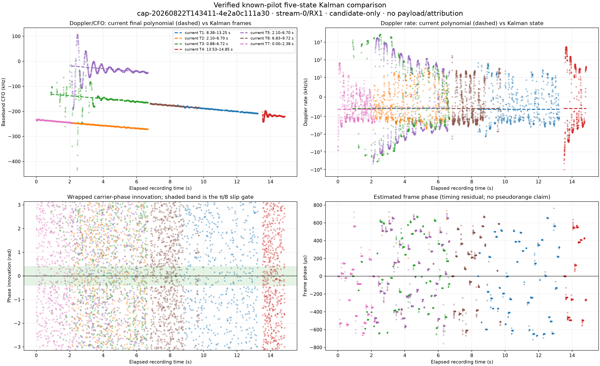
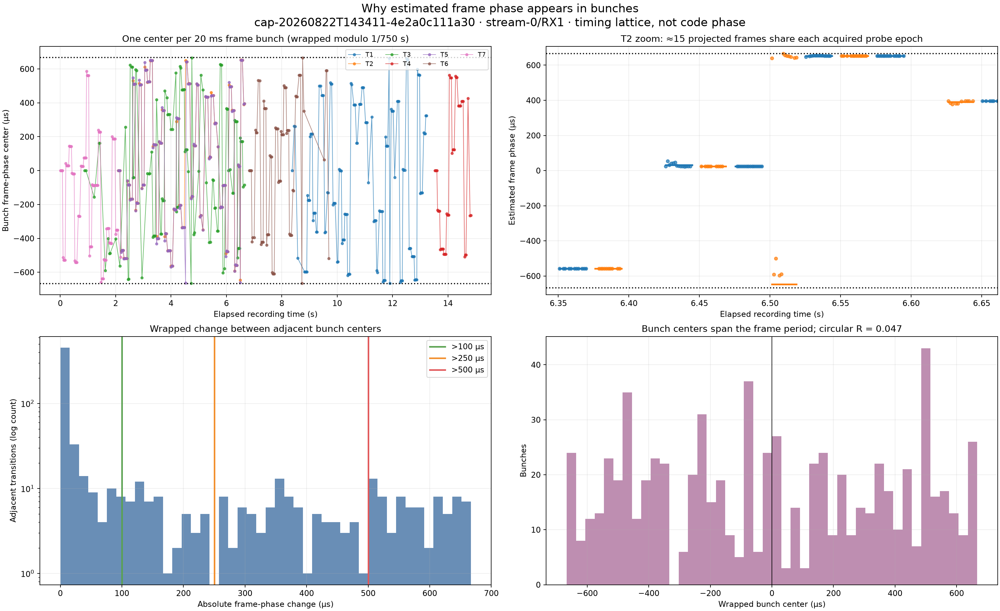

# Verified Kalman phase-tracking comparison

## Answer

The new five-state tracker ran successfully over a recent, sealed dwell, but its
known-edge-pilot phase observable is **not coherent enough for PNT-style phase
tracking**. The existing Standard final CFO trajectories remain the more truthful
summary for this recording.

The Kalman product is computationally complete for all seven final tracks. That
means every selected track was processed without truncation or an IQ-integrity
failure; it is not a scientific coherence pass. Of 8,305 accepted frame updates,
7,293 (87.81%) exceeded the configured π/8 phase-slip gate. The median absolute
wrapped phase innovation is 1.5833 rad, essentially the π/2 value expected from a
uniform wrapped phase, and its circular resultant length is only 0.0069.

## Selected dwell and integrity gate

| Field | Value |
|---|---|
| Session | `cap-20260822T143411-4e2a0c111a30` |
| Sealed Standard run | `reprocess-a3fc4c77b1234b58ab5f7292b23db161` |
| Path | `stream-0/RX1`, Qin lower edge |
| Scope | `sha256:d7412c34fc4f03bbe33b2818b87aa0e902893daf9be899e9e01585a404122ba0` |
| Recording manifest | `sha256:fffd89c8e2afa0d33dc8b5bc3b1f19c13f3dc2f28d2b0e242f498c72ff3325ab` |
| Raw-IQ policy | Read-only; every consumed compressed and uncompressed shard digest verified |
| Kalman runtime | About 6.0 s |

The initially preferred signal-strength case was the immediately preceding dwell,
`cap-20260822T143020-c4482829e26c`, `stream-0/RX1`: 2,143/2,400 probes had a
positive pilot margin, 297 had QAM accuracy at least 0.8, and the maximum QAM
accuracy was 0.9458. It was excluded because local IQ shard `iq-000007.ci16.zst`
does not match the sealed recording manifest. Verification was not bypassed.

The selected 14:34:11 replacement has a complete Standard path and clear pilot
evidence during approximately the first 15 seconds. Its current summary contains
2,400 probes, 1,522 positive GLRT64 margins, 121 exploratory pilot/QAM positives,
a maximum GLRT64 margin of 0.6012, a maximum QAM accuracy of 0.8146, and seven
final degree-one trajectories with 26.525 seconds of summed (overlapping) support.

Current persisted views:

- [Final CFO trajectories](/srv/bulk/leo/analysis/cap-20260822T143411-4e2a0c111a30/reprocess-a3fc4c77b1234b58ab5f7292b23db161/presentation/path-standard/sha256:d7412c34fc4f03bbe33b2818b87aa0e902893daf9be899e9e01585a404122ba0/standard.cfo-trajectories-final-png.v1.png)
- [Pilot-method comparison](/srv/bulk/leo/analysis/cap-20260822T143411-4e2a0c111a30/reprocess-a3fc4c77b1234b58ab5f7292b23db161/presentation/path-standard/sha256:d7412c34fc4f03bbe33b2818b87aa0e902893daf9be899e9e01585a404122ba0/standard.pilot-methods-png.v1.png)
- [Waterfall](/srv/bulk/leo/analysis/cap-20260822T143411-4e2a0c111a30/reprocess-a3fc4c77b1234b58ab5f7292b23db161/presentation/path-standard/sha256:d7412c34fc4f03bbe33b2818b87aa0e902893daf9be899e9e01585a404122ba0/standard.waterfall-png.v1.png)

## What the estimated-frame-phase bunches mean

Each bunch comes primarily from one independently acquired 20 ms probe. At the
nominal 750 Hz frame rate, frames are 1.3333 ms apart, so a complete probe contributes
about 15 frame instances over a median 18.664 ms. The two probes in each 50 ms
subwindow start at offsets 0 and 25 ms; the observed median bunch cadence is therefore
25.332 ms, with longer gaps where a selected trajectory has no mapped observation.

Carrier phase and phase-slope Doppler are measured separately on the known pilot
symbols in every frame instance. Frame timing is different: the detector acquires one
local frame epoch for the entire 20 ms probe, then projects the other frame positions
from it on the nominal 750 Hz lattice. The median within-bunch frame-phase deviation
is consequently only 0.126 µs. That tightness is mostly shared-epoch construction,
not 15 independent confirmations of one timing phase.

Across the seven overlapping track histories there are 741 bunches and 734 adjacent
bunch transitions. Their filtered center has circular resultant length 0.0465; the
unfiltered measurement center is similarly low at 0.0410. A value of 1 would mean
one stable phase and 0 is uniform around the 1.3333 ms frame period. The bunch centers
therefore do not establish one coherent frame epoch across probes.

| Wrapped adjacent-bunch change | Count | Fraction | Median interval between events |
|---|---:|---:|---:|
| >100 µs | 207/734 | 28.20% | 100.6 ms |
| >250 µs | 153/734 | 20.84% | 124.8 ms |
| >500 µs | 74/734 | 10.08% | 201.0 ms |

The median adjacent change is only 3.01 µs because several neighboring probes often
retain the same timing basin. The larger changes occur when independent acquisition
selects another epoch/basin. These are post-analysis diagnostic thresholds, not a
discrete switch state emitted by the Kalman filter. Differences are wrapped modulo
1.3333 ms: for example, displayed centers near +600 and −600 µs are only about
133 µs apart on the frame circle.

RF carrier phase is not coherent inside these apparent timing groups either. The
median within-bunch carrier-innovation concentration is 0.260, and the concentration
of bunch-level carrier centers is 0.0316. The bunches should therefore be read as
locally consistent frame-lattice placement, not carrier lock, code phase, or
pseudorange.

## Comparison with the current Standard result

| Observable | Current Standard | Five-state Kalman replay | Interpretation |
|---|---:|---:|---|
| Final tracks | 7 degree-one CFO polynomials | 7/7 tracks, 10,944/10,944 frames | Full computational coverage |
| Carrier phase | Not persisted or claimed | Median absolute innovation 1.5833 rad; resultant 0.0069 | Uniform-like, not coherent |
| Phase slips | Not applicable | 7,293/8,305 accepted updates (87.81%) | Fails π/8 continuation gate |
| Doppler shift | Smooth final polynomial lines | Median absolute innovation 3.737 kHz; RMS 24.407 kHz | No improvement over current lines |
| Filtered minus current CFO | Reference | Median absolute difference 629.2 Hz | Small centrally, but large ringing is visible |
| Doppler rate | Constant derivative of each final line | Median absolute difference 13.497 kHz/s | State is unstable at frame scale |
| Frame phase | No observable | Median absolute receiver-relative residual 355.6 µs | Frame ambiguity remains; no code phase |
| CFO corrections | Replay-classified trajectory correction | 52 innovation-threshold events | Diagnostic events, not validated loop corrections |

The bottom-left panel is the decisive phase result: innovations fill almost the
entire ±π interval instead of concentrating around zero. The top-left and top-right
panels show why the new Doppler and Doppler-rate states should not replace the
existing PNGs: the paper-default measurement covariance is far tighter than this
receiver's actual known-edge-pilot discriminator noise, so the closed loop responds
to frame-level ambiguity and residual modulation as if they were carrier dynamics.

The frame-phase output is the timing residual of the locally acquired 750 Hz frame
lattice. Independent 20 ms probes do not share an integer frame epoch, and the
recording does not supply the paper's full beacon/code observable. It is therefore
neither code phase nor pseudorange.

## Disposition

Keep the new product additive and candidate-only, but do not present its present
phase, frame, Doppler, or Doppler-rate series as PNT-grade tracking. The current
final CFO PNG and Standard path summary remain authoritative for this dwell.

Before enabling a phase-coherence claim, the tracker needs a continuous per-frame
extractor with a shared absolute sample/frame epoch, modulation removal or a
validated complex pilot reference, measurement covariances estimated from real
within-track residuals, and matched-SNR continuous/reset/two-carrier synthetic
controls. The phase acceptance gate should then be reviewed on held-out recordings;
it should not be tuned until this one post-hoc dwell appears smooth.

## Reproducibility artifacts

- [Machine-readable comparison summary](figures/2026_08_22_kalman_phase_tracking/kalman-phase-comparison-summary.json)
- [Persisted additive Kalman product](figures/2026_08_22_kalman_phase_tracking/standard.kalman-tracking.v1.json.gz)
- Replay command: `uv run python tools/analyze_kalman_phase_comparison.py`

All results are receiver-relative, candidate-only, and known-pilots-only. No payload
was decoded, no satellite was identified, and no pseudorange or position fix is
claimed.
