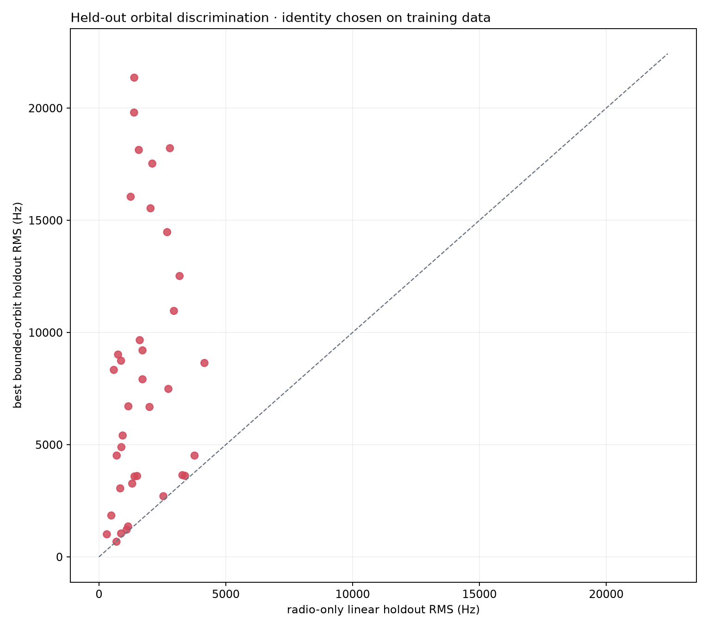
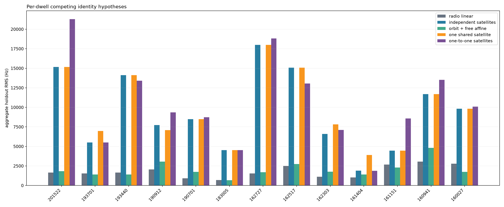
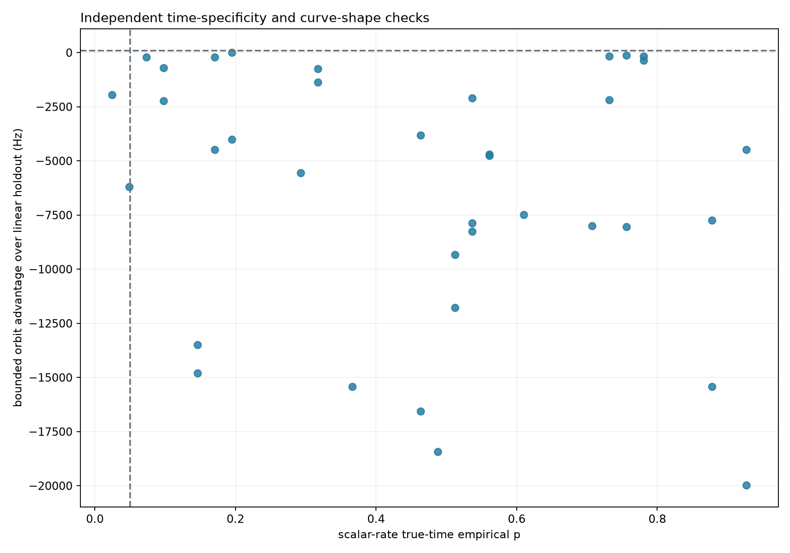

# Historical Starlink track association: 13-dwell held-out test

## Verdict

**None of the 37 eligible radio tracks can be associated securely with a
specific known Starlink satellite.** The captures contain strong
Qin-template/known-pilot evidence and coherent CFO trajectories, so this is a
failure of **NORAD identity attribution**, not evidence that the signals are
non-Starlink.

The physically bounded orbital model beat a radio-only straight line on only
1 of 37 chronological holdouts, by 13.5 Hz RMS, and on 0 of 13 dwell-level
comparisons. No improvement reached the predeclared 100 Hz gate. Every best
fit drove the allowed ±0.30 s epoch adjustment to a boundary. The two tracks
which passed the older wrong-time scalar-rate control both selected
STARLINK-11182, but their held-out orbital curves were much worse than their
radio-only lines. They are rejected, along with every other named candidate.

This is the useful scientific outcome: single-slope proximity produced
plausible names, while chronological curve prediction discriminated against
them.

## Freshness and provenance

- Main was reviewed at `eb9dfb4f9602a6d5c2a11f68c595db488169638f`.
- All 41 Markdown reports tracked under `reports/` on that commit were reviewed;
  the disposition of each is in the appendix.
- Thirteen successful Standard dwells spanning 16:00–20:15 UTC on 2026-08-21
  were selected without looking at any TLE match. The three longest fresh
  degree-1 tracks per dwell were preselected; one short track failed the fixed
  ≥5 s and ≥50-observation gate, leaving 37.
- At 2026-08-22T22:15:36Z, main code rebuilt the degree-1 trajectory bank from
  every dwell's sealed `standard.pilot-scan` V3 independent-candidate product.
  No persisted nonlinear family, de-alias membership, replay membership, or
  final-track selection was reused.
- The production source release is `9f45c2aefc60b355ad1da173211c9c1255a13395`.
  Between it and reviewed main, `pilot_methods.py` and `trajectories.py` are
  unchanged; `trajectory_feedback.py` only exposes a bounded sample iterator.
  Thus the reused independent raw-IQ pilot scores are numerically current for
  this analysis, while the trajectory selection and all orbital work were
  freshly executed on main.
- This was not a new full IQ replay and did not write production products. That
  limitation is explicit because the fresh tracks are pre-replay evidence. It
  does not affect the held-out comparison's use of the independently scored CFO
  observations, but it remains a possible track-membership systematic.
- The evidence records the base commit, report-tool hashes, source product URIs
  and digests, causal TLE snapshot digests, configuration digest, and exact
  decision thresholds. QNAP and production storage were read-only.

Fresh reconstruction: [13-dwell degree-1 report](2026_08_22_thirteen_dwell_degree1_rerun.md).
Machine evidence: [association JSON](figures/2026_08_22_thirteen_dwell_starlink_association/multi-dwell-starlink-association.json)
and [track CSV](figures/2026_08_22_thirteen_dwell_starlink_association/multi-dwell-track-summary.csv).

## Models and anti-overfit design

Each observed track was split chronologically: the first 60% selected the
satellite identity, nuisance parameters, and epoch adjustment; the final 40%
was held out until scoring. Candidate satellites came from the latest archived
Space-Track snapshot collected at or before the dwell, had elevation ≥10°, and
were visible for at least 95% of that track.

| Hypothesis | Parameters learned on the first 60% | What it tests |
|---|---|---|
| Radio-only line | Offset + unrestricted slope | Smooth local carrier with no orbital identity |
| Orbit + offset | Satellite, ±0.30 s epoch, constant offset | Geometry explains the entire rate |
| Orbit + LNB drift | Above + drift bounded ±25 Hz/s | Geometry plus measured oscillator-scale drift |
| Primary orbit | Above + drift bounded ±200 Hz/s | Geometry plus a deliberately broad nuisance rate |
| Orbit + free affine | Above + unrestricted offset and slope | Curvature-only upper bound for arbitrary transmitter/receiver rate |
| Wide-time diagnostic | Primary model with ±2 s epoch | Tests an implausibly large capture-time-error rescue |
| Shared satellite | One catalog number for every eligible track in a dwell | Common source across paths/tracks |
| One-to-one satellites | Distinct catalog number for each simultaneous track | Multiple distinct spacecraft |

A secure association had to pass every fixed check: ≥5 s, ≥50 observations,
holdout RMS ≤500 Hz, ≥100 Hz holdout improvement over the radio line, ≥100 Hz
training margin over the runner-up satellite, epoch strictly inside ±0.30 s,
wrong-time scalar-rate p≤0.05, the same identity across nuisance models, channel
and RF reconstruction agreement within 10 Hz, and adjacent-causal-TLE
affine-removed shape sensitivity ≤100 Hz. Track preselection preceded TLE
matching.

## Results

| Held-out model | Median track RMS | Track wins vs line | Dwell wins vs line |
|---|---:|---:|---:|
| Radio-only line | 1,401 Hz | baseline | baseline |
| Orbit + offset | 7,919 Hz | 1 / 37 | — |
| Orbit + ±25 Hz/s drift | 7,768 Hz | 1 / 37 | — |
| Primary orbit + ±200 Hz/s drift | 6,712 Hz | 1 / 37 | **0 / 13** |
| Orbit + free affine | 1,720 Hz | 15 / 37 | 5 / 13 |
| Primary orbit + ±2 s time search | 6,531 Hz | 2 / 37 | — |

The primary orbital model's median dwell-level penalty was 7,044 Hz RMS
(range 872–16,464 Hz). If the 13 dwell outcomes were exchangeable fair binary
wins, 0 orbital wins has probability `2^-13 = 0.000122`; the dwells are clustered
in one 4.25-hour interval, so this is a descriptive sign check rather than an
independence-based significance claim.

| UTC | Tracks | Radio line | Primary independent | Orbit + free affine | One shared | One-to-one | Training-selected primary catalog number(s) | Lowest RMS |
|---|---:|---:|---:|---:|---:|---:|---|---|
| 20:15:22 | 3 | 1,648 | 15,169 | 1,836 | 15,169 | 21,301 | 63062, 63062, 54771 | **radio line** |
| 19:37:01 | 3 | 1,543 | 5,501 | 1,403 | 6,982 | 5,501 | 59424, 52704, 68052 | free affine |
| 19:34:40 | 3 | 1,653 | 14,134 | 1,406 | 14,134 | 13,404 | 66484, 66484, 66484 | free affine |
| 19:09:12 | 3 | 2,051 | 7,739 | 3,052 | 7,088 | 9,353 | 60399, 64209, 60399 | **radio line** |
| 19:07:01 | 3 | 912 | 8,489 | 1,737 | 8,489 | 8,742 | 63670, 63670, 63670 | **radio line** |
| 18:30:05 | 1 | 700 | 4,518 | 679 | 4,518 | 4,518 | 63457 | free affine |
| 16:27:27 | 3 | 1,537 | 18,001 | 1,706 | 18,001 | 18,814 | 69722, 69722, 69722 | **radio line** |
| 16:25:17 | 3 | 2,493 | 15,070 | 2,737 | 15,070 | 13,047 | 68781, 68781, 68781 | **radio line** |
| 16:23:03 | 3 | 1,125 | 6,591 | 1,768 | 7,832 | 7,103 | 63195, 100151, 100151 | **radio line** |
| 16:14:04 | 3 | 1,025 | 1,897 | 1,415 | 3,907 | 1,872 | 100303, 100303, 100307 | **radio line** |
| 16:11:51 | 3 | 2,681 | 4,451 | 2,297 | 4,451 | 8,583 | 100308, 100308, 100308 | free affine |
| 16:09:41 | 3 | 3,068 | 11,704 | 4,828 | 11,704 | 13,512 | 100309, 100309, 100309 | **radio line** |
| 16:00:27 | 3 | 2,785 | 9,828 | 1,734 | 9,828 | 10,096 | 100159, 100159, 100159 | free affine |

All RMS values in the dwell table are observation-count-weighted held-out Hz.
The five free-affine wins do not name the primary catalog numbers shown in the
table: across all tracks that model selects 31 distinct identities for 37
tracks, and only 6/37 tracks keep one identity across the nuisance/time models.
Seven multi-track dwells selected the same primary catalog number for all three
tracks, but this did not validate a shared source: those orbital curves failed
the holdout by large margins. Repeated naming is therefore a rate/shape
attractor, not corroboration.

| Secure check | Passed | Failed | Interpretation |
|---|---:|---:|---|
| Track duration and observations | 37 | 0 | The evaluation set meets its support floor. |
| Primary holdout RMS ≤500 Hz | 0 | 37 | No bounded-orbit prediction is accurate enough. |
| Primary beats line by ≥100 Hz | 0 | 37 | The central discrimination fails universally. |
| Primary epoch is interior | 0 | 37 | Every fit wants more timing shift than allowed. |
| Scalar wrong-time p≤0.05 | 2 | 35 | The two apparent rate hits are not confirmed by curve shape. |
| Runner-up training margin ≥100 Hz | 31 | 6 | Separation on training data alone is common but misleading. |
| Identity stable across nuisance/time models | 6 | 31 | Most names depend on the assumed clock/drift model. |
| Adjacent-TLE shape sensitivity ≤100 Hz | 33 | 4 | TLE choice is usually small after affine removal, but not always. |
| RF authority consistency ≤10 Hz | 37 | 0 | Channel/edge tags and IF+9.75 GHz reconstruction agree. |
| **All checks** | **0** | **37** | **No secure NORAD association.** |

The least-bad primary result is 20:15 T3 → STARLINK-5451 (NORAD 54771):
678.7 Hz orbital versus 692.2 Hz linear holdout, only a 13.5 Hz improvement,
0.37 Hz training margin, epoch −0.30 s at the boundary, and scalar p=0.195.
The prior scalar-rate hits are 19:09 T1 and T3 → STARLINK-11182 (NORAD 60399),
p=0.024 and 0.049; their orbital holdouts are 3,269 and 7,916 Hz versus linear
1,311 and 1,719 Hz. All three labels are rejected.

The ±2 s diagnostic produces one superficially stronger case, 16:14 T3 →
STARLINK-38116 (NORAD 100307), 410.7 versus 872.8 Hz. It requires +2.00 s at the
expanded boundary despite a 0.18 s capture-time interval and has scalar p=0.780.
It is evidence against the timing-error rescue, not an association.

## Error budget and interpretation

The reported sensitivities are perturbation results, not claims that the
underlying uncertainties are Gaussian. Raw frequency effects can be absorbed
by the fitted offset or slope; the affine-removed shape effect is the quantity
most relevant to identity discrimination.

| Source | Estimated size over these 37 tracks | Consequence |
|---|---|---|
| Fresh degree-1 measurement/model residual | 442–1,418 Hz RMS; median 1,057 Hz | Sets a real kHz-scale radio-noise/model floor. |
| Chronological extrapolation | Linear median 1,401 Hz; primary orbit median 6,712 Hz | Dominant observed mismatch; identity model generalizes worse. |
| Capture timing | Half-width 0.179–0.192 s. Raw orbital change 596–1,175 Hz; affine-removed shape 0.53–27.13 Hz, median 3.34 Hz | Offset/rate nuisance absorbs almost all known timing uncertainty; cannot explain multi-kHz shape failures. |
| Deliberate wide timing control | ±2 s; 32/37 optima still at a boundary; only one ≥100 Hz win | Seconds-scale timing would contradict the capture interval and still does not give a stable cohort result. |
| Observer site, ±50 m perturbation | Raw 17.7–40.0 Hz RMS; affine-removed shape 0.017–0.735 Hz, median 0.129 Hz | Negligible at the assumed bound. Site is reviewed Sausalito metadata, not capture-bound, so larger location error remains an unquantified provenance risk. |
| RF center | Tag-versus-IF reconstruction difference 0 or 2 Hz; pilot-band carrier-scale effect 0.283–0.499 Hz/s | Numerically negligible. The old 10.6 GHz wording was not used; current authority is 9.75 GHz. |
| Frequency reference / LNB | 37/37 are `uncalibrated_prior`; tested drift bounds ±25 and ±200 Hz/s | Bounded oscillator drift does not rescue orbital fits. Absolute CFO identity remains unavailable. |
| Causal TLE age | 3.57–50.20 h; median 14.31 h | Age is not an uncertainty distribution, but discloses propagation distance. |
| Adjacent causal TLE snapshot | Collections separated 1.01–1.98 h. Same-object raw difference 0–62.7 kHz RMS; affine-removed shape 0–264.6 Hz, median 0; 33/37 ≤100 Hz | Usually identical elements or shape-stable; four associations are additionally TLE-sensitive. Large raw offsets are absorbed by nuisance terms. |
| Satellite competition | Runner-up margin passes 31/37, but identity stability passes only 6/37 | A sharp optimum under one model is not a robust identity. |
| Wrong-time scalar control | 2/37 p≤0.05; chance expectation 1.85, binomial `P(X≥2)=0.558` under independent nulls | Scalar rate hits occur at the expected chance scale and fail curve holdout. Track dependence makes this descriptive. |
| Candidate catalogue | Causal Space-Track, elevation ≥10°, visibility ≥95% | Missing/wrong objects or elements cannot be numerically bounded here; if the true spacecraft is absent, no tested name can be accepted. |
| Track membership | Fresh strict degree-1 fit from independent candidate scores; no same-IQ final replay | Avoids old d2/d3 contamination but leaves replay/alias-membership uncertainty unquantified. Constant alias lifts do not affect curvature because offset is fitted. |
| Cohort | 13 dwells over 4.25 h; 37 tracks, with tracks within a dwell correlated | Dwell-level outcomes are the conservative replication unit; this is not a 37-independent-sample confidence claim. |

The dominant unresolved term is the signal model, not timing, site, RF-center
arithmetic, or measured LNB drift. Qin et al.'s signal model makes effective
carrier CFO the sum of geometry and carrier-clock drift, with clock drift
piecewise constant from frame to frame (paper pp. 5–6). The free-affine model
therefore acts as a generous curvature-only upper bound. Kassas et al. report
30 Hz standard deviation for tracked-versus-TLE+SGP4 Doppler in a 2024,
known-identity, GNSS-disciplined setup (paper p. 21); their earlier corrected
data had a 180 Hz Laplacian standard deviation. Those are useful scale checks,
not transferable uncertainty bounds for these uncalibrated captures.

All 37 paths declare `uncalibrated_prior`. Constant alias lifts are absorbed by
the offset nuisance, and slow LNB drift is covered by ±25 and ±200 Hz/s models.
Unknown satellite/beam frequency steering can be much larger and is not bounded
by the hardware reference. Allowing a completely free affine term still does
not yield stable identities, so the present data do not isolate geometric
Doppler well enough for attribution.

## What would change the verdict

The next useful step is not more blind collection. Re-run these same files
through a versioned linear-only final/replay path, bind the surveyed observer
site and calibrated frequency reference into the capture contract, and fit
multiple simultaneous known-pilot tracks jointly with a transmitter-clock
state. An identity should then be required to repeat across independent paths
and adjacent dwells and to beat both wrong-time and wrong-satellite controls on
held-out curvature. Raw phase cannot currently bridge segment boundaries, so
phase continuity must not be used as an identity shortcut.

## Appendix: every report on main

The review scope is the 41 Markdown files returned by `git ls-tree -r main
reports` at the commit above. “Use” means the report contributes a measurement,
control, or constraint to this attribution; “context” means it informs data
quality but cannot name a satellite; “no bearing” means operational or rendering
work; “superseded” means its numerical association is replaced here.

| Report | Disposition for this review |
|---|---|
| `2026_08_20_line_finder.md` | **Use:** establishes alias-aware Hough geometry; lines are candidates, not identities. |
| `2026_08_20_recent_cfo_alias_history.md` | **Use:** quantifies the 227272.727 Hz CFO-alias spacing and historical lift frequency. |
| `2026_08_21_405bcced8e67_track_loss.md` | **Context:** selector/retention loss can truncate a real trajectory. |
| `2026_08_21_470384_alias_offsets.md` | **Use:** apparent offsets are integer CFO aliases, not separate spacecraft. |
| `2026_08_21_capture_pause_start_ui.md` | **No bearing:** capture UI behavior. |
| `2026_08_21_dead_code_and_obsolete_infrastructure_audit.md` | **No bearing:** code/infrastructure inventory. |
| `2026_08_21_dense_independent_glrt.md` | **Use:** independent candidate scoring shows endpoint loss is often search/retention, not RF disappearance. |
| `2026_08_21_durable_acquisition_queue.md` | **No bearing:** acquisition orchestration. |
| `2026_08_21_e2ac389247f3_track_loss.md` | **Context:** another retention failure case. |
| `2026_08_21_e7935fe8_recovery.md` | **Context:** candidate recovery demonstrates selector sensitivity. |
| `2026_08_21_e975ebaac089_replay_investigation.md` | **Use:** same-IQ replay can accept geometry that the final bank drops. |
| `2026_08_21_edge_pilot_if_dc_centering.md` | **Use:** authoritative 9.75 GHz IF/RF mapping and channel-edge centers. |
| `2026_08_21_fast_test_and_deploy_plan.md` | **No bearing:** operational planning. |
| `2026_08_21_five_dwell_degree1_only_rerun.md` | **Superseded:** correct strict-linear method, expanded here from 5 to 13 dwells. |
| `2026_08_21_five_dwell_tle_cone.md` | **Superseded:** scalar-rate result showed no time-specific identity; replaced by held-out curves. |
| `2026_08_21_http_matplotlib_png_rendering.md` | **No bearing:** rendering path. |
| `2026_08_21_paired_hough_gallery.md` | **Context:** cross-path line geometry is real but cannot supply NORAD identity. |
| `2026_08_21_scanner_burst_duty_cycle.md` | **Context:** sampling duty affects detection opportunity, not satellite attribution. |
| `2026_08_21_seeded_alias_em_d6a.md` | **Use:** alias/seed policy can change selected families and absolute CFO. |
| `2026_08_21_t1_dense_degree1_only.md` | **Use:** validates strict-linear association and the time-permutation coherence control. |
| `2026_08_21_tle_doppler_alignment.md` | **Superseded:** alternate copy/presentation of the five-dwell scalar comparison. |
| `2026_08_22_4e2a0c111a30_alias_aware_trajectory_accounting.md` | **Context:** improves evidence accounting but explicitly does not identify a TLE object. |
| `2026_08_22_carrier_continuity_case.md` | **Use:** adjacent segments likely share a carrier, but capture stalls prevent identity-grade continuity. |
| `2026_08_22_dual_lnb_drift_reference.md` | **Use:** empirical drift motivates the ±25 Hz/s model and rejects LNB drift as a kHz/s explanation. |
| `2026_08_22_edge_pilot_phase_slope.md` | **Use:** known pilots yield frame-local CFO; a one-dwell rate resemblance is not identity evidence. |
| `2026_08_22_frame_local_phase_qualification.md` | **Use:** phase is not coherent across frame/segment gaps, so it cannot link identities. |
| `2026_08_22_kalman_phase_tracking_comparison.md` | **Context:** dense phase innovations are frequently uniform-like; no stable identity observable. |
| `2026_08_22_pnt_kalman_comparison.md` | **Context:** PNT-state tracking improves measurement organization but not satellite labeling. |
| `2026_08_22_pnt_phase_doppler_comparison.md` | **Use:** supplies the strongest prior rate-scale comparison, but only for one dwell/path. |
| `2026_08_22_residual_hough_segmentation.md` | **Use:** split-penalized degree-1 pieces are segmentation, not separate satellites. |
| `2026_08_22_t1_glrt_hardware_aligned_parameter_study.md` | **Context:** hardware-aligned basin count affects retention. |
| `2026_08_22_t1_glrt_search_parameter_study.md` | **Use:** candidate count/NMS is the dominant endpoint-recovery mechanism. |
| `2026_08_22_t2_coarse_acquisition_batch_prototype.md` | **Context:** batching changes execution cost, not identity evidence. |
| `2026_08_22_t3_glrt_hardware_execution_alignment.md` | **Context:** execution alignment validates the search path. |
| `2026_08_22_within_segment_frame_phase.md` | **Use:** even within straight segments, phase evidence is insufficient for cross-segment identity. |
| `2026_08_26_20ms_window_comparison.md` | **Use:** detector-window geometry changes trajectories; independent acquisition avoids artificial blocks. |
| `2026_08_26_cfo_alias_canonicalization.md` | **Use:** canonical alias geometry is not physical source identity; replay must choose the lift. |
| `figures/2026_08_21_tle_doppler_alignment/README.md` | **Superseded:** preliminary five-dwell TLE-alignment figure guide. |
| `scanner-rendered-samples/20260821T103718Z_scan-ee6a5829b7054a1a.md` | **No bearing:** rendered scanner sample, no trajectory/TLE evidence. |
| `scanner-rendered-samples/20260821T121316Z_scan-eb189e7612af41d6.md` | **No bearing:** rendered scanner sample, no trajectory/TLE evidence. |
| `scanner-rendered-samples/20260821T122805Z_scan-8c903aa6d2be496e.md` | **No bearing:** rendered scanner sample, no trajectory/TLE evidence. |
