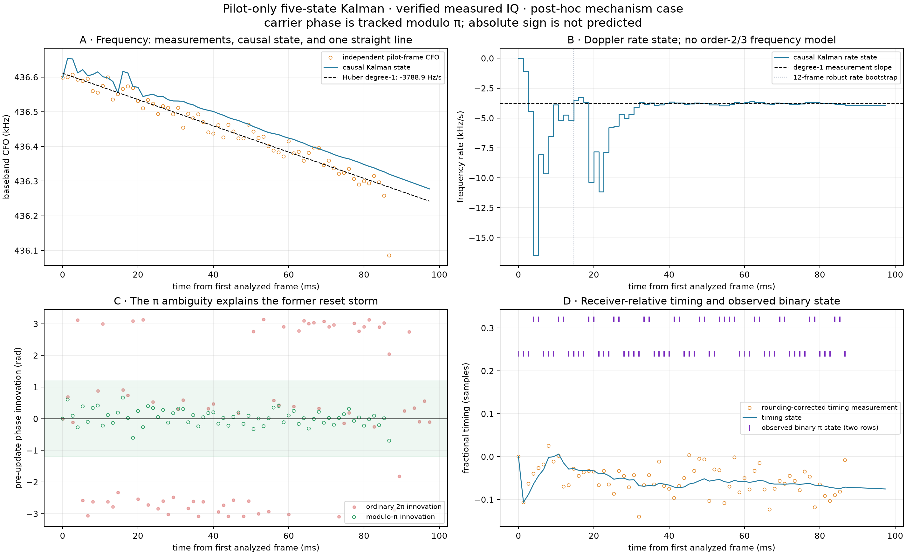
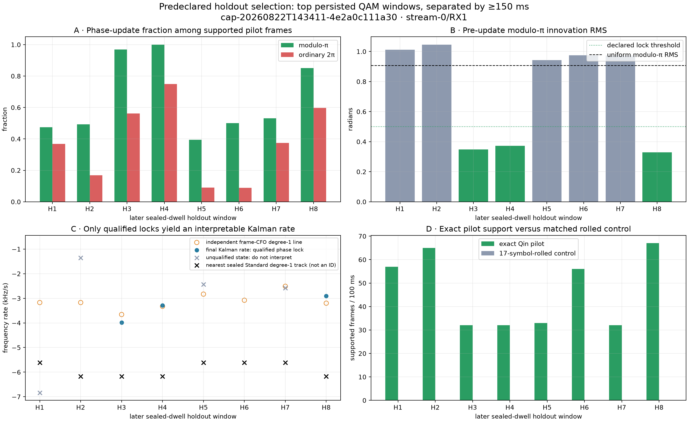

# Pilot-signal PNT Kalman investigation

## Outcome

A PNT-style five-state Kalman filter now runs directly on known Qin edge-pilot
measurements from digest-verified IQ already on disk. It uses **carrier phase
modulo pi**, carrier frequency, constant carrier-frequency rate,
receiver-relative fractional-frame timing and timing rate. It does not use an
order-2 or order-3 radio-frequency model.

The mechanism works, but not every detected pilot interval is phase trackable:

- the frozen mechanism interval qualifies with 66/66 supported phase updates,
  0.256 rad modulo-pi innovation RMS and a final rate of -3,957 +/- 81 Hz/s;
- 3 of 8 independently selected windows in a later sealed dwell qualify as
  modulo-pi phase locks;
- all nine real windows contain supported exact-pilot frames, while the matched
  17-symbol-rolled pilot control supports **0 frames in every window**;
- the three qualified later locks finish within 43--324 Hz/s of a robust
  degree-one line through their independent per-frame frequency measurements;
- those local pilot rates do not agree with the nearest long Standard tracks.
  That gap is evidence that the two products are not yet proven to represent the
  same continuous carrier, not evidence that one should be forced onto the
  other.

This is a useful Research observable. It is not yet a navigation solution, a
satellite association, an absolute carrier-phase solution or a replacement for
the Standard pipeline.



## Why this investigation was needed

The earlier reports established four facts that initially looked
contradictory:

1. Independent GLRT and Qin-pilot measurements repeatedly detect real,
   linearly drifting signals.
2. The Standard five-state Kalman frequently reports gated resets.
3. Inside selected intervals, actual 750 Hz frames contain strong local pilot
   coherence.
4. The measured channel phase often occupies two families separated by pi.

The fourth fact changes the measurement model. A tracker that wraps phase over
2 pi interprets a valid binary-family transition as an approximately pi-radian
error. It resets even though the underlying modulo-pi carrier evolution remains
predictable. The question for this report is therefore narrower and testable:

> Can the PNT paper's carrier/Doppler/timing state be adapted to the pilot
> observable we actually possess, without pretending that its binary sign or
> transmit-time code is known?

## Corpus integrity and baseline reruns

No new radio collection was performed. Every IQ read used `RecordingStore` with
digest verification enabled.

| Role | Recording and path | Integrity / selection |
|---|---|---|
| Mechanism case P0 | `cap-20260821T140820-470384cc9284`, run `capture-438ad263e01048ef82f660975ec55a08`, `stream-0/RX0`, upper edge | Recording manifest `sha256:d45409ea...adb75`; frozen, previously reported post-hoc 34.725 s candidate; 100 ms |
| Later holdouts H1--H8 | `cap-20260822T143411-4e2a0c111a30`, run `reprocess-a3fc4c77b1234b58ab5f7292b23db161`, `stream-0/RX1`, lower edge | Recording manifest `sha256:fffd89c8...325ab`; top persisted QAM candidates with GLRT margin >=0.05, greedily separated by >=150 ms; no phase statistic used for selection |

Two current baselines were rerun before the new tracker was evaluated:

- The sealed Standard five-state Kalman replay processed 10,944 frames and
  reproduced product content digest
  `sha256:8bf7e7a962255af43f12a64a119b4aa39f023a994608771f2582a8c6bc35cfa4`.
- The edge-pilot phase-slope tool reproduced 16 windows, 240 sparse frames and
  1,875 dense frames. Its frozen interval again had 60/60 quality frames,
  17.7995 Hz independent-frequency residual RMS and 0.1513 rad modulo-pi batch
  residual RMS. Differences from the checked-in JSON were floating-point
  roundoff only.

The formerly attractive dwell `cap-20260822T143020-c4482829e26c` was not used.
Its local `iq-000007.ci16.zst` does not match the sealed manifest. Older reports
that depend on that shard remain hypothesis-generating history; verification
was not bypassed.

## Review of every report on main

The review covered all 41 Markdown report assets present on `origin/main` at
`eb9dfb4`. The following inventory records how each group affected this work.

| Group | Reports reviewed | Disposition here |
|---|---:|---|
| Acquisition, aliasing and linear tracking | 17 | Establish independent probe acquisition, basin/alias failure modes and the strict degree-one requirement. Candidate presence is reusable; mixed-order membership is not. |
| Phase and PNT investigations | 7 | Establish local pilot coherence, the pi-separated phase families and the mismatch between Standard's projected-frame measurement and a true code-phase observable. These directly motivate the new model. |
| TLE / orbital matching | 2 | Establish that scalar rate proximity is not identification. TLE matching is deliberately downstream of this signal-level test. |
| LNB / receiver calibration | 1 | Establish that RF-chain effects remain possible and reconstructed RF/LO assumptions do not create carrier continuity. |
| Replay, loss and recovery incidents | 4 | Establish provenance and failure modes; no failed or unverifiable replay artifact was treated as truth. |
| Operations, scanner, UI and deployment | 6 | Reviewed for corpus lineage and pipeline boundaries; they do not provide phase measurements. |
| Figure README and three rendered scanner samples | 4 | Presentation/reference assets only; no quantitative claim was imported. |

The 17 acquisition/tracking reports were
`2026_08_20_line_finder`, `2026_08_20_recent_cfo_alias_history`,
`2026_08_21_470384_alias_offsets`, `2026_08_21_dense_independent_glrt`,
`2026_08_21_edge_pilot_if_dc_centering`,
`2026_08_21_five_dwell_degree1_only_rerun`,
`2026_08_21_paired_hough_gallery`, `2026_08_21_seeded_alias_em_d6a`,
`2026_08_21_t1_dense_degree1_only`,
`2026_08_22_4e2a0c111a30_alias_aware_trajectory_accounting`,
`2026_08_22_residual_hough_segmentation`,
`2026_08_22_t1_glrt_hardware_aligned_parameter_study`,
`2026_08_22_t1_glrt_search_parameter_study`,
`2026_08_22_t2_coarse_acquisition_batch_prototype`,
`2026_08_22_t3_glrt_hardware_execution_alignment`,
`2026_08_26_20ms_window_comparison` and
`2026_08_26_cfo_alias_canonicalization`.

The seven phase/PNT reports were `2026_08_22_carrier_continuity_case`,
`2026_08_22_edge_pilot_phase_slope`,
`2026_08_22_frame_local_phase_qualification`,
`2026_08_22_kalman_phase_tracking_comparison`,
`2026_08_22_pnt_kalman_comparison`,
`2026_08_22_pnt_phase_doppler_comparison` and
`2026_08_22_within_segment_frame_phase`. The TLE reports were
`2026_08_21_five_dwell_tle_cone` and `2026_08_21_tle_doppler_alignment`.
`2026_08_22_dual_lnb_drift_reference` supplied the calibration context.

The four incident reports were `2026_08_21_405bcced8e67_track_loss`,
`2026_08_21_e2ac389247f3_track_loss`, `2026_08_21_e7935fe8_recovery` and
`2026_08_21_e975ebaac089_replay_investigation`. The six operations reports were
`2026_08_21_capture_pause_start_ui`,
`2026_08_21_dead_code_and_obsolete_infrastructure_audit`,
`2026_08_21_durable_acquisition_queue`,
`2026_08_21_fast_test_and_deploy_plan`,
`2026_08_21_http_matplotlib_png_rendering` and
`2026_08_21_scanner_burst_duty_cycle`. The remaining four Markdown assets are
the TLE figure README and the three `scanner-rendered-samples` reports.

## PNT paper state versus the pilot observable

| State / input | PNT paper | This implementation | Consequence |
|---|---|---|---|
| Carrier phase | Unambiguous tracked carrier phase after beacon correlation | Relative carrier phase modulo pi | A binary sign is observed but not predicted; absolute phase is unresolved |
| Doppler shift | Carrier angular frequency | Within-actual-frame Qin pilot phase slope | One independent frequency measurement per supported 750 Hz frame |
| Doppler rate | Carrier angular-frequency rate | Kalman rate state with constant-rate transition | Frequency is linear in time; no quadratic/cubic frequency fit |
| Code phase | Beacon timing observable tied to transmitted structure | Fractional receiver-frame timing from the phase ramp across eight edge tones | Useful timing diagnostic, but not transmit time or pseudorange |
| Code rate | Rate of code phase | Rate of receiver-relative fractional timing | Cannot yet enter a positioning solution |
| Coarse acquisition | Paper receiver acquisition | Existing independent GLRT epoch, edge and CFO | The new tracker refines an already detected candidate; it does not replace GLRT |

The state is

`x = [phi, omega, omega_rate, tau, tau_rate]`.

For elapsed time `dt`, frequency evolves as
`omega_next = omega + omega_rate * dt`; timing evolves as
`tau_next = tau + tau_rate * dt`. Carrier phase contains the exact
`0.5 * omega_rate * dt^2` integral. That phase integration does **not** make
frequency curved: Doppler shift remains a straight line and Doppler rate is
constant between process-noise updates.

## What one Kalman step does

For every complete actual frame in a bounded 100 ms window:

1. Use the independently acquired frame epoch, edge and initial CFO to extract
   the 300 known Qin pilot symbols on eight edge tones.
2. Compare the exact pilot with a 17-symbol-rolled control. A frame is supported
   only when exact coherence and exact-minus-control margin pass their gates.
3. Fit one phase slope **inside that frame** to obtain a residual-frequency
   measurement. This discriminator is held at the initial CFO; the Kalman state
   is not fed back into the measurement and therefore cannot create a
   self-confirming track.
4. Compare the eight-tone channel vector with the causal reference. Search a
   +/-0.75-sample delay grid, remove the deterministic 750 Hz frame-lattice
   rounding sequence, and obtain receiver-relative fractional timing.
5. Wrap the carrier innovation over pi. Record separately which of the two
   pi-separated phase families was observed.
6. Apply gated carrier-frequency, modulo-pi phase and timing updates. Missing
   measurements coast; a long frequency coast reacquires the bounded anchor.
7. After the first 12 supported frames (about 16 ms), robustly initialize the
   rate with the median of all pairwise frequency slopes. Subsequent updates are
   ordinary causal Kalman updates. The rate is bounded to +/-15 kHz/s so weak
   windows cannot report an unphysical runaway as a valid estimate.

The declared phase-lock qualification requires at least 20 supported frames,
at least 80% phase updates and no more than 0.50 rad pre-update modulo-pi
innovation RMS. A uniform modulo-pi error has RMS `pi/sqrt(12) = 0.907` rad.
This qualification is an engineering evidence gate, not a navigation-integrity
bound.

## Mechanism-case result

P0 contains 74 complete actual frames; 66 pass the exact-pilot gate. The new
filter applies 66/66 phase updates and sees 24 transitions between the measured
binary phase families. Its modulo-pi innovation RMS is 0.256 rad. The ordinary
2-pi tracker applies only 19 phase updates, records 23 resets and has 2.432 rad
innovation RMS.

The robust straight line through the independent frame-frequency measurements
is -3,788.9 Hz/s. The causal Kalman finishes at -3,957.0 +/-81.2 Hz/s, 168.2 Hz/s
away. The transient before the vertical bootstrap marker in panel B is visible
and is not hidden. Panel D's timing is receiver-relative; the purple rows are
the observed binary sign, not a decoded navigation bit.

## Later sealed-dwell holdouts



| Case, time | Exact supported / 74 | Phase updates | Modulo-pi RMS | Lock? | Frame-CFO line (Hz/s) | Final Kalman (Hz/s) | Nearest Standard degree-one track (Hz/s) | Rolled support |
|---|---:|---:|---:|:---:|---:|---:|---:|---:|
| H1, 2.125 s | 57 | 27 | 1.012 | no | -3,173 | unqualified | -5,611 | 0 |
| H2, 1.800 s | 65 | 32 | 1.046 | no | -3,172 | unqualified | -6,177 | 0 |
| H3, 1.425 s | 32 | 31 | 0.349 | **yes** | -3,659 | -3,983 +/-137 | -6,177 | 0 |
| H4, 0.900 s | 32 | 32 | 0.372 | **yes** | -3,327 | -3,283 +/-137 | -6,177 | 0 |
| H5, 3.625 s | 33 | 13 | 0.943 | no | -2,830 | unqualified | -5,611 | 0 |
| H6, 3.175 s | 56 | 28 | 0.975 | no | -3,079 | unqualified | -5,611 | 0 |
| H7, 4.675 s | 32 | 17 | 0.973 | no | -2,511 | unqualified | -5,611 | 0 |
| H8, 0.750 s | 67 | 57 | 0.329 | **yes** | -3,198 | -2,906 +/-83 | -6,177 | 0 |

The gray Kalman markers in panel C are deliberately labeled unqualified. Their
numeric internal state exists for diagnostics but is not a Doppler-rate result.
This prevents the gate itself from turning a weak interval into a scientific
claim.

## What the controls establish

The wrong-pilot control is matched in window, epoch, edge, CFO search and
implementation. It changes only the expected Qin pilot sequence by a
17-symbol roll. Its zero support in all nine cases makes ordinary broadband
energy, a static FFT feature and estimator bookkeeping poor explanations for
the exact-pilot detections.

The holdout selection was completed from persisted QAM accuracy and GLRT margin
before phase continuity was evaluated. It is therefore a useful out-of-case
check on P0's post-hoc mechanism. It is not an independent population estimate:
all eight windows come from one later dwell, and multiple windows may observe
the same underlying emission.

The uniform modulo-pi RMS reference in panel B distinguishes concentration from
mere gating. Five holdouts lie near or above that null expectation and fail the
lock gate; H3, H4 and H8 are well below it.

## Comparison with the existing pipeline

| Stage | Input cadence | Measurement/model | What it can claim |
|---|---|---|---|
| Independent GLRT | One 20 ms probe | Searches frame epoch and CFO; exact versus wrong-pilot score | A bounded known-pilot candidate |
| Degree-one track association | Candidates across a dwell | Robust straight frequency line / constant rate | Candidate continuity in CFO-time, not phase continuity |
| Standard Kalman V1 | Frames assigned by a final track | Five states, ordinary 2-pi phase; frame phase largely projected from the shared acquired epoch | Historical candidate diagnostic; many pi-family changes appear as resets |
| Earlier pilot phase tracker | Actual frames inside a bounded window | Three carrier states and ordinary 2-pi phase | Better frequency measurement, but no timing state and wrong phase topology |
| This Research tracker | Every complete actual frame in 100 ms | Five states, modulo-pi phase, explicit binary sign, eight-tone fractional timing | Conditional local phase/Doppler/timing lock; no absolute phase, code or range |

The local pilot-frequency slopes (-2.5 to -3.7 kHz/s in the later holdouts) are
not the nearest Standard track slopes (-5.6 to -6.2 kHz/s). The Standard row is
chosen only by nearest CFO at that time; it is not an identity mapping. Plausible
causes include multiple simultaneous pilot candidates, short carrier bursts,
alias-family association, or a remaining bias in the short-window phase-slope
observable. The present evidence does not select among them.

The safe next experiment is to run this observable on consecutive 100 ms chunks
inside one degree-one GLRT segment, reacquiring each chunk independently, and
require agreement of phase-qualified local rates before attempting a bridge.
Only after that should a satellite/TLE rate enter as an external association
hypothesis.

## Limitations

- P0 is explicitly post-hoc; H1--H8 are selection-independent for phase but
  share one dwell.
- The binary pi state is observed per frame but not predicted. Absolute carrier
  phase continuity is therefore not established.
- Fractional timing is referenced to receiver sample/frame geometry. It is not
  Starlink code phase, transmit time, pseudorange or range rate.
- The 100 ms bounded discriminator assumes residual frequency stays inside
  +/-2 kHz of its independent CFO anchor. A longer loop must reacquire or chunk.
- A reported covariance is conditional on this model and tuning; it is not a
  calibrated navigation-integrity interval.
- No satellite is identified, and no position is computed.

## Reproduction and artifacts

The implementation is in
`src/leo/analysis/qam/pilot_pnt_kalman.py`; the read-only report driver is
`tools/report_pilot_pnt_kalman.py`. The machine-readable result is
[`pilot-pnt-kalman-results.json`](figures/2026_08_22_pilot_pnt_kalman/pilot-pnt-kalman-results.json).

```bash
uv run python tools/report_pilot_pnt_kalman.py
uv run pytest -q tests/dsp/test_pilot_pnt_kalman.py \
  tests/dsp/test_pilot_phase_doppler_tracking.py \
  tests/analysis/test_kalman_tracking.py \
  tests/analysis/test_pilot_pnt_kalman_report_tool.py
```

The report tool writes only under
`reports/figures/2026_08_22_pilot_pnt_kalman`. Recording and sealed analysis
stores are opened read-only, and every consumed IQ shard is verified.
