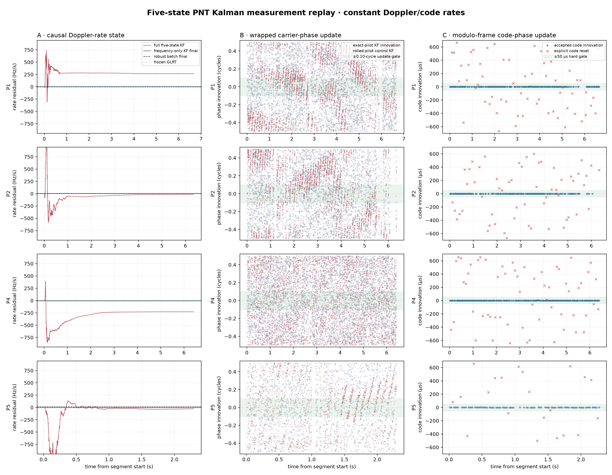
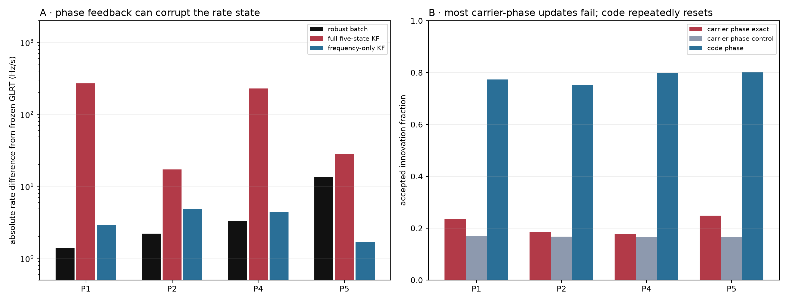
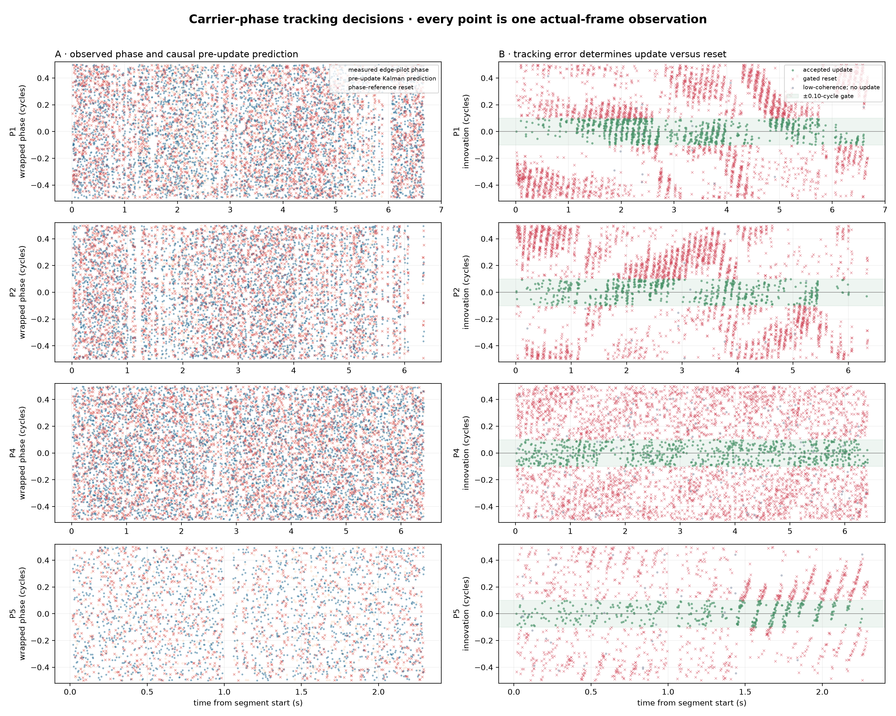
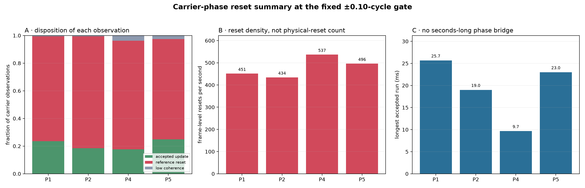
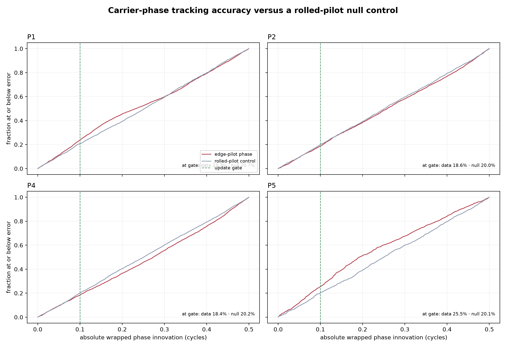
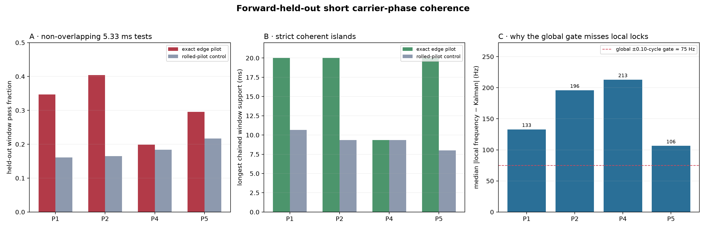
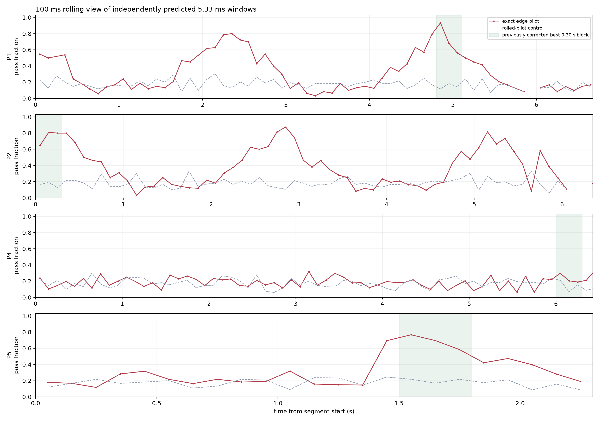
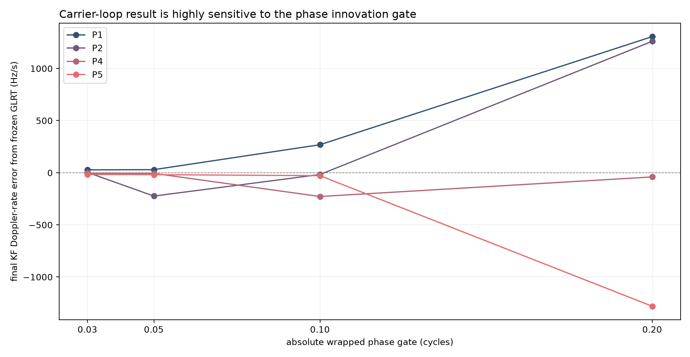

# Five-state PNT Kalman replay on the recorded Starlink dwell

## Answer

Yes: the paper's five-state carrier/code model is now implemented and replayed over P1/P2/P4/P5. The result is highly informative, but it does **not** support enabling carrier-phase feedback in the pipeline yet.

With phase updates enabled, the causal filter's final Doppler-rate error reaches hundreds of Hz/s in P1 and P4 and depends strongly on the phase gate. With the identical transition, frequency observations, and initialization—but carrier phase prevented from updating Doppler—the final rates remain within about 5 Hz/s of the frozen GLRT lines. Code phase is locally precise when accepted, but roughly one fifth to one quarter of independently acquired container epochs require explicit code-reference resets.



## The implemented state and transition

The state uses cycles rather than radians, but is otherwise the unit-scaled paper model:

`x = [carrier phase φ, Doppler f_D, Doppler rate f_dot_D, code phase τ, code rate τ_dot]`

For elapsed time `dt`:

```text
φ'       = φ + f_D·dt + 0.5·f_dot_D·dt²
f_D'     = f_D + f_dot_D·dt
f_dot_D' = f_dot_D
τ'       = τ + τ_dot·dt
τ_dot'   = τ_dot
```

There is no Doppler-rate or code-rate process noise in this experiment. They are constant physical states. The quadratic term is carrier phase—the exact integral of a linear frequency—not a quadratic Doppler fit. The PNT paper manually tunes process and measurement noise; this first implementation intentionally freezes both rate states so that it tests measurement compatibility without relaxing our constant-Doppler-rate constraint.

## Measurements and robust reset policy

- Carrier phase and Doppler come from the previously persisted actual-frame Qin edge-pilot prompt observations.
- Code phase comes from each dense GLRT candidate's global frame epoch modulo the 1/750-second Starlink frame period.
- Carrier innovations are wrapped into ±0.5 cycle and gated at ±0.10 cycle.
- Code innovations are wrapped into ±0.667 ms and have a ±50 µs hard gate.
- Doppler innovations have coherence-aware noise and a ±975 Hz hard gate.
- A rejected carrier/code observation explicitly resets only that reference. A carrier reset cannot directly alter Doppler/rate; a code reset cannot alter the carrier block.
- Exact and rolled-pilot control filters receive identical Doppler and code observations. Only their carrier-phase measurement differs.

This is an **offline Kalman measurement replay**. It does not yet drive the next raw-IQ carrier and code wipe-off. Frame epoch and the initial Doppler-rate state still come from dense GLRT, making the comparison controlled and exposing whether feedback would help or hurt.

## Doppler-rate comparison



| Segment | Frozen GLRT | Robust batch PNT | Full five-state KF | Frequency-only KF | Full / frequency-only error | Doppler updates accepted |
|---|---:|---:|---:|---:|---:|---:|
| P1 | -6188.3 | -6189.7 | -5919.6 | -6185.4 | +268.7 / +2.9 Hz/s | 60.9% |
| P2 | -6113.6 | -6111.4 | -6130.8 | -6108.8 | -17.2 / +4.8 Hz/s | 96.6% |
| P4 | -6055.8 | -6059.2 | -6283.9 | -6060.2 | -228.1 / -4.4 Hz/s | 52.3% |
| P5 | -6291.4 | -6278.0 | -6319.6 | -6293.0 | -28.3 / -1.7 Hz/s | 88.0% |

The frequency-only result is the clean ablation. It is not a different detector: it uses the same five-state transition and the same per-frame Doppler measurements, but phase observations are diagnostic only. Its stability shows that the Doppler discriminator and constant-rate state are compatible. The degradation in the full filter is introduced specifically when the presently discontinuous carrier phase is allowed to update the correlated Doppler/rate covariance.

## Carrier and code continuity

| Segment | Carrier exact/control accepted | Carrier resets | Longest accepted carrier run | Corrected exact-vs-control p | Code accepted / resets | Longest accepted code run | Final code rate |
|---|---:|---:|---:|---:|---:|---:|---:|
| P1 | 23.6% / 17.1% | 3011 | 25.7 ms | 2.281e-12 | 77.3% / 61 | 0.181 s | +8.15 ppm |
| P2 | 18.6% / 16.7% | 2757 | 19.0 ms | 0.1739 | 75.2% / 57 | 0.101 s | -2.11 ppm |
| P4 | 17.7% / 16.6% | 3450 | 9.7 ms | 0.7736 | 79.8% / 60 | 0.201 s | +4.19 ppm |
| P5 | 24.9% / 16.7% | 1141 | 23.0 ms | 2.336e-08 | 80.2% / 21 | 0.201 s | +5.64 ppm |

Carrier exact-pilot acceptance can exceed the rolled control, especially in P1/P5, so real local phase structure exists. But the accepted subset is not a safe orbital carrier innovation: allowing it into the filter materially worsens the Doppler-rate estimate. This reconciles the earlier report with the new result—repeatable phase increments can be real without representing one continuously integrable carrier.

Accepted code innovations have sub-microsecond median residuals, but the repeated resets are disqualifying for a continuous code bridge. They are consistent with GLRT epoch switching among timing basins/sources or genuine Starlink frame/code changes. Because these are reacquired GLRT epochs rather than a prompt early-minus-late code discriminator, they are evidence for the next timing tracker, not yet a pseudorange observable.

## Carrier-phase reset diagnostic



The left column plots the measured wrapped edge-pilot phase against the causal pre-update Kalman prediction. The right column plots their wrapped difference, which is the actual tracking error used by the gate. Green points update the phase state; red crosses exceed ±0.10 cycle and realign the phase reference; gray points have insufficient coherence and do neither.

| Segment | Observations | Accepted updates | Reference resets | Resets/s | Low-coherence ignored | Longest accepted run |
|---|---:|---:|---:|---:|---:|---:|
| P1 | 3969 | 936 (23.6%) | 3011 (75.9%) | 451.1 | 22 (0.6%) | 25.7 ms |
| P2 | 3407 | 632 (18.6%) | 2757 (80.9%) | 434.2 | 18 (0.5%) | 19.0 ms |
| P4 | 4394 | 778 (17.7%) | 3450 (78.5%) | 537.0 | 166 (3.8%) | 9.7 ms |
| P5 | 1572 | 391 (24.9%) | 1141 (72.6%) | 496.1 | 40 (2.5%) | 23.0 ms |



These are **frame-level phase-reference realignments, not confirmed physical transmitter resets**. A sustained reference mismatch produces a reset on nearly every sufficiently coherent observation, so the 10,359 total is a density of failed phase predictions. The physically meaningful continuity statistic is the longest accepted run: only 9.7–25.7 ms, far below the seconds-long bridge required for carrier-phase navigation.



The innovation CDF compares the real edge-pilot phase with the rolled-pilot null using only observations above the coherence threshold. The vertical line is the fixed update gate. P1 and P5 contain more near-zero error than the null, confirming some real local phase information; P2 and P4 are close to the null. None yields a stable continuous phase bridge.

## Are approximately 5 ms coherent regions being missed?

**Yes.** The global Kalman gate misses locally coherent carrier-phase islands in P1, P2, and late P5 because their locally inferred frequency/intercept differs from the single global Kalman hypothesis. P4 remains null-like.

Each test uses four consecutive 1/750-second frames, or 5.33 ms of RF support. The fixed frozen degree-one GLRT Doppler rate is removed, then only phase intercept and local frequency are fitted on the first three frames. The fourth phase is held out. A window passes when training concentration is at least 0.80 and held-out error is at most 0.10 cycle. The rolled-pilot control receives the identical frequency search and held-out test.



| Segment | All sliding exact/control | Non-overlapping exact/control | Paired p / four-segment p | Longest exact/control island | Exact/control islands ≥12 ms | Median local-frequency offset |
|---|---:|---:|---:|---:|---:|---:|
| P1 | 34.0% / 17.7% | 34.7% / 16.1% | 1.24e-17 / 4.97e-17 | 20.0 / 10.7 ms | 43 / 0 | 132.9 Hz |
| P2 | 40.4% / 17.9% | 40.4% / 16.5% | 7.13e-21 / 2.85e-20 | 20.0 / 9.3 ms | 38 / 0 | 195.9 Hz |
| P4 | 18.5% / 17.5% | 19.9% / 18.4% | 0.459 / 1 | 9.3 / 9.3 ms | 0 / 0 | 212.9 Hz |
| P5 | 32.1% / 17.5% | 29.6% / 21.7% | 0.0328 / 0.131 | 20.0 / 8.0 ms | 11 / 0 | 106.4 Hz |

P1 and P2 remain decisive when only non-overlapping windows are counted. Whole-segment P5 is weaker (raw paired p≈0.033; four-segment p≈0.13) because its coherent behavior is concentrated late rather than spread through the segment. P4 is indistinguishable from control. Overlapping windows are used only to localize and measure strict islands, not for the paired significance calculation.



The green bands are the independently established, look-elsewhere-corrected 0.30-second regions from the preceding within-segment report. Reapplying the forward-held-out 5.33 ms test inside them gives:

| Segment | Region from segment start | Exact/control short-window pass | Prior four-segment-corrected block p |
|---|---:|---:|---:|
| P1 | 4.800–5.100 s | 75.6% / 14.6% | 0.01329 |
| P2 | 0.000–0.300 s | 75.0% / 16.0% | 0.01329 |
| P4 | 6.000–6.300 s | 23.9% / 15.5% | 0.4385 |
| P5 | 1.500–1.800 s | 67.8% / 20.3% | 0.01329 |

P5's 1.500–1.800 s interval is the diagonal structure visible in the reset plot: 67.8% of exact-pilot short windows predict their held-out phase versus 20.3% of control. P1 and P2 reach about 75% versus 15–16% in their strongest regions. The strict island audit finds 43 P1, 38 P2, and 11 P5 exact-pilot islands of at least 12 ms, while their controls produce zero; several exact islands span the full 20 ms acquisition container.

This changes the interpretation of a red cross. It can mean either genuine phase incoherence or a coherent local carrier outside the global phase/frequency hypothesis. As the table and panel C show, the median absolute local-frequency offset of successful P1/P2/P5 windows is about 106–196 Hz, while the current ±0.10-cycle one-frame gate permits only about 75 Hz. Resetting phase alone leaves that local frequency mismatch in place, so the next coherent point can immediately fail again and form a diagonal red ramp.

The result establishes short local phase predictability, not satellite identity or cross-container carrier-phase continuity. A Research tracker should seed a local phase/frequency hypothesis from four frames, validate it forward, and retain it within the 20 ms container. Cross-container bridging remains a separate and stricter test.

## Phase-gate sensitivity



A valid carrier loop should not change its inferred orbital Doppler rate by roughly 1 kHz/s because the phase gate moved from 0.10 to 0.20 cycle. This sensitivity is direct evidence of phase-reference mixture/cycle ambiguity. Selecting a narrow gate that happens to agree with GLRT would be post-hoc tuning, not validation.

## Comparison with what we had before

| Method | State propagation | Carrier phase feeds Doppler? | Code state? | Result on this dwell |
|---|---|---|---|---|
| Dense GLRT + robust line | Independent 20 ms acquisitions followed by a batch degree-one line | No | No | Most precise and stable Doppler-rate baseline |
| Previous PNT-style batch audit | Per-frame discriminator; robust degree-one frequency fit; integrate Doppler and audit phase | No | No | Rates agree within ~13 Hz/s; no seconds-long carrier phase |
| Frequency-only Kalman ablation | Causal five-state transition; Doppler updates only in carrier block | No | Present but disabled | Rates agree within ~5 Hz/s |
| Full five-state Kalman replay | Causal carrier/code propagation and wrapped innovations | Yes | Yes | Phase feedback destabilizes P1/P4; code repeatedly resets |

## Recommendation

1. Keep GLRT plus robust degree-one Doppler as the production observable.
2. Add the five-state replay only to Research artifacts, initially with phase feedback disabled and all innovations persisted.
3. Build the missing multi-hypothesis timing tracker: select the next dense basin using predicted frame epoch **and** Doppler before measuring carrier phase.
4. Cluster phase references (the paper reports user-dependent π/4 and π/2 offsets) and require a stable cluster identity before enabling phase updates.
5. Replace reacquired GLRT epoch measurements with a genuine prompt early/late code discriminator before interpreting code rate or pseudorange.
6. Enable full phase feedback only after held-out dwells show that it improves—not merely matches—the Doppler-only Kalman control without gate-sensitive bias.

## Reproducibility

- Five-state implementation: `src/leo/analysis/starlink/pnt_kalman.py`.
- Generator: `tools/report_pnt_kalman_comparison.py`.
- Metrics: `figures/2026_08_22_pnt_kalman_comparison/pnt-kalman-metrics.json`.
- Histories: `pnt-kalman-histories.json.gz`.
- Inputs are the same frozen P1/P2/P4/P5 candidates and actual-frame observations as the two preceding phase reports.
