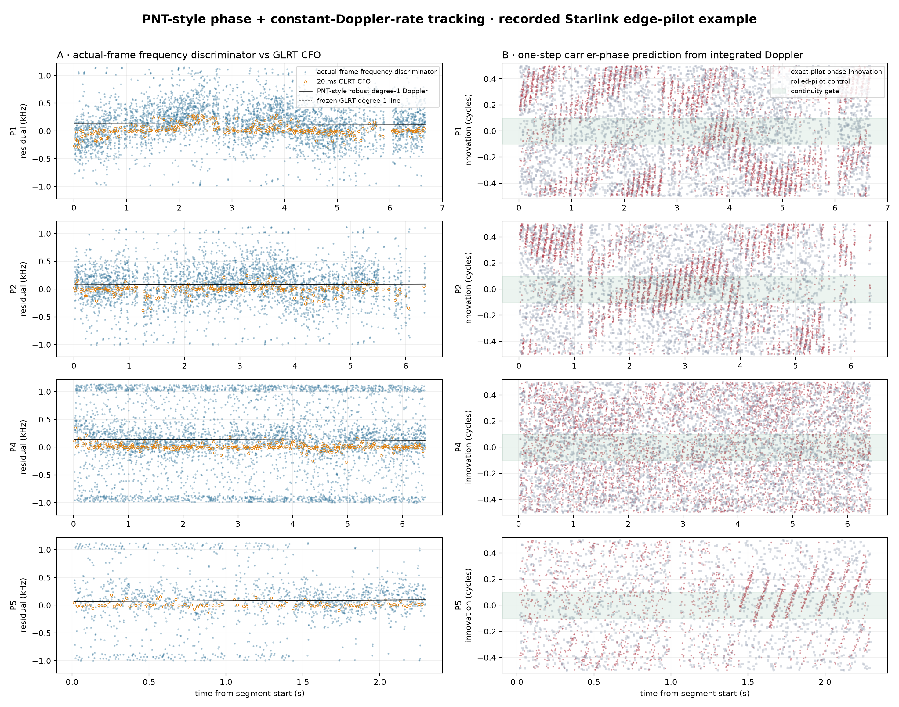
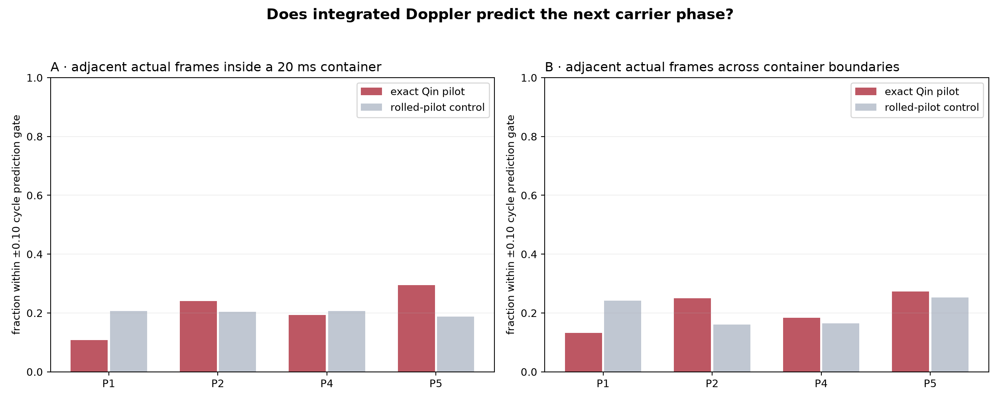

# PNT-style carrier phase + Doppler tracking versus the GLRT pipeline

## Bottom line

This research implementation successfully produces one prompt carrier-phase and local frequency observation per actual ~1.33 ms Starlink frame, then fits **only one linear Doppler trajectory (constant Doppler rate)**. It does not assume phase continuity: integrated Doppler must predict each next phase within ±0.10 cycle, or the transition is labeled as an explicit phase-reference reset.

The comparison therefore separates two questions that the current GLRT pipeline combines poorly: (1) can the known pilot provide a stable frequency discriminator, and (2) is its carrier phase continuous enough to integrate? The first can remain useful even when the second fails.

## What the papers actually motivate

Kozhaya, Saroufim, and Kassas acquire a Starlink beacon in delay/Doppler, then track beat carrier phase, Doppler, Doppler rate, code phase, and code rate in a Kalman loop. Their prompt/early/late correlators provide phase, frequency, and timing innovations. Crucially, their paper also reports OFDM user clusters with distinct power and phase references and π/4 or π/2 carrier-phase jumps. Qin et al. independently caution that coherent processing beyond one full frame is complicated by inter-frame carrier-phase discontinuities.

Our experiment is deliberately narrower: the local replica is the published Qin lower edge pilot (symbols 2–65) in a 2.5 MHz recording, not Kassas's blindly estimated full-OFDM beacon. We implement the same carrier-state logic but omit code tracking and positioning. That makes this a **PNT-style edge-pilot tracker**, not a reproduction of the paper's receiver.

## Step by step: input, estimator, and output

1. Start from the same independently scored dense GLRT candidates and the same frozen P1/P2/P4/P5 degree-one associations used by the within-segment report.
2. For every selected 20 ms container, correlate each actual Starlink frame separately against the exact Qin pilot and a symbol-rolled control.
3. Fit one robust degree-one acquisition line to the selected GLRT CFOs. Evaluate that single line at each container start, then run a ±1 kHz, 25 Hz prompt-frequency discriminator independently in every actual frame. The per-probe GLRT winner CFO is **not** used to refresh this NCO. Restore the local NCO phase at the raw sample-clock midpoint so phases from different containers have a common mathematical reference.
4. Robustly fit frequency versus time with MAD-scaled Huber IRLS. The model is `f(t)=f_ref+f_dot(t-t_ref)` and nothing higher order.
5. Integrate that linear frequency between adjacent frames. The phase prediction is quadratic only because it is the integral of constant Doppler rate; no curved frequency model is present.
6. Compare predicted and measured wrapped phase increments. Errors beyond ±0.10 cycle, or gaps beyond 2.25 frame periods, start a new explicit phase episode.

The output is a robust constant-rate Doppler line, per-frame discriminator observations, one-step phase innovations, and explicit continuity episodes/reset events. Phase never silently changes the Doppler curvature.

## Quantitative comparison

| Segment | Frozen GLRT rate | Robust GLRT rate | PNT per-frame rate | PNT−frozen | GLRT / PNT freq MAD | ±1 kHz edge hits | PNT frame updates |
|---|---:|---:|---:|---:|---:|---:|---:|
| P1 | -6188.3 Hz/s | -6191.3 Hz/s | -6189.7 Hz/s | -1.4 Hz/s | 38.8 / 206.9 Hz | 2.6% | 3969 (595/s) |
| P2 | -6113.6 Hz/s | -6110.3 Hz/s | -6111.4 Hz/s | +2.2 Hz/s | 28.0 / 202.3 Hz | 2.5% | 3407 (537/s) |
| P4 | -6055.8 Hz/s | -6058.7 Hz/s | -6059.2 Hz/s | -3.3 Hz/s | 18.4 / 325.2 Hz | 18.8% | 4394 (684/s) |
| P5 | -6291.4 Hz/s | -6288.1 Hz/s | -6278.0 Hz/s | +13.3 Hz/s | 14.2 / 195.2 Hz | 10.0% | 1572 (683/s) |

The per-frame discriminator trades precision per observation for a much higher update rate. Its residual MAD must therefore be read together with the robust line and phase-consistency tests; it is not expected to beat a 20 ms coherent GLRT estimate frame by frame. An edge hit means the local maximum landed in the outermost 25 Hz of the ±1 kHz bank. A high fraction is an explicit loss-of-lock/insufficient-pilot warning, not a trustworthy ±1 kHz measurement.

## Phase continuity result

| Segment | Within-container exact/control pass | Cross-container exact/control pass | Cross pass advantage / corrected p | Exact cross-boundary median error | Explicit episodes / longest |
|---|---:|---:|---:|---:|---:|
| P1 | 10.8% / 20.6% | 13.2% / 24.2% | -11.0 pp / 0.0163 | 0.293 cycles | 3541 / 8.0 ms |
| P2 | 24.0% / 20.4% | 25.0% / 16.1% | +8.9 pp / 0.2398 | 0.212 cycles | 2598 / 29.3 ms |
| P4 | 19.3% / 20.6% | 18.3% / 16.5% | +1.8 pp / 1.0000 | 0.265 cycles | 3554 / 8.0 ms |
| P5 | 29.5% / 18.8% | 27.3% / 25.3% | +2.0 pp / 1.0000 | 0.204 cycles | 1113 / 41.3 ms |

The earlier report showed that some frame-to-frame phase increments repeat locally. This stronger test asks whether those increments equal the physical phase advance predicted by Doppler. A pass rate near the rolled-pilot control means that local correlation is not sufficient for carrier-phase integration. The paired two-sided McNemar p-value compares exact and control decisions on identical transitions; the table applies a four-segment Bonferroni correction.

The episode count is intentionally strict and should not be mistaken for a satellite count. A new episode can be caused by a different transmitting user/beam phase reference, a selected GLRT basin belonging to another source, a missed container, or a real carrier cycle slip.

Across this dwell, the PNT-style frequency lines agree with the frozen GLRT rates to within about 13 Hz/s, but their individual ~1.33 ms estimates are noisier than 20 ms GLRT CFOs. That agreement is a tracking-consistency result, not an independent acquisition result: frame epoch and the initial degree-one NCO still come from GLRT. Carrier phase does **not** remain continuously integrable for seconds. P2 and P5 show the most exact-over-control phase advantage, yet the longest strict episode is only tens of milliseconds.

## Comparison with the two existing analyses

| Analysis | Unit and observable | Uses neighboring data during acquisition? | Frequency model | What it can establish |
|---|---|---|---|---|
| Current dense GLRT | One independent 20 ms container; maximized known-pilot CFO/epoch | No | Candidate inventory, then robust degree-one association | Pilot-like energy and a CFO line; no carrier-phase continuity |
| Within-segment actual-frame report | ~15 independently phase-estimated actual frames inside each selected container | No cross-container use | One constant container CFO; frozen degree-one line only for association/display | Local frame-phase correlation and held-out prediction inside containers |
| This PNT-style tracker | One prompt phase + frequency discriminator per actual frame, with sample-clock phase restoration | GLRT supplies acquisition; tracking comparison occurs afterward | One robust degree-one Doppler line; integrated phase checked separately | Whether frequency tracking survives and exactly where carrier phase can/cannot bridge |

### Exact relationship to the deployed GLRT lanes

| Setting | Production Standard | Production Research | This offline comparison |
|---|---:|---:|---:|
| 20 ms probes per complete second | 40 | 60 | 50 back-to-back |
| Retained/scored timing-CFO basins | 10 | 32 | 32 |
| Coarse CFO step | 80 kHz | 10 kHz | 10 kHz |
| Fine CFO radius / step | 80 kHz / 500 Hz | 10 kHz / 100 Hz | 10 kHz / 100 Hz |
| GLRT transform | 512 | 4096 | 4096 |
| Actual-frame phase/frequency output | none | none | prompt discriminator + reset audit |

Thus the acquisition evidence in this report is Research-like but not a byte-for-byte production Research schedule: it uses back-to-back 20 ms windows created for the frozen segment study. The new estimator itself is reusable and isolated from either production lane.

## What this does not yet claim

- It does not identify a Starlink satellite or improve the TLE association by itself.
- It does not decode payload, user, beam, or satellite identity.
- It does not implement Kassas's blind full-beacon estimator, code loop, or positioning WNLS.
- It does not prove that all CFO-aligned GLRT containers belong to one transmitter.
- It does not use quadratic/cubic Doppler estimates. A quadratic phase expression is only the exact integral of a linear Doppler shift.

## Pipeline recommendation

Keep this tracker in Research. Persist the per-frame frequency/phase innovations and phase-reset audit beside dense GLRT candidates. Do not gate Standard detections on carrier continuity yet: the papers predict legitimate OFDM phase-reference changes, and the edge pilot may be less phase-stable than the paper's full beacon. Promotion should require repeatable cross-container phase acceptance above the rolled-pilot control on multiple dwells, plus source association that also respects frame epoch/timing.

The most valuable next extension is a multi-hypothesis delay/CFO tracker that chooses among dense GLRT basins using both predicted frame epoch and Doppler before phase is examined. That would test whether current CFO-only association is switching sources and would add the code/timing half of the PNT receiver state without changing the constant-rate Doppler constraint.

## Reproducibility

- Generator: `tools/report_pnt_phase_doppler_comparison.py`.
- Reusable estimator: `src/leo/analysis/starlink/phase_doppler.py`.
- Metrics: `figures/2026_08_22_pnt_phase_doppler_comparison/pnt-phase-doppler-metrics.json`.
- Compact observations: `pnt-phase-doppler-observations.jsonl.gz`.
- Recording, dense candidate artifacts, and frozen segments are identical to the within-segment actual-frame report.
