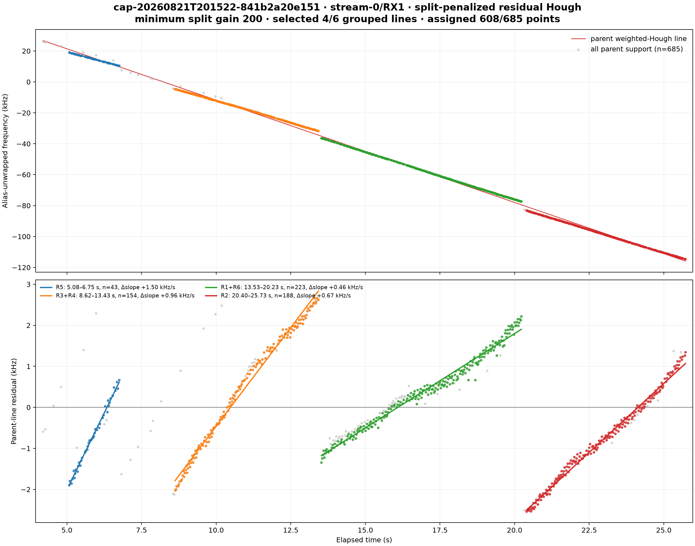
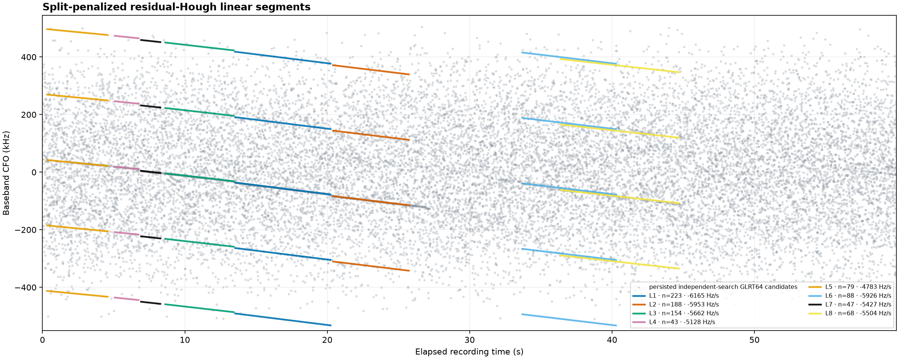
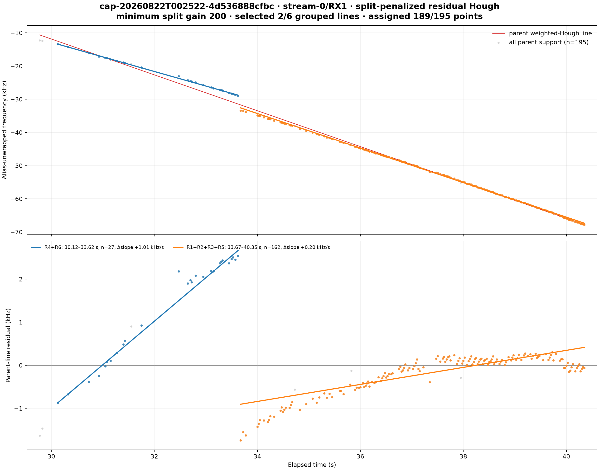
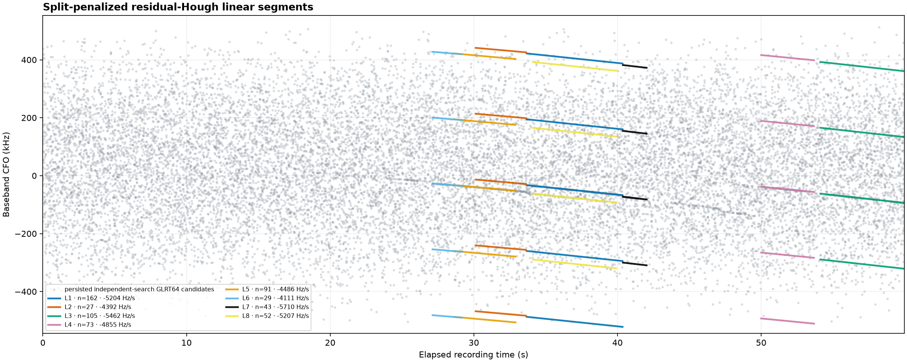

# Split-penalized residual-Hough linear segmentation

## Decision

The production Standard and Research lanes now use weighted alias-aware Hough
parents followed by split-penalized residual-Hough refinement for pre-replay CFO
segmentation. Every newly fitted trajectory is degree one. The existing IQ replay,
de-aliasing, final selection, and reporting stages remain in place.

This is a versioned change, not a reinterpretation of persisted V2 bytes:

- `standard.trajectory-bank`, `standard.trajectory-feedback`, and
  `standard.glrt64-trajectory-table` advance from schema V2 to V3.
- `standard.alternate-cfo-track-bank` and its PNG advance from V1 to V2.
- the Research lane wraps the same Standard implementation in its existing
  definition-bound research envelope;
- the V2 trajectory codecs and the V1 alternate-Hough codec remain available for
  historical products, but the production runner no longer calls the degree-1/2/3
  fitter;
- `standard.cfo-lift-replay` remains V4 and is still downstream of the trajectory
  bank.

The machine-readable evidence for this report is the
[manifest](figures/2026_08_22_residual_hough_segmentation/manifest.json).

## Why this method

The original Hough result can be a good long parent while still hiding changes in
rate. A second Hough transform over the parent's circular residual exposes those
changes without imposing one candidate per time across the entire point cloud.
Different point identities at the same time can support different parents, so the
method can retain overlapping linear components.

The production sequence is:

1. Convert independently searched GLRT64 candidates into weighted CFO points.
2. Extract initial parents with the weighted slope/intercept-mod-alias Hough map.
3. Process parents in detector strength order.
4. Transform each parent's supporting points to circular residual frequency.
5. Run Hough again with a residual support gate equal to half an intercept bin.
6. Enumerate every admissible partition of at most eight residual proposals.
7. Robustly refit each partition block with a Theil-Sen line.
8. Select the partition with the lowest robust MDL plus an explicit split cost.
9. Map each selected residual line back to CFO and publish only degree-one
   trajectories.
10. Replay the selected representatives using the existing IQ replay implementation.

Within a parent, selected lines are ranked by weighted support, span, support count,
residual error, and stable identity. Parent order is preserved before applying the
published-track bound. This matters: a weaker later parent cannot evict a valid
piece of the strongest parent.

## Frozen policy

| Parameter | Value |
|---|---:|
| Initial slope interval | -15,000 to +15,000 Hz/s |
| Initial slope bins | 121 |
| Intercept-mod-alias bins | 512 |
| Initial support gate | 2,500 Hz |
| Residual support gate | 221.946 Hz |
| Maximum gap | 0.75 s |
| Minimum span | 0.75 s |
| Minimum support | 8 |
| Maximum residual proposals per parent | 8 |
| Maximum parent support | 5,000 |
| Maximum input points | 50,000 |
| Minimum split gain, λ | 200 |

The residual gate is derived rather than independently tuned:

`residual_gate = alias_spacing / (2 × intercept_bins)`

with alias spacing `1 / 4.4 µs = 227,272.727 Hz`, giving `221.946 Hz`.

For a partition with `N` assigned observations and `L` fitted lines, the primary
criterion is

`2N log(SAD/N) + (2L + 1) log N + λL`.

The implementation also records the Gaussian cross-check

`N log(SSE/N) + (2L + 1) log N + λL`.

`λ = 200` is an explicit fragmentation prior. It does not know what a satellite is,
what a physically meaningful Doppler rate is, or which TLE is plausible. For the
first capture's 608 assigned points, adding one line must reduce SAD by roughly a
factor of 1.19, or SSE by roughly 1.42, after including the ordinary parameter
penalty. TLE and physical-rate interpretation remain downstream scientific tasks.

The exact partition search is bounded by eight proposals (Bell number 4,140). The
Theil-Sen fit is quadratic in parent support, so parents above the explicit 5,000
point bound are not refined. Initial and refined parent counts are both persisted,
making that condition visible rather than silently approximated.

## Capture results

Both analyses start from the exact persisted `standard.pilot-scan` V3 product for
`stream-0/RX1`. Absolute capture time is irrelevant to segmentation; no TLE or
satellite label is used.

### `cap-20260821T201522-841b2a20e151`

The strongest initial parent spans 4.200–25.725 s, has 685 support points, slope
-6,624.4 Hz/s, and 1,206.4 Hz residual RMS. Six residual proposals produce 20
admissible partitions. The robust and Gaussian criteria both select four lines,
assigning 608/685 parent points.

| Residual proposals | Interval | Support | Mapped slope | Median absolute residual |
|---|---:|---:|---:|---:|
| R5 | 5.075–6.750 s | 43 | -5,127.9 Hz/s | 41.6 Hz |
| R3 + R4 | 8.625–13.425 s | 154 | -5,661.9 Hz/s | 122.3 Hz |
| R1 + R6 | 13.525–20.225 s | 223 | -6,164.6 Hz/s | 80.4 Hz |
| R2 | 20.400–25.725 s | 188 | -5,952.7 Hz/s | 67.6 Hz |

The selected robust MDL is 5,570.53 before the split prior and 6,370.53 after it.
The corresponding Gaussian values are 5,859.27 and 6,659.27.

Across the complete path the pipeline finds nine initial/refined parents and eleven
linear outputs; the bounded product returns eight and records three as truncated.
The first four returned lines are exactly the four pieces above.

The V3 pre-replay bank contains eight degree-one trajectories from 19,200 GLRT64
observations. All eight family representatives were sent through the unchanged
replay, producing 4,704 replay rows. The resulting trajectory-feedback digest is
`sha256:8e659d9476cecccd405337227cdb1c745f9cd05b6768028146432672e065e99d`.
The compact persisted rerun evidence is
[trajectory-replay-v3.json](figures/2026_08_22_residual_hough_segmentation/cap-20260821T201522-841b2a20e151-stream-0-RX1-trajectory-replay-v3.json).

### `cap-20260822T002522-4d536888cfbc`

The strongest initial parent spans 29.775–40.350 s, has 195 support points, slope
-5,402.1 Hz/s, and 734.3 Hz residual RMS. Six residual proposals produce 32
admissible partitions. Both criteria select two lines, assigning 189/195 points.

| Residual proposals | Interval | Support | Mapped slope | Median absolute residual |
|---|---:|---:|---:|---:|
| R4 + R6 | 30.125–33.625 s | 27 | -4,392.0 Hz/s | 76.0 Hz |
| R1 + R2 + R3 + R5 | 33.675–40.350 s | 162 | -5,204.4 Hz/s | 143.0 Hz |

The selected robust MDL is 1,983.89 before the split prior and 2,383.89 after it.
The Gaussian values are 2,083.66 and 2,483.66.

Across the complete path the pipeline finds eleven initial/refined parents and
eleven linear outputs; the product returns eight and records three as truncated.
The first two returned lines are the two strongest-parent pieces above.

The segmentation rerun completed, but the IQ replay correctly failed closed. The
local recording chunk `iq-000007.ci16.zst` does not match the digest sealed in the
capture manifest. Verification was not bypassed, and no V3 replay result is claimed
for this capture. The exact failure is recorded in
[trajectory-replay-v3-error.json](figures/2026_08_22_residual_hough_segmentation/cap-20260822T002522-4d536888cfbc-stream-0-RX1-trajectory-replay-v3-error.json).

## Pipeline and contract consequences

The production path is now:

`pilot scan V3 → residual-Hough trajectory bank V3 → trajectory feedback/table V3 → CFO alias map V2 → de-aliased bank V3 → replay V4 → final bank/table V3`

The standalone alternate-track stage uses the same shared fitter and publishes its
full split provenance and criterion values as `alternate-cfo-residual-hough-v2`.
The Research registry is still a definition-bound wrapper over the same stage graph,
so it receives the same segmentation code with its denser probe schedule. Its
50,000-point input bound covers the 28,800-point maximum of a 60-second, three-offset,
eight-candidate research scan.

Historical V2 trajectory products and V1 Hough products remain strictly decodable.
They are not silently upgraded, and no reviewed golden scientific fixture was
rewritten.

## Verification

- deterministic split selection under point permutation;
- explicit split-gain validation and exact-line zero-residual handling;
- overlapping simultaneous linear-component fixture;
- V1 alternate-Hough and V2 trajectory decode compatibility;
- V2 alternate product strict codec, deterministic PNG, and input bounds;
- Standard registry asserts replay V4 is still present and unchanged;
- Research registry asserts the same residual-Hough stage is wrapped;
- complete in-memory Standard runner asserts only degree-one V3 trajectories feed
  V4 replay;
- focused Python, presentation, topology, and CLI suite: 105 passed;
- broad non-PostgreSQL analysis/application/presentation/topology/CLI suite: 533
  passed, 5 environment-marked tests deselected;
- Ruff and mypy checks passed on the changed production modules.

PostgreSQL integration tests require an explicit `LEO_TEST_DATABASE_URL` and stopped
before connecting when that variable was absent. The two report reruns instead used
the production service identity read-only. The replay process ran at niceness -20.

## Limitations and next checks

- `λ = 200` is a reviewed policy choice supported by these captures, not a universal
  physical constant. It should be evaluated on a larger labeled corpus without
  retuning per capture.
- The current score decides statistical segmentation, not satellite identity. Slope,
  elevation, TLE age, clock/LNB uncertainty, and cross-receiver consistency belong in
  downstream association.
- Residual proposals are exclusive after strength-ordered peeling within a parent.
  Overlap is supported through distinct point identities and distinct initial
  parents, not by assigning one point to several final lines.
- The second capture's raw integrity failure must be repaired from a matching sealed
  copy before its replay result can be evaluated.
