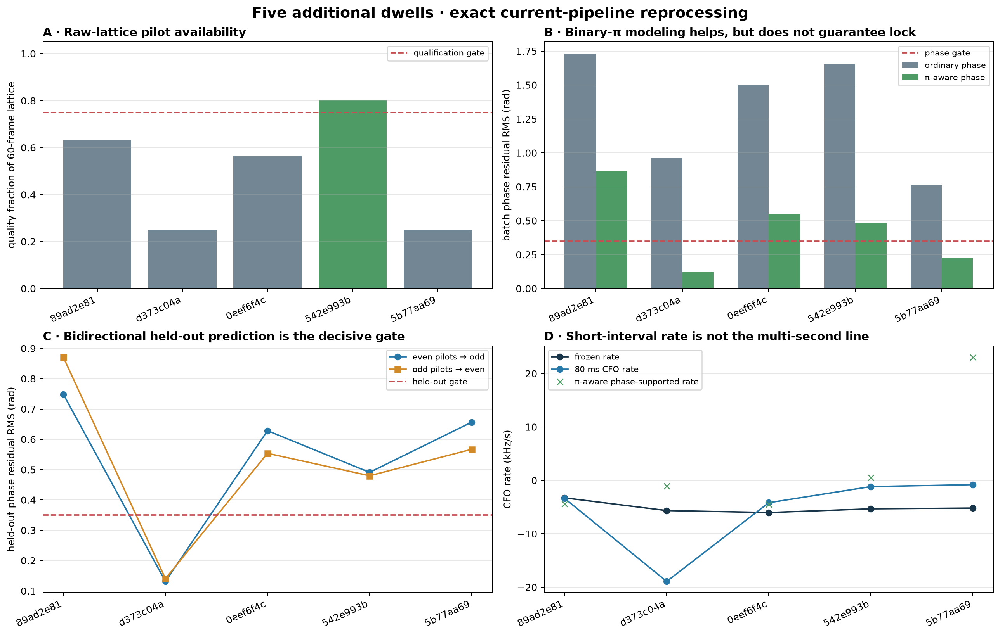
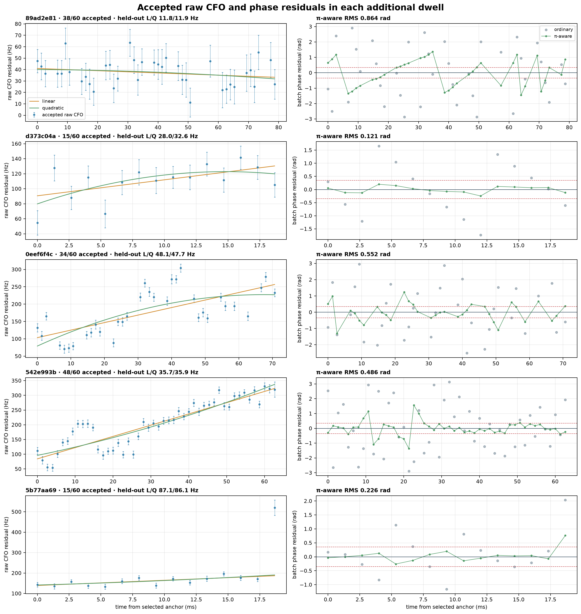
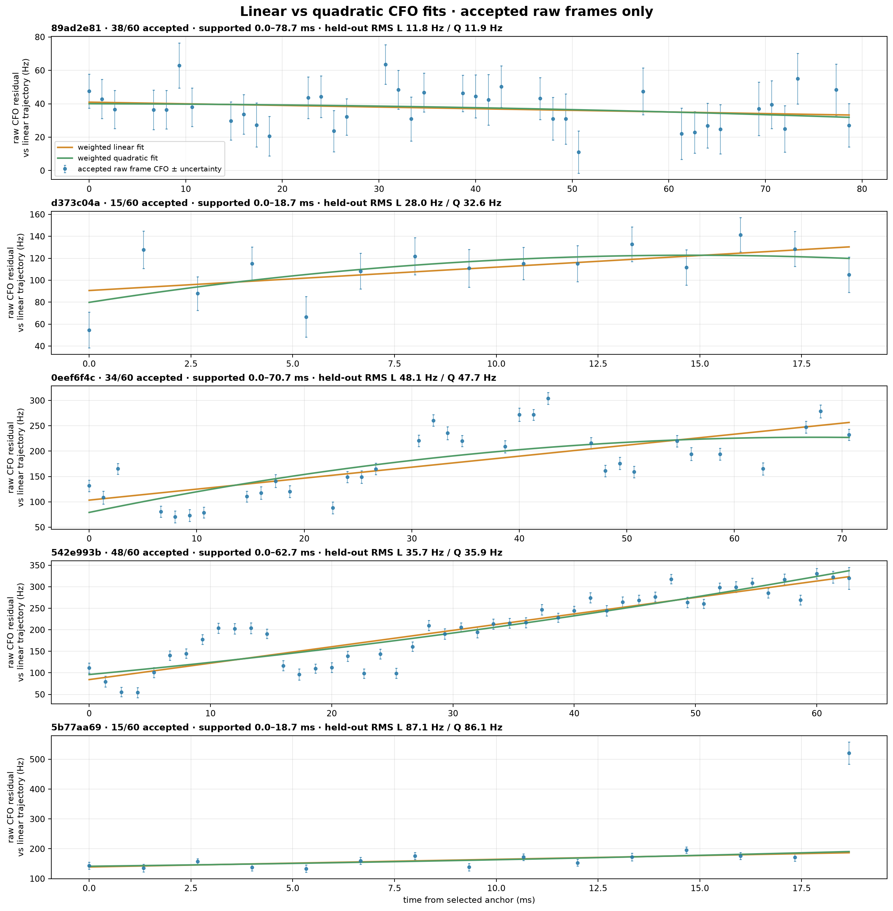
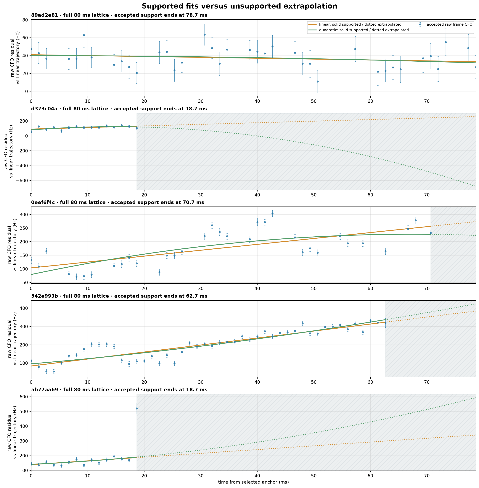
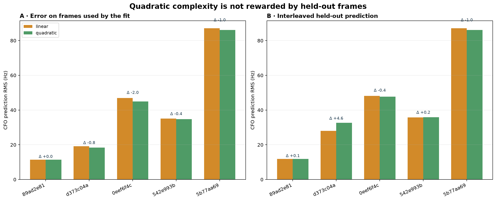
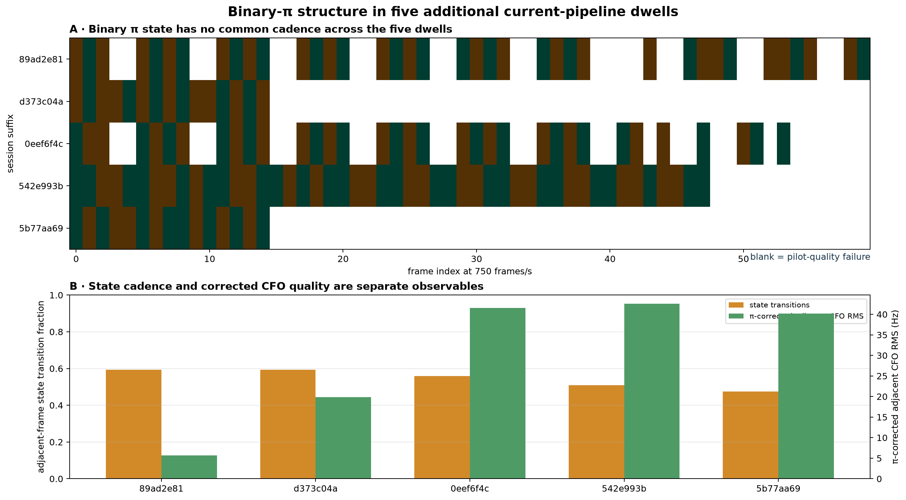

# Sub-second Qin pilot phase and CFO structure

Date: 2026-08-22

Status: offline, read-only research analysis; no Standard product or deployed tracker changed

## Decision

The apparent “unsampled” frames inside the requested 34.73–34.81 s interval are
recoverable from the continuous raw-IQ recording. They were absent from the retained
timing-lock evaluation, not absent from the recording. Reconstructing the complete 750 Hz
frame lattice adds 11 frames, and all 60 frames in the 80 ms interval pass the exact-pilot
quality test.

There is a coherent phase signal in this interval, but it is not ordinary unambiguous
carrier phase. The pilot observations contain a binary sign state equivalent to a phase
offset of either 0 or pi. A smooth ordinary phase fit leaves 1.695 rad RMS, whereas a
binary-pi-aware fit leaves 0.151 rad RMS and obtains 0.978 coherent-stack efficiency
against a 0.989 per-frame oracle ceiling. Even-to-odd and odd-to-even pilot splits retain
0.152 and 0.164 rad held-out RMS and infer the same binary states up to one global sign.
The earlier Kalman filter was therefore rejecting a real observable because its
measurement model omitted this discrete state; it was not merely failing to converge.

The attached frequency bands have the same explanation. A pi state transition between
adjacent 750 Hz frames is indistinguishable from a half-frame-rate frequency offset:

\[
\frac{\pi}{2\pi(1/750\ \mathrm{s})}=375\ \mathrm{Hz}.
\]

Removing the inferred binary state collapses the banded adjacent-phase CFO error to
27.1 Hz RMS in the requested interval. The exact vertical placement of the uncorrected
bands depends on wrapped-phase gauge, so the physically meaningful result is their
approximately 375 Hz separation, not the sign assigned to either binary transition.

A second, independent structure remains. Within good 50–80 ms intervals the CFO follows
a local ramp near -3.8 kHz/s, while the multi-second frozen model is near -7 kHz/s. Across
all 34 contiguous frequency-update runs, the residual to the frozen model has a median
+3.15 kHz/s slope and 13.84 Hz within-run line-fit RMS, interrupted by discrete bias
changes. A 10 ms offline local-linear model reduces held-out CFO RMS from 396.5 Hz for the
frozen model and 165.0 Hz for the source-window GLRT64 value to 16.5 Hz. One-frame-ahead
prediction with 20–50 ms history gives 19.6–18.9 Hz RMS. This is strong evidence that a
short-memory ramp-plus-jump model can improve the receiver-relative CFO observable.

It is not yet evidence of absolute range. The binary pi ambiguity, discontinuous CFO
biases, receiver/LNB clocks, transmitter behavior, and capture continuity must be modeled
or calibrated before carrier phase can be accumulated as range. The safe output today is
a precise local CFO and CFO-rate estimate plus explicitly bounded relative-phase segments.

## Problem statement

The dense tracker made the requested regions look visually smooth in frequency while
declaring many phase resets and leaving some frame epochs unevaluated. Two questions
followed:

1. Are the unevaluated epochs truly missing, or can their raw samples be revisited using
   the timing and carrier state inferred from neighboring frames?
2. Does the repeated sub-second CFO structure represent recoverable carrier dynamics, an
   estimator artifact, or a nuisance process that must be separated from Doppler?

The analysis must not force continuity through real recording gaps or assume that a
single successful 80 ms interval generalizes to every dwell. It therefore uses
digest-verified raw IQ, held-out pilot subsets, held-out time samples, all contiguous runs
in the target dwell, and independent historical dwells.

## Signal model

The measured channel vector of frame \(m\), after exact Qin-pilot wipeoff and timing
correction, is modeled as

\[
\mathbf z_m \approx a_m\mathbf h_m
\exp\{j[\phi_s(t_m)+\pi b_m]\}+\boldsymbol\epsilon_m,
\qquad b_m\in\{0,1\}.
\]

Here \(\phi_s\) is the smooth receiver-relative carrier phase and \(b_m\) is an unknown
binary sign state. Squaring the normalized complex observation removes the sign state:

\[
\arg(\mathbf z_m^2)=2\phi_s(t_m)\pmod{2\pi}.
\]

After fitting this doubled phase, the original phase selects the most likely binary state.
This is an offline batch resolution, not a claim that the binary sequence is decoded
payload or a known transmitter scrambler.

The frame-local CFO requires another state:

\[
\hat f_m=f_{\mathrm{smooth}}(t_m)+q_{r(m)}+e_m,
\]

where \(q_{r(m)}\) is a piecewise bias for contiguous run \(r\). The smooth term is the
candidate Doppler/clock trajectory; the jumps are nuisance candidates and must not be
integrated into range until independently explained.

## Methods

### Complete raw-lattice recovery

The analysis starts from one supported timing epoch, constructs the nominal 750 Hz frame
lattice with sample-domain rounding, and reads every complete frame directly from the
pinned recording store. Each recovered frame is passed through the same full 300-symbol,
eight-subcarrier pilot estimator and rolled-pilot negative control used by the existing
report. No samples are synthesized or interpolated.

This distinction is important:

- **not retained/evaluated** means the earlier dense pass had no retained timing-lock row
  at that epoch; continuous raw IQ can still contain the frame;
- **not recorded** means an actual capture/shard discontinuity; phase cannot be recovered
  across it merely by knowing the prior phase.

The 11 gaps in 34.73–34.81 s are the first case. Reports on carrier continuity and shard
rollovers identify examples of the second case elsewhere in the corpus.

### Phase qualification

An 80 ms screen is called phase-rate-qualified only when at least 75% of its frame lattice
passes exact-pilot quality, the reconstructed binary-pi-aware phase residual is at most
0.35 rad RMS, and both interleaved pilot-subset directions are at most 0.35 rad RMS. These
are declared research thresholds. The residuals and held-out tests are the evidence; the
word “lock” is only shorthand for passing these gates.

The binary-state lag scan is descriptive. In particular, a high repeat agreement can be
caused by long constant runs. It is not by itself a detected clock or fixed transmitter
period.

### CFO validation

Three time-domain tests are used on 1,109 accepted target-dwell frequency frames:

- interleaved frames: fit even-index frames and predict odd-index frames;
- contiguous blocks: omit 5–50 ms blocks and interpolate them; and
- causal one-frame prediction: fit only 20–250 ms of preceding history.

All predictors operate on the CFO residual to the frozen model. Coherence and reported
frame uncertainty provide weights. No test sample is used in its own prediction.

## Results

### The requested raw samples are recoverable and coherently align

The complete-lattice result for 34.73–34.81 s is:

| Quantity | Result |
|---|---:|
| Nominal frames | 60 |
| Previously retained | 49 |
| Newly evaluated from raw IQ | 11 |
| Frames passing pilot quality | 60 |
| Within-frame CFO smooth-fit RMS | 17.80 Hz |
| Ordinary cubic phase residual | 1.695 rad RMS |
| Binary-pi-aware phase residual | 0.151 rad RMS |
| Binary-pi-aware stack efficiency | 0.978 |
| Per-frame oracle stack ceiling | 0.989 |
| Even pilots predicting odd pilots | 0.152 rad RMS; 0.970 stack |
| Odd pilots predicting even pilots | 0.164 rad RMS; 0.966 stack |
| Corrected adjacent-phase CFO | 27.05 Hz RMS |

The smooth cubic and degree-eight fits shown in the attached image both failed for the
same reason: neither included \(b_m\). More polynomial flexibility cannot absorb a
discrete pi state without corrupting the smooth derivative. Phase doubling addresses the
correct ambiguity and makes the recovered raw frames add coherently.

### Five target-dwell screens: coherent phase, changing binary cadence


*Figure 1. Five complete-lattice screens from the original dwell. The phase-supported
rate independently follows the short-interval CFO rate, while the binary-state transition
fraction changes dramatically. A repeat lag is a local description, not a global clock.*

| Start (s) | Quality frames | Pi-aware phase RMS | State transitions | Local CFO rate | Phase-supported rate |
|---:|---:|---:|---:|---:|---:|
| 34.08 | 60/60 | 0.160 rad | 8.5% | -3.736 kHz/s | -3.781 kHz/s |
| 34.73 | 60/60 | 0.151 rad | 35.6% | -3.720 kHz/s | -3.764 kHz/s |
| 35.80 | 45/60 | 0.144 rad | 72.9% | -4.111 kHz/s | -3.785 kHz/s |
| 36.00 | 53/60 | 0.120 rad | 91.5% | -3.986 kHz/s | -3.905 kHz/s |
| 36.60 | 60/60 | 0.180 rad | 83.1% | -3.744 kHz/s | -3.820 kHz/s |

All five pass the declared phase-rate gates. The 34.73 s sequence has a strong local
11-frame repeat (14.7 ms, 93.3% template agreement), but the other intervals range from
long constant-state blocks to near frame-by-frame alternation. There is therefore no one
fixed phase-lock interval or universal binary cadence in this dwell. The binary state is
best treated as a latent frame polarity until its relationship to transmitter framing is
independently established.

### The 34 frequency runs reveal a ramp-plus-jump CFO process


*Figure 2. Thirty-three of 34 runs contain at least eight frames. Most share a positive
residual slope relative to the multi-second frozen model. The run-center bias ramps and
then changes discontinuously; high-RMS long runs mix regimes.*

Across supported runs:

- median local-minus-frozen rate: **+3.148 kHz/s**;
- 10th–90th percentile: **+1.154 to +3.694 kHz/s**; and
- median within-run linear residual: **13.84 Hz RMS**.

The five 80 ms screens independently put the absolute local rate near -3.8 kHz/s, versus
about -6.9 to -7.4 kHz/s for the multi-second frozen line. The phase-supported derivatives
are within 44, 44, 326, 81, and 76 Hz/s of their respective frame-local CFO derivatives.
Thus the phase and within-frame slope estimators—formed from different dimensions of the
pilot—support the same short-interval dynamics.

The multi-second line is not simply a noisy version of the instantaneous rate. It averages
the local ramps together with discrete bias relief. The physical source of those jumps is
not identified here; possible contributors include receiver/transmitter state, timing
re-anchors, oscillator behavior, or an unresolved protocol state. Regardless of source,
they are not plausible instantaneous satellite range-rate changes and must be explicit
nuisance states.

### A 10–50 ms model materially improves CFO prediction


*Figure 3. Interleaved and causal holdout tests select a short memory. A 10 ms symmetric
smoother approaches the per-frame measurement floor; histories of 100 ms or more blend
across the discrete changes.*

| Predictor | Held-out RMS | Median absolute error | 90th percentile |
|---|---:|---:|---:|
| Frozen multi-second model | 396.46 Hz | 358.07 Hz | 597.77 Hz |
| Source-window GLRT64 held across window | 165.00 Hz | 119.46 Hz | 257.38 Hz |
| 5 ms local-linear bandwidth | 17.10 Hz | 10.69 Hz | 26.24 Hz |
| **10 ms local-linear bandwidth** | **16.48 Hz** | **10.05 Hz** | **25.46 Hz** |
| 20 ms local-linear bandwidth | 19.88 Hz | 11.43 Hz | 29.23 Hz |
| 50 ms local-linear bandwidth | 63.83 Hz | 35.56 Hz | 88.32 Hz |

The median reported per-frame uncertainty is 16.16 Hz, so the best interleaved result is
already close to the measurement floor. Contiguous missing blocks are harder: a 10 ms
smoother gives 16.42, 23.88, 39.36, and 77.56 Hz RMS for 5, 10, 20, and 50 ms omissions.
Causal one-frame prediction is nevertheless strong: 20 and 50 ms trailing histories give
19.63 and 18.88 Hz RMS, while 100 and 250 ms histories degrade to 94.49 and 121.23 Hz.

This supports a practical design choice: estimate local CFO and rate over roughly 20–50
ms, detect/reset on a discrete bias change, and never smooth blindly over hundreds of
milliseconds.

**Cross-dwell figure correction (2026-08-23):** the first version of the five-additional-
dwell detail figure plotted the already quadratic-smoothed `frequency_fit_cfo_hz` at all
60 epochs and overlaid another quadratic. Its visually exact curvature was therefore not
independent evidence. The corrected figure below plots only raw accepted-frame CFO with
reported uncertainty, compares linear and quadratic fits only inside accepted support,
and validates both models on interleaved held-out frames. The correction does not change
the phase conclusions, but it removes any basis for attributing the displayed 80 ms CFO
curvature to satellite range dynamics.

### Cross-dwell phase is real but intermittent


*Figure 4. The binary-pi model improves phase alignment in every audited window, but only
the original target satisfies the full density, residual, and bidirectional held-out
qualification. Low-quality or asymmetric windows are not promoted as locks.*

| Session suffix | Path | Quality | Pi-aware RMS | Held-out RMS (two directions) | Qualification |
|---|---|---:|---:|---:|---|
| 470384cc | stream-0/RX0 | 60/60 | 0.151 rad | 0.152 / 0.164 rad | pass |
| 841b2a20 | stream-0/RX1 | 60/60 | 0.157 rad | 0.174 / 0.660 rad | asymmetric; fail |
| 87f96f47 | stream-1/RX1 | 43/60 | 0.496 rad | 0.527 / 0.485 rad | fail |
| 17c2e0eb | stream-1/RX1 | 60/60 | 0.705 rad | 0.735 / 0.735 rad | fail |
| ffd44155 | stream-1/RX1 | 14/60 | 0.168 rad | 0.186 / 0.234 rad | too sparse; fail |

One further historical dwell had no directly supported degree-one carrier in its final
trajectory bank and was not forced into this audit. The cross-dwell result therefore
supports an intermittent modulo-pi observable, not universal phase continuity.

### Five additional current-pipeline dwells replicate the intermittency

Five more sessions were screened without reusing any session in the preceding table.
The final audit uses newly published Standard runs from the deployed pipeline release
`9f45c2aefc60b355ad1da173211c9c1255a13395`, not their older analysis products. Before
submission, each session had zero active or succeeded runs on that exact release. After
completion, the catalog contained exactly one such run per session; all five runs were
sealed, succeeded with 12/12 terminal stages, and became the current Standard pointer.
Thus these are five distinct sessions and five non-duplicate current-release runs.

Selection was deliberately phase-blind. Older Standard products were used only to find
additional sessions with a supported degree-one trajectory. Within each newly processed
session, the audit chose the receiver path with the strongest supported trajectory
margin, used its retained timing anchor, and then returned to digest-verified raw IQ to
evaluate the complete 80 ms / 60-frame lattice. No interval was selected for a favorable
phase residual.



*Figure 5. Replication summary from exact current-pipeline products. The red lines are the
predeclared gates, not visually tuned boundaries. Good phase residual and adequate raw
pilot coverage do not occur together in these five windows; consequently none passes all
three gates. Short-interval CFO and phase-derived rates should not be interpreted when
their corresponding coverage or held-out phase test fails.*

| Session suffix | Current run prefix | Path | Quality | Pi-aware RMS | Held-out RMS (two directions) | Corrected adjacent CFO RMS | Qualification |
|---|---|---|---:|---:|---:|---:|---|
| 89ad2e81 | 3cdb951a | stream-0/RX1 lower | 38/60 | 0.864 rad | 0.749 / 0.871 rad | 5.68 Hz | sparse and incoherent; fail |
| d373c04a | c0eafedc | stream-0/RX1 lower | 15/60 | 0.121 rad | 0.131 / 0.140 rad | 19.89 Hz | coherent but too sparse; fail |
| 0eef6f4c | b8b6fe0c | stream-1/RX1 lower | 34/60 | 0.552 rad | 0.628 / 0.554 rad | 41.53 Hz | sparse and incoherent; fail |
| 542e993b | 515a3afb | stream-1/RX1 lower | 48/60 | 0.486 rad | 0.491 / 0.480 rad | 42.56 Hz | adequate coverage, incoherent; fail |
| 5b77aa69 | 7e8a2e9c | stream-0/RX1 lower | 15/60 | 0.226 rad | 0.656 / 0.567 rad | 40.14 Hz | sparse and held-out failure; fail |

The d373c04a interval is the clearest warning against equating a good-looking phase fit
with a usable lock: its Pi-aware in-sample residual is 0.121 rad and both held-out pilot
directions are below 0.15 rad, but only one quarter of the raw frame lattice passes pilot
quality. Conversely, 542e993b is the only interval above the 75% coverage gate, yet its
Pi-aware and held-out residuals remain near 0.49 rad. The 89ad2e81 interval has the best
Pi-corrected adjacent-CFO consistency (5.68 Hz RMS) but poor phase residuals, confirming
that adjacent frequency consistency and accumulated phase coherence are separate tests.



*Figure 6. Corrected per-dwell detail. The left column shows accepted raw-frame CFO with
reported uncertainty and weighted linear/quadratic fits only over accepted support;
rejected frames are omitted rather than replaced with fitted values. The right column
compares ordinary and binary-Pi-aware phase residuals on the same quality frames.*

### Apparent 80 ms CFO curvature is not established as satellite motion

The frozen trajectory used here is a signal-derived degree-one trajectory, not
TLE-predicted Doppler for an associated satellite. The raw comparison is therefore a
test of whether a local quadratic predicts better than a local line, not a physical orbit
fit. Each fit uses weights proportional to pilot coherence divided by squared reported
CFO uncertainty. Interleaved validation fits even accepted frame indices and predicts
odd indices, then reverses the roles; no frame scores its own prediction.



*Figure 7. Linear and quadratic fits evaluated only where accepted raw pilot frames
provide support. The curves are nearly coincident in the best-covered dwell, and the
quadratic bends mainly to follow local clusters or outliers in the others.*

| Session suffix | Accepted support | In-sample RMS, linear / quadratic | Held-out RMS, linear / quadratic | Interpretation |
|---|---:|---:|---:|---|
| 89ad2e81 | 0–78.7 ms | 11.4 / 11.4 Hz | 11.8 / 11.9 Hz | no quadratic gain |
| d373c04a | 0–18.7 ms | 19.1 / 18.3 Hz | 28.0 / 32.6 Hz | quadratic overfits |
| 0eef6f4c | 0–70.7 ms | 46.9 / 44.9 Hz | 48.1 / 47.7 Hz | 0.4 Hz held-out gain; immaterial |
| 542e993b | 0–62.7 ms | 35.1 / 34.8 Hz | 35.7 / 35.9 Hz | no quadratic gain |
| 5b77aa69 | 0–18.7 ms | 87.0 / 86.1 Hz | 87.1 / 86.1 Hz | 1.0 Hz gain amid 86 Hz error |



*Figure 8. Solid curves are inside accepted pilot support; dotted curves are
extrapolations into hatched, unsupported time. In d373c04a and 5b77aa69, accepted data
end at 18.7 ms. The dramatic remainder of the former quadratic curve is an extrapolation,
not an observed CFO trajectory.*



*Figure 9. A quadratic always has more freedom to reduce training error, but that
complexity is not rewarded on interleaved held-out frames. Differences are 0.1–4.6 Hz in
four dwells and 1.0 Hz against an 86 Hz error floor in the fifth; there is no robust
cross-dwell evidence that quadratic curvature is required at this timescale.*

If the CFO were purely physical Doppler,

\[
f_D=-\frac{f_c}{c}\dot\rho,\qquad
\dot f_D=-\frac{f_c}{c}\ddot\rho,\qquad
\ddot f_D=-\frac{f_c}{c}\dddot\rho.
\]

Thus CFO level maps to range rate, CFO slope to range acceleration, and CFO curvature to
range jerk—not directly to range change. A LEO pass does create smooth Doppler curvature
over longer intervals, but these 80 ms data do not select a quadratic over a line and are
not associated to a TLE in this test. Receiver/LNB clocks, transmitter behavior, timing
error, and estimator effects remain inseparable. Satellite range dynamics should be
claimed only after a TLE-predicted comparison and simultaneous-radio common-mode test.



*Figure 10. Inferred binary-Pi states for quality frames and two independent summaries.
Blank cells are recorded raw frames that fail the pilot-quality gate, not missing samples.
Transition fractions span 0.47–0.59 with no common visible cadence, while corrected
adjacent-CFO RMS spans 5.68–42.56 Hz. A binary-state rhythm is therefore not a sufficient
lock detector or a shared clock in this replication set.*

The added evidence strengthens, rather than reverses, the original conclusion: modulo-Pi
phase coherence exists, sometimes strongly, but is intermittent and must be qualified
jointly by raw-frame coverage and bidirectional held-out pilots. It also prevents the
excellent target-dwell result from being generalized into a universal phase observable.

## What the other 2026-08-22 reports add

The same-day reports constrain the interpretation:

- [`2026_08_22_4e2a0c111a30_alias_aware_trajectory_accounting.md`](2026_08_22_4e2a0c111a30_alias_aware_trajectory_accounting.md)
  shows that transported timing epochs can recover associated probes. This supports
  revisiting unretained epochs, but not inventing data through true capture gaps.
- [`2026_08_22_carrier_continuity_case.md`](2026_08_22_carrier_continuity_case.md)
  shows sample-loss uncertainty at shard rollovers. Those boundaries must terminate phase
  segments even if a frequency predictor can coast across them.
- [`2026_08_22_frame_local_phase_qualification.md`](2026_08_22_frame_local_phase_qualification.md)
  and [`2026_08_22_within_segment_frame_phase.md`](2026_08_22_within_segment_frame_phase.md)
  find intermittent predictive phase islands and negative-control failures in other
  targets. They argue for held-out gates rather than visual smoothness.
- [`2026_08_22_kalman_phase_tracking_comparison.md`](2026_08_22_kalman_phase_tracking_comparison.md)
  finds phase bunching and reset-associated timing events on roughly 100–200 ms scales.
  The present pi state explains one rejection mechanism; it does not erase real timing
  or capture discontinuities.
- [`2026_08_22_pnt_kalman_comparison.md`](2026_08_22_pnt_kalman_comparison.md) and
  [`2026_08_22_pnt_phase_doppler_comparison.md`](2026_08_22_pnt_phase_doppler_comparison.md)
  show that local coherent islands can coexist with a good multi-second Doppler-rate fit.
  The new result explains why the two rates differ: the long fit absorbs short ramps plus
  jumps.
- [`2026_08_22_dual_lnb_drift_reference.md`](2026_08_22_dual_lnb_drift_reference.md)
  demonstrates that front-end oscillator drift is a material common-mode nuisance. It
  must be removed before assigning all smooth CFO curvature to satellite motion.

Together these reports support a segmented state-space model, not one continuously
unwrapped carrier over the whole dwell.

## Recommended offline estimator

The next analysis should use a small factor graph or robust batch optimizer with four
explicit state classes:

1. **Complete frame inventory.** Within each demonstrably continuous raw-IQ span, propagate
   a supported timing epoch onto the exact 750 Hz sample lattice and evaluate every
   complete frame. Mark real capture discontinuities separately from failed detections.
2. **Frame observations.** Retain full-pilot CFO, common phase, channel similarity,
   fractional timing, exact-versus-rolled control, and uncertainty. Do not reduce the
   input prematurely to one CFO number.
3. **Binary phase state.** Fit doubled phase to estimate the smooth carrier, then solve
   \(b_m\in\{0,1\}\) with Viterbi or dynamic programming. Permit a global sign ambiguity;
   validate with disjoint pilot subsets.
4. **Ramp and change points.** Fit a local-linear CFO/rate state with sparse jump variables,
   for example robust trend filtering with an L1 penalty on bias changes. Use the measured
   10–20 ms symmetric or 20–50 ms causal scale as an initial hyperparameter range, chosen
   by blocked holdout rather than in-sample residual.
5. **Segment validity.** Connect phase only while raw sample continuity, pilot-control
   margin, channel similarity, timing stability, binary-state confidence, and held-out
   phase residual all pass. A failed gate ends relative range; it does not silently coast
   phase.
6. **Physical separation.** Compare simultaneous radios/LNBs and the TLE-predicted slow
   component. Common receiver-side motion should enter a clock/LO state; instantaneous
   bias jumps enter a nuisance state; only the remaining smooth component is a Doppler
   candidate.

If an online implementation is later required, the batch result can seed an
interacting-multiple-model or Rao–Blackwellized filter with continuous
phase/frequency/rate state and discrete pi/jump state. It should not begin as another
single-Gaussian Kalman filter.

## Consequences for Doppler and range

Accounting for the sub-second structure improves **receiver-relative Doppler/CFO** now:
the held-out error falls to roughly 16–20 Hz at frame cadence. At an illustrative 11 GHz
RF carrier, 1 Hz corresponds to about 0.027 m/s of one-way radial velocity, so 16–20 Hz is
about 0.44–0.55 m/s equivalent. That conversion is not a calibrated satellite-velocity
claim because LNB, receiver, transmitter, and model errors remain in the observable.

Within a qualified continuous phase segment, relative path-length change can be formed as

\[
\Delta\rho=-\frac{c}{2\pi f_c}\Delta\phi,
\]

subject to sign convention. At 11 GHz, the binary pi ambiguity is approximately 1.36 cm
of one-way path length. Global cycle ambiguity and every declared reset remain unresolved,
so this does not provide absolute range. Range accumulation must exclude inferred CFO
jumps and must stop at unverified sample gaps.

The immediate navigation value is therefore a better Doppler-rate observable and shorter,
well-qualified relative-phase arcs. Absolute range still requires satellite association,
RF-frequency and clock calibration, ambiguity resolution, and preferably common-mode
subtraction across simultaneous receivers.

## Testing

The new report tool has focused unit tests for:

- discovery of a known repeating binary-state template;
- collapse of the 375 Hz adjacent-phase alias after pi correction;
- held-out local-linear prediction of a synthetic ramp with a discrete step;
- finite-only error metrics; and
- raw accepted-frame linear/quadratic comparison, support truncation, and interleaved
  held-out prediction without scoring fitted values as observations.

The real-corpus run is read-only and emits the complete input/result audit as
[`subsecond-pilot-structure.json`](figures/2026_08_22_subsecond_pilot_structure/subsecond-pilot-structure.json).
The five-dwell replication additionally records its exact release/run inputs in
[`inputs.json`](figures/2026_08_23_additional_subsecond_pilot_dwells/inputs.json) and its
complete raw-lattice results in
[`additional-dwell-results.json`](figures/2026_08_23_additional_subsecond_pilot_dwells/additional-dwell-results.json).
The report should be regenerated with:

```bash
OPENBLAS_NUM_THREADS=1 OMP_NUM_THREADS=1 \
  .venv/bin/python tools/report_subsecond_pilot_structure.py

OPENBLAS_NUM_THREADS=1 OMP_NUM_THREADS=1 \
  .venv/bin/python tools/report_additional_subsecond_pilot_dwells.py
```

The focused qualification command is:

```bash
.venv/bin/python -m pytest -q \
  tests/analysis/test_subsecond_pilot_structure_report_tool.py \
  tests/analysis/test_additional_subsecond_pilot_dwells_report_tool.py \
  tests/analysis/test_edge_pilot_phase_slope_report_tool.py \
  tests/dsp/test_pilot_phase_doppler_tracking.py
```

It passed with `30 passed in 1.34s`. The complete ordinary non-real-corpus,
non-PostgreSQL plan also passed with `1511 passed, 164 deselected, 1 warning in 93.83s`;
the warning is the existing Starlette/httpx deprecation warning.

## Limitations and next gates

- Only the original target dwell has full bidirectional held-out phase qualification;
  none of the nine independent historical dwell screens passes every coverage and phase
  gate. Independent-dwell phase continuity is intermittent.
- The binary state is inferred, not protocol-decoded. Its local repetition must not be
  labeled a transmitter clock without an independent framing test.
- The frozen trajectory is a consistency reference, not CFO ground truth.
- The CFO jump source is not yet identified. Dual-radio common-mode analysis and known
  injected signals are the next discriminating tests.
- The 10 ms smoother uses future and past samples; the forward 20–50 ms result is the
  appropriate latency-free comparison for an eventual online tracker.
- No phase is bridged across a verified or potentially unobservable capture loss.

The evidence is sufficient to implement the offline segmented estimator and evaluate it
over more dwells. It is not sufficient to publish absolute range or to replace the
existing Standard trajectory product.
