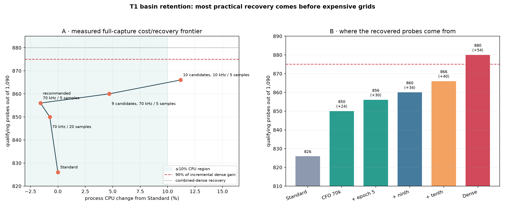

# T1 independent-GLRT search-parameter mechanism study

Capture: `cap-20260821T201522-841b2a20e151`; path: `stream-0/RX1`; raw IQ only.

## What this step is for today

This is the **per-probe known-pilot acquisition step**. Its job today is to inspect one short, fixed block of raw complex radio samples and return a small inventory of plausible pilot timing/CFO hypotheses. It is designed to preserve plausible alternatives through an ambiguous acquisition surface so that a later, explicitly separate degree-1 association step can decide whether candidates form a coherent straight frequency track.

This step does **not** estimate a Doppler rate, fit a trajectory through time, choose a satellite, consult a TLE, use a neighboring probe, or decode a payload. Each 20 ms probe is searched independently. The output CFO values become points from which a later linear slope in Hz/s may be estimated.

The motivation for revisiting it is concrete: Standard appeared to lose orange candidate points near the end of the first T1 region. A much denser search recovered a coherent candidate branch, but was expensive. This report asks which acquisition parameter caused that recovery and how much of it can be obtained without paying for the full dense search.

## Input and output contract

| Item | Meaning in this study |
|---|---|
| Input samples | One 20 ms CI16 complex-IQ probe from `stream-0/RX1`, converted to normalized complex samples |
| Probe schedule | A new probe every 25 ms across the 27.25 s T1 interval; 1,090 probes total |
| Frequency calibration | Receiver/baseband calibration used to translate residual CFO to the reported tracking CFO coordinate |
| Signal hypothesis | The upper-edge Qin known-pilot template and its declared acquire/verify symbol sets |
| Search configuration | CFO domain and grids, retained-candidate count, timing/CFO nonmaximum-suppression distances, and GLRT transform size |
| Output per probe | Up to `retained_candidate_count` independently scored candidates containing local epoch, acquired CFO, GLRT-refined tracking CFO, exact score, wrong-pilot control score, their margin, and diagnostics |
| Not output | No cross-time line, Doppler rate, satellite identity, TLE match, payload, or claim that the largest-margin candidate is uniquely true |

## Step-by-step operation

1. **Cut an independent probe.** Read exactly 20 ms of IQ at the scheduled sample index. Nothing from the preceding or following probe is supplied.
2. **Search the coarse timing × CFO surface.** Correlate sparse known-pilot anchors over the full −400 to +400 kHz residual-CFO domain and all candidate frame epochs. Standard uses an 80 kHz CFO grid.
3. **Find local maxima.** Convert the score surface to a ranked list of local timing/CFO peaks. At this point there can be many aliases and nearby peaks.
4. **Retain a bounded, separated inventory.** Walk the peaks from strongest downward and discard a peak only when it is close to an already retained peak in both epoch and CFO. Stop after the configured candidate count. This is the step responsible for the missing-basin effect studied here.
5. **Refine each surviving basin.** Refine epoch locally, scan a fine CFO grid around the coarse basin, then scan a narrower conditioned grid. These operations improve the location of a basin that survived step 4; they cannot resurrect one that step 4 removed.
6. **Score exact signal versus control.** Evaluate the known pilot and a deliberately wrong-pilot control. `margin = exact score − control score`; the report's evidence gate is margin ≥0.05.
7. **Emit candidates, not a track.** Preserve the candidate inventory for later robust, degree-1-only association. The fixed four-piece line shown in this report is used only after acquisition to audit which candidates were available.

## Parameter terminology

| Parameter | Standard | What it means | Main computational/behavioral effect |
|---|---:|---|---|
| `residual_cfo_min_hz`, `residual_cfo_max_hz` | −400, +400 kHz | Total residual-CFO domain searched in every probe | Wider domain admits more frequency hypotheses; T1 is already inside the current domain |
| `coarse_cfo_step_hz` | 80 kHz | Spacing of initial CFO hypotheses before local-peak retention | Smaller steps expand the coarse score grid and cost substantially more CPU |
| `fine_cfo_radius_hz` | 80 kHz | Half-width refined around each retained coarse basin | Must cover the coarse-cell uncertainty; does not affect which basins survive |
| `fine_cfo_step_hz` | 500 Hz | CFO spacing in the first refinement scan | Smaller values improve localization but multiply work per retained basin |
| `conditioned_cfo_radius_hz` | 2 kHz | Final narrow half-width after fine localization | Controls the final local search extent |
| `conditioned_cfo_step_hz` | 100 Hz | Final local CFO spacing | Improves placement precision; cannot recover a discarded basin |
| `retained_candidate_count` | 8 | Maximum timing/CFO basins refined and scored per probe | Cost grows approximately with the number retained and the look-elsewhere burden also grows |
| `candidate_cfo_separation_hz` | 80 kHz | Two peaks may be treated as the same basin when their CFO distance is at most this value and their epoch is also close | Smaller values suppress fewer CFO alternatives at essentially fixed cost when the retained count stays fixed |
| `candidate_epoch_separation_samples` | 20 samples | Circular timing distance used with CFO distance for basin suppression | Smaller values retain more nearby timing alternatives; it is not probe spacing |
| `glrt_size` | 512 | Transform length used for GLRT residual-CFO scoring; 512 corresponds to about 443.9 Hz residual spacing | 4096 sharpens this to about 55.5 Hz but costs more and still cannot score a discarded basin |
| `minimum_frame_support` | 2 | Minimum repeated-frame support needed for acquisition | Rejects probes too short to support the test |
| acquire/verify symbol sets | fixed Qin sets | Known pilot symbols used to acquire and independently verify candidates | Changing them changes the signal test, so they are held fixed |

## Executive finding

The dense result is not 34,880 independent detections. It is 1,090 independent time probes with up to 32 timing/CFO alternatives per probe. The primary failure mechanism is **inventory loss under CFO/timing ambiguity**: a correct branch can be present but not be the highest-margin candidate, or can be discarded before GLRT scoring. The characteristic wrong winners cluster approximately one 227.273 kHz ambiguity spacing away. That declared spacing is the reciprocal of the 4.4 µs OFDM symbol duration.

Increasing basin count and relaxing nonmaximum-suppression separation therefore changes *which hypotheses survive*. Finer CFO grids primarily improve localization after the correct basin survives. GLRT-4096 improves residual-CFO resolution and discrimination, but cannot score a basin that was already discarded.

The strongest one-factor result is more specific than the earlier audit: changing only CFO nonmaximum-suppression separation from 80 to 70 kHz recovers all 16 old-gap probes. Combining 70 kHz with a 5-sample epoch separation recovers 856/1,090 probes over the full capture versus 826 for Standard, without increasing the retained count or measured CPU. Raising the count to 32 while leaving broad separation unchanged recovers only 14/16 old-gap probes. Basin-retention policy—not finer CFO placement—is decisive in this interval.

## Search mechanism

| Stage | Operation | Parameter that matters | Failure observed here |
|---:|---|---|---|
| 1 | Search timing × coarse CFO using sparse known pilots | CFO domain and coarse step | A local maximum may be represented coarsely, but the ±400 kHz domain covers T1 |
| 2 | Nonmaximum suppression retains separated local maxima | Basin count; CFO/epoch separation | The correct ≈227.27 kHz alias/timing alternative can be suppressed or fall below the cap |
| 3 | Fine and conditioned CFO refinement | Fine radii and steps | Improves tens-to-hundreds-of-hertz placement; does not restore a removed basin |
| 4 | Exact and wrong-pilot control are scored | GLRT size and margin | Longer GLRT sharpens the residual grid and evidence comparison |
| 5 | Post-hoc straight-line association | Margin and residual gates | Selects at most one already-retained candidate/probe; it does not alter acquisition |

All searches in stages 1–4 are independent per 20 ms probe. No adjacent probe, fitted line, TLE, or expected Doppler enters them. The strict piecewise degree-1 lines are used only afterward as fixed diagnostics.

The implementation suppresses a new peak only when **both** conditions below hold against an already-retained peak:

```text
circular_epoch_distance < candidate_epoch_separation_samples
AND abs(candidate_cfo - retained_cfo) <= candidate_cfo_separation_hz
```

That conjunction explains the sharp threshold. Standard's adjacent coarse CFO cells are 80 kHz apart and its CFO suppression distance is also 80 kHz, so adjacent cells with nearby timing satisfy `<= 80 kHz` and one can be discarded. Moving the suppression distance to 70 kHz—just below one coarse cell—allows both timing/CFO alternatives to survive while still scoring only eight candidates. Moving farther down to 40, 20, or 10 kHz produced no additional full-capture recovery when the epoch distance remained 20 samples.

## Actual raw-IQ one-factor ablation

The following profiles were rerun over the actual 6.825 s transition, the old 7.5–7.9 s apparent gap, and a steady P3 control. A hit requires margin ≥0.05 and CFO within 500 Hz of the fixed strict-linear reference.


`winner` asks whether the single largest GLRT exact-minus-control margin lands on the branch. `inventory` asks whether any independently retained candidate lands on it. Their gap is the ambiguity/ranking problem that a later line association can resolve.

| Profile | Actual transition inventory | Old-gap inventory | Steady P3 inventory | Runtime for 50 probes |
|---|---:|---:|---:|---:|
| Standard reproduction | 10/18 | 13/16 | 15/16 | 3.8 s |
| 10 kHz coarse grid only | 11/18 | 15/16 | 15/16 | 13.5 s |
| 100/25 Hz fine grids only | 10/18 | 12/16 | 15/16 | 5.6 s |
| GLRT-4096 only | 10/18 | 13/16 | 15/16 | 6.2 s |
| 32 basins only | 11/18 | 14/16 | 15/16 | 11.0 s |
| 10 kHz/5-sample separation only | 10/18 | 16/16 | 15/16 | 3.9 s |
| 32 basins + narrow separation | 13/18 | 16/16 | 15/16 | 10.9 s |
| All acquisition grids | 10/18 | 15/16 | 15/16 | 14.0 s |
| Combined dense | 11/18 | 16/16 | 15/16 | 31.2 s |

| Profile | Coarse | Fine radius / step | Conditioned radius / step | Basins | CFO / epoch separation | GLRT | Old-gap winner | Old-gap inventory | Alias winner misses |
|---|---:|---:|---:|---:|---:|---:|---:|---:|---:|
| Standard reproduction | 80 kHz | 80 kHz / 500 Hz | 2 kHz / 100 Hz | 8 | 80 kHz / 20 samples | 512 | 12/16 | 13/16 | 3 |
| 10 kHz coarse grid only | 10 kHz | 10 kHz / 500 Hz | 2 kHz / 100 Hz | 8 | 80 kHz / 20 samples | 512 | 15/16 | 15/16 | 0 |
| 100/25 Hz fine grids only | 80 kHz | 80 kHz / 100 Hz | 2 kHz / 25 Hz | 8 | 80 kHz / 20 samples | 512 | 11/16 | 12/16 | 3 |
| GLRT-4096 only | 80 kHz | 80 kHz / 500 Hz | 2 kHz / 100 Hz | 8 | 80 kHz / 20 samples | 4096 | 12/16 | 13/16 | 4 |
| 32 basins only | 80 kHz | 80 kHz / 500 Hz | 2 kHz / 100 Hz | 32 | 80 kHz / 20 samples | 512 | 13/16 | 14/16 | 2 |
| 10 kHz/5-sample separation only | 80 kHz | 80 kHz / 500 Hz | 2 kHz / 100 Hz | 8 | 10 kHz / 5 samples | 512 | 16/16 | 16/16 | 0 |
| 32 basins + narrow separation | 80 kHz | 80 kHz / 500 Hz | 2 kHz / 100 Hz | 32 | 10 kHz / 5 samples | 512 | 16/16 | 16/16 | 0 |
| All acquisition grids | 10 kHz | 10 kHz / 100 Hz | 1 kHz / 25 Hz | 8 | 80 kHz / 20 samples | 512 | 15/16 | 15/16 | 0 |
| Combined dense | 10 kHz | 10 kHz / 100 Hz | 1 kHz / 25 Hz | 32 | 10 kHz / 5 samples | 4096 | 16/16 | 16/16 | 0 |


The timeline exposes the mechanism directly. Blue points are detector winners; hollow orange points show when a qualifying branch candidate is available. In Standard, three winning probes jump by one OFDM-symbol frequency and only one remaining miss can be rescued from the eight retained candidates. Narrower separation changes the candidate set and eliminates all four failures.

## Full-capture CPU/recovery frontier

The one-factor windows identify the mechanism; the following measurements test whether it generalizes over all 1,090 probes. Every profile reread the same raw IQ and used eight workers. Process CPU is the primary cost comparison for the inexpensive profiles; small negative deltas are run noise and should be interpreted as approximately zero additional cost.



| Configuration | Deliberate change from Standard | Full-capture inventory | Old gap | Process CPU change |
|---|---|---:|---:|---:|
| Standard | — | 826/1,090 | 13/16 | baseline |
| 8 candidates, 70 kHz / 20 samples | CFO suppression just below one coarse cell | 850/1,090 | 16/16 | -0.7% (≈0%) |
| **8 candidates, 70 kHz / 5 samples** | Also relax timing suppression | **856/1,090** | **16/16** | **-1.6% (≈0%)** |
| 9 candidates, 70 kHz / 5 samples | Score one extra survivor | 860/1,090 | 16/16 | +4.7% |
| 10 candidates, 10 kHz / 5 samples | Score two extra survivors | 866/1,090 | 16/16 | +11.2% |
| Combined dense | 32 candidates, all finer grids, GLRT-4096 | 880/1,090 | 16/16 | process CPU not recorded; 7.1× Standard wall time |

The exact threshold sweep matters: 70, 40, and 20 kHz CFO separation all recovered 850 probes while epoch separation remained 20 samples. Thus 70 kHz is the least aggressive value demonstrated to cross the 80 kHz coarse-cell boundary. Reducing epoch separation from 20 to 5 then adds six probes, reaching 856. A 10 kHz CFO separation with the same eight candidates and 5-sample epoch distance also reaches exactly 856, so 10 kHz is unnecessary for this result.

### What “90% of the benefit” means

Standard recovers 826 probes and combined dense recovers 880; the dense search therefore adds 54 probes. Ninety percent of that *incremental* gain requires at least 875 total hits. The recommended profile reaches 856 (30/54, or 55.6% of the increment) at approximately zero extra CPU. Nine candidates reach 860 (34/54, 63.0%) at +4.7% CPU. Ten candidates reach 866 (40/54, 74.1%) but already cost +11.2%, beyond the 10% budget. No tested fixed profile achieved 90% of the incremental dense gain within 10% CPU.

If benefit instead means absolute agreement with the dense result, the recommended profile obtains 97.3% of dense's recovered-probe count, and the nine-candidate profile obtains 97.7%. For the specific old apparent gap that motivated this work, the recommended profile obtains 16/16—100% of the observed recovery—without the dense search.

### Recommendation

For the next cross-dwell validation profile, keep the current CFO domain, 80 kHz coarse grid, 500/100 Hz refinement grids, eight retained candidates, and GLRT-512. Change only `candidate_cfo_separation_hz` from 80,000 to **70,000 Hz** and `candidate_epoch_separation_samples` from 20 to **5**. This is a report recommendation, not yet a production-default change. It must be checked on the other four dwells and matched null controls before changing the published acquisition profile.

## The real 6.825 s transition is different


The fitted-step region does not become complete under the dense configuration: 11/18 probes meet both gates. Five probes have no candidate with margin ≥0.05, and two margin-qualified probes remain about 2.3–2.4 kHz from the fixed steady-piece lines. Because every parameter profile shows a similar deficit, this is not the same basin-truncation mechanism as the old 7.5–7.9 s gap. It may be signal intermittency, overlap during the frequency change, or local model error; these data do not distinguish those causes.

## Full-interval inventory-depth and gate audit


Panel A is a **post-scoring truncation diagnostic**, not a substitute for the raw reruns above: it progressively hides ranks from the already-created combined-dense inventory. Panel B shows the expected look-elsewhere tradeoff. Looser evidence or residual gates recover more probes, but also make an accidental line easier to find. The report therefore retains the declared 0.05 margin and 500/750 Hz residual scales and relies on the matched time-permutation control for coherence evidence.

## Parameters deliberately held fixed

| Parameter | Fixed value | Reason |
|---|---:|---|
| CFO domain | −400 to +400 kHz | The fitted T1 branch spans only about +44 to −124 kHz, so it is not clipped; narrowing the domain would change the ambiguity prior rather than resolution |
| Probe duration / spacing | 20 / 25 ms | Keeps identical independent IQ samples across profiles; changing duration also changes integration gain |
| Pilot edge / template | Upper / Qin known pilot | T1 was detected on this edge; changing the template asks a different signal question |
| Time model | Fixed four intercept+slope pieces | Prevents each profile from moving the diagnostic target to flatter its own candidates |
| Margin / residual gates | 0.05 / 500 Hz for headline | Their full sensitivity grid is shown above rather than choosing a favorable gate |

The 10 kHz coarse-grid profiles use a 10 kHz fine-search radius instead of Standard's 80 kHz radius. This preserves contiguous coarse-cell coverage without redundantly rescanning eight neighboring coarse cells; the fine-grid *resolution* remains 500 Hz unless explicitly changed.

## Reproduction checks

The Standard profile winner reproduces the persisted Standard winner within 1 Hz for **50/50** studied probes. The combined-dense profile reproduces the archived dense winner within 1 Hz for **50/50** probes.

## Conclusions and limits

1. The large recovery is real candidate-level continuity, not interpolation between missing time samples: every probe was searched independently.
2. In the old apparent gap, narrow CFO/epoch separation is the strongest single correction. More basins alone is helpful but insufficient.
3. The least aggressive demonstrated full-capture correction is 70 kHz CFO separation plus 5-sample epoch separation with the existing eight candidates. It recovers 30 additional probes at effectively unchanged CPU.
4. CFO-grid and GLRT refinement improve precision and evidence but are secondary when the desired basin was discarded.
5. Thirty-two alternatives create a look-elsewhere burden. The earlier 888-versus-48 matched permutation result addresses line coherence, but the capture and breakpoint windows remain post hoc; this is not a calibrated false-alarm probability or satellite identity.
6. The three-point quadratic operation inside acquisition only interpolates a local score peak to center the next discrete CFO grid. No quadratic or cubic trajectory in time is fitted or used anywhere in this study.

Machine-readable results: [parameter-study.json](figures/2026_08_22_t1_glrt_search_parameter_study/parameter-study.json).

Full-capture cost measurements: [full-capture-cost-sweep.json](figures/2026_08_22_t1_glrt_search_parameter_study/full-capture-cost-sweep.json).

Candidate inventory: `parameter-study-candidates.jsonl.gz`. Source recording was read-only; no RF was collected and no payload was decoded.
