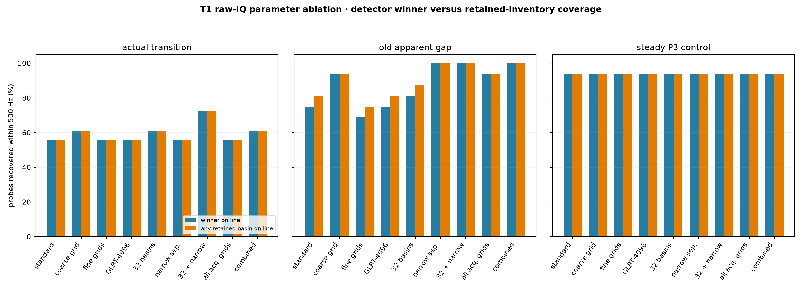
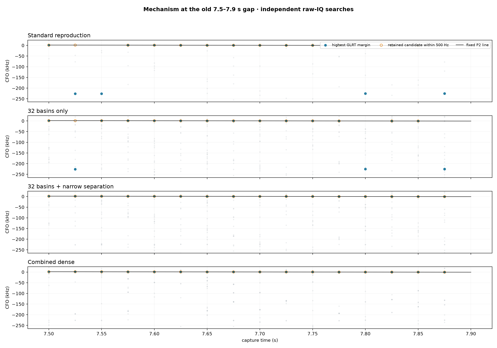
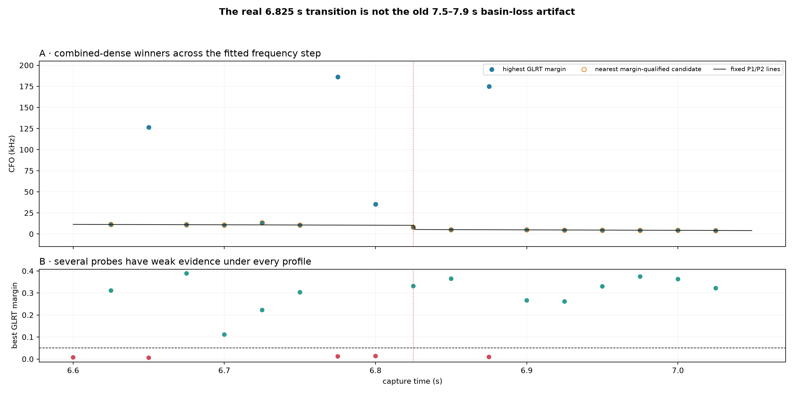
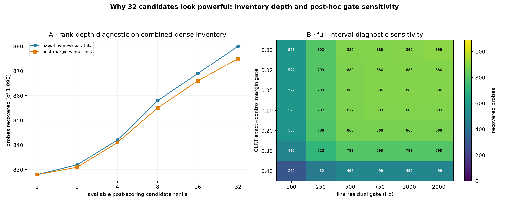

# T1 independent-GLRT search-parameter mechanism study

Capture: `cap-20260821T201522-841b2a20e151`; path: `stream-0/RX1`; raw IQ only.

## Executive finding

The dense result is not 34,880 independent detections. It is 1,090 independent time probes with up to 32 timing/CFO alternatives per probe. The primary failure mechanism is **inventory loss under CFO/timing ambiguity**: a correct branch can be present but not be the highest-margin candidate, or can be discarded before GLRT scoring. The characteristic wrong winners cluster approximately one 227.273 kHz ambiguity spacing away. That declared spacing is the reciprocal of the 4.4 µs OFDM symbol duration.

Increasing basin count and relaxing nonmaximum-suppression separation therefore changes *which hypotheses survive*. Finer CFO grids primarily improve localization after the correct basin survives. GLRT-4096 improves residual-CFO resolution and discrimination, but cannot score a basin that was already discarded.

The strongest one-factor result is more specific than the earlier audit: changing only nonmaximum-suppression separation from 80 kHz/20 samples to 10 kHz/5 samples recovers all 16 old-gap probes. Raising the count to 32 while leaving broad separation unchanged recovers only 14/16. Basin count helps, but separation policy is decisive in this interval.

## Search mechanism

| Stage | Operation | Parameter that matters | Failure observed here |
|---:|---|---|---|
| 1 | Search timing × coarse CFO using sparse known pilots | CFO domain and coarse step | A local maximum may be represented coarsely, but the ±400 kHz domain covers T1 |
| 2 | Nonmaximum suppression retains separated local maxima | Basin count; CFO/epoch separation | The correct ≈227.27 kHz alias/timing alternative can be suppressed or fall below the cap |
| 3 | Fine and conditioned CFO refinement | Fine radii and steps | Improves tens-to-hundreds-of-hertz placement; does not restore a removed basin |
| 4 | Exact and wrong-pilot control are scored | GLRT size and margin | Longer GLRT sharpens the residual grid and evidence comparison |
| 5 | Post-hoc straight-line association | Margin and residual gates | Selects at most one already-retained candidate/probe; it does not alter acquisition |

All searches in stages 1–4 are independent per 20 ms probe. No adjacent probe, fitted line, TLE, or expected Doppler enters them. The strict piecewise degree-1 lines are used only afterward as fixed diagnostics.

## Actual raw-IQ one-factor ablation

The following profiles were rerun over the actual 6.825 s transition, the old 7.5–7.9 s apparent gap, and a steady P3 control. A hit requires margin ≥0.05 and CFO within 500 Hz of the fixed strict-linear reference.

`winner` asks whether the single largest GLRT exact-minus-control margin lands on the branch. `inventory` asks whether any independently retained candidate lands on it. Their gap is the ambiguity/ranking problem that a later line association can resolve.

| Profile | Actual transition inventory | Old-gap inventory | Steady P3 inventory | Runtime for 50 probes |
|---|---:|---:|---:|---:|
| Standard reproduction | 10/18 | 13/16 | 15/16 | 3.8 s |
| 10 kHz coarse grid only | 11/18 | 15/16 | 15/16 | 13.5 s |
| 100/25 Hz fine grids only | 10/18 | 12/16 | 15/16 | 5.6 s |
| GLRT-4096 only | 10/18 | 13/16 | 15/16 | 6.2 s |
| 32 basins only | 11/18 | 14/16 | 15/16 | 11.0 s |
| 10 kHz/5-sample separation only | 10/18 | 16/16 | 15/16 | 3.9 s |
| 32 basins + narrow separation | 13/18 | 16/16 | 15/16 | 10.9 s |
| All acquisition grids | 10/18 | 15/16 | 15/16 | 14.0 s |
| Combined dense | 11/18 | 16/16 | 15/16 | 31.2 s |

| Profile | Coarse | Fine radius / step | Conditioned radius / step | Basins | CFO / epoch separation | GLRT | Old-gap winner | Old-gap inventory | Alias winner misses |
|---|---:|---:|---:|---:|---:|---:|---:|---:|---:|
| Standard reproduction | 80 kHz | 80 kHz / 500 Hz | 2 kHz / 100 Hz | 8 | 80 kHz / 20 samples | 512 | 12/16 | 13/16 | 3 |
| 10 kHz coarse grid only | 10 kHz | 10 kHz / 500 Hz | 2 kHz / 100 Hz | 8 | 80 kHz / 20 samples | 512 | 15/16 | 15/16 | 0 |
| 100/25 Hz fine grids only | 80 kHz | 80 kHz / 100 Hz | 2 kHz / 25 Hz | 8 | 80 kHz / 20 samples | 512 | 11/16 | 12/16 | 3 |
| GLRT-4096 only | 80 kHz | 80 kHz / 500 Hz | 2 kHz / 100 Hz | 8 | 80 kHz / 20 samples | 4096 | 12/16 | 13/16 | 4 |
| 32 basins only | 80 kHz | 80 kHz / 500 Hz | 2 kHz / 100 Hz | 32 | 80 kHz / 20 samples | 512 | 13/16 | 14/16 | 2 |
| 10 kHz/5-sample separation only | 80 kHz | 80 kHz / 500 Hz | 2 kHz / 100 Hz | 8 | 10 kHz / 5 samples | 512 | 16/16 | 16/16 | 0 |
| 32 basins + narrow separation | 80 kHz | 80 kHz / 500 Hz | 2 kHz / 100 Hz | 32 | 10 kHz / 5 samples | 512 | 16/16 | 16/16 | 0 |
| All acquisition grids | 10 kHz | 10 kHz / 100 Hz | 1 kHz / 25 Hz | 8 | 80 kHz / 20 samples | 512 | 15/16 | 15/16 | 0 |
| Combined dense | 10 kHz | 10 kHz / 100 Hz | 1 kHz / 25 Hz | 32 | 10 kHz / 5 samples | 4096 | 16/16 | 16/16 | 0 |

The timeline exposes the mechanism directly. Blue points are detector winners; hollow orange points show when a qualifying branch candidate is available. In Standard, three winning probes jump by one OFDM-symbol frequency and only one remaining miss can be rescued from the eight retained candidates. Narrower separation changes the candidate set and eliminates all four failures.

## The real 6.825 s transition is different

The fitted-step region does not become complete under the dense configuration: 11/18 probes meet both gates. Five probes have no candidate with margin ≥0.05, and two margin-qualified probes remain about 2.3–2.4 kHz from the fixed steady-piece lines. Because every parameter profile shows a similar deficit, this is not the same basin-truncation mechanism as the old 7.5–7.9 s gap. It may be signal intermittency, overlap during the frequency change, or local model error; these data do not distinguish those causes.

## Full-interval inventory-depth and gate audit

Panel A is a **post-scoring truncation diagnostic**, not a substitute for the raw reruns above: it progressively hides ranks from the already-created combined-dense inventory. Panel B shows the expected look-elsewhere tradeoff. Looser evidence or residual gates recover more probes, but also make an accidental line easier to find. The report therefore retains the declared 0.05 margin and 500/750 Hz residual scales and relies on the matched time-permutation control for coherence evidence.

## Parameters deliberately held fixed

| Parameter | Fixed value | Reason |
|---|---:|---|
| CFO domain | −400 to +400 kHz | The fitted T1 branch spans only about +44 to −124 kHz, so it is not clipped; narrowing the domain would change the ambiguity prior rather than resolution |
| Probe duration / spacing | 20 / 25 ms | Keeps identical independent IQ samples across profiles; changing duration also changes integration gain |
| Pilot edge / template | Upper / Qin known pilot | T1 was detected on this edge; changing the template asks a different signal question |
| Time model | Fixed four intercept+slope pieces | Prevents each profile from moving the diagnostic target to flatter its own candidates |
| Margin / residual gates | 0.05 / 500 Hz for headline | Their full sensitivity grid is shown above rather than choosing a favorable gate |

The 10 kHz coarse-grid profiles use a 10 kHz fine-search radius instead of Standard's 80 kHz radius. This preserves contiguous coarse-cell coverage without redundantly rescanning eight neighboring coarse cells; the fine-grid *resolution* remains 500 Hz unless explicitly changed.

## Reproduction checks

The Standard profile winner reproduces the persisted Standard winner within 1 Hz for **50/50** studied probes. The combined-dense profile reproduces the archived dense winner within 1 Hz for **50/50** probes.

## Conclusions and limits

1. The large recovery is real candidate-level continuity, not interpolation between missing time samples: every probe was searched independently.
2. In the old apparent gap, narrow CFO/epoch separation is the strongest single correction. More basins alone is helpful but insufficient.
3. CFO-grid and GLRT refinement improve precision and evidence but are secondary when the desired basin was discarded.
4. Thirty-two alternatives create a look-elsewhere burden. The earlier 888-versus-48 matched permutation result addresses line coherence, but the capture and breakpoint windows remain post hoc; this is not a calibrated false-alarm probability or satellite identity.
5. The three-point quadratic operation inside acquisition only interpolates a local score peak to center the next discrete CFO grid. No quadratic or cubic trajectory in time is fitted or used anywhere in this study.

Machine-readable results: [parameter-study.json](figures/2026_08_22_t1_glrt_search_parameter_study/parameter-study.json).

Candidate inventory: `parameter-study-candidates.jsonl.gz`. Source recording was read-only; no RF was collected and no payload was decoded.
