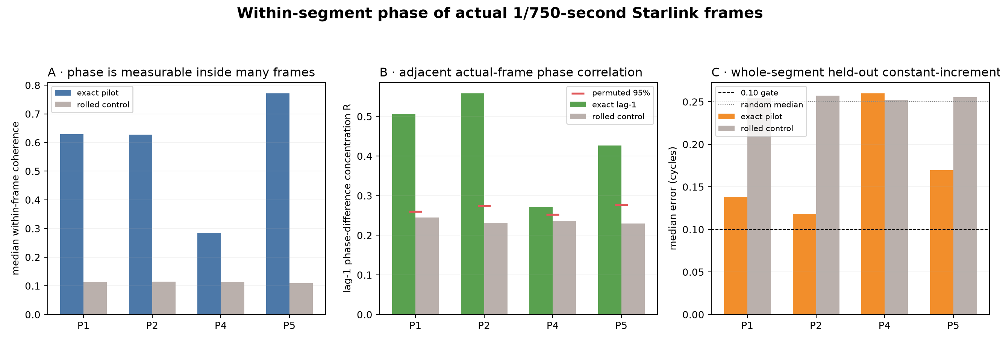
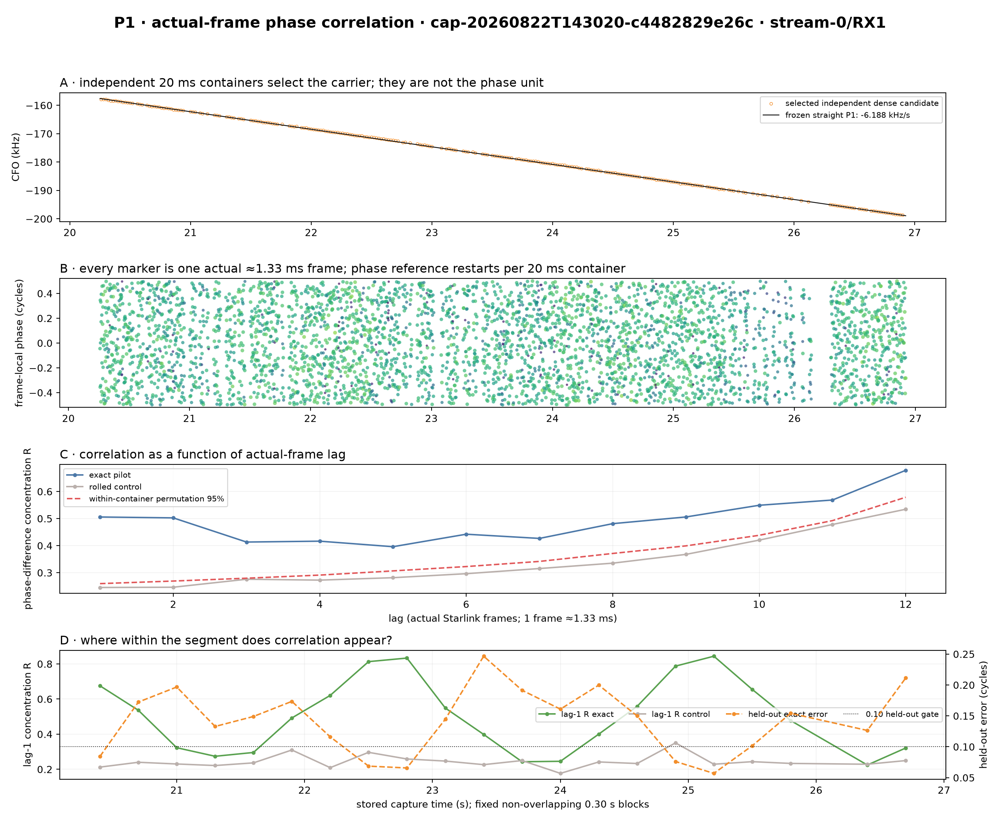
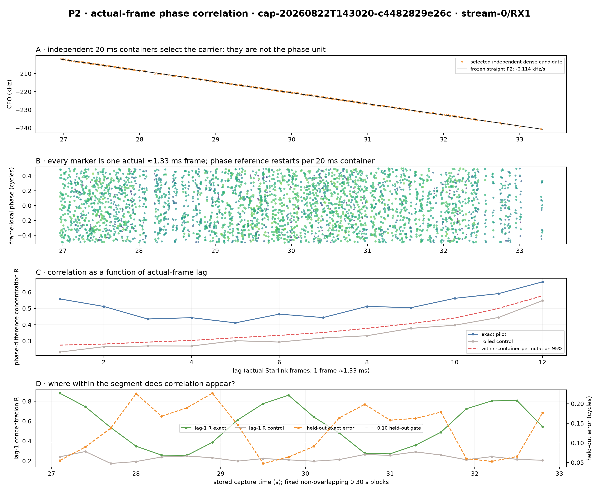
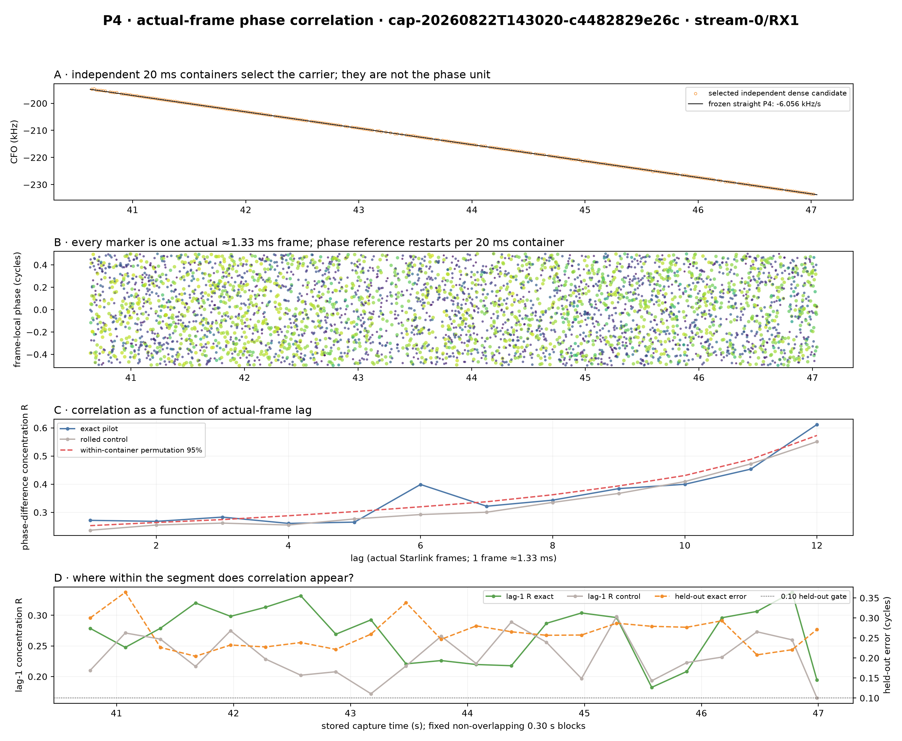
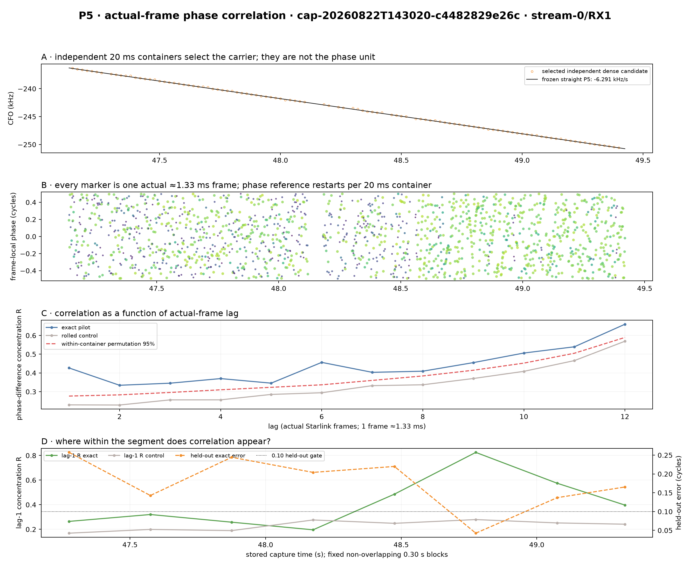

# Is carrier phase correlated inside individual straight CFO segments?

## Answer

Yes. **P1, P2, and late P5 contain intervals in which the phase of adjacent actual Starlink frames is correlated and one constant phase increment predicts held-out frames.** P2 is the most broadly consistent segment; P1 is intermittent, and P5 becomes useful late in the segment. P4 does not show practically useful frame-to-frame phase correlation under this estimator.

This report deliberately changes the unit of analysis from a boundary or a 20 ms acquisition probe to the actual approximately 1.33 ms Starlink frame. A 20 ms probe is only an independently acquired container holding about fifteen actual frames. All lag and prediction calculations below operate on those actual frames.

> **Most important limitation:** phase is comparable between actual frames inside one 20 ms
> container. Each next 20 ms container independently selects CFO and frame epoch, so this
> report pools within-container correlations by segment but does not claim one continuous
> absolute phase trace across an entire multi-second segment.

## Question and motivation

The boundary report asked whether phase could bridge P1→P2 or P4→P5. That is a harder question and obscures a prerequisite: do ordinary consecutive Starlink frames have predictable phase anywhere inside a single segment? Here P1, P2, P4, and P5 are analyzed one at a time, with no boundary phase jump fitted.

A segment may contain frame-local phase without containing inter-frame continuity. These are different statements. Local coherence asks whether the known symbols share one phase inside a frame. Lag correlation asks whether the phase difference between actual frames is repeatable. Held-out prediction asks whether that repeatability is strong enough to predict frames excluded from fitting.

## Frozen input and coverage

- Recording: `cap-20260822T143020-c4482829e26c`, `stream-0/RX1`, scope `sha256:424ec0775d22b40bd7f84ab693a65c412f5675c2c1aba6a4e3e89bf9342ba9ba`.
- Four frozen degree-1 segments: P1, P2, P4, and P5.
- Full segment intervals reacquired with back-to-back 20 ms dense Research windows.
- Each window: 81 coarse CFO hypotheses, 32 independently scored basins, GLRT-4096.
- Candidate association: nearest frozen straight line within 2.5 kHz and exact-minus-control margin≥0.05, after independent scoring.
- Phase estimator: Qin lower-edge symbols 2–65, one independent circular state per approximately 1/750-second frame.
- CFO model: one independently acquired constant CFO per 20 ms container. The frozen degree-1 line enters association/display only. No quadratic/cubic CFO fit.

| Segment | Frozen interval | CFO rate | Candidate windows | Selected windows | Actual frames |
|---|---:|---:|---:|---:|---:|
| P1 | 20.250–26.925 s | -6188.3 Hz/s | 333 | 269 (80.8%) | 3969 |
| P2 | 26.950–33.300 s | -6113.6 Hz/s | 317 | 230 (72.6%) | 3407 |
| P4 | 40.625–47.050 s | -6055.8 Hz/s | 320 | 297 (92.8%) | 4394 |
| P5 | 47.125–49.425 s | -6291.4 Hz/s | 114 | 106 (93.0%) | 1572 |

## Method

For actual-frame phases `φ[g,f]` in 20 ms container `g`, the lag-`L` statistic is `R[g,L] = |mean_f(exp(i·2π·(φ[g,f+L]−φ[g,f])))|`; the reported segment value is the mean of `R[g,L]` over containers. R near 1 means the phase increment is repeatable inside a container even if independently acquired containers have different residual CFO. R near 0 means it is diffuse. The rolled-pilot control and a within-container phase-order permutation provide two null comparisons.

A separate held-out test fits one constant phase increment using two of every three actual frames and predicts the interleaved third. A median error near 0.25 cycles is random circular prediction; ≤0.10 cycles is the exploratory useful-prediction gate. Fixed, non-overlapping 0.30 s blocks locate correlated parts without hand-drawing windows around favorable points. The duration is an exploratory report choice, not a production threshold. The reported best-block p-value compares the maximum block R with 300 matched phase-order permutations, correcting for searching all blocks inside that segment. A four-segment Bonferroni value is also reported; this is conservative and makes the family of P1/P2/P4/P5 searches explicit.

Synthetic controls verify the interpretation. A noisy constant-increment sequence has lag-1 R=0.984 and 0.014-cycle held-out error; random per-frame resets have R=0.230 and 0.246-cycle error.

## Segment-level results

| Segment | Exact/control within-frame coherence | Lag-1 R exact/control | Lag-1 four-segment p | Held-out exact/control error | Exact probes ≤0.10 | Best 0.30 s block R / blocks+segments p | Practical reading |
|---|---:|---:|---:|---:|---:|---:|---|
| P1 | 0.629/0.114 | 0.506/0.245 | 0.0133 | 0.138/0.255 cycles | 29.0% | 0.844 / 0.0133 | intermittent predictive blocks |
| P2 | 0.628/0.115 | 0.558/0.232 | 0.0133 | 0.118/0.257 cycles | 40.9% | 0.880 / 0.0133 | broadest correlation; late third predictive |
| P4 | 0.285/0.114 | 0.272/0.237 | 0.0133 | 0.260/0.252 cycles | 6.1% | 0.338 / 0.4385 | detectable but not predictive |
| P5 | 0.771/0.109 | 0.427/0.230 | 0.0133 | 0.170/0.255 cycles | 31.1% | 0.825 / 0.0133 | late segment predictive |

## P1

P1 contributes 3969 actual-frame estimates from 269 independently acquired containers. Its overall lag-1 concentration is 0.506 versus 0.245 for control; the matched permutation p-value is 0.0033 within the segment and 0.0133 after the four-segment correction. The overall held-out error is 0.138 cycles versus 0.255 for control.

The strongest fixed 0.30 s block is 25.050–25.350 s with lag-1 R=0.844, held-out error 0.057 cycles, and max-over-block permutation p=0.0033 within the segment and 0.0133 after the four-segment correction.

| Part | Interval | Probes | Actual frames | Lag-1 R exact/control | Held-out exact/control error |
|---|---:|---:|---:|---:|---:|
| early | 20.250–22.475 s | 94 | 1379 | 0.497/0.238 | 0.135/0.256 cycles |
| middle | 22.475–24.700 s | 94 | 1393 | 0.476/0.242 | 0.161/0.241 cycles |
| late | 24.700–26.925 s | 81 | 1197 | 0.550/0.257 | 0.113/0.253 cycles |

## P2

P2 contributes 3407 actual-frame estimates from 230 independently acquired containers. Its overall lag-1 concentration is 0.558 versus 0.232 for control; the matched permutation p-value is 0.0033 within the segment and 0.0133 after the four-segment correction. The overall held-out error is 0.118 cycles versus 0.257 for control.

The strongest fixed 0.30 s block is 26.950–27.250 s with lag-1 R=0.880, held-out error 0.055 cycles, and max-over-block permutation p=0.0033 within the segment and 0.0133 after the four-segment correction.

| Part | Interval | Probes | Actual frames | Lag-1 R exact/control | Held-out exact/control error |
|---|---:|---:|---:|---:|---:|
| early | 26.950–29.067 s | 80 | 1183 | 0.528/0.234 | 0.142/0.278 cycles |
| middle | 29.067–31.183 s | 96 | 1424 | 0.552/0.224 | 0.113/0.254 cycles |
| late | 31.183–33.300 s | 54 | 800 | 0.614/0.242 | 0.094/0.247 cycles |

## P4

P4 contributes 4394 actual-frame estimates from 297 independently acquired containers. Its overall lag-1 concentration is 0.272 versus 0.237 for control; the matched permutation p-value is 0.0033 within the segment and 0.0133 after the four-segment correction. The overall held-out error is 0.260 cycles versus 0.252 for control.

The strongest fixed 0.30 s block is 46.625–46.925 s with lag-1 R=0.338, held-out error 0.221 cycles, and max-over-block permutation p=0.1096 within the segment and 0.4385 after the four-segment correction.

| Part | Interval | Probes | Actual frames | Lag-1 R exact/control | Held-out exact/control error |
|---|---:|---:|---:|---:|---:|
| early | 40.625–42.767 s | 103 | 1529 | 0.296/0.239 | 0.244/0.239 cycles |
| middle | 42.767–44.908 s | 93 | 1367 | 0.242/0.233 | 0.265/0.266 cycles |
| late | 44.908–47.050 s | 101 | 1498 | 0.275/0.237 | 0.266/0.251 cycles |

## P5

P5 contributes 1572 actual-frame estimates from 106 independently acquired containers. Its overall lag-1 concentration is 0.427 versus 0.230 for control; the matched permutation p-value is 0.0033 within the segment and 0.0133 after the four-segment correction. The overall held-out error is 0.170 cycles versus 0.255 for control.

The strongest fixed 0.30 s block is 48.625–48.925 s with lag-1 R=0.825, held-out error 0.043 cycles, and max-over-block permutation p=0.0033 within the segment and 0.0133 after the four-segment correction.

| Part | Interval | Probes | Actual frames | Lag-1 R exact/control | Held-out exact/control error |
|---|---:|---:|---:|---:|---:|
| early | 47.125–47.892 s | 37 | 550 | 0.291/0.182 | 0.217/0.258 cycles |
| middle | 47.892–48.658 s | 31 | 463 | 0.342/0.249 | 0.205/0.293 cycles |
| late | 48.658–49.425 s | 38 | 559 | 0.628/0.260 | 0.090/0.217 cycles |

## Interpretation

P1, P2, and P5 each have a fixed 0.30 s block whose maximum lag-1 R survives the max-over-block permutation correction and whose independently reported held-out error is below 0.10 cycles. P2 is the broadest result: its late third also passes the 0.10-cycle held-out target. P5's useful behavior is concentrated late, and P1 alternates between strongly and weakly predictive blocks. These intervals support a constant residual-CFO phase model over consecutive actual frames inside a 20 ms container.

P4 illustrates why statistical and practical significance must be separated. Its overall lag-1 R is slightly above the permutation/control level and becomes detectable with thousands of frames, but held-out prediction is random-like and its best block does not survive the max-over-block control. P4 therefore does not supply a useful phase state.

That still does not provide a seconds-long continuous phase trajectory. Independent container acquisition changes the phase reference every 20 ms, and the recording lacks device sample counters across possible capture stalls. The next research implementation should start from the correlated P1/P2/P5 blocks and maintain one continuous timing/CFO/phase state across container boundaries, validating it on held-out actual frames before attempting P1→P2 continuity.

## Reproducibility

- Generator: `tools/report_within_segment_frame_phase.py`.
- Metrics: `figures/2026_08_22_within_segment_frame_phase/within-segment-frame-phase-metrics.json`.
- Compact actual-frame states: `segment-frame-phase-states.jsonl.gz`.
- Dense candidates and run configurations: `candidates/{p1,p2,p4,p5}/`.
- All random controls use the persisted seed in the metrics artifact.
