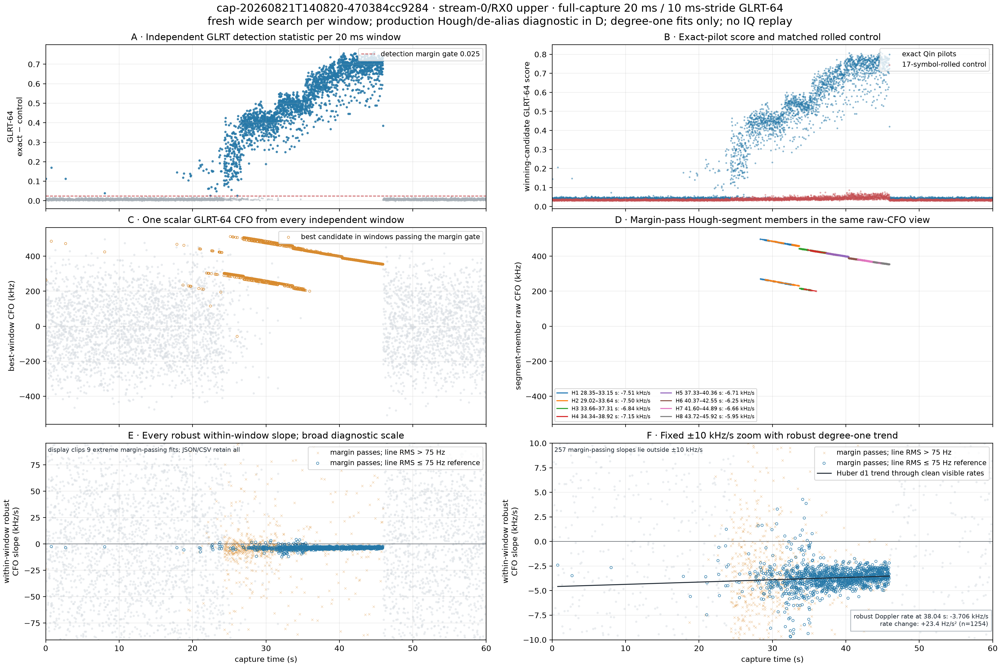

# Full-capture 20 ms GLRT and within-window robust CFO slopes

## Question

For `cap-20260821T140820-470384cc9284`, what do we see when the previously
studied `stream-0/RX0` upper-edge path is searched over the complete 60 s
capture with independent 20 ms GLRT-64 windows at 10 ms stride? In particular,
can every window also produce a robust local estimate of CFO slope from the
actual pilot frames inside that window?

## Result at a glance

Yes. The run completed all **5,999** windows. A fresh wide acquisition was
performed in every window, and all windows contained enough complete pilot
frames for one Huber degree-one line. The GLRT exact-minus-control margin passed
the current scanner threshold of 0.025 in **2,127 windows (35.46%)**. Because
adjacent windows overlap by 10 ms, that percentage is coverage, not 2,127
statistically independent detections.



*Figure 1. All six panels share the complete capture-time axis. The left column
preserves the broad all-window context. Top right separates the exact and
rolled-control scores that form the top-left margin. Middle right uses the same
raw-CFO coordinates and Y scale as middle left, but displays only
threshold-passing observations retained by the production residual-Hough,
alias-map, seeded-alias-EM, and Huber degree-one path; its legend gives every
published track's interval and Doppler rate. Bottom right fixes the slope axis
to +/-10 kHz/s and overlays one robust degree-one trend through its clean blue points.
Each blue/orange slope point is itself a separate robust straight line through
the 14--15 actual-frame CFO measurements in one window. The 75 Hz line-RMS
split is an existing local-pilot reference used only to make this dense plot
readable; it is not, by itself, a qualification verdict. Every value,
including clipped slopes, remains in the JSON and CSV.*

The main observations are:

- Activity is intermittent before about 24 s, then becomes sustained. The
  longest uninterrupted margin-pass run is **34.71--45.94 s**; it contains
  1,122 overlapping windows and reaches a margin of 0.762.
- Panel C contains two distinct descending CFO ridges over part of the active
  interval: approximately 300 to 200 kHz and 510 to 350 kHz. This means a
  single “best candidate” can represent different carrier/timing basins in
  different windows. It must not yet be treated as one phase-continuous carrier.
- The production linear Hough/de-alias path publishes **eight** bounded tracks
  from the passing winners. It selected 1,369 branch observations from the
  2,127 inputs. Their robust rates span **-7.51 to -5.95 kHz/s**. Four further
  ranked Hough proposals were omitted by the configured eight-track publication
  ceiling.
- Of the margin-passing windows, **1,258** also have within-window line RMS at
  or below the 75 Hz display reference. Their median robust slope is
  **-3.666 kHz/s**, with a 10th--90th percentile range of
  **-4.829 to -2.645 kHz/s**.
- The clean negative-slope band is considerably more stable after about 34 s.
  High-error slopes are concentrated where the GLRT ridge is weaker or where
  the best basin can switch. A robust fit reduces individual frame outliers; it
  cannot make a wrong carrier/basin choice correct.
- The robust line in Panel F uses 1,254 clean points inside the visible band. At
  its robust reference time, 38.040 s, it gives a Doppler rate of **-3.706
  kHz/s** and a rate change of **+23.4 Hz/s^2**. Its residual RMS is still
  1.203 kHz/s, so it is a population trend, not evidence that all points share
  one precise rate.

The discrepancy between the second-scale Hough rates (-7.51 to -5.95 kHz/s)
and the 20 ms population trend (-3.706 kHz/s at 38.040 s) is a result, not a
unit conversion. Panel D measures the slope of associated CFO ridges over
seconds. Panel F summarizes many noisy local slopes inferred inside individual
20 ms windows. Until carrier continuity and held-out agreement are established,
the short-window estimates must not replace the Hough ridge rate.

## Exact method

The analysis is intentionally local and linear:

1. Read the manifest-verified CI16 recording through the read-only recording
   store. The exact manifest digest is
   `sha256:d45409ea3620eccb705eac024a4d814b5c2779f13bcee974311c9f09477adb75`.
2. Schedule complete 20 ms windows every 10 ms from 0 through 60 s. This gives
   `(60.000 - 0.020) / 0.010 + 1 = 5,999` windows.
3. In each window, independently search residual CFO from -400 to +400 kHz
   using the current Standard acquisition geometry: 80 kHz coarse spacing,
   500 Hz fine spacing, 100 Hz conditioned spacing, and ten retained basins
   separated by at least 10 kHz CFO or five epoch samples.
4. Score GLRT-64 exact and 17-symbol-rolled control pilots for all ten retained
   candidates. Select the candidate with the largest exact-minus-control
   margin. No previous or next window contributes to this choice.
5. Report that candidate's `tracking_cfo_hz` as the window's single scalar
   GLRT CFO. This is what Panel C shows.
6. Using that same window-local epoch and CFO only, estimate a separate carrier
   frequency in every complete 750 Hz Starlink frame. Each frame estimate uses
   all 300 known Qin pilot symbols and all eight edge subcarriers. There are 14
   complete frames in 5,990 windows and 15 in the remaining nine.
7. Fit `CFO(t) = intercept + slope * (t - reference)` with MAD-scaled Huber
   iteratively reweighted least squares. The Huber fit downweights large frame
   residuals without deleting them or changing membership.
8. For Panel D only, retain the winner from every margin-passing window and run
   the same bounded linear association path used by Standard analysis:
   residual-Hough segmentation, CFO alias-map construction, seeded integer-alias
   EM, and MAD-scaled Huber degree-one refinement. The input timestamp is the
   20 ms window start, matching the production pilot-detection convention. For
   display, lift every selected canonical model point back by its fitted integer
   alias index so Panel D remains in the same raw-CFO coordinates as Panel C.
9. For Panel F, retain margin-passing slopes with within-window line RMS no
   greater than 75 Hz and rates inside the displayed +/-10 kHz/s band, then fit
   one MAD-scaled Huber degree-one trend to rate versus time.

There are no quadratic or cubic radio terms. Neighboring state is not used to
produce any 20 ms GLRT or within-window slope. A trajectory is used only for
the explicitly labeled Panel D association diagnostic. No IQ replay result,
TLE, or Kalman state is used.

## How to read the panels

### A: GLRT detection

The vertical value is `exact_score - control_score`. The red dashed line is the
0.025 scanner threshold. This is a candidate-only known-pilot detection
statistic, not payload decoding or satellite identification.

### B: exact and rolled-control scores

The top-right panel exposes the two score components whose difference appears
at top left. During the sustained signal, the exact Qin-pilot score separates
strongly from the symbol-rolled negative control. This makes clear that the
large margin is driven by the expected pilot, not a simultaneous rise in both
templates.

### C: raw 20 ms window CFO

This is one scalar frequency offset for one winning candidate per window. The
middle-left panel retains below-threshold points as pale context. The clean
descending ridges are the signal-level result. Jumps between ridges are
candidate/basin changes; connecting those jumps into one smooth Doppler curve
without an alias model would be an error.

### D: production Hough segmentation and de-aliasing

Panel D starts with the 2,127 winners that pass Panel A's threshold. It does not
use the pale below-threshold points and it does not recover the other nine
acquisition candidates from each window. Residual Hough proposes bounded
straight segments under the configured 227.273 kHz alias spacing. The alias
map and seeded integer-alias EM then choose one candidate/lift per probe for
each seed, and a final Huber degree-one fit reports the track rate. The plot
then maps each retained point and fitted line back to its observed raw alias
ridge. Thus Panels C and D have identical CFO units, coordinates, and Y limits;
Panel D differs by showing only observations belonging to retained segments.

| Track | Interval (s) | Selected observations | Alias indices | Robust rate (kHz/s) | RMS (Hz) |
| --- | ---: | ---: | --- | ---: | ---: |
| H1 | 28.35--33.15 | 165 | 2, 3 | -7.508 | 119.8 |
| H2 | 29.02--33.64 | 124 | 2, 3 | -7.502 | 95.1 |
| H3 | 33.66--37.31 | 207 | 1, 2 | -6.842 | 110.9 |
| H4 | 34.34--38.92 | 110 | 1, 2 | -7.150 | 285.6 |
| H5 | 37.33--40.36 | 239 | 2 | -6.705 | 150.9 |
| H6 | 40.37--42.55 | 132 | 2 | -6.246 | 93.0 |
| H7 | 41.60--44.89 | 260 | 2 | -6.661 | 117.5 |
| H8 | 43.72--45.92 | 132 | 2 | -5.950 | 94.8 |

Overlapping tracks such as H1/H2, H3/H4, and H6/H7 are competing or
overlapping Hough segments, not eight established satellites. The pipeline
publishes bounded candidate tracks; it does not by itself establish carrier
identity, phase continuity, or satellite attribution. Disconnected alias
components retain independent canonical frequency origins internally, but the
figure deliberately displays their corresponding raw CFOs for direct comparison
with Panel C.

### E and F: 20 ms line slope

This is the slope of a robust degree-one line through the window's independent
actual-frame CFO measurements. Blue circles pass the GLRT margin and have line
RMS no greater than 75 Hz. Orange crosses pass the GLRT margin but have larger
line residuals. Pale gray points are fits made below the detection margin and
should be treated as noise diagnostics. Bottom left keeps a broad robust scale;
bottom right is the fixed +/-10 kHz/s view requested for close inspection of
the negative-slope band. Its thin black line is a robust degree-one fit through
the clean blue points in that band. The annotated **-3.706 kHz/s** is the
fitted Doppler rate at 38.040 s. The **+23.4 Hz/s^2** value is the change of
that fitted rate with capture time; it is not another Doppler-rate estimate.

The slope is very short-baseline evidence: 14--15 points across 20 ms. It is
valuable for seeing whether a local straight-line model is plausible, but it
is noisier than a 50--75 ms qualified segment. Before using it as orbital
Doppler rate, adjacent windows still need carrier/basin association, phase
support, a held-out prediction check, and receiver agreement.

## Reproduction and outputs

Run from the repository root:

```bash
.venv/bin/python tools/analyze_full_capture_glrt20ms.py
```

The script performs one bounded sequential pass over the compressed recording
and runs at most four window analyses concurrently. It does not write beneath
`/srv/bulk/leo`.

- [Window-level JSON](figures/2026_08_23_140820_glrt20ms/cap-20260821T140820-470384cc9284-stream-0-rx0-upper-glrt20ms.json)
- [Window-level CSV](figures/2026_08_23_140820_glrt20ms/cap-20260821T140820-470384cc9284-stream-0-rx0-upper-glrt20ms.csv)
- [Six-panel PNG](figures/2026_08_23_140820_glrt20ms/cap-20260821T140820-470384cc9284-stream-0-rx0-upper-glrt20ms.png)

The JSON explicitly records that searches use no neighboring state while the
overlapping windows are statistically correlated. It now also persists every
Panel D Hough/de-alias configuration, branch model, selected raw and canonical
observation, and Panel F robust-trend diagnostic. Every raw window slope and
fit diagnostic remains present even when the PNG clips extreme noise fits.
