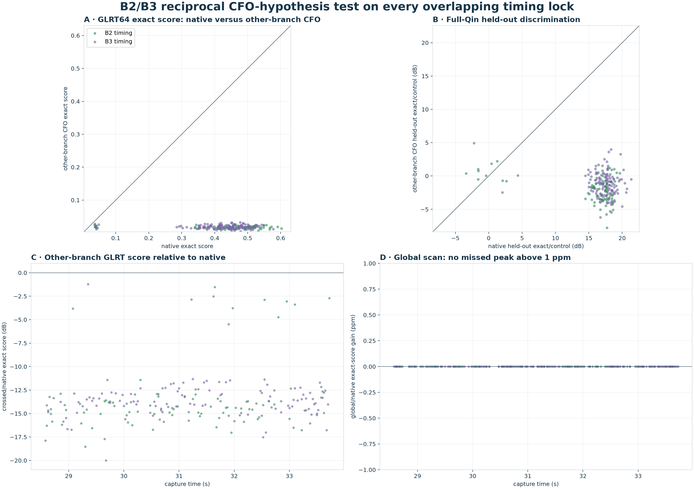
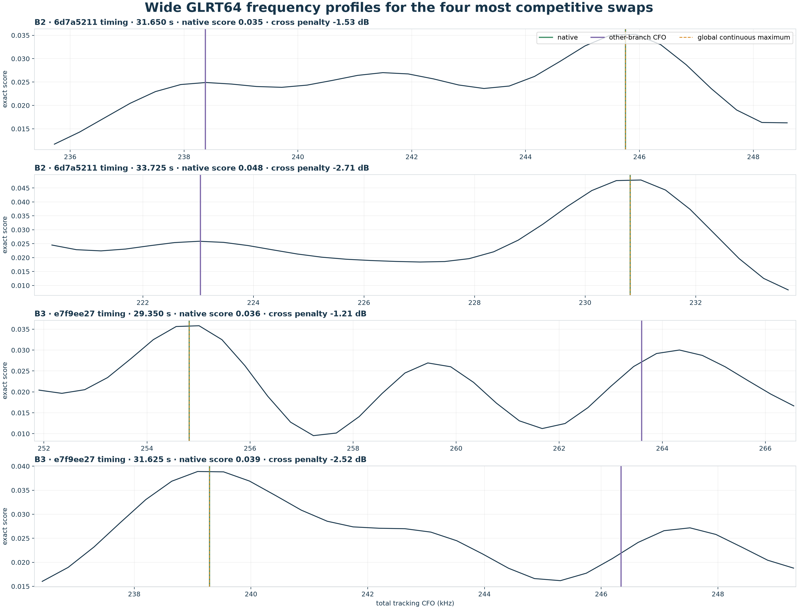

# Reciprocal B2/B3 Qin hypothesis audit

## Result

B2 and B3 are not duplicate points.  In the 50 probes where both
were selected, their median CFO separation is
9380 Hz and their circular timing-epoch
separation is 381.0 samples
(152.4 µs).

For every timing lock in the common 28.575–33.725 s interval, this audit holds
the timing fixed, substitutes the other branch's interpolated continuous CFO,
and locally refines that substituted basin.  It then repeats the 300-symbol
even-fit/odd-validation test.

| timing held fixed | n | median CFO separation (Hz) | median crossed GLRT penalty | crossed GLRT wins | native held-out dB | crossed held-out dB | crossed validation wins | p90 global gain (ppm) |
| --- | ---: | ---: | ---: | ---: | ---: | ---: | ---: | ---: |
| B2 · 6d7a5211 | 100 | 9327 | -14.36 | 0.0% | 17.19 | -1.81 | 7.0% | 0.000 |
| B3 · e7f9ee27 | 111 | 9300 | -13.69 | 0.0% | 17.66 | -1.09 | 0.9% | 0.000 |

The crossed CFO never beats the native GLRT score in either direction.  The
median penalty is -14.36 dB on B2 timing
locks and -13.69 dB on B3 timing locks.
The held-out Qin discrimination falls from medians of
17.19 and
17.66 dB to
-1.81 and
-1.09 dB, respectively.

## Global-maximum check

The local-minimum hypothesis is checked independently by refining every local
maximum on the complete 512-bin GLRT frequency profile, rather than only the
persisted winning bin.  The wide profiles below show the four swaps for which
the other branch was most competitive.  None of the 211 locks has a
global improvement above 1 ppm; the remaining differences are floating-point
roundoff.

The comparison changes CFO only.  It does not claim that a CFO substitution is
a complete satellite identity test: B2 and B3 also have different timing locks,
and a complete swapped timing-plus-CFO hypothesis is simply the other native
candidate already observed in the shared probes.
