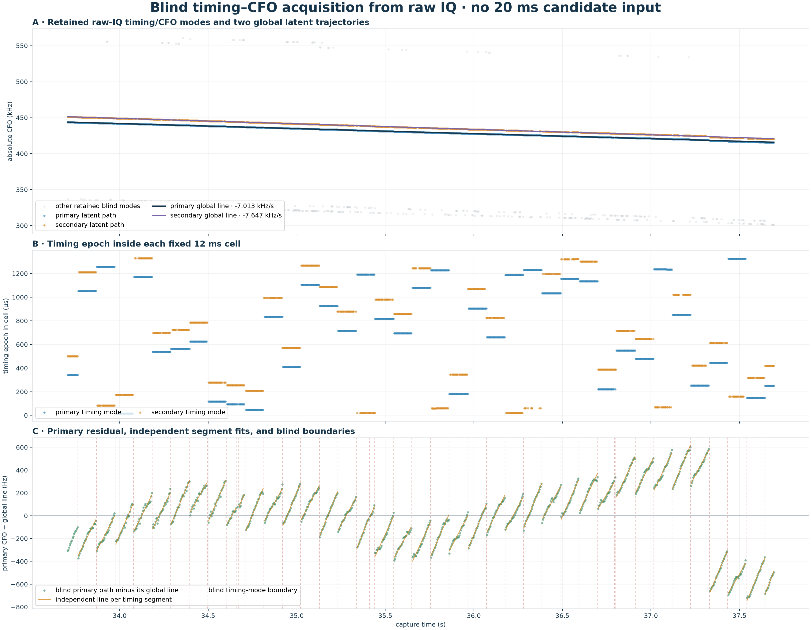

# Blind timing–CFO experiment on `470384`

## Isolation

This experiment opens only the recording.  Before the blind fit completes, it
does not load the persisted pilot scan, any 20 ms CFO, timing epoch, branch,
trajectory, TLE, or earlier frame manifest.  Overlapping 12 ms raw-IQ cells are
placed every 4 ms; inside each cell, timing over the complete 1.333 ms phase and
absolute CFO over ±1.2 MHz are searched jointly.  Multiple Qin-supported modes
are retained rather than selecting by branch proximity.

| trajectory | CFO at reference | rate | selected cells | weighted RMS |
| --- | ---: | ---: | ---: | ---: |
| primary | 429916.3 Hz | -7.013 kHz/s | 978 | 269.6 Hz |
| secondary | 436207.2 Hz | -7.647 kHz/s | 864 | 279.2 Hz |

The old shifted-grid boundary audit is loaded only after the blind trajectories
and blind joint timing/CFO events have been frozen.

## Result

The primary path divides blindly into 43 constant-timing
segments; 41 contain at least five cell fits.
Of its 42 boundaries,
24 have adjacent cells on both sides and directly
show both a ≥100 Hz CFO reset and a ≥20-sample timing jump; the remainder bracket
short acquisition gaps.
Their median boundary spacing is 104.0 ms.
The per-segment CFO slopes have median
-3.656 kHz/s and a 10–90% range of
-4.269 to
-3.154 kHz/s.  Those small lines fit to a
median RMS of 14.2 Hz, versus
269.6 Hz around one global line.

After freezing those blind boundaries, the independent old boundary audit finds
10 of
11 old boundaries within 12 ms.  Its median
old-to-blind distance is 2.0 ms
and its 90th percentile is 10.0 ms.
The reverse distance is not a completeness metric because that old audit stored
only a sparse, selected set of boundaries.

## Interpretation

The sawtooth is not created by the persisted 20 ms windows: it reappears when
timing and absolute CFO are searched directly from raw IQ on a different 12 ms
support with a 4 ms hop.  Because 4 ms is exactly three 1.333 ms frames, a single
continuous frame train would retain one timing phase.  Instead, the timing phase
is piecewise constant and changes at the CFO resets.  This supports real
roughly-100 ms burst or timing-mode handoffs.  It does not by itself identify
the transmitter or prove which slope should be used as satellite Doppler.
