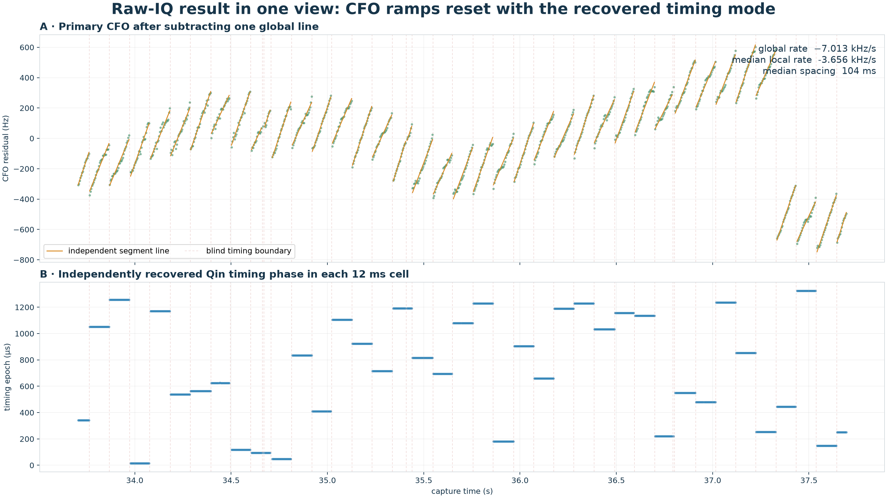
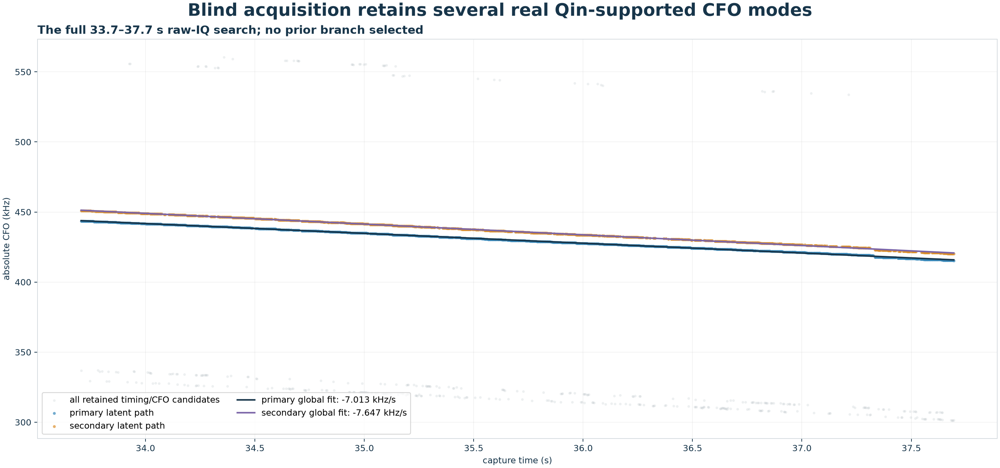
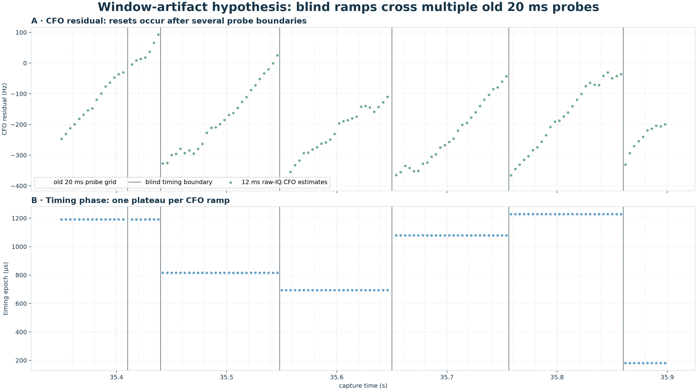
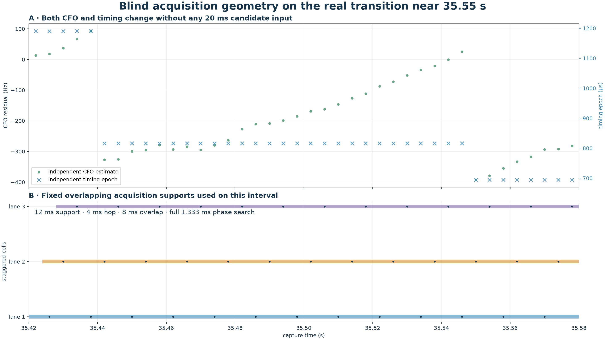
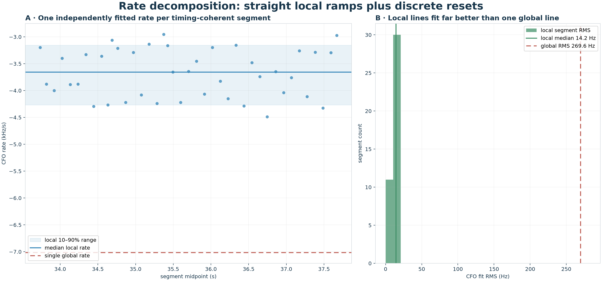
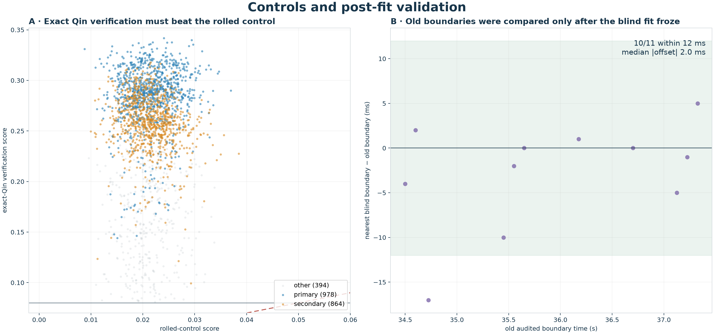

# Blind raw-IQ timing–CFO analysis of the approximately 100 ms Starlink pilot sawtooth

## Abstract

This report tests whether the approximately 100 ms carrier-frequency-offset
(CFO) ramps observed in a Starlink Qin edge-pilot recording are real signal
structure or an artifact of the earlier 20 ms GLRT processing windows.  The
test reanalyzes raw IQ from capture
`cap-20260821T140820-470384cc9284`, `stream-0`, receiver 0, upper edge,
33.7–37.7 s.  It does not use a persisted GLRT candidate, 20 ms CFO, branch,
timing epoch, trajectory, TLE, or earlier frame manifest before fitting.
Instead, it searches absolute CFO and the complete 1.333 ms Qin timing phase
jointly in fixed 12 ms cells placed every 4 ms.

The blind search retained 2,236 Qin-supported timing/CFO candidates in 985 of
998 cells and independently recovered two long CFO paths.  The primary path
contains 978 cells and splits into 43 timing-coherent segments with a median
boundary spacing of 104 ms.  Forty-one segments support local line fits.  Their
median CFO rate is -3.656 kHz/s, their 10–90% range is -4.269 to
-3.154 kHz/s, and their median line-fit RMS is 14.2 Hz.  A single global line
has rate -7.013 kHz/s and RMS 269.6 Hz because it also absorbs the repeated
negative CFO resets.  Twenty-four boundaries are directly bracketed by
adjacent cells showing both a timing-phase jump and at least a 100 Hz CFO reset.
Only after freezing the blind result was the old boundary audit loaded: 10 of
its 11 independently stored boundaries lie within 12 ms of a blind boundary,
with a median absolute difference of 2 ms.

The evidence rejects the narrow hypothesis that the sawtooth is created by the
20 ms GLRT grid.  The ramps and resets survive a different support and grid,
and the independently recovered Qin timing phase changes with the CFO resets.
The result supports real burst, timing-mode, beam, or transmitter-state
structure in the received signal.  It does **not** identify a satellite or
prove that every fitted rate is orbital Doppler.  The within-segment rate is
the cleaner Doppler candidate; the global rate is demonstrably contaminated by
discrete signal resets.



**Figure 1.** The primary CFO residual is a family of straight ramps separated
by resets.  The lower panel is the timing phase recovered independently in the
same 12 ms raw-IQ cells.  Its plateaus change at the ramp boundaries.

## Data used

The experiment uses one raw recording and two explicitly identified derived
datasets.  The old derived dataset is used only for a post-fit comparison.

| role | data ID and scope | use in this report |
| --- | --- | --- |
| Raw recording | `cap-20260821T140820-470384cc9284`; recording-manifest SHA-256 `d45409ea3620eccb705eac024a4d814b5c2779f13bcee974311c9f09477adb75` | Sole input to blind acquisition and fitting |
| Radio lane | `stream-0`, radio serial `1040005e0b100007100010000bf33a5d4d`, receiver 0, upper Qin edge | The analyzed complex IQ channel |
| RF/sample configuration | 1,940,312,500 Hz stream center; 2,500,000 samples/s; 2.5 MHz applied bandwidth | Converts sample positions to capture time and defines baseband CFO |
| Time interval | 33.700–37.700 s; samples 84,250,000–94,250,000 | Four-second worked interval |
| Blind result | algorithm ID `470384-blind-overlapping-cell-timing-cfo-v1`, schema 1 | Frozen candidates, paths, segments, events, and statistics |
| Post-fit audit | `shifted-grid-boundary-audit.json`; analysis-scope ID `sha256:ccdc4b152617f6e99b23044948cea7be040905cf1e7dd074bb36668b36dc0963` | Boundary comparison performed after the blind fit |
| Legacy analysis run | `capture-438ad263e01048ef82f660975ec55a08` | Provenance of the old audit only; not an input to blind fitting |

The CFO values reported here are baseband carrier offsets under zero receiver
frequency calibration.  An unknown LNB offset changes the absolute intercept.
It does not by itself explain the repeated approximately 300 Hz resets or the
piecewise timing phase.

## Introduction

A satellite's radial velocity produces a smooth Doppler shift.  Over a short
interval that shift is well approximated by a line, and its slope is a Doppler
rate.  A receiver-chain frequency offset, including an uncertain LNB offset,
can move the entire line vertically without destroying the usefulness of its
local slope.  The difficulty in this recording is different: the Qin-compatible
CFO estimates do not follow one smooth line.  They form short ramps, reset, and
then form another ramp.

Earlier analyses found this structure using 20 ms GLRT probes and later
1.333 ms frame-level fits.  That raised a serious causal concern.  If frame
timing and initial CFO were inherited from the 20 ms probes, the apparent
sawtooth might merely reproduce the container boundaries or a branch-selection
decision.  A clean test must recover both timing and CFO again from raw IQ on a
different grid, before it knows any old branch or boundary.

The blind search does so and also retains more than one plausible mode.  The
figure below shows all candidates that passed the exact-Qin and rolled-control
gates.  Two dense long-lived paths near 430–450 kHz are fitted without first
choosing the old B4 branch.  Other retained modes, including the lower band
near 300–335 kHz, remain visible instead of being silently discarded.



**Figure 2.** All retained timing/CFO modes from the full raw-IQ search.  The
primary and secondary latent paths are selected globally across cells, while
the gray candidates show alternatives retained by the acquisition stage.

## Motivation and hypothesis

The scientific question is not whether the original 20 ms analysis found a
strong signal; it did.  The question is whether the *shape* attributed to that
signal was supplied by its analysis windows.

Two competing hypotheses were defined before the blind comparison:

1. **Window-artifact hypothesis.** The CFO resets are caused by the 20 ms probe
   grid, by a CFO correction attached to those probes, or by timing hypotheses
   selected using the old branch.  Under this hypothesis a raw search on a
   different support should lose the regular sawtooth, or its changes should
   occur at every 20 ms boundary without a corresponding independently
   recovered timing change.
2. **Signal-structure hypothesis.** The received Qin-compatible signal contains
   approximately 100 ms timing/CFO states.  Under this hypothesis the ramps
   should persist under a different cell width and hop, and a CFO reset should
   coincide with a change in the timing mode selected directly from raw IQ.

The blind experiment uses 12 ms cells with a 4 ms hop.  Four milliseconds is
exactly three nominal 1/750-second Starlink frames.  Therefore, if one
continuous frame train remains dominant, its timing phase inside successive
cells should stay constant.  In the real data it does not: the timing phase is
piecewise constant, and its changes delimit the CFO ramps.  Each ramp spans
several positions on the old 20 ms grid.



**Figure 3.** A 550 ms real-data zoom.  Pale red lines show where the old 20 ms
probe boundaries would fall; dark lines are boundaries discovered by the blind
12 ms analysis.  The blind CFO ramps cross multiple old boundaries.  Their
resets correspond to timing-phase changes rather than to every 20 ms probe.

## Approach

The analysis is deliberately separated into a blind phase and a comparison
phase.

During the blind phase, the tool opens only the recording store.  It reads
receiver 0 from `stream-0` over 33.7–37.7 s and places 12 ms cells every 4 ms.
Within each cell it searches the entire 1.333 ms timing phase and absolute CFO
over ±1.2 MHz using the known upper-edge Qin pilot.  Candidate selection
requires an exact-Qin verification score of at least 0.08 and an advantage of
at least 0.03 over an identically processed symbol-rolled control.  Multiple
timing/CFO modes are retained.

A global latent-line fit then chooses at most one candidate per cell while
testing line hypotheses across the full four seconds.  The objective combines
the Qin-minus-control margin with distance from the proposed line; it does not
use distance from an old GLRT branch.  After refining the primary line, a
second line is fitted after excluding candidates within 3 kHz of the primary.

The primary selected path is segmented whenever consecutive selected cells are
missing or their recovered timing epochs differ by more than 20 samples
(8 microseconds).  Each segment with at least five points receives an ordinary
least-squares CFO line.  Blind boundaries, local rates, and direct adjacent-cell
events are frozen at this point.  Only then is the old shifted-grid audit opened
for the boundary comparison.



**Figure 4.** The actual transition around 35.55 s and the acquisition supports
used to measure it.  Each cell spans 12 ms, successive cells start 4 ms apart,
and no old 20 ms CFO or timing estimate enters the calculation.

## Results

### Acquisition and path inventory

The four-second interval contains 998 scheduled cells.  Of these, 985 produce
at least one candidate passing the Qin/control gates.  The frozen result holds
2,236 candidates in total.  The primary global path selects 978 cells; the
secondary selects 864 cells after primary-neighborhood exclusion.

| model | CFO at model reference | global CFO rate | selected cells | weighted global RMS |
| --- | ---: | ---: | ---: | ---: |
| Primary | 429,916.3 Hz at 35.690118 s | -7.013 kHz/s | 978 | 269.6 Hz |
| Secondary | 436,207.2 Hz at 35.677433 s | -7.647 kHz/s | 864 | 279.2 Hz |

The existence of two close, high-support paths is itself important: a blind
receiver must preserve alternative timing/CFO modes until later association.
The present experiment does not claim that the two paths are two satellites.

### Timing-coherent segments and direct resets

The primary path divides into 43 timing-coherent segments, giving 42
boundaries.  Forty-one segments contain at least five CFO measurements.  The
median boundary spacing is 104 ms.  Twenty-four boundaries have adjacent cells
on both sides and satisfy both direct criteria: a timing jump greater than 20
samples and an absolute CFO-residual jump of at least 100 Hz.  The remaining
boundaries bracket short acquisition gaps and therefore do not support a
same-strength adjacent-cell assertion.

All 24 directly measured CFO jumps are negative.  Their median is approximately
-311 Hz and their 10–90% range is approximately -396 to -274 Hz.  This repeated
one-sided step is incompatible with independent zero-mean frame noise.

### Local rate versus global rate

The local lines are both consistent and much more accurate descriptions of the
measurements than one global line:

| statistic | value |
| --- | ---: |
| Median local CFO rate | -3.656 kHz/s |
| Local CFO-rate 10–90% range | -4.269 to -3.154 kHz/s |
| Median local line-fit RMS | 14.2 Hz |
| Primary global CFO rate | -7.013 kHz/s |
| Primary global line RMS | 269.6 Hz |
| Global/local RMS ratio | 19.1× |

The approximately 3.36 kHz/s difference between the median local rate and the
global rate is not a second independent Doppler measurement.  It is the scale
of the long-term contribution produced when repeated negative resets are
absorbed into one line.  Consequently, the global rate cannot be interpreted as
pure orbital Doppler without a model for the resets.



**Figure 5.** Left: 41 independent timing-segment rates cluster near
-3.66 kHz/s, far from the one-line global rate.  Right: segment lines fit with
approximately 14 Hz median RMS while the global line has approximately 270 Hz
RMS.

### Post-fit comparison with the old boundaries

After the blind boundaries were frozen, the old audit supplied 11 boundaries
with non-null mode-separation measurements.  Ten lie within 12 ms of a blind
boundary.  The median absolute distance is 2 ms and the 90th percentile is
10 ms.  The remaining old boundary, at 34.725 s, is 17 ms from its nearest
blind boundary and lies in a region with a short acquisition gap.

The comparison is intentionally directional.  The old audit stored only a
sparse selected set, so the distance from every blind boundary to that sparse
list is not a completeness statistic.  The meaningful question is whether the
old boundaries that were stored are independently recovered by the blind
analysis; almost all are.

## Methods

### Raw-IQ extraction

The recording is opened through `RecordingStore` at `/srv/bulk/leo` and verified
against its persisted manifest.  Only `stream-0`, receiver 0 is read.  CI16
samples are converted to unit-scaled complex values.  The analyzed range is
10,000,000 samples long.  The recording manifest reports the stream as complete,
with 150,000,000 captured samples and no recorded gaps, clipped samples,
constant-IQ refills, missing samples, or overflows.  Hardware sample-loss
observability is false, so those counters should not be overstated as an
external proof of perfect RF continuity.

### Joint timing and CFO acquisition

Each 12 ms cell contains 30,000 samples and begins 10,000 samples after the
previous cell.  The search configuration is:

- residual CFO range: -1.2 to +1.2 MHz;
- coarse CFO spacing: 40 kHz;
- fine search: ±40 kHz at 500 Hz spacing;
- conditioned refinement: ±3 kHz at 100 Hz spacing;
- complete nominal 1.333 ms timing phase;
- 16 retained acquisition candidates before quality filtering;
- minimum five-frame support;
- 20 kHz separation between retained acquisition CFO basins.

The receiver-frequency calibration is deliberately zero.  The fit therefore
does not inherit an LNB correction or a previously estimated branch intercept.

### Qin-specific control

Every retained candidate is evaluated with the exact known Qin upper-edge
pilot and with a symbol-rolled sequence processed identically.  Retention
requires both an exact verification score of at least 0.08 and
`exact − control ≥ 0.03`.  The control tests sequence specificity; it is not a
general RF-noise p-value.  Candidate discovery and verification are parts of
the same acquisition procedure, so these scores should be read as deterministic
signal-quality evidence rather than a calibrated false-alarm probability.

### Global latent paths and segmentation

The primary line search proposes slopes from candidate pairs separated by more
than one second, rejects rates outside ±50 kHz/s, and maximizes a cell-wise
objective with a 500 Hz Gaussian CFO scale.  Eight weighted least-squares
iterations refine the chosen candidate in each cell.  Candidates farther than
2 kHz from the refined line do not enter the reported line statistics.  The
secondary fit repeats the procedure after excluding candidates within 3 kHz of
the primary line.

The selected primary path is split on a missing-cell handoff or a recovered
timing-epoch change greater than 20 samples.  Segment lines require at least
five selected cells.  Direct events impose the additional requirement that the
global-line residual changes by at least 100 Hz across adjacent cells.

### Causal isolation and validation

The blind script's input declaration records
`raw_recording_only_before_fit: true` and an empty
`persisted_analysis_inputs_before_fit` list.  The old shifted-grid JSON is
loaded only by `external_comparison`, after candidates, latent lines, selected
paths, segments, and events have been created.  This ordering is central to the
experiment: the old boundaries test reproducibility but cannot steer discovery.



**Figure 6.** Left: retained exact-Qin scores versus their symbol-rolled
controls; the primary and secondary paths occupy the strongest sequence-specific
region.  Right: signed offsets from each old audited boundary to the nearest
blind boundary, computed only after the blind fit was frozen.

### Limitations

This is a mechanism experiment on one receiver lane and one four-second
interval.  It establishes that the measured sawtooth is not supplied by the old
20 ms GLRT grid.  It does not establish whether a reset corresponds to a
satellite, beam, gateway, scheduler, timing-lattice handoff, or transmitter
chain.  It also does not determine whether the primary and secondary latent
paths are distinct physical emitters or alternative signal modes.  No TLE or
satellite identity is used here.

The local slope is a better candidate for physical Doppler because it is
measured inside a stable timing segment, but that interpretation still requires
cross-capture repeatability, receiver/common-mode controls, and comparison with
predicted orbital Doppler rate.  This report should therefore be read as a
validated signal-structure result, not as satellite association.

## Conclusion

The approximately 100 ms Qin-pilot CFO sawtooth survives a causally isolated
raw-IQ reanalysis on a 12 ms/4 ms grid.  The CFO resets are accompanied by
independent timing-mode changes; timing-coherent ramps have approximately
14 Hz median line error and cluster around -3.66 kHz/s; and old stored
boundaries are recovered after the fact with 2 ms median absolute discrepancy.
The 20 ms window-artifact hypothesis is therefore rejected for this recording.

For downstream PNT or satellite matching, the practical implication is direct:
do not treat the four-second global CFO slope as a pure Doppler rate.  Estimate
Doppler within timing-coherent segments, preserve the reset process as a
separate latent state, and defer physical association until TLE rate and
cross-receiver evidence are introduced.

## Reproduction and artifacts

Run the blind experiment from the repository root:

```bash
.venv/bin/python tools/report_470384_blind_timing_cfo.py
```

Regenerate the six section figures from the frozen blind result:

```bash
.venv/bin/python tools/report_470384_blind_timing_cfo_figures.py
```

The principal artifacts are:

- `reports/figures/2026_08_23_470384_blind_timing_cfo/blind-timing-cfo-results.json`;
- `reports/figures/2026_08_23_470384_blind_timing_cfo/blind-timing-cfo-modes.png`;
- `reports/figures/2026_08_23_470384_blind_timing_cfo_comprehensive/`;
- `reports/figures/2026_08_23_470384_blind_timing_cfo_comprehensive/postfit-boundary-comparison.json`;
- `tools/report_470384_blind_timing_cfo.py`;
- `tools/report_470384_blind_timing_cfo_figures.py`;
- `tests/analysis/test_470384_blind_timing_cfo_tool.py`;
- `tests/analysis/test_470384_blind_timing_cfo_figures_tool.py`.

The focused test suite checks candidate de-duplication, recovery of a latent
line in the presence of a distractor, timing-based segmentation, directed
nearest-boundary offsets, and stable 20 ms reference-grid construction.
