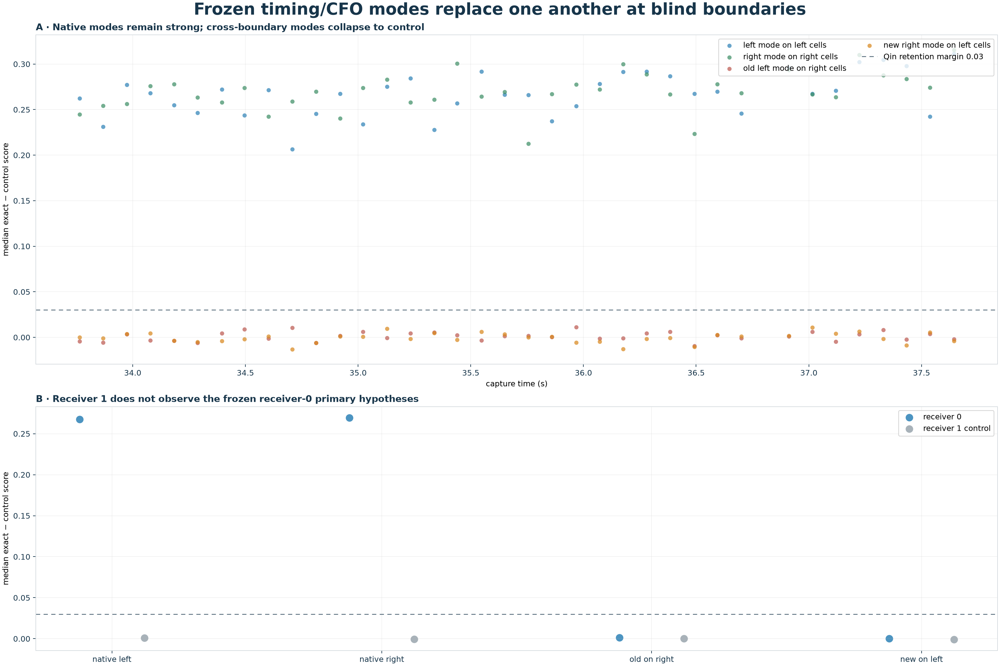
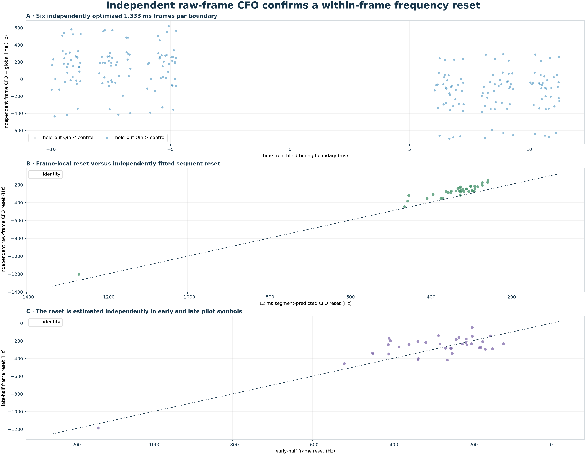
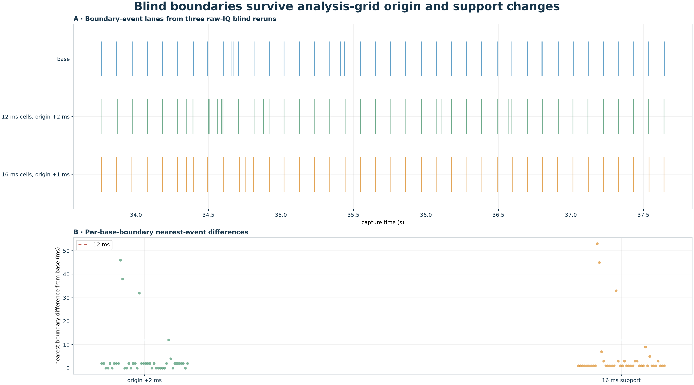
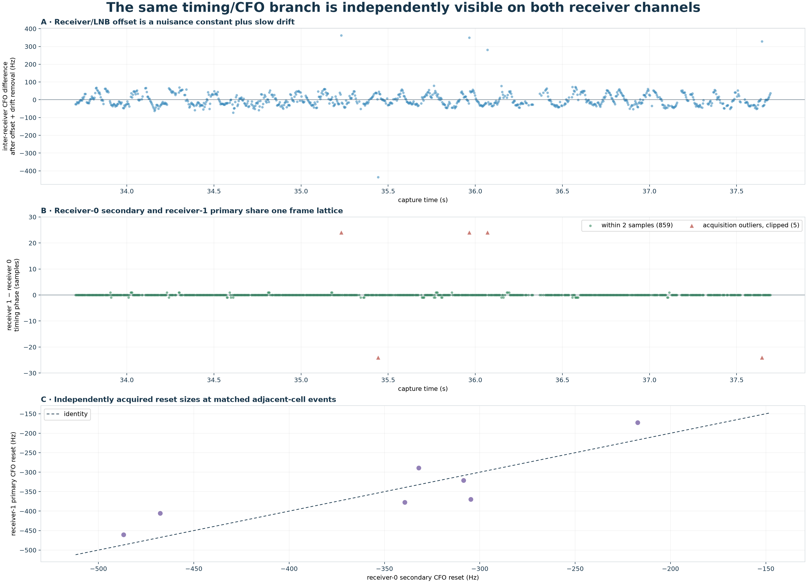

# What causes the `470384` timing–CFO sawtooth?

> **Interpretation update (2026-08-24):** The raw-frame, cross-fit, grid, and
> cross-channel results below remain valid. Their former scheduler/source-state
> ownership inference is superseded: both receiver channels share one Pluto
> refill, and unrepresented RF time at refill handoffs quantitatively explains
> the common timing and CFO changes. See
> [Refill-time compression explains the Starlink CFO sawtooth](2026_08_24_refill_time_compression_sawtooth.md).

## Abstract

Four additional raw-IQ experiments distinguish an analysis-window artifact, a
pure inter-frame phase alias, and a persistent physical carrier step from a
replacement of the Qin-compatible timing/CFO state.  At 37
well-supported blind boundaries, the native modes have median exact-minus-control
margins of 0.267 and
0.270.  Freezing the old mode and testing
it after the transition reduces the median margin to
0.0015; testing the new mode before the
transition gives 0.0001.  Neither crossed
mode passes the 0.03 Qin gate at any boundary.  Thus a Qin-supported state is
being replaced, not merely moved in CFO while its timing persists.

Independent 1.333 ms raw-frame fits recover a median reset of
-268.2 Hz.  They give each frame an arbitrary
carrier phase and use no 20 ms CFO.  Applying additional random per-frame phases
changes the recovered CFO by at most
0 Hz, so a pure phase
discontinuity between frames cannot generate this estimator's sawtooth.

Finally, an independent full blind acquisition on receiver 1 finds the same
timing branch as receiver 0's secondary path in
864 common cells.  Their median timing-phase
difference is 0.0 samples,
and 99.4%
agree within two samples;
the large -564.34 kHz
receiver/LNB offset is absorbed as a nuisance constant plus only
-3.72 Hz/s drift.

## Motivation and hypotheses

The observed approximately 104 ms ramps could arise from four different
mechanisms:

1. **Analysis-window artifact:** the persisted 20 ms boundaries or the later
   12 ms blind grid impose the resets.
2. **Pure carrier-phase alias:** continuous CFO is re-labelled when carrier
   phase jumps between frames.
3. **Physical CFO retune of one continuing signal:** timing and Qin support
   persist while only frequency changes.
4. **Scheduled timing/source-state replacement:** one Qin-compatible burst or
   timing lattice disappears and another appears with a different timing phase
   and CFO intercept.

The experiments below are designed to falsify these signatures rather than to
select the visually nicest curve.

## Experiment 1 — freeze each mode and cross the boundary

For every adjacent fitted blind segment, five non-overlapping-safe 12 ms cells
are selected on each side.  The left timing lattice and local CFO line are
frozen and evaluated on both sides; the right mode is evaluated symmetrically.
No timing or CFO re-optimization is allowed in the crossed tests.

| receiver-0 hypothesis | median exact score | median exact − control | fraction above 0.03 |
| --- | ---: | ---: | ---: |
| left mode on left cells | 0.290 | 0.267 | 100.0% |
| right mode on right cells | 0.291 | 0.270 | 100.0% |
| old left mode on right cells | 0.021 | 0.0015 | 0.0% |
| new right mode on left cells | 0.022 | 0.0001 | 0.0% |

The old state does not coexist measurably with the new state in these safe
cells.  This strongly disfavors a simple CFO retune of one continuous timing
lattice and also disfavors a winner-take-all fit switching between two
simultaneously visible modes.  It is consistent with scheduled burst, beam,
source, or timing-state replacement.  The experiment cannot distinguish those
four transmitter-side labels by itself.

## Experiment 2 — optimize individual raw frames

For each boundary, three frames 6–10 ms before and three frames 6–10 ms after
are built from the blind timing lattices.  CFO is maximized independently inside
each 1.333 ms raw frame using even Qin symbols.  Odd symbols and the rolled
control are held out.  No persisted 20 ms timing or CFO enters this fit.

| frame-local statistic | result |
| --- | ---: |
| raw frames | 222 |
| boundaries with 3+3 frames | 37 |
| held-out exact > control | 100.0% |
| median absolute frame CFO − segment line | 25.0 Hz |
| median direct frame reset | -268.2 Hz |
| 10–90% direct reset | -351.8 to -209.9 Hz |
| fraction of direct resets negative | 100.0% |
| direct-frame versus segment-jump correlation | 0.985 |
| early-half versus late-half jump correlation | 0.831 |

The estimator takes the magnitude of each frame's complex matched correlation,
so a common phase rotation of a whole frame is analytically a nuisance that
cannot move the CFO maximum.  The numerical random-phase control confirms this
to the reported grid precision.  The reset must therefore affect timing and/or
the phase *slope within a frame*, not only phase continuity between frames.

## Experiment 3 — move the blind grid

The complete 33.7–37.7 s raw interval is searched again with the 12 ms cell
origin shifted by 2 ms, and with 16 ms cells whose origin is shifted by 1 ms.

| blind rerun | boundaries | base boundaries within 12 ms | median nearest difference | global rate | median local rate | median spacing |
| --- | ---: | ---: | ---: | ---: | ---: | ---: |
| base 12/4 ms | 42 | — | — | -7.0127 kHz/s | -3.6556 kHz/s | 104.0 ms |
| origin +2 ms | 45 | 38/42 | 2.0 ms | -7.0123 kHz/s | -3.6799 kHz/s | 104.0 ms |
| 16 ms support | 40 | 39/42 | 1.0 ms | -7.0104 kHz/s | -3.6450 kHz/s | 104.0 ms |

The event sequence, global rate, local ramp rate, and 104 ms cadence survive
both grid changes.  A small number of short gaps are split or merged, which
changes the raw segment count but not the central result.

## Experiment 4 — independent receiver branch

Receiver 1 was first tested at the frozen receiver-0 hypotheses and then scanned
blindly in 100 uniformly sampled cells.  It produced
100 cells passing the same Qin gate.  The
initial frozen test failed because receiver 1's strongest path corresponds to
receiver 0's **secondary**, not primary, blind branch.

Across 864 cells shared by those paths, the
timing-phase difference has median
0.0 samples and MAD
0.0 samples;
99.4% are
within two samples.  Their CFO
difference is -564.34 kHz
at 35.646 s, with only
-3.72 Hz/s differential drift and
40.6 Hz detrended RMS.

The receiver-0 branch has
7 directly adjacent-cell events;
all 7 are found on receiver 1 within 8 ms.
Their timing jumps agree within two samples in
100.0%
of cases, and their independently measured CFO resets correlate at
0.872.  This is strong
evidence that the resets belong to the received signal/timing state, not to one
receiver channel's optimization.  It also demonstrates why an unknown LNB
constant does not prevent the comparison: subtracting the inter-receiver offset
leaves the same event sequence and reset structure.

All 38 receiver-1 adjacent-cell
events fit a 104.871 ms linear
cadence with 1.66 ms RMS timing
error.  That error is below the 4 ms blind-cell hop.  This is evidence for a
scheduler-like event clock, but it is not yet an identified Starlink protocol
period.

The two channels share one recorded stream but do not have a declared absolute
phase calibration, so this experiment still does not identify which hardware or
transmitter element owns the common state changes.

This distinction agrees with Qin et al.'s published signal model: Starlink
frames run at up to 750 Hz, the edge pilots repeat across frames and sources,
and carrier phase can be discontinuous between frames.  Their model does not
identify a roughly 104.9 ms retune.  The present experiment adds evidence for a
repeating timing/CFO *state replacement*, not proof of an oscillator command.
[Qin et al., *Unveiling Starlink's Downlink Waveform via Signal Processing*](https://radionavlab.ae.utexas.edu/wp-content/uploads/qin_pilots_starlink_dl.pdf)

The strongest supported interpretation is therefore:

- the sawtooth is not imposed by the 20 ms GLRT windows or the 12 ms blind grid;
- it is not a pure arbitrary phase jump between otherwise identical frames;
- each event replaces the currently visible Qin timing/CFO state;
- the same branch, timing jumps, and correlated CFO resets are independently
  visible through two receiver channels after removing their LNB/CFO offset;
- the approximately −300 Hz CFO intercept change is measurable within
  independently optimized 1.333 ms frames;
- the present data do **not** establish that a Starlink oscillator physically
  retunes every 104 ms.  Burst scheduling, beam/source handoff, or another
  waveform timing state remains the more careful description.

## Methods and data

- Capture: `cap-20260821T140820-470384cc9284`
- Stream / receiver / edge: `stream-0` / receiver 0 / upper edge
- Raw interval: `33.700`–`37.700` s
- Sample rate: `2.5` MS/s
- Base blind input: `reports/figures/2026_08_23_470384_blind_timing_cfo/blind-timing-cfo-results.json`
- Variant commands: the same blind tool with `--start-s 33.702` for the shifted
  origin and `--start-s 33.701 --cell-duration-s 0.016` for the changed support.
- Receiver-1 command: the same blind tool with `--receiver-id 1`; the compact
  paired-path evidence is persisted in this report's result JSON.
- All recording access was read-only; no TLE, Doppler trajectory, or 20 ms
  candidate was used to fit these experiments.
